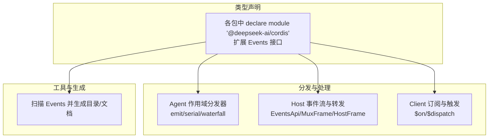
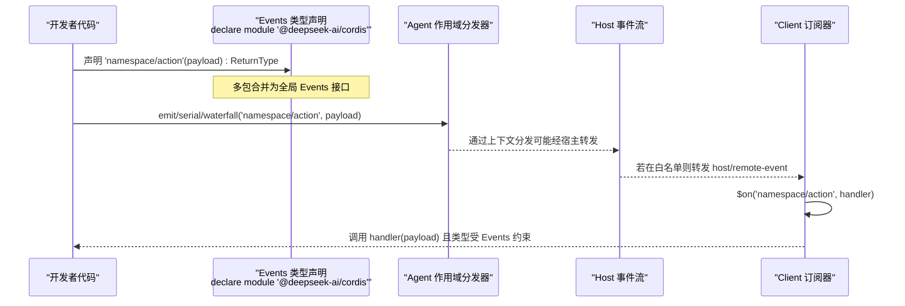
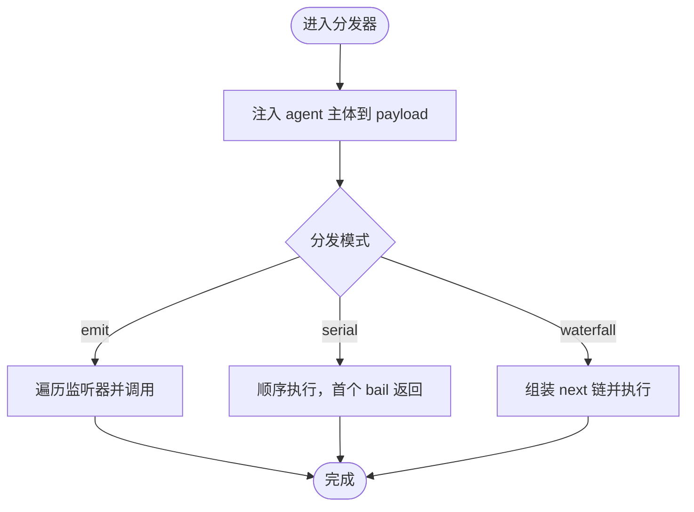
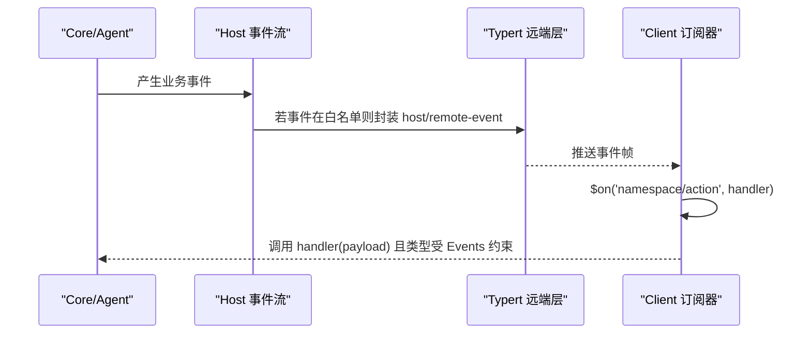
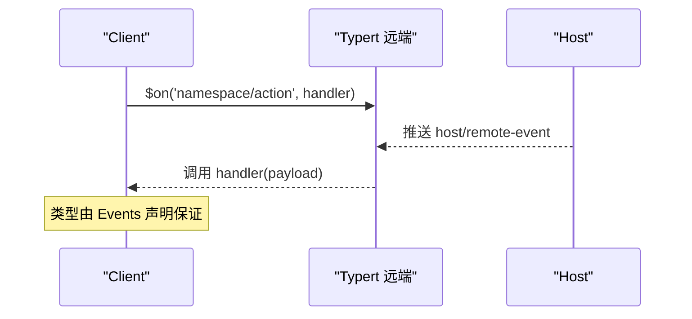

# 事件声明与类型系统

<cite>
**本文引用的文件**
- [packages/core/agent/src/dispatch.ts](file://packages/core/agent/src/dispatch.ts)
- [packages/host/apiproxy/src/api/events.ts](file://packages/host/apiproxy/src/api/events.ts)
- [packages/api/gateway/tests/gateway.client.spec.ts](file://packages/api/gateway/tests/gateway.client.spec.ts)
- [packages/api/gateway/src/types.ts](file://packages/api/gateway/src/types.ts)
- [packages/attachment/attachment/src/index.ts](file://packages/attachment/attachment/src/index.ts)
- [packages/client/runtime/src/client/index.ts](file://packages/client/runtime/src/client/index.ts)
- [packages/client/ui-commands/src/client/service.ts](file://packages/client/ui-commands/src/client/service.ts)
- [packages/client/ui-input-trigger/src/types.ts](file://packages/client/ui-input-trigger/src/types.ts)
- [packages/client/locale/src/client/index.ts](file://packages/client/locale/src/client/index.ts)
- [packages/client/modules/src/client/manifest.ts](file://packages/client/modules/src/client/manifest.ts)
- [packages/client/modules/src/index.ts](file://packages/client/modules/src/index.ts)
- [packages/client/connection/src/rpc-host.ts](file://packages/client/connection/src/rpc-host.ts)
- [packages/client/ui-conversation/src/client/contract/slots.ts](file://packages/client/ui-conversation/src/client/contract/slots.ts)
- [packages/client/ui-conversation/src/client/index.ts](file://packages/client/ui-conversation/src/client/index.ts)
- [packages/client/ui-commands/src/client/index.ts](file://packages/client/ui-commands/src/client/index.ts)
- [packages/client/ui-input-trigger/src/client/index.ts](file://packages/client/ui-input-trigger/src/client/index.ts)
- [packages/boot/app-boot/src/index.ts](file://packages/boot/app-boot/src/index.ts)
- [packages/boot/cmdline/src/index.ts](file://packages/boot/cmdline/src/index.ts)
- [packages/extensions/tool-cordis/src/inspect.ts](file://packages/extensions/tool-cordis/src/inspect.ts)
- [scripts/gen-cordis-catalog.ts](file://scripts/gen-cordis-catalog.ts)
</cite>

## 目录
1. [简介](#简介)
2. [项目结构](#项目结构)
3. [核心组件](#核心组件)
4. [架构总览](#架构总览)
5. [详细组件分析](#详细组件分析)
6. [依赖关系分析](#依赖关系分析)
7. [性能考虑](#性能考虑)
8. [故障排查指南](#故障排查指南)
9. [结论](#结论)
10. [附录](#附录)

## 简介
本文件系统性阐述 Cordis 中的“事件声明与类型系统”，聚焦以下主题：
- 如何通过 TypeScript 模块合并机制扩展全局 Events 接口，以声明自定义事件类型。
- 事件的命名约定（namespace/action）与参数类型定义。
- 使用 import type {} 引入类型声明以避免运行时依赖。
- 事件类型的继承与组合方式，以及跨插件共享事件定义的实践。
- 结合 Agent 作用域的事件分发器、宿主事件转发与客户端订阅的端到端流程。
- 最佳实践：清晰的命名、严格的类型安全、可维护的跨包契约。

## 项目结构
Cordis 的事件体系由三部分构成：
- 事件类型声明：通过 declare module '@deepseek-ai/cordis' 对全局 Events 接口进行模块合并扩展，各包在自身范围内声明事件签名。
- 事件分发与处理：Core/Agent 提供按作用域分发的 emit/serial/waterfall 能力；Host 暴露事件流与远端转发通道；Client 提供 $on/$dispatch 等订阅与触发能力。
- 工具与生成：工具链会扫描 Events 声明并生成文档或目录，确保契约可见性与一致性。

图表来源
- [packages/core/agent/src/dispatch.ts:1-177](file://packages/core/agent/src/dispatch.ts#L1-L177)
- [packages/host/apiproxy/src/api/events.ts:47-156](file://packages/host/apiproxy/src/api/events.ts#L47-L156)
- [packages/api/gateway/tests/gateway.client.spec.ts:18-36](file://packages/api/gateway/tests/gateway.client.spec.ts#L18-L36)
- [scripts/gen-cordis-catalog.ts:180-200](file://scripts/gen-cordis-catalog.ts#L180-L200)

章节来源
- [packages/core/agent/src/dispatch.ts:1-177](file://packages/core/agent/src/dispatch.ts#L1-L177)
- [packages/host/apiproxy/src/api/events.ts:47-156](file://packages/host/apiproxy/src/api/events.ts#L47-L156)
- [packages/api/gateway/tests/gateway.client.spec.ts:18-36](file://packages/api/gateway/tests/gateway.client.spec.ts#L18-L36)
- [scripts/gen-cordis-catalog.ts:180-200](file://scripts/gen-cordis-catalog.ts#L180-L200)

## 核心组件
- 事件类型声明（模块合并）
  - 通过在多个文件中重复 declare module '@deepseek-ai/cordis' { interface Events { ... } }，将不同包的自定义事件合并到全局 Events 接口中。
  - 示例位置：测试用例中声明 fixture/* 系列事件；多个 UI/Client/Boot 包也各自扩展 Events。
- Agent 作用域事件分发器
  - agentEvents 返回一个强类型的调度对象，支持 emit（通知）、serial（串行）、waterfall（瀑布）。
  - 自动注入 agent 主体到 payload，保证作用域键与负载一致，避免误用。
- Host 事件流与转发
  - EventsApi 暴露 mux 与 host 两个逻辑流，MuxFrame/HostFrame 描述帧结构。
  - host/remote-event 允许白名单转发宿主事件至客户端，保持类型来自事件所有者包的 Events 声明。
- Client 订阅与触发
  - 客户端通过 remote.$on 订阅被选中的远端事件，监听器签名由事件声明决定。
  - 未选中的事件无法订阅，保障最小暴露面与类型安全。

章节来源
- [packages/api/gateway/tests/gateway.client.spec.ts:18-36](file://packages/api/gateway/tests/gateway.client.spec.ts#L18-L36)
- [packages/core/agent/src/dispatch.ts:54-82](file://packages/core/agent/src/dispatch.ts#L54-L82)
- [packages/host/apiproxy/src/api/events.ts:47-156](file://packages/host/apiproxy/src/api/events.ts#L47-L156)

## 架构总览
下图展示从“事件类型声明”到“分发/转发/订阅”的完整链路，体现命名约定 namespace/action 与类型安全的贯穿。

图表来源
- [packages/api/gateway/tests/gateway.client.spec.ts:18-36](file://packages/api/gateway/tests/gateway.client.spec.ts#L18-L36)
- [packages/core/agent/src/dispatch.ts:107-149](file://packages/core/agent/src/dispatch.ts#L107-L149)
- [packages/host/apiproxy/src/api/events.ts:144-155](file://packages/host/apiproxy/src/api/events.ts#L144-L155)

## 详细组件分析

### 事件类型声明与模块合并
- 命名约定
  - 采用 namespace/action 格式，如 'fixture/changed'、'fix/x'。
  - 每个包在自己的文件中声明同名事件，TypeScript 编译器会将所有 Events 合并。
- 参数与返回值
  - 事件函数签名形如 (payload?: Payload, ...rest?): ReturnType。
  - 参数类型即事件负载，ReturnType 可为 void（通知型）或 Promise<T>/T（决策/转换型）。
- 跨包共享
  - 通过模块合并，多个包可同时扩展同一 Events 接口，形成统一契约。
  - 客户端订阅时，仅能订阅被显式选择的事件，避免泄露未授权事件。

章节来源
- [packages/api/gateway/tests/gateway.client.spec.ts:18-36](file://packages/api/gateway/tests/gateway.client.spec.ts#L18-L36)
- [packages/attachment/attachment/src/index.ts:22-26](file://packages/attachment/attachment/src/index.ts#L22-L26)
- [packages/client/runtime/src/client/index.ts:153-156](file://packages/client/runtime/src/client/index.ts#L153-L156)
- [packages/client/ui-commands/src/client/service.ts:27-31](file://packages/client/ui-commands/src/client/service.ts#L27-L31)
- [packages/client/ui-input-trigger/src/types.ts:223-226](file://packages/client/ui-input-trigger/src/types.ts#L223-L226)
- [packages/client/locale/src/client/index.ts:72-78](file://packages/client/locale/src/client/index.ts#L72-L78)
- [packages/client/modules/src/client/manifest.ts:36-40](file://packages/client/modules/src/client/manifest.ts#L36-L40)
- [packages/client/modules/src/index.ts:39-43](file://packages/client/modules/src/index.ts#L39-L43)
- [packages/client/connection/src/rpc-host.ts:35-39](file://packages/client/connection/src/rpc-host.ts#L35-L39)
- [packages/client/ui-conversation/src/client/contract/slots.ts:309-313](file://packages/client/ui-conversation/src/client/contract/slots.ts#L309-L313)
- [packages/client/ui-conversation/src/client/index.ts:40-44](file://packages/client/ui-conversation/src/client/index.ts#L40-L44)
- [packages/client/ui-commands/src/client/index.ts:31-35](file://packages/client/ui-commands/src/client/index.ts#L31-L35)
- [packages/client/ui-input-trigger/src/client/index.ts:30-34](file://packages/client/ui-input-trigger/src/client/index.ts#L30-L34)
- [packages/boot/app-boot/src/index.ts:24-28](file://packages/boot/app-boot/src/index.ts#L24-L28)
- [packages/boot/cmdline/src/index.ts:44-48](file://packages/boot/cmdline/src/index.ts#L44-L48)

### Agent 作用域事件分发器
- 设计要点
  - 通过 agentCarrier 绑定 Scoped<Agent> 作为 thisArg，确保事件作用域与 agent 主体一致。
  - emit：广播通知，逐个调用监听器，异常与拒绝被隔离记录，不阻塞后续监听器。
  - serial：串行执行，首个 bail 值即为结果。
  - waterfall：瀑布式中间件，最后一个参数为 next，天然支持拦截与增强。
- 类型推导
  - 基于 Events 接口，自动推导事件名、负载与尾部参数（next），实现强类型分发。

图表来源
- [packages/core/agent/src/dispatch.ts:107-149](file://packages/core/agent/src/dispatch.ts#L107-L149)

章节来源
- [packages/core/agent/src/dispatch.ts:15-82](file://packages/core/agent/src/dispatch.ts#L15-L82)
- [packages/core/agent/src/dispatch.ts:107-149](file://packages/core/agent/src/dispatch.ts#L107-L149)

### Host 事件流与远端转发
- 事件流
  - mux：聚合会话事件、审批/问答请求与状态变更，支持重连与回放。
  - host：会话生命周期、工作区变更、代理错误等主机级事件。
- 远端事件转发
  - host/remote-event 将宿主事件原样转发给客户端，事件名与参数类型由事件所有者包的 Events 声明决定。
  - 通过 TypertRemoteEventSelection 控制哪些事件可被客户端订阅，实现最小暴露面。

图表来源
- [packages/host/apiproxy/src/api/events.ts:47-156](file://packages/host/apiproxy/src/api/events.ts#L47-L156)
- [packages/api/gateway/tests/gateway.client.spec.ts:38-68](file://packages/api/gateway/tests/gateway.client.spec.ts#L38-L68)

章节来源
- [packages/host/apiproxy/src/api/events.ts:47-156](file://packages/host/apiproxy/src/api/events.ts#L47-L156)
- [packages/api/gateway/tests/gateway.client.spec.ts:38-68](file://packages/api/gateway/tests/gateway.client.spec.ts#L38-L68)

### 客户端订阅与类型安全
- 订阅接口
  - remote.$on(event, handler)：handler 的参数类型由 Events 声明决定。
  - 仅允许订阅 TypertRemoteEventSelection 中选中的事件，未选中事件在编译时报错。
- 错误隔离
  - 单个监听器抛出异常或被拒绝，不会中断其他监听器的执行，错误被捕获并记录。

图表来源
- [packages/api/gateway/tests/gateway.client.spec.ts:74-84](file://packages/api/gateway/tests/gateway.client.spec.ts#L74-L84)
- [packages/api/gateway/tests/gateway.client.spec.ts:721-800](file://packages/api/gateway/tests/gateway.client.spec.ts#L721-L800)

章节来源
- [packages/api/gateway/tests/gateway.client.spec.ts:74-84](file://packages/api/gateway/tests/gateway.client.spec.ts#L74-L84)
- [packages/api/gateway/tests/gateway.client.spec.ts:721-800](file://packages/api/gateway/tests/gateway.client.spec.ts#L721-L800)

### 场景化事件示例（无代码片段，仅路径指引）
- 简单通知（void 返回）
  - 参考：[packages/api/gateway/tests/gateway.client.spec.ts:18-36](file://packages/api/gateway/tests/gateway.client.spec.ts#L18-L36)
- 数据转换（Promise<T> 返回）
  - 参考：[packages/api/gateway/tests/gateway.client.spec.ts:45-52](file://packages/api/gateway/tests/gateway.client.spec.ts#L45-L52)
- 策略决策（waterfall/serial 参与）
  - 参考：[packages/core/agent/src/dispatch.ts:64-82](file://packages/core/agent/src/dispatch.ts#L64-L82)

章节来源
- [packages/api/gateway/tests/gateway.client.spec.ts:18-52](file://packages/api/gateway/tests/gateway.client.spec.ts#L18-L52)
- [packages/core/agent/src/dispatch.ts:64-82](file://packages/core/agent/src/dispatch.ts#L64-L82)

### 事件类型的继承与组合
- 继承
  - 通过模块合并，新包可继续扩展已有 Events，形成“继承式”扩展。
- 组合
  - 多个包分别声明不同 namespace 的事件，最终在应用启动时合并为一个统一的 Events 接口。
- 共享
  - 通过 import type {} 引入类型而不引入运行时依赖，便于跨包共享事件类型。

章节来源
- [packages/attachment/attachment/src/index.ts:22-26](file://packages/attachment/attachment/src/index.ts#L22-L26)
- [packages/client/runtime/src/client/index.ts:153-156](file://packages/client/runtime/src/client/index.ts#L153-L156)
- [packages/client/ui-commands/src/client/service.ts:27-31](file://packages/client/ui-commands/src/client/service.ts#L27-L31)
- [packages/client/ui-input-trigger/src/types.ts:223-226](file://packages/client/ui-input-trigger/src/types.ts#L223-L226)
- [packages/client/locale/src/client/index.ts:72-78](file://packages/client/locale/src/client/index.ts#L72-L78)
- [packages/client/modules/src/client/manifest.ts:36-40](file://packages/client/modules/src/client/manifest.ts#L36-L40)
- [packages/client/modules/src/index.ts:39-43](file://packages/client/modules/src/index.ts#L39-L43)
- [packages/client/connection/src/rpc-host.ts:35-39](file://packages/client/connection/src/rpc-host.ts#L35-L39)
- [packages/client/ui-conversation/src/client/contract/slots.ts:309-313](file://packages/client/ui-conversation/src/client/contract/slots.ts#L309-L313)
- [packages/client/ui-conversation/src/client/index.ts:40-44](file://packages/client/ui-conversation/src/client/index.ts#L40-L44)
- [packages/client/ui-commands/src/client/index.ts:31-35](file://packages/client/ui-commands/src/client/index.ts#L31-L35)
- [packages/client/ui-input-trigger/src/client/index.ts:30-34](file://packages/client/ui-input-trigger/src/client/index.ts#L30-L34)
- [packages/boot/app-boot/src/index.ts:24-28](file://packages/boot/app-boot/src/index.ts#L24-L28)
- [packages/boot/cmdline/src/index.ts:44-48](file://packages/boot/cmdline/src/index.ts#L44-L48)

### 工具与生成：事件目录与文档
- 工具会扫描 Events 声明，生成事件目录与文档，确保契约可见性。
- 渲染时对 Events 接口进行解析，输出事件列表与签名摘要。

章节来源
- [packages/extensions/tool-cordis/src/inspect.ts:314-320](file://packages/extensions/tool-cordis/src/inspect.ts#L314-L320)
- [scripts/gen-cordis-catalog.ts:180-200](file://scripts/gen-cordis-catalog.ts#L180-L200)

## 依赖关系分析
- 耦合与内聚
  - 事件类型声明与事件消费解耦：声明位于事件所有者包，消费方仅依赖类型。
  - Agent 分发器与具体事件无关，仅依赖 Events 接口，具备高内聚与低耦合。
- 外部依赖
  - Host 事件流与 Typert 远端层协作，通过白名单控制事件转发范围。
- 循环依赖
  - 通过类型导入（import type）避免循环依赖风险。

图表来源
- [packages/core/agent/src/dispatch.ts:107-149](file://packages/core/agent/src/dispatch.ts#L107-L149)
- [packages/host/apiproxy/src/api/events.ts:47-156](file://packages/host/apiproxy/src/api/events.ts#L47-L156)
- [packages/api/gateway/tests/gateway.client.spec.ts:74-84](file://packages/api/gateway/tests/gateway.client.spec.ts#L74-L84)

章节来源
- [packages/core/agent/src/dispatch.ts:107-149](file://packages/core/agent/src/dispatch.ts#L107-L149)
- [packages/host/apiproxy/src/api/events.ts:47-156](file://packages/host/apiproxy/src/api/events.ts#L47-L156)
- [packages/api/gateway/tests/gateway.client.spec.ts:74-84](file://packages/api/gateway/tests/gateway.client.spec.ts#L74-L84)

## 性能考虑
- 分发器优化
  - agentEvents 构建一次并在热路径复用，减少分配与查找开销。
  - emit 模式下对每个监听器独立 try/catch 与 Promise 捕获，避免单点失败影响整体。
- 事件转发
  - 仅白名单事件被转发，降低网络与序列化成本。
- 类型检查
  - 使用 import type {} 仅在编译期生效，零运行时开销。

[本节为通用指导，无需特定文件引用]

## 故障排查指南
- 事件未收到
  - 确认事件是否在 TypertRemoteEventSelection 中被选中。
  - 检查客户端是否正确调用 $on 并持有订阅句柄。
- 类型不匹配
  - 核对 Events 声明中的参数类型与监听器签名是否一致。
  - 确认 import type {} 引入的是正确的类型路径。
- 监听器异常
  - 查看日志中关于 listener threw/rejected 的记录，定位问题监听器。
- 作用域不一致
  - 使用 Agent 作用域分发器时，确保通过 agentEvents 或 emitAgentEvent 调用，避免手动构造导致作用域错位。

章节来源
- [packages/api/gateway/tests/gateway.client.spec.ts:741-800](file://packages/api/gateway/tests/gateway.client.spec.ts#L741-L800)
- [packages/core/agent/src/dispatch.ts:120-149](file://packages/core/agent/src/dispatch.ts#L120-L149)

## 结论
Cordis 通过 TypeScript 模块合并机制，实现了跨包、可扩展且类型安全的事件系统。事件以 namespace/action 命名，参数与返回值严格受 Events 接口约束；Agent 作用域分发器确保作用域一致性；Host 事件流与客户端订阅配合白名单机制，既保证了安全性又提升了可维护性。遵循本文的最佳实践，可在大型项目中建立清晰、稳定、可演进的事件契约。

[本节为总结性内容，无需特定文件引用]

## 附录
- 最佳实践建议
  - 命名清晰：使用领域相关的 namespace 与具象 action，避免模糊名称。
  - 类型安全：优先使用 import type {} 引入类型，避免运行时依赖。
  - 最小暴露：仅在 TypertRemoteEventSelection 中选择必要事件，减少攻击面。
  - 作用域正确：使用 Agent 作用域分发器，避免手动构造导致的作用域错位。
  - 可观测性：对监听器异常进行捕获与记录，便于快速定位问题。
  - 文档同步：利用工具生成事件目录与文档，保持契约可见性。

[本节为通用指导，无需特定文件引用]