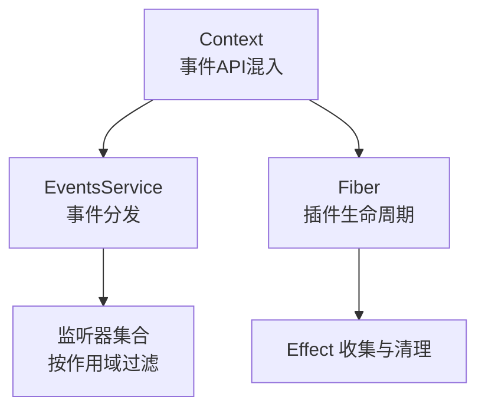
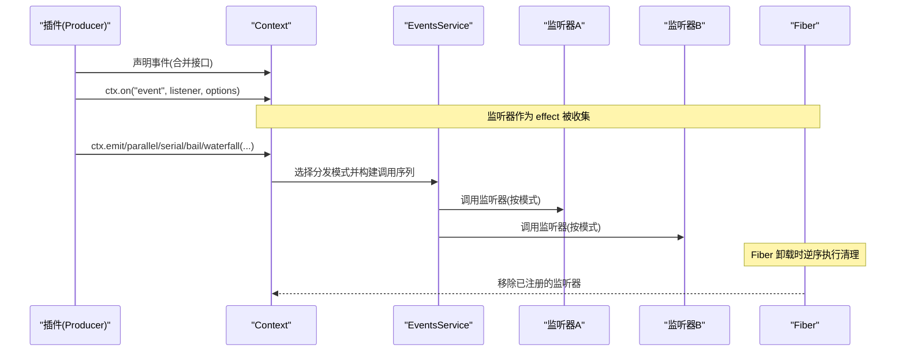
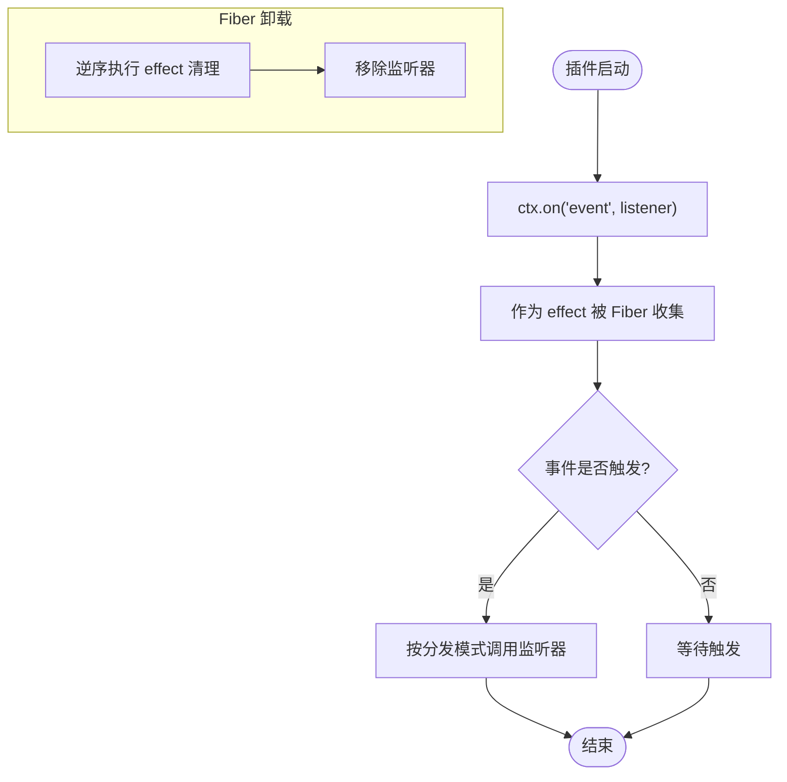
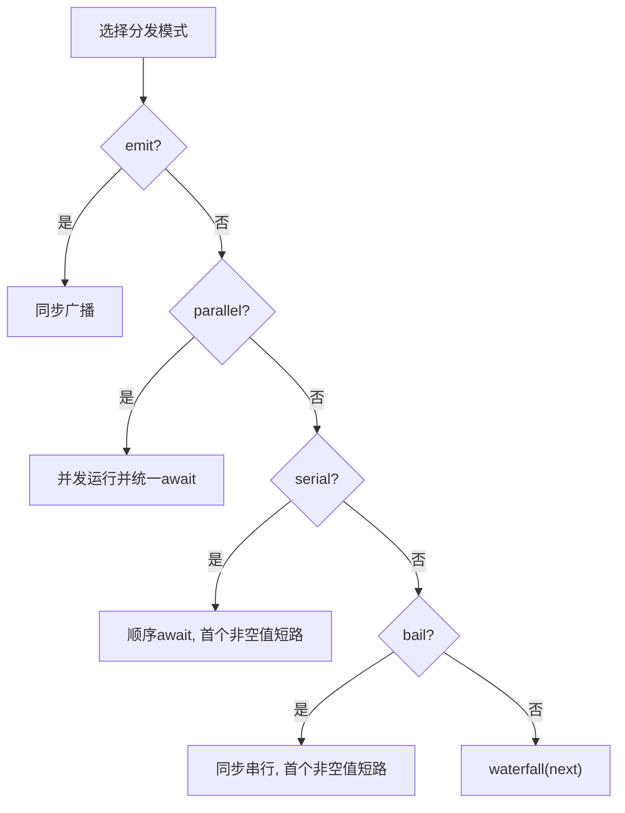
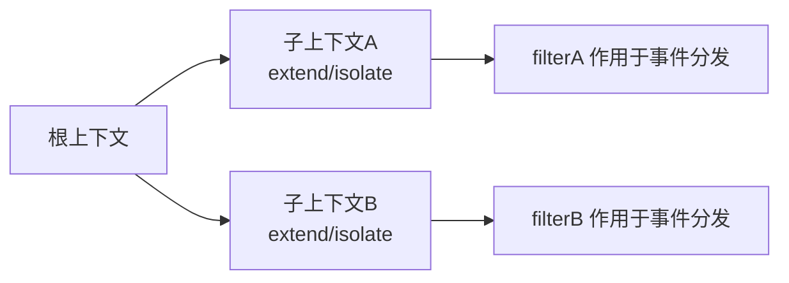
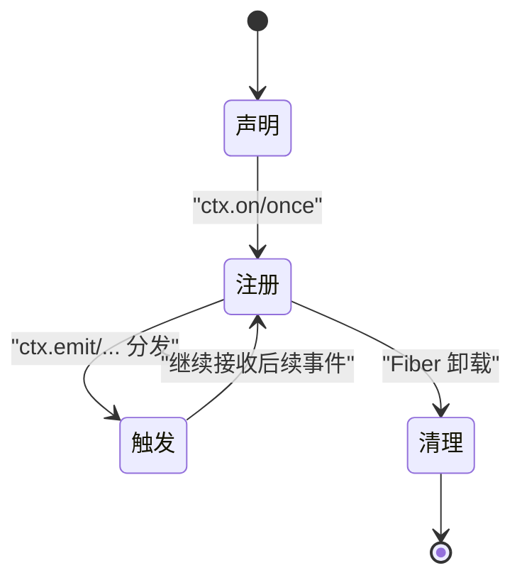
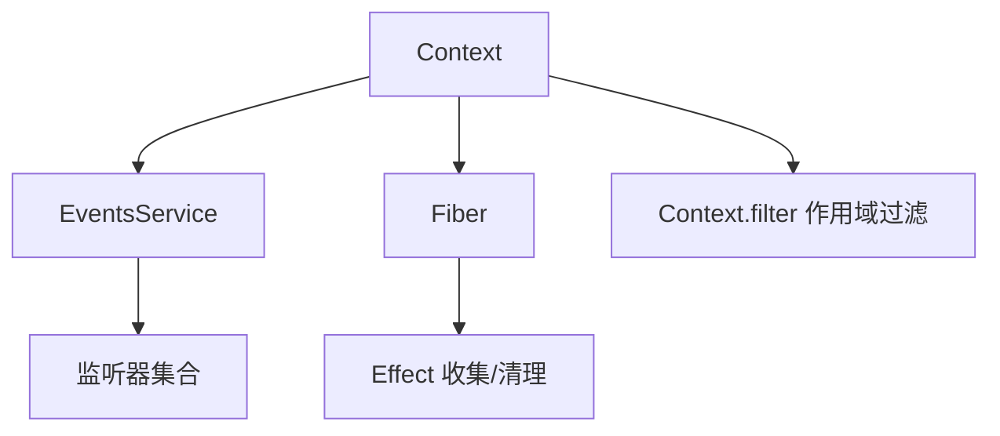

# 事件生命周期管理

<cite>
**本文引用的文件**
- [events.md](file://docs/cordis-api/events.md)
- [context.md](file://docs/cordis-api/context.md)
- [fiber.md](file://docs/cordis-api/fiber.md)
- [04-events.md](file://docs/cordis-tutorial/04-events.md)
</cite>

## 目录
1. [简介](#简介)
2. [项目结构](#项目结构)
3. [核心组件](#核心组件)
4. [架构总览](#架构总览)
5. [详细组件分析](#详细组件分析)
6. [依赖关系分析](#依赖关系分析)
7. [性能考量](#性能考量)
8. [故障排查指南](#故障排查指南)
9. [结论](#结论)
10. [附录](#附录)

## 简介
本文件围绕事件生命周期管理展开，聚焦以下目标：
- 解释如何通过 ctx.on() 注册监听器，并在插件（Fiber）销毁时自动移除监听器。
- 梳理事件的完整生命周期：声明、注册、触发到清理。
- 说明作用域隔离机制，确保监听器仅在正确的上下文中生效。
- 给出事件性能优化建议（监听器数量控制与内存管理）。
- 提供事件调试与监控方法（追踪事件流向与诊断性能问题）。
- 总结事件设计最佳实践（命名规范、参数设计与错误处理策略）。

## 项目结构
事件系统由“上下文（Context）—事件总线（EventsService）—纤维（Fiber）”共同协作完成：
- Context 将事件 API（on、emit、parallel、serial、bail、waterfall）混入到 ctx 上，并提供作用域隔离能力（extend/isolate/intercept）。
- Fiber 负责插件实例的生命周期与效果（effect）收集，在卸载时按逆序执行清理。
- EventsService 提供事件分发模式（emit、parallel、serial、bail、waterfall），并配合上下文过滤器实现作用域隔离。

图表来源
- [context.md:120-128](file://docs/cordis-api/context.md#L120-L128)
- [fiber.md:8-37](file://docs/cordis-api/fiber.md#L8-L37)
- [events.md:8-123](file://docs/cordis-api/events.md#L8-L123)

章节来源
- [context.md:120-128](file://docs/cordis-api/context.md#L120-L128)
- [fiber.md:8-37](file://docs/cordis-api/fiber.md#L8-L37)
- [events.md:8-123](file://docs/cordis-api/events.md#L8-L123)

## 核心组件
- 事件声明与类型：通过合并接口声明事件名与监听器签名，使 ctx.emit/on 具备完整类型提示。
- 事件注册：ctx.on(name, listener, options?) 返回一个可调用以移除监听器的 disposer；ctx.once 首次调用后自动移除。
- 事件分发模式：
  - emit：同步广播，不等待返回值或 Promise。
  - parallel：并发运行所有监听器，统一 await。
  - serial：顺序 await，首个非空返回值短路。
  - bail：同步版本的 serial。
  - waterfall：链式中间件风格，最后一个参数为 next，支持拦截与短路。
- 作用域与过滤：Context 提供 filter 符号键用于事件分发时的作用域过滤；extend/isolate/intercept 创建子上下文以实现服务与作用域隔离。
- 自动清理：ctx.on 是 effect，随 Fiber 卸载自动移除；Fiber 的 effect 收集器会在卸载时按逆序执行清理。

章节来源
- [events.md:8-123](file://docs/cordis-api/events.md#L8-L123)
- [events.md:125-187](file://docs/cordis-api/events.md#L125-L187)
- [context.md:177-186](file://docs/cordis-api/context.md#L177-L186)
- [context.md:14-66](file://docs/cordis-api/context.md#L14-L66)
- [fiber.md:8-37](file://docs/cordis-api/fiber.md#L8-L37)

## 架构总览
下图展示了从事件声明到触发的端到端流程，以及监听器在 Fiber 生命周期中的自动清理路径。

图表来源
- [events.md:8-123](file://docs/cordis-api/events.md#L8-L123)
- [fiber.md:8-37](file://docs/cordis-api/fiber.md#L8-L37)

## 详细组件分析

### 事件声明与类型
- 使用模块合并扩展 Events 接口，声明事件名与监听器签名，使 ctx.emit/on 获得类型安全。
- 教程示例展示了 stats/report 事件的声明与使用，强调命名空间/动作的命名约定。

章节来源
- [04-events.md:14-44](file://docs/cordis-tutorial/04-events.md#L14-L44)

### 监听器注册与自动清理
- ctx.on 返回 disposer，可在需要时手动移除；同时该监听器作为 effect 被 Fiber 收集，在 Fiber 卸载时自动移除。
- ctx.once 在首次调用后自动移除自身，适合一次性响应场景。
- 由于监听器属于 effect，无需手动 removeListener，避免资源泄漏。

图表来源
- [events.md:125-171](file://docs/cordis-api/events.md#L125-L171)
- [fiber.md:8-37](file://docs/cordis-api/fiber.md#L8-L37)

章节来源
- [events.md:125-171](file://docs/cordis-api/events.md#L125-L171)
- [fiber.md:8-37](file://docs/cordis-api/fiber.md#L8-L37)

### 事件分发模式与语义
- emit：同步广播，忽略返回值与 Promise。
- parallel：并发运行所有监听器，统一 await。
- serial：顺序 await，首个非空返回值短路。
- bail：同步版本的 serial。
- waterfall：链式中间件，最后一个参数为 next，支持拦截与短路。

图表来源
- [events.md:8-123](file://docs/cordis-api/events.md#L8-L123)

章节来源
- [events.md:8-123](file://docs/cordis-api/events.md#L8-L123)

### 作用域隔离机制
- Context.filter 符号键用于事件分发时的作用域过滤，确保监听器只在正确上下文中生效。
- extend/isolate/intercept 创建子上下文，实现服务与作用域的隔离，避免跨作用域误触发。
- 通过 isolate 可将某服务的解析绑定到新标签，从而在不同作用域提供不同实现。

图表来源
- [context.md:14-66](file://docs/cordis-api/context.md#L14-L66)
- [context.md:177-186](file://docs/cordis-api/context.md#L177-L186)

章节来源
- [context.md:14-66](file://docs/cordis-api/context.md#L14-L66)
- [context.md:177-186](file://docs/cordis-api/context.md#L177-L186)

### 事件生命周期阶段
- 声明：通过合并 Events 接口定义事件名与监听器签名。
- 注册：在插件 apply 中使用 ctx.on/once 注册监听器，作为 effect 被 Fiber 收集。
- 触发：生产者通过 ctx.emit/parallel/serial/bail/waterfall 触发事件，按模式调度监听器。
- 清理：Fiber 卸载时按逆序执行 effect 清理，自动移除监听器。

图表来源
- [events.md:8-123](file://docs/cordis-api/events.md#L8-L123)
- [fiber.md:8-37](file://docs/cordis-api/fiber.md#L8-L37)

章节来源
- [events.md:8-123](file://docs/cordis-api/events.md#L8-L123)
- [fiber.md:8-37](file://docs/cordis-api/fiber.md#L8-L37)

## 依赖关系分析
- Context 依赖 EventsService 暴露事件 API，并通过 mixin 将 events 的方法混入 ctx。
- Fiber 负责 effect 收集与清理，监听器作为 effect 被纳入生命周期管理。
- 事件分发模式由 EventsService 实现，结合 Context 的作用域过滤决定监听器执行范围。

图表来源
- [context.md:120-128](file://docs/cordis-api/context.md#L120-L128)
- [fiber.md:8-37](file://docs/cordis-api/fiber.md#L8-L37)
- [events.md:8-123](file://docs/cordis-api/events.md#L8-L123)

章节来源
- [context.md:120-128](file://docs/cordis-api/context.md#L120-L128)
- [fiber.md:8-37](file://docs/cordis-api/fiber.md#L8-L37)
- [events.md:8-123](file://docs/cordis-api/events.md#L8-L123)

## 性能考量
- 监听器数量控制：
  - 避免在高频事件上注册过多监听器，优先使用并行模式（parallel）减少阻塞。
  - 对仅需一次响应的场景使用 ctx.once，防止重复监听导致累积。
- 内存管理：
  - 利用 ctx.on 的 effect 特性，让 Fiber 卸载时自动清理，避免手动维护监听器集合。
  - 谨慎使用全局监听器（options.global），仅在必要时放宽作用域过滤。
- 分发模式选择：
  - emit 适用于无副作用的轻量通知；涉及异步任务时使用 parallel 或 serial。
  - waterfall 适合中间件式处理，但需确保每个监听器正确调用 next，避免意外短路。

[本节为通用指导，不直接分析具体文件]

## 故障排查指南
- 无法触发事件：
  - 检查事件是否在 Events 接口中声明，确保 ctx.emit/on 的类型一致。
  - 确认监听器已在正确作用域注册，必要时使用 options.global 放宽过滤。
- 监听器未清理：
  - 确认监听器是通过 ctx.on/once 注册，而非原生 addEventListener。
  - 验证 Fiber 是否正确卸载，effect 清理是否被执行。
- 性能问题：
  - 统计高频事件的监听器数量，考虑拆分事件或使用批处理。
  - 使用 waterfall 时确保 next 调用路径合理，避免深层嵌套导致的栈增长。

章节来源
- [events.md:125-171](file://docs/cordis-api/events.md#L125-L171)
- [fiber.md:8-37](file://docs/cordis-api/fiber.md#L8-L37)

## 结论
事件系统在 Cordis 中以 Context-Fiber 为核心，提供类型安全的声明、灵活的注册与分发模式、以及基于 effect 的自动清理机制。通过作用域隔离与合理的分发模式选择，可以在保证功能的同时兼顾性能与可维护性。遵循命名规范、参数设计与错误处理策略，能够进一步提升系统的稳定性与可观测性。

[本节为总结，不直接分析具体文件]

## 附录
- 事件命名规范：建议使用“命名空间/动作”形式，如 stats/report，保持扁平且可读。
- 参数设计：监听器参数应明确职责，避免传递过大对象；必要时拆分为多个事件。
- 错误处理：在 waterfall 中捕获异常并决定是否继续 next；在并行模式中聚合错误以便定位。

章节来源
- [04-events.md:44-79](file://docs/cordis-tutorial/04-events.md#L44-L79)
- [events.md:97-123](file://docs/cordis-api/events.md#L97-L123)