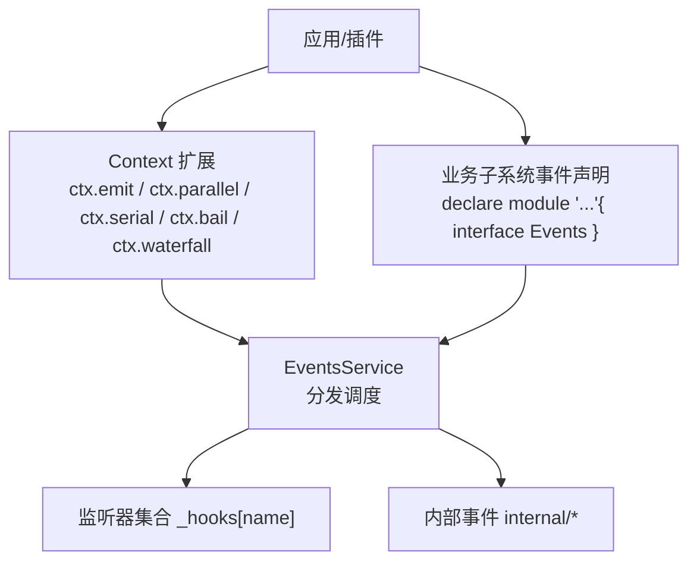
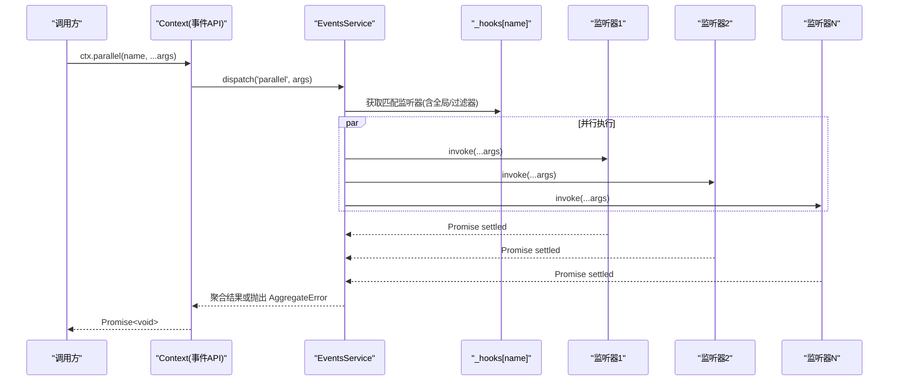
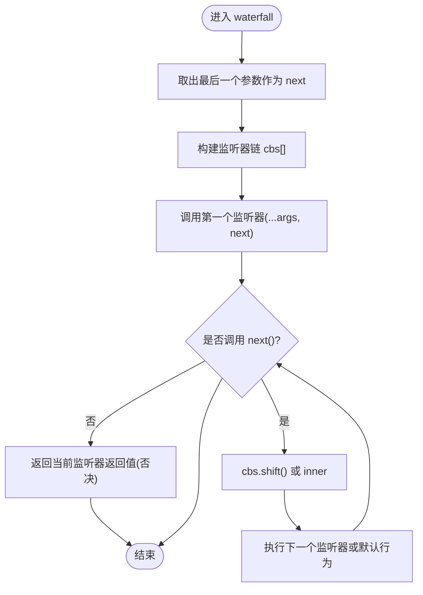
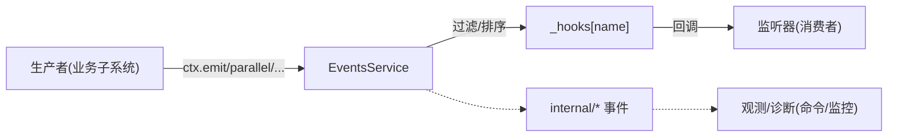

# 事件驱动通信系统

<cite>
**本文引用的文件**
- [vendor/cordis/src/events.ts](file://vendor/cordis/src/events.ts)
- [docs/cordis-api/events.md](file://docs/cordis-api/events.md)
- [docs/cordis-tutorial/04-events.md](file://docs/cordis-tutorial/04-events.md)
- [docs/event-producer-consumer.md](file://docs/event-producer-consumer.md)
- [packages/core/agent/src/runtime-types.ts](file://packages/core/agent/src/runtime-types.ts)
</cite>

## 目录
1. [简介](#简介)
2. [项目结构](#项目结构)
3. [核心组件](#核心组件)
4. [架构总览](#架构总览)
5. [详细组件分析](#详细组件分析)
6. [依赖关系分析](#依赖关系分析)
7. [性能考量](#性能考量)
8. [故障排查指南](#故障排查指南)
9. [结论](#结论)
10. [附录](#附录)

## 简介
本文件系统性阐述 Cordis 的类型化事件系统，覆盖事件声明、分发模式与监听器注册机制；重点解释五种分发模式的语义差异与适用场景：emit（观察）、parallel（并行）、serial（串行）、bail（同步短路）与 waterfall（瀑布流）。文档还深入解析 waterfall 的中间件机制与 next() 调用约定，说明 TypeScript 类型合并如何扩展 Events 接口以声明新事件类型，并提供多种常见场景的使用范式（通知、数据转换、策略决策等），最后给出性能优化与最佳实践建议。

## 项目结构
Cordis 的事件系统由核心实现与上层使用两部分组成：
- 核心实现位于 vendor/cordis/src/events.ts，提供 EventsService、分发模式、上下文方法注入以及内置 internal/* 事件。
- 文档与教程位于 docs/cordis-api/events.md 与 docs/cordis-tutorial/04-events.md，描述 API 与用法示例。
- 业务子系统通过模块增强 declare module '@deepseek-ai/cordis' { interface Events {...} } 声明领域事件，如 packages/core/agent/src/runtime-types.ts 中的 agent/* 事件。
- 事件生产者/消费者矩阵在 docs/event-producer-consumer.md 中生成，便于理解各包对事件的依赖关系。

图表来源
- [vendor/cordis/src/events.ts:34-109](file://vendor/cordis/src/events.ts#L34-L109)
- [vendor/cordis/src/events.ts:131-319](file://vendor/cordis/src/events.ts#L131-L319)
- [packages/core/agent/src/runtime-types.ts:150-293](file://packages/core/agent/src/runtime-types.ts#L150-L293)

章节来源
- [vendor/cordis/src/events.ts:34-109](file://vendor/cordis/src/events.ts#L34-L109)
- [vendor/cordis/src/events.ts:131-319](file://vendor/cordis/src/events.ts#L131-L319)
- [docs/cordis-api/events.md:4-208](file://docs/cordis-api/events.md#L4-L208)
- [docs/cordis-tutorial/04-events.md:1-145](file://docs/cordis-tutorial/04-events.md#L1-L145)
- [packages/core/agent/src/runtime-types.ts:150-293](file://packages/core/agent/src/runtime-types.ts#L150-L293)

## 核心组件
- EventsService：事件总线，维护每个事件名的监听器列表，提供 parallel、emit、serial、bail、waterfall 五种分发方式，并支持 on/once 注册监听器。
- Context 扩展：通过模块增强将 ctx.parallel、ctx.emit、ctx.serial、ctx.bail、ctx.waterfall、ctx.on、ctx.once 注入到所有上下文中，且具备类型安全。
- 内置 internal/* 事件：用于框架内部生命周期、配置更新、服务拦截、监听器注册拦截与分发诊断。
- 业务事件声明：各子系统通过 declare module '@deepseek-ai/cordis' { interface Events {...} } 声明领域事件，获得类型推导与 IDE 提示。

章节来源
- [vendor/cordis/src/events.ts:131-319](file://vendor/cordis/src/events.ts#L131-L319)
- [vendor/cordis/src/events.ts:329-353](file://vendor/cordis/src/events.ts#L329-L353)
- [docs/cordis-api/events.md:4-208](file://docs/cordis-api/events.md#L4-L208)
- [packages/core/agent/src/runtime-types.ts:150-293](file://packages/core/agent/src/runtime-types.ts#L150-L293)

## 架构总览
下图展示了从调用方到监听器的完整调用链，包括过滤、顺序执行、结果聚合与错误处理。

图表来源
- [vendor/cordis/src/events.ts:165-187](file://vendor/cordis/src/events.ts#L165-L187)

章节来源
- [vendor/cordis/src/events.ts:165-187](file://vendor/cordis/src/events.ts#L165-L187)

## 详细组件分析

### 事件声明与类型合并
- 通过 declare module '@deepseek-ai/cordis' { interface Events {...} } 扩展 Events 接口，为每个事件定义名称与监听器签名。
- 该机制使 ctx.emit/ctx.parallel/... 等方法在编译期即可校验事件名与参数类型，避免运行时错误。
- 示例参考教程中的 stats/report 与 demo/transform 事件声明。

章节来源
- [docs/cordis-tutorial/04-events.md:8-44](file://docs/cordis-tutorial/04-events.md#L8-L44)
- [docs/cordis-tutorial/04-events.md:94-140](file://docs/cordis-tutorial/04-events.md#L94-L140)
- [packages/core/agent/src/runtime-types.ts:150-293](file://packages/core/agent/src/runtime-types.ts#L150-L293)

### 分发模式与语义差异
- emit：同步广播，不等待监听器返回值或 Promise，适用于“通知型”事件。
- parallel：并发执行所有监听器，统一等待全部完成；任一失败会聚合异常抛出，适用于“独立副作用”场景。
- serial：按序 await 监听器，遇到首个“非 null/false/undefined”的返回值即停止后续监听器，适用于“优先级选择”。
- bail：同步版本的 serial，快速短路。
- waterfall：最后一个参数为 next() 的中间件链；监听器可包装下游结果或不调用 next() 进行否决（短路与替换）。

章节来源
- [docs/cordis-api/events.md:8-123](file://docs/cordis-api/events.md#L8-L123)
- [vendor/cordis/src/events.ts:177-243](file://vendor/cordis/src/events.ts#L177-L243)
- [docs/cordis-tutorial/04-events.md:80-93](file://docs/cordis-tutorial/04-events.md#L80-L93)

### Waterfall 中间件机制与 next() 约定
- 每个监听器接收原始参数与一个 next() 回调；调用 next() 则继续执行下一个监听器，最终落到默认行为（或传入的 innermost next）。
- 不调用 next() 即为“否决”，可返回自定义值以短路后续链路。
- 典型用途：请求包装、结果转换、策略决策（如审批、重试、缓存命中）。

图表来源
- [vendor/cordis/src/events.ts:224-243](file://vendor/cordis/src/events.ts#L224-L243)

章节来源
- [vendor/cordis/src/events.ts:224-243](file://vendor/cordis/src/events.ts#L224-L243)
- [docs/cordis-tutorial/04-events.md:94-140](file://docs/cordis-tutorial/04-events.md#L94-L140)

### 监听器注册与生命周期
- ctx.on(ctx.once)：在当前 fiber 下注册监听器，fiber 卸载时自动清理，无需手动移除。
- EventOptions：prepend（前置插入）、global（绕过上下文过滤器）。
- 内部拦截：internal/listener 允许替换监听器注册逻辑；internal/dispatch 暴露分发诊断。

章节来源
- [vendor/cordis/src/events.ts:245-319](file://vendor/cordis/src/events.ts#L245-L319)
- [vendor/cordis/src/events.ts:329-353](file://vendor/cordis/src/events.ts#L329-L353)

### 典型场景与示例路径
- 简单通知（emit）：统计上报、状态变更通知。参考教程中的 stats/report 事件。
- 数据转换（waterfall）：对输入进行预处理/后处理，或对下游结果进行包装。参考教程中的 demo/transform 事件。
- 策略决策（serial/bail/waterfall）：优先策略选择、审批决策、重试策略。参考 agent/turn-stopping（serial）与 agent/request-error（waterfall）。

章节来源
- [docs/cordis-tutorial/04-events.md:8-79](file://docs/cordis-tutorial/04-events.md#L8-L79)
- [docs/cordis-tutorial/04-events.md:94-140](file://docs/cordis-tutorial/04-events.md#L94-L140)
- [packages/core/agent/src/runtime-types.ts:219-278](file://packages/core/agent/src/runtime-types.ts#L219-L278)

## 依赖关系分析
- 事件声明与使用解耦：生产者仅依赖事件名与类型，消费者通过 ctx.on 订阅，降低耦合度。
- 过滤器与会话作用域：dispatch 阶段根据 thisArg 的 Context.filter 过滤监听器，支持按作用域投递。
- 内部事件与外部事件隔离：internal/* 事件用于框架内部，普通事件可通过 internal/dispatch 观测。

图表来源
- [vendor/cordis/src/events.ts:165-175](file://vendor/cordis/src/events.ts#L165-L175)
- [vendor/cordis/src/events.ts:329-353](file://vendor/cordis/src/events.ts#L329-L353)

章节来源
- [vendor/cordis/src/events.ts:165-175](file://vendor/cordis/src/events.ts#L165-L175)
- [docs/event-producer-consumer.md:1-77](file://docs/event-producer-consumer.md#L1-L77)

## 性能考量
- 选择合适的分发模式：
  - 通知类事件使用 emit，避免不必要的等待开销。
  - 独立副作用使用 parallel，充分利用并发提升吞吐。
  - 需要优先级或短路时使用 serial/bail，减少无效计算。
  - 需要包装/拦截时使用 waterfall，但注意 next() 调用成本与链深度。
- 监听器数量与顺序：
  - 大量监听器时，合理设置 prepend 控制执行顺序，避免热点路径过长。
  - 使用 global 谨慎，避免绕过作用域过滤导致不必要调用。
- 错误处理：
  - parallel 会聚合所有失败，注意捕获与降级策略。
  - serial/bail 在首个有效返回值后短路，适合快速失败。
- 资源管理：
  - 使用 ctx.on/once 自动随 fiber 生命周期管理，避免内存泄漏。
  - 避免在高频事件中创建大对象或执行重计算。

[本节为通用指导，不直接分析具体文件]

## 故障排查指南
- 事件未触发：
  - 检查事件名是否正确，是否在正确的上下文中注册监听器。
  - 确认监听器未被提前 dispose（例如 once 已触发）。
- 监听器未按预期执行：
  - 检查过滤器（thisArg 的 filter）是否排除了目标监听器。
  - 对于 waterfall，确认是否调用了 next()；未调用会导致短路。
- 性能问题：
  - 过多监听器或过深的 waterfall 链可能导致延迟上升，考虑拆分事件或优化逻辑。
  - parallel 中任一失败会抛出 AggregateError，需定位具体原因。
- 调试手段：
  - 订阅 internal/dispatch 观察事件分发过程与参数。
  - 使用 internal/listener 拦截监听器注册，辅助定位重复注册或覆盖问题。

章节来源
- [vendor/cordis/src/events.ts:165-175](file://vendor/cordis/src/events.ts#L165-L175)
- [vendor/cordis/src/events.ts:329-353](file://vendor/cordis/src/events.ts#L329-L353)

## 结论
Cordis 的类型化事件系统通过统一的 EventsService 与五种分发模式，提供了灵活而强大的事件通信能力。结合 TypeScript 的模块增强机制，开发者可以以类型安全的方式声明与消费事件。正确选择分发模式、合理使用 waterfall 中间件、遵循最佳实践，可以在保证可扩展性的同时获得良好的性能与可维护性。

[本节为总结，不直接分析具体文件]

## 附录

### 五种分发模式速查表
- emit：同步广播，忽略返回值与 Promise。
- parallel：并发执行，统一等待，聚合异常。
- serial：按序 await，首个“非 null/false/undefined”短路。
- bail：同步版 serial。
- waterfall：中间件链，next() 继续，不调用 next() 否决。

章节来源
- [docs/cordis-api/events.md:8-123](file://docs/cordis-api/events.md#L8-L123)
- [vendor/cordis/src/events.ts:177-243](file://vendor/cordis/src/events.ts#L177-L243)

### 常用事件与模式对照（节选）
- agent/created、agent/status、agent/error：emit（通知）
- agent/pre-step、agent/request、agent/request-error：waterfall（拦截/转换/决策）
- agent/turn-stopping：serial（优先级决策）

章节来源
- [packages/core/agent/src/runtime-types.ts:150-293](file://packages/core/agent/src/runtime-types.ts#L150-L293)
- [docs/event-producer-consumer.md:1-77](file://docs/event-producer-consumer.md#L1-L77)