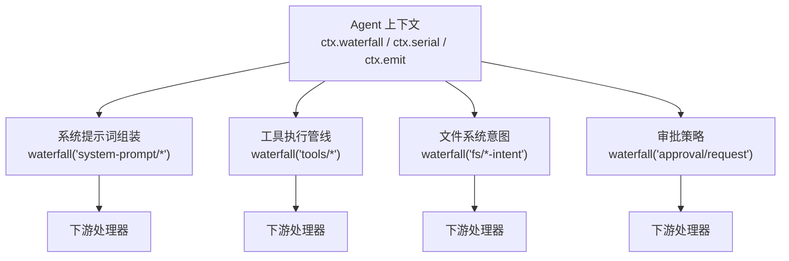
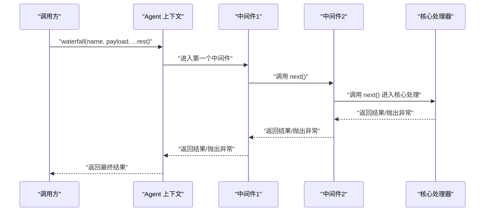
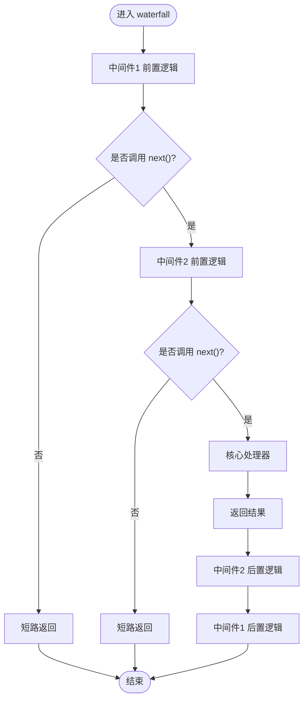
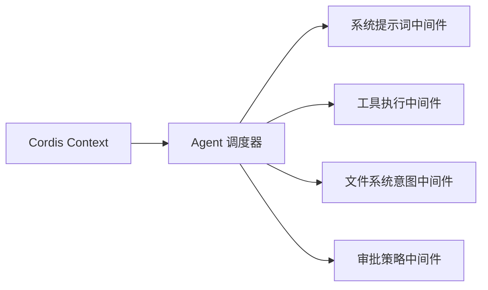

# 瀑布流中间件机制

<cite>
**本文引用的文件**
- [dispatch.ts](file://packages/core/agent/src/dispatch.ts)
- [index.ts（ACP）](file://packages/acp/acp/src/index.ts)
- [index.ts（系统提示词）](file://packages/core/system-prompt/src/index.ts)
- [index.ts（工具执行）](file://packages/core/tools/src/index.ts)
- [edit.ts（文件系统编辑意图）](file://packages/fs/tool-fs/src/edit.ts)
- [write.ts（文件系统写入意图）](file://packages/fs/tool-fs/src/write.ts)
</cite>

## 目录
1. [简介](#简介)
2. [项目结构](#项目结构)
3. [核心组件](#核心组件)
4. [架构总览](#架构总览)
5. [详细组件分析](#详细组件分析)
6. [依赖关系分析](#依赖关系分析)
7. [性能考量](#性能考量)
8. [故障排查指南](#故障排查指南)
9. [结论](#结论)
10. [附录](#附录)

## 简介
本文件系统性阐述“瀑布流中间件机制”在该仓库中的实现与使用。围绕 Cordis 的 waterfall 模式，解释 next() 延续函数的作用、调用时机、请求包装、响应转换、短路拦截等关键概念；并通过实际代码位置展示数据转换、权限验证、日志记录等常见中间件场景；说明执行顺序、结果传递与短路机制；最后给出最佳实践与常见问题规避建议。

## 项目结构
该仓库将“事件分发与中间件链”能力集中在上下文（Context）中暴露，并在多个子系统通过 ctx.waterfall(...) 挂载中间件，形成可插拔的流水线：
- 事件调度器：在 Agent 上下文中提供 emit/serial/waterfall 三种分发方式，其中 waterfall 用于构建 around 型中间件链。
- 业务侧中间件：在系统提示词组装、工具执行、文件系统操作、审批策略等位置挂载中间件，完成数据转换、权限校验、审计日志、短路拦截等。

图表来源
- [dispatch.ts:107-147](file://packages/core/agent/src/dispatch.ts#L107-L147)
- [index.ts（系统提示词）:520-540](file://packages/core/system-prompt/src/index.ts#L520-L540)
- [index.ts（工具执行）:1290-1310](file://packages/core/tools/src/index.ts#L1290-L1310)
- [edit.ts:120-130](file://packages/fs/tool-fs/src/edit.ts#L120-L130)
- [write.ts:105-115](file://packages/fs/tool-fs/src/write.ts#L105-L115)
- [index.ts（ACP）:215-229](file://packages/acp/acp/src/index.ts#L215-L229)

章节来源
- [dispatch.ts:107-147](file://packages/core/agent/src/dispatch.ts#L107-L147)

## 核心组件
- 事件调度器（Agent 范围）
  - 提供 emit（通知）、serial（串行）、waterfall（瀑布流）三种分发方式。waterfall 支持 around 型中间件链，最后一个参数为 next()，由最内层默认处理器提供。
  - 注入 agent 主体到 payload，确保主题与 scope key 一致。
- 业务中间件挂载点
  - 系统提示词组装：对提示词进行转换、增强或裁剪。
  - 工具执行：在执行前后进行鉴权、限流、审计、重试等。
  - 文件系统意图：在读写前进行策略检查、沙箱限制、审计。
  - 审批策略：对外部自动化客户端（如 ACP）暴露一次性授权决策。

章节来源
- [dispatch.ts:54-82](file://packages/core/agent/src/dispatch.ts#L54-L82)
- [dispatch.ts:107-147](file://packages/core/agent/src/dispatch.ts#L107-L147)
- [index.ts（系统提示词）:520-540](file://packages/core/system-prompt/src/index.ts#L520-L540)
- [index.ts（工具执行）:1290-1310](file://packages/core/tools/src/index.ts#L1290-L1310)
- [edit.ts:120-130](file://packages/fs/tool-fs/src/edit.ts#L120-L130)
- [write.ts:105-115](file://packages/fs/tool-fs/src/write.ts#L105-L115)
- [index.ts（ACP）:215-229](file://packages/acp/acp/src/index.ts#L215-L229)

## 架构总览
下图展示了从调用方发起一次 waterfall 分发，到中间件链依次执行、next() 延续、最终返回结果的完整流程。

图表来源
- [dispatch.ts:143-147](file://packages/core/agent/src/dispatch.ts#L143-L147)
- [index.ts（ACP）:215-229](file://packages/acp/acp/src/index.ts#L215-L229)

## 详细组件分析

### 1) 事件调度器与 next() 语义
- 职责
  - 将 agent 主体注入 payload，保证事件主题与 scope 一致。
  - 暴露 waterfall(name, payload, ...rest)，其中 rest 即为事件声明的参数（通常以 next() 结尾）。
- next() 的作用与时机
  - next() 是“下游处理器”的入口。当前中间件可选择不调用 next() 直接返回，以实现短路拦截。
  - 若调用 next()，则等待下游返回的结果，并可对其进行包装、转换或错误处理。
- 典型用法
  - 前置：校验输入、记录日志、准备上下文。
  - 后置：清理资源、统计指标、统一错误格式。

章节来源
- [dispatch.ts:107-147](file://packages/core/agent/src/dispatch.ts#L107-L147)

### 2) 系统提示词组装中间件
- 触发点
  - 在系统提示词组装阶段，通过 ctx.waterfall(...) 对提示词进行转换或裁剪。
- 常见用途
  - 动态注入上下文信息、屏蔽敏感字段、合并多源提示词。
- 执行顺序
  - 先注册的中间件先执行，后注册的中间件包裹前者，形成洋葱模型。

章节来源
- [index.ts（系统提示词）:520-540](file://packages/core/system-prompt/src/index.ts#L520-L540)

### 3) 工具执行中间件
- 触发点
  - 工具执行前后通过 ctx.waterfall(...) 挂载中间件，形成 pre/post 钩子。
- 常见用途
  - 权限校验、速率限制、审计日志、重试、熔断、结果归一化。
- 短路示例
  - 当权限不足时，直接返回拒绝结果，不调用 next()，从而阻止工具执行。

章节来源
- [index.ts（工具执行）:1290-1310](file://packages/core/tools/src/index.ts#L1290-L1310)

### 4) 文件系统意图中间件
- 触发点
  - 在文件编辑/写入前，通过 ctx.waterfall('fs/edit-intent' | 'fs/write-intent', ...) 进行策略检查。
- 常见用途
  - 沙箱路径白名单、配额控制、变更审计、冲突检测。
- 短路示例
  - 当目标路径不在允许范围内，直接返回拒绝，不调用 next()。

章节来源
- [edit.ts:120-130](file://packages/fs/tool-fs/src/edit.ts#L120-L130)
- [write.ts:105-115](file://packages/fs/tool-fs/src/write.ts#L105-L115)

### 5) 审批策略中间件（ACP）
- 触发点
  - 监听 approval/request 事件，通过 ctx.waterfall(...) 接入一次性授权决策。
- 行为
  - 对于来自 ACP 的请求，向远端客户端发起一次性许可询问，并返回 allow_once/reject/cancelled 等结果。
  - 若不匹配条件（如无 callId），则调用 next() 交由后续策略处理。
- 短路
  - 根据客户端选择直接返回结果，不调用 next()，实现即时拦截。

章节来源
- [index.ts（ACP）:215-229](file://packages/acp/acp/src/index.ts#L215-L229)

### 6) 中间件链执行流程与结果传递
- 执行顺序
  - 按注册顺序依次进入，形成“外层包裹内层”的洋葱模型。
- 结果传递
  - next() 返回的值会逐层向上返回，供上层中间件进行二次处理。
- 短路机制
  - 任一中间件可直接返回值而不调用 next()，中断后续执行，实现拦截决策。

图表来源
- [dispatch.ts:143-147](file://packages/core/agent/src/dispatch.ts#L143-L147)
- [index.ts（ACP）:215-229](file://packages/acp/acp/src/index.ts#L215-L229)

## 依赖关系分析
- 耦合与内聚
  - 调度器与业务模块松耦合：业务仅依赖 ctx.waterfall(...) 接口，不关心具体实现。
  - 中间件高内聚：每个中间件聚焦单一职责（如权限、日志、转换）。
- 外部依赖
  - Cordis Context 提供事件分发原语（emit/serial/waterfall）。
  - 各子系统通过插件机制挂载中间件，避免硬编码。

图表来源
- [dispatch.ts:107-147](file://packages/core/agent/src/dispatch.ts#L107-L147)
- [index.ts（系统提示词）:520-540](file://packages/core/system-prompt/src/index.ts#L520-L540)
- [index.ts（工具执行）:1290-1310](file://packages/core/tools/src/index.ts#L1290-L1310)
- [edit.ts:120-130](file://packages/fs/tool-fs/src/edit.ts#L120-L130)
- [write.ts:105-115](file://packages/fs/tool-fs/src/write.ts#L105-L115)
- [index.ts（ACP）:215-229](file://packages/acp/acp/src/index.ts#L215-L229)

章节来源
- [dispatch.ts:107-147](file://packages/core/agent/src/dispatch.ts#L107-L147)

## 性能考量
- 避免不必要的 next() 调用：在明确可以短路的情况下尽早返回，减少下游开销。
- 最小化副作用：在中间件中只做必要计算，I/O 尽量异步且可取消。
- 复用上下文：利用 Agent 范围的调度器缓存载体，减少热点路径分配。
- 错误快速失败：在入口处校验输入，尽早返回错误，避免深层嵌套。

[本节为通用指导，无需特定文件引用]

## 故障排查指南
- 症状：请求无响应或静默失败
  - 可能原因：忘记调用 next() 导致链路中断；或 next() 抛错未被捕获。
  - 定位方法：在关键中间件前后增加日志，确认 next() 是否被调用及返回值。
- 症状：权限校验未生效
  - 可能原因：短路分支未覆盖所有非法场景；或短路返回值不符合下游期望类型。
  - 定位方法：检查对应 waterfall 名称下的所有中间件注册顺序与短路条件。
- 症状：审批策略未触发
  - 可能原因：请求不满足匹配条件（如缺少 callId），直接 next() 放行。
  - 定位方法：查看审批中间件的守卫条件与 next() 分支。

章节来源
- [dispatch.ts:107-147](file://packages/core/agent/src/dispatch.ts#L107-L147)
- [index.ts（ACP）:215-229](file://packages/acp/acp/src/index.ts#L215-L229)

## 结论
该仓库通过 Cordis 的 waterfall 机制，构建了统一的中间件管道，贯穿系统提示词、工具执行、文件系统操作与审批策略等关键环节。借助 next() 的延续语义与短路拦截，既能灵活组合横切关注点，又能保证核心流程的可控性与可观测性。遵循本文的最佳实践，可有效提升中间件的质量与可维护性。

[本节为总结性内容，无需特定文件引用]

## 附录

### A. 常见中间件场景与参考位置
- 数据转换（系统提示词）
  - 参考：[index.ts（系统提示词）:520-540](file://packages/core/system-prompt/src/index.ts#L520-L540)
- 权限验证（工具执行）
  - 参考：[index.ts（工具执行）:1290-1310](file://packages/core/tools/src/index.ts#L1290-L1310)
- 日志记录（文件系统意图）
  - 参考：[edit.ts:120-130](file://packages/fs/tool-fs/src/edit.ts#L120-L130), [write.ts:105-115](file://packages/fs/tool-fs/src/write.ts#L105-L115)
- 审批策略（ACP）
  - 参考：[index.ts（ACP）:215-229](file://packages/acp/acp/src/index.ts#L215-L229)

### B. 最佳实践清单
- 始终考虑短路：在明确拒绝的场景立即返回，不调用 next()。
- 保证幂等：中间件不应产生重复副作用。
- 错误隔离：捕获并记录异常，避免污染上游。
- 可观测性：在进入/退出 next() 处记录关键指标。
- 可测试性：将 next() 作为可替换的依赖，便于单元测试。

[本节为通用指导，无需特定文件引用]