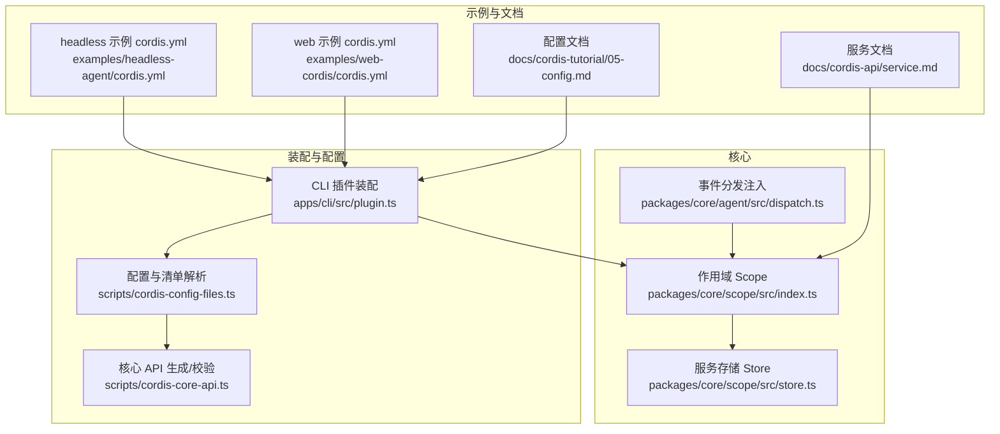
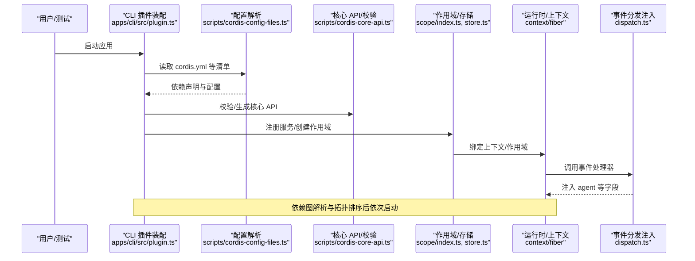
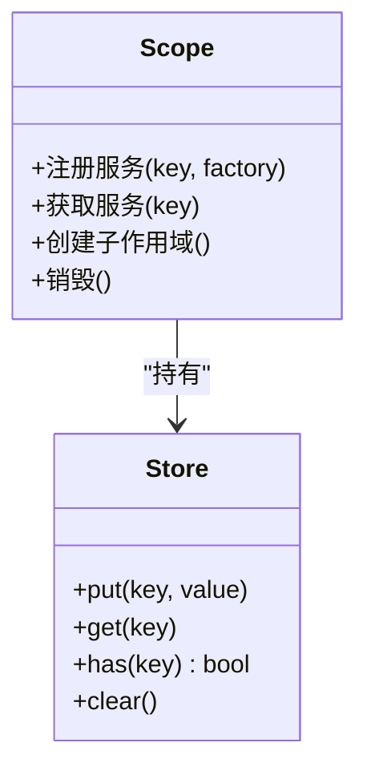
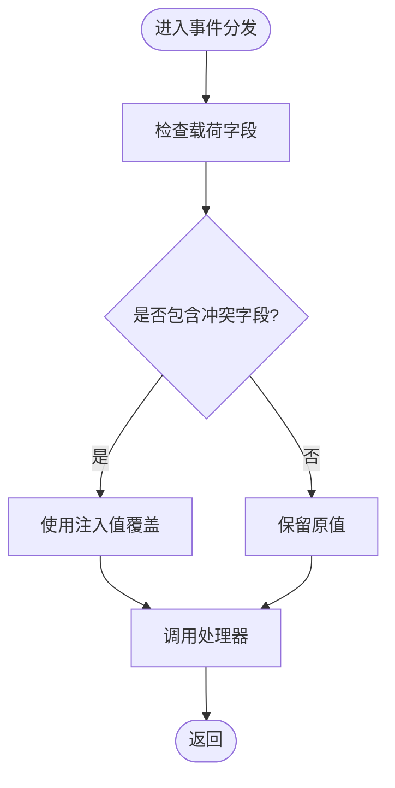
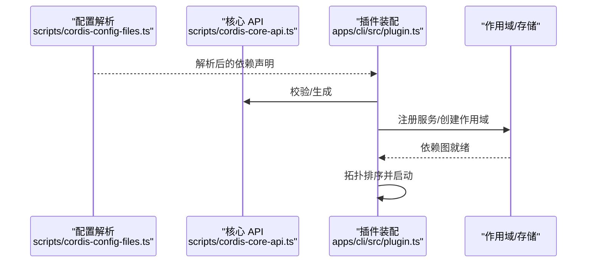
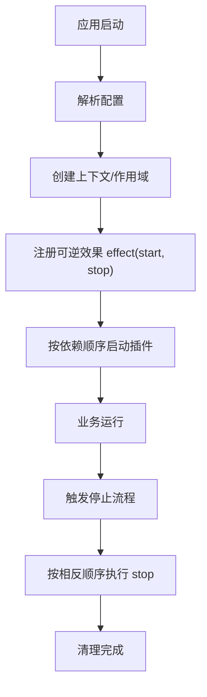
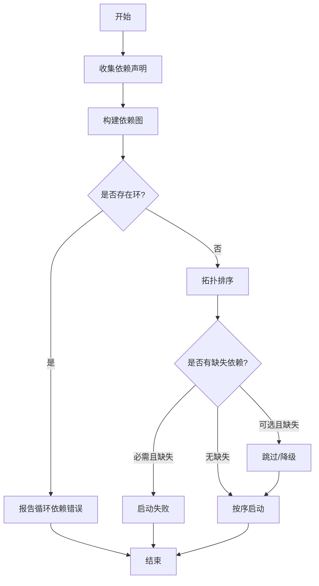
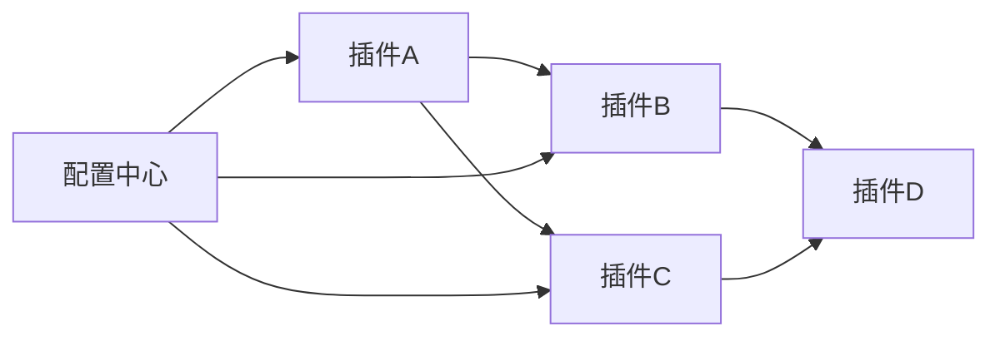
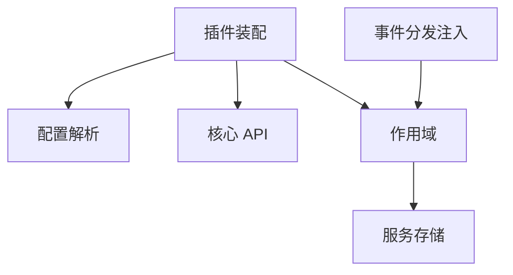

# 依赖注入系统

<cite>
**本文引用的文件**
- [packages/core/scope/src/index.ts](file://packages/core/scope/src/index.ts)
- [packages/core/scope/src/store.ts](file://packages/core/scope/src/store.ts)
- [packages/core/agent/src/dispatch.ts](file://packages/core/agent/src/dispatch.ts)
- [apps/cli/src/plugin.ts](file://apps/cli/src/plugin.ts)
- [scripts/cordis-config-files.ts](file://scripts/cordis-config-files.ts)
- [scripts/cordis-core-api.ts](file://scripts/cordis-core-api.ts)
- [examples/headless-agent/cordis.yml](file://examples/headless-agent/cordis.yml)
- [examples/web-cordis/cordis.yml](file://examples/web-cordis/cordis.yml)
- [docs/cordis-tutorial/03-services.md](file://docs/cordis-tutorial/03-services.md)
- [docs/cordis-tutorial/05-config.md](file://docs/cordis-tutorial/05-config.md)
- [docs/cordis-api/service.md](file://docs/cordis-api/service.md)
- [docs/cordis-api/context.i18n.yaml](file://docs/cordis-api/context.i18n.yaml)
- [docs/cordis-api/fiber.md](file://docs/cordis-api/fiber.md)
</cite>

## 目录
1. [简介](#简介)
2. [项目结构](#项目结构)
3. [核心组件](#核心组件)
4. [架构总览](#架构总览)
5. [详细组件分析](#详细组件分析)
6. [依赖关系分析](#依赖关系分析)
7. [性能考量](#性能考量)
8. [故障排查指南](#故障排查指南)
9. [结论](#结论)
10. [附录](#附录)

## 简介
本文件系统性阐述 Cordis 中的依赖注入（DI）机制，聚焦以下目标：
- inject 字段的声明语法与运行时解析过程
- 通过依赖声明替代手动启动顺序管理，实现声明式插件加载控制
- 可选依赖与必需依赖的区别及缺失处理策略
- 配置注入机制与 ctx.effect() 注册可逆效果
- 依赖图解析算法、循环依赖检测与处理
- 复杂依赖关系的实际示例与大型项目组织建议
- 性能优化建议与常见问题解决方案

## 项目结构
Cordis 的 DI 能力由“作用域（Scope）+ 服务注册 + 上下文（Context/Fiber）”共同构成。关键位置如下：
- 作用域与服务存储：packages/core/scope/src/index.ts、store.ts
- 事件分发中自动注入 agent：packages/core/agent/src/dispatch.ts
- CLI 插件装配入口：apps/cli/src/plugin.ts
- 配置与清单解析：scripts/cordis-config-files.ts、scripts/cordis-core-api.ts
- 示例配置：examples/headless-agent/cordis.yml、examples/web-cordis/cordis.yml
- 教程与 API 文档：docs/cordis-tutorial/*、docs/cordis-api/*

图表来源
- [packages/core/scope/src/index.ts](file://packages/core/scope/src/index.ts)
- [packages/core/scope/src/store.ts](file://packages/core/scope/src/store.ts)
- [packages/core/agent/src/dispatch.ts](file://packages/core/agent/src/dispatch.ts)
- [apps/cli/src/plugin.ts](file://apps/cli/src/plugin.ts)
- [scripts/cordis-config-files.ts](file://scripts/cordis-config-files.ts)
- [scripts/cordis-core-api.ts](file://scripts/cordis-core-api.ts)
- [examples/headless-agent/cordis.yml](file://examples/headless-agent/cordis.yml)
- [examples/web-cordis/cordis.yml](file://examples/web-cordis/cordis.yml)
- [docs/cordis-api/service.md](file://docs/cordis-api/service.md)
- [docs/cordis-tutorial/05-config.md](file://docs/cordis-tutorial/05-config.md)

章节来源
- [packages/core/scope/src/index.ts](file://packages/core/scope/src/index.ts)
- [packages/core/scope/src/store.ts](file://packages/core/scope/src/store.ts)
- [packages/core/agent/src/dispatch.ts](file://packages/core/agent/src/dispatch.ts)
- [apps/cli/src/plugin.ts](file://apps/cli/src/plugin.ts)
- [scripts/cordis-config-files.ts](file://scripts/cordis-config-files.ts)
- [scripts/cordis-core-api.ts](file://scripts/cordis-core-api.ts)
- [examples/headless-agent/cordis.yml](file://examples/headless-agent/cordis.yml)
- [examples/web-cordis/cordis.yml](file://examples/web-cordis/cordis.yml)
- [docs/cordis-api/service.md](file://docs/cordis-api/service.md)
- [docs/cordis-tutorial/05-config.md](file://docs/cordis-tutorial/05-config.md)

## 核心组件
- 作用域与作用域树：提供隔离的依赖容器，支持父子作用域的继承与覆盖。
- 服务存储：维护键到实例或构造器的映射，支持懒加载与生命周期管理。
- 上下文与 Fiber：承载当前作用域、配置、副作用等执行环境信息。
- 事件分发注入：在事件处理器参数中自动注入特定字段（如 agent），减少样板代码。
- 插件装配与配置：从 cordis.yml 等清单解析依赖声明，构建并解析依赖图，按序启动。

章节来源
- [packages/core/scope/src/index.ts](file://packages/core/scope/src/index.ts)
- [packages/core/scope/src/store.ts](file://packages/core/scope/src/store.ts)
- [packages/core/agent/src/dispatch.ts](file://packages/core/agent/src/dispatch.ts)
- [docs/cordis-api/context.i18n.yaml](file://docs/cordis-api/context.i18n.yaml)
- [docs/cordis-api/fiber.md](file://docs/cordis-api/fiber.md)

## 架构总览
Cordis 的 DI 架构围绕“声明即运行”的理念：开发者在配置或模块中以声明方式表达依赖，框架负责解析依赖图、检测循环、按拓扑顺序启动，并在运行时将依赖注入到需要的地方。

图表来源
- [apps/cli/src/plugin.ts](file://apps/cli/src/plugin.ts)
- [scripts/cordis-config-files.ts](file://scripts/cordis-config-files.ts)
- [scripts/cordis-core-api.ts](file://scripts/cordis-core-api.ts)
- [packages/core/scope/src/index.ts](file://packages/core/scope/src/index.ts)
- [packages/core/scope/src/store.ts](file://packages/core/scope/src/store.ts)
- [packages/core/agent/src/dispatch.ts](file://packages/core/agent/src/dispatch.ts)

## 详细组件分析

### 作用域与作用域树（Scope）
- 职责：提供隔离的依赖容器，支持父子作用域的继承与覆盖；作为依赖解析与实例化的边界。
- 关键点：
  - 每个作用域拥有独立的服务存储，避免跨作用域污染。
  - 子作用域可访问父作用域的服务，但不会反向影响父作用域。
  - 适合用于插件、会话、请求级隔离等场景。

图表来源
- [packages/core/scope/src/index.ts](file://packages/core/scope/src/index.ts)
- [packages/core/scope/src/store.ts](file://packages/core/scope/src/store.ts)

章节来源
- [packages/core/scope/src/index.ts](file://packages/core/scope/src/index.ts)
- [packages/core/scope/src/store.ts](file://packages/core/scope/src/store.ts)

### 事件分发中的自动注入（Dispatch）
- 职责：在事件处理器参数中自动注入特定字段（例如 agent），减少样板代码并确保一致性。
- 行为要点：
  - 注入字段优先级高于调用方传入的同名字段，防止覆盖。
  - 注入发生在调度阶段，对上层透明。

图表来源
- [packages/core/agent/src/dispatch.ts](file://packages/core/agent/src/dispatch.ts)

章节来源
- [packages/core/agent/src/dispatch.ts](file://packages/core/agent/src/dispatch.ts)

### 插件装配与配置解析（CLI + Config）
- 职责：从 cordis.yml 等清单文件中解析依赖声明，构建依赖图，并按拓扑顺序启动插件。
- 关键点：
  - 声明式依赖取代手动启动顺序管理。
  - 支持可选依赖与必需依赖：缺失时分别采取降级或报错策略。
  - 与核心 API 校验配合，确保配置正确性。

图表来源
- [scripts/cordis-config-files.ts](file://scripts/cordis-config-files.ts)
- [scripts/cordis-core-api.ts](file://scripts/cordis-core-api.ts)
- [apps/cli/src/plugin.ts](file://apps/cli/src/plugin.ts)
- [packages/core/scope/src/index.ts](file://packages/core/scope/src/index.ts)
- [packages/core/scope/src/store.ts](file://packages/core/scope/src/store.ts)

章节来源
- [scripts/cordis-config-files.ts](file://scripts/cordis-config-files.ts)
- [scripts/cordis-core-api.ts](file://scripts/cordis-core-api.ts)
- [apps/cli/src/plugin.ts](file://apps/cli/src/plugin.ts)

### 配置注入与可逆效果（ctx.effect）
- 配置注入：通过上下文将配置对象注入到需要的位置，便于插件按需读取。
- 可逆效果：使用 ctx.effect() 注册启动/关闭成对的副作用，确保资源正确释放。
- 适用场景：数据库连接、外部服务客户端、定时任务等。

图表来源
- [docs/cordis-tutorial/05-config.md](file://docs/cordis-tutorial/05-config.md)
- [docs/cordis-api/context.i18n.yaml](file://docs/cordis-api/context.i18n.yaml)
- [docs/cordis-api/fiber.md](file://docs/cordis-api/fiber.md)

章节来源
- [docs/cordis-tutorial/05-config.md](file://docs/cordis-tutorial/05-config.md)
- [docs/cordis-api/context.i18n.yaml](file://docs/cordis-api/context.i18n.yaml)
- [docs/cordis-api/fiber.md](file://docs/cordis-api/fiber.md)

### 依赖图解析与循环依赖检测
- 解析步骤：
  1) 收集所有插件/服务的依赖声明
  2) 构建有向图（节点=服务，边=依赖）
  3) 拓扑排序确定启动顺序
  4) 检测环：若存在环则报告循环依赖错误
- 缺失依赖处理：
  - 必需依赖缺失：启动失败并给出明确错误信息
  - 可选依赖缺失：跳过该依赖，启用降级逻辑或空实现

图表来源
- [scripts/cordis-config-files.ts](file://scripts/cordis-config-files.ts)
- [scripts/cordis-core-api.ts](file://scripts/cordis-core-api.ts)
- [apps/cli/src/plugin.ts](file://apps/cli/src/plugin.ts)

章节来源
- [scripts/cordis-config-files.ts](file://scripts/cordis-config-files.ts)
- [scripts/cordis-core-api.ts](file://scripts/cordis-core-api.ts)
- [apps/cli/src/plugin.ts](file://apps/cli/src/plugin.ts)

### 实际示例：复杂依赖关系声明
- headless 示例：展示多插件组合、服务注册与配置注入
- web 示例：展示 Web 端插件装配与依赖声明

图表来源
- [examples/headless-agent/cordis.yml](file://examples/headless-agent/cordis.yml)
- [examples/web-cordis/cordis.yml](file://examples/web-cordis/cordis.yml)

章节来源
- [examples/headless-agent/cordis.yml](file://examples/headless-agent/cordis.yml)
- [examples/web-cordis/cordis.yml](file://examples/web-cordis/cordis.yml)

### 大型项目组织与管理建议
- 分层组织：按领域/子系统划分插件，保持内聚低耦合
- 依赖最小化：仅声明必要依赖，降低耦合度
- 可选依赖优先：对外部能力采用可选依赖，提升健壮性
- 配置集中：通过配置注入统一管理环境变量与开关
- 版本兼容：在服务接口变更时保持向后兼容，逐步迁移

[本节为通用指导，不直接分析具体文件]

## 依赖关系分析
- 组件耦合：
  - CLI 装配依赖配置解析与核心 API 校验
  - 作用域与服务存储强内聚，支撑整个 DI 体系
  - 事件分发注入依赖作用域上下文
- 外部集成点：
  - cordis.yml 清单文件
  - 上下文/作用域 API
  - 插件/服务注册接口

图表来源
- [apps/cli/src/plugin.ts](file://apps/cli/src/plugin.ts)
- [scripts/cordis-config-files.ts](file://scripts/cordis-config-files.ts)
- [scripts/cordis-core-api.ts](file://scripts/cordis-core-api.ts)
- [packages/core/scope/src/index.ts](file://packages/core/scope/src/index.ts)
- [packages/core/scope/src/store.ts](file://packages/core/scope/src/store.ts)
- [packages/core/agent/src/dispatch.ts](file://packages/core/agent/src/dispatch.ts)

章节来源
- [apps/cli/src/plugin.ts](file://apps/cli/src/plugin.ts)
- [scripts/cordis-config-files.ts](file://scripts/cordis-config-files.ts)
- [scripts/cordis-core-api.ts](file://scripts/cordis-core-api.ts)
- [packages/core/scope/src/index.ts](file://packages/core/scope/src/index.ts)
- [packages/core/scope/src/store.ts](file://packages/core/scope/src/store.ts)
- [packages/core/agent/src/dispatch.ts](file://packages/core/agent/src/dispatch.ts)

## 性能考量
- 懒加载：仅在首次使用时解析和实例化依赖，减少启动开销
- 作用域复用：尽量复用作用域，避免频繁创建销毁
- 依赖图缓存：对已解析的依赖图进行缓存，避免重复计算
- 批量注册：合并多次注册为一次批量操作，减少锁竞争
- 副作用最小化：effect 的 start/stop 应轻量，避免阻塞主线程

[本节为通用指导，不直接分析具体文件]

## 故障排查指南
- 循环依赖：
  - 现象：启动时报错提示循环依赖
  - 排查：检查依赖图，拆分模块或引入接口抽象
- 必需依赖缺失：
  - 现象：启动失败，提示缺少某服务
  - 排查：确认配置是否正确，服务是否已注册
- 可选依赖缺失：
  - 现象：功能降级或未启用
  - 排查：检查可选依赖的配置与可用性
- 注入冲突：
  - 现象：事件处理器中注入字段被覆盖
  - 排查：遵循注入优先级规则，避免同名冲突

章节来源
- [packages/core/agent/src/dispatch.ts](file://packages/core/agent/src/dispatch.ts)
- [scripts/cordis-config-files.ts](file://scripts/cordis-config-files.ts)
- [scripts/cordis-core-api.ts](file://scripts/cordis-core-api.ts)

## 结论
Cordis 的依赖注入系统通过作用域、服务存储与上下文协作，实现了声明式、可组合、可验证的插件装配与依赖管理。借助依赖图解析与拓扑排序，开发者无需手动编排启动顺序；通过可选/必需依赖与可逆效果，系统在灵活性与健壮性之间取得平衡。结合最佳实践与性能优化建议，可在大型项目中稳定扩展与维护。

[本节为总结性内容，不直接分析具体文件]

## 附录
- 服务与上下文参考：
  - 服务文档：docs/cordis-api/service.md
  - 上下文与 Fiber：docs/cordis-api/context.i18n.yaml、docs/cordis-api/fiber.md
- 教程与示例：
  - 服务与配置教程：docs/cordis-tutorial/03-services.md、docs/cordis-tutorial/05-config.md
  - 示例配置：examples/headless-agent/cordis.yml、examples/web-cordis/cordis.yml

章节来源
- [docs/cordis-api/service.md](file://docs/cordis-api/service.md)
- [docs/cordis-api/context.i18n.yaml](file://docs/cordis-api/context.i18n.yaml)
- [docs/cordis-api/fiber.md](file://docs/cordis-api/fiber.md)
- [docs/cordis-tutorial/03-services.md](file://docs/cordis-tutorial/03-services.md)
- [docs/cordis-tutorial/05-config.md](file://docs/cordis-tutorial/05-config.md)
- [examples/headless-agent/cordis.yml](file://examples/headless-agent/cordis.yml)
- [examples/web-cordis/cordis.yml](file://examples/web-cordis/cordis.yml)