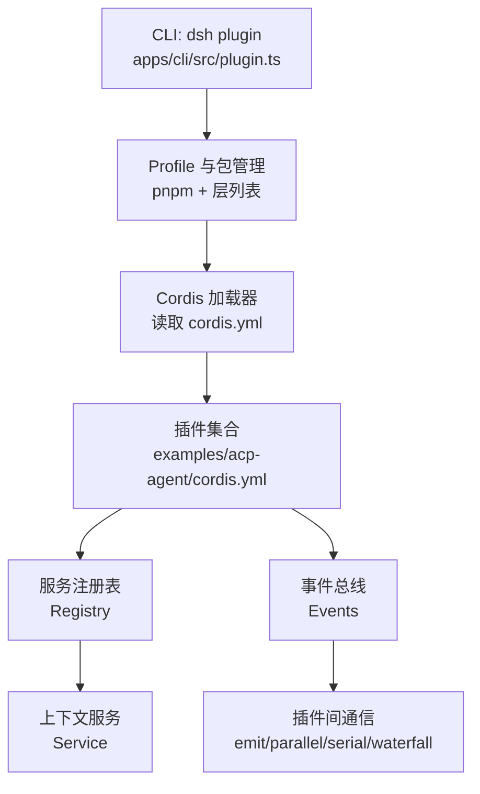
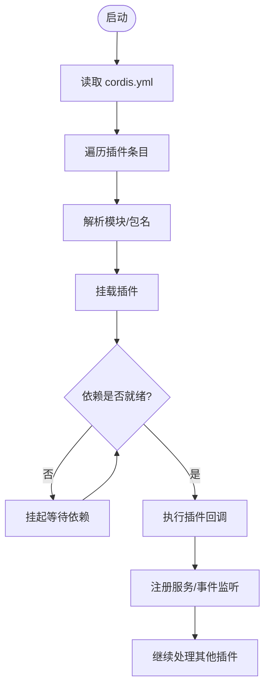
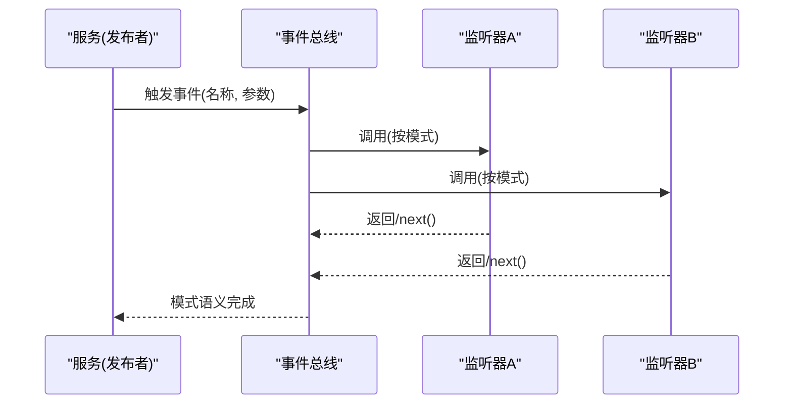
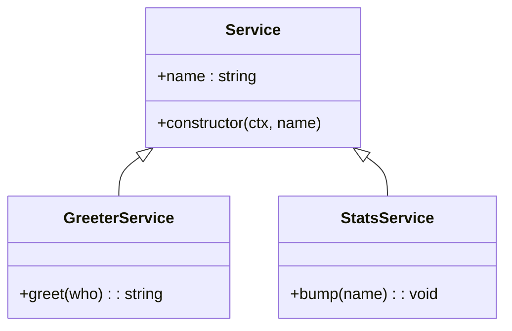
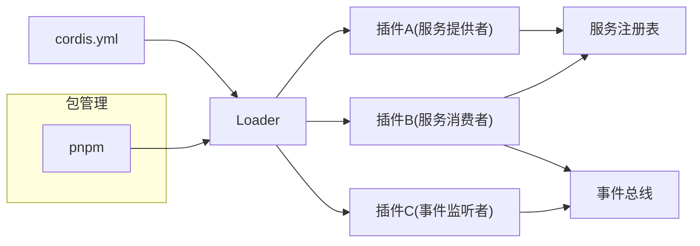

# 插件架构设计

<cite>
**本文引用的文件**
- [cordis-primer.md](file://docs/cordis-primer.md)
- [registry.md](file://docs/cordis-api/registry.md)
- [service.md](file://docs/cordis-api/service.md)
- [events.md](file://docs/cordis-api/events.md)
- [01-first-plugin.md](file://docs/cordis-tutorial/01-first-plugin.md)
- [03-services.md](file://docs/cordis-tutorial/03-services.md)
- [04-events.md](file://docs/cordis-tutorial/04-events.md)
- [cordis.yml](file://examples/acp-agent/cordis.yml)
- [plugin.ts](file://apps/cli/src/plugin.ts)
</cite>

## 目录
1. [简介](#简介)
2. [项目结构](#项目结构)
3. [核心组件](#核心组件)
4. [架构总览](#架构总览)
5. [详细组件分析](#详细组件分析)
6. [依赖关系分析](#依赖关系分析)
7. [性能考虑](#性能考虑)
8. [故障排查指南](#故障排查指南)
9. [结论](#结论)
10. [附录](#附录)

## 简介
本文件面向 DeepSeek Harness 的插件开发者，系统化阐述底层插件框架 Cordis 的设计理念与架构原则。Cordis 将“插件即服务”作为基本抽象：每个插件实现或提供稳定的服务键（如 ctx.tools、ctx.llm），通过声明式依赖注入与类型化事件完成松耦合扩展；加载器从配置中解析并挂载插件，生命周期可逆，支持热重载与优雅卸载。文档覆盖插件发现与注册、插件间通信协议、版本管理与兼容性、完整开发流程、安全与隔离、以及最佳实践与性能优化建议。

## 项目结构
- 概念与 API 参考：位于 docs/cordis-api，包含 Registry、Service、Events 等核心接口说明。
- 教程与入门：位于 docs/cordis-tutorial，从零开始演示插件编写、服务与事件使用、配置与组合。
- 示例装配：examples/acp-agent/cordis.yml 展示如何以 YAML 清单组合多个插件形成完整应用。
- CLI 插件管理：apps/cli/src/plugin.ts 提供 dsh plugin 子命令，负责 Profile 初始化、pnpm 转发与 bundles 层列表同步。



图表来源
- [plugin.ts:120-158](file://apps/cli/src/plugin.ts#L120-L158)
- [cordis.yml:1-193](file://examples/acp-agent/cordis.yml#L1-L193)
- [registry.md:8-56](file://docs/cordis-api/registry.md#L8-L56)
- [events.md:8-123](file://docs/cordis-api/events.md#L8-L123)

章节来源
- [cordis-primer.md:7-44](file://docs/cordis-primer.md#L7-L44)
- [01-first-plugin.md:23-51](file://docs/cordis-tutorial/01-first-plugin.md#L23-L51)
- [cordis.yml:1-193](file://examples/acp-agent/cordis.yml#L1-L193)
- [plugin.ts:120-158](file://apps/cli/src/plugin.ts#L120-L158)

## 核心组件
- 插件入口与形态：函数、对象（含 apply）、类（继承 Service）。
- 上下文与服务：Context 是服务仓库，插件通过 ctx.<key> 暴露能力；Service 基类自动注册并在 Fiber 卸载时清理。
- 依赖注入：inject 声明所需服务，Cordis 保证在回调执行前依赖就绪，且随依赖变化重入。
- 事件系统：类型化事件，支持 emit、parallel、serial、bail、waterfall 多种分发模式，用于观察、包装、并行与有序协作。
- 加载与组合：YAML 清单描述插件条目，Loader 解析模块名并挂载；支持表达式插值与禁用开关。

章节来源
- [registry.md:58-121](file://docs/cordis-api/registry.md#L58-L121)
- [service.md:1-103](file://docs/cordis-api/service.md#L1-L103)
- [events.md:8-208](file://docs/cordis-api/events.md#L8-L208)
- [cordis-primer.md:7-44](file://docs/cordis-primer.md#L7-L44)

## 架构总览
Cordis 采用“插件即服务 + 事件驱动”的松耦合架构：
- 插件通过 YAML 清单声明，由 Loader 并发启动并按依赖顺序就绪。
- 服务以稳定键注册到 Context，消费者仅依赖键而非具体实现，便于替换与测试。
- 事件作为横切关注点（工具调用、模型请求、审批策略等）的解耦通道，waterfall 模式支持拦截与短路。
- 所有注册都是可逆效果，卸载时按相反顺序回滚，确保热重载与进程退出时的资源释放。

```mermaid
sequenceDiagram
participant L as "加载器"
participant P as "插件A(提供者)"
participant Q as "插件B(消费者)"
participant R as "插件C(监听者)"
L->>P : 解析并挂载
P-->>L : 注册服务(ctx.tools/llm/...)
L->>Q : 解析并挂载(等待inject依赖)
Q-->>L : 消费服务, 订阅事件
L->>R : 解析并挂载(可选依赖)
R-->>L : 订阅事件
Note over P,Q,R : 依赖就绪后并发执行; 事件驱动协作
```

图表来源
- [registry.md:8-56](file://docs/cordis-api/registry.md#L8-L56)
- [03-services.md:44-78](file://docs/cordis-tutorial/03-services.md#L44-L78)
- [04-events.md:80-141](file://docs/cordis-tutorial/04-events.md#L80-L141)

## 详细组件分析

### 插件发现与注册机制
- 清单驱动：cordis.yml 为插件清单，每条记录指定 id、name（模块标识符）与 config。
- 模块解析：name 可为相对路径或 npm 包名；Loader 解析后挂载为子插件。
- 依赖驱动启动：插件通过 inject 声明所需服务，Cordis 维护依赖图，待依赖齐全再执行回调。
- 可插拔与热替换：当某服务提供者被卸载或热替换，依赖它的插件会随之卸载并重载，保证一致性。



图表来源
- [01-first-plugin.md:23-51](file://docs/cordis-tutorial/01-first-plugin.md#L23-L51)
- [03-services.md:44-78](file://docs/cordis-tutorial/03-services.md#L44-L78)
- [cordis.yml:1-193](file://examples/acp-agent/cordis.yml#L1-L193)

章节来源
- [01-first-plugin.md:23-51](file://docs/cordis-tutorial/01-first-plugin.md#L23-L51)
- [03-services.md:44-78](file://docs/cordis-tutorial/03-services.md#L44-L78)
- [cordis.yml:1-193](file://examples/acp-agent/cordis.yml#L1-L193)

### 插件间通信协议（事件系统）
- 事件声明：通过 TypeScript 声明合并扩展 Events 接口，使事件名与签名类型化。
- 分发模式：
  - emit：同步广播，不收集返回值。
  - parallel：并行运行所有监听器，统一 await。
  - serial：按序 await，首个非空返回值短路。
  - bail：同步版 serial。
  - waterfall：中间件风格，最后一个参数为 next，支持转换与短路。
- 订阅与生命周期：ctx.on/once 注册的监听器随 Fiber 卸载自动移除，无需手动注销。



图表来源
- [events.md:8-123](file://docs/cordis-api/events.md#L8-L123)
- [04-events.md:80-141](file://docs/cordis-tutorial/04-events.md#L80-L141)

章节来源
- [events.md:8-208](file://docs/cordis-api/events.md#L8-L208)
- [04-events.md:8-141](file://docs/cordis-tutorial/04-events.md#L8-L141)

### 服务与依赖注入
- 服务定义：继承 Service 并在构造中调用 super(ctx, name)，实例自动注册到 ctx.name。
- 依赖声明：inject 可为数组或映射，Cordis 保证回调执行时依赖可用；若依赖消失，插件将被卸载并重载。
- 可选依赖：通过 ctx.get('key') 获取可能不存在的服务，避免强耦合。
- 命名空间：服务名在同一应用内扁平唯一，建议使用前缀避免冲突。



图表来源
- [service.md:1-103](file://docs/cordis-api/service.md#L1-L103)
- [03-services.md:7-78](file://docs/cordis-tutorial/03-services.md#L7-L78)

章节来源
- [service.md:1-103](file://docs/cordis-api/service.md#L1-L103)
- [03-services.md:7-78](file://docs/cordis-tutorial/03-services.md#L7-L78)

### 版本管理与兼容性检查
- 清单与包管理：通过 pnpm 管理依赖，dsh plugin 子命令会在安装后根据已安装包是否声明 dsh.bundle 来同步层列表，从而激活/停用插件。
- 运行时兼容：插件通过 inject 声明对服务的依赖，服务提供方变更或替换时，依赖方会被卸载并重载，天然具备“按能力兼容”的机制。
- 配置校验：插件可通过 StandardSchemaV1 对配置进行校验，避免不兼容配置进入运行期。
- 部署覆盖：通过 overlays 与环境变量选择启用/禁用插件，便于不同环境下的版本与功能裁剪。

章节来源
- [plugin.ts:30-91](file://apps/cli/src/plugin.ts#L30-L91)
- [plugin.ts:120-158](file://apps/cli/src/plugin.ts#L120-L158)
- [registry.md:71-83](file://docs/cordis-api/registry.md#L71-L83)
- [cordis-primer.md:36-44](file://docs/cordis-primer.md#L36-L44)

### 完整的插件开发流程
- 初始化：创建插件模块，导出 name 与 apply(ctx)。
- 提供服务：如需对外暴露能力，继承 Service 并在 apply 中通过 ctx.plugin(ServiceClass) 挂载。
- 声明依赖：使用 inject 列出所需服务，确保加载顺序由依赖决定而非清单顺序。
- 事件协作：在 Events 接口中声明事件，使用 ctx.emit/parallel/serial/bail/waterfall 发布，用 ctx.on/once 订阅。
- 配置与组合：在 cordis.yml 中添加插件条目，设置 config；可使用 !!js 表达式与环境变量。
- 调试与诊断：插件启动失败会直接报错；无法解析的模块会通过日志报告，需优先检查拼写与路径。
- 发布与部署：通过 pnpm 管理依赖，dsh plugin 子命令自动同步 bundles 层；生产环境通过 overlays 与环境变量控制启用。

章节来源
- [01-first-plugin.md:7-93](file://docs/cordis-tutorial/01-first-plugin.md#L7-L93)
- [03-services.md:7-99](file://docs/cordis-tutorial/03-services.md#L7-L99)
- [04-events.md:8-141](file://docs/cordis-tutorial/04-events.md#L8-L141)
- [cordis.yml:1-193](file://examples/acp-agent/cordis.yml#L1-L193)
- [plugin.ts:120-158](file://apps/cli/src/plugin.ts#L120-L158)

### 安全考虑、权限控制与资源隔离
- 沙箱策略：通过 sandbox-policy 与文件系统沙箱限制 bash 与工具的文件访问范围，默认工作区写入或危险全开模式可由环境变量切换。
- 审批策略：approval 插件根据策略决定是否询问用户或直接放行，敏感操作需显式批准。
- 子进程隔离：subprocess 与 bash 执行器在受控环境中运行，超时与输出管道受控。
- 资源回收：所有注册均为 effect，卸载时按相反顺序回滚，避免泄漏。

章节来源
- [cordis.yml:18-46](file://examples/acp-agent/cordis.yml#L18-L46)
- [cordis.yml:160-175](file://examples/acp-agent/cordis.yml#L160-L175)
- [cordis-primer.md:7-14](file://docs/cordis-primer.md#L7-L14)

### 最佳实践与性能优化建议
- 优先事件，其次服务方法：横切逻辑（工具管线、模型流、审批策略）通过事件拦截；直接能力调用走服务方法。
- 明确分发模式：单一决策用 serial/bail；可并行任务用 parallel；需要中间件式包装用 waterfall。
- 保持副作用可逆：每个注册都应提供 disposer，或将相关清理集中在一个 effect 中，确保卸载顺序正确。
- 避免隐式耦合：通过 inject 声明硬依赖，可选能力用 ctx.get 探测；服务名加前缀避免冲突。
- 配置校验与分层：使用 Schema 校验配置；通过 overlays 与环境变量在不同环境裁剪功能。
- 监控与诊断：利用 fiber 名称与 logger 输出定位问题；首次启动失败应尽快修复，避免静默 PENDING。

章节来源
- [cordis-primer.md:15-44](file://docs/cordis-primer.md#L15-L44)
- [04-events.md:80-141](file://docs/cordis-tutorial/04-events.md#L80-L141)

## 依赖关系分析
- 插件与服务的耦合：通过服务键与 inject 声明，降低直接导入带来的紧耦合。
- 事件与监听器的解耦：发布者不感知监听者数量与顺序，listener 可自由增减。
- 加载器与清单：cordis.yml 是装配中心，Loader 负责解析与挂载；dsh plugin 子命令负责依赖与层列表同步。
- 外部依赖：pnpm 管理包与构建脚本；环境变量与 !!js 表达式影响运行时行为。



图表来源
- [cordis.yml:1-193](file://examples/acp-agent/cordis.yml#L1-L193)
- [plugin.ts:120-158](file://apps/cli/src/plugin.ts#L120-L158)
- [registry.md:8-56](file://docs/cordis-api/registry.md#L8-L56)
- [events.md:8-123](file://docs/cordis-api/events.md#L8-L123)

章节来源
- [cordis.yml:1-193](file://examples/acp-agent/cordis.yml#L1-L193)
- [plugin.ts:120-158](file://apps/cli/src/plugin.ts#L120-L158)
- [registry.md:8-56](file://docs/cordis-api/registry.md#L8-L56)
- [events.md:8-123](file://docs/cordis-api/events.md#L8-L123)

## 性能考虑
- 并发启动与依赖排序：插件并发挂载，但实际执行顺序由依赖决定，避免手工编排启动序列。
- 事件模式选择：
  - 高吞吐观测：使用 emit 或 parallel，避免串行阻塞。
  - 决策链：使用 serial/bail 快速短路，减少不必要计算。
  - 中间件：waterfall 适合包装与转换，注意不要遗漏 next() 导致下游失效。
- 资源占用：避免在监听器中进行重型同步计算；必要时拆分任务或使用后台作业。
- 热重载与卸载：确保 effect 可逆，避免内存泄漏与句柄泄露。

[本节为通用指导，不直接分析具体文件]

## 故障排查指南
- 插件未生效：检查 cordis.yml 中的 name 拼写与路径；无法解析的模块不会崩溃进程，而是通过日志报告。
- 依赖未就绪：确认 inject 列出的服务已被提供；若服务被卸载或热替换，依赖插件会重新加载。
- 事件无响应：确认事件名与签名匹配；检查监听器是否正确注册且未被提前卸载。
- 审批与沙箱：若工具执行被拒绝，检查 sandbox-policy 与 approval 策略配置；必要时调整环境变量。
- 构建与安装：dsh plugin 子命令失败时，查看 pnpm 输出与 allowBuilds 白名单提示。

章节来源
- [01-first-plugin.md:79-93](file://docs/cordis-tutorial/01-first-plugin.md#L79-L93)
- [03-services.md:74-78](file://docs/cordis-tutorial/03-services.md#L74-L78)
- [plugin.ts:142-158](file://apps/cli/src/plugin.ts#L142-L158)
- [cordis.yml:18-46](file://examples/acp-agent/cordis.yml#L18-L46)

## 结论
Cordis 以“插件即服务 + 事件驱动”为核心，通过声明式依赖注入与类型化事件实现了高度模块化与松耦合扩展。YAML 清单驱动插件发现与装配，配合 dsh plugin 子命令与 pnpm 生态，形成从开发、调试到部署的完整闭环。借助沙箱与审批策略，系统在灵活性的同时兼顾了安全性与可控性。遵循本文的最佳实践，可高效构建可扩展、可维护、高性能的插件体系。

[本节为总结性内容，不直接分析具体文件]

## 附录
- 术语速查：
  - 插件：实现或提供服务的代码单元，可函数/对象/类形式存在。
  - 服务：通过稳定键暴露的能力，供其他插件消费。
  - 事件：插件间异步通信机制，支持多种分发模式。
  - 加载器：解析 cordis.yml 并挂载插件的组件。
  - Fiber：插件执行的上下文容器，支持卸载与回滚。
- 常用命令：
  - dsh plugin init/run/update：初始化与管理 Profile 插件。
  - node --import tsx vendor/cordis/bin.js：运行教程示例。

[本节为补充信息，不直接分析具体文件]