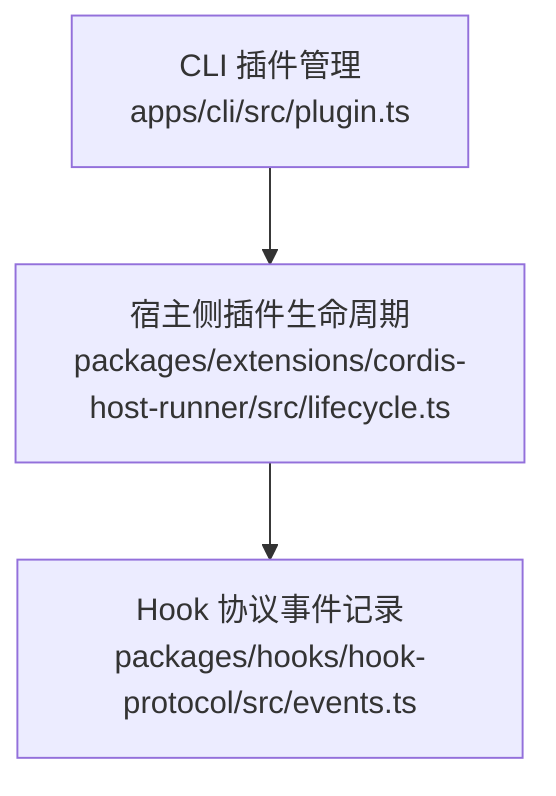
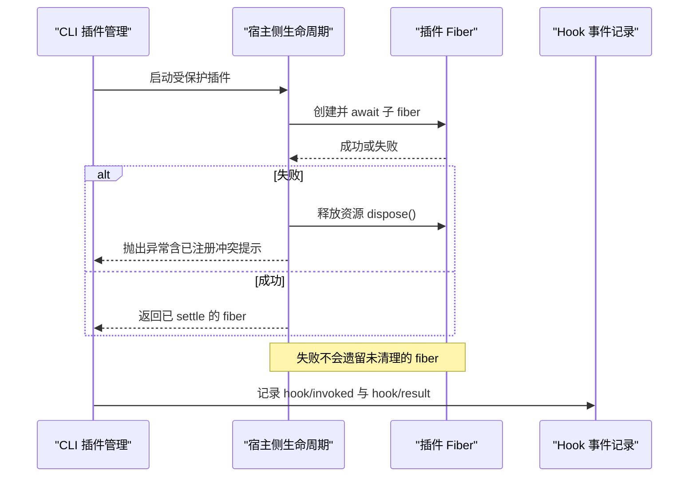
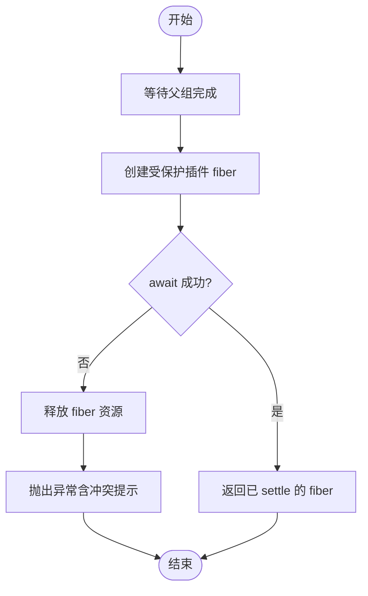
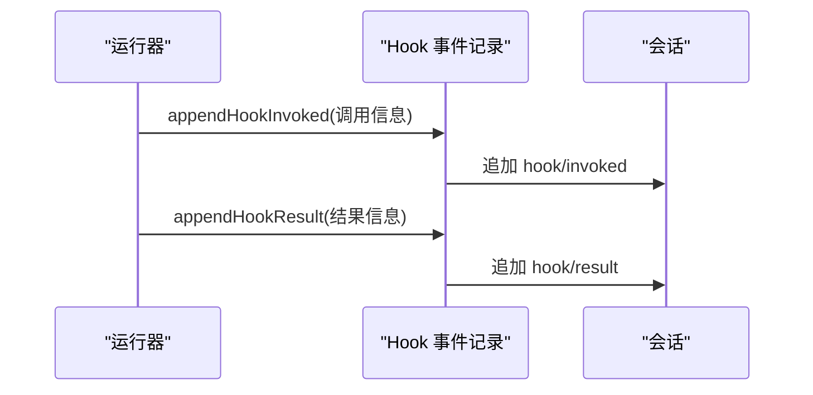
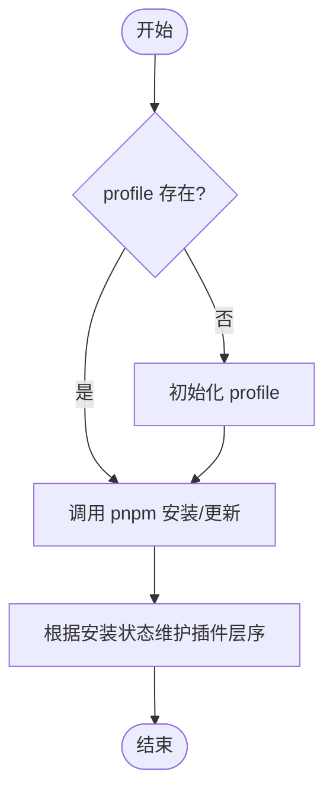
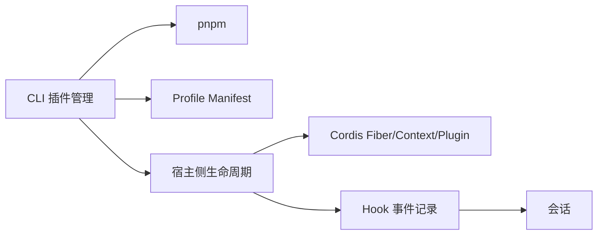

# 串行分发模式 (Serial)

<cite>
**本文引用的文件**
- [packages/extensions/cordis-host-runner/src/lifecycle.ts](file://packages/extensions/cordis-host-runner/src/lifecycle.ts)
- [packages/hooks/hook-protocol/src/events.ts](file://packages/hooks/hook-protocol/src/events.ts)
- [apps/cli/src/plugin.ts](file://apps/cli/src/plugin.ts)
</cite>

## 目录
1. [简介](#简介)
2. [项目结构](#项目结构)
3. [核心组件](#核心组件)
4. [架构总览](#架构总览)
5. [详细组件分析](#详细组件分析)
6. [依赖关系分析](#依赖关系分析)
7. [性能考量](#性能考量)
8. [故障排查指南](#故障排查指南)
9. [结论](#结论)
10. [附录](#附录)

## 简介
本文件围绕“串行分发模式（Serial）”在系统中的实现与执行顺序保证展开，重点解释：
- 如何按严格顺序依次执行监听器/阶段任务，确保强依赖关系的有序执行。
- 监听器的调度机制、优先级控制与执行队列管理。
- 性能特点：严格串行执行，适合有依赖关系的任务处理。
- 错误处理策略：前置监听器失败时后续监听器的处理方式。
- 具体代码示例路径，覆盖配置加载、初始化流程、数据准备等场景。
- 适用场景：启动流程、依赖注入、有序初始化等。

## 项目结构
与串行分发相关的核心位置包括：
- 宿主侧插件生命周期管理：负责以受保护的方式启动插件并保证失败不残留。
- Hook 协议事件记录：用于在会话中记录钩子调用与结果，便于审计与追踪。
- CLI 插件管理：通过 pnpm 安装/更新插件并维护插件层序，体现“有序加载”的编排思想。

图表来源
- [apps/cli/src/plugin.ts:120-158](file://apps/cli/src/plugin.ts#L120-L158)
- [packages/extensions/cordis-host-runner/src/lifecycle.ts:22-45](file://packages/extensions/cordis-host-runner/src/lifecycle.ts#L22-L45)
- [packages/hooks/hook-protocol/src/events.ts:75-104](file://packages/hooks/hook-protocol/src/events.ts#L75-L104)

章节来源
- [apps/cli/src/plugin.ts:120-158](file://apps/cli/src/plugin.ts#L120-L158)
- [packages/extensions/cordis-host-runner/src/lifecycle.ts:22-45](file://packages/extensions/cordis-host-runner/src/lifecycle.ts#L22-L45)
- [packages/hooks/hook-protocol/src/events.ts:75-104](file://packages/hooks/hook-protocol/src/events.ts#L75-L104)

## 核心组件
- 宿主侧插件生命周期（startHostHalf）：将插件包装为受保护的 fiber，等待其 settle；若失败则立即释放资源并抛出异常，避免失败 fiber 残留。
- Hook 事件记录（appendHookInvoked / appendHookResult）：在会话中追加 hook/invoked 与 hook/result 事件，形成可审计的调用-结果对。
- CLI 插件协调（runPlugin）：初始化 profile、调用 pnpm、根据安装状态维护插件层序，体现“有序加载”的编排。

章节来源
- [packages/extensions/cordis-host-runner/src/lifecycle.ts:22-45](file://packages/extensions/cordis-host-runner/src/lifecycle.ts#L22-L45)
- [packages/hooks/hook-protocol/src/events.ts:75-104](file://packages/hooks/hook-protocol/src/events.ts#L75-L104)
- [apps/cli/src/plugin.ts:120-158](file://apps/cli/src/plugin.ts#L120-L158)

## 架构总览
串行分发模式在本仓库中的体现是“阶段化 + 有序化”的组合：
- 阶段化：通过宿主侧 fiber 的生命周期，将插件启动视为一个阶段，确保阶段内资源正确创建与销毁。
- 有序化：CLI 层维护插件层序，按依赖顺序加入层栈；Hook 事件记录提供可追溯的执行轨迹。

图表来源
- [packages/extensions/cordis-host-runner/src/lifecycle.ts:22-45](file://packages/extensions/cordis-host-runner/src/lifecycle.ts#L22-L45)
- [packages/hooks/hook-protocol/src/events.ts:75-104](file://packages/hooks/hook-protocol/src/events.ts#L75-L104)
- [apps/cli/src/plugin.ts:120-158](file://apps/cli/src/plugin.ts#L120-L158)

## 详细组件分析

### 宿主侧插件生命周期（串行阶段入口）
- 职责：以受保护方式启动插件 fiber，确保失败时及时释放资源，避免悬挂的 fiber 影响后续阶段。
- 关键行为：
  - 等待父 group 完成后再启动子 fiber。
  - 捕获启动异常，先 dispose 再抛错，保证无残留。
  - 针对常见“已注册”冲突给出明确替换指引。
- 串行意义：作为“阶段”的原子入口，确保后续阶段只能在其成功后继续。

图表来源
- [packages/extensions/cordis-host-runner/src/lifecycle.ts:22-45](file://packages/extensions/cordis-host-runner/src/lifecycle.ts#L22-L45)

章节来源
- [packages/extensions/cordis-host-runner/src/lifecycle.ts:22-45](file://packages/extensions/cordis-host-runner/src/lifecycle.ts#L22-L45)

### Hook 事件记录（可审计的串行轨迹）
- 职责：在会话中追加 hook/invoked 与 hook/result，形成“调用-结果”配对，便于审计与问题定位。
- 关键行为：
  - 记录调用点、处理器 ID、匹配器等信息。
  - 记录结果决策、退出码、stderr 摘要与耗时。
- 串行意义：通过事件顺序反映执行顺序，辅助验证串行约束是否满足。

图表来源
- [packages/hooks/hook-protocol/src/events.ts:75-104](file://packages/hooks/hook-protocol/src/events.ts#L75-L104)

章节来源
- [packages/hooks/hook-protocol/src/events.ts:75-104](file://packages/hooks/hook-protocol/src/events.ts#L75-L104)

### CLI 插件管理（有序加载编排）
- 职责：初始化 profile、调用 pnpm 安装/更新插件、根据实际安装状态维护插件层序。
- 关键行为：
  - 首次使用初始化 profile。
  - 调用 pnpm 并处理平台差异（Windows shell）。
  - 根据依赖声明自动加入/移除插件层，保持层序与依赖一致。
- 串行意义：插件层序决定加载顺序，从而保证依赖关系被满足。

图表来源
- [apps/cli/src/plugin.ts:120-158](file://apps/cli/src/plugin.ts#L120-L158)

章节来源
- [apps/cli/src/plugin.ts:120-158](file://apps/cli/src/plugin.ts#L120-L158)

## 依赖关系分析
- 宿主侧生命周期依赖于 Cordis 的 Fiber/Context/Plugin 抽象，确保插件以 fiber 为单位进行隔离与生命周期管理。
- Hook 事件记录依赖会话对象，将调用与结果持久化到会话流中。
- CLI 插件管理依赖 pnpm 与 profile manifest，维护插件层序，间接影响后续加载顺序。

图表来源
- [apps/cli/src/plugin.ts:120-158](file://apps/cli/src/plugin.ts#L120-L158)
- [packages/extensions/cordis-host-runner/src/lifecycle.ts:22-45](file://packages/extensions/cordis-host-runner/src/lifecycle.ts#L22-L45)
- [packages/hooks/hook-protocol/src/events.ts:75-104](file://packages/hooks/hook-protocol/src/events.ts#L75-L104)

章节来源
- [apps/cli/src/plugin.ts:120-158](file://apps/cli/src/plugin.ts#L120-L158)
- [packages/extensions/cordis-host-runner/src/lifecycle.ts:22-45](file://packages/extensions/cordis-host-runner/src/lifecycle.ts#L22-L45)
- [packages/hooks/hook-protocol/src/events.ts:75-104](file://packages/hooks/hook-protocol/src/events.ts#L75-L104)

## 性能考量
- 严格串行执行：每个阶段（如插件启动）必须完成后才能进入下一阶段，避免了竞态条件，但整体延迟由最长阶段决定。
- 资源隔离：fiber 粒度隔离，失败即释放，减少内存与句柄泄漏风险。
- 可观测性：Hook 事件记录提供调用与结果的时序信息，便于性能分析与问题定位。
- 优化建议：
  - 将长耗时阶段拆分为更细粒度的串行阶段，提升可观测性与可控性。
  - 对 I/O 密集阶段引入超时与重试策略，避免阻塞后续阶段。
  - 利用 Hook 事件统计各阶段耗时，识别瓶颈。

## 故障排查指南
- 启动冲突（已注册）：当出现“already registered”错误时，需先停止旧版本实例再启动新版本，避免命名冲突。
- 插件安装失败：检查 pnpm 输出与 workspace 配置，特别是 git 依赖的 prepare 脚本是否被允许执行。
- 资源未释放：确认宿主侧生命周期是否正确 dispose 失败 fiber，避免悬挂资源。
- 执行顺序不符：核对插件层序与依赖声明，确保层序与实际依赖一致。

章节来源
- [packages/extensions/cordis-host-runner/src/lifecycle.ts:22-45](file://packages/extensions/cordis-host-runner/src/lifecycle.ts#L22-L45)
- [apps/cli/src/plugin.ts:120-158](file://apps/cli/src/plugin.ts#L120-L158)

## 结论
串行分发模式在本仓库中通过“阶段化 fiber 生命周期 + 有序插件层序 + 可审计 Hook 事件”共同实现：
- 严格的执行顺序与依赖关系得到保障。
- 错误处理清晰，失败阶段及时释放资源，不影响系统稳定性。
- 适用于启动流程、依赖注入、有序初始化等场景。
- 通过事件记录与层序管理，具备良好的可观测性与可维护性。

## 附录
- 典型应用场景与代码片段路径：
  - 配置加载与插件层序维护：[apps/cli/src/plugin.ts:120-158](file://apps/cli/src/plugin.ts#L120-L158)
  - 插件启动阶段（串行阶段入口）：[packages/extensions/cordis-host-runner/src/lifecycle.ts:22-45](file://packages/extensions/cordis-host-runner/src/lifecycle.ts#L22-L45)
  - 执行轨迹记录（hook/invoked 与 hook/result）：[packages/hooks/hook-protocol/src/events.ts:75-104](file://packages/hooks/hook-protocol/src/events.ts#L75-L104)