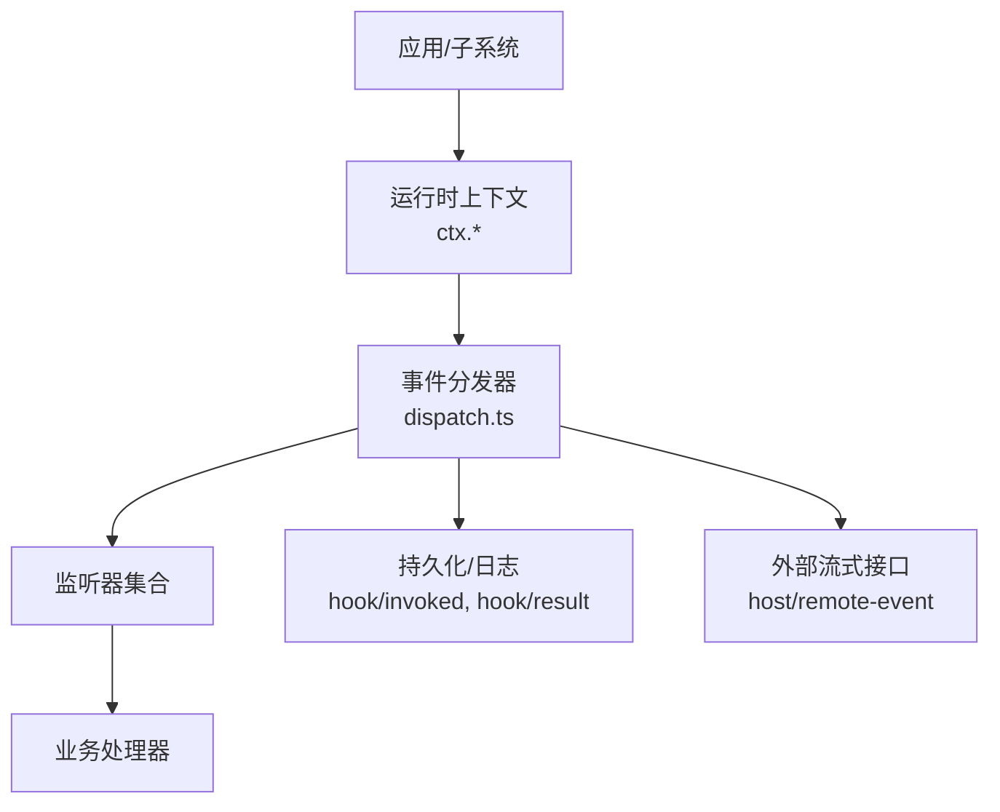
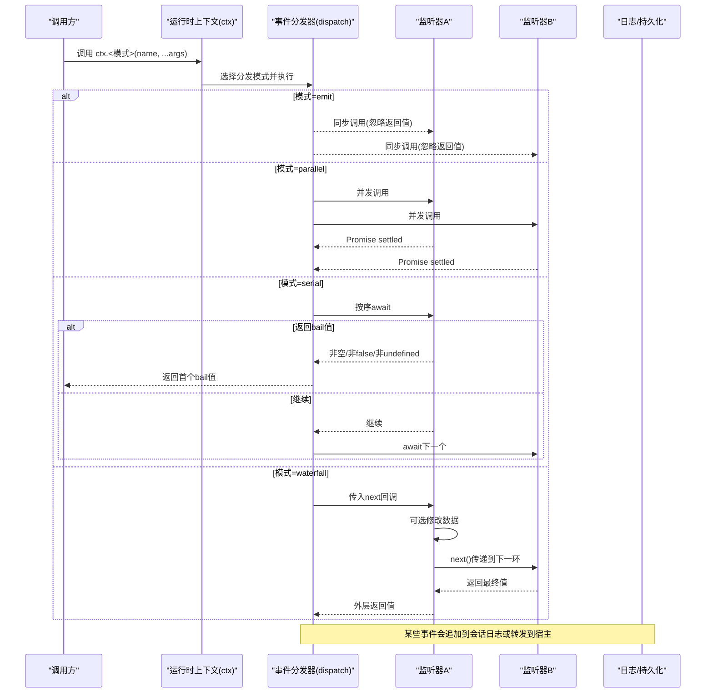
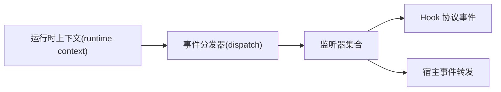

# 事件分发模式

<cite>
**本文引用的文件**
- [events.md](file://docs/cordis-api/events.md)
- [dispatch.ts](file://packages/core/agent/src/dispatch.ts)
- [runtime-context.ts](file://packages/core/agent-loop/src/runtime-context.ts)
- [events.ts](file://packages/hooks/hook-protocol/src/events.ts)
- [events.ts](file://packages/host/apiproxy/src/api/events.ts)
</cite>

## 目录
1. [简介](#简介)
2. [项目结构](#项目结构)
3. [核心组件](#核心组件)
4. [架构总览](#架构总览)
5. [详细组件分析](#详细组件分析)
6. [依赖关系分析](#依赖关系分析)
7. [性能考量](#性能考量)
8. [故障排查指南](#故障排查指南)
9. [结论](#结论)
10. [附录](#附录)

## 简介
本文件围绕四种事件分发模式展开：emit（广播）、waterfall（链式处理）、parallel（并行执行）、serial（串行处理）。结合代码库中的事件文档与实现位置，说明每种模式的语义、适用场景、性能特点与最佳实践，并给出使用示例的引用路径，帮助读者在不同业务场景中选择合适的分发策略。

## 项目结构
- 事件 API 与分发模式定义位于文档目录中，明确列出 ctx.emit、ctx.parallel、ctx.serial、ctx.bail、ctx.waterfall 等接口及 DispatchMode 类型。
- 实际的事件调度逻辑在核心包中，由 agent 层的 dispatch 模块负责具体实现；运行时上下文提供对事件的注入与调用入口。
- 上层子系统通过事件进行解耦通信，如 hook 协议将“钩子调用/结果”以事件形式追加到会话日志中；API 代理层将宿主事件以流式帧对外暴露。

图表来源
- [events.md:8-123](file://docs/cordis-api/events.md#L8-L123)
- [dispatch.ts](file://packages/core/agent/src/dispatch.ts)
- [runtime-context.ts](file://packages/core/agent-loop/src/runtime-context.ts)
- [events.ts:70-104](file://packages/hooks/hook-protocol/src/events.ts#L70-L104)
- [events.ts:144-155](file://packages/host/apiproxy/src/api/events.ts#L144-L155)

章节来源
- [events.md:8-123](file://docs/cordis-api/events.md#L8-L123)
- [dispatch.ts](file://packages/core/agent/src/dispatch.ts)
- [runtime-context.ts](file://packages/core/agent-loop/src/runtime-context.ts)
- [events.ts:70-104](file://packages/hooks/hook-protocol/src/events.ts#L70-L104)
- [events.ts:144-155](file://packages/host/apiproxy/src/api/events.ts#L144-L155)

## 核心组件
- 事件分发模式类型：DispatchMode 定义了 emit、parallel、serial、bail、waterfall 五种策略。
- 上下文方法：ctx.emit、ctx.parallel、ctx.serial、ctx.bail、ctx.waterfall 分别对应不同分发策略。
- 监听器注册：ctx.on、ctx.once 支持 prepend/global 选项，用于控制监听器顺序与作用域。
- 运行时集成：运行时上下文将事件能力混入每个上下文，供各子系统使用。
- 事件消费与记录：hook 协议将钩子调用与结果追加为会话事件；API 代理层允许宿主事件以远程事件形式转发。

章节来源
- [events.md:189-205](file://docs/cordis-api/events.md#L189-L205)
- [events.md:8-123](file://docs/cordis-api/events.md#L8-L123)
- [events.md:125-187](file://docs/cordis-api/events.md#L125-L187)
- [events.ts:70-104](file://packages/hooks/hook-protocol/src/events.ts#L70-L104)
- [events.ts:144-155](file://packages/host/apiproxy/src/api/events.ts#L144-L155)

## 架构总览
下图展示了从调用方到监听器的典型事件分发流程，以及不同模式下的执行差异。

图表来源
- [events.md:8-123](file://docs/cordis-api/events.md#L8-L123)
- [dispatch.ts](file://packages/core/agent/src/dispatch.ts)
- [events.ts:70-104](file://packages/hooks/hook-protocol/src/events.ts#L70-L104)
- [events.ts:144-155](file://packages/host/apiproxy/src/api/events.ts#L144-L155)

## 详细组件分析

### emit 模式（广播）
- 语义：同步调用所有监听器，忽略返回值。适用于通知型场景，无需等待监听器完成。
- 适用场景：
  - 状态变更通知（如 UI 刷新提示、统计上报）
  - 无副作用或副作用可被容忍的轻量操作
- 性能特点：
  - 低开销、无等待；但无法利用并发加速
  - 若监听器内部有阻塞 I/O，可能影响主线程响应性
- 最佳实践：
  - 确保监听器快速返回
  - 避免在 emit 中执行昂贵计算或网络请求
  - 需要异步或并发时改用 parallel

章节来源
- [events.md:31-49](file://docs/cordis-api/events.md#L31-L49)

### waterfall 模式（链式处理）
- 语义：最后一个参数为 next 延续；每个监听器可选择调用 next() 将控制权交给下一个监听器，不调用则拦截（veto）。
- 适用场景：
  - 权限校验、输入预处理、结果后处理等“过滤器链”
  - 需要中间环节修改事件数据并传递给后续环节
- 性能特点：
  - 顺序执行，整体耗时为各环节之和
  - 可通过短路（不调用 next）提前终止
- 最佳实践：
  - 将易失败或高成本步骤放在链前端，尽早失败
  - 保持 next 调用的幂等性与健壮性
  - 谨慎修改共享数据，避免副作用扩散

章节来源
- [events.md:97-123](file://docs/cordis-api/events.md#L97-L123)

### parallel 模式（并行执行）
- 语义：同时启动所有监听器，等待全部 settle 后返回。
- 适用场景：
  - 多个独立监听器需同时处理同一事件（如多路日志、多目标通知）
  - 对延迟敏感且监听器相互独立的场景
- 性能特点：
  - 总体延迟取决于最慢监听器
  - 并发度受系统资源限制，过多监听器可能导致资源竞争
- 最佳实践：
  - 监听器应无共享可变状态或做好并发保护
  - 对 I/O 密集型任务收益明显
  - 必要时限制并发度或增加超时/熔断

章节来源
- [events.md:8-29](file://docs/cordis-api/events.md#L8-L29)

### serial 模式（串行处理）
- 语义：按顺序 await 监听器，遇到第一个“bail 值”（非 null、非 false、非 undefined）即停止并返回。
- 适用场景：
  - 需要严格顺序处理的流水线（如鉴权→审计→落盘）
  - 任一环节失败即可中断后续流程
- 性能特点：
  - 总耗时为各环节累加；可因短路而减少总耗时
  - 适合存在强依赖或优先级明确的链路
- 最佳实践：
  - 将高概率失败的步骤前置，尽快短路
  - 保证监听器幂等，便于重试与恢复
  - 合理设计 bail 值语义，避免误判

章节来源
- [events.md:51-72](file://docs/cordis-api/events.md#L51-L72)

### 附加：bail 模式（同步短路）
- 语义：按序同步调用，遇到第一个 bail 值立即停止。
- 适用场景：纯同步的快速短路判断（如配置开关、白名单检查）。
- 注意：与 serial 类似，但不 await 异步监听器。

章节来源
- [events.md:74-95](file://docs/cordis-api/events.md#L74-L95)

### 事件注册与生命周期
- on/once：支持 prepend（插入到监听器列表前端）与 global（绕过上下文过滤）选项。
- once：首次触发后自动移除，适合一次性订阅。
- 建议：在组件/作用域销毁时及时移除监听器，避免内存泄漏。

章节来源
- [events.md:125-187](file://docs/cordis-api/events.md#L125-L187)

### 事件在系统中的落地
- Hook 协议：将“钩子调用/结果”追加到会话日志，形成可审计的持久化事件。
- API 代理：宿主事件通过远端事件通道转发，供客户端消费。

章节来源
- [events.ts:70-104](file://packages/hooks/hook-protocol/src/events.ts#L70-L104)
- [events.ts:144-155](file://packages/host/apiproxy/src/api/events.ts#L144-L155)

## 依赖关系分析
- 运行时上下文向各子系统注入事件能力，子系统通过 ctx.* 调用分发器。
- 分发器根据模式组织监听器执行，并与日志/持久化、外部流式接口交互。
- 事件类型与契约在各子系统间解耦，降低耦合度，提升扩展性。

图表来源
- [runtime-context.ts](file://packages/core/agent-loop/src/runtime-context.ts)
- [dispatch.ts](file://packages/core/agent/src/dispatch.ts)
- [events.ts:70-104](file://packages/hooks/hook-protocol/src/events.ts#L70-L104)
- [events.ts:144-155](file://packages/host/apiproxy/src/api/events.ts#L144-L155)

章节来源
- [runtime-context.ts](file://packages/core/agent-loop/src/runtime-context.ts)
- [dispatch.ts](file://packages/core/agent/src/dispatch.ts)
- [events.ts:70-104](file://packages/hooks/hook-protocol/src/events.ts#L70-L104)
- [events.ts:144-155](file://packages/host/apiproxy/src/api/events.ts#L144-L155)

## 性能考量
- emit：最低开销，适合轻量通知；不适合重负载监听器。
- parallel：最大化吞吐，适合独立 I/O；需关注并发上限与资源争用。
- serial/waterfall：顺序执行，可控性强；适合有依赖或需短路的链路。
- 通用建议：
  - 为监听器设置超时与重试上限
  - 对热点事件做节流/合并
  - 监控关键指标（延迟、错误率、资源占用）

[本节为通用指导，不直接分析具体文件]

## 故障排查指南
- 常见问题：
  - 监听器未触发：检查是否注册成功、作用域过滤是否阻止、是否被 once 消耗。
  - 顺序不符合预期：确认是否使用了 prepend；waterfall 是否遗漏 next 调用导致短路。
  - 并发异常：parallel 模式下监听器共享状态导致的竞态；考虑加锁或改为串行。
  - 性能退化：过多监听器或监听器内阻塞 I/O；考虑拆分事件或优化监听器。
- 定位手段：
  - 通过 hook/invoked 与 hook/result 事件追踪钩子执行与结果
  - 借助宿主远端事件通道观察跨进程事件流转
  - 在关键监听器前后添加日志与埋点

章节来源
- [events.ts:70-104](file://packages/hooks/hook-protocol/src/events.ts#L70-L104)
- [events.ts:144-155](file://packages/host/apiproxy/src/api/events.ts#L144-L155)

## 结论
- 选择分发模式的关键在于“是否需要顺序”“是否需要并发”“是否需要短路”。
- emit 适合广播通知；waterfall 适合链式处理与拦截；parallel 适合独立任务的并发加速；serial 适合严格顺序与短路控制。
- 结合运行时上下文与持久化/转发机制，可在复杂系统中构建高内聚、低耦合的事件驱动架构。

[本节为总结性内容，不直接分析具体文件]

## 附录

### 使用示例（引用路径）
- 广播通知（emit）：参考事件文档中对 ctx.emit 的定义与说明。
  - 参考路径：[events.md:31-49](file://docs/cordis-api/events.md#L31-L49)
- 链式处理（waterfall）：参考 ctx.waterfall 的 next 延续语义。
  - 参考路径：[events.md:97-123](file://docs/cordis-api/events.md#L97-L123)
- 并行执行（parallel）：参考 ctx.parallel 的并发语义与返回时机。
  - 参考路径：[events.md:8-29](file://docs/cordis-api/events.md#L8-L29)
- 串行处理（serial）：参考 ctx.serial 的顺序 await 与 bail 短路。
  - 参考路径：[events.md:51-72](file://docs/cordis-api/events.md#L51-L72)
- 监听器注册（on/once）：参考 EventOptions 的 prepend/global 选项。
  - 参考路径：[events.md:125-187](file://docs/cordis-api/events.md#L125-L187)
- 事件落地（Hook 协议）：参考 hook/invoked 与 hook/result 的追加方式。
  - 参考路径：[events.ts:70-104](file://packages/hooks/hook-protocol/src/events.ts#L70-L104)
- 宿主事件转发：参考 host/remote-event 的透传机制。
  - 参考路径：[events.ts:144-155](file://packages/host/apiproxy/src/api/events.ts#L144-L155)