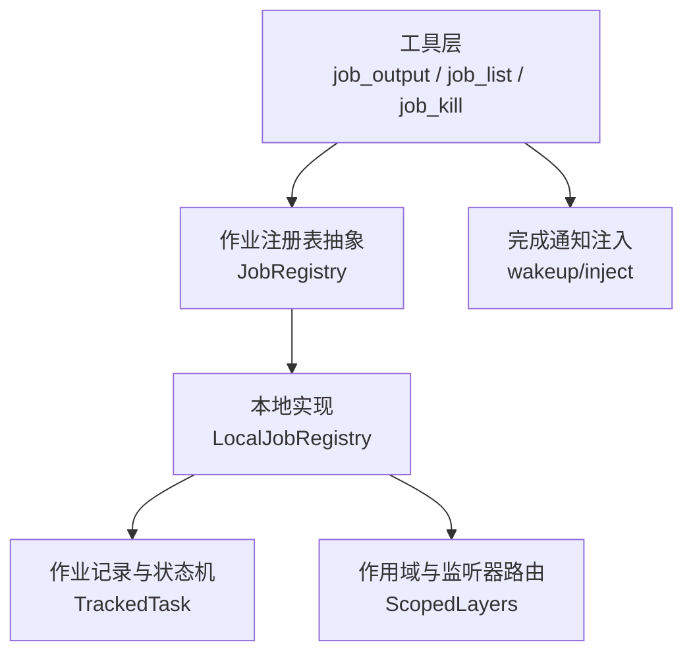
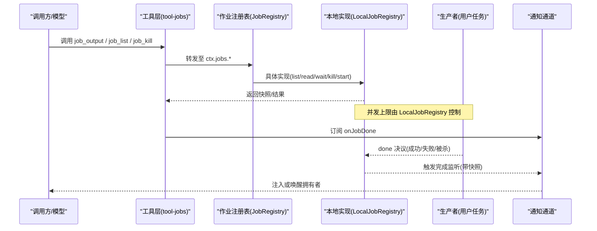
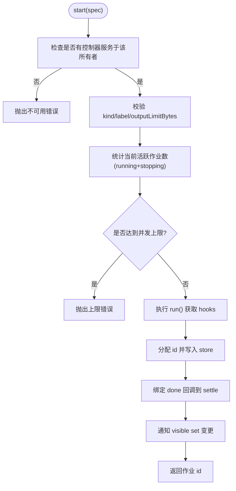
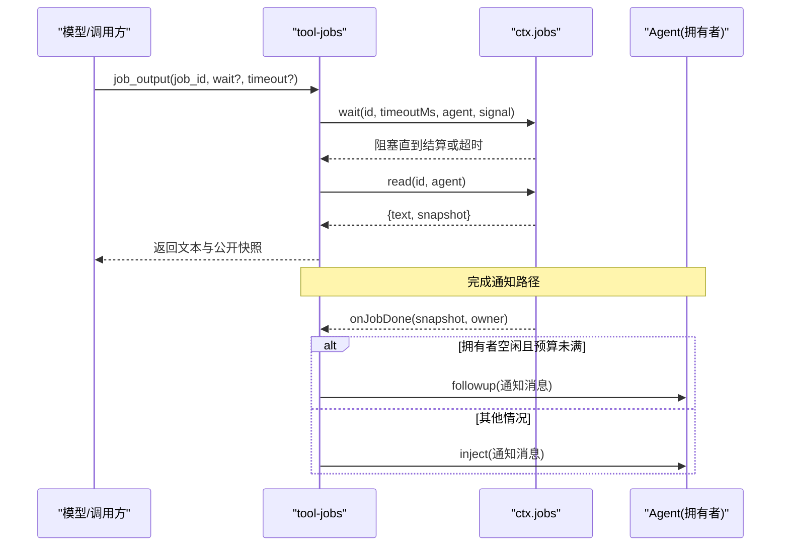
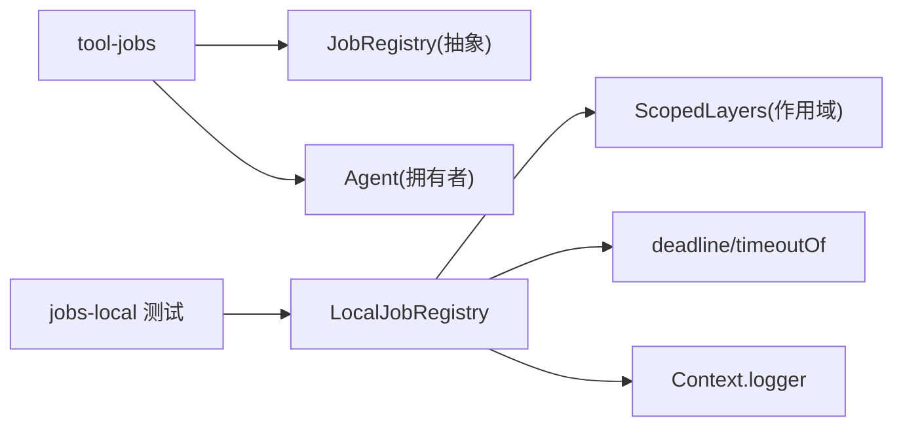

# 并行分发模式（Parallel）

<cite>
**本文引用的文件**
- [packages/jobs/jobs/src/index.ts](file://packages/jobs/jobs/src/index.ts)
- [packages/jobs/jobs/src/types.ts](file://packages/jobs/jobs/src/types.ts)
- [packages/jobs/jobs-local/src/index.ts](file://packages/jobs/jobs-local/src/index.ts)
- [packages/jobs/tool-jobs/src/index.ts](file://packages/jobs/tool-jobs/src/index.ts)
- [packages/jobs/jobs-local/tests/jobs.spec.ts](file://packages/jobs/jobs-local/tests/jobs.spec.ts)
</cite>

## 目录
1. [简介](#简介)
2. [项目结构](#项目结构)
3. [核心组件](#核心组件)
4. [架构总览](#架构总览)
5. [详细组件分析](#详细组件分析)
6. [依赖关系分析](#依赖关系分析)
7. [性能考量](#性能考量)
8. [故障排查指南](#故障排查指南)
9. [结论](#结论)
10. [附录：使用示例与适用场景](#附录使用示例与适用场景)

## 简介
本文件围绕“并行分发模式”在代码库中的实现进行系统化说明。该模式通过后台作业注册表将多个监听器/任务以并发方式执行，并通过严格的并发上限、生命周期管理与错误处理策略，确保在高吞吐场景下的稳定性与可观测性。其核心能力包括：
- 同时启动多个任务并并行执行，适合计算密集型或 I/O 密集型批量处理
- 按“精确所有者”维度限制最大并发数，避免资源耗尽
- 提供等待、读取、取消、完成通知等完整生命周期控制
- 对部分失败具备容错与隔离，保证整体流程可控

## 项目结构
与并行分发相关的核心位于 jobs 系列包：
- 抽象接口与类型定义：jobs 包
- 进程内本地实现：jobs-local 包
- 面向模型的工具与通知：tool-jobs 包
- 测试用例验证并发上限、等待、取消等行为：jobs-local 测试

图表来源
- [packages/jobs/tool-jobs/src/index.ts:205-403](file://packages/jobs/tool-jobs/src/index.ts#L205-L403)
- [packages/jobs/jobs/src/index.ts:62-177](file://packages/jobs/jobs/src/index.ts#L62-L177)
- [packages/jobs/jobs-local/src/index.ts:91-129](file://packages/jobs/jobs-local/src/index.ts#L91-L129)

章节来源
- [packages/jobs/jobs/src/index.ts:62-177](file://packages/jobs/jobs/src/index.ts#L62-L177)
- [packages/jobs/jobs-local/src/index.ts:91-129](file://packages/jobs/jobs-local/src/index.ts#L91-L129)
- [packages/jobs/tool-jobs/src/index.ts:205-403](file://packages/jobs/tool-jobs/src/index.ts#L205-L403)

## 核心组件
- JobRegistry（抽象注册表）：定义 start/list/get/read/kill/wait/onJobDone/onJobsChanged/attachController 等契约，负责身份、所有权、生命周期与完成监听。
- LocalJobRegistry（本地实现）：内存中维护作业记录，提供并发上限控制、等待/超时、取消、快照投影、变更通知与作用域隔离。
- Tool-Jobs（工具与通知）：暴露 job_output/job_list/job_kill 工具，并将未报告的完成结果注入到拥有者（忙碌时注入，空闲时可唤醒）。
- 类型与快照：统一描述作业状态、输出、观察者回调与可见快照。

章节来源
- [packages/jobs/jobs/src/index.ts:62-177](file://packages/jobs/jobs/src/index.ts#L62-L177)
- [packages/jobs/jobs-local/src/index.ts:91-129](file://packages/jobs/jobs-local/src/index.ts#L91-L129)
- [packages/jobs/tool-jobs/src/index.ts:205-403](file://packages/jobs/tool-jobs/src/index.ts#L205-L403)
- [packages/jobs/jobs/src/types.ts:13-161](file://packages/jobs/jobs/src/types.ts#L13-L161)

## 架构总览
下图展示从工具调用到作业注册、执行、等待与完成的端到端流程，以及完成通知如何回注到拥有者。

图表来源
- [packages/jobs/tool-jobs/src/index.ts:279-300](file://packages/jobs/tool-jobs/src/index.ts#L279-L300)
- [packages/jobs/jobs-local/src/index.ts:416-440](file://packages/jobs/jobs-local/src/index.ts#L416-L440)
- [packages/jobs/jobs/src/index.ts:131-177](file://packages/jobs/jobs/src/index.ts#L131-L177)

## 详细组件分析

### 作业注册表抽象（JobRegistry）
- 职责：定义作业生命周期与访问控制；保证“先决检查—原子注册—结算—通知”的严格顺序；支持 owner 相对的作用域与控制器挂载。
- 关键方法：
  - start：预检、校验、计数、分配 id、注册记录、绑定 done/cancel/readOutput、通知变更
  - list/get/read：只读快照与流式读取
  - kill：请求取消并标记 stopping/reported
  - wait：带超时与信号的可中断等待
  - onJobDone/onJobsChanged：作用域感知的完成与变更通知
  - attachController：声明可收集/停止工作的控制器范围

章节来源
- [packages/jobs/jobs/src/index.ts:62-177](file://packages/jobs/jobs/src/index.ts#L62-L177)

### 本地实现（LocalJobRegistry）
- 并发控制：
  - 每个“精确所有者”桶维护 running + stopping 计数，超过配置上限则拒绝新作业
  - 默认上限为 10，可通过配置调整
- 生命周期：
  - TrackedTask 记录作业元数据、状态、输出、时间戳、waiters、settled Promise 等
  - settle 采用“首次获胜”语义：仅一次终态、释放等待者、最后通知完成
- 等待与超时：
  - wait 支持 deadline 与 AbortSignal，区分超时与主动中止
  - 等待者在结算前被登记，结算后统一释放
- 作用域与隔离：
  - ScopedLayers 按注册上下文分层，完成与变更通知仅投递到可达的作用域链
  - 访问控制基于 session id 隔离
- 清理与销毁：
  - 服务销毁时关闭监听、取消所有作业、等待结算、清空存储并通知变更
  - 所有者销毁时自动取消并等待其作业结束

图表来源
- [packages/jobs/jobs-local/src/index.ts:131-189](file://packages/jobs/jobs-local/src/index.ts#L131-L189)

章节来源
- [packages/jobs/jobs-local/src/index.ts:131-189](file://packages/jobs/jobs-local/src/index.ts#L131-L189)
- [packages/jobs/jobs-local/src/index.ts:230-279](file://packages/jobs/jobs-local/src/index.ts#L230-L279)
- [packages/jobs/jobs-local/src/index.ts:416-440](file://packages/jobs/jobs-local/src/index.ts#L416-L440)
- [packages/jobs/jobs-local/src/index.ts:467-531](file://packages/jobs/jobs-local/src/index.ts#L467-L531)

### 工具与通知（tool-jobs）
- 暴露三个工具：
  - job_output：读取作业输出或等待结算，支持超时上限
  - job_list：列出当前会话可见的作业
  - job_kill：请求取消作业
- 完成通知：
  - 对未报告的完成，若拥有者空闲且预算允许，直接唤醒；否则注入到下一轮
  - 防止自激循环：通过 maxConsecutiveWakes 限制连续唤醒次数

图表来源
- [packages/jobs/tool-jobs/src/index.ts:302-403](file://packages/jobs/tool-jobs/src/index.ts#L302-L403)
- [packages/jobs/tool-jobs/src/index.ts:279-300](file://packages/jobs/tool-jobs/src/index.ts#L279-L300)

章节来源
- [packages/jobs/tool-jobs/src/index.ts:205-403](file://packages/jobs/tool-jobs/src/index.ts#L205-L403)

### 类型与快照
- JobStatus：running → stopping → completed/killed/failed
- JobOutcome：包含状态、detail、最终输出
- JobSnapshot：对外只读视图，含 id、kind、label、status、时间戳、reported 等
- JobRead：流式读取增量或终态输出
- JobDoneListener/JobsChangedListener：完成与可见集变更回调

章节来源
- [packages/jobs/jobs/src/types.ts:13-161](file://packages/jobs/jobs/src/types.ts#L13-L161)

## 依赖关系分析
- tool-jobs 依赖 JobRegistry 抽象与 Agent 系统，用于工具执行与通知注入
- LocalJobRegistry 依赖作用域机制、超时工具与日志，实现并发控制与生命周期管理
- 测试覆盖并发上限、控制器作用域、等待/超时、取消与结算顺序等关键行为

图表来源
- [packages/jobs/tool-jobs/src/index.ts:205-403](file://packages/jobs/tool-jobs/src/index.ts#L205-L403)
- [packages/jobs/jobs-local/src/index.ts:91-129](file://packages/jobs/jobs-local/src/index.ts#L91-L129)
- [packages/jobs/jobs-local/tests/jobs.spec.ts:113-200](file://packages/jobs/jobs-local/tests/jobs.spec.ts#L113-L200)

章节来源
- [packages/jobs/jobs-local/tests/jobs.spec.ts:113-200](file://packages/jobs/jobs-local/tests/jobs.spec.ts#L113-L200)

## 性能考量
- 并行执行特性：
  - 所有监听器/任务在达到并发上限前并行启动，最大化吞吐，适合计算密集或 I/O 密集任务
- 并发上限：
  - 按“精确所有者”维度限制，避免单会话资源争用；默认 10，可按需调优
- 等待与超时：
  - wait 支持 deadline 与 AbortSignal，避免无界阻塞；超时不会取消作业本身
- 输出截断：
  - 支持 outputLimitBytes，控制单次通知/输出的字节上限，降低大输出对链路的影响
- 通知节流：
  - wakeup 预算限制连续唤醒次数，防止自激循环导致过多模型回合

[本节为通用性能讨论，不直接分析具体文件]

## 故障排查指南
- 常见错误与定位：
  - “无控制器服务于该所有者”：未在对应作用域加载 tool-jobs 或未 attachController
  - “达到并发上限”：同一所有者下 running/stopping 数量已达上限，需等待或主动 kill
  - “无效参数”：kind/label 为空、outputLimitBytes 非正整数、maxConcurrentJobsPerOwner 非法
  - “未知作业/跨会话访问”：id 不存在或 caller 与 owner 不匹配
- 调试建议：
  - 使用 job_list 查看当前可见作业集合
  - 使用 job_output 配合 wait=true 与合理 timeout 观察结算
  - 使用 job_kill 主动终止不再需要的作业
  - 关注 onJobDone 与 onJobsChanged 的日志与副作用

章节来源
- [packages/jobs/jobs-local/src/index.ts:131-189](file://packages/jobs/jobs-local/src/index.ts#L131-L189)
- [packages/jobs/jobs-local/src/index.ts:230-279](file://packages/jobs/jobs-local/src/index.ts#L230-L279)
- [packages/jobs/tool-jobs/src/index.ts:302-403](file://packages/jobs/tool-jobs/src/index.ts#L302-L403)
- [packages/jobs/jobs-local/tests/jobs.spec.ts:113-200](file://packages/jobs/jobs-local/tests/jobs.spec.ts#L113-L200)

## 结论
并行分发模式在本仓库中以“作业注册表 + 本地实现 + 工具与通知”的分层设计落地，既保证了高并发下的吞吐能力，又通过严格的并发上限、作用域隔离、等待/超时与完成通知机制，提供了稳定可靠的执行保障。对于批量数据处理、并行计算任务、多文件/多网络请求等场景，该模式提供了开箱即用的基础设施。

[本节为总结性内容，不直接分析具体文件]

## 附录：使用示例与适用场景
- 典型用法（概念性步骤，不含代码片段）：
  - 启动多个任务：为每个任务构造 JobStart（指定 kind、label、可选 owner 与 outputLimitBytes），调用 start 获得作业 id
  - 并行读取与等待：对需要阻塞的场景使用 job_output 的 wait=true 与合理 timeout；对无需阻塞的场景直接读取增量输出
  - 列表与取消：通过 job_list 查看运行中作业；对不再需要的作业使用 job_kill 请求取消
  - 完成通知：订阅 onJobDone，根据快照决定后续动作（如聚合结果、重试、上报）
- 适用场景：
  - 批量文件处理：多文件并行读取/转换/写入
  - 并行网络请求：多端点并发拉取与合并
  - 数据计算任务：分片计算、特征工程、批推理
  - 子代理/工作流：多子任务并行推进，主流程汇总结果

[本节为概念性指导，不直接分析具体文件]