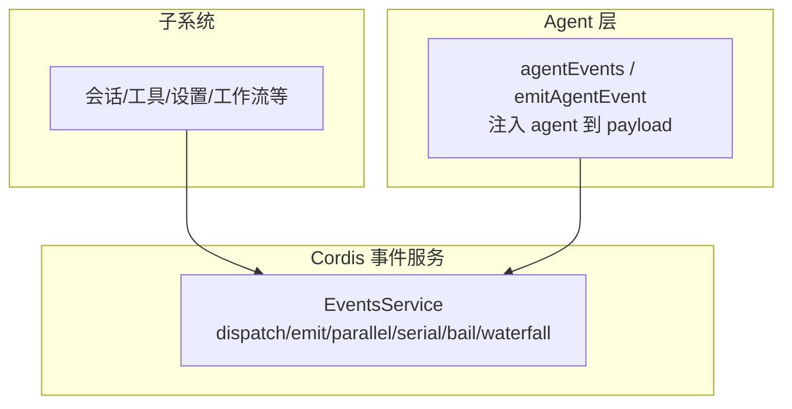
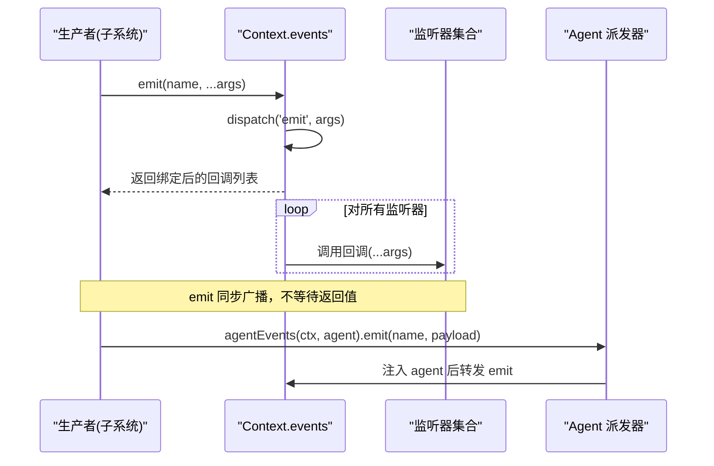
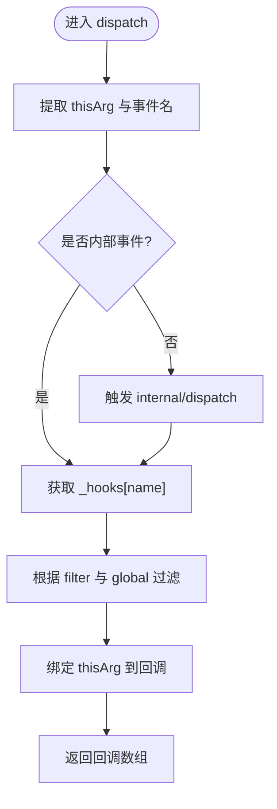
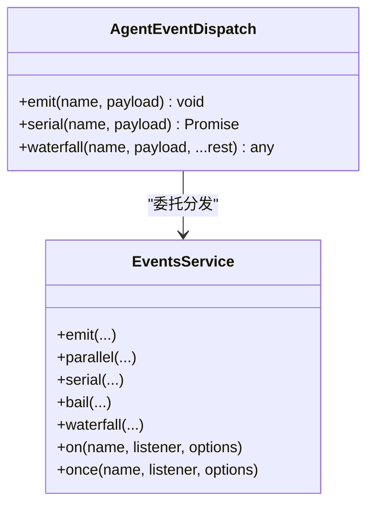
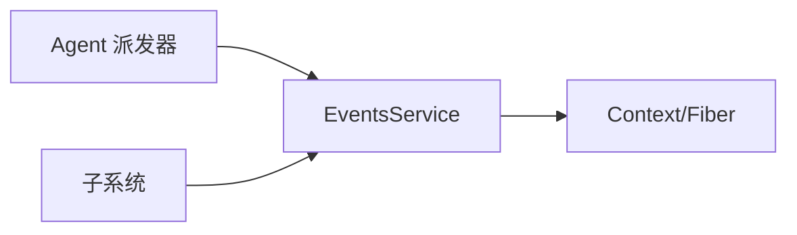

# 广播分发模式 (Emit)

<cite>
**本文引用的文件**
- [vendor/cordis/src/events.ts](file://vendor/cordis/src/events.ts)
- [docs/cordis-api/events.md](file://docs/cordis-api/events.md)
- [packages/core/agent/src/dispatch.ts](file://packages/core/agent/src/dispatch.ts)
- [packages/core/agent/src/runtime-types.ts](file://packages/core/agent/src/runtime-types.ts)
- [docs/event-producer-consumer.md](file://docs/event-producer-consumer.md)
</cite>

## 目录
1. [简介](#简介)
2. [项目结构](#项目结构)
3. [核心组件](#核心组件)
4. [架构总览](#架构总览)
5. [详细组件分析](#详细组件分析)
6. [依赖关系分析](#依赖关系分析)
7. [性能考量](#性能考量)
8. [故障排查指南](#故障排查指南)
9. [结论](#结论)
10. [附录](#附录)

## 简介
本文件围绕“emit 广播分发模式”展开，解释该模式如何在系统中向所有已注册的监听器发送事件通知，适用于需要广播消息的场景。重点包括：
- 监听器的注册与注销机制
- 事件数据的传递方式
- 并发特性：所有监听器并行执行（emit 为同步广播；parallel 为异步并行等待）
- 使用示例：监听器注册、事件触发、错误处理
- 适用场景：系统状态变更通知、用户操作反馈等

## 项目结构
与 emit 广播分发相关的核心实现位于 Cordis 事件服务中，并在 Agent 层提供封装和类型安全的事件派发能力。文档与矩阵展示了各子系统如何使用 emit/parallel/serial/waterfall 等模式。

图表来源
- [vendor/cordis/src/events.ts:131-319](file://vendor/cordis/src/events.ts#L131-L319)
- [packages/core/agent/src/dispatch.ts:107-165](file://packages/core/agent/src/dispatch.ts#L107-L165)

章节来源
- [vendor/cordis/src/events.ts:131-319](file://vendor/cordis/src/events.ts#L131-L319)
- [packages/core/agent/src/dispatch.ts:107-165](file://packages/core/agent/src/dispatch.ts#L107-L165)

## 核心组件
- EventsService：事件总线，提供多种分发模式（emit、parallel、serial、bail、waterfall），并管理监听器生命周期。
- Agent 事件派发：在 Agent 上下文中将 agent 注入 payload，并提供 emit/serial/waterfall 三种调用方式，保证作用域隔离与类型安全。
- 事件声明与矩阵：通过类型声明与生成文档明确事件名、参数、分发模式以及生产者/消费者关系。

章节来源
- [vendor/cordis/src/events.ts:131-319](file://vendor/cordis/src/events.ts#L131-L319)
- [packages/core/agent/src/dispatch.ts:107-165](file://packages/core/agent/src/dispatch.ts#L107-L165)
- [docs/cordis-api/events.md:8-123](file://docs/cordis-api/events.md#L8-L123)
- [docs/event-producer-consumer.md:8-66](file://docs/event-producer-consumer.md#L8-L66)

## 架构总览
emit 广播分发的关键流程如下：
- 监听器注册：通过 ctx.on(ctx.once) 将回调登记到对应事件名下，支持 prepend/global 选项，并由 Fiber 自动回收。
- 事件派发：ctx.emit 同步遍历所有匹配监听器并调用；ctx.parallel 并行等待所有监听器完成；ctx.serial/bail/waterfall 用于顺序或可中断的链式处理。
- 作用域过滤：可通过 thisArg 与 Context.filter 进行上下文过滤，确保仅目标作用域的监听器被触发。
- Agent 增强：agentEvents 将 agent 注入 payload，并以 emit/serial/waterfall 暴露，便于在 Agent 作用域内广播。

图表来源
- [vendor/cordis/src/events.ts:165-196](file://vendor/cordis/src/events.ts#L165-L196)
- [packages/core/agent/src/dispatch.ts:120-137](file://packages/core/agent/src/dispatch.ts#L120-L137)

## 详细组件分析

### 事件服务 EventsService
- 分发模式
  - emit：同步遍历并调用所有监听器，忽略返回值。
  - parallel：Promise.allSettled 并行等待所有监听器完成，聚合异常。
  - serial：按序 await，遇到“bail”值即停止。
  - bail：同步顺序，遇到“bail”值即停止。
  - waterfall：最后一个参数作为 next，监听器可决定是否继续后续链。
- 监听器注册与注销
  - on：在当前 Fiber 下注册监听器，返回 disposer；once 首次调用后自动注销。
  - register/unregister：底层存储 Hook 记录，支持 prepend/global 选项。
  - 自动回收：监听器随所属 Fiber 的生命周期自动清理。
- 作用域与过滤
  - dispatch 会提取 thisArg，并通过 Context.filter 对监听器进行过滤。
  - internal/dispatch 可用于诊断与监控。

图表来源
- [vendor/cordis/src/events.ts:165-175](file://vendor/cordis/src/events.ts#L165-L175)

章节来源
- [vendor/cordis/src/events.ts:165-243](file://vendor/cordis/src/events.ts#L165-L243)
- [vendor/cordis/src/events.ts:254-319](file://vendor/cordis/src/events.ts#L254-L319)

### Agent 事件派发器
- agentEvents：为指定 Agent 构建派发器，将 agent 注入 payload，避免重复分配。
- emit：对每个监听器独立 try/catch，捕获抛错与 Promise rejection，并记录日志，确保一个监听器的失败不影响其他监听器。
- serial/waterfall：复用 Cordis 的串行与瀑布流模式，在 Agent 作用域内执行。

图表来源
- [packages/core/agent/src/dispatch.ts:54-82](file://packages/core/agent/src/dispatch.ts#L54-L82)
- [packages/core/agent/src/dispatch.ts:107-147](file://packages/core/agent/src/dispatch.ts#L107-L147)
- [vendor/cordis/src/events.ts:183-243](file://vendor/cordis/src/events.ts#L183-L243)

章节来源
- [packages/core/agent/src/dispatch.ts:107-165](file://packages/core/agent/src/dispatch.ts#L107-L165)

### 事件声明与使用矩阵
- 事件声明：在各子系统的类型文件中声明事件名、参数与作用域，标注 @mode（emit/parallel/serial/bail/waterfall）。
- 生产者/消费者矩阵：自动生成表格，展示哪些包负责派发、哪些包订阅，便于理解系统耦合与数据流。

章节来源
- [packages/core/agent/src/runtime-types.ts:150-293](file://packages/core/agent/src/runtime-types.ts#L150-L293)
- [docs/event-producer-consumer.md:8-66](file://docs/event-producer-consumer.md#L8-L66)

## 依赖关系分析
- EventsService 依赖 Context、Fiber、工具类以完成监听器管理与生命周期回收。
- Agent 派发器依赖 Cordis 的 Context 与 Scope 能力，确保事件仅在正确的 Agent 作用域内广播。
- 子系统通过 ctx.emit/parallel/serial/waterfall 与 Agent 派发器协作，形成松耦合的事件驱动架构。

图表来源
- [vendor/cordis/src/events.ts:1-6](file://vendor/cordis/src/events.ts#L1-L6)
- [packages/core/agent/src/dispatch.ts:9-13](file://packages/core/agent/src/dispatch.ts#L9-L13)

章节来源
- [vendor/cordis/src/events.ts:1-6](file://vendor/cordis/src/events.ts#L1-L6)
- [packages/core/agent/src/dispatch.ts:9-13](file://packages/core/agent/src/dispatch.ts#L9-L13)

## 性能考量
- emit：同步广播，无等待开销，适合高频通知型场景；单个监听器抛错不会影响其他监听器。
- parallel：并行等待所有监听器完成，适合需要汇总结果或统一等待的场景；异常会被聚合抛出。
- serial/bail：顺序执行，遇到“bail”值提前终止，适合有优先级或短路逻辑的处理链。
- waterfall：通过 next 控制链路，适合拦截与改写行为。
- 作用域过滤：减少不必要的监听器调用，降低广播成本。
- 监听器数量增长：大量监听器会增加遍历与调用开销，建议按需注册与及时注销。

[本节为通用性能讨论，不直接分析具体文件]

## 故障排查指南
- 监听器未触发
  - 检查是否正确注册（ctx.on/ctx.once），是否在正确的 Fiber 中注册。
  - 检查作用域过滤：thisArg 与 Context.filter 是否导致监听器被过滤。
  - 查看 internal/dispatch 诊断事件，确认派发路径。
- 监听器抛错
  - emit 模式下，抛错会被捕获并记录日志，不会阻断其他监听器。
  - parallel 模式下，所有监听器完成后会聚合异常抛出，需捕获 AggregateError。
- 内存泄漏
  - 确保监听器在不再需要时通过 disposer 注销，或在 Fiber 销毁时自动回收。
  - 避免在长生命周期对象上持有过多监听器引用。

章节来源
- [vendor/cordis/src/events.ts:165-196](file://vendor/cordis/src/events.ts#L165-L196)
- [vendor/cordis/src/events.ts:183-187](file://vendor/cordis/src/events.ts#L183-L187)
- [packages/core/agent/src/dispatch.ts:120-137](file://packages/core/agent/src/dispatch.ts#L120-L137)

## 结论
emit 广播分发模式提供了高效、解耦的通知机制，适用于系统状态变更、用户操作反馈等场景。通过 Cordis 的 EventsService 与 Agent 派发器，开发者可以：
- 以最小代价向所有监听器广播事件
- 选择合适分发模式（emit/parallel/serial/bail/waterfall）满足不同需求
- 利用作用域过滤与生命周期管理，确保性能与稳定性

[本节为总结性内容，不直接分析具体文件]

## 附录

### 使用示例（概念性步骤）
- 注册监听器
  - 使用 ctx.on('event/name', handler) 或 ctx.once('event/name', handler) 注册。
  - 可在 options 中使用 prepend/global 控制插入位置与全局接收。
- 触发事件
  - 使用 ctx.emit('event/name', ...args) 进行同步广播。
  - 使用 ctx.parallel('event/name', ...args) 并行等待所有监听器完成。
  - 在 Agent 作用域内使用 agentEvents(ctx, agent).emit(name, payload) 注入 agent。
- 错误处理
  - emit：监听器内部 try/catch 或 Promise.catch，避免影响其他监听器。
  - parallel：捕获 AggregateError，定位失败的监听器。
- 注销监听器
  - 使用 ctx.on 返回的 disposer 主动注销。
  - 或通过 Fiber 生命周期自动回收。

[本节为概念性说明，不直接分析具体文件]