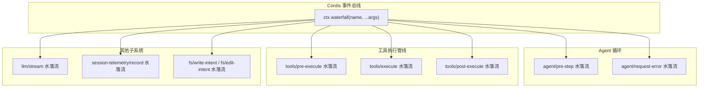
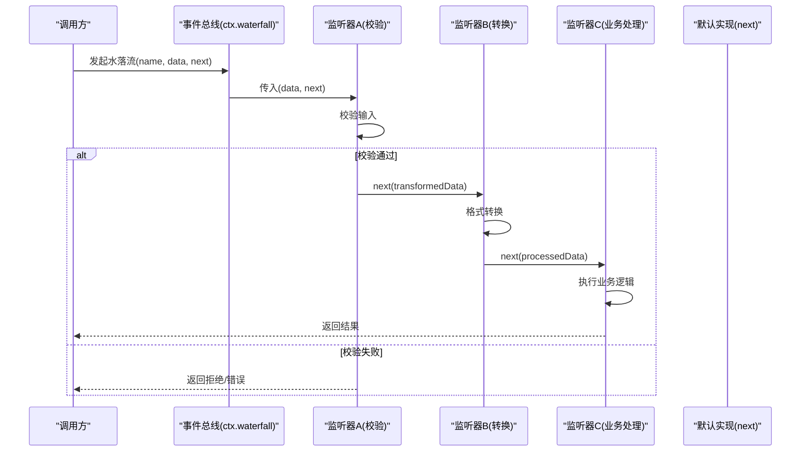
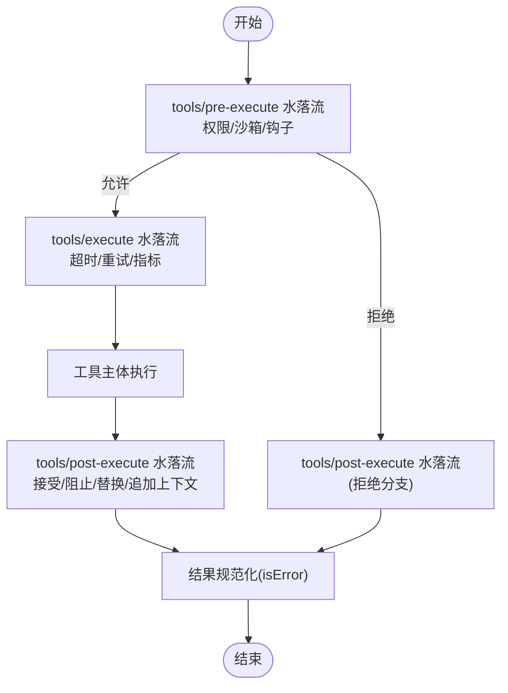
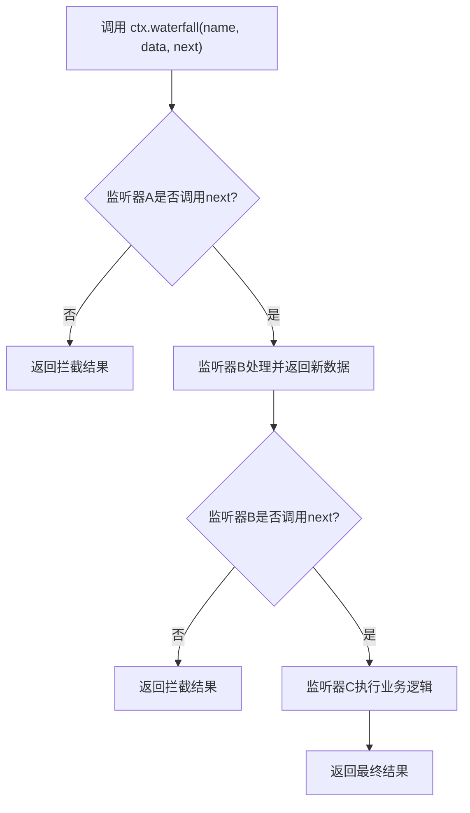
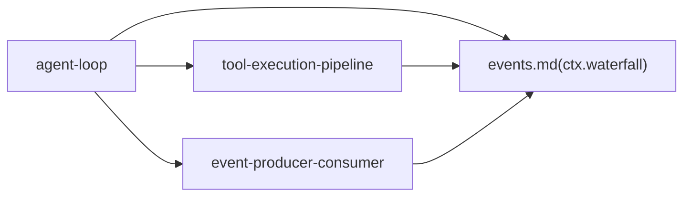

# 瀑布流分发模式 (Waterfall)

<cite>
**本文引用的文件**
- [packages/core/agent-loop/src/agent.ts](file://packages/core/agent-loop/src/agent.ts)
- [docs/cordis-api/events.md](file://docs/cordis-api/events.md)
- [docs/tool-execution-pipeline.md](file://docs/tool-execution-pipeline.md)
- [docs/event-producer-consumer.md](file://docs/event-producer-consumer.md)
</cite>

## 目录
1. [简介](#简介)
2. [项目结构](#项目结构)
3. [核心组件](#核心组件)
4. [架构总览](#架构总览)
5. [详细组件分析](#详细组件分析)
6. [依赖关系分析](#依赖关系分析)
7. [性能考量](#性能考量)
8. [故障排查指南](#故障排查指南)
9. [结论](#结论)
10. [附录](#附录)

## 简介
本文件围绕仓库中的“瀑布流分发模式（waterfall）”展开，解释其如何实现链式事件处理：每个监听器接收前一个监听器的输出，并可返回新的数据传递给下一个监听器。我们将说明数据在监听器间的传递机制、转换与处理流程、错误处理策略（当某个监听器抛出异常时的行为），并给出可落地的代码示例路径，覆盖数据验证、格式转换、业务逻辑处理等典型场景。同时总结适用场景，如请求处理管道、数据转换流水线等。

## 项目结构
该仓库采用多包（monorepo）组织，事件与调度能力由 Cordis 框架提供，并在多个子系统（如 agent-loop、tools、fs、llm、session-telemetry 等）中通过 waterfall 模式串联处理逻辑。工具执行管线文档展示了 pre-execute、execute、post-execute 三段 waterfalls 的协作方式；事件生产者-消费者矩阵列出了大量以 waterfall 模式分发的系统事件。



图表来源
- [docs/cordis-api/events.md:97-123](file://docs/cordis-api/events.md#L97-L123)
- [docs/tool-execution-pipeline.md:4-60](file://docs/tool-execution-pipeline.md#L4-L60)
- [docs/event-producer-consumer.md:18-59](file://docs/event-producer-consumer.md#L18-L59)

章节来源
- [docs/cordis-api/events.md:97-123](file://docs/cordis-api/events.md#L97-L123)
- [docs/tool-execution-pipeline.md:4-60](file://docs/tool-execution-pipeline.md#L4-L60)
- [docs/event-producer-consumer.md:18-59](file://docs/event-producer-consumer.md#L18-L59)

## 核心组件
- 事件总线与分发模式
  - ctx.waterfall：将最后一个参数作为 next 回调，监听器通过调用 next() 进入下一环节，不调用则拦截（veto）。返回值沿外层传播。
  - 其他分发模式：emit（同步忽略返回值）、parallel（并发等待所有监听器）、serial/bail（顺序直到首个 bail 值）。
- Agent 循环中的水落流
  - agent/pre-step：组装上下文消息，决定是否进入下一步或拒绝。
  - agent/request-error：对模型请求失败进行重试决策。
- 工具执行管线
  - tools/pre-execute：权限、沙箱、钩子等前置检查。
  - tools/execute：超时、重试、指标等环绕执行。
  - tools/post-execute：结果接受/替换/追加上下文等后置处理。
- 其他水落流
  - llm/stream：流式片段处理（如标题生成、检查点策略等）。
  - session-telemetry/record：遥测记录。
  - fs/write-intent / fs/edit-intent：文件系统变更意图审批与观察。

章节来源
- [docs/cordis-api/events.md:97-123](file://docs/cordis-api/events.md#L97-L123)
- [packages/core/agent-loop/src/agent.ts:230-243](file://packages/core/agent-loop/src/agent.ts#L230-L243)
- [packages/core/agent-loop/src/agent.ts:355-370](file://packages/core/agent-loop/src/agent.ts#L355-L370)
- [docs/tool-execution-pipeline.md:4-60](file://docs/tool-execution-pipeline.md#L4-L60)
- [docs/event-producer-consumer.md:18-59](file://docs/event-producer-consumer.md#L18-L59)

## 架构总览
下图展示了一个典型的“请求-处理-响应”水落流：上游触发事件，监听器依次包装 next，完成校验、转换、业务处理，最终返回结果或提前终止。



图表来源
- [docs/cordis-api/events.md:97-123](file://docs/cordis-api/events.md#L97-L123)

## 详细组件分析

### 组件A：Agent 循环中的水落流
- 作用
  - agent/pre-step：在每步开始前组装系统提示与上下文，决定是否进入下一步或拒绝。
  - agent/request-error：在模型流式请求出错时，交由监听器决定重试或上报。
- 数据流
  - 上游传入 turn/step、provider、failure、retryPolicy、signal 等上下文。
  - 监听器可选择返回 retry 动作或其他控制信号。
- 错误处理
  - 若监听器抛出异常，上层会将其结构化并转换为统一错误类型，便于后续处理。

```mermaid
sequenceDiagram
participant Loop as "Agent 循环"
participant Bus as "事件总线"
participant Pre as "agent/pre-step 监听器"
participant Err as "agent/request-error 监听器"
Loop->>Bus : waterfall("agent/pre-step", {messages,...})
Bus-->>Loop : 返回决策(enter/reject/...)
Note over Loop : 构建请求并流式获取
Loop->>Bus : waterfall("agent/request-error", {turn, step, provider, failure, retryPolicy, signal})
Bus-->>Loop : 返回{kind : "retry"}或undefined
alt 返回retry
Loop->>Loop : 重新构建请求并重试
else 不重试
Loop->>Loop : 抛出结构化错误
end
```

图表来源
- [packages/core/agent-loop/src/agent.ts:230-243](file://packages/core/agent-loop/src/agent.ts#L230-L243)
- [packages/core/agent-loop/src/agent.ts:355-370](file://packages/core/agent-loop/src/agent.ts#L355-L370)

章节来源
- [packages/core/agent-loop/src/agent.ts:230-243](file://packages/core/agent-loop/src/agent.ts#L230-L243)
- [packages/core/agent-loop/src/agent.ts:355-370](file://packages/core/agent-loop/src/agent.ts#L355-L370)

### 组件B：工具执行管线（pre/execute/post）
- 作用
  - tools/pre-execute：权限、沙箱、钩子等前置检查。
  - tools/execute：超时、重试、指标等环绕执行。
  - tools/post-execute：结果接受、阻止、替换、追加上下文等后置处理。
- 数据流
  - 三个水落流按序执行，可将一次工具调用转化为多次变换，并最终产出单一结果。
- 错误处理
  - 各阶段抛出的异常会被规范化为 isError，确保下游可见且可观测。



图表来源
- [docs/tool-execution-pipeline.md:4-60](file://docs/tool-execution-pipeline.md#L4-L60)

章节来源
- [docs/tool-execution-pipeline.md:4-60](file://docs/tool-execution-pipeline.md#L4-L60)

### 组件C：通用水落流语义与用法
- 语义
  - 最后一个参数是 next 回调；监听器必须调用 next() 才能继续，否则视为拦截。
  - 返回值沿外层传播，可用于短路或透传。
- 典型用法
  - 数据验证：在第一个监听器做入参校验，失败直接返回错误。
  - 格式转换：中间监听器将原始数据转换为内部表示。
  - 业务处理：后续监听器执行业务逻辑，并返回最终结果。
- 错误处理
  - 任一监听器抛出异常，上层捕获并标准化，避免污染调用栈。



图表来源
- [docs/cordis-api/events.md:97-123](file://docs/cordis-api/events.md#L97-L123)

章节来源
- [docs/cordis-api/events.md:97-123](file://docs/cordis-api/events.md#L97-L123)

## 依赖关系分析
- 事件声明与使用
  - 事件生产者-消费者矩阵显示，多个子系统通过 waterfall 模式相互解耦，例如 agent-loop 作为调度中心，向多个监听器派发事件。
- 耦合与内聚
  - 水落流将横切关注点（权限、日志、指标、重试、审批）从主流程中剥离，提升内聚性。
- 外部依赖
  - 依赖 Cordis 事件总线提供的 ctx.waterfall 能力。



图表来源
- [docs/event-producer-consumer.md:18-59](file://docs/event-producer-consumer.md#L18-L59)
- [docs/tool-execution-pipeline.md:4-60](file://docs/tool-execution-pipeline.md#L4-L60)
- [docs/cordis-api/events.md:97-123](file://docs/cordis-api/events.md#L97-L123)

章节来源
- [docs/event-producer-consumer.md:18-59](file://docs/event-producer-consumer.md#L18-L59)
- [docs/tool-execution-pipeline.md:4-60](file://docs/tool-execution-pipeline.md#L4-L60)
- [docs/cordis-api/events.md:97-123](file://docs/cordis-api/events.md#L97-L123)

## 性能考量
- 串行与并行
  - waterfall 为串行组合，适合需要严格顺序的数据转换管道；如需并行处理不同分支，可结合 parallel 模式。
- 短路与早返回
  - 利用 next 的可选调用实现短路，减少不必要的计算。
- 异常成本
  - 异常会中断后续监听器，应尽量避免在热路径中抛出异常；必要时将错误转为返回值。
- 资源释放
  - 注意 AbortSignal 的使用，及时中止长耗时操作。

[本节为通用指导，无需特定文件引用]

## 故障排查指南
- 常见症状
  - 管道未继续：确认监听器是否正确调用 next。
  - 结果被意外拦截：检查是否有监听器返回了非空/非 false/非 undefined 的值。
  - 异常导致中断：查看上层是否已将异常标准化为统一错误类型。
- 定位步骤
  - 在关键监听器前后添加日志，确认数据形态。
  - 针对 agent/request-error 等事件，检查是否返回了 retry 决策。
  - 对于工具执行管线，检查 pre/execute/post 三段的返回值与异常。

章节来源
- [packages/core/agent-loop/src/agent.ts:355-370](file://packages/core/agent-loop/src/agent.ts#L355-L370)
- [docs/tool-execution-pipeline.md:4-60](file://docs/tool-execution-pipeline.md#L4-L60)

## 结论
瀑布流分发模式在本仓库中被广泛用于构建可扩展、可插拔的处理管道。通过 ctx.waterfall，系统实现了严格的顺序控制、灵活的拦截与转换、以及统一的错误处理。结合工具执行管线的三段式设计，可以在不侵入主流程的前提下，叠加权限、沙箱、重试、指标、审批等横切能力，适用于请求处理管道、数据转换流水线等多种场景。

[本节为总结，无需特定文件引用]

## 附录

### 代码示例路径（不含具体代码内容）
- 在 Agent 循环中使用水落流
  - 参考：[packages/core/agent-loop/src/agent.ts:230-243](file://packages/core/agent-loop/src/agent.ts#L230-L243)
  - 参考：[packages/core/agent-loop/src/agent.ts:355-370](file://packages/core/agent-loop/src/agent.ts#L355-L370)
- 工具执行管线的水落流编排
  - 参考：[docs/tool-execution-pipeline.md:4-60](file://docs/tool-execution-pipeline.md#L4-L60)
- 事件 API 定义与语义
  - 参考：[docs/cordis-api/events.md:97-123](file://docs/cordis-api/events.md#L97-L123)
- 事件生产者-消费者关系
  - 参考：[docs/event-producer-consumer.md:18-59](file://docs/event-producer-consumer.md#L18-L59)

[本节仅列出路径，不包含代码内容]