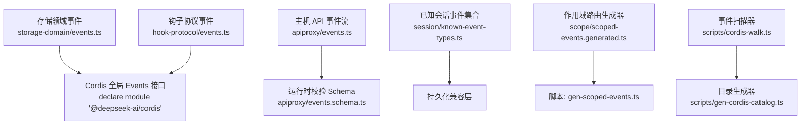
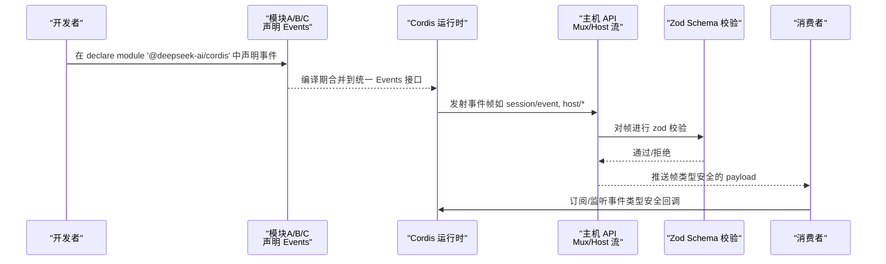
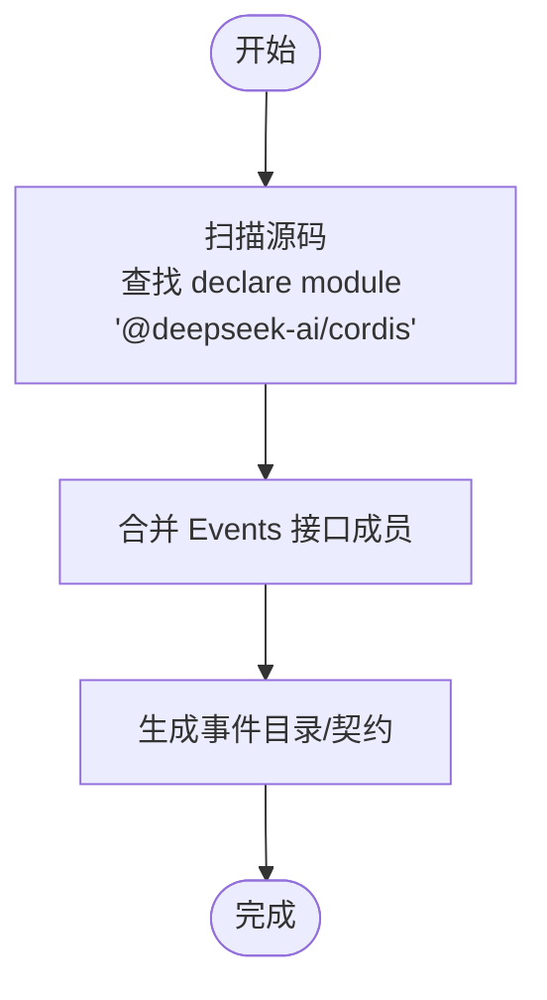
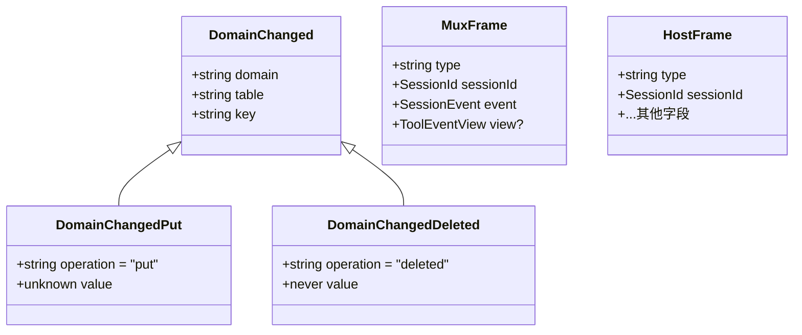
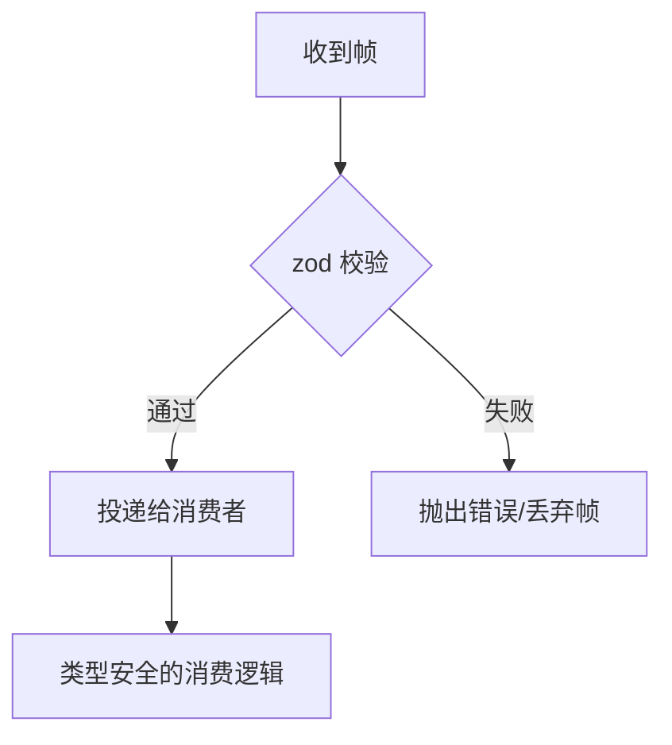
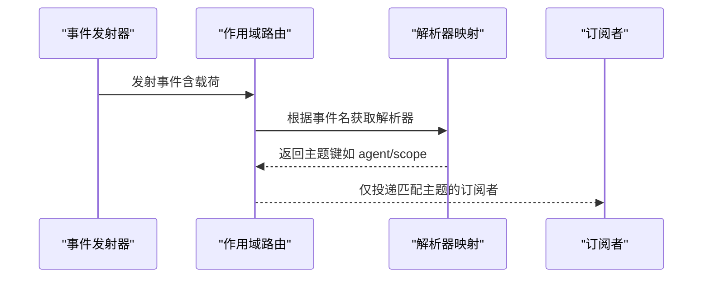
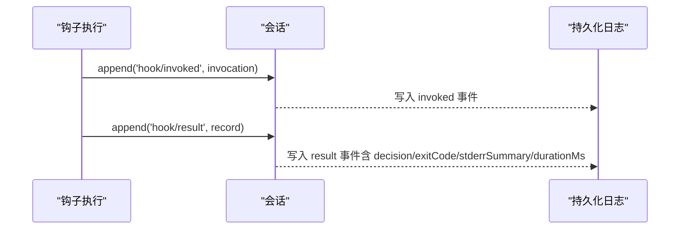
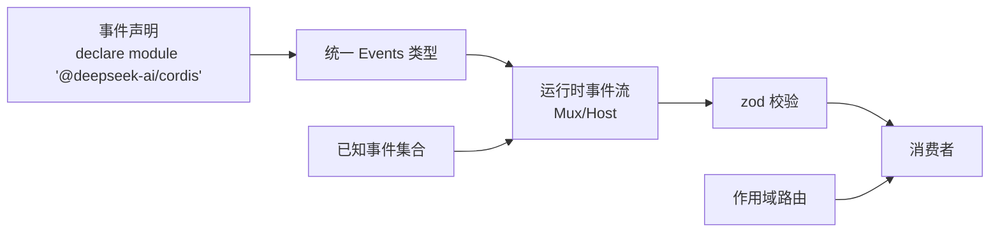

# 事件声明与类型安全

<cite>
**本文引用的文件**
- [packages/storage/storage-domain/src/events.ts](file://packages/storage/storage-domain/src/events.ts)
- [packages/hooks/hook-protocol/src/events.ts](file://packages/hooks/hook-protocol/src/events.ts)
- [packages/host/apiproxy/src/api/events.ts](file://packages/host/apiproxy/src/api/events.ts)
- [packages/host/apiproxy/src/api/events.schema.ts](file://packages/host/apiproxy/src/api/events.schema.ts)
- [packages/core/session/src/known-event-types.ts](file://packages/core/session/src/known-event-types.ts)
- [packages/core/scope/src/scoped-events.generated.ts](file://packages/core/scope/src/scoped-events.generated.ts)
- [scripts/gen-scoped-events.ts](file://scripts/gen-scoped-events.ts)
- [scripts/cordis-walk.ts](file://scripts/cordis-walk.ts)
- [scripts/gen-cordis-catalog.ts](file://scripts/gen-cordis-catalog.ts)
</cite>

## 目录
1. [简介](#简介)
2. [项目结构](#项目结构)
3. [核心组件](#核心组件)
4. [架构总览](#架构总览)
5. [详细组件分析](#详细组件分析)
6. [依赖关系分析](#依赖关系分析)
7. [性能考虑](#性能考虑)
8. [故障排查指南](#故障排查指南)
9. [结论](#结论)
10. [附录](#附录)

## 简介
本文件聚焦于该仓库中“事件声明机制”与“TypeScript 类型安全”的实现方式，重点说明：
- 如何通过接口声明定义事件类型（事件名称、参数类型、返回值类型）
- 事件声明合并的工作原理与跨模块扩展方式
- 事件类型的继承与组合模式，如何构建复杂事件结构
- 同步事件、异步事件与带回调的事件的声明与使用范式
- 编译时类型检查如何保障事件使用的正确性，以及常见类型错误的处理思路

## 项目结构
围绕事件系统的关键位置如下：
- 领域事件类型与声明合并：storage-domain 通过 declare module 将领域事件注入到公共 Events 接口
- 钩子协议事件：hook-protocol 提供持久化钩子事件的辅助函数与数据结构
- 主机 API 事件流：apiproxy 定义 MuxFrame/HostFrame 等帧类型，并通过 zod schema 进行运行时校验
- 已知会话事件白名单：session 包维护 KNOWN_SESSION_EVENT_TYPES，用于持久化兼容
- 作用域路由：scope 包生成 scoped subject 解析器，配合事件作用域过滤
- 代码生成与扫描：gen-scoped-events、cordis-walk、gen-cordis-catalog 负责从源码中抽取事件声明并生成类型与目录

图表来源
- [packages/storage/storage-domain/src/events.ts:36-48](file://packages/storage/storage-domain/src/events.ts#L36-L48)
- [packages/hooks/hook-protocol/src/events.ts:70-104](file://packages/hooks/hook-protocol/src/events.ts#L70-L104)
- [packages/host/apiproxy/src/api/events.ts:46-155](file://packages/host/apiproxy/src/api/events.ts#L46-L155)
- [packages/host/apiproxy/src/api/events.schema.ts:42-93](file://packages/host/apiproxy/src/api/events.schema.ts#L42-L93)
- [packages/core/session/src/known-event-types.ts:8-64](file://packages/core/session/src/known-event-types.ts#L8-L64)
- [packages/core/scope/src/scoped-events.generated.ts:10-49](file://packages/core/scope/src/scoped-events.generated.ts#L10-L49)
- [scripts/gen-scoped-events.ts](file://scripts/gen-scoped-events.ts)
- [scripts/cordis-walk.ts:82-82](file://scripts/cordis-walk.ts#L82-L82)
- [scripts/gen-cordis-catalog.ts:191-191](file://scripts/gen-cordis-catalog.ts#L191-L191)

章节来源
- [packages/storage/storage-domain/src/events.ts:1-49](file://packages/storage/storage-domain/src/events.ts#L1-L49)
- [packages/hooks/hook-protocol/src/events.ts:1-105](file://packages/hooks/hook-protocol/src/events.ts#L1-L105)
- [packages/host/apiproxy/src/api/events.ts:1-156](file://packages/host/apiproxy/src/api/events.ts#L1-L156)
- [packages/host/apiproxy/src/api/events.schema.ts:1-94](file://packages/host/apiproxy/src/api/events.schema.ts#L1-L94)
- [packages/core/session/src/known-event-types.ts:1-65](file://packages/core/session/src/known-event-types.ts#L1-L65)
- [packages/core/scope/src/scoped-events.generated.ts:1-50](file://packages/core/scope/src/scoped-events.generated.ts#L1-L50)
- [scripts/cordis-walk.ts:82-82](file://scripts/cordis-walk.ts#L82-L82)
- [scripts/gen-cordis-catalog.ts:191-191](file://scripts/gen-cordis-catalog.ts#L191-L191)

## 核心组件
- 事件声明合并（Events 接口）：通过 declare module 将各模块的事件方法签名合并到统一的 @deepseek-ai/cordis.Events 接口，实现跨模块扩展与集中类型推导。
- 事件数据模型：以联合类型（discriminated union）表达不同事件变体，如 DomainChangedPut/DomainChangedDeleted，或 MuxFrame/HostFrame。
- 运行时校验：使用 zod schema 对跨进程传输的帧进行严格校验，保证类型与结构一致性。
- 已知事件白名单：KNOWN_SESSION_EVENT_TYPES 限定可被持久化读取路径识别的事件集合，避免未知事件导致重建错误。
- 作用域路由：scoped-events.generated.ts 为特定事件提供主题解析器，支持按 agent/scope 过滤事件。
- 代码生成与扫描：通过 cordis-walk 与 gen-cordis-catalog 扫描所有 declare module '@deepseek-ai/cordis' 中的 Events 声明，生成目录与契约；gen-scoped-events 生成作用域路由映射。

章节来源
- [packages/storage/storage-domain/src/events.ts:36-48](file://packages/storage/storage-domain/src/events.ts#L36-L48)
- [packages/host/apiproxy/src/api/events.ts:69-155](file://packages/host/apiproxy/src/api/events.ts#L69-L155)
- [packages/host/apiproxy/src/api/events.schema.ts:42-93](file://packages/host/apiproxy/src/api/events.schema.ts#L42-L93)
- [packages/core/session/src/known-event-types.ts:8-64](file://packages/core/session/src/known-event-types.ts#L8-L64)
- [packages/core/scope/src/scoped-events.generated.ts:10-49](file://packages/core/scope/src/scoped-events.generated.ts#L10-L49)
- [scripts/cordis-walk.ts:82-82](file://scripts/cordis-walk.ts#L82-L82)
- [scripts/gen-cordis-catalog.ts:191-191](file://scripts/gen-cordis-catalog.ts#L191-L191)

## 架构总览
下图展示了事件从声明、类型合并、传输到校验与消费的整体流程：

图表来源
- [packages/storage/storage-domain/src/events.ts:36-48](file://packages/storage/storage-domain/src/events.ts#L36-L48)
- [packages/host/apiproxy/src/api/events.ts:46-155](file://packages/host/apiproxy/src/api/events.ts#L46-L155)
- [packages/host/apiproxy/src/api/events.schema.ts:42-93](file://packages/host/apiproxy/src/api/events.schema.ts#L42-L93)

## 详细组件分析

### 事件声明合并与跨模块扩展
- 声明方式：在各模块中以 declare module '@deepseek-ai/cordis' 的方式向全局 Events 接口追加事件方法签名，例如 'domain/changed'(change: DomainChanged): void。
- 合并原理：TypeScript 模块声明合并会将多个同名接口的成员合并为一个，从而形成统一的 Events 类型，供订阅者以字符串键访问对应事件类型。
- 跨模块扩展：任何包均可通过相同方式扩展 Events，无需修改核心类型，保持松耦合与可扩展性。
- 工具链支持：cordis-walk 与 gen-cordis-catalog 会扫描所有此类声明，生成事件目录与契约，确保文档与类型一致。

图表来源
- [scripts/cordis-walk.ts:82-82](file://scripts/cordis-walk.ts#L82-L82)
- [scripts/gen-cordis-catalog.ts:191-191](file://scripts/gen-cordis-catalog.ts#L191-L191)

章节来源
- [packages/storage/storage-domain/src/events.ts:36-48](file://packages/storage/storage-domain/src/events.ts#L36-L48)
- [scripts/cordis-walk.ts:82-82](file://scripts/cordis-walk.ts#L82-L82)
- [scripts/gen-cordis-catalog.ts:191-191](file://scripts/gen-cordis-catalog.ts#L191-L191)

### 事件数据模型与联合类型
- 领域事件：DomainChanged 是 DomainChangedPut | DomainChangedDeleted 的判别联合，通过 operation 字段区分 put 与 deleted，便于 switch 分支类型收窄。
- 主机事件流：MuxFrame 与 HostFrame 均为判别联合，type 字段决定具体载荷，客户端可按 type 分支处理。
- 视图与投影：ToolEventView 表示 tool/call 或 tool/result 的渲染意图；session/projection 携带 key/value/seq 的投影单元。

图表来源
- [packages/storage/storage-domain/src/events.ts:10-34](file://packages/storage/storage-domain/src/events.ts#L10-L34)
- [packages/host/apiproxy/src/api/events.ts:69-155](file://packages/host/apiproxy/src/api/events.ts#L69-L155)

章节来源
- [packages/storage/storage-domain/src/events.ts:10-34](file://packages/storage/storage-domain/src/events.ts#L10-L34)
- [packages/host/apiproxy/src/api/events.ts:69-155](file://packages/host/apiproxy/src/api/events.ts#L69-L155)

### 运行时校验与类型安全
- 类型层面：通过 Events 接口与联合类型，在编译期约束事件名与参数类型。
- 运行层面：apiproxy/events.schema.ts 使用 zod 对 MuxFrame/HostFrame 进行严格校验，拒绝非法帧，避免下游消费出现类型不一致问题。
- 持久化兼容：KNOWN_SESSION_EVENT_TYPES 限制可被持久化读取路径识别的事件集合，防止未知事件破坏会话重建。

图表来源
- [packages/host/apiproxy/src/api/events.schema.ts:42-93](file://packages/host/apiproxy/src/api/events.schema.ts#L42-L93)
- [packages/core/session/src/known-event-types.ts:8-64](file://packages/core/session/src/known-event-types.ts#L8-L64)

章节来源
- [packages/host/apiproxy/src/api/events.schema.ts:42-93](file://packages/host/apiproxy/src/api/events.schema.ts#L42-L93)
- [packages/core/session/src/known-event-types.ts:8-64](file://packages/core/session/src/known-event-types.ts#L8-L64)

### 作用域事件与路由
- 作用域解析：scoped-events.generated.ts 为特定事件提供主题解析器，从事件载荷中提取 agent/scope 作为路由键，实现细粒度订阅。
- 生成机制：由 scripts/gen-scoped-events.ts 根据规则生成解析器映射，减少手工维护成本。

图表来源
- [packages/core/scope/src/scoped-events.generated.ts:10-49](file://packages/core/scope/src/scoped-events.generated.ts#L10-L49)
- [scripts/gen-scoped-events.ts](file://scripts/gen-scoped-events.ts)

章节来源
- [packages/core/scope/src/scoped-events.generated.ts:10-49](file://packages/core/scope/src/scoped-events.generated.ts#L10-L49)
- [scripts/gen-scoped-events.ts](file://scripts/gen-scoped-events.ts)

### 钩子协议事件（持久化与审计）
- 事件对：hook/invoked 与 hook/result 成对记录，包含 turn、point、handlerId、dialect、matcher 等上下文信息。
- 结果摘要：stderr 摘要通过 summarizeStderr 截断并缓存默认上限，保证审计日志的可读性与体积可控。
- 类型安全：HookInvocation/HookResultRecord 明确输出结构与字段，appendHookInvoked/appendHookResult 封装写入，避免散乱构造。

图表来源
- [packages/hooks/hook-protocol/src/events.ts:70-104](file://packages/hooks/hook-protocol/src/events.ts#L70-L104)

章节来源
- [packages/hooks/hook-protocol/src/events.ts:1-105](file://packages/hooks/hook-protocol/src/events.ts#L1-L105)

### 事件类型的继承与组合模式
- 继承：DomainChangedPut/DomainChangedDeleted 共享 DomainChangedBase 的 domain/table/key 字段，体现字段复用与类型继承。
- 组合：MuxFrame/HostFrame 通过判别联合组合多种业务语义（如 session/event、approval/requested、question/requested、session/jobs、session/projection），每个变体承载独立载荷。
- 视图组合：ToolEventView 将 call/result 两种视图意图组合为单一类型，简化调用方判断。

章节来源
- [packages/storage/storage-domain/src/events.ts:10-34](file://packages/storage/storage-domain/src/events.ts#L10-L34)
- [packages/host/apiproxy/src/api/events.ts:32-34](file://packages/host/apiproxy/src/api/events.ts#L32-L34)
- [packages/host/apiproxy/src/api/events.ts:69-155](file://packages/host/apiproxy/src/api/events.ts#L69-L155)

### 实际示例：同步、异步与带回调的事件
- 同步事件：在 Events 接口中声明无返回值的方法，如 'domain/changed'(change: DomainChanged): void，调用方直接传递参数，不等待异步结果。
- 异步事件：通过 AsyncIterable/RpcRequest 暴露流式接口，如 EventsApi.mux/host，消费者以 async for 迭代帧。
- 带回调的事件：订阅者在 Events 中注册回调，框架在事件发生时按类型安全地传入参数，如 'host/workspace-changed' 携带 WorkspaceView。

章节来源
- [packages/storage/storage-domain/src/events.ts:36-48](file://packages/storage/storage-domain/src/events.ts#L36-L48)
- [packages/host/apiproxy/src/api/events.ts:46-63](file://packages/host/apiproxy/src/api/events.ts#L46-L63)
- [packages/host/apiproxy/src/api/events.ts:127-155](file://packages/host/apiproxy/src/api/events.ts#L127-L155)

## 依赖关系分析
- 低耦合：事件声明通过 declare module 合并，新增事件无需改动核心类型，降低耦合度。
- 强类型：Events 接口与联合类型贯穿编译期；zod schema 在运行期再次校验，双重保障。
- 可追溯：KNOWN_SESSION_EVENT_TYPES 与 scoped-events.generated.ts 提供事件清单与作用域路由，便于调试与治理。
- 可生成：cordis-walk 与 gen-cordis-catalog 自动扫描事件声明，生成目录与契约，减少人工维护。

图表来源
- [packages/storage/storage-domain/src/events.ts:36-48](file://packages/storage/storage-domain/src/events.ts#L36-L48)
- [packages/host/apiproxy/src/api/events.ts:46-155](file://packages/host/apiproxy/src/api/events.ts#L46-L155)
- [packages/host/apiproxy/src/api/events.schema.ts:42-93](file://packages/host/apiproxy/src/api/events.schema.ts#L42-L93)
- [packages/core/session/src/known-event-types.ts:8-64](file://packages/core/session/src/known-event-types.ts#L8-L64)
- [packages/core/scope/src/scoped-events.generated.ts:10-49](file://packages/core/scope/src/scoped-events.generated.ts#L10-L49)

章节来源
- [packages/storage/storage-domain/src/events.ts:36-48](file://packages/storage/storage-domain/src/events.ts#L36-L48)
- [packages/host/apiproxy/src/api/events.ts:46-155](file://packages/host/apiproxy/src/api/events.ts#L46-L155)
- [packages/host/apiproxy/src/api/events.schema.ts:42-93](file://packages/host/apiproxy/src/api/events.schema.ts#L42-L93)
- [packages/core/session/src/known-event-types.ts:8-64](file://packages/core/session/src/known-event-types.ts#L8-L64)
- [packages/core/scope/src/scoped-events.generated.ts:10-49](file://packages/core/scope/src/scoped-events.generated.ts#L10-L49)

## 性能考虑
- 事件负载最小化：仅携带必要字段，避免大对象频繁传输。
- 流式处理：使用 AsyncIterable 处理长生命周期事件流，降低内存占用。
- 作用域过滤：通过 scoped subject 减少无关事件的分发与处理开销。
- 校验前置：在边界处进行 zod 校验，尽早失败，避免无效数据处理。

[本节为通用指导，不直接分析具体文件]

## 故障排查指南
- 事件未触发：确认 Events 接口已声明对应事件，且订阅者已正确注册；检查作用域路由是否匹配。
- 类型错误：核对事件载荷是否符合联合类型定义；若为跨进程帧，检查 zod schema 是否通过。
- 持久化异常：确认事件名在 KNOWN_SESSION_EVENT_TYPES 中，否则可能被忽略或导致重建错误。
- 钩子事件缺失：检查 hook/invoked 与 hook/result 是否成对出现，stderr 摘要是否超过上限。

章节来源
- [packages/core/session/src/known-event-types.ts:8-64](file://packages/core/session/src/known-event-types.ts#L8-L64)
- [packages/hooks/hook-protocol/src/events.ts:70-104](file://packages/hooks/hook-protocol/src/events.ts#L70-L104)
- [packages/host/apiproxy/src/api/events.schema.ts:42-93](file://packages/host/apiproxy/src/api/events.schema.ts#L42-L93)

## 结论
该仓库通过 TypeScript 模块声明合并与联合类型，构建了强类型、可扩展的事件系统；结合 zod 运行时校验与已知事件白名单，实现了从声明到传输再到消费的完整类型安全保障。作用域路由与代码生成进一步提升了可维护性与可观测性。遵循本文所述的最佳实践，可在多模块协作中稳定地扩展事件类型并确保类型安全。

## 附录
- 最佳实践建议
  - 始终在 Events 接口中声明事件，避免动态字符串键导致的类型丢失。
  - 使用判别联合组织事件载荷，便于 switch 分支类型收窄。
  - 对跨进程帧使用 zod schema 校验，确保网络边界的一致性。
  - 定期更新 KNOWN_SESSION_EVENT_TYPES，保持持久化兼容。
  - 利用作用域路由缩小订阅范围，提升性能与可维护性。

[本节为通用指导，不直接分析具体文件]