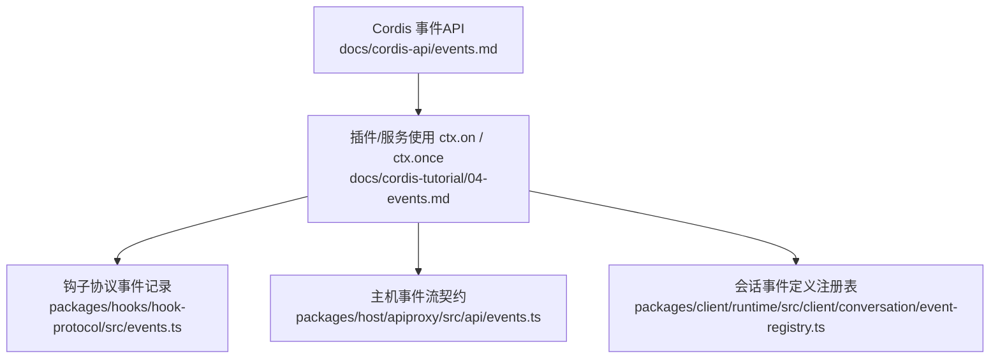
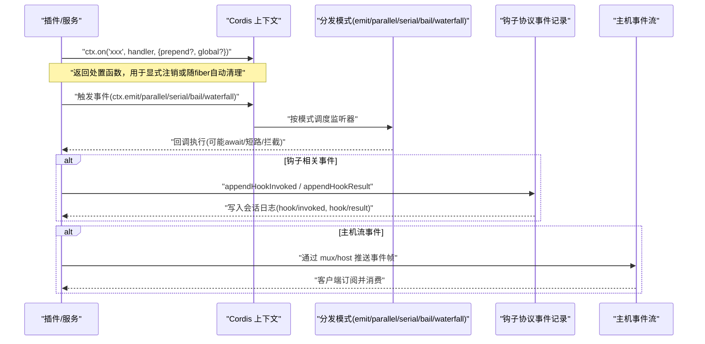
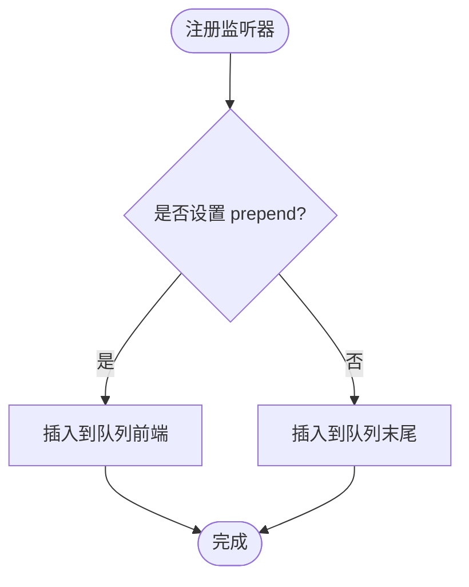
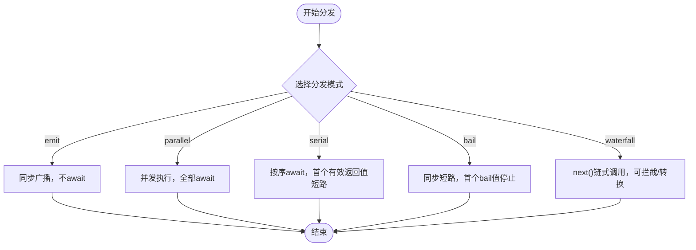
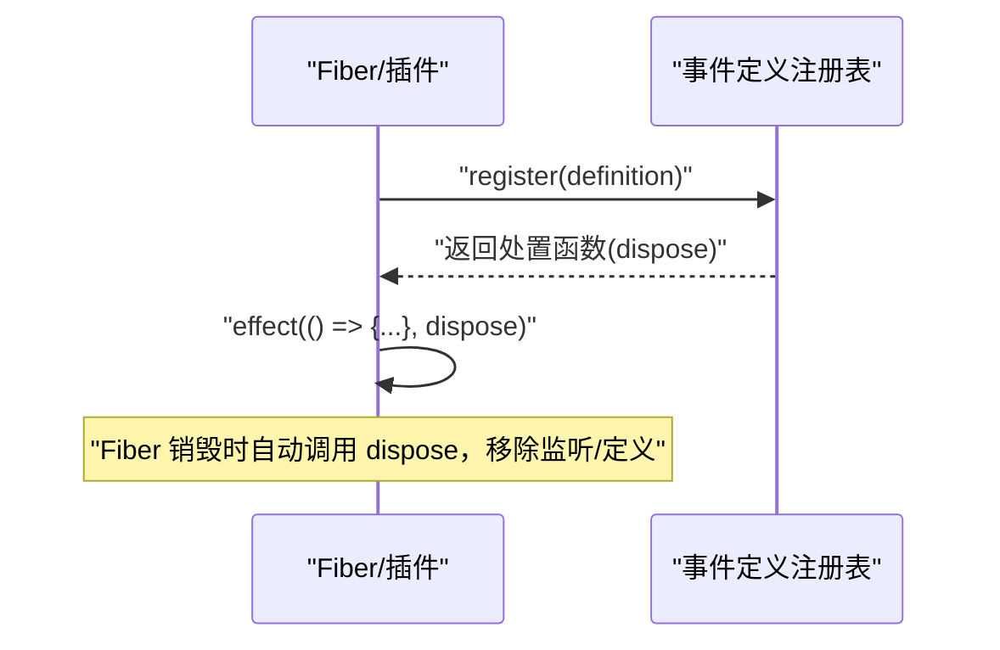
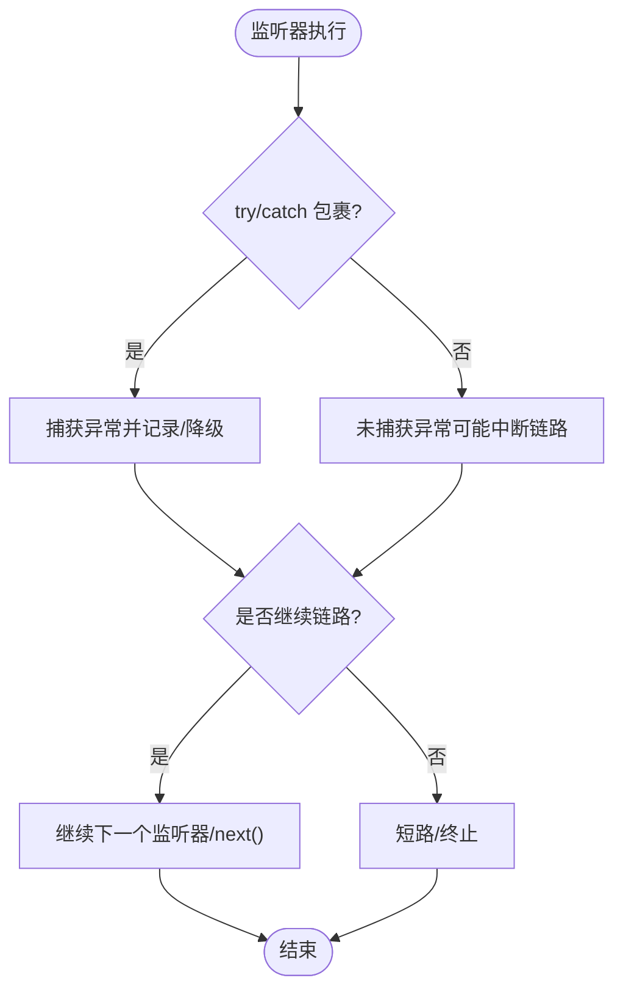
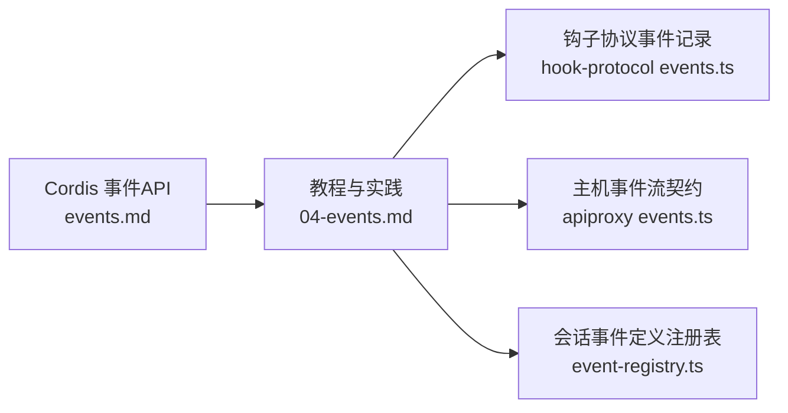

# 事件监听器管理

<cite>
**本文引用的文件**
- [events.md](file://docs/cordis-api/events.md)
- [04-events.md](file://docs/cordis-tutorial/04-events.md)
- [events.ts](file://packages/hooks/hook-protocol/src/events.ts)
- [events.ts](file://packages/host/apiproxy/src/api/events.ts)
- [event-registry.ts](file://packages/client/runtime/src/client/conversation/event-registry.ts)
</cite>

## 目录
1. [简介](#简介)
2. [项目结构](#项目结构)
3. [核心组件](#核心组件)
4. [架构总览](#架构总览)
5. [详细组件分析](#详细组件分析)
6. [依赖关系分析](#依赖关系分析)
7. [性能考量](#性能考量)
8. [故障排查指南](#故障排查指南)
9. [结论](#结论)
10. [附录](#附录)

## 简介
本文件围绕事件监听器的注册、管理与注销机制展开，重点说明：
- 如何注册一次性监听器与持久监听器
- 监听器的优先级控制与执行顺序
- 生命周期管理与自动清理（资源释放）
- 安全注销以避免内存泄漏
- 错误处理与异常捕获
- 在插件系统中动态注册与移除监听器的实践示例

本仓库的事件系统基于 Cordis 上下文提供的统一 API，提供多种分发模式（emit、parallel、serial、bail、waterfall），并通过 ctx.on/ctx.once 进行监听器注册，支持 prepend/global 等选项控制行为。

## 项目结构
与事件监听器管理直接相关的文档与实现分布如下：
- 事件 API 参考：docs/cordis-api/events.md
- 事件教程与实践：docs/cordis-tutorial/04-events.md
- 钩子协议事件记录：packages/hooks/hook-protocol/src/events.ts
- 主机事件流契约：packages/host/apiproxy/src/api/events.ts
- 会话事件定义注册表（业务层示例）：packages/client/runtime/src/client/conversation/event-registry.ts

**图示来源**
- [events.md:1-208](file://docs/cordis-api/events.md#L1-L208)
- [04-events.md:1-145](file://docs/cordis-tutorial/04-events.md#L1-L145)
- [events.ts:1-105](file://packages/hooks/hook-protocol/src/events.ts#L1-L105)
- [events.ts:1-156](file://packages/host/apiproxy/src/api/events.ts#L1-L156)
- [event-registry.ts:1-68](file://packages/client/runtime/src/client/conversation/event-registry.ts#L1-L68)

**章节来源**
- [events.md:1-208](file://docs/cordis-api/events.md#L1-L208)
- [04-events.md:1-145](file://docs/cordis-tutorial/04-events.md#L1-L145)

## 核心组件
- 事件分发模式：emit、parallel、serial、bail、waterfall，分别对应同步广播、并发等待、串行短路、同步短路、中间件式拦截。
- 监听器注册：ctx.on(name, listener, options?) 返回可调用以移除的处置函数；ctx.once(name, listener, options?) 首次触发后自动移除。
- 选项控制：options.prepend 控制插入位置（影响优先级），options.global 跳过上下文过滤。
- 生命周期：ctx.on/ctx.once 作为 effect 绑定到当前 fiber，随插件/作用域销毁自动清理，避免手动 removeListener。
- 事件记录与流：钩子协议将 hook/invoked 与 hook/result 追加到会话日志；主机事件流提供 mux/host 两个逻辑流，承载会话事件、审批/问答、工作项快照等。

**章节来源**
- [events.md:8-187](file://docs/cordis-api/events.md#L8-L187)
- [04-events.md:78-141](file://docs/cordis-tutorial/04-events.md#L78-L141)
- [events.ts:70-104](file://packages/hooks/hook-protocol/src/events.ts#L70-L104)
- [events.ts:46-155](file://packages/host/apiproxy/src/api/events.ts#L46-L155)

## 架构总览
下图展示了从插件侧注册监听器到事件分发的整体流程，以及在不同场景下的数据流向。

**图示来源**
- [events.md:8-187](file://docs/cordis-api/events.md#L8-L187)
- [events.ts:70-104](file://packages/hooks/hook-protocol/src/events.ts#L70-L104)
- [events.ts:46-155](file://packages/host/apiproxy/src/api/events.ts#L46-L155)

## 详细组件分析

### 监听器注册与优先级控制
- 注册方式
  - 持久监听器：ctx.on(name, listener, options?)，返回处置函数，可在需要时显式移除。
  - 一次性监听器：ctx.once(name, listener, options?)，首次触发后自动移除。
- 优先级控制
  - options.prepend = true：将监听器插入到同事件监听器队列的前面，优先于后续注册的监听器。
  - 默认情况下，监听器按注册顺序执行（除非使用 prepend）。
- 全局监听
  - options.global = true：忽略上下文过滤检查，使监听器在任何上下文中都能收到事件。

**图示来源**
- [events.md:125-187](file://docs/cordis-api/events.md#L125-L187)

**章节来源**
- [events.md:125-187](file://docs/cordis-api/events.md#L125-L187)

### 分发模式与执行顺序
- emit：同步广播，不收集返回值，不 await。
- parallel：并发执行所有监听器，统一 await 完成后返回。
- serial：按序 await，遇到第一个“非空/非false/非undefined”的返回值即停止后续监听器。
- bail：同步版本的 serial，遇到首个同步“bail”值即停止。
- waterfall：中间件式，每个监听器接收 next()，可选择调用以继续链式调用，或不调用以实现否决/短路。

**图示来源**
- [events.md:8-124](file://docs/cordis-api/events.md#L8-L124)

**章节来源**
- [events.md:8-124](file://docs/cordis-api/events.md#L8-L124)

### 生命周期管理与自动清理
- ctx.on/ctx.once 作为 effect 绑定到当前 fiber，当 fiber/插件销毁时自动移除监听器，无需手动维护 removeListener。
- 对于需要跨作用域管理的业务定义（如会话事件定义），可通过注册表提供的 register/registerFallback 返回处置函数，并在 effect 中刷新状态，确保生命周期一致。

**图示来源**
- [event-registry.ts:14-50](file://packages/client/runtime/src/client/conversation/event-registry.ts#L14-L50)

**章节来源**
- [event-registry.ts:14-50](file://packages/client/runtime/src/client/conversation/event-registry.ts#L14-L50)

### 安全注销与内存泄漏防护
- 显式注销：保存 ctx.on 返回的处置函数，在合适时机调用以移除监听器。
- 一次性监听器：使用 ctx.once，避免重复触发与残留引用。
- 作用域清理：利用 ctx.on 的 effect 语义，让监听器随插件/作用域销毁而自动移除，降低忘记注销的风险。
- 注册表清理：对业务定义（如会话事件定义）使用 register/registerFallback 返回的处置函数，确保在作用域结束时正确清理。

**章节来源**
- [events.md:125-187](file://docs/cordis-api/events.md#L125-L187)
- [event-registry.ts:14-50](file://packages/client/runtime/src/client/conversation/event-registry.ts#L14-L50)

### 错误处理与异常捕获
- 分发模式差异：
  - emit：不收集返回值，也不 await，适合纯副作用通知。
  - parallel：所有监听器并发执行，需在各监听器内部自行 try/catch，避免未捕获异常导致其他监听器受影响。
  - serial/bail：遇到短路条件即停止，便于快速失败。
  - waterfall：通过 next() 控制链路，若某监听器抛出异常，应包裹 try/catch 或在 next() 前后做防御性处理。
- 钩子协议事件：将 hook/invoked 与 hook/result 追加到会话日志，便于审计与排障；stderr 摘要会截断并保留上限字符数，避免日志膨胀。

**图示来源**
- [events.ts:70-104](file://packages/hooks/hook-protocol/src/events.ts#L70-L104)
- [events.md:8-124](file://docs/cordis-api/events.md#L8-L124)

**章节来源**
- [events.ts:70-104](file://packages/hooks/hook-protocol/src/events.ts#L70-L104)
- [events.md:8-124](file://docs/cordis-api/events.md#L8-L124)

### 实际使用示例（插件系统中的动态注册与移除）
- 声明事件类型：通过合并接口声明事件名与监听器签名，使 ctx.emit/on 具备类型提示。
- 注册监听器：
  - 持久监听器：ctx.on('namespace/action', handler, {prepend?: boolean, global?: boolean})
  - 一次性监听器：ctx.once('namespace/action', handler, options)
- 触发事件：根据需求选择 ctx.emit/parallel/serial/bail/waterfall。
- 动态移除：保存 ctx.on 返回的处置函数，在插件卸载或不再需要时调用。
- 复杂集合管理：
  - 为多个监听器维护一个处置函数数组，批量调用以统一清理。
  - 结合注册表（如会话事件定义注册表）统一管理业务定义的生命周期。

**章节来源**
- [04-events.md:7-79](file://docs/cordis-tutorial/04-events.md#L7-L79)
- [events.md:8-187](file://docs/cordis-api/events.md#L8-L187)
- [event-registry.ts:14-50](file://packages/client/runtime/src/client/conversation/event-registry.ts#L14-L50)

## 依赖关系分析
- 事件 API 依赖 Cordis 上下文，提供统一的 on/once/emit/parallel/serial/bail/waterfall。
- 钩子协议事件依赖会话对象，将 invoked/result 追加到会话日志，形成可审计的事件流。
- 主机事件流提供 mux/host 两个逻辑流，承载会话事件、审批/问答、工作项快照等，供客户端订阅消费。
- 会话事件定义注册表提供业务定义的注册与 fallback 机制，配合 effect 保证生命周期一致性。

**图示来源**
- [events.md:1-208](file://docs/cordis-api/events.md#L1-L208)
- [04-events.md:1-145](file://docs/cordis-tutorial/04-events.md#L1-L145)
- [events.ts:1-105](file://packages/hooks/hook-protocol/src/events.ts#L1-L105)
- [events.ts:1-156](file://packages/host/apiproxy/src/api/events.ts#L1-L156)
- [event-registry.ts:1-68](file://packages/client/runtime/src/client/conversation/event-registry.ts#L1-L68)

**章节来源**
- [events.md:1-208](file://docs/cordis-api/events.md#L1-L208)
- [04-events.md:1-145](file://docs/cordis-tutorial/04-events.md#L1-L145)
- [events.ts:1-105](file://packages/hooks/hook-protocol/src/events.ts#L1-L105)
- [events.ts:1-156](file://packages/host/apiproxy/src/api/events.ts#L1-L156)
- [event-registry.ts:1-68](file://packages/client/runtime/src/client/conversation/event-registry.ts#L1-L68)

## 性能考量
- 选择合适的分发模式：
  - 高吞吐通知：emit（无 await，开销最小）。
  - 需要聚合结果：parallel（并发执行，注意监听器内异常隔离）。
  - 需要短路决策：serial/bail（尽早返回，减少不必要计算）。
  - 需要拦截/转换：waterfall（谨慎使用 next()，避免遗漏导致默认行为被吞掉）。
- 监听器数量与复杂度：过多监听器会增加分发成本，建议按需拆分与组合。
- 日志与审计：钩子协议事件会对 stderr 摘要进行截断，避免日志过大影响性能。

[本节为通用指导，不直接分析具体文件]

## 故障排查指南
- 监听器未触发：
  - 检查事件名与类型声明是否匹配。
  - 确认是否正确使用了 ctx.on/ctx.once，且未被提前 dispose。
  - 检查 options.global 与上下文过滤是否导致监听器不可见。
- 执行顺序不符合预期：
  - 确认是否设置了 options.prepend。
  - 确认使用的分发模式（serial/bail/waterfall 可能导致短路）。
- 内存泄漏：
  - 确保 ctx.on 返回的处置函数在适当时机调用。
  - 使用 ctx.once 避免重复触发。
  - 业务定义使用注册表的 register/registerFallback 并配合 effect 清理。
- 异常与日志：
  - 在监听器内部 try/catch，避免未捕获异常影响其他监听器。
  - 通过钩子协议事件查看 hook/invoked 与 hook/result，定位问题。

**章节来源**
- [events.md:8-187](file://docs/cordis-api/events.md#L8-L187)
- [events.ts:70-104](file://packages/hooks/hook-protocol/src/events.ts#L70-L104)
- [event-registry.ts:14-50](file://packages/client/runtime/src/client/conversation/event-registry.ts#L14-L50)

## 结论
本仓库的事件系统提供了灵活且强大的监听器管理机制：通过 ctx.on/ctx.once 注册持久或一次性监听器，借助 options 控制优先级与可见性；通过多种分发模式满足不同场景的执行顺序与短路需求；通过 effect 语义实现自动生命周期管理，降低内存泄漏风险；通过钩子协议事件与主机事件流实现可审计与可观测的事件体系。在实际使用中，应根据业务需求选择合适的分发模式与监听器策略，并做好异常处理与资源清理。

[本节为总结，不直接分析具体文件]

## 附录
- 常用 API 速查
  - 注册监听器：ctx.on(name, listener, options?)
  - 一次性监听器：ctx.once(name, listener, options?)
  - 分发模式：ctx.emit / ctx.parallel / ctx.serial / ctx.bail / ctx.waterfall
  - 选项：options.prepend（优先级）、options.global（全局可见）
- 事件记录
  - 钩子协议：appendHookInvoked / appendHookResult
  - 主机事件流：mux/host 两路逻辑流，承载会话事件、审批/问答、工作项快照等

**章节来源**
- [events.md:8-187](file://docs/cordis-api/events.md#L8-L187)
- [events.ts:70-104](file://packages/hooks/hook-protocol/src/events.ts#L70-L104)
- [events.ts:46-155](file://packages/host/apiproxy/src/api/events.ts#L46-L155)