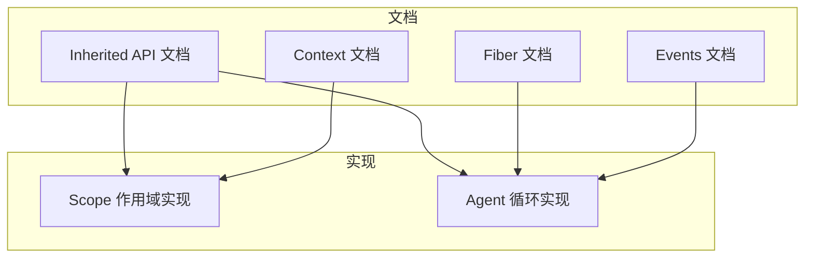
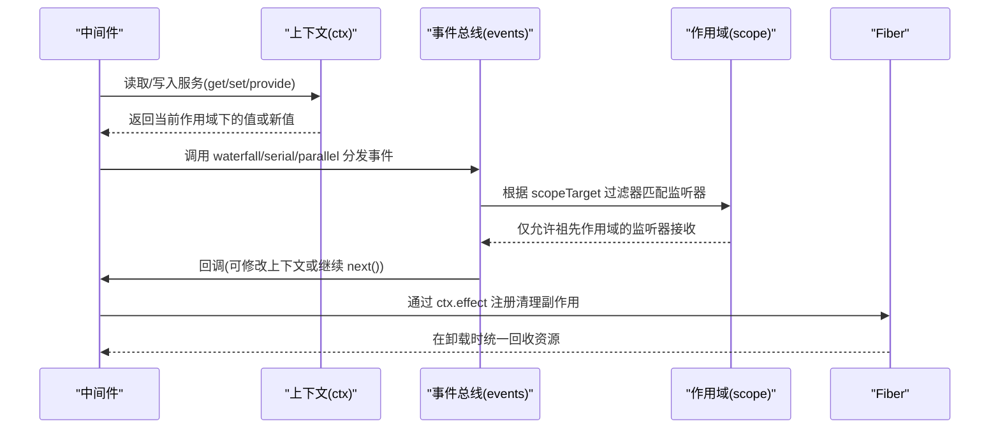
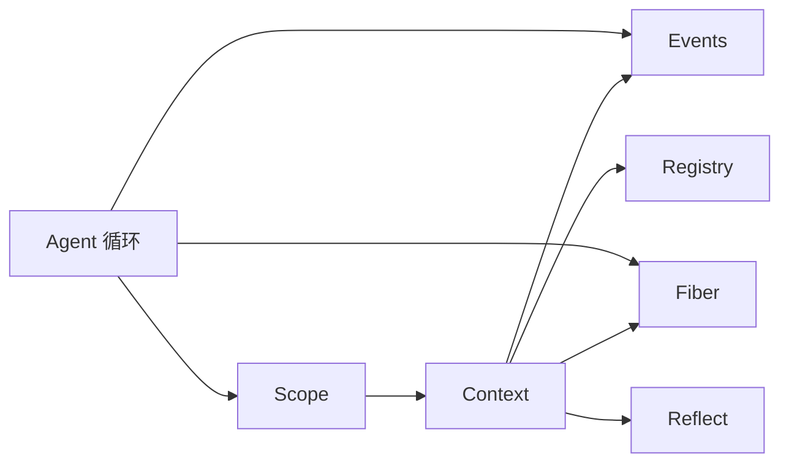

# 上下文访问与修改

<cite>
**本文引用的文件**
- [context.md](file://docs/cordis-api/context.md)
- [events.md](file://docs/cordis-api/events.md)
- [fiber.md](file://docs/cordis-api/fiber.md)
- [inherited.md](file://docs/cordis-api/inherited.md)
- [index.ts](file://packages/core/scope/src/index.ts)
- [agent.ts](file://packages/core/agent-loop/src/agent.ts)
</cite>

## 目录
1. [简介](#简介)
2. [项目结构](#项目结构)
3. [核心组件](#核心组件)
4. [架构总览](#架构总览)
5. [详细组件分析](#详细组件分析)
6. [依赖关系分析](#依赖关系分析)
7. [性能考量](#性能考量)
8. [故障排查指南](#故障排查指南)
9. [结论](#结论)
10. [附录：常见操作示例路径](#附录：常见操作示例路径)

## 简介
本文件聚焦“中间件如何访问和修改事件上下文”，围绕 Cordis 的 Context、Fiber、Events 以及 Scope 机制，系统说明：
- 上下文对象的结构与属性（事件总线、日志、反射层、插件注册表等）
- 中间件读取/写入上下文的安全边界（只读与可写模式、作用域隔离）
- 上下文的继承与隔离（extend/isolate/intercept、Scope 链路由）
- 在中间件中获取用户信息、验证权限、转换数据类型的实践范式
- 错误处理与异常恢复的最佳实践

## 项目结构
本仓库将 Cordis 的核心能力以文档形式沉淀于 docs/cordis-api，并在 packages 中提供具体实现。与“上下文访问与修改”直接相关的模块包括：
- 文档层：Context、Events、Fiber、Inherited API 的生成式文档
- 实现层：Scope 作用域与 Agent 循环中对 ctx.extend、waterfall/serial/parallel 等事件分发模式的组合使用



图表来源
- [context.md:1-163](file://docs/cordis-api/context.md#L1-L163)
- [events.md:1-208](file://docs/cordis-api/events.md#L1-L208)
- [fiber.md:1-120](file://docs/cordis-api/fiber.md#L1-L120)
- [inherited.md:10-40](file://docs/cordis-api/inherited.md#L10-L40)
- [index.ts:129-185](file://packages/core/scope/src/index.ts#L129-L185)
- [agent.ts:225-243](file://packages/core/agent-loop/src/agent.ts#L225-L243)

章节来源
- [context.md:1-163](file://docs/cordis-api/context.md#L1-L163)
- [events.md:1-208](file://docs/cordis-api/events.md#L1-L208)
- [fiber.md:1-120](file://docs/cordis-api/fiber.md#L1-L120)
- [inherited.md:10-40](file://docs/cordis-api/inherited.md#L10-L40)

## 核心组件
- 上下文（Context）
  - 通过 ctx.events、ctx.logger、ctx.reflect、ctx.registry 暴露事件总线、日志、反射与服务注册能力
  - 通过 ctx.get/set/provide/accessor/mixin 进行服务存取与绑定
  - 通过 ctx.extend/isolate/intercept 派生子上下文，实现元数据扩展、服务隔离与拦截配置注入
- 事件（Events）
  - emit/parallel/serial/bail/waterfall 多种分发模式，支持同步/异步、短路、流水线等
  - on/once 注册监听器，支持 prepend/global 选项
- Fiber
  - 插件运行实例，承载 effect/effect 生命周期、状态机、配置更新与重启
  - ctx.effect 注册的清理副作用随 fiber 卸载自动回收
- Scope（作用域）
  - createScope 基于 fiber.ctx.extend 创建带标签的作用域上下文
  - scopeTarget 构建带过滤器的目标载体，使事件按作用域链向上路由（子→父），避免向下泄漏

章节来源
- [context.md:14-163](file://docs/cordis-api/context.md#L14-L163)
- [events.md:8-208](file://docs/cordis-api/events.md#L8-L208)
- [fiber.md:8-120](file://docs/cordis-api/fiber.md#L8-L120)
- [index.ts:129-185](file://packages/core/scope/src/index.ts#L129-L185)

## 架构总览
下图展示中间件在事件流水线上对上下文进行读取与修改的典型流程，以及作用域隔离如何保证安全性。



图表来源
- [events.md:97-123](file://docs/cordis-api/events.md#L97-L123)
- [index.ts:158-185](file://packages/core/scope/src/index.ts#L158-L185)
- [fiber.md:8-36](file://docs/cordis-api/fiber.md#L8-L36)

## 详细组件分析

### 上下文结构与读写安全
- 上下文代理
  - 普通属性读取走服务解析；extend/isolate/intercept 创建子上下文而不污染父级
  - root/baseUrl/events/logger/reflect/registry 等内置能力可直接访问
- 服务存取
  - get(name, strict?)：按严格模式读取当前活跃 fiber 提供的服务
  - set(name, value)：仅允许提供该服务的 fiber 覆盖其值，防止跨作用域篡改
  - provide(name, value)：在当前 fiber 下注册服务，返回析构函数用于注销
  - accessor/mixin：定义计算属性或将服务成员混入 ctx
- 安全要点
  - 只读模式：通过 get 与只读属性访问，不触发 set/provide
  - 可写模式：仅在自身 fiber 内使用 set/provide，避免越权修改其他作用域的服务
  - 拦截与隔离：intercept 为特定服务注入配置；isolate 为某服务建立独立作用域

章节来源
- [context.md:14-163](file://docs/cordis-api/context.md#L14-L163)
- [context.md:237-365](file://docs/cordis-api/context.md#L237-L365)

### 事件分发与中间件流水线
- 分发模式
  - emit：同步广播，忽略返回值
  - parallel：并发执行所有监听器，全部完成后 resolve
  - serial：顺序等待，遇到第一个“bail”即停止并返回
  - bail：同步短路，首个非空/false/undefined 返回值即停止
  - waterfall：最后一个参数为 next 的流水线，每个监听器包裹后续逻辑，不调用 next 即否决
- 监听器注册
  - on/once：支持 prepend 插入到头部，global 跳过上下文过滤器
- 典型用法
  - 中间件通过 ctx.waterfall('xxx', handler, defaultHandler) 实现前置校验、后置增强、错误兜底

章节来源
- [events.md:8-123](file://docs/cordis-api/events.md#L8-L123)
- [events.md:125-208](file://docs/cordis-api/events.md#L125-L208)

### 作用域继承与隔离（Scope）
- 创建与作用域键
  - createScope(ctx, key) 基于 fiber 创建作用域，并通过 ctx.extend({ [kScope]: key }) 标记上下文
  - scopeOf(ctx) 读取最近的作用域键
- 路由与过滤
  - scopeTarget(base, key) 构造带过滤器的载体，保留原有 filter，并允许“祖先作用域”监听到“后代作用域”的事件
  - 事件只能沿作用域链向上流动，不会向下泄露，确保多会话/多 agent 之间的数据隔离
- 父链与重绑定
  - bindScopeParent/rebind 维护作用域父子关系，禁止成环；scopeChainOf 可枚举从某键到根的路径

章节来源
- [index.ts:14-102](file://packages/core/scope/src/index.ts#L14-L102)
- [index.ts:129-185](file://packages/core/scope/src/index.ts#L129-L185)

### 中间件在 Agent 循环中的上下文使用
- Agent 通过 ctx.extend 注入 agent 实例，形成 agent-scoped 上下文
- 使用 dispatch.waterfall('agent/pre-step', ...) 组装步骤前的消息与上下文，中间件可改写消息、拒绝进入下一步
- 使用 dispatch.serial('agent/turn-stopping', ...) 在回合结束时协调收尾逻辑
- 使用 ctx.effect 注册清理副作用，确保在 fiber 卸载时释放资源

```mermaid
flowchart TD
Start(["进入 pre-step"]) --> Assemble["组装系统提示与上下文"]
Assemble --> Waterfall{"waterfall 中间件链"}
Waterfall --> |next() 调用| NextStep["进入下一步"]
Waterfall --> |不调用 next| Reject["拒绝进入下一步"]
NextStep --> StepExec["执行 stepLLM/工具调用"]
StepExec --> End(["结束"])
Reject --> End
```

图表来源
- [agent.ts:225-243](file://packages/core/agent-loop/src/agent.ts#L225-L243)
- [agent.ts:295-299](file://packages/core/agent-loop/src/agent.ts#L295-L299)

章节来源
- [agent.ts:64-97](file://packages/core/agent-loop/src/agent.ts#L64-L97)
- [agent.ts:225-243](file://packages/core/agent-loop/src/agent.ts#L225-L243)
- [agent.ts:295-299](file://packages/core/agent-loop/src/agent.ts#L295-L299)

## 依赖关系分析
- Context 依赖 Events/Fiber/Registry/Reflect 等子系统能力
- Scope 依赖 Context 的 extend 与 Fiber 的生命周期管理
- Agent 循环依赖 Scope 与 Events，通过 waterfall/serial 组织中间件链，并以 ctx.effect 管理副作用



图表来源
- [context.md:1-163](file://docs/cordis-api/context.md#L1-L163)
- [events.md:1-208](file://docs/cordis-api/events.md#L1-L208)
- [fiber.md:1-120](file://docs/cordis-api/fiber.md#L1-L120)
- [index.ts:129-185](file://packages/core/scope/src/index.ts#L129-L185)
- [agent.ts:64-97](file://packages/core/agent-loop/src/agent.ts#L64-L97)

章节来源
- [context.md:1-163](file://docs/cordis-api/context.md#L1-L163)
- [events.md:1-208](file://docs/cordis-api/events.md#L1-L208)
- [fiber.md:1-120](file://docs/cordis-api/fiber.md#L1-L120)
- [index.ts:129-185](file://packages/core/scope/src/index.ts#L129-L185)
- [agent.ts:64-97](file://packages/core/agent-loop/src/agent.ts#L64-L97)

## 性能考量
- 事件分发选择
  - 高并发且无顺序依赖：优先 parallel
  - 需要短路或优先级：使用 bail/serial
  - 需要前后置编排：使用 waterfall
- 作用域与隔离
  - 通过 isolate/intercept 减少全局共享状态，降低竞争与锁开销
  - 使用 scopeTarget 限制事件传播范围，减少无关监听器的唤醒
- 副作用管理
  - 使用 ctx.effect 集中管理资源生命周期，避免内存泄漏与重复清理

[本节为通用指导，无需源码引用]

## 故障排查指南
- 无法写入服务
  - 现象：set 抛出异常或无效
  - 原因：尝试在非提供 fiber 上覆盖服务
  - 解决：确认当前 fiber 是否提供了该服务；必要时使用 provide 注册
- 事件未到达预期监听器
  - 现象：waterfall/serial 未触发
  - 原因：被上游中间件 veto（未调用 next）或作用域过滤排除
  - 解决：检查中间件链顺序与 scopeTarget 的作用域键关系
- 资源未释放
  - 现象：内存增长或句柄泄漏
  - 原因：未在 ctx.effect 中注册清理逻辑
  - 解决：将所有外部资源（定时器、连接、订阅）放入 effect 的 disposer
- 作用域环路
  - 现象：绑定父作用域时报错
  - 原因：rebind 导致环状父子关系
  - 解决：确保父链无环，必要时重新设计作用域层次

章节来源
- [fiber.md:146-160](file://docs/cordis-api/fiber.md#L146-L160)
- [index.ts:53-82](file://packages/core/scope/src/index.ts#L53-L82)

## 结论
- 上下文是中间件访问系统能力的唯一入口，通过 get/set/provide/accessor/mixin 精确控制读写边界
- 事件分发模式为中间件编排提供了强大而灵活的工具，waterfall/serial/parallel/bail/emit 覆盖大多数场景
- 作用域机制（extend/isolate/intercept + Scope）确保多租户/多会话间的数据隔离与路由安全
- 借助 ctx.effect 与 Fiber 生命周期，可实现可靠的资源管理与异常恢复

[本节为总结性内容，无需源码引用]

## 附录：常见操作示例路径
以下列出在中间件中完成常见任务的推荐实现位置与参考路径（不包含具体代码）：
- 获取用户信息
  - 在服务注册处提供用户标识，中间件通过 ctx.get('user') 读取
  - 参考：[context.md:237-259](file://docs/cordis-api/context.md#L237-L259)
- 验证权限
  - 在 waterfall 中间件链中进行鉴权判断，失败则不调用 next 以否决后续流程
  - 参考：[events.md:97-123](file://docs/cordis-api/events.md#L97-L123)
- 转换数据类型
  - 在中间件中读取原始数据，转换为业务类型后通过 ctx.set 或事件参数传递
  - 参考：[context.md:261-284](file://docs/cordis-api/context.md#L261-L284)
- 隔离不同会话/Agent 的上下文
  - 使用 ctx.isolate 为关键服务建立独立作用域，或使用 Scope 的 scopeTarget 限定事件路由
  - 参考：[context.md:39-66](file://docs/cordis-api/context.md#L39-L66)、[index.ts:158-185](file://packages/core/scope/src/index.ts#L158-L185)
- 注册清理副作用
  - 使用 ctx.effect 注册定时器、订阅、连接等资源的清理逻辑
  - 参考：[fiber.md:8-36](file://docs/cordis-api/fiber.md#L8-L36)
- 在 Agent 循环中参与请求组装
  - 通过 dispatch.waterfall('agent/pre-step', ...) 改写消息或拒绝进入下一步
  - 参考：[agent.ts:225-243](file://packages/core/agent-loop/src/agent.ts#L225-L243)