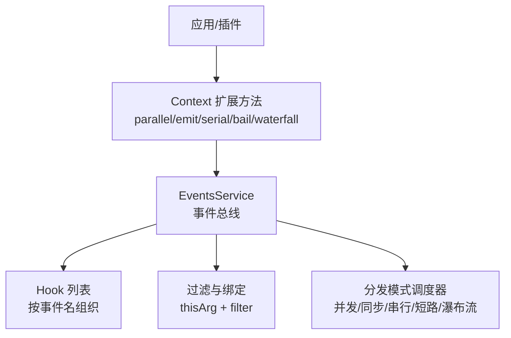
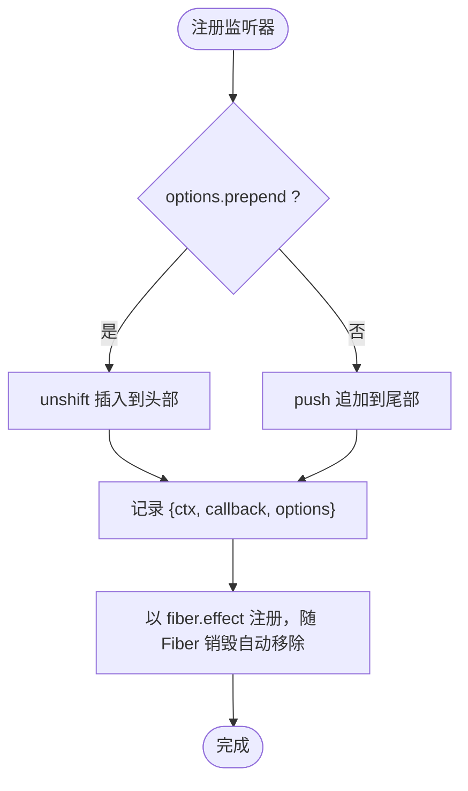
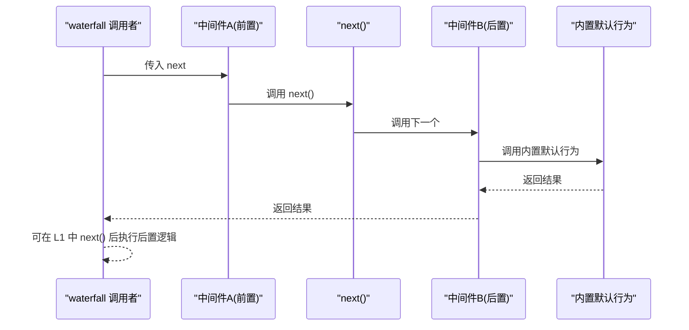
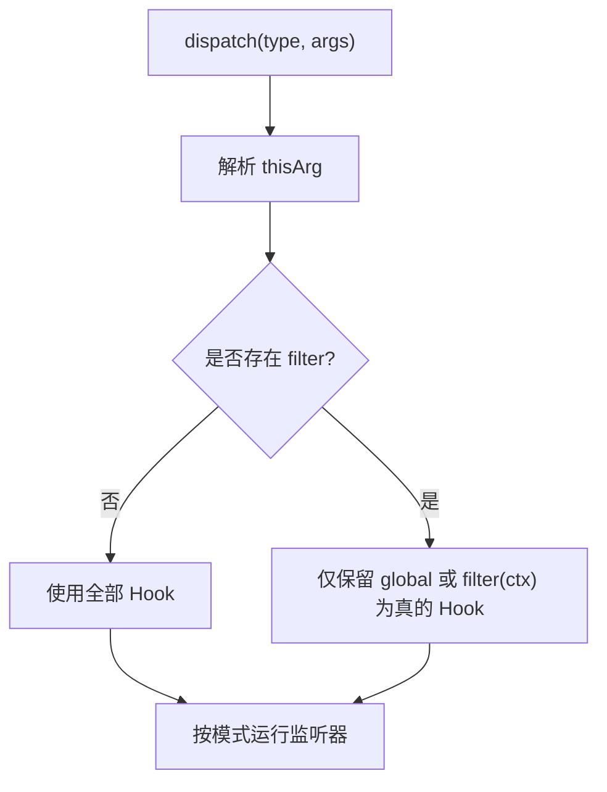
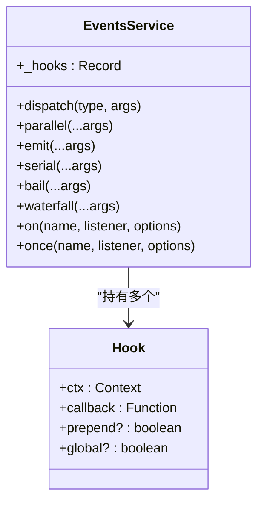
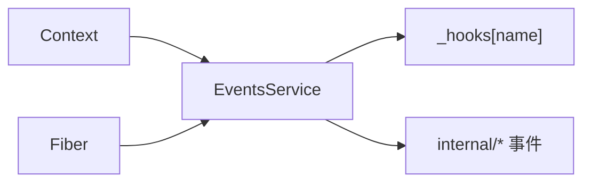

# 中间件执行顺序

<cite>
**本文引用的文件**
- [events.ts](file://vendor/cordis/src/events.ts)
- [events.md](file://docs/cordis-api/events.md)
</cite>

## 目录
1. [简介](#简介)
2. [项目结构](#项目结构)
3. [核心组件](#核心组件)
4. [架构总览](#架构总览)
5. [详细组件分析](#详细组件分析)
6. [依赖关系分析](#依赖关系分析)
7. [性能考量](#性能考量)
8. [故障排查指南](#故障排查指南)
9. [结论](#结论)
10. [附录：执行模式与示例场景](#附录执行模式与示例场景)

## 简介
本文件围绕事件驱动管道中的“中间件”（即事件监听器/钩子）执行顺序机制进行说明。重点解释：
- 前置与后置中间件的执行时机（进入管道时、完成后回调）
- 条件中间件如何基于事件类型或上下文决定是否执行
- 中间件链的构建过程（注册顺序、优先级、队列管理）
- 不同执行模式的代码级流程（串行、并行、条件分支）

该机制由 Cordis 的事件服务统一提供，通过多种分发模式实现不同的中间件编排策略。

## 项目结构
与中间件执行顺序直接相关的核心位于 Cordis 事件子系统：
- 事件服务与分发模式定义：vendor/cordis/src/events.ts
- 面向用户的 API 文档：docs/cordis-api/events.md

图表来源
- [events.ts:131-319](file://vendor/cordis/src/events.ts#L131-L319)
- [events.md:8-123](file://docs/cordis-api/events.md#L8-L123)

章节来源
- [events.ts:131-319](file://vendor/cordis/src/events.ts#L131-L319)
- [events.md:8-123](file://docs/cordis-api/events.md#L8-L123)

## 核心组件
- 事件服务 EventsService：维护每个事件的 Hook 列表，负责监听注册、过滤、分发与生命周期管理。
- 分发模式 DispatchMode：emit、parallel、serial、bail、waterfall，决定中间件执行顺序与短路策略。
- 上下文 Context：为事件提供 thisArg、filter 能力，支持全局监听与条件拦截。
- Fiber：监听器以 effect 形式注册，随 Fiber 生命周期自动清理。

关键职责
- 注册：ctx.on/ctx.once 将监听器加入对应事件 Hook 列表，支持 prepend 控制插入位置。
- 过滤：dispatch 阶段根据 thisArg 上的 filter 函数筛选生效的监听器。
- 分发：按模式调用监听器，处理返回值与异常，支持 next 回调的瀑布流组合。

章节来源
- [events.ts:119-175](file://vendor/cordis/src/events.ts#L119-L175)
- [events.ts:183-243](file://vendor/cordis/src/events.ts#L183-L243)
- [events.ts:254-319](file://vendor/cordis/src/events.ts#L254-L319)
- [events.md:173-205](file://docs/cordis-api/events.md#L173-L205)

## 架构总览
下图展示一次事件从触发到所有中间件执行的完整路径，包括前置/后置逻辑与短路/并发行为。

```mermaid
sequenceDiagram
participant App as "调用方"
participant Ctx as "Context"
participant ES as "EventsService"
participant H as "Hook列表"
participant M1 as "中间件1"
participant M2 as "中间件2"
participant MB as "内置默认行为(next)"
App->>Ctx : 调用 ctx.serial('event', ...args)
Ctx->>ES : dispatch('serial', args)
ES->>H : 获取并过滤监听器
loop 按序遍历
ES->>M1 : 调用监听器(可返回bail值)
alt 返回bail值
M1-->>ES : bail
ES-->>Ctx : 提前返回
Ctx-->>App : 返回结果
else 继续
ES->>M2 : 调用下一个监听器
end
end
ES-->>Ctx : 无bail则完成
Ctx-->>App : Promise.resolve()
```

图表来源
- [events.ts:165-209](file://vendor/cordis/src/events.ts#L165-L209)
- [events.md:51-72](file://docs/cordis-api/events.md#L51-L72)

章节来源
- [events.ts:165-209](file://vendor/cordis/src/events.ts#L165-L209)
- [events.md:51-72](file://docs/cordis-api/events.md#L51-L72)

## 详细组件分析

### 事件分发与中间件链构建
- 监听器存储：_hooks 以事件名为键，值为 Hook[]。Hook 包含 ctx、callback 及 options（prepend/global）。
- 注册顺序与优先级：
  - 默认 push 追加到末尾；options.prepend=true 时使用 unshift 插入到头部，获得更高优先级。
  - once 包装 on，首次调用后自动注销。
- 过滤机制：dispatch 时若 thisArg 存在 filter，仅保留 global 为真或 filter(ctx) 为真的 Hook。
- 内部更新链：internal/update 使用 waterfall 模式，允许拦截配置更新。

图表来源
- [events.ts:254-301](file://vendor/cordis/src/events.ts#L254-L301)

章节来源
- [events.ts:119-175](file://vendor/cordis/src/events.ts#L119-L175)
- [events.ts:254-301](file://vendor/cordis/src/events.ts#L254-L301)

### 前置与后置中间件执行时机
- 前置中间件：在目标业务逻辑之前执行。可通过 waterfall 模式包裹 next 实现“进入前”逻辑。
- 后置中间件：在目标业务逻辑之后执行。waterfall 中在调用 next() 之后执行“离开后”逻辑。
- 短路/否决：不调用 next() 即可阻止后续中间件与内置默认行为。

图表来源
- [events.ts:234-243](file://vendor/cordis/src/events.ts#L234-L243)
- [events.md:97-123](file://docs/cordis-api/events.md#L97-L123)

章节来源
- [events.ts:234-243](file://vendor/cordis/src/events.ts#L234-L243)
- [events.md:97-123](file://docs/cordis-api/events.md#L97-L123)

### 条件中间件：基于事件类型或上下文条件
- 事件类型：通过事件名区分不同业务事件，分别注册监听器。
- 上下文条件：利用 thisArg 上的 filter 函数，按上下文动态决定是否执行某监听器。
- 全局监听：options.global=true 可绕过 filter 检查，确保始终接收事件。

图表来源
- [events.ts:165-175](file://vendor/cordis/src/events.ts#L165-L175)

章节来源
- [events.ts:165-175](file://vendor/cordis/src/events.ts#L165-L175)
- [events.md:173-187](file://docs/cordis-api/events.md#L173-L187)

### 中间件链的执行队列管理
- 队列结构：_hooks[name] 为数组，顺序由注册时的 push/unshift 决定。
- 执行策略：
  - emit：同步调用，不等待返回值。
  - parallel：Promise.allSettled 并发执行，聚合异常。
  - serial：按序 await，遇到 bail 值停止。
  - bail：同步按序执行，遇到 bail 值停止。
  - waterfall：将最后一个参数作为 next，依次包装形成链式调用。

图表来源
- [events.ts:119-175](file://vendor/cordis/src/events.ts#L119-L175)
- [events.ts:183-243](file://vendor/cordis/src/events.ts#L183-L243)
- [events.ts:288-319](file://vendor/cordis/src/events.ts#L288-L319)

章节来源
- [events.ts:119-175](file://vendor/cordis/src/events.ts#L119-L175)
- [events.ts:183-243](file://vendor/cordis/src/events.ts#L183-L243)
- [events.ts:288-319](file://vendor/cordis/src/events.ts#L288-L319)

## 依赖关系分析
- 事件服务依赖 Context 提供的反射与过滤器能力。
- 监听器以 Fiber effect 形式注册，随 Fiber 生命周期自动回收，避免内存泄漏。
- 内部事件 internal/* 用于框架级拦截（如配置更新、服务读写），采用 waterfall 或 bail 模式保证可控性。

图表来源
- [events.ts:131-175](file://vendor/cordis/src/events.ts#L131-L175)
- [events.ts:329-352](file://vendor/cordis/src/events.ts#L329-L352)

章节来源
- [events.ts:131-175](file://vendor/cordis/src/events.ts#L131-L175)
- [events.ts:329-352](file://vendor/cordis/src/events.ts#L329-L352)

## 性能考量
- 并发 vs 串行：
  - parallel 适合独立且无副作用的监听器，最大化吞吐；但需聚合异常。
  - serial/bail 适合有顺序依赖或需要短路控制的场景。
- 过滤成本：大量监听器时，filter 计算可能成为瓶颈，建议将高频判断下沉到更高层或缓存结果。
- 短路与提前返回：合理使用 bail/short-circuit 可减少不必要执行。
- 资源释放：使用 ctx.once 或自动 effect 清理，避免长期驻留监听器造成内存压力。

## 故障排查指南
- 监听器未执行：
  - 检查是否被 filter 过滤；必要时使用 options.global=true。
  - 确认事件名与注册一致。
- 执行顺序不符合预期：
  - 检查是否使用了 options.prepend 改变插入位置。
  - 确认使用的是哪种分发模式（serial/bail/waterfall/parallel/emit）。
- 异常丢失或中断：
  - parallel 会聚合异常抛出 AggregateError；serial/bail 遇 bail 值停止。
  - waterfall 中忘记调用 next() 会导致后续链被阻断。
- 内存泄漏：
  - 确保监听器通过 ctx.on/ctx.once 注册，随 Fiber 自动清理。
  - 避免手动持有引用导致无法卸载。

章节来源
- [events.ts:165-243](file://vendor/cordis/src/events.ts#L165-L243)
- [events.ts:288-319](file://vendor/cordis/src/events.ts#L288-L319)
- [events.md:8-123](file://docs/cordis-api/events.md#L8-L123)

## 结论
Cordis 事件系统提供了统一的中间件编排模型，通过多种分发模式满足前置/后置、串行/并行、条件分支等常见需求。借助 context 过滤与 prepend 优先级控制，开发者可以灵活构建可插拔、可观测、可诊断的中间件管道。

## 附录：执行模式与示例场景
以下场景均基于同一事件总线，仅切换分发模式或监听器实现，即可演示不同执行顺序。

- 串行执行（serial）
  - 适用：需要按序执行并在首个“bail”值处短路。
  - 参考：[events.md:51-72](file://docs/cordis-api/events.md#L51-L72)

- 并行执行（parallel）
  - 适用：多个监听器相互独立，希望同时执行并等待全部完成。
  - 参考：[events.md:8-29](file://docs/cordis-api/events.md#L8-L29)

- 条件分支（waterfall + 过滤）
  - 适用：根据上下文决定是否继续执行后续中间件或内置默认行为。
  - 参考：[events.md:97-123](file://docs/cordis-api/events.md#L97-L123)、[events.ts:165-175](file://vendor/cordis/src/events.ts#L165-L175)

- 同步广播（emit）
  - 适用：无需等待、忽略返回值的轻量通知。
  - 参考：[events.md:31-49](file://docs/cordis-api/events.md#L31-L49)

- 短路优先（bail）
  - 适用：快速失败或权限校验等需要同步短路的场景。
  - 参考：[events.md:74-95](file://docs/cordis-api/events.md#L74-L95)

章节来源
- [events.md:8-123](file://docs/cordis-api/events.md#L8-L123)
- [events.ts:165-243](file://vendor/cordis/src/events.ts#L165-L243)