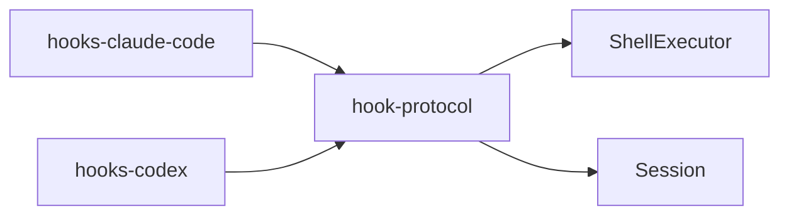

# 中间件模���

<cite>
**本文引用的文件**
- [packages/hooks/hook-protocol/src/types.ts](file://packages/hooks/hook-protocol/src/types.ts)
- [packages/hooks/hook-protocol/src/runner.ts](file://packages/hooks/hook-protocol/src/runner.ts)
- [packages/hooks/hook-protocol/src/events.ts](file://packages/hooks/hook-protocol/src/events.ts)
- [packages/hooks/hook-protocol/src/index.ts](file://packages/hooks/hook-protocol/src/index.ts)
- [packages/hooks/hook-protocol/src/matcher.ts](file://packages/hooks/hook-protocol/src/matcher.ts)
- [packages/hooks/hook-protocol/src/codec.ts](file://packages/hooks/hook-protocol/src/codec.ts)
- [packages/hooks/hook-protocol/src/merge.ts](file://packages/hooks/hook-protocol/src/merge.ts)
- [packages/hooks/hook-protocol/src/detached.ts](file://packages/hooks/hook-protocol/src/detached.ts)
- [packages/hooks/hooks-claude-code/src/index.ts](file://packages/hooks/hooks-claude-code/src/index.ts)
- [packages/hooks/hooks-codex/src/index.ts](file://packages/hooks/hooks-codex/src/index.ts)
</cite>

## 目录
1. [简介](#简介)
2. [项目结�](#项目结�)
3. [核心组件](#核心组件)
4. [��总览](#��总览)
5. [详细组件分�](#详细组件分�)
6. [�赖关系分�](#�赖关系分�)
7. [性能考�](#性能考�)
8. [故障�查指�](#故障�查指�)
9. [结论](#结论)
10. [附录：示例�最佳�践](#附录示例�最佳�践)

## 简介
本文件围绕仓库中的“钩�（Hook）�机制，系统化解�其作为“中间件模��的����。该机制通过匹�器选择�命令执行�结��并�事件记录，形���拔的“�置/�置/�件�中间件管线，用�在工具调用�步骤执行等关键节点进行拦截�审计���校验�数�转���制�程继续或终止。文档将说�：
- 中间件的执行顺�（�置��置��件）
- 如何访问和修改事件上下文，以�如何�制管�继续执行
- 中间件的注册�管�机制（��行时动�添加/移除）
- 错误处�策略�异常��
- 常�场景的代�示例路径（日志记录���验��数�转�）

## 项目结�
本项目的中间件能力集中在 hooks 包�中，采用�议�桥�分离的设计：
- �议层（hook-protocol）：定义类��匹�器��行器�编解��结��并�事件追加�独立�行等通用能力
- 桥�层（hooks-claude-code�hooks-codex）：对�具体平�，负责�置加载�扩展点映射��境注入�决策映射到领域语义

```mermaid
graph TB
subgraph "�议层"
T["types.ts<br/>类��事件契约"]
M["matcher.ts<br/>匹�器"]
R["runner.ts<br/>命令执行�超时"]
C["codec.ts<br/>输出解�"]
G["merge.ts<br/>多结��并"]
E["events.ts<br/>会�事件追加"]
D["detached.ts<br/>独立�行"]
end
subgraph "桥�层"
CC["hooks-claude-code/src/index.ts"]
CDX["hooks-codex/src/index.ts"]
end
CC --> T
CC --> M
CC --> R
CC --> C
CC --> G
CC --> E
CC --> D
CDX --> T
CDX --> M
CDX --> R
CDX --> C
CDX --> G
CDX --> E
CDX --> D
```

图表��
- [packages/hooks/hook-protocol/src/index.ts:1-26](file://packages/hooks/hook-protocol/src/index.ts#L1-L26)
- [packages/hooks/hook-protocol/src/types.ts:1-138](file://packages/hooks/hook-protocol/src/types.ts#L1-L138)
- [packages/hooks/hook-protocol/src/runner.ts:1-107](file://packages/hooks/hook-protocol/src/runner.ts#L1-L107)
- [packages/hooks/hook-protocol/src/events.ts:1-105](file://packages/hooks/hook-protocol/src/events.ts#L1-L105)

章节��
- [packages/hooks/hook-protocol/src/index.ts:1-26](file://packages/hooks/hook-protocol/src/index.ts#L1-L26)
- [packages/hooks/hook-protocol/src/types.ts:1-138](file://packages/hooks/hook-protocol/src/types.ts#L1-L138)

## 核心组件
- 类��事件契约（types.ts）：定义 HookDialect�MatcherGroup�CommandHook�HookOutput 以� SessionEventMap 中的 hook/invoked � hook/result 事件，�确中间件输入输出�审计事件
- 匹�器（matcher.ts）：根� matcher 模�选择�执行的钩�集�，支�字���正则两�模�（由桥决定）
- �行器（runner.ts）：通过 ShellExecutor 执行命令，处�超时�信��消�工作目录��境��，并返�带耗时的结�化输出
- 编解�（codec.ts）：将进程退出��stdout/stderr 解�为统一的 HookOutput
- �并（merge.ts）：对多个钩�的输出进行�制性�并，得到最终决策
- 事件（events.ts）：�会�追加 hook/invoked � hook/result 审计事件，包�耗时�stderr 摘��决策等
- 独立�行（detached.ts）：�供脱离主�程的独立�行能力（如��任务）

章节��
- [packages/hooks/hook-protocol/src/types.ts:1-138](file://packages/hooks/hook-protocol/src/types.ts#L1-L138)
- [packages/hooks/hook-protocol/src/runner.ts:1-107](file://packages/hooks/hook-protocol/src/runner.ts#L1-L107)
- [packages/hooks/hook-protocol/src/events.ts:1-105](file://packages/hooks/hook-protocol/src/events.ts#L1-L105)
- [packages/hooks/hook-protocol/src/codec.ts:1-200](file://packages/hooks/hook-protocol/src/codec.ts)
- [packages/hooks/hook-protocol/src/merge.ts:1-200](file://packages/hooks/hook-protocol/src/merge.ts)
- [packages/hooks/hook-protocol/src/matcher.ts:1-200](file://packages/hooks/hook-protocol/src/matcher.ts)
- [packages/hooks/hook-protocol/src/detached.ts:1-200](file://packages/hooks/hook-protocol/src/detached.ts)

## ��总览
中间件以“钩��形�存在，按“匹�器→执行→�并→事件记录�的�程串�。桥�层负责：
- 读��置（MatcherGroup[]），�建�个扩展点的匹�规则
- 在特定扩展点（如 PreToolUse�Stop 等）触�匹��执行
- 将统一 HookOutput 映射为领域决策（�许/拒�/询问/继续）
- 将执行过程�结�写入会�事件，便�追踪��放

```mermaid
sequenceDiagram
participant Bridge as "桥�层(Claude/Codex)"
participant Matcher as "匹�器"
participant Runner as "�行器"
participant Shell as "Shell执行器"
participant Merge as "�并器"
participant Events as "事件追加"
participant Session as "会�"
Bridge->>Matcher : "根�扩展点�上下文匹�钩�组"
Matcher-->>Bridge : "命中的一组 CommandHook[]"
loop �个执行
Bridge->>Runner : "runHook(payload, env, cwd, signal, timeout)"
Runner->>Shell : "执行命令(stdin=JSON)"
Shell-->>Runner : "exitCode, stdout, stderr"
Runner->>Runner : "解�为 HookOutput + 耗时"
Runner-->>Bridge : "HookOutput"
end
Bridge->>Merge : "�并多个 HookOutput"
Merge-->>Bridge : "最终决策/附加信�"
Bridge->>Events : "appendHookInvoked / appendHookResult"
Events->>Session : "写入 hook/invoked � hook/result"
```

图表��
- [packages/hooks/hook-protocol/src/runner.ts:67-106](file://packages/hooks/hook-protocol/src/runner.ts#L67-L106)
- [packages/hooks/hook-protocol/src/events.ts:75-104](file://packages/hooks/hook-protocol/src/events.ts#L75-L104)
- [packages/hooks/hook-protocol/src/types.ts:8-41](file://packages/hooks/hook-protocol/src/types.ts#L8-L41)

## 详细组件分�

### 执行顺�：�置��置��件中间件
- �置中间件：在动作�生�触�（例如 PreToolUse），�通过 continue:false 阻止�续执行，或通过 decision 拒�/请求确认
- �置中间件：在动作完��触�（例如 Stop），常用�清��上报�统计
- �件中间件：由 matcher 模�决定哪些钩�生效；��桥对模�解释��（字�� vs 正则）

```mermaid
flowchart TD
Start(["进入扩展点"]) --> Match["匹�器筛选钩�组"]
Match --> |命中| RunPre["执行�置钩�"]
Match --> |未命中| Skip["跳过"]
RunPre --> Decide{"continue? decision?"}
Decide --> |continue=false| Block["阻断并记录�因"]
Decide --> |decision=deny/block| Deny["拒�并记录�因"]
Decide --> |allow/approve| Proceed["继续执行主体"]
Proceed --> PostRun["执行�置钩�"]
PostRun --> End(["结�"])
Block --> End
Deny --> End
Skip --> End
```

图表��
- [packages/hooks/hook-protocol/src/types.ts:82-137](file://packages/hooks/hook-protocol/src/types.ts#L82-L137)
- [packages/hooks/hook-protocol/src/runner.ts:67-106](file://packages/hooks/hook-protocol/src/runner.ts#L67-L106)

章节��
- [packages/hooks/hook-protocol/src/types.ts:82-137](file://packages/hooks/hook-protocol/src/types.ts#L82-L137)
- [packages/hooks/hook-protocol/src/runner.ts:67-106](file://packages/hooks/hook-protocol/src/runner.ts#L67-L106)

### 访问�修改事件上下文
- 输入上下文：桥在调用 runHook 时�造 payload，并通过 stdin 传递给钩�进程；env/cwd/signal 等由桥设置
- 输出上下文：钩�通过 stdout JSON 表达决策��因�附加上下文等；�行器将其解�为 HookOutput
- 事件上下文：通过 appendHookInvoked/appendHookResult 将调用�结��久化到会�，供�续查询��放

```mermaid
classDiagram
class HookInvocation {
+number turn
+string point
+string dialect
+string handlerId
+string matcher
}
class HookResultRecord {
+number turn
+string point
+string handlerId
+string decision
+number exitCode
+string stderrSummary
+number durationMs
}
class HookOutput {
+number exitCode
+string stderr
+string stdout
+boolean continue
+string stopReason
+string decision
+string reason
+string hookEventName
+string additionalContext
+string systemMessage
+object updatedInput
}
HookInvocation <.. HookResultRecord : "handlerId 关�"
HookOutput --> HookResultRecord : "派生 decision/摘�"
```

图表��
- [packages/hooks/hook-protocol/src/events.ts:12-45](file://packages/hooks/hook-protocol/src/events.ts#L12-L45)
- [packages/hooks/hook-protocol/src/types.ts:82-137](file://packages/hooks/hook-protocol/src/types.ts#L82-L137)

章节��
- [packages/hooks/hook-protocol/src/events.ts:75-104](file://packages/hooks/hook-protocol/src/events.ts#L75-L104)
- [packages/hooks/hook-protocol/src/types.ts:82-137](file://packages/hooks/hook-protocol/src/types.ts#L82-L137)

### �制管�继续执行
- continue=false：表示�止�续执行，通常�� stopReason
- decision：统一决策语义（approve/allow/block/deny/ask），由桥映射到领域决策
- 当多个钩��时存在时，merge 会进行�制性�并，确�最终决策一致且安全

章节��
- [packages/hooks/hook-protocol/src/types.ts:82-137](file://packages/hooks/hook-protocol/src/types.ts#L82-L137)
- [packages/hooks/hook-protocol/src/merge.ts:1-200](file://packages/hooks/hook-protocol/src/merge.ts)

### 注册�管�机制（��行时动�添加/移除）
- �置驱动：MatcherGroup[] 声�匹�模��对应钩�集�，桥在�动时加载
- �行时管�：桥�在�行期根��置�更�新计算匹�表，�而动��删钩�；由�匹�器�执行解耦，新�/移除�影�已�行的钩�
- 典��作：
  - 动�添加：更新�置并刷新匹�表，新请求命中新钩�
  - 动�移除：�匹�表中剔除相应�目，�续��执行

章节��
- [packages/hooks/hook-protocol/src/types.ts:63-71](file://packages/hooks/hook-protocol/src/types.ts#L63-L71)
- [packages/hooks/hook-protocol/src/matcher.ts:1-200](file://packages/hooks/hook-protocol/src/matcher.ts)
- [packages/hooks/hooks-claude-code/src/index.ts:1-200](file://packages/hooks/hooks-claude-code/src/index.ts)
- [packages/hooks/hooks-codex/src/index.ts:1-200](file://packages/hooks/hooks-codex/src/index.ts)

### 错误处�策略
- 基础设施异常：shell ä¸�å�¯ç”¨ã€�工作目录无效等，ä¸�会抛出到调用方，而是转化为无 exitCode çš„ HookOutput，并在 stderr 中记录失败å�Ÿå›
- 超时��消：通过默认超时� per-hook 超时�制；AbortSignal �中断正在执行的钩�
- 结��级：当 stdout � JSON 或字段缺失时，��留必�信�（如 stderr�duration）以便诊断

章节��
- [packages/hooks/hook-protocol/src/runner.ts:67-106](file://packages/hooks/hook-protocol/src/runner.ts#L67-L106)
- [packages/hooks/hook-protocol/src/codec.ts:1-200](file://packages/hooks/hook-protocol/src/codec.ts)

### 常�场景示例（代�片段路径）
- 日志记录中间件：在 PreToolUse/PostToolUse ��记录调用�数�耗时
  - �考：[packages/hooks/hook-protocol/src/runner.ts:67-106](file://packages/hooks/hook-protocol/src/runner.ts#L67-L106)�[packages/hooks/hook-protocol/src/events.ts:75-104](file://packages/hooks/hook-protocol/src/events.ts#L75-L104)
- ��验�中间件：基� matcher �上下文判断是��许执行，必�时 ask 用户确认
  - �考：[packages/hooks/hook-protocol/src/types.ts:82-137](file://packages/hooks/hook-protocol/src/types.ts#L82-L137)�[packages/hooks/hook-protocol/src/merge.ts:1-200](file://packages/hooks/hook-protocol/src/merge.ts)
- 数�转�中间件：在输入阶段改写�数或在输出阶段附加上下文
  - �考：[packages/hooks/hook-protocol/src/types.ts:122-137](file://packages/hooks/hook-protocol/src/types.ts#L122-L137)�[packages/hooks/hook-protocol/src/codec.ts:1-200](file://packages/hooks/hook-protocol/src/codec.ts)

## �赖关系分�
- 桥�层�赖�议层的能力：匹��执行�解���并�事件
- �议层内部耦�度�：�模��责�一，便�替��测试
- 外部�赖：ShellExecutor（执行命令）�Session（事件�久化）

图表��
- [packages/hooks/hook-protocol/src/index.ts:1-26](file://packages/hooks/hook-protocol/src/index.ts#L1-L26)
- [packages/hooks/hook-protocol/src/runner.ts:1-107](file://packages/hooks/hook-protocol/src/runner.ts#L1-L107)
- [packages/hooks/hook-protocol/src/events.ts:1-105](file://packages/hooks/hook-protocol/src/events.ts#L1-L105)

章节��
- [packages/hooks/hook-protocol/src/index.ts:1-26](file://packages/hooks/hook-protocol/src/index.ts#L1-L26)

## 性能考�
- 超时�制：默认�钩� 10 分钟，�按需覆盖；��长时间阻�
- 并��串行：�一扩展点下的多个钩��并行或串行执行（由桥决定），需注�资��争
- I/O 优化：stdout/stderr 仅�留必�内容；stderr 摘��制长度，�少存储�传输开销
- 事件写入：hook/invoked � hook/result 为轻�审计事件，建议批�或异步�盘以��延迟

## 故障�查指�
- 钩�未执行：检查 matcher 模��当�上下文是�匹�；确认桥是�正确加载�置
- 钩�被阻断：查看 hook/result 中的 decision � stopReason；核对 continue � decision 字段
- 执行超时：调整 per-hook timeoutSec 或 defaultTimeoutMs；检查 shell �用性�资��用
- 输出异常：确认 stdout 是�为�法 JSON；若为� JSON，将被视为�外上下文或输出
- 事件缺失：确认 appendHookInvoked/appendHookResult 是�被调用；检查会�写入��

章节��
- [packages/hooks/hook-protocol/src/runner.ts:67-106](file://packages/hooks/hook-protocol/src/runner.ts#L67-L106)
- [packages/hooks/hook-protocol/src/events.ts:75-104](file://packages/hooks/hook-protocol/src/events.ts#L75-L104)
- [packages/hooks/hook-protocol/src/types.ts:82-137](file://packages/hooks/hook-protocol/src/types.ts#L82-L137)

## 结论
该仓库通过“钩��议+桥��的方���了稳定�扩展的中间件模�。它以匹�器为核心，结�命令执行�结��并�事件审计，�供了�活的�置/�置/�件中间件能力。通过标准化 HookOutput � Session 事件，既��了跨桥的一致性，�便�调试�治�。建议在业务侧优先使用�置驱动的匹�规则，并结�事件进行全链路追踪�问题定�。

## 附录：示例�最佳�践
- 日志记录
  - 在 PreToolUse 记录入��时间戳，在 PostToolUse 记录耗时�结�摘�
  - �考：[packages/hooks/hook-protocol/src/runner.ts:67-106](file://packages/hooks/hook-protocol/src/runner.ts#L67-L106)�[packages/hooks/hook-protocol/src/events.ts:75-104](file://packages/hooks/hook-protocol/src/events.ts#L75-L104)
- ��验�
  - 使用 matcher �定作用域；decision 为 deny/block 时阻断；ask 时�示用户
  - �考：[packages/hooks/hook-protocol/src/types.ts:82-137](file://packages/hooks/hook-protocol/src/types.ts#L82-L137)�[packages/hooks/hook-protocol/src/merge.ts:1-200](file://packages/hooks/hook-protocol/src/merge.ts)
- 数�转�
  - 通过 additionalContext 注入上下文；updatedInput 用�输入改写（由桥决定是�生效）
  - �考：[packages/hooks/hook-protocol/src/types.ts:122-137](file://packages/hooks/hook-protocol/src/types.ts#L122-L137)�[packages/hooks/hook-protocol/src/codec.ts:1-200](file://packages/hooks/hook-protocol/src/codec.ts)
- �行时动�管�
  - 热更新匹�表，新�/移除钩�；确�旧�行��影�
  - �考：[packages/hooks/hook-protocol/src/matcher.ts:1-200](file://packages/hooks/hook-protocol/src/matcher.ts)�[packages/hooks/hooks-claude-code/src/index.ts:1-200](file://packages/hooks/hooks-claude-code/src/index.ts)�[packages/hooks/hooks-codex/src/index.ts:1-200](file://packages/hooks/hooks-codex/src/index.ts)