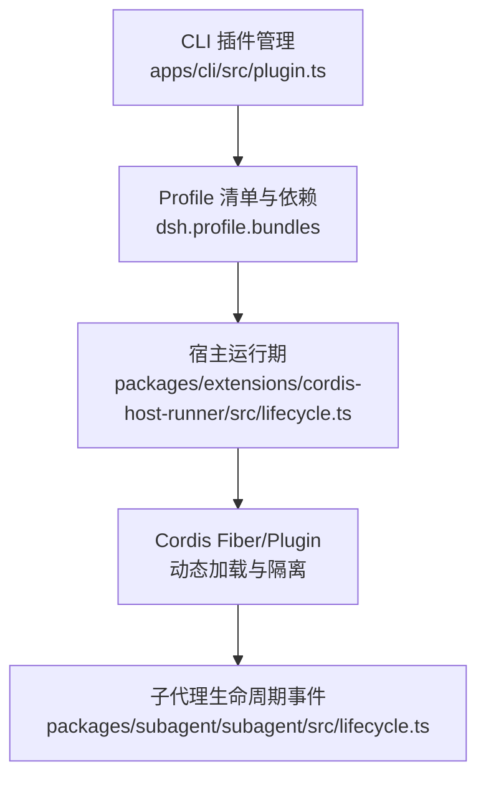
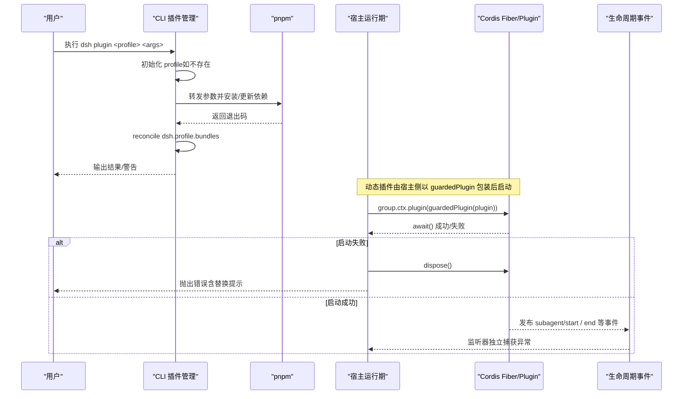
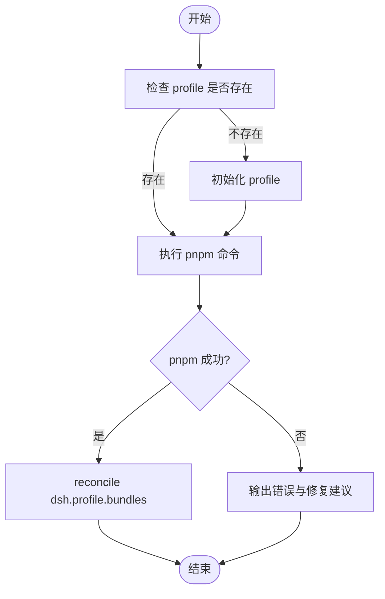
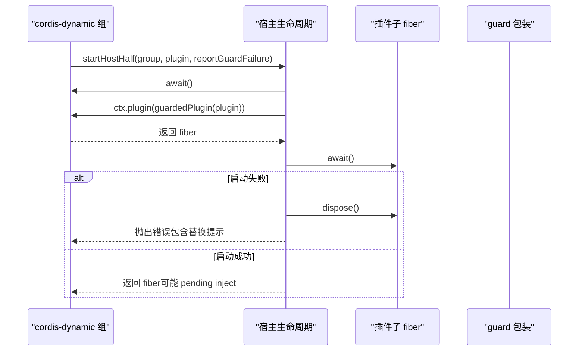
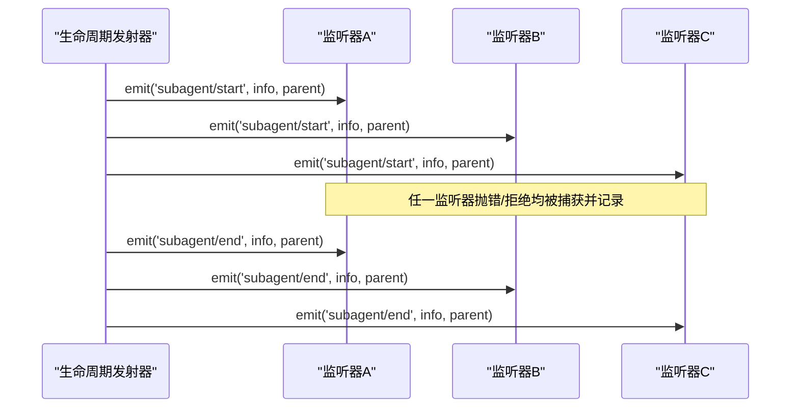
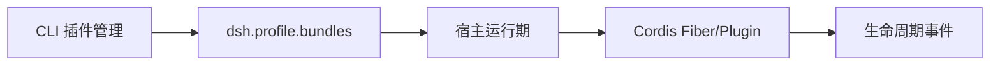

# 中间件生命周期管理

<cite>
**本文引用的文件**
- [apps/cli/src/plugin.ts](file://apps/cli/src/plugin.ts)
- [packages/extensions/cordis-host-runner/src/lifecycle.ts](file://packages/extensions/cordis-host-runner/src/lifecycle.ts)
- [packages/subagent/subagent/src/lifecycle.ts](file://packages/subagent/subagent/src/lifecycle.ts)
</cite>

## 目录
1. [简介](#简介)
2. [项目结构](#项目结构)
3. [核心组件](#核心组件)
4. [架构总览](#架构总览)
5. [详细组件分析](#详细组件分析)
6. [依赖关系分析](#依赖关系分析)
7. [性能考量](#性能考量)
8. [故障排查指南](#故障排查指南)
9. [结论](#结论)
10. [附录：可插拔中间件实现要点与示例路径](#附录可插拔中间件实现要点与示例路径)

## 简介
本文件围绕“中间件（插件）的生命周期管理”展开，聚焦以下目标：
- 注册、初始化、执行、销毁各阶段的职责边界与控制流
- 动态添加与移除中间件的原理，包括运行时配置更新与热重载支持
- 依赖管理与版本兼容性检查策略
- 错误处理与恢复：重试、降级、故障转移
- 提供完整的代码级参考路径，展示如何构建可插拔的中间件架构（插件化设计、配置管理、扩展点定义）

本仓库采用 Cordis 框架作为插件/服务容器，结合 CLI 的 profile 层进行插件包管理，并通过宿主侧 fiber 机制对动态加载的插件进行隔离与生命周期治理。

## 项目结构
与中间件生命周期直接相关的代码主要分布在三个层次：
- CLI 插件管理：负责 profile 初始化、依赖安装、插件清单 reconcile 与激活
- 宿主运行期：通过 cordis 的 fiber 启动受保护的插件子 fiber，并处理启动失败与缺失依赖
- 子代理生命周期：以事件形式发布 start/end 等生命周期边，供上层观测与治理

**图示来源**
- [apps/cli/src/plugin.ts:59-91](file://apps/cli/src/plugin.ts#L59-L91)
- [packages/extensions/cordis-host-runner/src/lifecycle.ts:22-45](file://packages/extensions/cordis-host-runner/src/lifecycle.ts#L22-L45)
- [packages/subagent/subagent/src/lifecycle.ts:100-123](file://packages/subagent/subagent/src/lifecycle.ts#L100-L123)

**章节来源**
- [apps/cli/src/plugin.ts:1-159](file://apps/cli/src/plugin.ts#L1-L159)
- [packages/extensions/cordis-host-runner/src/lifecycle.ts:1-58](file://packages/extensions/cordis-host-runner/src/lifecycle.ts#L1-L58)
- [packages/subagent/subagent/src/lifecycle.ts:1-270](file://packages/subagent/subagent/src/lifecycle.ts#L1-L270)

## 核心组件
- CLI 插件管理器：维护 profile 的 dsh.profile.bundles 列表，基于已安装的依赖自动加入或移除插件层；在首次使用时初始化 profile，转发 pnpm 命令并在成功后 reconcile 清单。
- 宿主运行期生命周期：为每个动态插件创建受保护（guarded）的子 fiber，等待其 settle；若启动失败则立即 dispose 并抛出错误；同时能报告尚未满足的 inject 服务名。
- 子代理生命周期事件：统一封装 start/end 事件发射器，确保每个监听器异常被隔离，避免影响其他监听器或主流程；并提供一次性 run 与可继续 Activation 的统一观察语义。

**章节来源**
- [apps/cli/src/plugin.ts:59-91](file://apps/cli/src/plugin.ts#L59-L91)
- [packages/extensions/cordis-host-runner/src/lifecycle.ts:22-57](file://packages/extensions/cordis-host-runner/src/lifecycle.ts#L22-L57)
- [packages/subagent/subagent/src/lifecycle.ts:100-123](file://packages/subagent/subagent/src/lifecycle.ts#L100-L123)

## 架构总览
下图展示了从 CLI 到宿主运行期的完整调用链，以及生命周期事件的发布路径。

**图示来源**
- [apps/cli/src/plugin.ts:120-158](file://apps/cli/src/plugin.ts#L120-L158)
- [packages/extensions/cordis-host-runner/src/lifecycle.ts:22-45](file://packages/extensions/cordis-host-runner/src/lifecycle.ts#L22-L45)
- [packages/subagent/subagent/src/lifecycle.ts:100-123](file://packages/subagent/subagent/src/lifecycle.ts#L100-L123)

## 详细组件分析

### CLI 插件管理（注册与动态更新）
- 首次使用：若 profile 目录缺少 package.json，则根据模板初始化 profile。
- 依赖安装：将命令行参数中的相对路径规范锚定到调用目录，避免在 profile 内误解析；随后以 pnpm 执行安装/更新。
- 清单 reconcile：遍历 dependencies，检测是否声明 dsh.bundle；若是且未加入 bundles 则追加；若不再声明或已从依赖中移除，则从 bundles 移除。仅对依赖管理的条目生效，模板内置 bundle 不受影响。
- 错误处理：当 pnpm 不可用或执行失败时给出明确提示；对 git 依赖 prepare 脚本被阻止的情况提供修复指引。

**图示来源**
- [apps/cli/src/plugin.ts:120-158](file://apps/cli/src/plugin.ts#L120-L158)
- [apps/cli/src/plugin.ts:59-91](file://apps/cli/src/plugin.ts#L59-L91)

**章节来源**
- [apps/cli/src/plugin.ts:36-45](file://apps/cli/src/plugin.ts#L36-L45)
- [apps/cli/src/plugin.ts:59-91](file://apps/cli/src/plugin.ts#L59-L91)
- [apps/cli/src/plugin.ts:104-112](file://apps/cli/src/plugin.ts#L104-L112)
- [apps/cli/src/plugin.ts:120-158](file://apps/cli/src/plugin.ts#L120-L158)

### 宿主运行期生命周期（初始化、执行、销毁）
- 启动：在 cordis-dynamic 组 fiber 下创建受保护的子 fiber，await 其 settle；若失败则立即 dispose 并抛出错误，避免失败的 fiber 残留。
- 依赖注入：支持 inject 声明的服务在后续可用时再激活；可通过 missingServices 查询尚未满足的服务名。
- 版本冲突：当检测到“already registered”时，给出替换旧版本的指导（先停止旧 id，再运行新版本）。

**图示来源**
- [packages/extensions/cordis-host-runner/src/lifecycle.ts:22-45](file://packages/extensions/cordis-host-runner/src/lifecycle.ts#L22-L45)
- [packages/extensions/cordis-host-runner/src/lifecycle.ts:55-57](file://packages/extensions/cordis-host-runner/src/lifecycle.ts#L55-L57)

**章节来源**
- [packages/extensions/cordis-host-runner/src/lifecycle.ts:22-45](file://packages/extensions/cordis-host-runner/src/lifecycle.ts#L22-L45)
- [packages/extensions/cordis-host-runner/src/lifecycle.ts:55-57](file://packages/extensions/cordis-host-runner/src/lifecycle.ts#L55-L57)

### 子代理生命周期事件（观测与容错）
- 事件发射器：createLifecycleEmitter 将 start/end/provider-removed 等事件广播给所有监听器，并对每个监听器的同步抛错与异步拒绝进行隔离记录，不影响其他监听器。
- 一次性 run：observeRun 在 run.result 完成时发出 end，保证 start 先于 end。
- 可继续 Activation：createActivationObserver 提供 start/capture/settle 顺序，确保即使冷启动回放也能正确计算 epoch 的最终输出与停止原因。

**图示来源**
- [packages/subagent/subagent/src/lifecycle.ts:100-123](file://packages/subagent/subagent/src/lifecycle.ts#L100-L123)
- [packages/subagent/subagent/src/lifecycle.ts:133-162](file://packages/subagent/subagent/src/lifecycle.ts#L133-L162)
- [packages/subagent/subagent/src/lifecycle.ts:175-217](file://packages/subagent/subagent/src/lifecycle.ts#L175-L217)

**章节来源**
- [packages/subagent/subagent/src/lifecycle.ts:100-123](file://packages/subagent/subagent/src/lifecycle.ts#L100-L123)
- [packages/subagent/subagent/src/lifecycle.ts:133-162](file://packages/subagent/subagent/src/lifecycle.ts#L133-L162)
- [packages/subagent/subagent/src/lifecycle.ts:175-217](file://packages/subagent/subagent/src/lifecycle.ts#L175-L217)
- [packages/subagent/subagent/src/lifecycle.ts:235-260](file://packages/subagent/subagent/src/lifecycle.ts#L235-L260)

## 依赖关系分析
- CLI 与宿主运行期解耦：CLI 只负责 profile 与依赖安装，实际插件运行由宿主通过 cordis 的 fiber 模型承载。
- 插件与宿主耦合点：插件通过 inject 声明所需服务；宿主可在启动阶段报告缺失服务，便于诊断。
- 事件系统：子代理生命周期事件通过统一的发射器分发，监听器之间互不干扰，提升鲁棒性。

**图示来源**
- [apps/cli/src/plugin.ts:59-91](file://apps/cli/src/plugin.ts#L59-L91)
- [packages/extensions/cordis-host-runner/src/lifecycle.ts:22-45](file://packages/extensions/cordis-host-runner/src/lifecycle.ts#L22-L45)
- [packages/subagent/subagent/src/lifecycle.ts:100-123](file://packages/subagent/subagent/src/lifecycle.ts#L100-L123)

**章节来源**
- [apps/cli/src/plugin.ts:59-91](file://apps/cli/src/plugin.ts#L59-L91)
- [packages/extensions/cordis-host-runner/src/lifecycle.ts:22-45](file://packages/extensions/cordis-host-runner/src/lifecycle.ts#L22-L45)
- [packages/subagent/subagent/src/lifecycle.ts:100-123](file://packages/subagent/subagent/src/lifecycle.ts#L100-L123)

## 性能考量
- 动态加载开销：每次动态插件启动都会创建 fiber 并 await settle，应避免频繁热重载导致过多上下文切换。
- 事件监听器数量：每个生命周期事件会遍历所有监听器，需控制监听器规模与单监听器耗时。
- 依赖 reconcile：仅在 pnpm 成功后执行，减少不必要的 I/O 与写操作。

[本节为通用指导，无需特定文件引用]

## 故障排查指南
- 启动失败残留：宿主会在启动失败时主动 dispose fiber，避免失败 fiber 悬挂；若仍出现“already registered”，按提示先停止旧 id 再运行新版本。
- 缺失依赖：通过 missingServices 获取尚未满足的 inject 服务名，补齐依赖后再启动。
- pnpm 不可用或失败：CLI 会输出明确错误信息；git 依赖 prepare 脚本被阻止时，按提示在工作区配置 allowBuilds 白名单后重试。
- 监听器异常：生命周期事件发射器会捕获并记录每个监听器的异常，不会中断其他监听器；可通过日志定位问题。

**章节来源**
- [packages/extensions/cordis-host-runner/src/lifecycle.ts:22-45](file://packages/extensions/cordis-host-runner/src/lifecycle.ts#L22-L45)
- [packages/extensions/cordis-host-runner/src/lifecycle.ts:55-57](file://packages/extensions/cordis-host-runner/src/lifecycle.ts#L55-L57)
- [apps/cli/src/plugin.ts:120-158](file://apps/cli/src/plugin.ts#L120-L158)
- [packages/subagent/subagent/src/lifecycle.ts:100-123](file://packages/subagent/subagent/src/lifecycle.ts#L100-L123)

## 结论
该仓库通过 CLI 层管理插件依赖与清单，宿主层以 cordis fiber 安全地启动与销毁插件，并以统一的事件机制发布生命周期边，形成清晰的“注册—初始化—执行—销毁”闭环。配合缺失依赖检测、版本冲突提示与监听器异常隔离，提供了稳健的动态中间件能力。对于需要热重载与运行时更新的场景，建议在宿主侧引入变更检测与增量重放机制，并结合事件系统实现平滑过渡。

[本节为总结性内容，无需特定文件引用]

## 附录：可插拔中间件实现要点与示例路径
- 插件化设计
  - 使用 cordis 的 Plugin/Fiber 模型，将中间件封装为可独立启停的 fiber
  - 通过 inject 声明依赖，宿主在启动前可诊断缺失服务
  - 参考路径：[packages/extensions/cordis-host-runner/src/lifecycle.ts:22-45](file://packages/extensions/cordis-host-runner/src/lifecycle.ts#L22-L45)

- 配置管理
  - 使用 profile 的 dsh.profile.bundles 维护插件层栈，随依赖变化自动 reconcile
  - 参考路径：[apps/cli/src/plugin.ts:59-91](file://apps/cli/src/plugin.ts#L59-L91)

- 扩展点定义
  - 通过事件系统暴露生命周期扩展点（start/end/provider-removed），允许外部订阅与增强
  - 参考路径：[packages/subagent/subagent/src/lifecycle.ts:100-123](file://packages/subagent/subagent/src/lifecycle.ts#L100-L123)

- 运行时配置更新与热重载
  - 动态插件以 fiber 为单位，支持按需启动与销毁；结合宿主 guard 包装与错误上报，可实现安全的替换流程
  - 参考路径：[packages/extensions/cordis-host-runner/src/lifecycle.ts:22-45](file://packages/extensions/cordis-host-runner/src/lifecycle.ts#L22-L45)

- 依赖管理与版本兼容性
  - CLI 依据依赖是否声明 dsh.bundle 决定是否纳入插件层；版本冲突时给出替换指引
  - 参考路径：[apps/cli/src/plugin.ts:36-45](file://apps/cli/src/plugin.ts#L36-L45), [packages/extensions/cordis-host-runner/src/lifecycle.ts:34-42](file://packages/extensions/cordis-host-runner/src/lifecycle.ts#L34-L42)

- 错误处理与恢复
  - 监听器异常隔离、启动失败立即 dispose、缺失依赖诊断、pnpm 失败提示
  - 参考路径：[packages/subagent/subagent/src/lifecycle.ts:100-123](file://packages/subagent/subagent/src/lifecycle.ts#L100-L123), [packages/extensions/cordis-host-runner/src/lifecycle.ts:22-45](file://packages/extensions/cordis-host-runner/src/lifecycle.ts#L22-L45), [apps/cli/src/plugin.ts:120-158](file://apps/cli/src/plugin.ts#L120-L158)