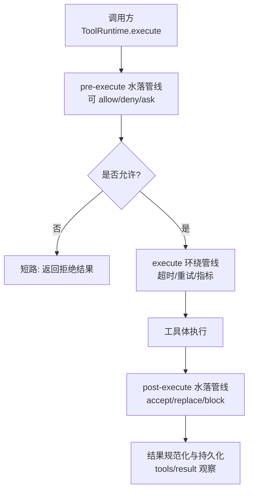
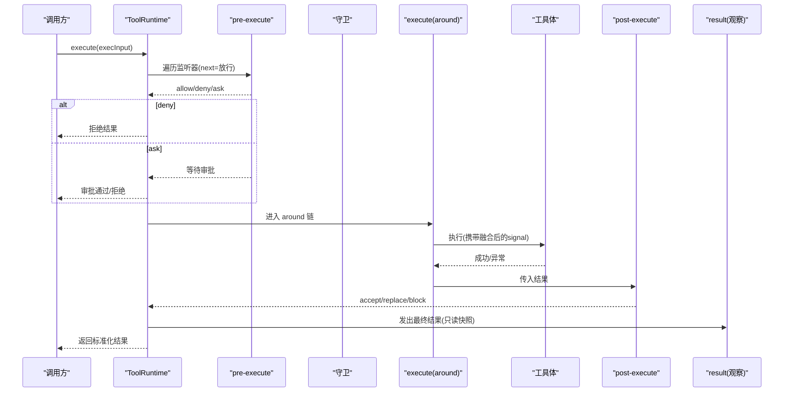
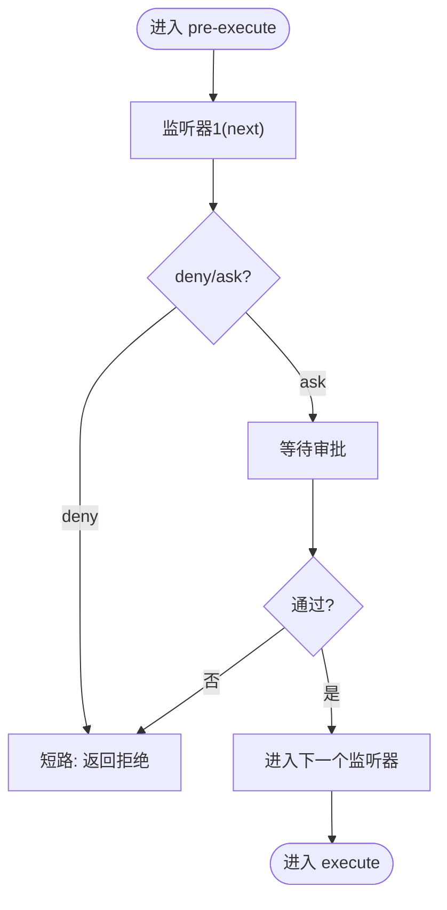
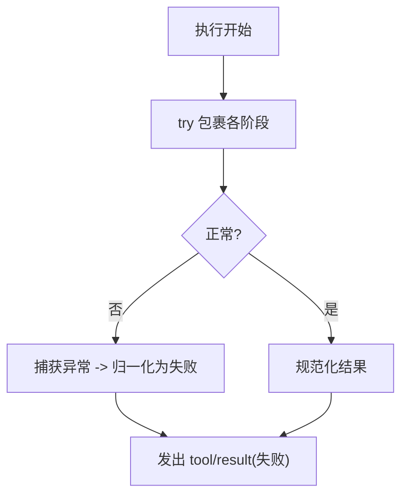
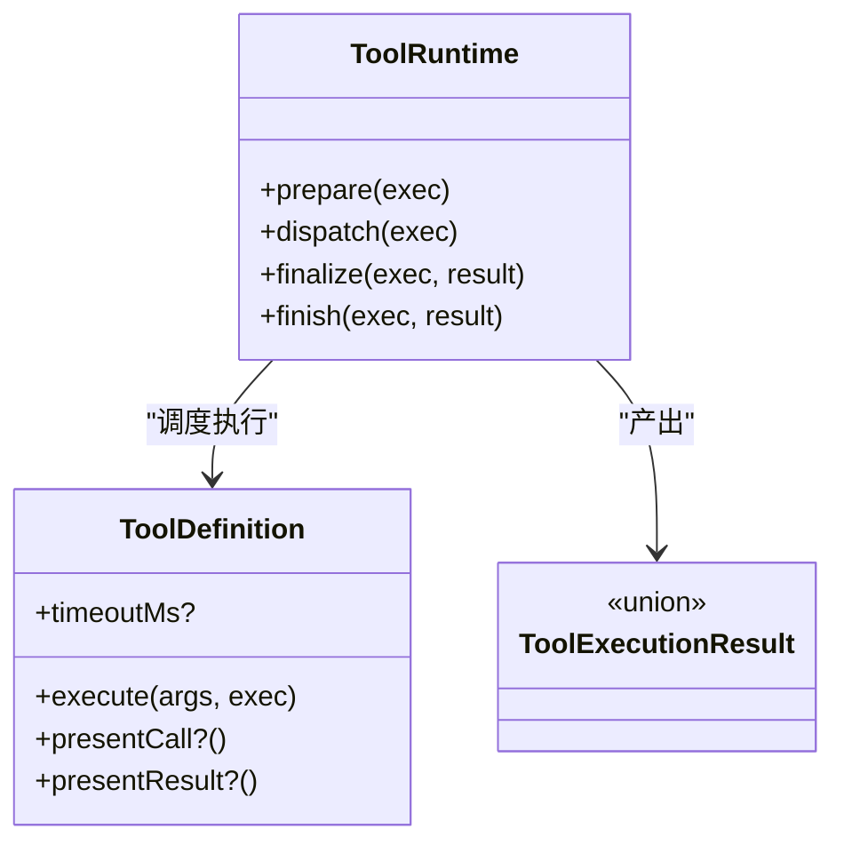
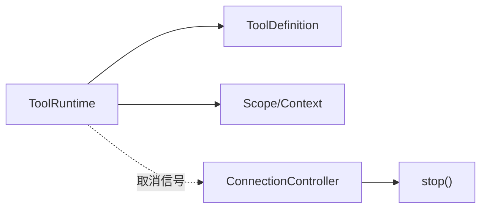

# 管道控制机制

<cite>
**本文引用的文件**
- [packages/core/tools/src/index.ts](file://packages/core/tools/src/index.ts)
- [packages/client/connection/src/client/connection.ts](file://packages/client/connection/src/client/connection.ts)
- [packages/client/connection/tests/client-apply.client.spec.ts](file://packages/client/connection/tests/client-apply.client.spec.ts)
- [packages/client/connection/tests/connection.client.spec.ts](file://packages/client/connection/tests/connection.client.spec.ts)
- [apps/web/tests/chat-scroll-contract.e2e.ts](file://apps/web/tests/chat-scroll-continuation.e2e.ts)
</cite>

## 目录
1. [简介](#简介)
2. [项目结构](#项目结构)
3. [核心组件](#核心组件)
4. [架构总览](#架构总览)
5. [详细组件分析](#详细组件分析)
6. [依赖关系分析](#依赖关系分析)
7. [性能考虑](#性能考虑)
8. [故障排查指南](#故障排查指南)
9. [结论](#结论)
10. [附录](#附录)

## 简介
本文件聚焦“中间件如何控制事件/调用管道的执行流程”，围绕 continue()、stop()、throw() 等控制语义，解释条件中断、短路逻辑与错误传播机制；并给出管道状态监控与管理（进度跟踪、超时控制、资源清理）的方法。同时提供重试、降级、熔断器等高级特性的实现思路与示例路径，以及性能优化与调试技巧。

## 项目结构
- 工具执行管道位于 core/tools 包，提供 pre-execute、execute（around）、post-execute、result 等阶段的水滴式流水线，支持守卫（guard）短路、审批（ask）异步决策、取消信号融合与结果规范化。
- 客户端连接层提供 stop() 生命周期控制，用于中止流式生成或重连循环。
- 测试用例展示了 continue() 在浏览器路由/网络拦截中的使用，体现“继续执行”的常见模式。

图表来源
- [packages/core/tools/src/index.ts:142-197](file://packages/core/tools/src/index.ts#L142-L197)
- [packages/core/tools/src/index.ts:787-800](file://packages/core/tools/src/index.ts#L787-L800)

章节来源
- [packages/core/tools/src/index.ts:142-197](file://packages/core/tools/src/index.ts#L142-L197)
- [packages/core/tools/src/index.ts:787-800](file://packages/core/tools/src/index.ts#L787-L800)

## 核心组件
- 工具运行时与调度器：统一入口 ToolRuntime 暴露 prepare/dispatch/finalize/finish，串联 pre-execute、execute、post-execute、result。
- 决策类型：PreToolDecision（allow/deny/ask）、PostToolDecision（accept/replace/block）。
- 守卫（Guard）：同步单调判定，一旦返回原因即短路拒绝。
- 取消信号融合：around 包装可替换 signal，但始终与调用方信号融合，保证取消可传递。
- 结果规范：输出值必须可无损 JSON 序列化，失败时归一化为 ToolExecutionFailure。

章节来源
- [packages/core/tools/src/index.ts:142-197](file://packages/core/tools/src/index.ts#L142-L197)
- [packages/core/tools/src/index.ts:582-600](file://packages/core/tools/src/index.ts#L582-L600)
- [packages/core/tools/src/index.ts:703-711](file://packages/core/tools/src/index.ts#L703-L711)
- [packages/core/tools/src/index.ts:762-772](file://packages/core/tools/src/index.ts#L762-L772)
- [packages/core/tools/src/index.ts:555-580](file://packages/core/tools/src/index.ts#L555-L580)

## 架构总览
下图展示一次工具调用的完整生命周期与控制点：

图表来源
- [packages/core/tools/src/index.ts:142-197](file://packages/core/tools/src/index.ts#L142-L197)
- [packages/core/tools/src/index.ts:787-800](file://packages/core/tools/src/index.ts#L787-L800)

## 详细组件分析

### 1) 中间件控制方法：continue()/stop()/throw() 的映射与用法
- continue()（继续执行）
  - 在 HTTP/路由场景中，表示“不拦截，继续后续处理”。在工具管道中，对应 pre/post 监听器调用 next() 将控制权交给下一环。
  - 参考：浏览器测试中对 route.continue() 的使用，体现“继续默认行为”的模式。
  - 参考路径：[apps/web/tests/chat-scroll-continuation.e2e.ts](file://apps/web/tests/chat-scroll-continuation.e2e.ts)

- stop()（停止/中止）
  - 在连接层，stop() 用于中止流式生成或重连循环，确保资源释放与退出。
  - 参考路径：
    - [packages/client/connection/src/client/connection.ts:85-97](file://packages/client/connection/src/client/connection.ts#L85-L97)
    - [packages/client/connection/tests/client-apply.client.spec.ts:87-133](file://packages/client/connection/tests/client-apply.client.spec.ts#L87-L133)
    - [packages/client/connection/tests/connection.client.spec.ts:43-179](file://packages/client/connection/tests/connection.client.spec.ts#L43-L179)

- throw()（抛出错误）
  - 在工具管道中，任何阶段的异常会被捕获并归一化为 ToolExecutionFailure，错误信息被安全地转换为人类可读文本，避免污染下游。
  - 参考路径：
    - [packages/core/tools/src/index.ts:602-622](file://packages/core/tools/src/index.ts#L602-L622)
    - [packages/core/tools/src/index.ts:512-527](file://packages/core/tools/src/index.ts#L512-L527)

章节来源
- [packages/client/connection/src/client/connection.ts:85-97](file://packages/client/connection/src/client/connection.ts#L85-L97)
- [packages/client/connection/tests/client-apply.client.spec.ts:87-133](file://packages/client/connection/tests/client-apply.client.spec.ts#L87-L133)
- [packages/client/connection/tests/connection.client.spec.ts:43-179](file://packages/client/connection/tests/connection.client.spec.ts#L43-L179)
- [packages/core/tools/src/index.ts:602-622](file://packages/core/tools/src/index.ts#L602-L622)
- [packages/core/tools/src/index.ts:512-527](file://packages/core/tools/src/index.ts#L512-L527)

### 2) 条件中断与短路逻辑
- pre-execute 阶段：监听器可返回 deny，立即短路，不再进入工具体。
- 守卫（guard）：同步单调判定，一旦返回拒绝原因，直接阻断执行。
- 审批（ask）：异步决策，若未获许可则视为拒绝。

图表来源
- [packages/core/tools/src/index.ts:142-197](file://packages/core/tools/src/index.ts#L142-L197)
- [packages/core/tools/src/index.ts:703-711](file://packages/core/tools/src/index.ts#L703-L711)

章节来源
- [packages/core/tools/src/index.ts:142-197](file://packages/core/tools/src/index.ts#L142-L197)
- [packages/core/tools/src/index.ts:703-711](file://packages/core/tools/src/index.ts#L703-L711)

### 3) 错误传播机制
- 任意阶段抛出的异常都会被捕获并转为结构化失败（包含消息与可选的错误信息），不会向上传播为未处理异常。
- 输出校验失败会归一化为 INVALID_TOOL_OUTPUT。
- 未知工具名会抛出 UNKNOWN_TOOL，便于上层区分策略。

图表来源
- [packages/core/tools/src/index.ts:602-622](file://packages/core/tools/src/index.ts#L602-L622)
- [packages/core/tools/src/index.ts:512-527](file://packages/core/tools/src/index.ts#L512-L527)
- [packages/core/tools/src/index.ts:488-510](file://packages/core/tools/src/index.ts#L488-L510)

章节来源
- [packages/core/tools/src/index.ts:488-510](file://packages/core/tools/src/index.ts#L488-L510)
- [packages/core/tools/src/index.ts:512-527](file://packages/core/tools/src/index.ts#L512-L527)
- [packages/core/tools/src/index.ts:602-622](file://packages/core/tools/src/index.ts#L602-L622)

### 4) 管道状态监控与管理
- 执行进度跟踪：通过 tools/result 事件获取冻结的最终结果快照，适合审计与追踪。
- 超时控制：工具声明 timeoutMs，由外部策略以 tools/execute 包装实现；内部通过 AbortSignal 融合与协作取消。
- 资源清理：around 包装需恢复自身 signal 并确保在退出前达到静默；连接层 stop() 负责中止流与重连循环。

图表来源
- [packages/core/tools/src/index.ts:787-800](file://packages/core/tools/src/index.ts#L787-L800)
- [packages/core/tools/src/index.ts:221-288](file://packages/core/tools/src/index.ts#L221-L288)
- [packages/core/tools/src/index.ts:555-580](file://packages/core/tools/src/index.ts#L555-L580)

章节来源
- [packages/core/tools/src/index.ts:221-288](file://packages/core/tools/src/index.ts#L221-L288)
- [packages/core/tools/src/index.ts:555-580](file://packages/core/tools/src/index.ts#L555-L580)
- [packages/core/tools/src/index.ts:787-800](file://packages/core/tools/src/index.ts#L787-L800)

### 5) 高级特性：重试、降级、熔断器
- 重试机制
  - 在 tools/execute 的 around 包装中捕获失败，按策略指数退避重试；注意保留原始 caller signal，并在每次重试前检查取消。
  - 可结合 pre-execute 的 deny/ask 做前置快速失败。
- 降级处理
  - post-execute 可将失败结果替换为降级内容（accept 带 content/value），对外呈现可用响应。
- 熔断器
  - 在 execute 包装内维护失败计数与窗口，超过阈值后短期拒绝请求（pre-execute deny 或 execute 直接返回失败），冷却后恢复。

提示：以上均为基于现有管道扩展点的实现范式，具体策略代码可按需注入到 tools/execute 与 pre/post 阶段。

章节来源
- [packages/core/tools/src/index.ts:142-197](file://packages/core/tools/src/index.ts#L142-L197)
- [packages/core/tools/src/index.ts:582-600](file://packages/core/tools/src/index.ts#L582-L600)

## 依赖关系分析
- ToolRuntime 依赖工具定义（ToolDefinition）与上下文服务（如 systemPrompt），并通过 Scope 机制进行作用域隔离与可见性过滤。
- 客户端连接层依赖控制器（controller.stop）管理流式生命周期，与工具管道的取消信号协同工作。

图表来源
- [packages/core/tools/src/index.ts:787-800](file://packages/core/tools/src/index.ts#L787-L800)
- [packages/client/connection/src/client/connection.ts:85-97](file://packages/client/connection/src/client/connection.ts#L85-L97)

章节来源
- [packages/core/tools/src/index.ts:787-800](file://packages/core/tools/src/index.ts#L787-L800)
- [packages/client/connection/src/client/connection.ts:85-97](file://packages/client/connection/src/client/connection.ts#L85-L97)

## 性能考虑
- 并行与独占：工具可通过 isConcurrencySafe 标记参与并行分组；exclusive 形成顺序屏障。合理设置 maxParallelSubCalls 控制并发度。
- 守卫优先：将昂贵判断放在 pre-execute/guard，尽早短路减少无效执行。
- 结果快照：对投影与结果进行无损 JSON 快照，避免后续材料化开销与不一致。
- 取消信号：around 包装应最小化持有时间，及时恢复信号并清理资源，避免泄漏。

章节来源
- [packages/core/tools/src/index.ts:257-269](file://packages/core/tools/src/index.ts#L257-L269)
- [packages/core/tools/src/index.ts:667-673](file://packages/core/tools/src/index.ts#L667-L673)
- [packages/core/tools/src/index.ts:762-772](file://packages/core/tools/src/index.ts#L762-L772)

## 故障排查指南
- 未知工具名：检查注册表与可见性过滤，确认工具已正确注册且未被限制。
- 输出非法：核对 output.schema 与实际返回值，定位投影函数抛错位置。
- 超时/取消：确认工具体是否正确消费 exec.signal 并在取消后尽快退出；检查 around 包装是否正确恢复信号。
- 审批阻塞：确认审批服务可用性与超时配置，必要时在 pre-execute 增加快速失败分支。
- 连接中止：使用 stop() 中止流式任务，验证资源释放与无悬挂 Promise。

章节来源
- [packages/core/tools/src/index.ts:488-510](file://packages/core/tools/src/index.ts#L488-L510)
- [packages/core/tools/src/index.ts:512-527](file://packages/core/tools/src/index.ts#L512-L527)
- [packages/core/tools/src/index.ts:602-622](file://packages/core/tools/src/index.ts#L602-L622)
- [packages/client/connection/src/client/connection.ts:85-97](file://packages/client/connection/src/client/connection.ts#L85-L97)

## 结论
该管道通过 pre-execute/execute/post-execute/result 四段式流水，配合守卫、审批与取消信号融合，提供了强大的条件中断、短路逻辑与错误传播能力。借助 around 包装可实现重试、降级、熔断等高级特性；通过 tools/result 与超时/取消机制，可实现执行进度跟踪、超时控制与资源清理。建议在关键路径上优先使用 pre-execute/guard 进行快速失败，并以 around 包装承载横切关注点，保持工具体专注业务。

## 附录
- 示例路径（仅列出文件，不含代码片段）
  - 重试机制：在 tools/execute 包装中实现指数退避重试，参考 [packages/core/tools/src/index.ts:142-197](file://packages/core/tools/src/index.ts#L142-L197)
  - 降级处理：在 post-execute 中用 accept 替换失败结果为降级内容，参考 [packages/core/tools/src/index.ts:582-600](file://packages/core/tools/src/index.ts#L582-L600)
  - 熔断器：在 execute 包装内维护失败率与窗口，超阈后短期拒绝，参考 [packages/core/tools/src/index.ts:142-197](file://packages/core/tools/src/index.ts#L142-L197)
  - 连接中止：使用 stop() 中止流式任务，参考 [packages/client/connection/src/client/connection.ts:85-97](file://packages/client/connection/src/client/connection.ts#L85-L97)
  - 继续执行：浏览器路由场景下的 continue() 模式，参考 [apps/web/tests/chat-scroll-continuation.e2e.ts](file://apps/web/tests/chat-scroll-continuation.e2e.ts)