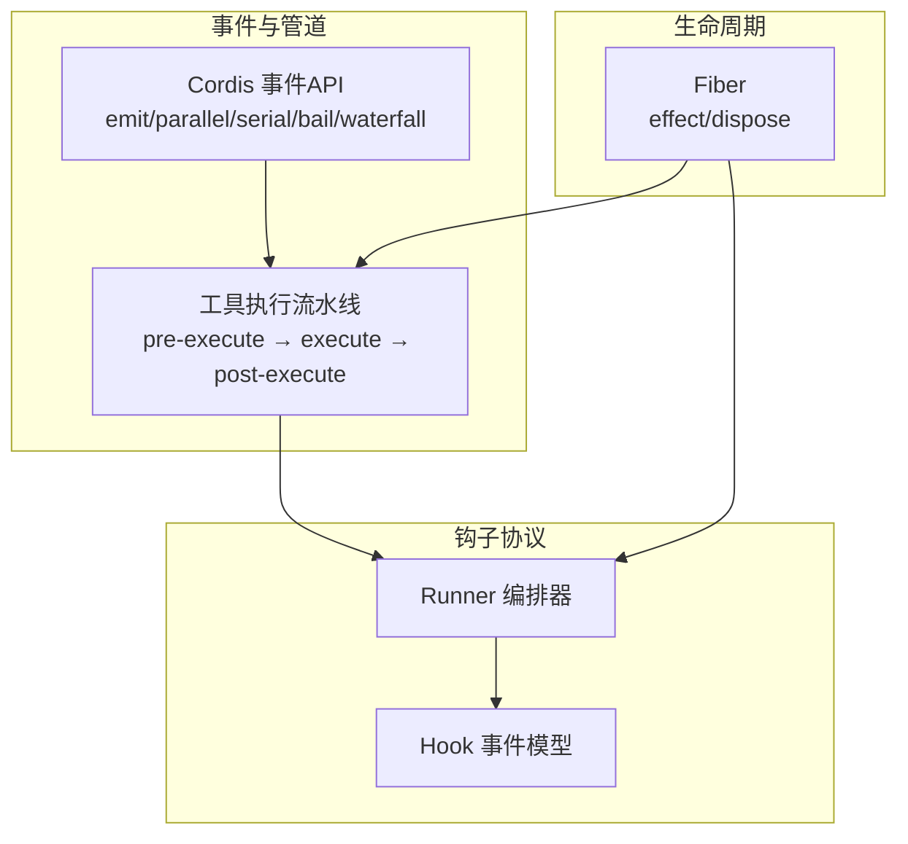
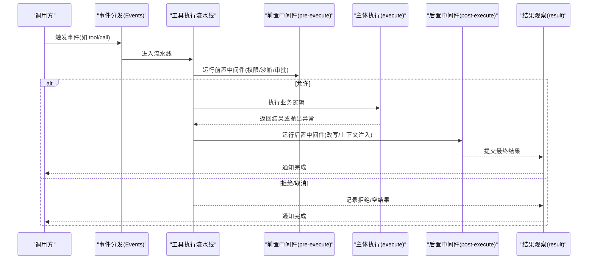
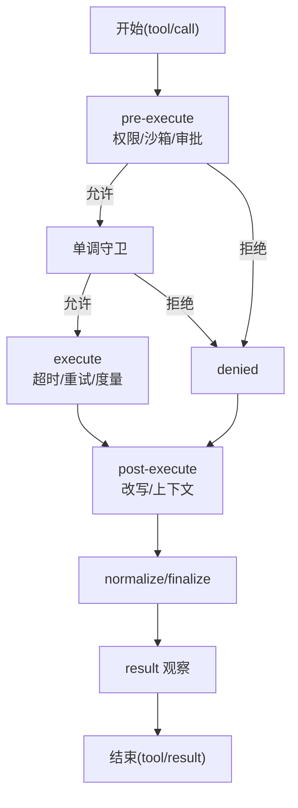
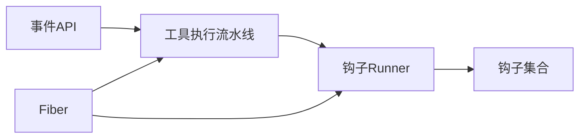

# 事件管道与中间件

<cite>
**本文引用的文件**
- [events.md](file://docs/cordis-api/events.md)
- [tool-execution-pipeline.md](file://docs/tool-execution-pipeline.md)
- [fiber.md](file://docs/cordis-api/fiber.md)
- [runner.ts](file://packages/hooks/hook-protocol/src/runner.ts)
- [events.ts](file://packages/hooks/hook-protocol/src/events.ts)
- [index.ts](file://packages/hooks/hook-protocol/src/index.ts)
</cite>

## 目录
1. [简介](#简介)
2. [项目结构](#项目结构)
3. [核心组件](#核心组件)
4. [架构总览](#架构总览)
5. [详细组件分析](#详细组件分析)
6. [依赖关系分析](#依赖关系分析)
7. [性能考虑](#性能考虑)
8. [故障排查指南](#故障排查指南)
9. [结论](#结论)
10. [附录](#附录)

## 简介
本文件围绕“事件管道”和“中间件模式”展开，解释如何将多个处理器串联成可组合的处理流水线，并说明前置、后置与条件中间件的实现原理。结合工具执行流水线的文档与钩子协议（hook-protocol）的运行时，给出配置与执行流程、错误传播机制、性能优化建议，以及如何在插件系统中集成中间件的实际路径指引。

## 项目结构
- 事件分发与调度模式由 Cordis 事件 API 提供，支持同步广播、并行等待、串行短路、瀑布式 next 调用等模式，这些是构建事件管道的基石。
- 工具执行流水线将“前置处理（权限、沙箱、审批）— 主体执行 — 后置处理（结果改写、上下文注入）— 最终结果观察”串成一条可观测、可拦截的链。
- 钩子协议（hook-protocol）提供 runner 与事件模型，用于在运行时编排多个钩子（中间件），形成可扩展的中间件管线。
- Fiber 提供生命周期与清理能力，确保中间件在插件加载/卸载时正确注册与释放资源。

图表来源
- [events.md:8-123](file://docs/cordis-api/events.md#L8-L123)
- [tool-execution-pipeline.md:1-63](file://docs/tool-execution-pipeline.md#L1-L63)
- [fiber.md:8-37](file://docs/cordis-api/fiber.md#L8-L37)

章节来源
- [events.md:8-123](file://docs/cordis-api/events.md#L8-L123)
- [tool-execution-pipeline.md:1-63](file://docs/tool-execution-pipeline.md#L1-L63)
- [fiber.md:8-37](file://docs/cordis-api/fiber.md#L8-L37)

## 核心组件
- 事件分发模式：emit（同步广播）、parallel（并发等待）、serial（顺序等待直到短路）、bail（同步短路）、waterfall（next 包裹式链路）。
- 工具执行流水线：三段水落流（tools/pre-execute、tools/execute、tools/post-execute）+ 单调守卫 + 结果规范化与最终观察。
- 钩子协议 Runner：负责按策略编排多个钩子（中间件），支持前置、后置、条件分支与错误传播。
- Fiber：为每个插件实例提供 effect 注册与清理，保证中间件的生命周期安全。

章节来源
- [events.md:8-123](file://docs/cordis-api/events.md#L8-L123)
- [tool-execution-pipeline.md:1-63](file://docs/tool-execution-pipeline.md#L1-L63)
- [fiber.md:8-37](file://docs/cordis-api/fiber.md#L8-L37)

## 架构总览
下图展示了从事件触发到工具执行再到结果观察的整体流程，体现“中间件化”的横切关注点如何以水落流方式嵌入。

图表来源
- [tool-execution-pipeline.md:1-63](file://docs/tool-execution-pipeline.md#L1-L63)
- [events.md:8-123](file://docs/cordis-api/events.md#L8-L123)

## 详细组件分析

### 事件管道与中间件模式
- 概念：事件管道是将多个处理器（中间件）按顺序或策略串联，使事件在通过每个处理器时被增强、校验、转换或拦截。
- 模式：
  - 前置中间件：在核心逻辑前执行，如日志、鉴权、沙箱准入。
  - 后置中间件：在核心逻辑后执行，如结果改写、指标上报、上下文注入。
  - 条件中间件：根据上下文或策略决定是否继续后续处理（短路/否决）。
- 实现要点：
  - 使用 waterfall 模式组织 next 调用，天然支持前后置与条件控制。
  - 使用 serial/bail 模式实现短路策略。
  - 使用 parallel 模式对无副作用的监听进行并发加速。

章节来源
- [events.md:8-123](file://docs/cordis-api/events.md#L8-L123)

### 工具执行流水线（实际落地）
- 阶段划分：
  - tools/pre-execute：hooks、权限、沙箱；可发起一次性审批。
  - 单调守卫：deny/abstain，保护身份与关键不变量。
  - tools/execute：超时、重试、度量等 around 包装。
  - tools/post-execute：接受、阻止、替换、追加上下文。
  - 结果规范化与 finalizeContent：快照失败转为 isError，定义级内容约束。
  - tools/result：不可变结果的最终观察。
- 错误传播：
  - 任意阶段抛出的异常会被规范化为统一的结果形态，避免污染上层。
  - 拒绝/取消走 denied 分支，仍会进入 post-execute 做收尾。

图表来源
- [tool-execution-pipeline.md:1-63](file://docs/tool-execution-pipeline.md#L1-L63)

章节来源
- [tool-execution-pipeline.md:1-63](file://docs/tool-execution-pipeline.md#L1-L63)

### 钩子协议 Runner（中间件编排）
- 角色：
  - Runner：按策略编排多个钩子，决定调用顺序、是否短路、如何处理返回值与异常。
  - 事件模型：定义钩子的输入输出契约，便于跨模块组合。
- 典型行为：
  - 前置钩子：在业务前执行，可修改上下文或提前返回。
  - 后置钩子：在业务后执行，可聚合指标或改写结果。
  - 条件钩子：基于上下文判断是否继续后续钩子。
- 与事件管道的关系：Runner 内部通常借助事件分发模式（如 waterfall/serial）实现中间件链。

章节来源
- [runner.ts](file://packages/hooks/hook-protocol/src/runner.ts)
- [events.ts](file://packages/hooks/hook-protocol/src/events.ts)
- [index.ts](file://packages/hooks/hook-protocol/src/index.ts)

### Fiber 与生命周期（中间件注册与清理）
- effect：在插件加载时立即执行，返回的清理函数会在卸载或显式 dispose 时按逆序执行。
- 作用：确保中间件（钩子、监听器）在正确的生命周期内注册与释放，避免泄漏与悬挂引用。
- 与管道集成：在 effect 中注册前置/后置中间件，或在 waterfalls 中挂载钩子。

章节来源
- [fiber.md:8-37](file://docs/cordis-api/fiber.md#L8-L37)

## 依赖关系分析
- 事件 API 为所有管道提供统一的调度原语（emit/parallel/serial/bail/waterfall）。
- 工具执行流水线依赖事件 API 来挂载 pre/execute/post 三个阶段的水落流。
- 钩子协议 Runner 作为通用中间件编排器，被各子系统复用。
- Fiber 为所有中间件提供生命周期保障。

图表来源
- [events.md:8-123](file://docs/cordis-api/events.md#L8-L123)
- [tool-execution-pipeline.md:1-63](file://docs/tool-execution-pipeline.md#L1-L63)
- [fiber.md:8-37](file://docs/cordis-api/fiber.md#L8-L37)

章节来源
- [events.md:8-123](file://docs/cordis-api/events.md#L8-L123)
- [tool-execution-pipeline.md:1-63](file://docs/tool-execution-pipeline.md#L1-L63)
- [fiber.md:8-37](file://docs/cordis-api/fiber.md#L8-L37)

## 性能考虑
- 选择合适的事件模式：
  - 无副作用的监听用 parallel 并发执行，缩短整体延迟。
  - 需要短路或顺序依赖的用 serial/bail，减少不必要的工作。
  - 需要前后置控制的用 waterfall，避免重复计算。
- 流水线优化：
  - 前置阶段尽早拒绝无效请求，降低后续开销。
  - 将耗时操作（网络、I/O）放入异步且可并发的阶段。
  - 结果规范化与 finalize 保持轻量，避免阻塞主流程。
- 资源管理：
  - 使用 Fiber 的 effect 精确管理中间件生命周期，避免内存泄漏。
  - 对长连接或定时器在 dispose 中及时释放。

[本节为通用指导，不直接分析具体文件]

## 故障排查指南
- 常见症状与定位：
  - 事件未触发：检查 on/once 是否正确注册，是否使用了 prepend 导致顺序问题。
  - 中间件未生效：确认是否在正确的 fiber 中注册，是否在对应 waterfalls 挂载。
  - 短路过早：检查 serial/bail 的返回值约定，确认是否意外返回了“真值”。
  - 结果不一致：查看 normalize/finalize 阶段是否将异常转换为错误结果。
- 调试建议：
  - 在 pre/post 阶段添加日志钩子，打印上下文与返回值。
  - 使用 Fiber 的 getEffects 查看已注册效果树，确认中间件存在。
  - 逐步禁用中间件，定位问题所在阶段。

章节来源
- [fiber.md:8-37](file://docs/cordis-api/fiber.md#L8-L37)
- [tool-execution-pipeline.md:1-63](file://docs/tool-execution-pipeline.md#L1-L63)

## 结论
事件管道通过统一的事件分发模式与可组合的中间件，将横切关注点（日志、鉴权、沙箱、结果改写等）与核心业务解耦。工具执行流水线提供了标准化的三段式水落流，配合单调守卫与结果规范化，确保一致性与可观测性。钩子协议的 Runner 进一步抽象了中间件编排，而 Fiber 保证了生命周期安全。遵循本文的模式与优化建议，可在插件系统中灵活扩展复杂的事件处理管道。

[本节为总结，不直接分析具体文件]

## 附录
- 创建自定义中间件的建议步骤：
  - 明确职责：确定是前置、后置还是条件中间件。
  - 选择模式：使用 waterfall 包裹 next 实现前后置；使用 serial/bail 实现短路。
  - 注册位置：在 Fiber 的 effect 中注册，或在对应 waterfalls 挂载。
  - 错误处理：捕获并转化为统一结果，避免污染上游。
  - 性能：尽量早拒绝、避免阻塞、合理使用并发。
- 参考路径（代码片段位置）：
  - 事件 API 与调度模式：[events.md:8-123](file://docs/cordis-api/events.md#L8-L123)
  - 工具执行流水线阶段与错误传播：[tool-execution-pipeline.md:1-63](file://docs/tool-execution-pipeline.md#L1-L63)
  - 钩子 Runner 与事件模型：[runner.ts](file://packages/hooks/hook-protocol/src/runner.ts), [events.ts](file://packages/hooks/hook-protocol/src/events.ts), [index.ts](file://packages/hooks/hook-protocol/src/index.ts)
  - 生命周期与清理：[fiber.md:8-37](file://docs/cordis-api/fiber.md#L8-L37)