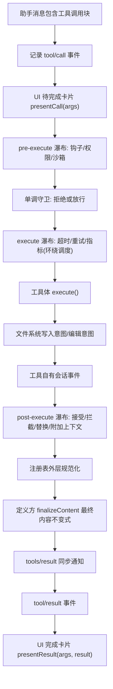
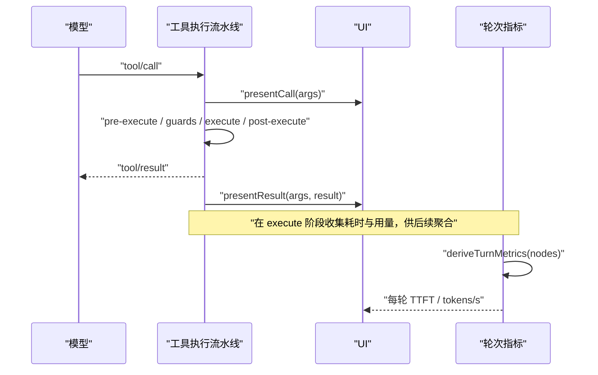
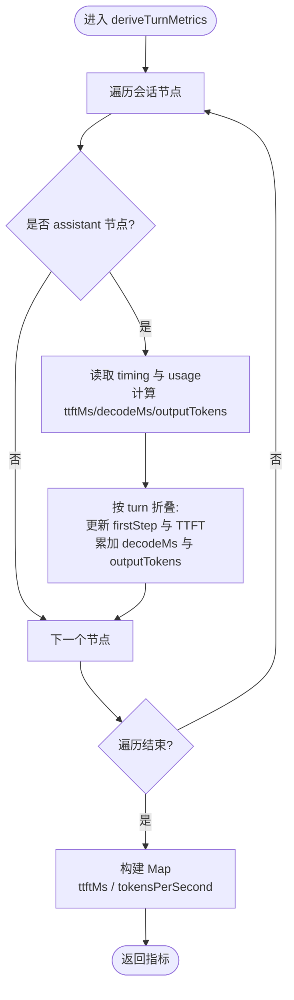
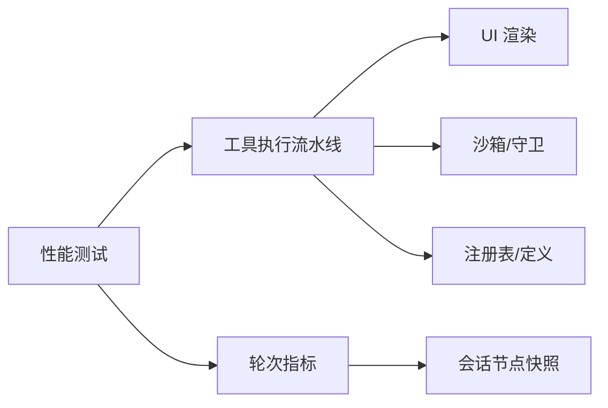

# 性能优化与监控

<cite>
**本文引用的文件**
- [工具执行流水线.md](file://docs/tool-execution-pipeline.md)
- [轮次指标.ts](file://packages/client/ui-conversation/src/client/chat/turn-metrics.ts)
- [复杂历史性能测试.ts](file://apps/web/tests/complex-history.perf.ts)
- [Web 性能测试配置.ts](file://vitest.web.perf.config.ts)
</cite>

## 目录
1. [简介](#简介)
2. [项目结构](#项目结构)
3. [核心组件](#核心组件)
4. [架构总览](#架构总览)
5. [详细组件分析](#详细组件分析)
6. [依赖关系分析](#依赖关系分析)
7. [性能考量](#性能考量)
8. [故障排查指南](#故障排查指南)
9. [结论](#结论)
10. [附录](#附录)

## 简介
本文件围绕事件管道的性能优化与监控展开，聚焦以下目标：
- 识别管道执行瓶颈（CPU、内存、执行时间）
- 实现管道并行化与异步处理，提升吞吐
- 设计并落地缓存机制，避免重复计算与资源浪费
- 建立实时监控与指标采集体系，保障健康度
- 提供调优最佳实践与可操作的监控示例、性能测试方法

## 项目结构
本项目在“工具执行流水线”中定义了从工具调用到结果呈现的完整阶段，并在客户端侧实现了轮次级指标聚合。关键位置如下：
- 工具执行流水线文档：描述 pre-execute、monotonic guards、execute、post-execute、finalizeContent、result 等阶段的顺序与职责
- 轮次指标模块：从会话节点中提取 TTFT、解码耗时、输出 token 数，并汇总为每轮的吞吐指标
- Web 性能测试与配置：提供端到端性能测试入口与运行配置

图表来源
- [工具执行流水线.md:1-63](file://docs/tool-execution-pipeline.md#L1-L63)

章节来源
- [工具执行流水线.md:1-63](file://docs/tool-execution-pipeline.md#L1-L63)

## 核心组件
- 工具执行流水线：将策略、钩子、沙箱、文件系统守卫、结果重写、最终观察与 UI 渲染串联起来，保证在不改变主循环的前提下扩展能力
- 轮次指标聚合：从已落地的助手节点中提取首令牌时延（TTFT）、解码耗时与输出 token，按轮次聚合得到吞吐（tokens/s）
- 性能测试与配置：提供 Web 端性能测试用例与 Vitest 性能模式配置，便于回归与压测

章节来源
- [工具执行流水线.md:1-63](file://docs/tool-execution-pipeline.md#L1-L63)
- [轮次指标.ts:1-98](file://packages/client/ui-conversation/src/client/chat/turn-metrics.ts#L1-L98)

## 架构总览
下图展示了从模型侧的工具调用到 UI 展示的关键路径，以及指标采集点：

图表来源
- [工具执行流水线.md:1-63](file://docs/tool-execution-pipeline.md#L1-L63)
- [轮次指标.ts:1-98](file://packages/client/ui-conversation/src/client/chat/turn-metrics.ts#L1-L98)

## 详细组件分析

### 工具执行流水线（阶段与可扩展点）
- pre-execute 瀑布：用于权限检查、沙箱准备、前置钩子；在此处可引入限流、预热、缓存命中判断
- 单调守卫：对身份敏感操作进行不可逆决策（拒绝/放行），适合做快速失败与短路
- execute 瀑布：通过“环绕调度”包裹工具体，统一注入超时、重试、指标埋点；是并行化与并发控制的最佳插入点
- 文件系统守卫：限制写意图范围，避免越权修改
- post-execute 瀑布：对结果进行接受/拦截/替换/附加上下文，适合做结果裁剪、去重、缓存键生成
- finalizeContent：由工具定义方维护最终内容不变式，确保 UI 一致性
- tools/result：冻结且不可变的权威结果，下游消费稳定

优化建议
- 在 execute 瀑布内实现任务并行化（如并发读取多个文件或发起多个独立请求）
- 在 pre/post 阶段加入缓存层（基于输入指纹与上下文哈希），减少重复计算
- 在守卫阶段增加快速失败路径，降低无效分支开销

章节来源
- [工具执行流水线.md:1-63](file://docs/tool-execution-pipeline.md#L1-L63)

### 轮次指标聚合（TTFT、吞吐）
- 单步读数：从助手节点的 timing 字段提取 stepStartTime、firstTokenTime、completedTime，计算 TTFT 与解码耗时；usage 字段提供 outputTokens
- 轮次聚合：按 turn 合并多步，取最小 TTFT 作为本轮首令牌时延；对具备 decodeMs 与 outputTokens 的步骤求和，计算 tokens/s
- 适用场景：用于 UI 底部统计、性能回归对比、A/B 实验评估

图表来源
- [轮次指标.ts:1-98](file://packages/client/ui-conversation/src/client/chat/turn-metrics.ts#L1-L98)

章节来源
- [轮次指标.ts:1-98](file://packages/client/ui-conversation/src/client/chat/turn-metrics.ts#L1-L98)

### 性能测试与基准
- Web 性能测试用例：提供复杂历史场景的性能测试入口，可用于回归与容量规划
- Vitest 性能模式配置：启用性能模式以采集运行时指标，支持多次采样与稳定性评估

使用建议
- 在 CI 中定期运行性能用例，跟踪 TTFT、吞吐、内存峰值变化
- 结合流水线指标埋点，定位具体阶段耗时异常

章节来源
- [复杂历史性能测试.ts](file://apps/web/tests/complex-history.perf.ts)
- [Web 性能测试配置.ts](file://vitest.web.perf.config.ts)

## 依赖关系分析
- 工具执行流水线依赖：策略/钩子系统、沙箱、文件系统守卫、注册表、UI 渲染
- 指标聚合依赖：会话节点快照（timing、usage）、轮次与步骤索引
- 性能测试依赖：浏览器/Node 运行时、Vitest 性能模式、被测应用状态

图表来源
- [工具执行流水线.md:1-63](file://docs/tool-execution-pipeline.md#L1-L63)
- [轮次指标.ts:1-98](file://packages/client/ui-conversation/src/client/chat/turn-metrics.ts#L1-L98)

## 性能考量
- 瓶颈识别
  - CPU：关注 execute 瀑布中的密集计算与串行调用；可通过并发化与批处理降低占用
  - 内存：注意大对象传递与结果累积；在 post-execute 阶段进行结果裁剪与去重
  - 执行时间：利用 TTFT 与解码耗时定位首令牌延迟与长尾；在 pre/post 阶段加入缓存与短路
- 并行化与异步
  - 在 execute 瀑布内对独立子任务进行并发执行（如多文件读取、多服务调用）
  - 使用超时与重试保护外部依赖，避免雪崩
- 缓存机制
  - 基于输入指纹与上下文哈希的幂等缓存；在 pre/post 阶段命中即短路
  - 针对只读工具与确定性函数优先启用缓存
- 监控与指标
  - 在 execute 阶段采集各阶段耗时、错误率、重试次数
  - 使用轮次指标聚合 TTFT 与吞吐，形成可视化面板
- 调优最佳实践
  - 合理设置并发度与队列长度，避免过载
  - 对热点路径实施缓存与预取
  - 对慢依赖进行降级与熔断
  - 通过性能测试持续验证变更影响

[本节为通用指导，不直接分析具体文件]

## 故障排查指南
- 常见问题
  - TTFT 升高：检查 pre-execute 与守卫阶段是否存在阻塞；确认网络与鉴权链路
  - 吞吐下降：核查 execute 并发度、重试风暴、外部依赖响应时间
  - 内存泄漏：关注大对象未释放、结果未裁剪、订阅未清理
- 定位方法
  - 借助轮次指标定位问题轮次与步骤
  - 在 execute 瀑布中添加细粒度计时与日志
  - 使用性能测试复现并对比基线
- 恢复策略
  - 快速降级：关闭非关键功能、启用缓存短路
  - 扩容与限流：提高并发上限或限制入队速率
  - 重试退避：指数退避与抖动，避免集中重试

[本节为通用指导，不直接分析具体文件]

## 结论
通过明确工具执行流水线的阶段边界与可扩展点，结合轮次级指标聚合与性能测试，可以在不侵入主循环的前提下实现高效的性能优化与监控。建议在 execute 阶段推进并行化与并发控制，在 pre/post 阶段完善缓存与短路，并以持续的性能测试保障质量。

[本节为总结性内容，不直接分析具体文件]

## 附录
- 术语
  - TTFT：首令牌时延，从请求发起到首个 token 到达的时间
  - 解码耗时：首个 token 到消息完成的墙钟时间
  - 吞吐：单位时间内输出的 token 数量
- 参考
  - 工具执行流水线文档：理解阶段顺序与扩展点
  - 轮次指标模块：了解如何从节点数据推导 TTFT 与吞吐
  - 性能测试与配置：掌握如何运行与解读性能用例

[本节为补充信息，不直接分析具体文件]