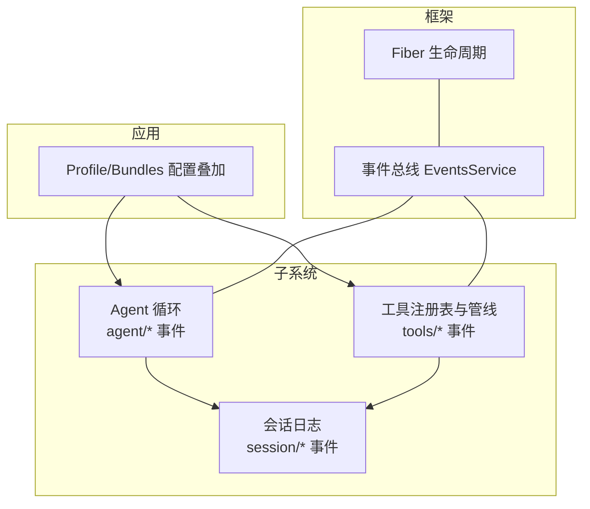
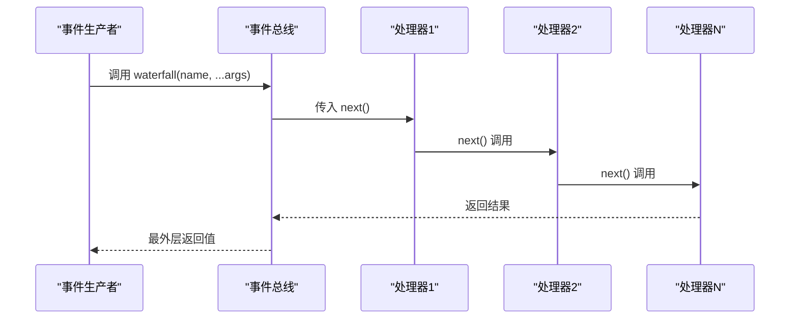
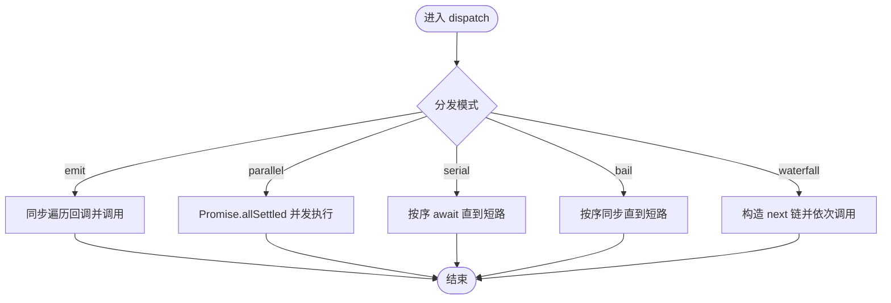
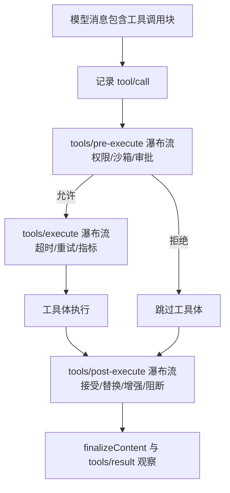
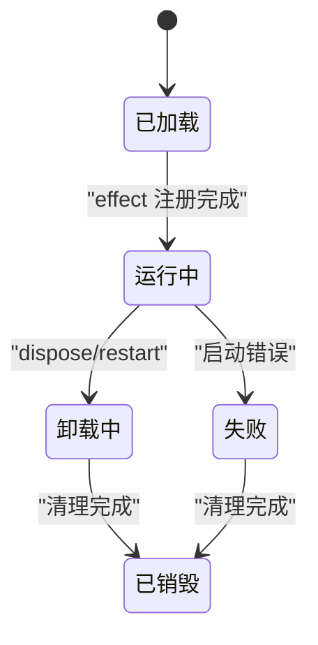
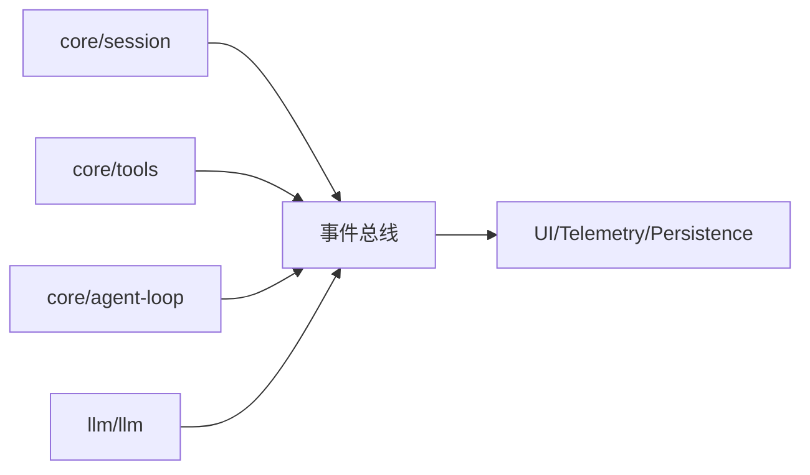

# 管道架构设计

<cite>
**本文引用的文件**
- [事件系统 API](file://vendor/cordis/src/events.ts)
- [工具执行管线文档](file://docs/tool-execution-pipeline.md)
- [事件生产者与消费者矩阵](file://docs/event-producer-consumer.md)
- [Cordis 架构总览](file://docs/architecture.md)
- [Fiber 生命周期 API](file://docs/cordis-api/fiber.md)
- [Agent 循环插件入口](file://packages/core/agent-loop/src/index.ts)
- [工具注册表与管线事件定义](file://packages/core/tools/src/index.ts)
</cite>

## 目录
1. [简介](#简介)
2. [项目结构](#项目结构)
3. [核心组件](#核心组件)
4. [架构总览](#架构总览)
5. [详细组件分析](#详细组件分析)
6. [依赖关系分析](#依赖关系分析)
7. [性能考量](#性能考量)
8. [故障排查指南](#故障排查指南)
9. [结论](#结论)
10. [附录](#附录)

## 简介
本文件系统化阐述 DeepSeek Harness 中的“事件管道”架构：以事件为扩展点，将多个处理步骤组织成可组合、可扩展的流水线；通过多种分发模式（同步广播、并行等待、串行短路、瀑布流）实现灵活的数据流转与策略编排。围绕事件生产者、消费者与处理器之间的关系，说明数据在管道中的流转过程、配置方式以及从创建到销毁的生命周期管理，并给出架构图与实际代码示例路径，帮助读者快速理解与使用。

## 项目结构
- 框架层：Cordis 提供上下文、事件总线、Fiber 生命周期等基础能力。
- 子系统层：会话、工具、代理循环、LLM 适配器等作为插件贡献服务与事件。
- 应用层：Web/Headless 等打包为 Profile/Bundles，按顺序叠加配置与行为。



图表来源
- [事件系统 API:131-353](file://vendor/cordis/src/events.ts#L131-L353)
- [工具注册表与管线事件定义:150-208](file://packages/core/tools/src/index.ts#L150-L208)
- [Agent 循环插件入口:1-200](file://packages/core/agent-loop/src/index.ts#L1-L200)
- [Fiber 生命周期 API:1-376](file://docs/cordis-api/fiber.md#L1-L376)

章节来源
- [Cordis 架构总览:9-37](file://docs/architecture.md#L9-L37)

## 核心组件
- 事件总线（EventsService）：提供 emit、parallel、serial、bail、waterfall 五种分发模式，支持监听器注册、作用域过滤、自动清理。
- 工具执行管线：以 tools/pre-execute → tools/execute → tools/post-execute 三段式 waterfall 串联钩子、策略、超时重试、结果改写与最终结果观察。
- Agent 循环：驱动 turn/step 流程，协调 agent/* 与 tools/* 事件，形成“请求-工具调用-响应”的主循环。
- Fiber 生命周期：以插件为单位管理配置、效果与清理，确保资源安全释放。

章节来源
- [事件系统 API:24-117](file://vendor/cordis/src/events.ts#L24-L117)
- [工具执行管线文档:1-63](file://docs/tool-execution-pipeline.md#L1-L63)
- [Agent 循环插件入口:32-90](file://packages/core/agent-loop/src/index.ts#L32-L90)
- [Fiber 生命周期 API:50-111](file://docs/cordis-api/fiber.md#L50-L111)

## 架构总览
事件管道由“事件总线 + 多阶段水渠”构成：
- 生产者：各子系统在关键时机发出事件（如工具调用开始、LLM 流式输出、会话变更）。
- 消费者：其他子系统通过 ctx.on/ctx.once 订阅事件，实现横切关注点（权限、审计、指标、UI 更新等）。
- 处理器：waterfall 模式将多个处理器串成链，每个处理器可选择调用 next() 继续或拦截终止。



图表来源
- [事件系统 API:224-243](file://vendor/cordis/src/events.ts#L224-L243)

章节来源
- [Cordis 架构总览:53-84](file://docs/architecture.md#L53-L84)

## 详细组件分析

### 事件总线与分发模式
- emit：同步广播，不等待异步结果，适合纯副作用通知。
- parallel：并发执行所有监听器，全部完成后聚合异常。
- serial：按序等待，遇到“短路值”即停止。
- bail：同步短路，首个非空/非 false/非 undefined 返回值即停止。
- waterfall：最后一个参数为 next()，监听器包裹后续链路，不调用 next() 即拦截。



图表来源
- [事件系统 API:165-243](file://vendor/cordis/src/events.ts#L165-L243)

章节来源
- [事件系统 API:24-117](file://vendor/cordis/src/events.ts#L24-L117)

### 工具执行管线（核心流水线）
工具调用贯穿三个 waterfall 阶段：
- tools/pre-execute：权限、沙箱、审批等前置策略。
- tools/execute：超时、重试、指标等 around 包装。
- tools/post-execute：结果改写、补充上下文、阻断等后置策略。
最终产出不可变的结果快照，并通过 tools/result 进行最终观察。



图表来源
- [工具执行管线文档:8-58](file://docs/tool-execution-pipeline.md#L8-L58)
- [工具注册表与管线事件定义:150-197](file://packages/core/tools/src/index.ts#L150-L197)

章节来源
- [工具执行管线文档:1-63](file://docs/tool-execution-pipeline.md#L1-L63)
- [工具注册表与管线事件定义:150-208](file://packages/core/tools/src/index.ts#L150-L208)

### Agent 循环与事件协作
Agent 循环驱动 turn/step，协调以下事件：
- agent/pre-step：决定模型可见输入，可重写或拒绝。
- agent/request → llm/stream → assistant/message：模型请求与流式响应。
- tool/call* → tools/pre-execute → tools/execute → tools/post-execute → tool/result*：工具调用全链路。
- agent/turn-stopping：串行停止信号。

```mermaid
sequenceDiagram
participant Loop as "Agent 循环"
participant Tools as "工具管线"
participant LLM as "LLM 适配器"
participant Session as "会话日志"
Loop->>Loop : 组装提示与工具 schema
Loop->>Loop : agent/pre-step(可重写/拒绝)
Loop->>LLM : agent/request
LLM-->>Loop : llm/stream -> assistant/message
Loop->>Tools : tool/call*
Tools-->>Loop : tools/result*
Loop->>Session : 写入持久化事件
```

图表来源
- [Cordis 架构总览:63-84](file://docs/architecture.md#L63-L84)
- [事件生产者与消费者矩阵:1-66](file://docs/event-producer-consumer.md#L1-L66)

章节来源
- [Cordis 架构总览:63-90](file://docs/architecture.md#L63-L90)
- [事件生产者与消费者矩阵:1-66](file://docs/event-producer-consumer.md#L1-L66)

### 配置与组合方式
- Profile/Bundles：按顺序叠加配置行，替换或插入新行，形成最终运行树。
- 补丁机制：通过 cordis.patch.yml 对已有行进行替换或插入，保持可插拔性。
- 运行时注入：通过 ctx.provide/ctx.plugin 挂载服务与事件监听器，随 Fiber 生命周期自动清理。

章节来源
- [Cordis 架构总览:15-37](file://docs/architecture.md#L15-L37)

### 生命周期管理（创建到销毁）
- Fiber 负责插件实例的生命周期：加载、配置验证、效果注册、卸载与清理。
- 事件监听器通过 ctx.on/ctx.once 注册在当前 Fiber 下，随 Fiber 卸载自动移除。
- Agent 循环工厂维护活跃 Agent 集合与启动任务，统一在 dispose 时中止与收尾。



图表来源
- [Fiber 生命周期 API:50-111](file://docs/cordis-api/fiber.md#L50-L111)
- [Agent 循环插件入口:32-90](file://packages/core/agent-loop/src/index.ts#L32-L90)

章节来源
- [Fiber 生命周期 API:50-111](file://docs/cordis-api/fiber.md#L50-L111)
- [Agent 循环插件入口:32-90](file://packages/core/agent-loop/src/index.ts#L32-L90)

## 依赖关系分析
- 松耦合：子系统通过事件解耦，无需直接导入彼此实现。
- 明确边界：工具管线将策略、执行、结果处理分层，便于独立替换与测试。
- 可观测性：internal/dispatch 暴露事件总线诊断，便于追踪与调试。



图表来源
- [事件系统 API:321-353](file://vendor/cordis/src/events.ts#L321-L353)
- [事件生产者与消费者矩阵:1-66](file://docs/event-producer-consumer.md#L1-L66)

章节来源
- [事件生产者与消费者矩阵:1-66](file://docs/event-producer-consumer.md#L1-L66)

## 性能考量
- 选择合适分发模式：高频通知优先 emit；需要并发且容错的场景用 parallel；需要有序短路的场景用 serial/bail；需要链式控制的场景用 waterfall。
- 避免长耗时监听器阻塞：在 waterfall 中尽快委托 next()，将重工作放入异步任务。
- 控制并发度：通过 Agent 循环配置限制最大并行工具调用数，防止资源争用。
- 结果快照与不可变数据：减少拷贝与锁竞争，提升回放与序列化效率。

[本节为通用指导，不直接分析具体文件]

## 故障排查指南
- 事件未触发：检查是否在同一 Fiber 内注册监听器；确认名称与类型匹配；查看 internal/dispatch 诊断。
- 监听器未清理：确认通过 ctx.on/ctx.once 注册，而非手动维护；确保 Fiber 正常卸载。
- 工具调用被拒绝：审查 tools/pre-execute 阶段的权限/审批策略；检查 monotonic guards 与 ctx.approval。
- 超时/重试问题：确认 tools/execute 包装器是否正确设置 signal 与预算；工具体需遵循协作取消契约。
- 结果不一致：检查 tools/post-execute 是否替换了内容；确认 finalizeContent 与 tools/result 的最终一致性。

章节来源
- [事件系统 API:165-243](file://vendor/cordis/src/events.ts#L165-L243)
- [工具执行管线文档:1-63](file://docs/tool-execution-pipeline.md#L1-L63)

## 结论
事件管道以 Cordis 事件总线为核心，结合工具执行管线的三段式 waterfall，实现了高内聚、低耦合的可组合流水线。通过多种分发模式与严格的生命周期管理，系统在保证可扩展性的同时，提供了清晰的职责边界与强大的可观测性。按照本文的设计原则与实践建议，可在不侵入主循环的前提下，灵活地扩展与定制系统行为。

## 附录
- 实际用法参考路径
  - 事件分发模式与监听器注册：[事件系统 API:24-117](file://vendor/cordis/src/events.ts#L24-L117)
  - 工具管线事件声明与语义：[工具注册表与管线事件定义:150-208](file://packages/core/tools/src/index.ts#L150-L208)
  - 工具执行全流程图与说明：[工具执行管线文档:8-58](file://docs/tool-execution-pipeline.md#L8-L58)
  - Agent 循环与事件协作序列：[Cordis 架构总览:63-84](file://docs/architecture.md#L63-L84)
  - Fiber 生命周期与清理：[Fiber 生命周期 API:50-111](file://docs/cordis-api/fiber.md#L50-L111)
  - 事件生产者与消费者矩阵：[事件生产者与消费者矩阵:1-66](file://docs/event-producer-consumer.md#L1-L66)