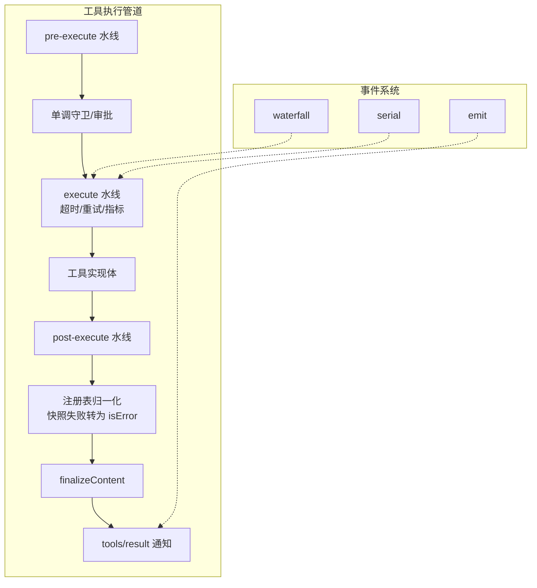
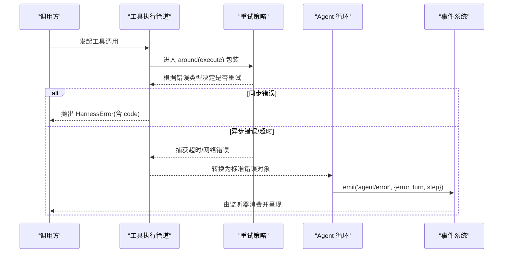
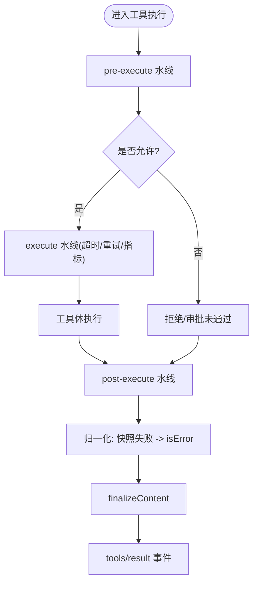
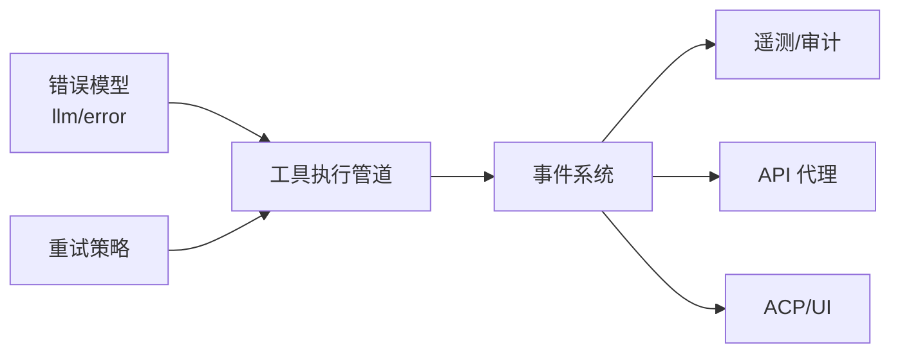

# 错误处理与传播

<cite>
**本文引用的文件**
- [packages/core/agent/src/runtime-types.ts](file://packages/core/agent/src/runtime-types.ts)
- [packages/llm/llm/src/error.ts](file://packages/llm/llm/src/error.ts)
- [packages/llm/llm/src/retry-policy.ts](file://packages/llm/llm/src/retry-policy.ts)
- [docs/tool-execution-pipeline.md](file://docs/tool-execution-pipeline.md)
- [docs/event-producer-consumer.md](file://docs/event-producer-consumer.md)
</cite>

## 目录
1. [简介](#简介)
2. [项目结构](#项目结构)
3. [核心组件](#核心组件)
4. [架构总览](#架构总览)
5. [详细组件分析](#详细组件分析)
6. [依赖关系分析](#依赖关系分析)
7. [性能考量](#性能考量)
8. [故障排查指南](#故障排查指南)
9. [结论](#结论)
10. [附录](#附录)

## 简介
本文件聚焦事件管道中的错误处理机制，系统性说明错误在管道中的传播路径、如何确保错误正确传递到相应处理器；解释同步错误、异步错误与超时错误的处理策略；阐述错误恢复（降级与重试）机制；并给出错误日志记录与监控集成的实践建议。文末提供可落地的构建健壮管道错误处理方案的思路与代码片段路径指引。

## 项目结构
围绕“工具执行管道”和“事件生产者/消费者矩阵”，错误在以下关键位置被捕获、转换与上报：
- 工具执行水线（pre-execute / execute / post-execute）负责拦截异常、包装为统一结果或继续向下游传播。
- 会话层通过 emit/waterfall/serial 等模式分发事件，包括 agent/error、tools/result 等。
- LLM 层提供统一的错误基类与错误分类能力，便于上层按 code 路由与重试。



图表来源
- [docs/tool-execution-pipeline.md:8-58](file://docs/tool-execution-pipeline.md#L8-L58)

章节来源
- [docs/tool-execution-pipeline.md:1-63](file://docs/tool-execution-pipeline.md#L1-L63)

## 核心组件
- 统一错误基类与错误链渲染：提供稳定的机器可读 code、cause 链与聚合错误渲染，便于跨边界诊断与路由。
- 工具执行管道：以水线方式组织 pre/post/around 钩子，集中处理超时、重试、指标与结果归一化。
- 事件矩阵：明确各事件的发射者、监听者与模式（emit/waterfall/serial），用于错误事件（如 agent/error）的定向传播。

章节来源
- [packages/llm/llm/src/error.ts:1-164](file://packages/llm/llm/src/error.ts#L1-L164)
- [docs/tool-execution-pipeline.md:1-63](file://docs/tool-execution-pipeline.md#L1-L63)
- [docs/event-producer-consumer.md:1-77](file://docs/event-producer-consumer.md#L1-L77)

## 架构总览
下图展示错误从工具执行到事件上报的关键路径，以及重试策略的介入点。



图表来源
- [docs/tool-execution-pipeline.md:8-58](file://docs/tool-execution-pipeline.md#L8-L58)
- [packages/core/agent/src/runtime-types.ts:280-293](file://packages/core/agent/src/runtime-types.ts#L280-L293)

## 详细组件分析

### 统一错误模型与错误链
- 设计要点
  - 所有 Harness 错误继承统一基类，携带稳定 code 与 cause 链，避免基于 message 解析。
  - 提供 errorChain 将 Error 链与 AggregateError 成员安全渲染，屏蔽不可渲染值，防止二次抛错。
  - 提供 isHarnessError 用于运行时边界收窄类型。
- 复杂度与影响
  - 错误链渲染为 O(n)，n 为 cause 链长度；对诊断输出友好且开销可控。
- 使用建议
  - 在管道中捕获未知错误时，优先包装为 HarnessError 并设置稳定 code，保留原始 cause。
  - 对外暴露的诊断信息仅使用 errorChain 渲染，不直接透传内部对象。

章节来源
- [packages/llm/llm/src/error.ts:1-164](file://packages/llm/llm/src/error.ts#L1-L164)

### 工具执行管道的错误传播
- 传播路径
  - pre-execute：权限/沙箱/钩子阶段抛错会被归一化为 isError 结果，跳过工具体执行。
  - execute（around）：超时、重试、指标在此处包裹实际工具体；若包装器抛错，同样归一化。
  - post-execute：结果后处理抛错亦会归一化。
  - finalizeContent：定义级最终内容校验，保证同步不变式。
  - tools/result：冻结的最终结果事件，供下游观察。
- 关键点
  - 任何阶段的 throw 都会被“注册表归一化”为 isError，从而保证下游只看到一致的结果形态。
  - 工具体产生的副作用（如 fs/* 事件）在工具体内完成，不影响错误传播主路径。



图表来源
- [docs/tool-execution-pipeline.md:8-58](file://docs/tool-execution-pipeline.md#L8-L58)

章节来源
- [docs/tool-execution-pipeline.md:1-63](file://docs/tool-execution-pipeline.md#L1-L63)

### 错误事件上报与监听
- 事件类型
  - agent/error：当步骤或轮次出错时，即使无精确 in-turn 位置也会持久化上报，包含 agent、turn、step、error 字段。
- 传播模式
  - 通过事件系统的 emit 模式广播，scope 过滤确保仅目标 agent 的监听器收到。
- 监听者
  - 典型监听者包括 ACP、apiproxy、goal-round-driver、session-telemetry 等，分别承担 UI 提示、API 响应、流程控制与遥测记录职责。

```mermaid
sequenceDiagram
participant Loop as "Agent 循环"
participant Emitter as "事件发射器"
participant Telemetry as "遥测监听器"
participant API as "API 代理"
participant UI as "ACP/UI"
Loop->>Emitter : emit('agent/error', payload)
Emitter-->>Telemetry : 记录错误指标/轨迹
Emitter-->>API : 返回错误状态/消息
Emitter-->>UI : 展示用户可见的错误提示
```

图表来源
- [docs/event-producer-consumer.md:1-77](file://docs/event-producer-consumer.md#L1-L77)
- [packages/core/agent/src/runtime-types.ts:280-293](file://packages/core/agent/src/runtime-types.ts#L280-L293)

章节来源
- [docs/event-producer-consumer.md:1-77](file://docs/event-producer-consumer.md#L1-L77)
- [packages/core/agent/src/runtime-types.ts:280-293](file://packages/core/agent/src/runtime-types.ts#L280-L293)

### 重试策略与错误恢复
- 适用场景
  - 针对可重试错误（如瞬时网络错误、限流）进行指数退避重试；对不可重试错误（如配额耗尽、上下文窗口超限）立即失败。
- 集成点
  - 在 execute 水线的 around 包装中接入重试策略，统一捕获并分类错误，依据 code 决定重试次数与间隔。
- 降级策略
  - 当重试耗尽或遇到不可重试错误时，返回标准化 isError 结果，并通过 tools/result 与 agent/error 事件通知上游。
- 参考实现
  - 重试策略定义位于 llm 包，可按需扩展至其他可重试子系统。

章节来源
- [packages/llm/llm/src/retry-policy.ts](file://packages/llm/llm/src/retry-policy.ts)

### 同步错误、异步错误与超时错误
- 同步错误
  - 在 pre/post 或工具体同步抛错，经归一化后作为 isError 结果返回，随后触发 tools/result 与可能的 agent/error。
- 异步错误
  - Promise 拒绝或回调错误在 around 中被捕获，转换为标准错误对象后继续传播。
- 超时错误
  - 由 execute 水线的超时包装器检测并抛出，归类为特定 code，交由重试策略判断是否重试。

章节来源
- [docs/tool-execution-pipeline.md:1-63](file://docs/tool-execution-pipeline.md#L1-L63)

## 依赖关系分析
- 低耦合高内聚
  - 错误模型集中在 llm/error，工具管道与事件系统仅依赖稳定 code 与事件契约，降低耦合。
- 事件驱动的错误传播
  - 通过 emit/waterfall/serial 三种模式解耦生产与消费，错误事件可被多订阅者并行消费。
- 外部依赖
  - 重试策略可能依赖时间源与配置；错误链渲染依赖标准 Error.cause 与 AggregateError。



图表来源
- [packages/llm/llm/src/error.ts:1-164](file://packages/llm/llm/src/error.ts#L1-L164)
- [docs/tool-execution-pipeline.md:1-63](file://docs/tool-execution-pipeline.md#L1-L63)
- [docs/event-producer-consumer.md:1-77](file://docs/event-producer-consumer.md#L1-L77)

章节来源
- [packages/llm/llm/src/error.ts:1-164](file://packages/llm/llm/src/error.ts#L1-L164)
- [docs/tool-execution-pipeline.md:1-63](file://docs/tool-execution-pipeline.md#L1-L63)
- [docs/event-producer-consumer.md:1-77](file://docs/event-producer-consumer.md#L1-L77)

## 性能考量
- 错误链渲染应避免深递归导致的栈溢出，当前实现通过 Set 追踪路径并安全降级不可渲染值。
- 重试策略应限制最大重试次数与总耗时，避免雪崩；结合速率限制与熔断策略更佳。
- 事件监听器应保持轻量，避免在错误路径中进行昂贵 I/O 或阻塞操作。

[本节为通用指导，无需具体文件引用]

## 故障排查指南
- 定位错误源头
  - 查看 tools/result 与 agent/error 事件负载，确认错误发生阶段（pre/around/post）。
  - 使用 errorChain 打印完整错误链，关注 cause 与 AggregateError 成员。
- 区分错误类型
  - 依据 HarnessError.code 进行路由：如 CONTEXT_WINDOW_EXCEEDED、QUOTA、EMPTY_RESPONSE 等。
- 常见症状与对策
  - 频繁重试：检查是否为瞬态错误；必要时调整退避策略或增加熔断。
  - 无输出：EMPTY_RESPONSE 通常可安全重试；若持续出现，检查输入长度与上下文窗口。
  - 配额耗尽：属于不可重试错误，应提示用户或走降级路径。

章节来源
- [packages/llm/llm/src/error.ts:1-164](file://packages/llm/llm/src/error.ts#L1-L164)
- [docs/event-producer-consumer.md:1-77](file://docs/event-producer-consumer.md#L1-L77)

## 结论
该工程通过统一错误模型、工具执行水线与事件系统，实现了错误在管道中的可靠传播与可观测性。借助重试策略与归一化结果，系统能在多种错误场景下优雅降级与恢复。建议在实际使用中：
- 始终使用稳定 code 进行错误路由，而非解析 message。
- 在 around 阶段集中处理超时与重试，保持工具体纯净。
- 通过 agent/error 与 tools/result 双通道上报，兼顾用户可见性与后端可观测性。

[本节为总结性内容，无需具体文件引用]

## 附录
- 构建健壮管道错误处理的实践清单
  - 自定义错误类型：继承统一基类，设置稳定 code，附带 cause。
  - 错误恢复策略：在 execute 水线接入重试与降级逻辑，区分可重试与不可重试错误。
  - 日志与监控：在 agent/error 监听器中记录结构化日志与指标，关联 turn/step 上下文。
  - 测试覆盖：针对同步/异步/超时三类错误编写用例，验证传播路径与恢复行为。
- 参考代码片段路径
  - 统一错误模型与错误链：[packages/llm/llm/src/error.ts:1-164](file://packages/llm/llm/src/error.ts#L1-L164)
  - 工具执行管道与错误归一化：[docs/tool-execution-pipeline.md:8-58](file://docs/tool-execution-pipeline.md#L8-L58)
  - 错误事件定义与上报：[packages/core/agent/src/runtime-types.ts:280-293](file://packages/core/agent/src/runtime-types.ts#L280-L293)
  - 重试策略实现：[packages/llm/llm/src/retry-policy.ts](file://packages/llm/llm/src/retry-policy.ts)