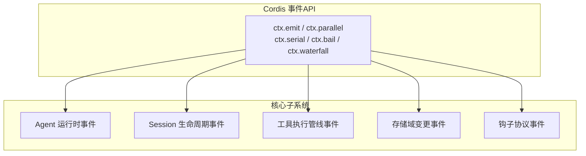
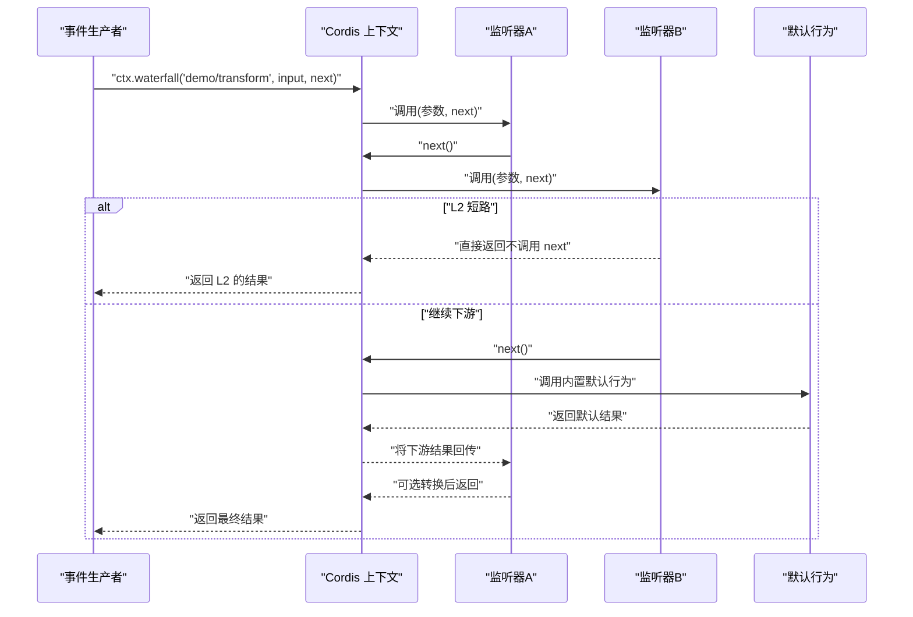
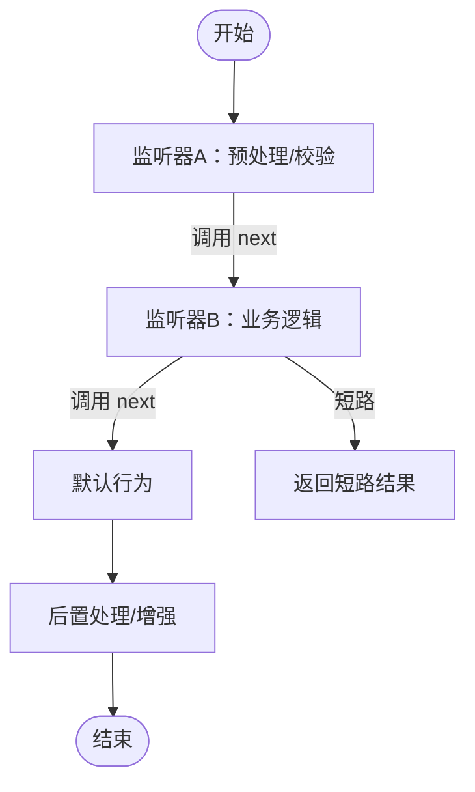
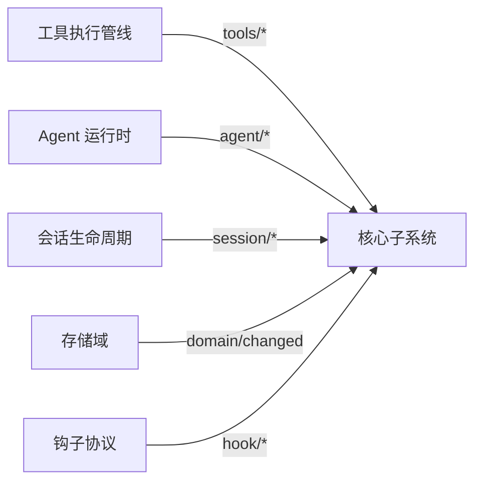

# 事件驱动架构

<cite>
**本文引用的文件**
- [events.md](file://docs/cordis-api/events.md)
- [04-events.md](file://docs/cordis-tutorial/04-events.md)
- [event-producer-consumer.md](file://docs/event-producer-consumer.md)
- [runtime-types.ts](file://packages/core/agent/src/runtime-types.ts)
- [index.ts（会话）](file://packages/core/session/src/index.ts)
- [index.ts（工具）](file://packages/core/tools/src/index.ts)
- [events.ts（存储域）](file://packages/storage/storage-domain/src/events.ts)
- [events.ts（钩子协议）](file://packages/hooks/hook-protocol/src/events.ts)
</cite>

## 目录
1. [简介](#简介)
2. [项目结构](#项目结构)
3. [核心组件](#核心组件)
4. [架构总览](#架构总览)
5. [详细组件分析](#详细组件分析)
6. [依赖关系分析](#依赖关系分析)
7. [性能考量](#性能考量)
8. [故障排查指南](#故障排查指南)
9. [结论](#结论)
10. [附录](#附录)

## 简介
本文件系统性阐述该仓库中的事件驱动架构：事件的声明、分发与处理机制；四种分发模式（emit、waterfall、parallel、serial，以及文档中出现的 bail）的适用场景与性能特征；基于 TypeScript 类型安全的事件系统如何通过模块声明合并定义事件类型；监听器的注册与注销、事件流管道与中间件模式；并提供发布订阅、异步事件与错误传播的实际示例。最后说明事件在插件通信中的作用以及如何通过事件实现模块解耦。

## 项目结构
事件系统贯穿多个子系统：
- 事件 API 与分发模式由 Cordis 上下文暴露，供各子系统使用。
- 各子系统通过“模块声明合并”在统一的 Events 接口上声明事件名称与监听器签名，从而获得完整的类型推导。
- 事件生产者与消费者矩阵展示了跨包的事件流转关系。

图表来源
- [events.md:8-123](file://docs/cordis-api/events.md#L8-L123)
- [runtime-types.ts:146-291](file://packages/core/agent/src/runtime-types.ts#L146-L291)
- [index.ts（会话）:42-86](file://packages/core/session/src/index.ts#L42-L86)
- [index.ts（工具）:142-208](file://packages/core/tools/src/index.ts#L142-L208)
- [events.ts（存储域）:36-47](file://packages/storage/storage-domain/src/events.ts#L36-L47)
- [events.ts（钩子协议）:1-105](file://packages/hooks/hook-protocol/src/events.ts#L1-L105)

章节来源
- [events.md:8-123](file://docs/cordis-api/events.md#L8-L123)
- [event-producer-consumer.md:8-66](file://docs/event-producer-consumer.md#L8-L66)

## 核心组件
- 事件声明：通过 declare module '@deepseek-ai/cordis' 对 interface Events 进行扩展，声明事件名与监听器签名，使 ctx.emit/ctx.on 等具备完整类型提示。
- 事件分发：
  - emit：同步广播，不等待返回值或 Promise。
  - parallel：并发运行所有监听器并统一等待。
  - serial：按序等待监听器，首个非空/非 false/非 undefined 返回值短路。
  - bail：同步版本的 serial。
  - waterfall：以 next() 为延续的管道式中间件模式，支持拦截、转换与短路。
- 监听器管理：ctx.on/ctx.once 返回处置函数，随插件效果自动注销，无需手动 removeListener。
- 作用域过滤：多数事件支持按 agent/session 等范围过滤，确保监听器仅接收相关事件。

章节来源
- [events.md:8-187](file://docs/cordis-api/events.md#L8-L187)
- [04-events.md:7-93](file://docs/cordis-tutorial/04-events.md#L7-L93)

## 架构总览
下图展示典型事件流：生产者通过 ctx.* 分发事件，框架根据事件模式调度监听器；waterfall 模式形成可组合的中间件链，允许拦截、转换或短路。

图表来源
- [04-events.md:94-140](file://docs/cordis-tutorial/04-events.md#L94-L140)
- [events.md:97-123](file://docs/cordis-api/events.md#L97-L123)

## 详细组件分析

### 事件声明与类型安全（模块声明合并）
- 通过在各自模块中对 @deepseek-ai/cordis 的 Events 接口进行扩展，集中声明事件名与监听器签名。
- 类型推导保证 ctx.emit/ctx.on 的参数与返回值与声明一致，避免运行时错误。
- 示例：
  - Agent 运行时事件：在 runtime-types.ts 中声明 agent/* 系列事件，覆盖生命周期、扩展点与错误通知。
  - Session 事件：在 session/index.ts 中声明 session/created、session/disposed、session/event、session/flush。
  - 工具执行事件：在 tools/index.ts 中声明 tools/pre-execute、tools/execute、tools/post-execute、tools/result 等。
  - 存储域事件：在 storage-domain/events.ts 中声明 domain/changed。
  - 钩子协议事件：在 hook-protocol/events.ts 中定义 hook/invoked 与 hook/result 的持久化记录。

章节来源
- [runtime-types.ts:146-291](file://packages/core/agent/src/runtime-types.ts#L146-L291)
- [index.ts（会话）:42-86](file://packages/core/session/src/index.ts#L42-L86)
- [index.ts（工具）:142-208](file://packages/core/tools/src/index.ts#L142-L208)
- [events.ts（存储域）:36-47](file://packages/storage/storage-domain/src/events.ts#L36-L47)
- [events.ts（钩子协议）:1-105](file://packages/hooks/hook-protocol/src/events.ts#L1-L105)

### 分发模式与适用场景
- emit：适合“通知型”事件，如状态变更、日志上报，无返回值要求，开销最小。
- parallel：适合“并行副作用”，如持久化检查点、遥测上报，需等待全部完成。
- serial：适合“选择型”决策，如审批策略、重试策略，首个有效结果即停止。
- bail：serial 的同步版本，用于快速短路。
- waterfall：适合“中间件/管道”，如权限校验、请求配置替换、结果增强、短路与否决。

章节来源
- [events.md:8-123](file://docs/cordis-api/events.md#L8-L123)
- [04-events.md:80-93](file://docs/cordis-tutorial/04-events.md#L80-L93)

### 监听器注册与注销
- ctx.on(name, listener, options?)：注册监听器，options 支持 prepend 与 global。
- ctx.once(name, listener, options?)：一次性监听器，首次触发后自动注销。
- 返回处置函数，可在插件卸载时调用以移除监听器；由于 ctx.on 是 effect，通常随插件生命周期自动清理。

章节来源
- [events.md:125-187](file://docs/cordis-api/events.md#L125-L187)
- [04-events.md:78-79](file://docs/cordis-tutorial/04-events.md#L78-L79)

### 事件流管道与中间件模式（waterfall）
- 每个监听器接收参数与 next() 延续；调用 next() 进入下一个监听器或默认行为；不调用 next() 则短路。
- 典型用途：
  - 替换模型调用配置（agent/request）。
  - 审批策略（approval/request）。
  - 工具执行前后处理（tools/pre-execute、tools/execute、tools/post-execute）。
  - 文件系统写入意图与观察（fs/write-intent、fs/observed）。

图表来源
- [04-events.md:94-140](file://docs/cordis-tutorial/04-events.md#L94-L140)
- [events.md:97-123](file://docs/cordis-api/events.md#L97-L123)

### 实际使用示例（发布与订阅、异步与错误）
- 发布统计事件：服务在计数变化时通过 ctx.emit 发出 stats/report，订阅者打印或聚合。
- Waterfall 转换：监听器包裹下游结果，或在检测到敏感词时短路返回替代消息。
- 异步与错误：
  - parallel 会 await 所有监听器，任一失败会导致整体拒绝。
  - serial/bail 遇到首个有效返回值即停止后续监听器。
  - waterfall 中未调用 next() 会阻止默认行为，需遵循“只观察/标注的监听器必须调用 next()”的约定。

章节来源
- [04-events.md:7-79](file://docs/cordis-tutorial/04-events.md#L7-L79)
- [04-events.md:94-140](file://docs/cordis-tutorial/04-events.md#L94-L140)
- [events.md:8-123](file://docs/cordis-api/events.md#L8-L123)

### 事件系统在插件通信与解耦中的作用
- 插件之间无需直接引用，只需声明并订阅同一事件，即可实现松耦合协作。
- 通过作用域过滤，事件可按 agent/session 等维度定向投递，避免全局广播带来的噪声。
- 事件矩阵展示了跨包的生产者与消费者关系，便于理解系统内事件流向。

章节来源
- [event-producer-consumer.md:8-66](file://docs/event-producer-consumer.md#L8-L66)

## 依赖关系分析
下图展示关键子系统间的事件依赖与流向：

图表来源
- [index.ts（工具）:142-208](file://packages/core/tools/src/index.ts#L142-L208)
- [runtime-types.ts:146-291](file://packages/core/agent/src/runtime-types.ts#L146-L291)
- [index.ts（会话）:42-86](file://packages/core/session/src/index.ts#L42-L86)
- [events.ts（存储域）:36-47](file://packages/storage/storage-domain/src/events.ts#L36-L47)
- [events.ts（钩子协议）:1-105](file://packages/hooks/hook-protocol/src/events.ts#L1-L105)

章节来源
- [event-producer-consumer.md:8-66](file://docs/event-producer-consumer.md#L8-L66)

## 性能考量
- emit：开销最低，适合高频通知；但不会等待副作用完成，需注意竞态。
- parallel：并发执行，吞吐高；需考虑监听器间的资源竞争与错误聚合。
- serial：顺序执行，可控性强；若监听器较多或耗时较长，可能成为瓶颈。
- bail：同步短路，适合快速决策；注意短路条件设计以避免误判。
- waterfall：灵活但复杂度高；应尽量减少不必要的 next() 调用链深度，避免过度包装。

[本节为通用指导，不直接分析具体文件]

## 故障排查指南
- 监听器未触发：
  - 确认事件名与作用域是否匹配（如 agent/session 范围）。
  - 检查是否在插件生效期间注册了监听器。
- 事件未到达默认行为：
  - waterfall 中监听器忘记调用 next() 会导致短路；遵循“只观察/标注必须调用 next()”的规则。
- 异步错误传播：
  - parallel 中任一监听器拒绝会整体失败；定位具体监听器并添加错误隔离。
  - serial/bail 会在首个有效返回值后停止；检查短路条件是否正确。
- 性能问题：
  - 减少 waterfall 链长度与串行监听器数量。
  - 将可并行的副作用改为 parallel 模式。

章节来源
- [events.md:8-123](file://docs/cordis-api/events.md#L8-L123)
- [04-events.md:94-140](file://docs/cordis-tutorial/04-events.md#L94-L140)

## 结论
该事件驱动架构通过统一的声明与分发机制，实现了插件间的强类型、可组合、可扩展的通信方式。五种分发模式覆盖了通知、并行、顺序、短路与中间件等多种场景，配合作用域过滤与生命周期管理，既保证了灵活性，又兼顾了性能与可维护性。在实际工程中，应根据事件语义选择合适的分发模式，并遵循 waterfall 的契约，以实现稳健的模块解耦与清晰的职责边界。

[本节为总结，不直接分析具体文件]

## 附录
- 事件矩阵：参考 event-producer-consumer.md 中的表格，了解各事件的生产者与消费者分布。
- 教程与示例：参考 04-events.md 中的示例代码路径，快速上手事件声明、发布与订阅。

章节来源
- [event-producer-consumer.md:8-66](file://docs/event-producer-consumer.md#L8-L66)
- [04-events.md:7-79](file://docs/cordis-tutorial/04-events.md#L7-L79)