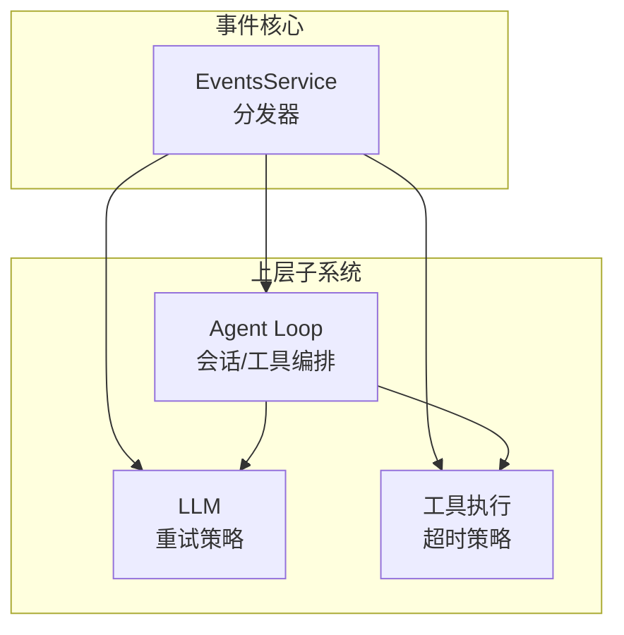
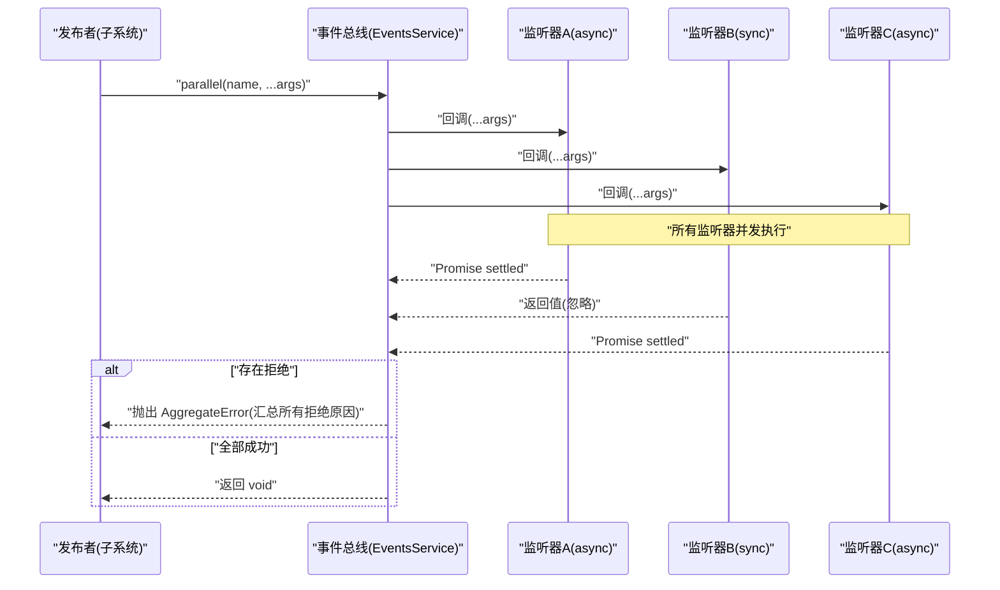
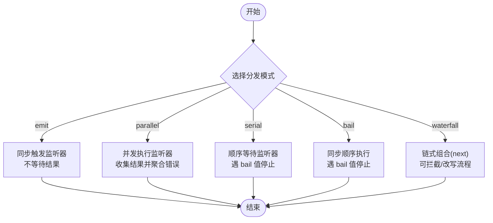
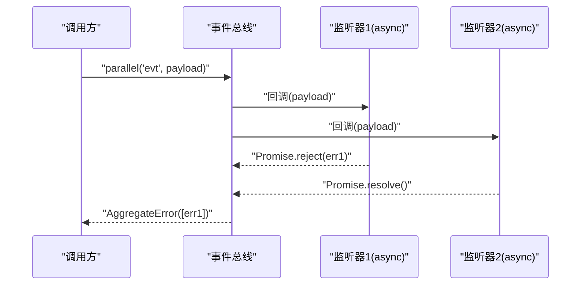
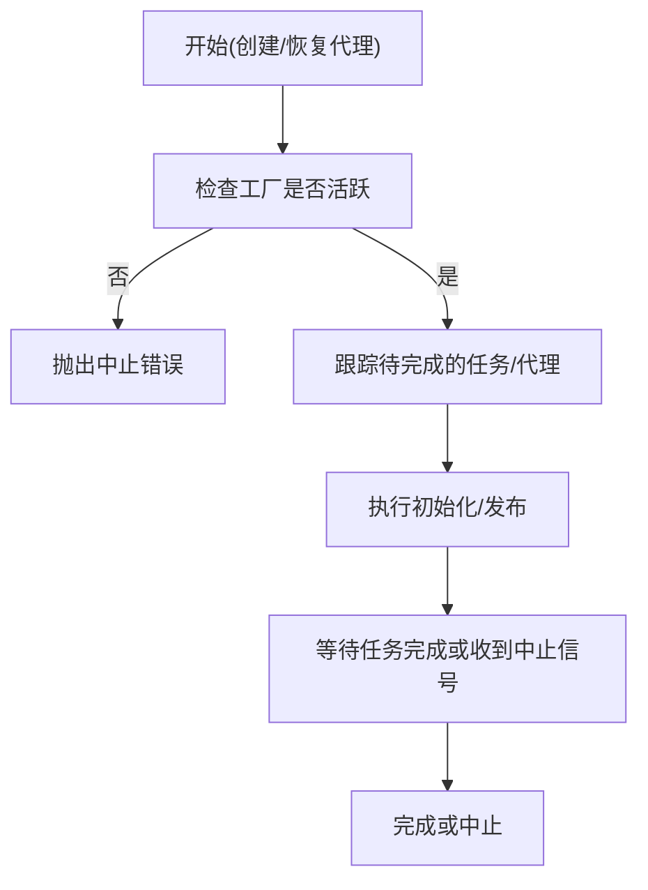
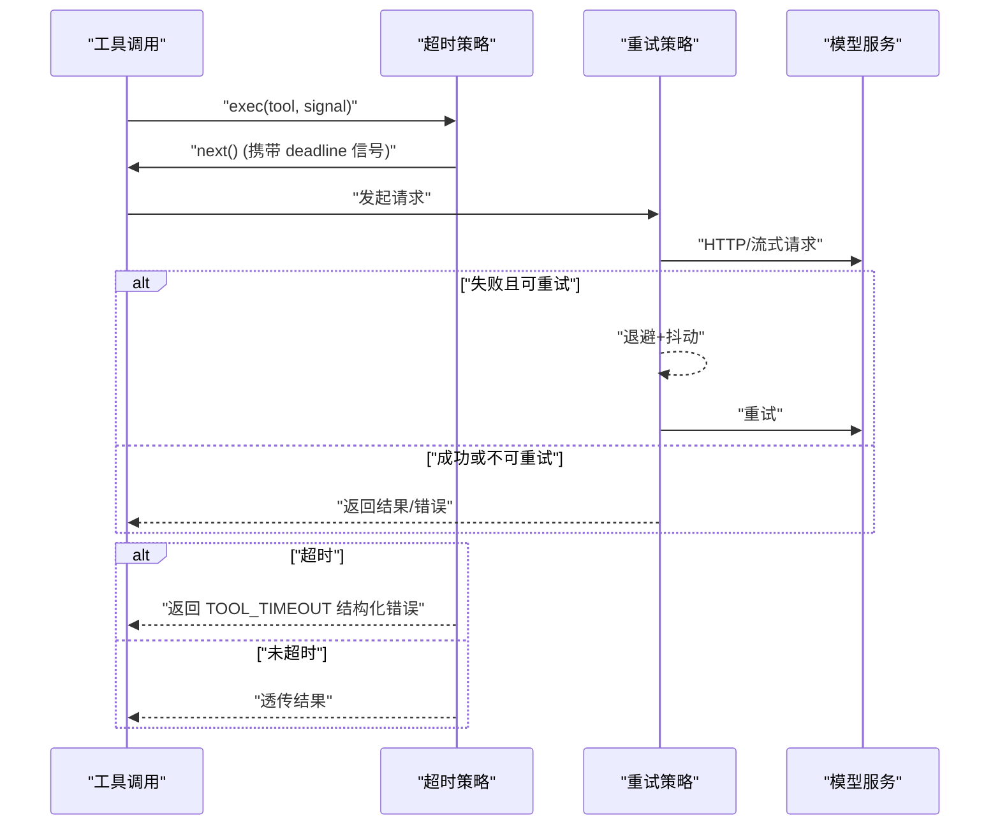
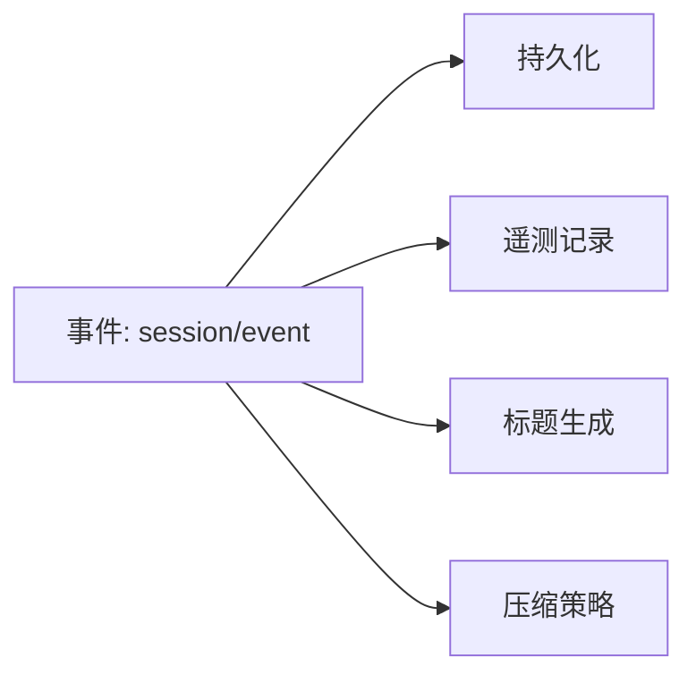
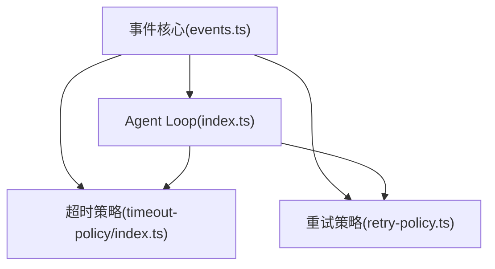

# 异步事件处理

<cite>
**本文引用的文件**
- [events.ts](file://vendor/cordis/src/events.ts)
- [events.md](file://docs/cordis-api/events.md)
- [event-producer-consumer.md](file://docs/event-producer-consumer.md)
- [index.ts](file://packages/core/agent-loop/src/index.ts)
- [retry-policy.ts](file://packages/llm/llm/src/retry-policy.ts)
- [index.ts](file://packages/guard/timeout-policy/src/index.ts)
</cite>

## 目录
1. [简介](#简介)
2. [项目结构](#项目结构)
3. [核心组件](#核心组件)
4. [架构总览](#架构总览)
5. [详细组件分析](#详细组件分析)
6. [依赖关系分析](#依赖关系分析)
7. [性能考量](#性能考量)
8. [故障排查指南](#故障排查指南)
9. [结论](#结论)
10. [附录](#附录)

## 简介
本文件围绕异步事件的处理机制与模式展开，聚焦于以下主题：
- Promise 与 async/await 在事件系统中的使用方式
- 异步事件流的正确处理方式
- 错误传播机制（如何在异步上下文中传递与捕获错误）
- 并发控制与限流（防止资源耗尽）
- 超时与重试（提升系统健壮性）
- 性能优化技巧（批处理、缓冲、背压）
- 复杂异步场景的实践示例（事件聚合、事件溯源、事件风暴）

该仓库通过 Cordis 的事件总线提供多种分发模式（同步 emit、并行 parallel、串行 serial、短路 bail、链式 waterfall），并在上层子系统（如 agent-loop、LLM、工具执行等）中组合使用这些模式，形成稳定、可观测、可扩展的异步事件驱动架构。

## 项目结构
- 事件总线核心位于 vendor/cordis/src/events.ts，提供 ctx.parallel、ctx.emit、ctx.serial、ctx.bail、ctx.waterfall、ctx.on、ctx.once 等 API，并内置内部事件用于拦截与诊断。
- 文档 docs/cordis-api/events.md 对事件 API 进行对外说明；docs/event-producer-consumer.md 给出各子系统间事件的声明、分发者与监听者矩阵。
- 上层业务通过事件串联关键流程：例如 agent-loop 在会话生命周期、工具调用、状态变更等节点发布事件；LLM 层提供重试策略；工具执行层提供超时策略。

图表来源
- [events.ts:131-319](file://vendor/cordis/src/events.ts#L131-L319)
- [index.ts:1-200](file://packages/core/agent-loop/src/index.ts#L1-L200)
- [retry-policy.ts:1-192](file://packages/llm/llm/src/retry-policy.ts#L1-L192)
- [index.ts:1-82](file://packages/guard/timeout-policy/src/index.ts#L1-L82)

章节来源
- [events.ts:1-353](file://vendor/cordis/src/events.ts#L1-L353)
- [events.md:1-208](file://docs/cordis-api/events.md#L1-L208)
- [event-producer-consumer.md:1-77](file://docs/event-producer-consumer.md#L1-L77)

## 核心组件
- 事件总线 EventsService：实现五种分发模式，统一注册/注销监听器，自动随 Fiber 生命周期管理监听器，支持上下文过滤与全局监听。
- Agent Loop：编排会话与工具调用，发布/订阅大量领域事件，协调启动、停止、取消与清理。
- LLM 重试策略：为模型请求提供有界或无界重试，带指数退避与抖动，按错误码分类决定是否重试。
- 工具超时策略：为工具调用设置超时截止时间，将超时映射为结构化错误码，避免悬挂任务与资源泄漏。

章节来源
- [events.ts:131-319](file://vendor/cordis/src/events.ts#L131-L319)
- [index.ts:1-200](file://packages/core/agent-loop/src/index.ts#L1-L200)
- [retry-policy.ts:1-192](file://packages/llm/llm/src/retry-policy.ts#L1-L192)
- [index.ts:1-82](file://packages/guard/timeout-policy/src/index.ts#L1-L82)

## 架构总览
下图展示了事件从发布者到监听者的完整链路，以及异步模式如何影响错误传播与资源占用。

图表来源
- [events.ts:183-187](file://vendor/cordis/src/events.ts#L183-L187)

章节来源
- [events.ts:131-319](file://vendor/cordis/src/events.ts#L131-L319)

## 详细组件分析

### 事件分发模式与异步语义
- emit：同步触发监听器，不等待返回的 Promise，适合“通知型”事件。
- parallel：并发执行所有监听器，收集结果；任一拒绝会汇总为 AggregateError 向上抛出。
- serial：顺序等待每个监听器，遇到“bail 值”即停止并返回。
- bail：同步顺序执行，遇到“bail 值”立即返回。
- waterfall：链式组合，最后一个参数是 next；监听器可选择调用 next 继续链或阻止后续执行。

图表来源
- [events.ts:183-243](file://vendor/cordis/src/events.ts#L183-L243)

章节来源
- [events.ts:183-243](file://vendor/cordis/src/events.ts#L183-L243)
- [events.md:8-123](file://docs/cordis-api/events.md#L8-L123)

### 错误传播机制
- parallel 模式下，所有监听器的拒绝会被收集并以 AggregateError 形式一次性抛出，便于调用方集中处理。
- serial/bail 模式通过“bail 值”短路，非 null/false/undefined 的值视为终止信号，可用于快速失败或提前返回。
- waterfall 模式允许监听器通过不调用 next 来“否决”后续行为，从而实现拦截与错误注入。

图表来源
- [events.ts:183-187](file://vendor/cordis/src/events.ts#L183-L187)

章节来源
- [events.ts:183-187](file://vendor/cordis/src/events.ts#L183-L187)

### 并发控制与限流
- Agent Loop 暴露 maxParallelToolCalls 配置项，限制同一时刻并发执行的工具调用数量，避免资源耗尽。
- 工厂级所有权对象维护活跃代理集合与启动任务集合，在卸载时统一中止与等待，确保有序清理。
- 通过 AbortController 与 raceAbort/raceAbortCall 封装，可在创建/恢复阶段安全取消长时间运行的初始化流程。

图表来源
- [index.ts:39-130](file://packages/core/agent-loop/src/index.ts#L39-L130)

章节来源
- [index.ts:39-130](file://packages/core/agent-loop/src/index.ts#L39-L130)

### 超时与重试
- 工具超时：通过 timeout-policy 插件在 tools/execute 钩子中为工具调用设置截止时间，若超时则返回结构化错误（TOOL_TIMEOUT），避免悬挂任务。
- LLM 重试：retry-policy 提供 normal 与 always 两种模式，支持指数退避与抖动，按错误码决定是否重试，默认包含空响应、速率限制、服务端错误、超时、传输错误等。

图表来源
- [index.ts:55-82](file://packages/guard/timeout-policy/src/index.ts#L55-L82)
- [retry-policy.ts:145-192](file://packages/llm/llm/src/retry-policy.ts#L145-L192)

章节来源
- [index.ts:55-82](file://packages/guard/timeout-policy/src/index.ts#L55-L82)
- [retry-policy.ts:145-192](file://packages/llm/llm/src/retry-policy.ts#L145-L192)

### 事件聚合、事件溯源与事件风暴模式
- 事件聚合：多个子系统监听同一事件并各自产出副作用（如持久化、遥测、标题生成），通过 parallel 模式保证并发与错误聚合。
- 事件溯源：session/event 等事件可作为不可变事实源，下游消费者基于事件重建状态或生成视图。
- 事件风暴：通过 waterfall 模式对工具执行、系统提示组装等关键路径进行横切增强（如检查点、权限、审计、节流）。

图表来源
- [event-producer-consumer.md:41-44](file://docs/event-producer-consumer.md#L41-L44)

章节来源
- [event-producer-consumer.md:1-77](file://docs/event-producer-consumer.md#L1-L77)

## 依赖关系分析
- 事件总线依赖 Context/Fiber 以管理监听器生命周期，并通过 internal/* 事件提供扩展点。
- Agent Loop 依赖事件总线发布/订阅领域事件，并与 LLM、工具执行等子系统协作。
- 超时与重试作为横切关注点，通过事件钩子（tools/execute、llm/stream 等）接入主流程。

图表来源
- [events.ts:131-319](file://vendor/cordis/src/events.ts#L131-L319)
- [index.ts:1-200](file://packages/core/agent-loop/src/index.ts#L1-L200)
- [index.ts:1-82](file://packages/guard/timeout-policy/src/index.ts#L1-L82)
- [retry-policy.ts:1-192](file://packages/llm/llm/src/retry-policy.ts#L1-L192)

章节来源
- [events.ts:131-319](file://vendor/cordis/src/events.ts#L131-L319)
- [index.ts:1-200](file://packages/core/agent-loop/src/index.ts#L1-L200)
- [index.ts:1-82](file://packages/guard/timeout-policy/src/index.ts#L1-L82)
- [retry-policy.ts:1-192](file://packages/llm/llm/src/retry-policy.ts#L1-L192)

## 性能考量
- 批处理：对高频事件（如日志、遥测）采用批量写入，减少 I/O 次数。
- 缓冲：在事件消费端引入有界队列，结合背压策略（满队阻塞或丢弃低优先级事件）保护上游。
- 背压：利用并发上限（如 maxParallelToolCalls）与超时/重试策略，避免过载导致雪崩。
- 选择合适分发模式：通知型用 emit，需聚合结果用 parallel，需顺序控制用 serial，需拦截用 waterfall。

[本节为通用指导，不直接分析具体文件]

## 故障排查指南
- 并行事件错误聚合：当 parallel 下多个监听器拒绝时，调用方会收到 AggregateError，需逐一检查原因。
- 工具超时：若出现 TOOL_TIMEOUT，检查工具是否正确使用 exec.signal，并评估超时阈值是否合理。
- 重试风暴：always 模式可能导致无限重试，应结合 backoff 与外部取消信号；normal 模式需确认 retryableCodes 覆盖真实错误码。
- 资源泄漏：确保 on/once 注册的监听器在 Fiber 卸载时被自动移除；必要时显式调用 disposer。

章节来源
- [events.ts:183-187](file://vendor/cordis/src/events.ts#L183-L187)
- [index.ts:55-82](file://packages/guard/timeout-policy/src/index.ts#L55-L82)
- [retry-policy.ts:145-192](file://packages/llm/llm/src/retry-policy.ts#L145-L192)

## 结论
该仓库通过统一的事件总线与丰富的分发模式，构建了高内聚、低耦合的异步事件驱动架构。结合并发控制、超时与重试策略，能够在复杂场景中保持系统的稳定性与可观测性。建议在实际开发中：
- 明确事件用途，选择合适的分发模式
- 为长耗时操作设置超时与取消
- 对高频事件实施批处理与背压
- 通过事件溯源与聚合提升可调试性与可恢复性

[本节为总结性内容，不直接分析具体文件]

## 附录
- 事件 API 参考：参见 events.md 中的方法签名与说明。
- 事件矩阵：参见 event-producer-consumer.md 中的生产者/监听者关系表。
- 实践建议：在 waterfall 中实现横切逻辑（如检查点、权限、审计），在 parallel 中实现副作用聚合（如持久化、遥测）。

章节来源
- [events.md:1-208](file://docs/cordis-api/events.md#L1-L208)
- [event-producer-consumer.md:1-77](file://docs/event-producer-consumer.md#L1-L77)