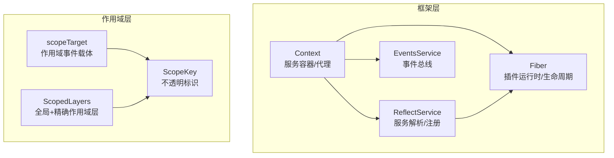
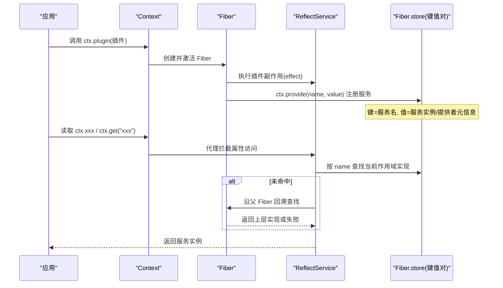
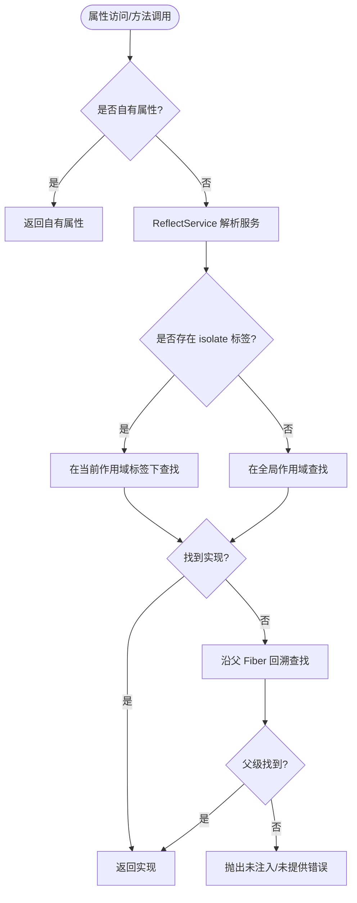
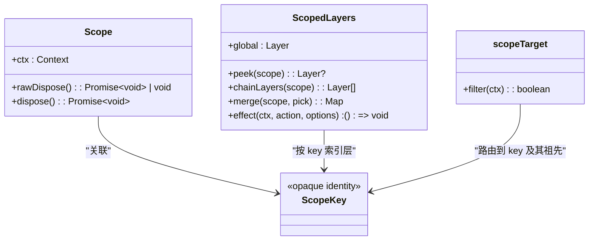
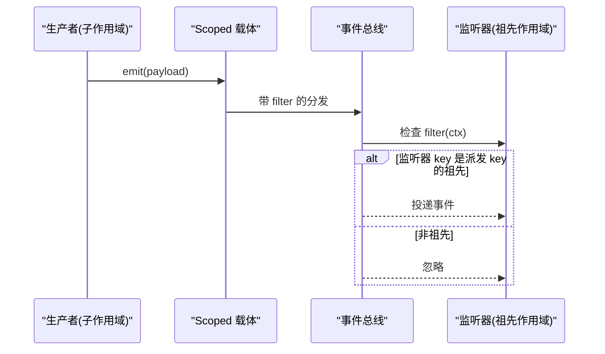
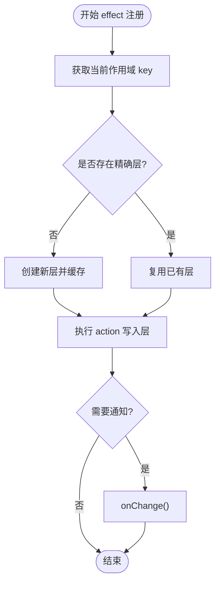
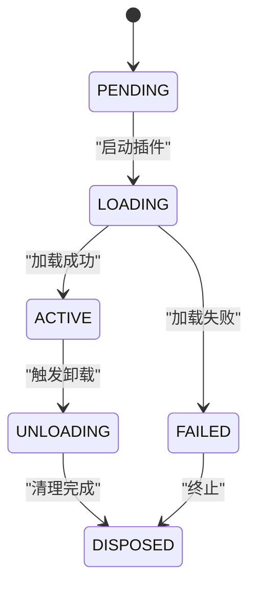
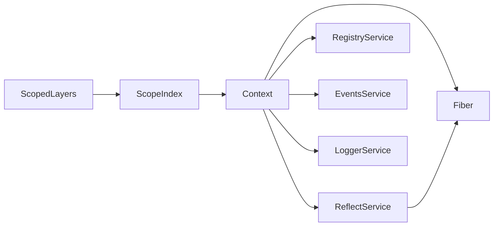

# 作用域与上下文

<cite>
**本文引用的文件**
- [vendor/cordis/src/context.ts](file://vendor/cordis/src/context.ts)
- [vendor/cordis/src/reflect.ts](file://vendor/cordis/src/reflect.ts)
- [vendor/cordis/src/fiber.ts](file://vendor/cordis/src/fiber.ts)
- [packages/core/scope/src/index.ts](file://packages/core/scope/src/index.ts)
- [packages/core/scope/src/store.ts](file://packages/core/scope/src/store.ts)
- [docs/cordis-api/context.md](file://docs/cordis-api/context.md)
- [docs/subsystems/scope.md](file://docs/subsystems/scope.md)
</cite>

## 目录
1. [简介](#简介)
2. [项目结构](#项目结构)
3. [核心组件](#核心组件)
4. [架构总览](#架构总览)
5. [详细组件分析](#详细组件分析)
6. [依赖关系分析](#依赖关系分析)
7. [性能考量](#性能考量)
8. [故障排查指南](#故障排查指南)
9. [结论](#结论)
10. [附录](#附录)

## 简介
本文件系统性解释 deepseek-harness 中“作用域（Scope）”和“上下文（Context）”的隔离机制，围绕以下目标展开：
- Context 作为服务仓库的设计理念：如何通过键值对管理服务实例、如何基于 Fiber 的生命周期进行注册与释放。
- Scope 的作用域隔离原理：如何实现细粒度的状态隔离与资源管理，包括作用域的嵌套、继承与生命周期。
- 事件路由与数据传递：如何在不同作用域间通过 Scoped 载体传递事件，实现松耦合通信。
- 服务发现中的上下文角色：如何通过 isolate/intercept/extend 等能力组合出可插拔、可替换的服务视图。

## 项目结构
与“作用域与上下文”直接相关的代码分布在两个层面：
- 框架层（vendor/cordis）：提供 Context、ReflectService、Fiber、事件总线等基础能力。
- 作用域层（packages/core/scope）：在 Context 之上提供 ScopeKey、Scoped 载体、作用域链与作用域注册层（ScopedLayers）。

图表来源
- [vendor/cordis/src/context.ts:16-84](file://vendor/cordis/src/context.ts#L16-L84)
- [vendor/cordis/src/reflect.ts:127-171](file://vendor/cordis/src/reflect.ts#L127-L171)
- [vendor/cordis/src/fiber.ts:178-200](file://vendor/cordis/src/fiber.ts#L178-L200)
- [packages/core/scope/src/index.ts:14-185](file://packages/core/scope/src/index.ts#L14-L185)
- [packages/core/scope/src/store.ts:152-268](file://packages/core/scope/src/store.ts#L152-L268)

章节来源
- [vendor/cordis/src/context.ts:16-147](file://vendor/cordis/src/context.ts#L16-L147)
- [vendor/cordis/src/reflect.ts:127-200](file://vendor/cordis/src/reflect.ts#L127-L200)
- [vendor/cordis/src/fiber.ts:178-200](file://vendor/cordis/src/fiber.ts#L178-L200)
- [packages/core/scope/src/index.ts:14-205](file://packages/core/scope/src/index.ts#L14-L205)
- [packages/core/scope/src/store.ts:152-268](file://packages/core/scope/src/store.ts#L152-L268)

## 核心组件
- Context：服务容器与代理入口，提供 extend/isolate/intercept 创建子上下文，并通过 reflect 暴露 get/set/provide/accessor/mixin 等能力。
- ReflectService：实现属性访问拦截、服务解析、注入校验、作用域标签查找（symbols.isolate）、拦截配置合并（symbols.intercept）。
- Fiber：插件运行时的生命周期载体，负责 effect 注册、清理顺序、错误诊断与惰性卸载。
- ScopeKey/Scoped：作用域标识与事件路由载体，支持父链遍历与“向上可见”的事件过滤。
- ScopedLayers：为每个注册表维护“全局层 + 精确作用域层”，支持链式合并与原子化 effect 注册。

章节来源
- [docs/cordis-api/context.md:1-163](file://docs/cordis-api/context.md#L1-L163)
- [vendor/cordis/src/context.ts:16-147](file://vendor/cordis/src/context.ts#L16-L147)
- [vendor/cordis/src/reflect.ts:127-200](file://vendor/cordis/src/reflect.ts#L127-L200)
- [vendor/cordis/src/fiber.ts:178-200](file://vendor/cordis/src/fiber.ts#L178-L200)
- [packages/core/scope/src/index.ts:14-205](file://packages/core/scope/src/index.ts#L14-L205)
- [packages/core/scope/src/store.ts:152-268](file://packages/core/scope/src/store.ts#L152-L268)

## 架构总览
下图展示 Context 作为服务仓库的核心流程：插件通过 ctx.plugin() 启动 Fiber；Fiber 内通过 ctx.provide() 将服务以“名称→值”的形式注册到当前作用域；读取时通过 ctx.get()/属性访问触发 ReflectService 的代理逻辑，按 isolate 标签与父链回溯解析具体实现。

图表来源
- [vendor/cordis/src/context.ts:70-84](file://vendor/cordis/src/context.ts#L70-L84)
- [vendor/cordis/src/reflect.ts:135-171](file://vendor/cordis/src/reflect.ts#L135-L171)
- [vendor/cordis/src/fiber.ts:178-200](file://vendor/cordis/src/fiber.ts#L178-L200)

章节来源
- [vendor/cordis/src/context.ts:70-147](file://vendor/cordis/src/context.ts#L70-L147)
- [vendor/cordis/src/reflect.ts:135-200](file://vendor/cordis/src/reflect.ts#L135-L200)
- [vendor/cordis/src/fiber.ts:178-200](file://vendor/cordis/src/fiber.ts#L178-L200)

## 详细组件分析

### Context 与服务仓库（键值对模型）
- 设计要点
  - Context 是代理对象：普通属性读取走服务解析器；extend/isolate/intercept 创建子上下文而不修改父上下文。
  - 服务以“名称→值”的键值对形式存在，由 Fiber 拥有其生命周期；provide 返回的 disposer 可在卸载时自动注销。
  - isolate 为特定服务名建立独立作用域标签，使同名服务在不同作用域下可分别提供不同实现。
  - intercept 为特定服务附加拦截配置，供下游插件合并使用。
- 关键行为
  - ctx.extend(meta)：原型继承 + 自身属性覆盖，用于携带额外元数据（如作用域标记）。
  - ctx.isolate(name, label?)：为指定服务名创建新的作用域标签，子上下文对该服务的读写在该标签下解析。
  - ctx.intercept(name, config)：为指定服务追加拦截配置，子上下文生效。
  - ctx.get/set/provide/accessor/mixin：反射层提供的服务存取与扩展能力。

图表来源
- [vendor/cordis/src/reflect.ts:135-171](file://vendor/cordis/src/reflect.ts#L135-L171)
- [vendor/cordis/src/context.ts:109-145](file://vendor/cordis/src/context.ts#L109-L145)

章节来源
- [docs/cordis-api/context.md:14-163](file://docs/cordis-api/context.md#L14-L163)
- [vendor/cordis/src/context.ts:70-147](file://vendor/cordis/src/context.ts#L70-L147)
- [vendor/cordis/src/reflect.ts:135-200](file://vendor/cordis/src/reflect.ts#L135-L200)

### Scope 作用域隔离与嵌套继承
- 设计要点
  - ScopeKey：不透明的身份标识，仅做相等性比较，不关心对象内容。
  - 作用域链：通过 WeakMap 维护 key→parent 的父子关系，支持从子到根的链式遍历。
  - 事件路由：scopeTarget(base, key) 生成 Scoped 载体，监听器若绑定到祖先 key，则可接收后代 key 的事件（“向上可见”），但不会向下泄露。
  - 注册层：ScopedLayers 维护“全局层 + 精确作用域层”，读取时按“远祖→近祖→自身”的顺序合并，近者优先。
- 生命周期
  - createScope(ctx, key, options)：在给定上下文中创建一个作用域，内部启动一个 Fiber 作为作用域的所有者；dispose 会等待该 Fiber 完成清理。
  - bindScopeParent/rebind：安全地绑定/重绑父子关系，防止环状引用。

图表来源
- [packages/core/scope/src/index.ts:104-185](file://packages/core/scope/src/index.ts#L104-L185)
- [packages/core/scope/src/store.ts:152-268](file://packages/core/scope/src/store.ts#L152-L268)

章节来源
- [docs/subsystems/scope.md:1-60](file://docs/subsystems/scope.md#L1-L60)
- [packages/core/scope/src/index.ts:14-205](file://packages/core/scope/src/index.ts#L14-L205)
- [packages/core/scope/src/store.ts:152-268](file://packages/core/scope/src/store.ts#L152-L268)

### 事件路由与跨作用域通信
- 通过 scopeTarget 包装事件的 subject，并在 filter 中判断当前上下文的作用域是否在“被分发 key 的祖先链”上。
- 无 key 的监听器仍可在全局范围内收到事件；有 key 的监听器仅在其 key 或其祖先 key 订阅时才收到。
- 这实现了“子作用域广播，祖先作用域观察”的松耦合通信模式。

图表来源
- [packages/core/scope/src/index.ts:158-185](file://packages/core/scope/src/index.ts#L158-L185)

章节来源
- [packages/core/scope/src/index.ts:158-185](file://packages/core/scope/src/index.ts#L158-L185)

### 作用域注册层（ScopedLayers）与原子更新
- 全局层：始终存在，承载默认/共享的注册项。
- 精确作用域层：按需创建，保存某作用域对注册的覆盖。
- 合并策略：读取时先取全局层，再按“远祖→近祖”叠加，最后覆盖同名项，确保最近作用域优先级最高。
- 原子 effect：effect(ctx, action, options) 将变更绑定到当前 Fiber 的生命周期，出错时回滚并清理空层；完成后通知观察者。

图表来源
- [packages/core/scope/src/store.ts:226-268](file://packages/core/scope/src/store.ts#L226-L268)

章节来源
- [packages/core/scope/src/store.ts:152-268](file://packages/core/scope/src/store.ts#L152-L268)

### 生命周期管理与资源释放
- Fiber 状态机：PENDING → LOADING → ACTIVE → UNLOADING → DISPOSED；异常进入 FAILED。
- effect/disposer：按注册逆序执行清理；异步清理通过 inertia 聚合，避免重复清理。
- Scope.dispose：等待所属 Fiber 完成清理，保证作用域内所有资源释放。

图表来源
- [vendor/cordis/src/fiber.ts:147-154](file://vendor/cordis/src/fiber.ts#L147-L154)
- [vendor/cordis/src/fiber.ts:114-137](file://vendor/cordis/src/fiber.ts#L114-L137)

章节来源
- [vendor/cordis/src/fiber.ts:114-154](file://vendor/cordis/src/fiber.ts#L114-L154)

## 依赖关系分析
- Context 依赖 ReflectService、RegistryService、EventsService、LoggerService，并通过 Fiber 驱动插件生命周期。
- ReflectService 依赖 Fiber 的 store/inject 以及 symbols.isolate/symbols.intercept 的作用域与拦截映射。
- Scope 层依赖 Context 的 extend 能力来注入 kScope 标记，并通过 scopeChainOf 构建作用域链。
- ScopedLayers 依赖 scopeOf/scopeChainOf 决定层归属与合并顺序。

图表来源
- [vendor/cordis/src/context.ts:70-84](file://vendor/cordis/src/context.ts#L70-L84)
- [vendor/cordis/src/reflect.ts:127-171](file://vendor/cordis/src/reflect.ts#L127-L171)
- [packages/core/scope/src/index.ts:137-156](file://packages/core/scope/src/index.ts#L137-L156)
- [packages/core/scope/src/store.ts:152-200](file://packages/core/scope/src/store.ts#L152-L200)

章节来源
- [vendor/cordis/src/context.ts:70-147](file://vendor/cordis/src/context.ts#L70-L147)
- [vendor/cordis/src/reflect.ts:127-200](file://vendor/cordis/src/reflect.ts#L127-L200)
- [packages/core/scope/src/index.ts:137-185](file://packages/core/scope/src/index.ts#L137-L185)
- [packages/core/scope/src/store.ts:152-268](file://packages/core/scope/src/store.ts#L152-L268)

## 性能考量
- 作用域链遍历：事件过滤与注册合并均可能遍历祖先链，应控制作用域深度与事件频率。
- 层合并成本：ScopedLayers.merge 会复制全局层并叠加作用域层，适合读多写少场景；高频变更建议批量合并。
- 代理开销：ReflectService 的属性拦截在热路径上，应避免过度频繁的属性访问；必要时缓存解析结果。
- 异步清理：Fiber 的 inertia 聚合多次清理，避免重复工作；注意 dispose 的 await 语义。

[本节为通用指导，无需特定文件来源]

## 故障排查指南
- “无法注入所需服务”：当在 inactive context 或 required inject 未满足时抛出；检查 ctx.inject 声明与 provide 时机。
- “无法设置未提供的服务”：set 仅允许修改已 provide 的值；确认提供方 Fiber 是否活跃。
- “重复提供同一服务名”：在同一作用域内重复 provide 会抛错；检查 isolate 标签是否误用或作用域划分不当。
- “作用域父链循环”：bindScopeParent/rebind 会检测环状引用并拒绝；检查作用域绑定逻辑。
- “事件未到达预期监听器”：确认监听器的 key 是否为派发 key 的祖先；scopeTarget 的 filter 仅允许“向上可见”。

章节来源
- [vendor/cordis/src/reflect.ts:135-171](file://vendor/cordis/src/reflect.ts#L135-L171)
- [packages/core/scope/src/index.ts:54-82](file://packages/core/scope/src/index.ts#L54-L82)
- [packages/core/scope/src/index.ts:158-185](file://packages/core/scope/src/index.ts#L158-L185)

## 结论
- Context 作为服务仓库，通过“名称→值”的键值对与 Fiber 生命周期，提供了强一致的服务注册与发现机制。
- Scope 在不侵入业务代码的前提下，提供了细粒度的作用域隔离、事件路由与层级合并能力，支撑了复杂系统的解耦与可测试性。
- 结合 isolate/intercept/extend 与 ScopedLayers，可以在不同粒度上定制服务视图与配置，实现松耦合的组件通信与资源管理。

[本节为总结性内容，无需特定文件来源]

## 附录
- 实践建议
  - 使用 ctx.isolate 为易冲突的服务（如数据库连接、HTTP 客户端）建立独立作用域，便于并行与测试替换。
  - 使用 ctx.intercept 为特定服务注入拦截配置，避免硬编码分支。
  - 使用 scopeTarget 包装事件主体，配合作用域链实现“子作用域广播、祖先作用域观察”的通信模式。
  - 使用 ScopedLayers.effect 将注册变更绑定到 Fiber 生命周期，保证原子性与可回滚。
- 参考路径
  - 上下文 API 文档：[docs/cordis-api/context.md](file://docs/cordis-api/context.md)
  - 作用域子系统文档：[docs/subsystems/scope.md](file://docs/subsystems/scope.md)
  - 框架实现：
    - [vendor/cordis/src/context.ts](file://vendor/cordis/src/context.ts)
    - [vendor/cordis/src/reflect.ts](file://vendor/cordis/src/reflect.ts)
    - [vendor/cordis/src/fiber.ts](file://vendor/cordis/src/fiber.ts)
  - 作用域实现：
    - [packages/core/scope/src/index.ts](file://packages/core/scope/src/index.ts)
    - [packages/core/scope/src/store.ts](file://packages/core/scope/src/store.ts)