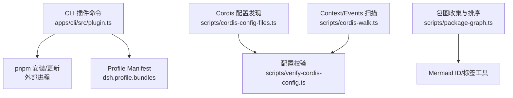
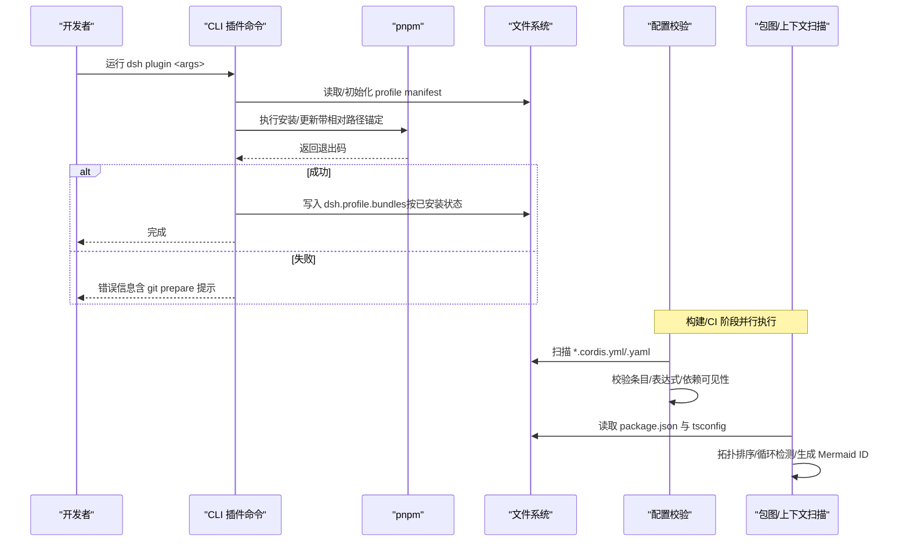
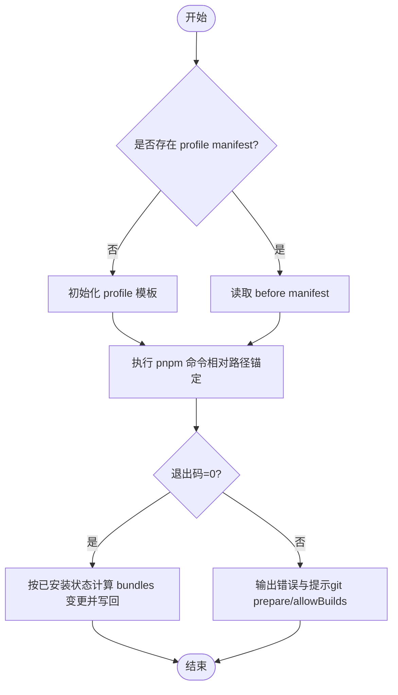
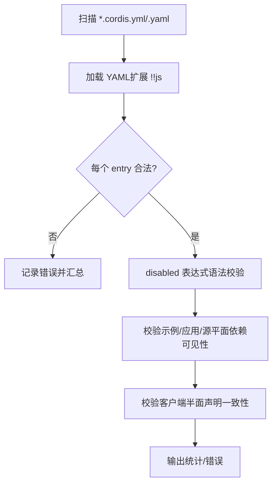
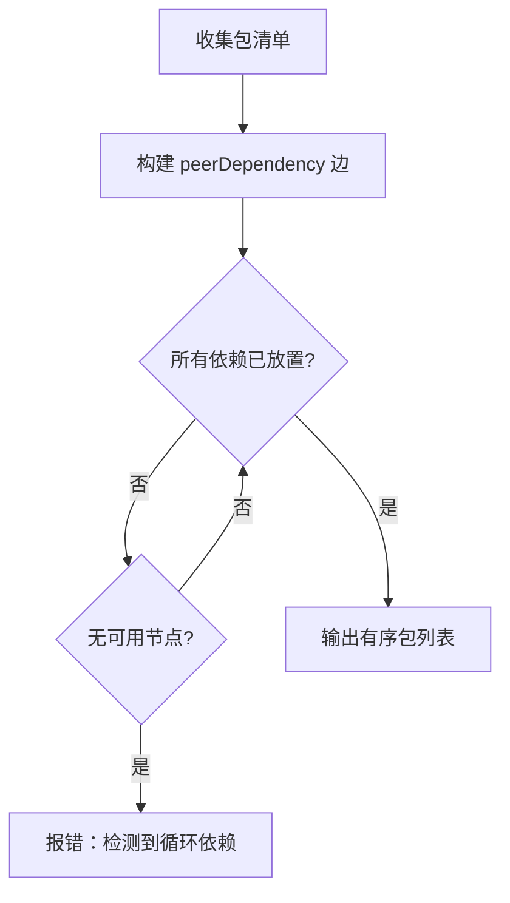
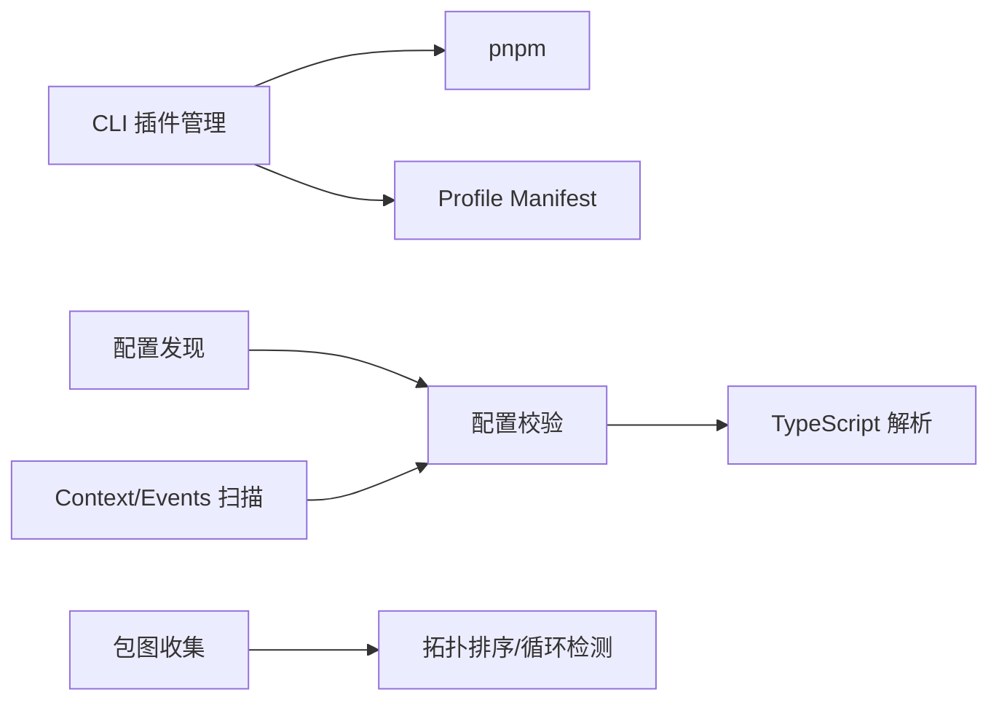

# 依赖管理系统

<cite>
**本文引用的文件**
- [apps/cli/src/plugin.ts](file://apps/cli/src/plugin.ts)
- [scripts/cordis-config-files.ts](file://scripts/cordis-config-files.ts)
- [scripts/verify-cordis-config.ts](file://scripts/verify-cordis-config.ts)
- [scripts/package-graph.ts](file://scripts/package-graph.ts)
- [scripts/cordis-walk.ts](file://scripts/cordis-walk.ts)
</cite>

## 目录
1. [简介](#简介)
2. [项目结构](#项目结构)
3. [核心组件](#核心组件)
4. [架构总览](#架构总览)
5. [详细组件分析](#详细组件分析)
6. [依赖关系分析](#依赖关系分析)
7. [性能考虑](#性能考虑)
8. [故障排查指南](#故障排查指南)
9. [结论](#结论)
10. [附录](#附录)

## 简介
本文件面向插件依赖管理系统，围绕 Cordis Loader 的插件配置、解析与验证流程，系统性地说明：
- 依赖声明格式与约束（版本、可选、条件）
- 依赖解析算法与复杂图处理（含循环检测）
- 冲突解决策略（版本选择、降级/升级）
- 依赖图可视化工具与使用方式
- 依赖验证与完整性检查
- 缓存与加载优化策略

该系统以 YAML 配置文件描述插件组合，结合包管理器（pnpm）进行依赖安装与解析，并通过脚本在构建/校验阶段完成静态分析与图生成。

## 项目结构
仓库中依赖管理相关的关键路径与职责如下：
- apps/cli/src/plugin.ts：CLI 插件子命令，封装 pnpm 调用并维护 profile 层列表（bundles），实现“按已安装状态”自动加入/移除插件层。
- scripts/cordis-config-files.ts：扫描仓库中的 Cordis Loader 配置文件（*.cordis.yml/*.yaml），用于后续校验与图生成。
- scripts/verify-cordis-config.ts：对 Loader 入口元数据与包解析进行严格校验，包括示例与应用覆盖层的依赖可见性、客户端半面声明一致性、源平面解析等。
- scripts/package-graph.ts：收集工作区包及其 peerDependencies 边，执行拓扑排序并生成稳定的 Mermaid ID/标签工具函数，供文档图生成器使用。
- scripts/cordis-walk.ts：基于 TypeScript AST 扫描 Context/Events 合并块，为生成器提供键名与事件名清单，间接支撑依赖/能力注册面的完整性检查。

**图表来源**
- [apps/cli/src/plugin.ts:1-159](file://apps/cli/src/plugin.ts#L1-L159)
- [scripts/cordis-config-files.ts:1-19](file://scripts/cordis-config-files.ts#L1-L19)
- [scripts/verify-cordis-config.ts:1-498](file://scripts/verify-cordis-config.ts#L1-L498)
- [scripts/package-graph.ts:1-94](file://scripts/package-graph.ts#L1-L94)
- [scripts/cordis-walk.ts:1-103](file://scripts/cordis-walk.ts#L1-L103)

**章节来源**
- [apps/cli/src/plugin.ts:1-159](file://apps/cli/src/plugin.ts#L1-L159)
- [scripts/cordis-config-files.ts:1-19](file://scripts/cordis-config-files.ts#L1-L19)
- [scripts/verify-cordis-config.ts:1-498](file://scripts/verify-cordis-config.ts#L1-L498)
- [scripts/package-graph.ts:1-94](file://scripts/package-graph.ts#L1-L94)
- [scripts/cordis-walk.ts:1-103](file://scripts/cordis-walk.ts#L1-L103)

## 核心组件
- CLI 插件管理（profile bundles）：负责初始化 profile、转发 pnpm 命令、根据已安装包是否声明 dsh.bundle 动态维护插件层顺序，并在失败时给出可操作提示。
- Cordis 配置发现与校验：扫描 *.cordis.yml/.yaml，校验条目结构、表达式位置限制、应用/示例/源平面的依赖可见性，以及客户端半面声明一致性。
- 包图收集与拓扑排序：读取 packages/*/*/package.json，提取 peerDependencies 边，输出依赖安全的节点序列，支持组优先级排序与循环检测。
- Context/Events 扫描：通过 TS AST 定位模块合并块，枚举 Context 键与 Events 名称，辅助生成器确保接口完备性。

**章节来源**
- [apps/cli/src/plugin.ts:30-91](file://apps/cli/src/plugin.ts#L30-L91)
- [scripts/cordis-config-files.ts:5-18](file://scripts/cordis-config-files.ts#L5-L18)
- [scripts/verify-cordis-config.ts:41-98](file://scripts/verify-cordis-config.ts#L41-L98)
- [scripts/package-graph.ts:13-57](file://scripts/package-graph.ts#L13-L57)
- [scripts/cordis-walk.ts:12-79](file://scripts/cordis-walk.ts#L12-L79)

## 架构总览
下图展示了从 CLI 到 pnpm、再到 Profile Manifest 与 Cordis 配置的完整链路，以及校验与图生成的并行分支。

**图表来源**
- [apps/cli/src/plugin.ts:120-158](file://apps/cli/src/plugin.ts#L120-L158)
- [scripts/cordis-config-files.ts:13-18](file://scripts/cordis-config-files.ts#L13-L18)
- [scripts/verify-cordis-config.ts:72-98](file://scripts/verify-cordis-config.ts#L72-L98)
- [scripts/package-graph.ts:34-75](file://scripts/package-graph.ts#L34-L75)

## 详细组件分析

### CLI 插件管理与 Profile Bundles
- 功能要点
  - 首次使用初始化 profile，随后将参数原样转发给 pnpm，并在成功后根据“已安装包是否声明 dsh.bundle.patch”决定是否加入/移除 dsh.profile.bundles。
  - 对相对路径 spec（file:/link: . 或 ..）进行锚定，避免在 profile 目录下误解析。
  - 当 pnpm 失败且包含 git 依赖时，给出 allowBuilds 配置指引。
- 关键流程
  - 解析 profile 目录与 manifest
  - 调用 pnpm（Windows 下启用 shell）
  - 比较 before/after dependencies，计算 plugins 变更并写回 manifest
- 复杂度与健壮性
  - 集合与数组操作均为线性；错误路径明确区分 ENOENT 与通用异常。

**图表来源**
- [apps/cli/src/plugin.ts:120-158](file://apps/cli/src/plugin.ts#L120-L158)

**章节来源**
- [apps/cli/src/plugin.ts:30-91](file://apps/cli/src/plugin.ts#L30-L91)
- [apps/cli/src/plugin.ts:93-112](file://apps/cli/src/plugin.ts#L93-L112)
- [apps/cli/src/plugin.ts:120-158](file://apps/cli/src/plugin.ts#L120-L158)

### Cordis 配置发现与校验
- 配置发现
  - 使用 glob 扫描仓库根下的 *.cordis.yml/*.yaml，排除翻译侧车与 vendor/node_modules。
- 校验规则
  - 根必须为 Loader 入口数组；每个 entry 的结构与嵌套（group/config、insert、include patches）逐项校验。
  - disabled 字段仅允许顶层 !!js 表达式，其他字段不得出现表达式节点。
  - 示例与应用覆盖层必须在其依赖范围内解析本地包；客户端半面需同时声明 exports "./client" 与 dsh.client。
  - 源平面解析必须通过 tsconfig.base.json paths 指向 .ts/.tsx 源码，避免 dev 与构建产物差异导致的问题。
- 扩展点
  - 自定义 YAML 类型 !!js 用于表达式标记，便于运行时插值与静态校验分离。

**图表来源**
- [scripts/cordis-config-files.ts:13-18](file://scripts/cordis-config-files.ts#L13-L18)
- [scripts/verify-cordis-config.ts:59-68](file://scripts/verify-cordis-config.ts#L59-L68)
- [scripts/verify-cordis-config.ts:72-98](file://scripts/verify-cordis-config.ts#L72-L98)
- [scripts/verify-cordis-config.ts:115-128](file://scripts/verify-cordis-config.ts#L115-L128)
- [scripts/verify-cordis-config.ts:300-339](file://scripts/verify-cordis-config.ts#L300-L339)
- [scripts/verify-cordis-config.ts:416-472](file://scripts/verify-cordis-config.ts#L416-L472)

**章节来源**
- [scripts/cordis-config-files.ts:1-19](file://scripts/cordis-config-files.ts#L1-L19)
- [scripts/verify-cordis-config.ts:1-498](file://scripts/verify-cordis-config.ts#L1-L498)

### 包图收集与拓扑排序（循环检测）
- 输入：packages/*/*/package.json
- 处理：
  - 过滤 @deepseek-ai/dsh-* 包，提取 peerDependencies 作为内部边
  - 拓扑排序，若存在环则抛出错误并列出参与环的包名
  - 支持 groupOrder 作为同层排序的稳定化依据
- 输出：有序节点列表与 Mermaid ID/标签工具函数

**图表来源**
- [scripts/package-graph.ts:34-75](file://scripts/package-graph.ts#L34-L75)

**章节来源**
- [scripts/package-graph.ts:1-94](file://scripts/package-graph.ts#L1-L94)

### Context/Events 扫描（能力注册面）
- 目标：定位 declare module '@deepseek-ai/cordis' 或 './context.ts' 的合并块
- 产出：
  - Context 键名映射（key → 类型名文本）
  - Events 事件名列表
- 用途：为生成器提供完备性断言输入，确保新增能力被正确暴露与消费。

**章节来源**
- [scripts/cordis-walk.ts:12-79](file://scripts/cordis-walk.ts#L12-L79)
- [scripts/cordis-walk.ts:81-103](file://scripts/cordis-walk.ts#L81-L103)

## 依赖关系分析
- 组件耦合
  - CLI 插件管理依赖 profile manifest 读写与 pnpm 进程；与 Cordis 配置解耦，但共同构成“安装→组合”的两段式流程。
  - 配置校验依赖配置发现与 TypeScript 解析，形成“扫描→校验”的单向依赖。
  - 包图收集与上下文扫描为文档/校验工具提供稳定输入，彼此独立。
- 外部依赖
  - pnpm：实际依赖解析与安装执行者
  - js-yaml：YAML 解析与自定义类型扩展
  - typescript：TS AST 与模块解析
- 潜在循环
  - 包图收集阶段显式检测 peerDependencies 环，防止生成错误顺序。

**图表来源**
- [apps/cli/src/plugin.ts:120-158](file://apps/cli/src/plugin.ts#L120-L158)
- [scripts/cordis-config-files.ts:13-18](file://scripts/cordis-config-files.ts#L13-L18)
- [scripts/verify-cordis-config.ts:72-98](file://scripts/verify-cordis-config.ts#L72-L98)
- [scripts/package-graph.ts:34-75](file://scripts/package-graph.ts#L34-L75)
- [scripts/cordis-walk.ts:12-79](file://scripts/cordis-walk.ts#L12-L79)

**章节来源**
- [apps/cli/src/plugin.ts:120-158](file://apps/cli/src/plugin.ts#L120-L158)
- [scripts/cordis-config-files.ts:1-19](file://scripts/cordis-config-files.ts#L1-L19)
- [scripts/verify-cordis-config.ts:1-498](file://scripts/verify-cordis-config.ts#L1-L498)
- [scripts/package-graph.ts:1-94](file://scripts/package-graph.ts#L1-L94)
- [scripts/cordis-walk.ts:1-103](file://scripts/cordis-walk.ts#L1-L103)

## 性能考虑
- 配置扫描与校验
  - 使用 glob 一次性扫描并按路径排序，减少重复 I/O。
  - 仅在必要时解析 TypeScript 配置与模块解析，避免全量编译开销。
- 包图构建
  - 仅读取 package.json 与 tsconfig，不实例化模块；拓扑排序为 O(V+E)。
- CLI 插件管理
  - 仅在 pnpm 成功后才重算 bundles，避免频繁写盘；相对路径锚定减少误解析导致的重试。
- 建议
  - 在 CI 中缓存 pnpm store 与 node_modules（如适用）。
  - 将配置校验与图生成作为并行任务，缩短流水线时间。

[本节为通用指导，不直接分析具体文件]

## 故障排查指南
- pnpm 未找到或权限问题
  - 现象：CLI 报 ENOENT 或安装失败
  - 处理：确认 PATH 中存在 pnpm；Windows 下需 shell 模式；检查 workspace 安全策略
- Git 依赖 prepare 脚本被阻止
  - 现象：安装失败并提示 allowBuilds
  - 处理：在 profile 的 pnpm-workspace.yaml 中添加 allowBuilds 白名单后重试
- 配置校验失败
  - 现象：校验脚本输出多条错误
  - 处理：根据路径定位到具体 entry，修正 disabled 表达式位置、补齐缺失依赖或修正客户端半面声明
- 源平面解析不一致
  - 现象：本地可启动但 clean 环境失败
  - 处理：在 tsconfig.base.json paths 添加映射，确保解析到 .ts/.tsx 源码

**章节来源**
- [apps/cli/src/plugin.ts:134-156](file://apps/cli/src/plugin.ts#L134-L156)
- [scripts/verify-cordis-config.ts:300-339](file://scripts/verify-cordis-config.ts#L300-L339)
- [scripts/verify-cordis-config.ts:416-472](file://scripts/verify-cordis-config.ts#L416-L472)

## 结论
该依赖管理系统通过“CLI 插件管理 + Cordis 配置校验 + 包图构建”的组合，实现了：
- 明确的依赖声明与组合入口（*.cordis.yml）
- 严格的静态校验（表达式位置、依赖可见性、客户端半面一致性、源平面解析）
- 可靠的依赖图构建与循环检测
- 可操作的故障诊断与修复指引

建议在团队内统一遵循上述规范，并将校验与图生成纳入 CI，以保证插件生态的稳定与可演进。

[本节为总结性内容，不直接分析具体文件]

## 附录

### 依赖声明格式与约束（基于仓库实现）
- 配置文件
  - 位置：仓库根下 *.cordis.yml/*.yaml
  - 结构：Loader 入口数组，支持 group/config、insert、include patches 等嵌套
  - 表达式：仅 disabled 字段允许 !!js 表达式；其他字段必须静态
- 版本约束
  - 由 pnpm 管理（package.json 中的依赖版本范围）；CLI 插件管理按“已安装包”决定插件层
- 可选依赖
  - 通过 disabled 表达式在挂载时按需启用/禁用
- 条件依赖
  - 通过 disabled 表达式与注入上下文控制行为；其余元数据保持静态

**章节来源**
- [scripts/cordis-config-files.ts:13-18](file://scripts/cordis-config-files.ts#L13-L18)
- [scripts/verify-cordis-config.ts:416-472](file://scripts/verify-cordis-config.ts#L416-L472)
- [apps/cli/src/plugin.ts:47-91](file://apps/cli/src/plugin.ts#L47-L91)

### 依赖解析算法与循环检测
- 解析主体：pnpm（外部进程）
- 静态校验：verify-cordis-config 校验示例/应用/源平面依赖可见性
- 循环检测：package-graph 对 peerDependencies 进行拓扑排序，遇环即报错并列出参与包

**章节来源**
- [apps/cli/src/plugin.ts:120-158](file://apps/cli/src/plugin.ts#L120-L158)
- [scripts/verify-cordis-config.ts:237-289](file://scripts/verify-cordis-config.ts#L237-L289)
- [scripts/package-graph.ts:59-75](file://scripts/package-graph.ts#L59-L75)

### 冲突解决策略（版本选择、降级/升级）
- 版本选择：由 pnpm 根据依赖树与锁定文件确定
- 降级/升级：通过修改依赖版本范围并重新运行 dsh plugin，CLI 会按“已安装包”重新计算 bundles
- 注意：若新版本不再声明 dsh.bundle，将被自动移出插件层

**章节来源**
- [apps/cli/src/plugin.ts:47-91](file://apps/cli/src/plugin.ts#L47-L91)

### 依赖图可视化工具
- 包图：package-graph 收集包与 peerDependencies 边，输出拓扑序与 Mermaid ID/标签工具
- 上下文图：cordis-walk 枚举 Context/Events，配合生成器产出能力注册图
- 用法：在脚本/文档生成流程中调用，输出 Mermaid 代码用于渲染

**章节来源**
- [scripts/package-graph.ts:1-94](file://scripts/package-graph.ts#L1-L94)
- [scripts/cordis-walk.ts:12-103](file://scripts/cordis-walk.ts#L12-L103)

### 依赖验证与完整性检查
- 配置校验：entry 结构、表达式位置、依赖可见性、客户端半面一致性、源平面解析
- 包图校验：peerDependencies 环检测
- 上下文校验：Context/Events 键名与事件名完备性

**章节来源**
- [scripts/verify-cordis-config.ts:72-98](file://scripts/verify-cordis-config.ts#L72-L98)
- [scripts/verify-cordis-config.ts:115-128](file://scripts/verify-cordis-config.ts#L115-L128)
- [scripts/verify-cordis-config.ts:300-339](file://scripts/verify-cordis-config.ts#L300-L339)
- [scripts/package-graph.ts:59-75](file://scripts/package-graph.ts#L59-L75)
- [scripts/cordis-walk.ts:12-103](file://scripts/cordis-walk.ts#L12-L103)

### 依赖缓存与优化加载
- pnpm 缓存：利用 pnpm store 与 lockfile 加速安装
- 增量校验：仅在 pnpm 成功后重算 bundles，减少写盘
- 并行化：配置校验与图生成可在 CI 中并行执行

[本节为通用指导，不直接分析具体文件]