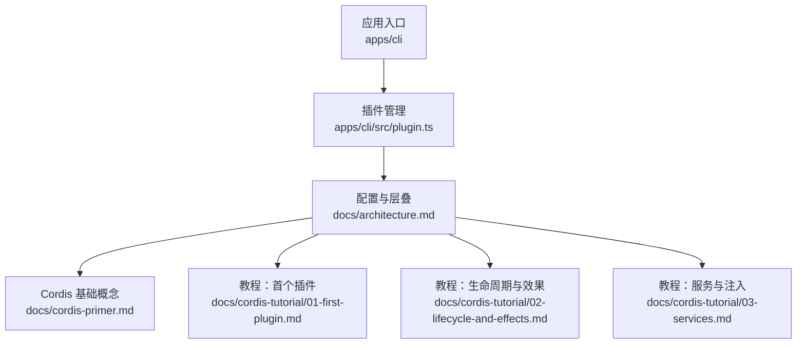
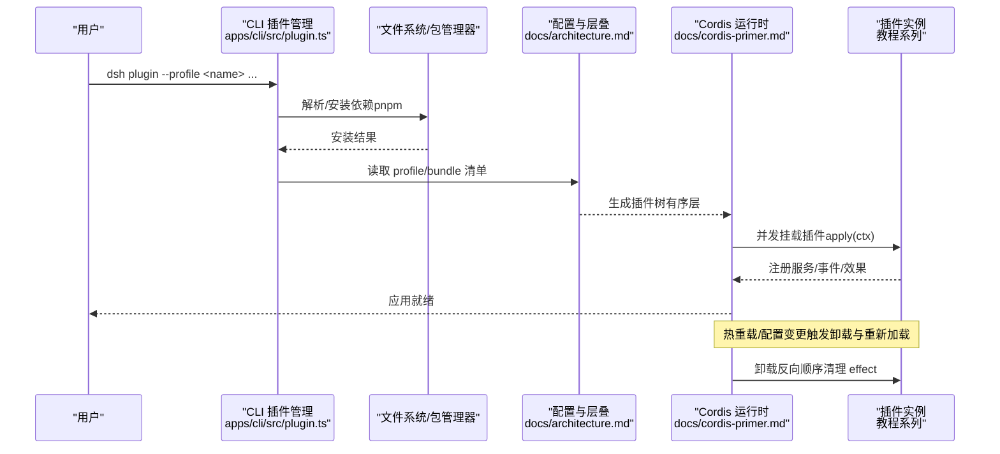
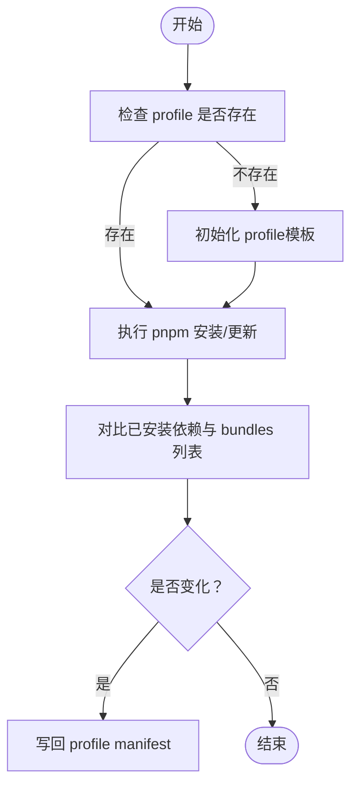
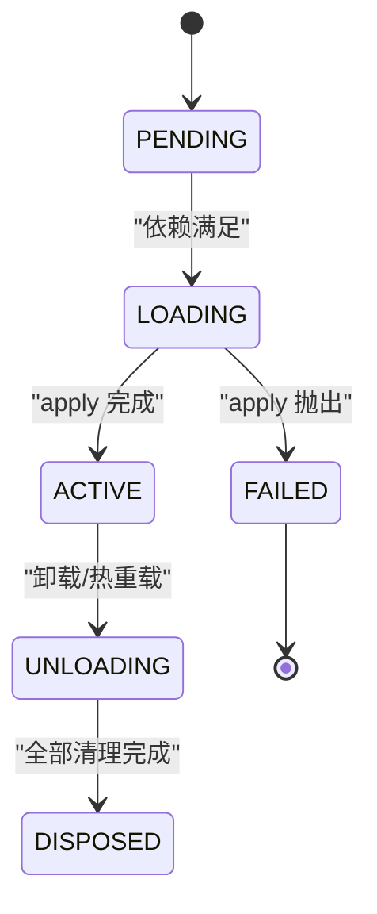
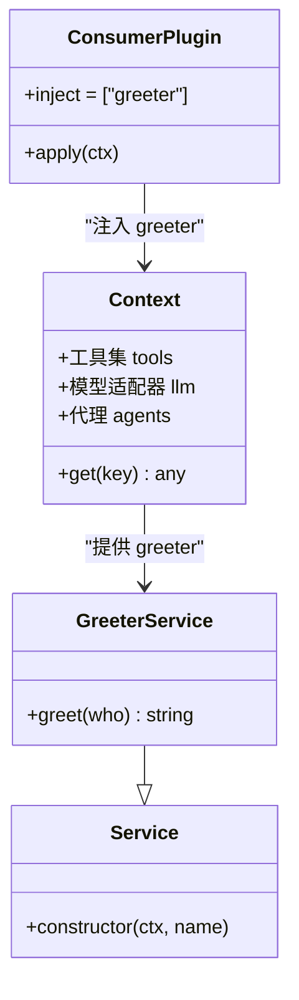
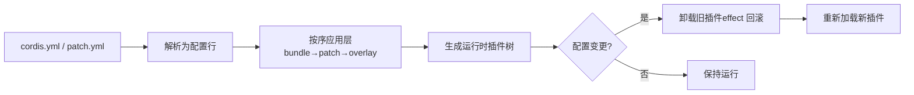
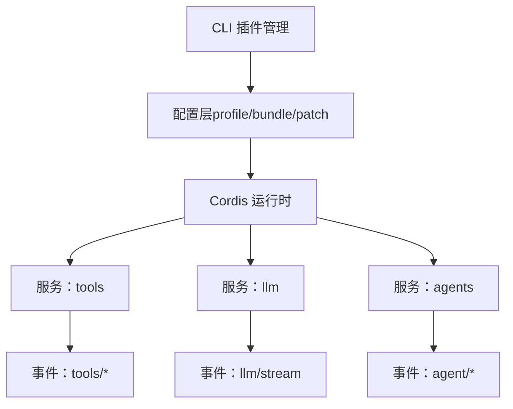

# 插件化架构

<cite>
**本文引用的文件**
- [README.md](file://README.md)
- [architecture.md](file://docs/architecture.md)
- [01-first-plugin.md](file://docs/cordis-tutorial/01-first-plugin.md)
- [02-lifecycle-and-effects.md](file://docs/cordis-tutorial/02-lifecycle-and-effects.md)
- [03-services.md](file://docs/cordis-tutorial/03-services.md)
- [cordis-primer.md](file://docs/cordis-primer.md)
- [plugin.ts](file://apps/cli/src/plugin.ts)
</cite>

## 目录
1. [简介](#简介)
2. [项目结构](#项目结构)
3. [核心组件](#核心组件)
4. [架构总览](#架构总览)
5. [详细组件分析](#详细组件分析)
6. [依赖分析](#依赖分析)
7. [性能考虑](#性能考虑)
8. [故障排查指南](#故障排查指南)
9. [结论](#结论)
10. [附录](#附录)

## 简介
本仓库采用“一切皆插件”的架构，基于 Cordis 框架实现。插件通过声明式配置进行组合，提供能力（服务）、事件与可逆效果；所有功能均可被替换或覆盖。运行期由“配置文件层”自底向上叠加，形成可插拔、可热重载、可隔离的插件树。CLI 提供以 profile 为单位的插件管理，自动发现并维护 bundle 层，使新增/移除插件即改即用。

**章节来源**
- [README.md:1-58](file://README.md#L1-L58)
- [architecture.md:9-37](file://docs/architecture.md#L9-L37)

## 项目结构
- 顶层 README 说明整体定位与运行方式。
- docs 下包含架构说明、子系统文档、Cordis 教程与用户指南。
- apps/cli 提供 CLI 入口与插件管理命令。
- packages 下按子系统划分核心能力（如 session、tools、llm、agent 等）。
- examples 提供多种 agent 与场景示例。
- scripts 包含构建、校验与生成脚本。



**图表来源**
- [plugin.ts:1-159](file://apps/cli/src/plugin.ts#L1-L159)
- [architecture.md:9-37](file://docs/architecture.md#L9-L37)
- [cordis-primer.md:7-44](file://docs/cordis-primer.md#L7-L44)
- [01-first-plugin.md:1-96](file://docs/cordis-tutorial/01-first-plugin.md#L1-L96)
- [02-lifecycle-and-effects.md:1-99](file://docs/cordis-tutorial/02-lifecycle-and-effects.md#L1-L99)
- [03-services.md:1-99](file://docs/cordis-tutorial/03-services.md#L1-L99)

**章节来源**
- [README.md:1-58](file://README.md#L1-L58)
- [architecture.md:9-37](file://docs/architecture.md#L9-L37)

## 核心组件
- 插件与上下文：插件通过 apply(ctx) 注册能力；Context 是服务容器，键名稳定（如 ctx.tools、ctx.llm、ctx.agents）。
- 服务与注入：服务以名称暴露能力，消费者通过 inject 声明依赖，加载顺序由依赖决定而非文件顺序。
- 事件系统：支持 emit/waterfall/parallel/serial 四种分发模式，用于观察、拦截、并行与串行处理。
- 效果与卸载：所有注册均为可逆效果，插件卸载时自动回滚；外部资源需通过 ctx.effect() 包装。
- 配置与层叠：profile/bundle 分层组合，补丁行按序覆盖或插入，最终形成运行时插件树。

**章节来源**
- [cordis-primer.md:7-44](file://docs/cordis-primer.md#L7-L44)
- [03-services.md:1-99](file://docs/cordis-tutorial/03-services.md#L1-L99)
- [02-lifecycle-and-effects.md:1-99](file://docs/cordis-tutorial/02-lifecycle-and-effects.md#L1-L99)
- [architecture.md:9-37](file://docs/architecture.md#L9-L37)

## 架构总览
下图展示从 CLI 到插件发现、加载、初始化、运行与卸载的整体流程，以及配置层如何影响行为。



**图表来源**
- [plugin.ts:1-159](file://apps/cli/src/plugin.ts#L1-L159)
- [architecture.md:9-37](file://docs/architecture.md#L9-L37)
- [cordis-primer.md:7-44](file://docs/cordis-primer.md#L7-L44)
- [01-first-plugin.md:1-96](file://docs/cordis-tutorial/01-first-plugin.md#L1-L96)
- [02-lifecycle-and-effects.md:1-99](file://docs/cordis-tutorial/02-lifecycle-and-effects.md#L1-L99)

## 详细组件分析

### 插件发现与加载（CLI 与配置层）
- 插件发现：CLI 在 profile 目录下执行 pnpm 操作后，扫描已安装依赖中声明 dsh.bundle 的包，将其加入 profile 的 bundles 列表，作为一层参与后续组合。
- 层叠规则：每个 bundle 对应一组 Cordis 配置行与代码，按 profile 声明顺序依次应用；随后再应用 home 级 patch 与命令行 overlay。
- 动态性：若依赖更新后新增了 dsh.bundle 声明，reconcile 会将其纳入层栈；若不再声明，则移出。



**图表来源**
- [plugin.ts:1-159](file://apps/cli/src/plugin.ts#L1-L159)

**章节来源**
- [plugin.ts:1-159](file://apps/cli/src/plugin.ts#L1-L159)
- [architecture.md:15-37](file://docs/architecture.md#L15-L37)

### 插件初始化与生命周期（Fiber 状态机）
- Fiber 状态：PENDING → LOADING → ACTIVE → UNLOADING → DISPOSED（失败路径 FAILED）。
- 加载顺序：由 inject 声明的服务依赖决定，而非 cordis.yml 中的位置。
- 卸载与清理：所有注册都是 effect，卸载时按反向顺序释放；异步清理并发执行，如需顺序请合并到一个 disposer。



**图表来源**
- [02-lifecycle-and-effects.md:68-83](file://docs/cordis-tutorial/02-lifecycle-and-effects.md#L68-L83)

**章节来源**
- [02-lifecycle-and-effects.md:1-99](file://docs/cordis-tutorial/02-lifecycle-and-effects.md#L1-L99)
- [03-services.md:44-79](file://docs/cordis-tutorial/03-services.md#L44-L79)

### 服务注册与发现（依赖管理与扩展点）
- 服务定义：通过 Service 子类或函数插件向 Context 注册命名能力（如 tools、llm、agents）。
- 依赖注入：消费者使用 inject 声明所需服务，Cordis 保证在 apply 内可用。
- 可选依赖：通过 ctx.get('key') 安全探测，避免硬依赖导致无法启动。
- 能力缝（seam）：一套接口 + 提供者 + 消费者构成可扩展能力点，便于替换实现。



**图表来源**
- [03-services.md:1-99](file://docs/cordis-tutorial/03-services.md#L1-L99)

**章节来源**
- [03-services.md:1-99](file://docs/cordis-tutorial/03-services.md#L1-L99)
- [cordis-primer.md:7-44](file://docs/cordis-primer.md#L7-L44)
- [architecture.md:98-129](file://docs/architecture.md#L98-L129)

### 事件系统与插件间通信
- 事件类型：session/event、agent/*、capabilities/* 等，分别承载持久事实、实时协调与能力策略。
- 分发模式：emit（观察）、waterfall（中间件式改写）、parallel（并行）、serial（串行决策）。
- 水线：turn/step/user/assistant/tool 等事件贯穿会话日志，驱动 UI、回放与遥测。

```mermaid
sequenceDiagram
participant Loop as "Agent 循环"
participant Tools as "工具管线"
participant LLM as "LLM 适配"
participant Log as "会话日志"
Loop->>Log : turn/start
Loop->>Tools : tool/call*
Tools-->>Loop : tool/result*
Loop->>LLM : request/stream
LLM-->>Loop : assistant/chunk* -> assistant/message
Loop->>Log : step/end, turn/end
```

**图表来源**
- [architecture.md:63-90](file://docs/architecture.md#L63-L90)

**章节来源**
- [architecture.md:53-90](file://docs/architecture.md#L53-L90)
- [cordis-primer.md:15-35](file://docs/cordis-primer.md#L15-L35)

### 配置系统与动态加载/热重载
- Profile/Bundles：profile 列出要堆叠的 bundle，bundle 携带配置行与代码；每层都可被上层覆盖或插入新行。
- Patch 机制：通过 cordis.patch.yml 对已有行进行替换或插入，支持环境选择与覆盖。
- 热重载：配置编辑或热更新会触发插件卸载与重新加载，effect 自动回滚，确保一致性。



**图表来源**
- [architecture.md:15-37](file://docs/architecture.md#L15-L37)
- [02-lifecycle-and-effects.md:1-99](file://docs/cordis-tutorial/02-lifecycle-and-effects.md#L1-L99)

**章节来源**
- [architecture.md:15-37](file://docs/architecture.md#L15-L37)
- [02-lifecycle-and-effects.md:1-99](file://docs/cordis-tutorial/02-lifecycle-and-effects.md#L1-L99)

### 插件开发完整指南（从简单工具到复杂模块）
- 最小插件：导出 name 与 apply(ctx)，在 cordis.yml 中引用即可运行。
- 生命周期：使用 ctx.effect() 管理外部资源，确保卸载时释放。
- 服务化：将能力封装为 Service，并通过 inject 让其他插件消费。
- 事件接入：通过 ctx.on/emit/waterfall/parallel/serial 参与现有管线。
- 组合与调试：通过 profile/bundle 组合，使用 dump-config 查看实际树；PENDING 状态通常表示依赖未满足。

**章节来源**
- [01-first-plugin.md:1-96](file://docs/cordis-tutorial/01-first-plugin.md#L1-L96)
- [02-lifecycle-and-effects.md:1-99](file://docs/cordis-tutorial/02-lifecycle-and-effects.md#L1-L99)
- [03-services.md:1-99](file://docs/cordis-tutorial/03-services.md#L1-L99)
- [architecture.md:15-37](file://docs/architecture.md#L15-L37)

### 安全边界与资源限制（隔离策略）
- 能力缝隔离：通过 provider/consumer 分离，不同实现可在同一接口下切换（如 fs、subprocess、sandbox）。
- 作用域与沙箱：子进程/终端/工作区访问可通过 ctx.sandbox 与权限策略限制；工具执行走受控管道。
- 事件与副作用：仅允许通过公开事件与注册点进行扩展，避免直接耦合。
- 建议：为敏感能力（文件系统、网络、子进程）提供独立 provider，并在配置中选择受限实现。

**章节来源**
- [architecture.md:98-129](file://docs/architecture.md#L98-L129)

### 版本管理与兼容性策略
- 层叠优先：上层 patch 可覆盖下层行为，便于在不修改底层的情况下调整行为。
- 依赖驱动：当依赖升级获得新的 dsh.bundle 声明时，reconcile 会自动激活；若降级丢失声明，则自动移除。
- 兼容建议：插件应声明最小兼容范围，避免破坏性变更；通过能力缝逐步演进，保留旧 provider 过渡期。

**章节来源**
- [plugin.ts:30-91](file://apps/cli/src/plugin.ts#L30-L91)
- [architecture.md:15-37](file://docs/architecture.md#L15-L37)

## 依赖分析
- 组件耦合：插件之间通过服务名与事件解耦，降低直接导入带来的强耦合。
- 直接依赖：CLI 依赖包管理器与 profile 清单；运行时依赖 Cordis 提供的 Context、Service、事件与 fiber。
- 间接依赖：各子系统（tools、llm、session 等）通过能力缝对外暴露接口，内部实现可替换。
- 循环依赖：通过事件与服务名避免循环；必要时使用延迟消费或按需加载。



**图表来源**
- [plugin.ts:1-159](file://apps/cli/src/plugin.ts#L1-L159)
- [architecture.md:39-129](file://docs/architecture.md#L39-L129)

**章节来源**
- [architecture.md:39-129](file://docs/architecture.md#L39-L129)
- [cordis-primer.md:7-44](file://docs/cordis-primer.md#L7-L44)

## 性能考虑
- 并发加载：插件并发挂载，但依赖满足后才进入 ACTIVE，避免阻塞。
- 事件分发：合理选择分发模式，避免不必要的串行或并行开销。
- 资源管理：尽量复用连接/句柄，使用 effect 集中释放，减少内存泄漏。
- 日志与回放：会话日志是核心数据源，应避免重复计算与冗余写入。

[本节为通用指导，不直接分析具体文件]

## 故障排查指南
- 插件无输出：检查是否为 PENDING 状态，确认依赖服务是否已加载。
- 加载失败：apply 抛出会导致进程退出；检查拼写与模块解析。
- 热重载异常：确认 effect 是否正确返回 disposer；异步清理注意顺序。
- CLI 错误：pnpm 未找到或 git 依赖 prepare 被阻止时，根据提示添加 allowBuilds。

**章节来源**
- [01-first-plugin.md:79-93](file://docs/cordis-tutorial/01-first-plugin.md#L79-L93)
- [02-lifecycle-and-effects.md:68-94](file://docs/cordis-tutorial/02-lifecycle-and-effects.md#L68-L94)
- [plugin.ts:120-159](file://apps/cli/src/plugin.ts#L120-L159)

## 结论
该插件化架构以 Cordis 为核心，通过“服务+事件+效果”的组合，实现了高度可插拔、可热重载、可隔离的系统。CLI 简化了插件的安装与层叠管理，配合配置补丁机制，使得功能扩展与替换变得直观且可控。遵循能力缝与事件契约，可以在不破坏兼容性的前提下持续演进。

[本节为总结性内容，不直接分析具体文件]

## 附录
- 快速上手：参考教程系列从零创建第一个插件，逐步掌握生命周期、服务与事件。
- 扩展实践：阅读子系统文档，了解如何在 tools、llm、agents 等关键能力缝上扩展。
- 调试技巧：使用 dump-config 查看实际插件树；关注 PENDING 状态与 effect 清理。

[本节为补充信息，不直接分析具体文件]