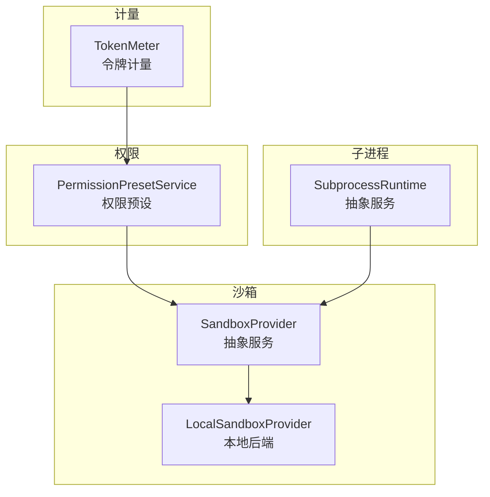
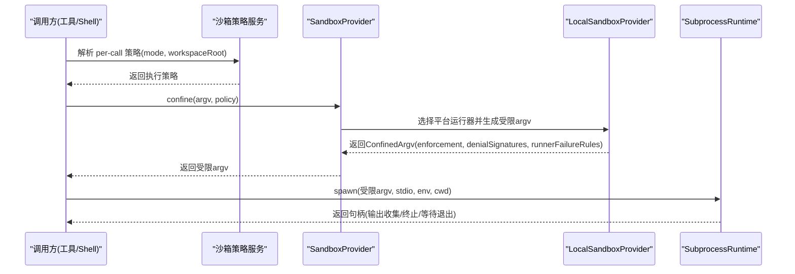
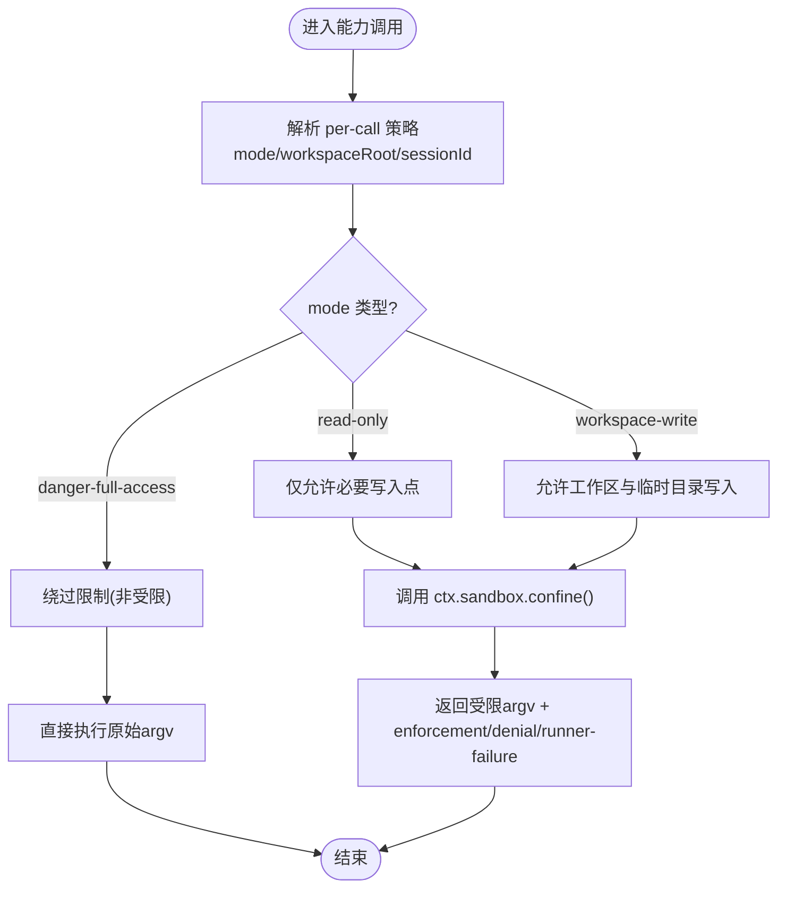
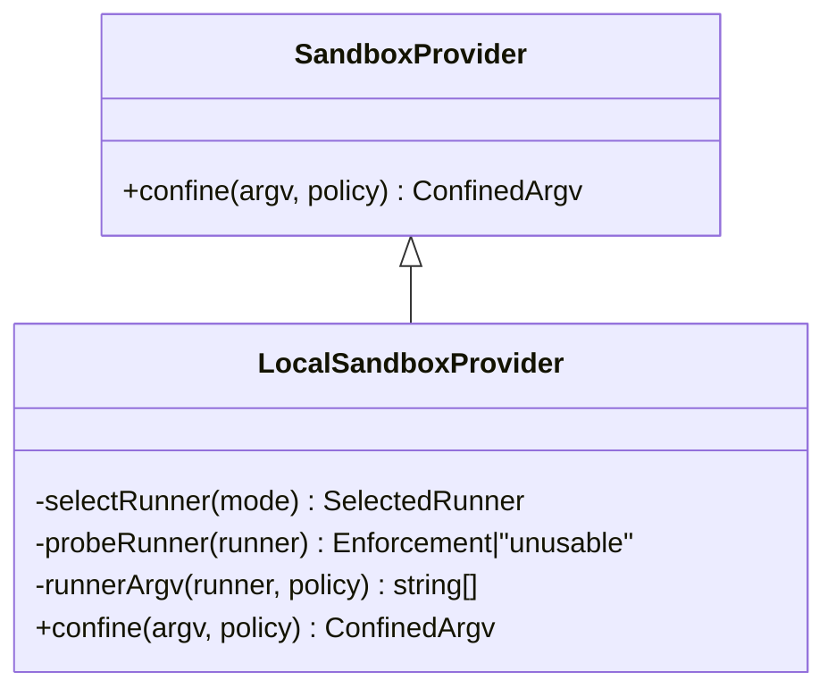
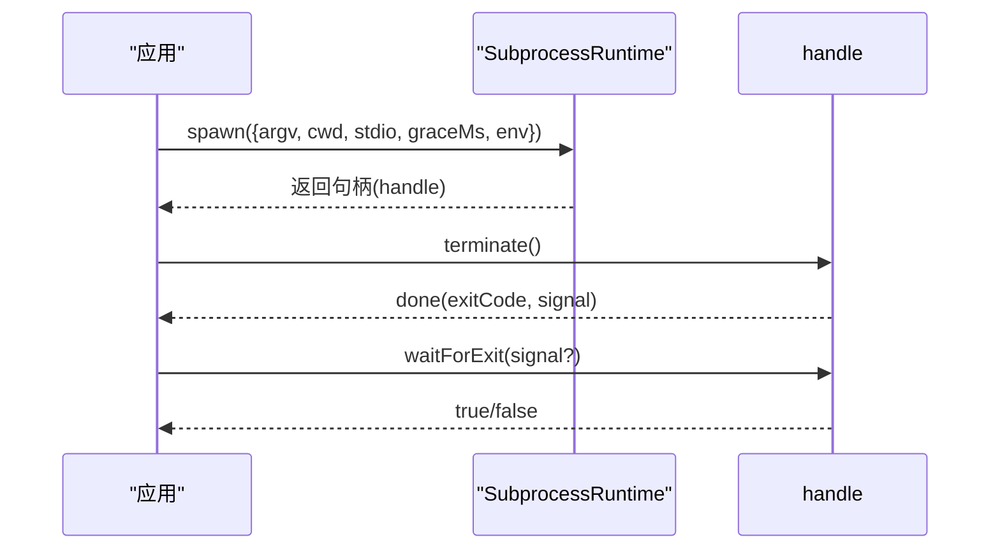
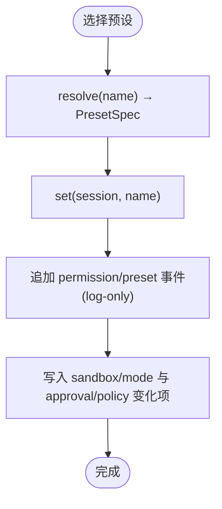
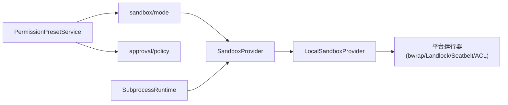

# 插件安全与隔离

<cite>
**本文引用的文件**
- [packages/sandbox/sandbox/src/index.ts](file://packages/sandbox/sandbox/src/index.ts)
- [packages/sandbox/sandbox-local/src/index.ts](file://packages/sandbox/sandbox-local/src/index.ts)
- [docs/subsystems/sandbox.md](file://docs/subsystems/sandbox.md)
- [docs/subsystems/permission-presets.md](file://docs/subsystems/permission-presets.md)
- [docs/subsystems/subprocess.md](file://docs/subsystems/subprocess.md)
- [packages/subprocess/subprocess/src/index.ts](file://packages/subprocess/subprocess/src/index.ts)
- [packages/interaction/permission-presets/src/index.ts](file://packages/interaction/permission-presets/src/index.ts)
- [packages/llm/token-meter/src/index.ts](file://packages/llm/token-meter/src/index.ts)
</cite>

## 目录
1. [简介](#简介)
2. [项目结构](#项目结构)
3. [核心组件](#核心组件)
4. [架构总览](#架构总览)
5. [详细组件分析](#详细组件分析)
6. [依赖关系分析](#依赖关系分析)
7. [性能与安全考量](#性能与安全考量)
8. [故障排查指南](#故障排查指南)
9. [结论](#结论)
10. [附录：配置与最佳实践](#附录配置与最佳实践)

## 简介
本文件系统性阐述插件安全模型与隔离机制的设计实现，覆盖沙箱环境（文件系统访问限制、进程隔离）、权限模型（细粒度资源访问控制）、安全边界设计原则、资源使用监控与限制（CPU、内存、网络带宽）、安全审计与日志记录，以及安全策略配置方法与最佳实践。内容基于代码库中的沙箱抽象、本地后端实现、子进程管理、权限预设与令牌计量等模块进行归纳与可视化说明。

## 项目结构
围绕“插件安全与隔离”的关键目录与职责如下：
- 沙箱抽象与本地后端：定义跨平台进程级沙箱能力、模式与执行策略，并提供 Linux/macOS/Windows 的本地实现。
- 子进程运行时：提供受控的子进程生命周期、环境变量清洗、输出收集与终止策略。
- 权限预设：将沙箱模式与审批策略组合为可切换的“权限预设”，统一对外暴露。
- 令牌计量：对会话表面与请求压力进行度量，用于成本与配额控制。

图表来源
- [packages/sandbox/sandbox/src/index.ts:158-176](file://packages/sandbox/sandbox/src/index.ts#L158-L176)
- [packages/sandbox/sandbox-local/src/index.ts:250-333](file://packages/sandbox/sandbox-local/src/index.ts#L250-L333)
- [packages/subprocess/subprocess/src/index.ts:102-140](file://packages/subprocess/subprocess/src/index.ts#L102-L140)
- [packages/interaction/permission-presets/src/index.ts:119-126](file://packages/interaction/permission-presets/src/index.ts#L119-L126)
- [packages/llm/token-meter/src/index.ts:59-85](file://packages/llm/token-meter/src/index.ts#L59-L85)

章节来源
- [docs/subsystems/sandbox.md:1-219](file://docs/subsystems/sandbox.md#L1-L219)
- [docs/subsystems/subprocess.md:1-325](file://docs/subsystems/subprocess.md#L1-L325)
- [docs/subsystems/permission-presets.md:1-132](file://docs/subsystems/permission-presets.md#L1-L132)

## 核心组件
- 沙箱抽象（SandboxProvider）：定义 confine(argv, policy) 契约，要求返回受限 argv 或失败关闭；禁止静默放行。
- 本地沙箱后端（LocalSandboxProvider）：按平台选择 bwrap/Landlock/Seatbelt/Windows ACL 运行器，功能探测并报告 enforcement 完整性、拒绝特征与运行器失败规则。
- 子进程运行时（SubprocessRuntime）：提供 resolveExecutable/spawn/spawnTerminal，严格的环境变量清洗、输出收集与树级终止。
- 权限预设（PermissionPresetService）：将 sandbox/mode 与 approval/policy 打包为预设，支持当前有效预设推导与切换。
- 令牌计量（TokenMeter）：对会话表面与请求压力进行测量，支撑配额与成本治理。

章节来源
- [packages/sandbox/sandbox/src/index.ts:23-72](file://packages/sandbox/sandbox/src/index.ts#L23-L72)
- [packages/sandbox/sandbox/src/index.ts:158-176](file://packages/sandbox/sandbox/src/index.ts#L158-L176)
- [packages/sandbox/sandbox-local/src/index.ts:250-333](file://packages/sandbox/sandbox-local/src/index.ts#L250-L333)
- [packages/subprocess/subprocess/src/index.ts:37-66](file://packages/subprocess/subprocess/src/index.ts#L37-L66)
- [packages/subprocess/subprocess/src/index.ts:102-140](file://packages/subprocess/subprocess/src/index.ts#L102-L140)
- [docs/subsystems/permission-presets.md:9-68](file://docs/subsystems/permission-presets.md#L9-L68)
- [packages/llm/token-meter/src/index.ts:59-85](file://packages/llm/token-meter/src/index.ts#L59-L85)

## 架构总览
下图展示从调用方到沙箱与子进程的完整执行路径，以及权限预设如何影响策略解析与执行。

图表来源
- [docs/subsystems/sandbox.md:41-94](file://docs/subsystems/sandbox.md#L41-L94)
- [packages/sandbox/sandbox/src/index.ts:158-176](file://packages/sandbox/sandbox/src/index.ts#L158-L176)
- [packages/sandbox/sandbox-local/src/index.ts:316-333](file://packages/sandbox/sandbox-local/src/index.ts#L316-L333)
- [packages/subprocess/subprocess/src/index.ts:102-140](file://packages/subprocess/subprocess/src/index.ts#L102-L140)

## 详细组件分析

### 沙箱模式与执行策略
- 模式语义：read-only（仅允许必要写入点）、workspace-write（允许工作区与后端临时目录写入）、danger-full-access（绕过限制）。
- 每调用策略：包含 mode、workspaceRoot、sessionId，确保并发会话与一次性升级重试互不干扰。
- 强制完整性：full/partial 描述后端在当前主机上对承诺的文件效果的控制程度。

图表来源
- [docs/subsystems/sandbox.md:9-94](file://docs/subsystems/sandbox.md#L9-L94)
- [packages/sandbox/sandbox/src/index.ts:23-72](file://packages/sandbox/sandbox/src/index.ts#L23-L72)

章节来源
- [docs/subsystems/sandbox.md:9-94](file://docs/subsystems/sandbox.md#L9-L94)
- [packages/sandbox/sandbox/src/index.ts:23-72](file://packages/sandbox/sandbox/src/index.ts#L23-L72)

### 本地后端与平台适配
- 平台链：Linux(bwrap→Landlock)、macOS(Seatbelt)、Windows(ACL restricted-token)。
- 功能探测：对候选运行器进行一次性探测，缓存结果；不可用时失败关闭。
- 拒绝与失败分类：通过 denialSignatures 与 runnerFailureRules 区分“被沙箱拒绝”和“运行器自身失败”。

图表来源
- [packages/sandbox/sandbox/src/index.ts:158-176](file://packages/sandbox/sandbox/src/index.ts#L158-L176)
- [packages/sandbox/sandbox-local/src/index.ts:250-333](file://packages/sandbox/sandbox-local/src/index.ts#L250-L333)
- [packages/sandbox/sandbox-local/src/index.ts:492-539](file://packages/sandbox/sandbox-local/src/index.ts#L492-L539)

章节来源
- [packages/sandbox/sandbox-local/src/index.ts:250-333](file://packages/sandbox/sandbox-local/src/index.ts#L250-L333)
- [packages/sandbox/sandbox-local/src/index.ts:492-539](file://packages/sandbox/sandbox-local/src/index.ts#L492-L539)

### 子进程管理与隔离
- 环境变量清洗：移除敏感键与 DSH_* 命名空间，避免凭据泄漏。
- 输出收集：支持 pipe/inherit/collect 三种模式，collect 模式具备溢出回退与 spill 文件恢复。
- 终止策略：SIGTERM→grace→SIGKILL 树级终止，waitForExit 观察整棵进程树。

图表来源
- [packages/subprocess/subprocess/src/index.ts:37-66](file://packages/subprocess/subprocess/src/index.ts#L37-L66)
- [packages/subprocess/subprocess/src/index.ts:102-140](file://packages/subprocess/subprocess/src/index.ts#L102-L140)
- [docs/subsystems/subprocess.md:89-174](file://docs/subsystems/subprocess.md#L89-L174)

章节来源
- [docs/subsystems/subprocess.md:89-174](file://docs/subsystems/subprocess.md#L89-L174)
- [packages/subprocess/subprocess/src/index.ts:102-140](file://packages/subprocess/subprocess/src/index.ts#L102-L140)

### 权限模型与预设
- 预设表：将 sandbox/mode 与 approval/policy 组合为预设，默认包含 workspace-write+ask 与 danger-full-access+never。
- 当前预设推导：基于会话事件折叠出 effective sandbox/approval，优先保留用户上次选择，否则匹配声明顺序第一个。
- 切换流程：set(session, name) 记录 log-only 事件，并通过各自 setter 写入变更的旋钮值。

图表来源
- [docs/subsystems/permission-presets.md:9-68](file://docs/subsystems/permission-presets.md#L9-L68)
- [packages/interaction/permission-presets/src/index.ts:119-126](file://packages/interaction/permission-presets/src/index.ts#L119-L126)

章节来源
- [docs/subsystems/permission-presets.md:9-68](file://docs/subsystems/permission-presets.md#L9-L68)
- [packages/interaction/permission-presets/src/index.ts:119-126](file://packages/interaction/permission-presets/src/index.ts#L119-L126)

### 资源使用监控与限制
- 令牌计量：通过 TokenMeter.measure 获取会话表面与请求压力的快照，用于配额与成本治理。
- 建议的资源限制策略：
  - CPU/时间：在子进程层面通过超时与优雅终止（graceMs）限制长任务；结合审批策略限制高风险操作。
  - 内存：通过 collect 模式的 maxBytes 与 spill 控制输出缓冲大小，避免内存膨胀。
  - 网络：由上层网络能力（如 web-fetch）配合审批策略与沙箱模式共同约束；沙箱本身聚焦文件系统与进程边界。

章节来源
- [packages/llm/token-meter/src/index.ts:59-85](file://packages/llm/token-meter/src/index.ts#L59-L85)
- [docs/subsystems/subprocess.md:43-68](file://docs/subsystems/subprocess.md#L43-L68)

## 依赖关系分析
- 沙箱抽象依赖平台后端：SandboxProvider 由 LocalSandboxProvider 实现，后者再依赖具体运行器（bwrap/Landlock/Seatbelt/Windows ACL）。
- 子进程与沙箱协作：调用方先通过沙箱包装 argv，再通过子进程运行时启动受限进程。
- 权限预设依赖沙箱与审批：预设服务组合两个独立旋钮，分别写入对应服务。

图表来源
- [packages/interaction/permission-presets/src/index.ts:119-126](file://packages/interaction/permission-presets/src/index.ts#L119-L126)
- [packages/sandbox/sandbox/src/index.ts:158-176](file://packages/sandbox/sandbox/src/index.ts#L158-L176)
- [packages/sandbox/sandbox-local/src/index.ts:250-333](file://packages/sandbox/sandbox-local/src/index.ts#L250-L333)
- [packages/subprocess/subprocess/src/index.ts:102-140](file://packages/subprocess/subprocess/src/index.ts#L102-L140)

章节来源
- [packages/sandbox/sandbox/src/index.ts:158-176](file://packages/sandbox/sandbox/src/index.ts#L158-L176)
- [packages/sandbox/sandbox-local/src/index.ts:250-333](file://packages/sandbox/sandbox-local/src/index.ts#L250-L333)
- [packages/subprocess/subprocess/src/index.ts:102-140](file://packages/subprocess/subprocess/src/index.ts#L102-L140)
- [packages/interaction/permission-presets/src/index.ts:119-126](file://packages/interaction/permission-presets/src/index.ts#L119-L126)

## 性能与安全考量
- 失败关闭（Fail-closed）：当无可用后端时，沙箱拒绝执行，避免静默降级为未受限执行。
- 最小权限：默认以 read-only 或 workspace-write 运行，仅在明确授权时使用 danger-full-access。
- 输出与缓冲：collect 模式限制内存占用，溢出时落盘 spill 文件，便于后续恢复与审计。
- 终止与清理：统一的 SIGTERM→grace→SIGKILL 终止链，确保子进程树及时回收，避免僵尸进程。
- 审计与可观测性：通过 session 事件与日志记录权限切换、策略解析与执行结果，便于追踪行为模式。

[本节为通用指导，无需特定文件引用]

## 故障排查指南
- 沙箱不可用：当平台无可用后端时，会抛出 SANDBOX_UNAVAILABLE；需安装/启用相应运行器或调整策略。
- 运行器失败：根据 runnerFailureRules 判断是否在执行前失败；若 stderr 匹配致命签名且满足退出码门限，则视为基础设施失败而非命令失败。
- 拒绝诊断：使用 denialSignatures 识别被沙箱拒绝的操作（不同后端有不同的错误文本方言）。
- 子进程异常：检查 collect 模式的 truncated/lossy/spillPath，定位输出截断与恢复位置；通过 waitForExit 确认整棵树退出。

章节来源
- [packages/sandbox/sandbox/src/index.ts:118-144](file://packages/sandbox/sandbox/src/index.ts#L118-L144)
- [packages/sandbox/sandbox-local/src/index.ts:200-240](file://packages/sandbox/sandbox-local/src/index.ts#L200-L240)
- [docs/subsystems/subprocess.md:221-239](file://docs/subsystems/subprocess.md#L221-L239)

## 结论
该插件安全与隔离体系通过“沙箱抽象 + 本地后端 + 子进程管理 + 权限预设 + 令牌计量”的分层设计，实现了严格的文件系统访问限制、进程隔离与细粒度权限控制。其失败关闭、最小权限、可审计与可恢复的特性，为抵御恶意插件提供了坚实的安全边界。结合合理的资源限制策略与持续监控，可在保证系统稳定性的同时，最大化插件生态的可扩展性与安全性。

[本节为总结性内容，无需特定文件引用]

## 附录：配置与最佳实践
- 沙箱模式选择
  - 默认使用 read-only 或 workspace-write；仅在可信且必要时使用 danger-full-access。
  - 关注 enforcement 完整性：partial 模式下不应将其视为绝对边界。
- 权限预设
  - 使用预设统一管理 sandbox/mode 与 approval/policy，减少误配风险。
  - 通过 current(events) 推导当前有效预设，保持用户意图与执行一致。
- 子进程与环境
  - 显式指定 stdio、cwd、graceMs 与 env，避免隐式默认带来的安全风险。
  - 利用 scrubbedParentEnv 防止凭据泄漏；DSH_* 变量需显式传递。
- 资源限制
  - 为 collect 模式设置合理 maxBytes，必要时启用 spill 文件。
  - 结合审批策略与超时终止，限制长时间或高开销任务。
- 审计与日志
  - 记录权限切换、策略解析与执行结果；结合 session 事件回放进行行为分析。
  - 对拒绝与失败进行分类，区分“被沙箱拒绝”与“运行器/命令失败”。

章节来源
- [docs/subsystems/sandbox.md:9-94](file://docs/subsystems/sandbox.md#L9-L94)
- [docs/subsystems/permission-presets.md:9-68](file://docs/subsystems/permission-presets.md#L9-L68)
- [packages/subprocess/subprocess/src/index.ts:37-66](file://packages/subprocess/subprocess/src/index.ts#L37-L66)
- [docs/subsystems/subprocess.md:89-174](file://docs/subsystems/subprocess.md#L89-L174)