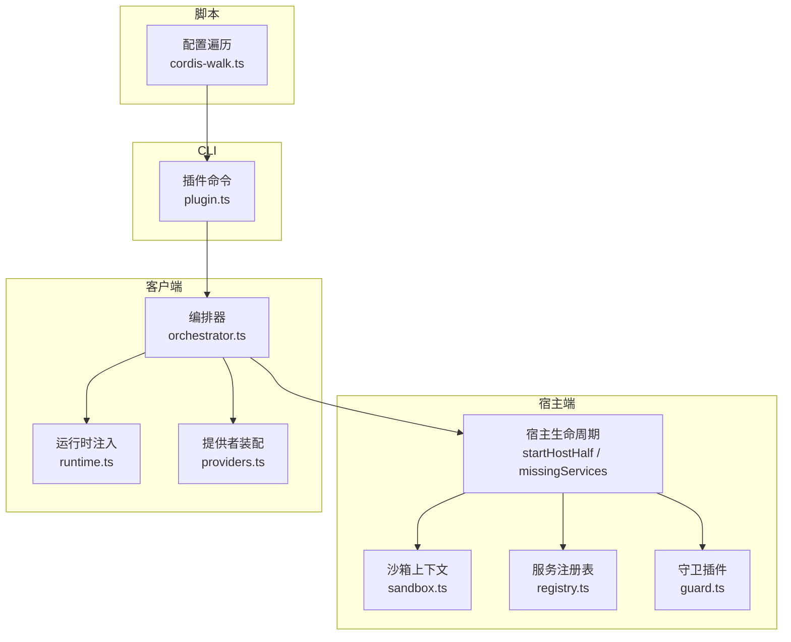
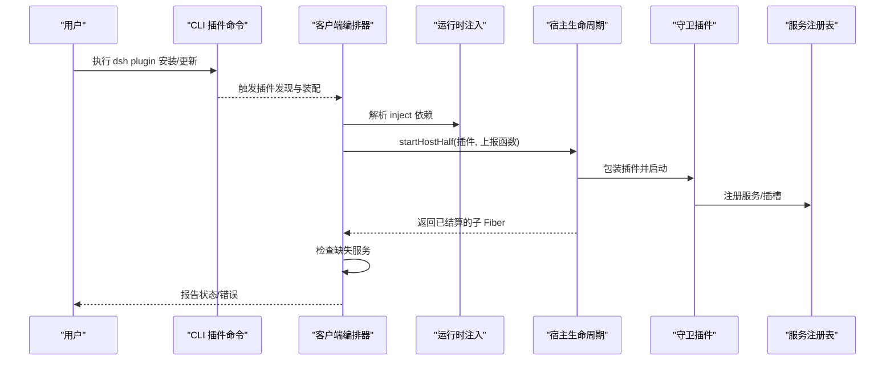
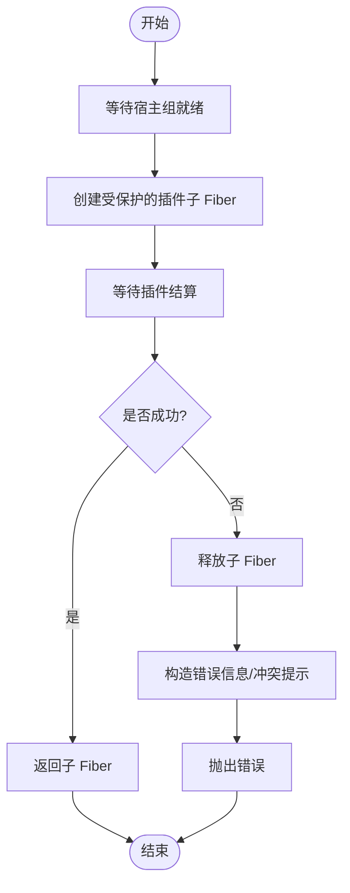
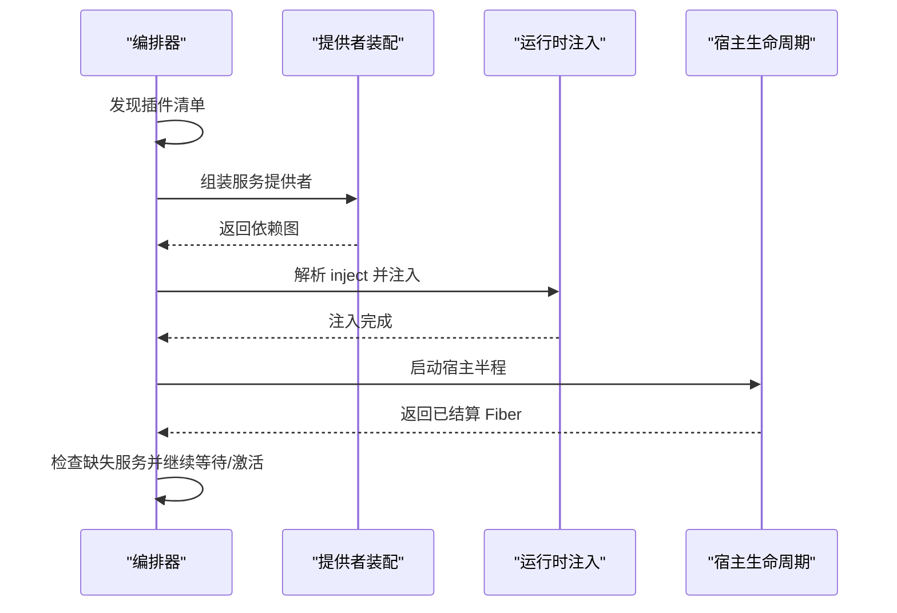
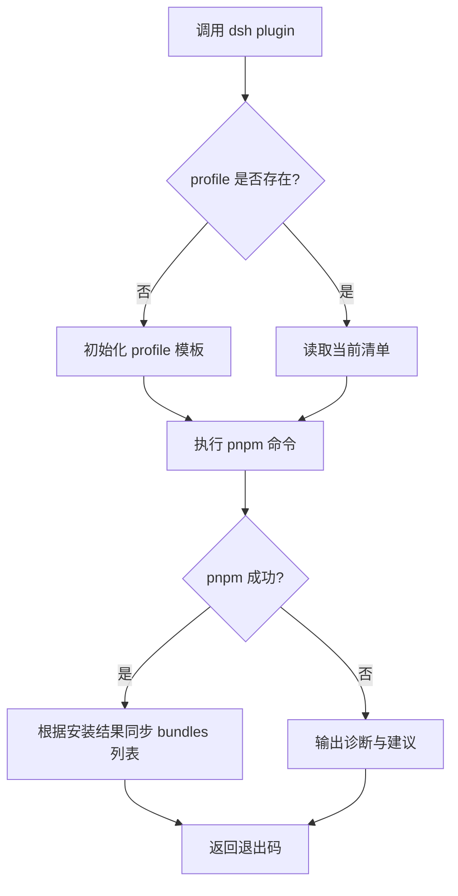
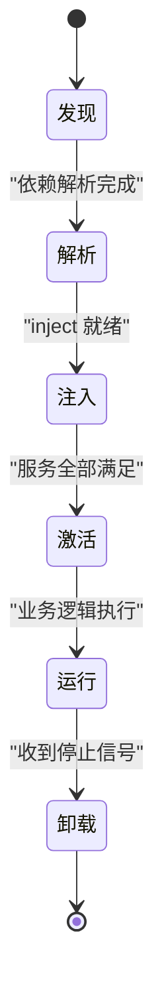
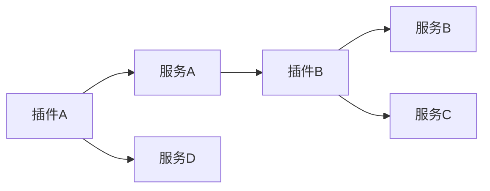

# 插件生命周期管理

<cite>
**本文引用的文件**
- [packages/extensions/cordis-host-runner/src/lifecycle.ts](file://packages/extensions/cordis-host-runner/src/lifecycle.ts)
- [apps/cli/src/plugin.ts](file://apps/cli/src/plugin.ts)
- [packages/extensions/cordis-host-runner/src/sandbox.ts](file://packages/extensions/cordis-host-runner/src/sandbox.ts)
- [packages/extensions/cordis-host-runner/src/registry.ts](file://packages/extensions/cordis-host-runner/src/registry.ts)
- [packages/extensions/cordis-host-runner/src/guard.ts](file://packages/extensions/cordis-host-runner/src/guard.ts)
- [packages/extensions/cordis-client-runner/src/orchestrator.ts](file://packages/extensions/cordis-client-runner/src/orchestrator.ts)
- [packages/extensions/cordis-client-runner/src/runtime.ts](file://packages/extensions/cordis-client-runner/src/runtime.ts)
- [packages/extensions/cordis-client-runner/src/providers.ts](file://packages/extensions/cordis-client-runner/src/providers.ts)
- [packages/extensions/tool-cordis/src/fiber-state.ts](file://packages/extensions/tool-cordis/src/fiber-state.ts)
- [scripts/cordis-walk.ts](file://scripts/cordis-walk.ts)
</cite>

## 目录
1. [简介](#简介)
2. [项目结构](#项目结构)
3. [核心组件](#核心组件)
4. [架构总览](#架构总览)
5. [详细组件分析](#详细组件分析)
6. [依赖关系与加载顺序](#依赖关系与加载顺序)
7. [性能考量](#性能考量)
8. [故障排查指南](#故障排查指南)
9. [结论](#结论)
10. [附录](#附录)

## 简介
本文件围绕 Cordis 插件系统的生命周期展开，系统性地说明插件的发现、加载、初始化、激活与卸载过程；解释状态管理与错误处理机制；阐述插件间依赖解析与加载顺序控制；给出热重载（HMR）在运行时的动态更新思路；并提供生命周期钩子的使用示例与资源管理、内存泄漏防护的实践建议。文档以仓库中宿主端与客户端 runner、CLI 工具及脚本为依据，确保内容可追溯、可验证。

## 项目结构
与插件生命周期密切相关的代码主要分布在以下模块：
- 宿主端 Runner：负责在宿主 Fiber 中启动、守卫、监控并清理插件子 Fiber，提供缺失服务检测等能力。
- 客户端 Runner：负责编排插件发现、注册、依赖解析、运行时注入与事件分发。
- CLI 工具：负责插件包的安装、配置清单同步与层叠（bundle）管理。
- 脚本工具：用于遍历与校验插件配置与依赖图。

图表来源
- [packages/extensions/cordis-host-runner/src/lifecycle.ts:1-58](file://packages/extensions/cordis-host-runner/src/lifecycle.ts#L1-L58)
- [packages/extensions/cordis-host-runner/src/sandbox.ts](file://packages/extensions/cordis-host-runner/src/sandbox.ts)
- [packages/extensions/cordis-host-runner/src/registry.ts](file://packages/extensions/cordis-host-runner/src/registry.ts)
- [packages/extensions/cordis-host-runner/src/guard.ts](file://packages/extensions/cordis-host-runner/src/guard.ts)
- [packages/extensions/cordis-client-runner/src/orchestrator.ts](file://packages/extensions/cordis-client-runner/src/orchestrator.ts)
- [packages/extensions/cordis-client-runner/src/runtime.ts](file://packages/extensions/cordis-client-runner/src/runtime.ts)
- [packages/extensions/cordis-client-runner/src/providers.ts](file://packages/extensions/cordis-client-runner/src/providers.ts)
- [apps/cli/src/plugin.ts:1-159](file://apps/cli/src/plugin.ts#L1-L159)
- [scripts/cordis-walk.ts](file://scripts/cordis-walk.ts)

章节来源
- [packages/extensions/cordis-host-runner/src/lifecycle.ts:1-58](file://packages/extensions/cordis-host-runner/src/lifecycle.ts#L1-L58)
- [apps/cli/src/plugin.ts:1-159](file://apps/cli/src/plugin.ts#L1-L159)

## 核心组件
- 宿主生命周期管理器：封装了“启动宿主半程”和“缺失服务检测”，保证失败的插件不会残留，并在冲突时给出可操作的替换指引。
- 客户端编排器：协调插件发现、注册、依赖解析、运行时注入与服务装配，驱动整个插件生命周期的推进。
- 运行时注入与提供者：为插件提供依赖注入能力，按声明顺序解析 inject 依赖，确保激活时机正确。
- 守卫插件：对插件注册进行保护，拦截非法或危险行为，并将失败上报给上层 Agent。
- CLI 插件命令：维护 profile 的 bundle 层列表，自动将具备 dsh.bundle 的依赖加入层栈，并在安装后同步清单。
- 配置遍历脚本：辅助发现和校验插件配置，支撑构建期与运行期的依赖图生成。

章节来源
- [packages/extensions/cordis-host-runner/src/lifecycle.ts:1-58](file://packages/extensions/cordis-host-runner/src/lifecycle.ts#L1-L58)
- [packages/extensions/cordis-client-runner/src/orchestrator.ts](file://packages/extensions/cordis-client-runner/src/orchestrator.ts)
- [packages/extensions/cordis-client-runner/src/runtime.ts](file://packages/extensions/cordis-client-runner/src/runtime.ts)
- [packages/extensions/cordis-client-runner/src/providers.ts](file://packages/extensions/cordis-client-runner/src/providers.ts)
- [packages/extensions/cordis-host-runner/src/guard.ts](file://packages/extensions/cordis-host-runner/src/guard.ts)
- [apps/cli/src/plugin.ts:1-159](file://apps/cli/src/plugin.ts#L1-L159)
- [scripts/cordis-walk.ts](file://scripts/cordis-walk.ts)

## 架构总览
下图展示了从 CLI 到宿主端的完整生命周期流程：CLI 负责安装与层叠管理；客户端编排器负责发现与装配；宿主端负责安全启动、依赖就绪与清理。

图表来源
- [apps/cli/src/plugin.ts:1-159](file://apps/cli/src/plugin.ts#L1-L159)
- [packages/extensions/cordis-client-runner/src/orchestrator.ts](file://packages/extensions/cordis-client-runner/src/orchestrator.ts)
- [packages/extensions/cordis-client-runner/src/runtime.ts](file://packages/extensions/cordis-client-runner/src/runtime.ts)
- [packages/extensions/cordis-host-runner/src/lifecycle.ts:1-58](file://packages/extensions/cordis-host-runner/src/lifecycle.ts#L1-L58)
- [packages/extensions/cordis-host-runner/src/guard.ts](file://packages/extensions/cordis-host-runner/src/guard.ts)
- [packages/extensions/cordis-host-runner/src/registry.ts](file://packages/extensions/cordis-host-runner/src/registry.ts)

## 详细组件分析

### 宿主生命周期：启动、守护与清理
- 启动宿主半程：在宿主 Fiber 组下创建受保护的插件子 Fiber，等待其结算；若启动失败，立即 dispose 并抛出错误，避免悬挂。
- 冲突提示：当检测到“已注册”类错误时，给出明确的替换步骤提示（先停止旧版本再运行新版本）。
- 缺失服务检测：基于 fiber.inject 声明与实际 Context 中的服务存在性，返回尚未就绪的服务名列表，便于上层决定激活时机或回退策略。

图表来源
- [packages/extensions/cordis-host-runner/src/lifecycle.ts:1-58](file://packages/extensions/cordis-host-runner/src/lifecycle.ts#L1-L58)

章节来源
- [packages/extensions/cordis-host-runner/src/lifecycle.ts:1-58](file://packages/extensions/cordis-host-runner/src/lifecycle.ts#L1-L58)

### 客户端编排器：发现、装配与注入
- 插件发现：扫描可用插件描述与入口，收集待装配清单。
- 依赖解析：根据插件声明的 inject 与 providers，构建依赖图并按拓扑序解析。
- 运行时注入：在插件激活前完成依赖注入，确保服务可用后再进入插件逻辑。
- 事件与状态：通过事件总线与状态机跟踪插件阶段（发现、解析、注入、激活、运行、卸载）。

图表来源
- [packages/extensions/cordis-client-runner/src/orchestrator.ts](file://packages/extensions/cordis-client-runner/src/orchestrator.ts)
- [packages/extensions/cordis-client-runner/src/providers.ts](file://packages/extensions/cordis-client-runner/src/providers.ts)
- [packages/extensions/cordis-client-runner/src/runtime.ts](file://packages/extensions/cordis-client-runner/src/runtime.ts)
- [packages/extensions/cordis-host-runner/src/lifecycle.ts:1-58](file://packages/extensions/cordis-host-runner/src/lifecycle.ts#L1-L58)

章节来源
- [packages/extensions/cordis-client-runner/src/orchestrator.ts](file://packages/extensions/cordis-client-runner/src/orchestrator.ts)
- [packages/extensions/cordis-client-runner/src/providers.ts](file://packages/extensions/cordis-client-runner/src/providers.ts)
- [packages/extensions/cordis-client-runner/src/runtime.ts](file://packages/extensions/cordis-client-runner/src/runtime.ts)

### CLI 插件命令：安装、层叠与清单同步
- 首次使用初始化 profile，并写入默认 bundle 层。
- 转发 pnpm 命令安装/更新依赖，随后根据实际安装结果同步 dsh.profile.bundles 列表。
- 对无 dsh.bundle 声明的依赖给出提示，避免误用。
- 针对 git 依赖 prepare 脚本被阻断的场景，给出工作区白名单配置指引。

图表来源
- [apps/cli/src/plugin.ts:1-159](file://apps/cli/src/plugin.ts#L1-L159)

章节来源
- [apps/cli/src/plugin.ts:1-159](file://apps/cli/src/plugin.ts#L1-L159)

### 守卫插件：注册保护与错误上报
- 在插件启动前包裹一层守卫，拦截非法注册或异常行为。
- 将宿主侧的拒绝错误上报给拥有者 Agent，便于统一告警与处置。
- 与宿主生命周期配合，确保失败路径快速回收资源。

章节来源
- [packages/extensions/cordis-host-runner/src/guard.ts](file://packages/extensions/cordis-host-runner/src/guard.ts)
- [packages/extensions/cordis-host-runner/src/lifecycle.ts:1-58](file://packages/extensions/cordis-host-runner/src/lifecycle.ts#L1-L58)

### 服务注册表与沙箱上下文
- 服务注册表：集中管理服务实例、插槽与版本信息，支持查询与冲突检测。
- 沙箱上下文：为插件提供受限的运行环境，隔离副作用，保障稳定性。

章节来源
- [packages/extensions/cordis-host-runner/src/registry.ts](file://packages/extensions/cordis-host-runner/src/registry.ts)
- [packages/extensions/cordis-host-runner/src/sandbox.ts](file://packages/extensions/cordis-host-runner/src/sandbox.ts)

### 插件状态机与钩子
- 状态机：通过 fiber 状态与外部观察点记录插件的阶段（发现、解析、注入、激活、运行、卸载）。
- 钩子：在关键阶段（如注入前后、激活前后、卸载前）暴露扩展点，供插件或宿主插入自定义逻辑。
- 工具侧状态：tool-cordis 中的 fiber-state 可用于追踪具体工具型插件的状态流转。

图表来源
- [packages/extensions/tool-cordis/src/fiber-state.ts](file://packages/extensions/tool-cordis/src/fiber-state.ts)
- [packages/extensions/cordis-host-runner/src/lifecycle.ts:1-58](file://packages/extensions/cordis-host-runner/src/lifecycle.ts#L1-L58)

章节来源
- [packages/extensions/tool-cordis/src/fiber-state.ts](file://packages/extensions/tool-cordis/src/fiber-state.ts)
- [packages/extensions/cordis-host-runner/src/lifecycle.ts:1-58](file://packages/extensions/cordis-host-runner/src/lifecycle.ts#L1-L58)

## 依赖关系与加载顺序
- 依赖解析：客户端编排器依据插件声明的 inject 与 providers 构建依赖图，按拓扑顺序解析，确保被依赖者优先就绪。
- 加载顺序：宿主端在组 Fiber 内串行启动受保护子 Fiber，避免并发竞争导致的注册冲突。
- 缺失服务：通过 missingServices 检测未就绪服务，上层可据此延迟激活或降级处理。
- 层叠与覆盖：CLI 将具备 dsh.bundle 的依赖加入 profile 层栈，后入层的插件可覆盖前入层的服务定义，实现可控的重写。

图表来源
- [packages/extensions/cordis-client-runner/src/providers.ts](file://packages/extensions/cordis-client-runner/src/providers.ts)
- [packages/extensions/cordis-client-runner/src/runtime.ts](file://packages/extensions/cordis-client-runner/src/runtime.ts)
- [apps/cli/src/plugin.ts:1-159](file://apps/cli/src/plugin.ts#L1-L159)

章节来源
- [packages/extensions/cordis-client-runner/src/providers.ts](file://packages/extensions/cordis-client-runner/src/providers.ts)
- [packages/extensions/cordis-client-runner/src/runtime.ts](file://packages/extensions/cordis-client-runner/src/runtime.ts)
- [apps/cli/src/plugin.ts:1-159](file://apps/cli/src/plugin.ts#L1-L159)

## 性能考量
- 启动开销：宿主端采用“组 Fiber + 子 Fiber”模型，减少全局污染与锁竞争；仅在必要时创建受保护实例。
- 依赖解析：拓扑排序与惰性注入结合，避免不必要的提前计算。
- 资源回收：失败路径立即 dispose，防止悬挂 Fiber 占用内存。
- 热重载：建议在客户端编排器层引入增量更新策略，仅重新加载变更模块，复用稳定服务实例，降低重启成本。

[本节为通用性能建议，不直接引用具体文件]

## 故障排查指南
- 启动冲突（已注册）：当出现“already registered”错误时，先停止旧版本插件 ID，再运行新版本。该提示由宿主生命周期在捕获错误时生成。
- 缺失服务：使用 missingServices 获取尚未就绪的服务名，定位上游提供者是否已装配或是否存在循环依赖。
- 安装失败：CLI 会输出 pnpm 失败原因，并对 git 依赖 prepare 脚本阻断给出白名单配置建议。
- 资源泄漏：确认插件在卸载阶段释放定时器、订阅与句柄；宿主端会在失败时主动 dispose，但插件自身也应遵循最小化持有原则。

章节来源
- [packages/extensions/cordis-host-runner/src/lifecycle.ts:1-58](file://packages/extensions/cordis-host-runner/src/lifecycle.ts#L1-L58)
- [apps/cli/src/plugin.ts:1-159](file://apps/cli/src/plugin.ts#L1-L159)

## 结论
本系统通过宿主端的安全启动与清理、客户端的依赖解析与注入、以及 CLI 的层叠管理，构建了完整的插件生命周期闭环。借助守卫插件与缺失服务检测，系统在错误场景下具备强韧性与可观测性。对于热重载与资源管理，建议在编排层引入增量更新与严格的资源释放契约，进一步提升运行时体验与稳定性。

## 附录

### 生命周期钩子使用示例（概念性）
- 发现阶段：在插件清单扫描完成后，记录元数据并预热缓存。
- 解析阶段：在依赖图构建后，打印依赖树以便调试。
- 注入阶段：在 inject 注入前后，分别记录注入项与校验类型。
- 激活阶段：在服务全部就绪后，启动后台任务或连接外部资源。
- 运行阶段：监听事件总线，执行业务回调。
- 卸载阶段：关闭连接、取消订阅、释放文件句柄与定时器。

[本节为概念性示例，不直接引用具体文件]

### 资源管理与内存泄漏防护
- 最小化持有：仅在需要时创建对象，及时释放引用。
- 明确边界：每个插件在独立 Fiber 中运行，利用 dispose 语义统一回收。
- 防泄漏清单：网络请求取消、定时器清理、事件解绑、文件句柄关闭。
- 监控与审计：在宿主端统计 Fiber 数量与存活时间，定期巡检异常增长。

[本节为通用实践建议，不直接引用具体文件]