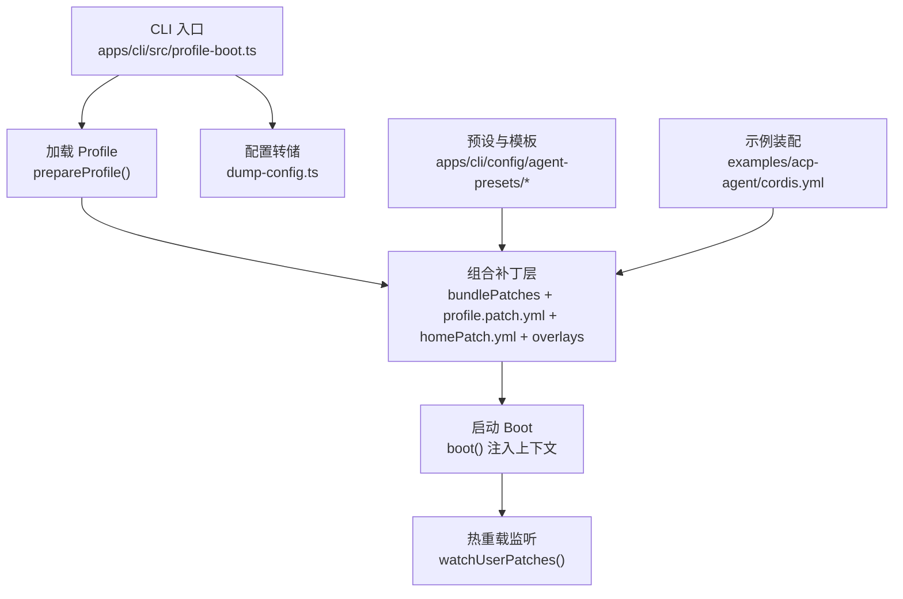
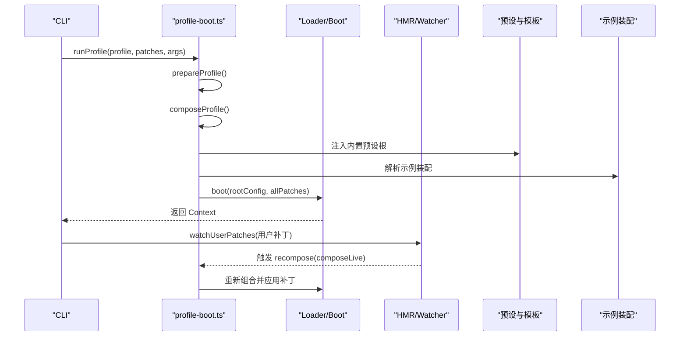
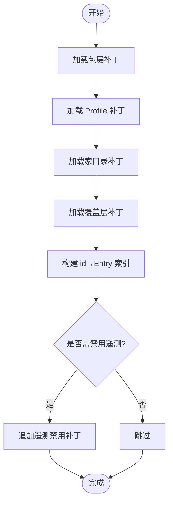
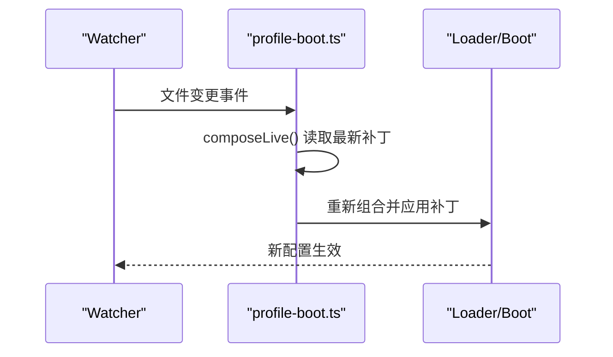
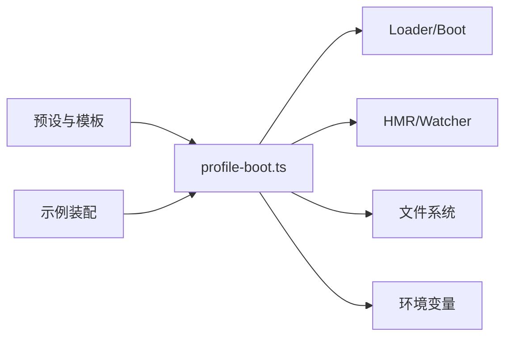

# 插件配置系统

<cite>
**本文引用的文件**
- [profile-boot.ts](file://apps/cli/src/profile-boot.ts)
- [dump-config.ts](file://apps/cli/src/dump-config.ts)
- [config-catalog.md](file://docs/config-catalog.md)
- [agent.cordis.yml（标准预设）](file://apps/cli/config/agent-presets/standard/agent.cordis.yml)
- [preset.yml（标准预设）](file://apps/cli/config/agent-presets/standard/preset.yml)
- [cordis.yml（ACP 示例）](file://examples/acp-agent/cordis.yml)
</cite>

## 目录
1. [简介](#简介)
2. [项目结构](#项目结构)
3. [核心组件](#核心组件)
4. [架构总览](#架构总览)
5. [详细组件分析](#详细组件分析)
6. [依赖关系分析](#依赖关系分析)
7. [性能考量](#性能考量)
8. [故障排查指南](#故障排查指南)
9. [结论](#结论)
10. [附录](#附录)

## 简介
本文件系统性介绍 DeepSeek Harness 的插件配置系统，覆盖以下主题：
- 配置文件结构与语法：支持 YAML、JSON 等格式；通过 cordis.yml 描述插件装配与配置。
- 配置的继承与覆盖机制：基于“补丁层”的分层组合，实现可预测的优先级覆盖。
- 配置验证与默认值：由运行时 schema 校验与插件声明类型共同保障一致性。
- 配置热重载：在运行期监听用户补丁文件变更并动态重组配置。
- 配置模板与预设：提供内置 Agent 预设与可复用模板，简化常见场景。
- 迁移与版本兼容：通过生成式配置目录与 schema 交叉校验，降低演进风险。

## 项目结构
配置系统围绕 CLI 启动流程与“补丁层”组合展开，关键位置如下：
- CLI 启动与配置组装：apps/cli/src/profile-boot.ts
- 配置转储工具：apps/cli/src/dump-config.ts
- 配置目录与类型参考：docs/config-catalog.md
- 预设与模板：apps/cli/config/agent-presets/*
- 示例装配：examples/acp-agent/cordis.yml

图表来源
- [profile-boot.ts:98-171](file://apps/cli/src/profile-boot.ts#L98-L171)
- [profile-boot.ts:207-299](file://apps/cli/src/profile-boot.ts#L207-L299)
- [dump-config.ts:30-52](file://apps/cli/src/dump-config.ts#L30-L52)

章节来源
- [profile-boot.ts:98-171](file://apps/cli/src/profile-boot.ts#L98-L171)
- [profile-boot.ts:207-299](file://apps/cli/src/profile-boot.ts#L207-L299)
- [dump-config.ts:30-52](file://apps/cli/src/dump-config.ts#L30-L52)

## 核心组件
- 配置装载与组合
  - prepareProfile：准备 Profile 根配置与模块回退修复，确保 Loader 有稳定锚点。
  - composeProfile：按固定顺序组合补丁层（包层 → 用户层 → 家目录层 → 覆盖层），构建行索引。
  - allPatches：汇总所有补丁层用于 boot 初始装配。
- 热重载
  - watchUserPatches：监听用户补丁文件变化，使用结构化克隆避免引用共享导致的污染。
  - 自动挂载 HMR：当宿主未提供 HMR 时，按需挂载轻量 HMR 服务以支持配置热更新。
- 配置转储
  - dump-config：在不启动应用的情况下，输出带注释的完整配置树，便于诊断与审计。
- 预设与模板
  - 内置 Agent 预设：位于 apps/cli/config/agent-presets，包含 agent.cordis.yml 与 preset.yml。
  - 预设元信息：name、description、order 等，供选择与排序。
- 配置目录与类型
  - docs/config-catalog.md：自动生成各插件的配置接口与依赖说明，作为部署侧参考。

章节来源
- [profile-boot.ts:98-171](file://apps/cli/src/profile-boot.ts#L98-L171)
- [profile-boot.ts:207-299](file://apps/cli/src/profile-boot.ts#L207-L299)
- [dump-config.ts:30-52](file://apps/cli/src/dump-config.ts#L30-L52)
- [agent.cordis.yml（标准预设）:1-252](file://apps/cli/config/agent-presets/standard/agent.cordis.yml#L1-L252)
- [preset.yml（标准预设）:1-4](file://apps/cli/config/agent-presets/standard/preset.yml#L1-L4)
- [config-catalog.md:1-800](file://docs/config-catalog.md#L1-L800)

## 架构总览
配置系统采用“补丁层”分层组合模型，保证可预测的覆盖顺序与可观测性：
- 包层（Bundle Layers）：来自 dsh.profile.bundles，定义基础能力栈。
- 用户层（Profile Patch）：每个 Profile 的 cordis.patch.yml，进行业务定制。
- 家目录层（Home Patch）：$DSH_HOME/cordis.patch.yml，跨 Profile 的全局偏好。
- 覆盖层（Overlays）：命令行 --patch 传入的覆盖文件，最高优先级。
- 遥测开关：根据环境变量注入禁用补丁，确保隐私优先。

图表来源
- [profile-boot.ts:142-171](file://apps/cli/src/profile-boot.ts#L142-L171)
- [profile-boot.ts:207-299](file://apps/cli/src/profile-boot.ts#L207-L299)

章节来源
- [profile-boot.ts:142-171](file://apps/cli/src/profile-boot.ts#L142-L171)
- [profile-boot.ts:207-299](file://apps/cli/src/profile-boot.ts#L207-L299)

## 详细组件分析

### 配置装载与组合（补丁层）
- 设计要点
  - 固定顺序：包层 → 用户层 → 家目录层 → 覆盖层，确保可预期覆盖。
  - 行索引：为每个 id 维护 EntryOptions 映射，便于后续定位与检查。
  - 安全与健壮：遥测开关强制关闭时插入补丁；空根配置保证 Loader 稳定性。
- 复杂度
  - 组合过程线性扫描补丁数组，时间复杂度 O(n)。
  - 行索引构建为 O(n)，查找 O(1)。
- 优化机会
  - 对超大补丁集可使用增量合并策略减少重复计算。
  - 缓存已解析的补丁对象，避免重复 I/O。

图表来源
- [profile-boot.ts:142-171](file://apps/cli/src/profile-boot.ts#L142-L171)

章节来源
- [profile-boot.ts:142-171](file://apps/cli/src/profile-boot.ts#L142-L171)

### 热重载机制
- 设计要点
  - 监听用户补丁文件（Profile patch 与 Home patch）。
  - 每次重组前进行结构化克隆，避免引用共享导致的状态污染。
  - 若宿主未提供 HMR，则按需挂载轻量 HMR 服务，确保配置热更新可用。
- 错误处理
  - 在进程退出或 Fiber 非活动状态下抑制 watcher 设置失败，避免误报。
- 性能考虑
  - 仅监听必要文件，重组时使用最小化补丁集合。
  - 避免频繁重建整个树，尽量增量应用补丁。

图表来源
- [profile-boot.ts:227-299](file://apps/cli/src/profile-boot.ts#L227-L299)

章节来源
- [profile-boot.ts:227-299](file://apps/cli/src/profile-boot.ts#L227-L299)

### 配置转储与诊断
- 功能
  - 不启动应用即可输出完整配置树，标注每层来源与补丁。
  - 支持忽略用户层与覆盖层，便于对比基线。
- 使用场景
  - 调试 cordis.patch.yml 解析问题。
  - 审计最终装配结果，确认覆盖顺序与行为。

章节来源
- [dump-config.ts:30-52](file://apps/cli/src/dump-config.ts#L30-L52)

### 预设与模板系统
- 内置预设
  - 标准模式：提供完整的编码 Agent 能力（Shell、FS、Skills、计划、目标、子代理、工作流）。
  - 最小模式：精简能力集，适合快速体验。
  - 其他预设：如 code、cordis 等，针对不同场景。
- 元数据
  - name、description、order：用于 UI 展示与排序。
- 作用域与隔离
  - 预设中的服务需在 isolate realm 中注册，避免进程级冲突。
  - 工具与注册表可在宿主平面共享，但行为受会话范围控制。

章节来源
- [agent.cordis.yml（标准预设）:1-252](file://apps/cli/config/agent-presets/standard/agent.cordis.yml#L1-L252)
- [preset.yml（标准预设）:1-4](file://apps/cli/config/agent-presets/standard/preset.yml#L1-L4)

### 配置验证与默认值
- 验证机制
  - 运行时 schema 校验：确保键名与嵌套结构合法。
  - 插件声明类型：通过 JSDoc 与 TypeScript 接口约束配置字段。
  - 生成式配置目录：docs/config-catalog.md 自动同步插件配置接口，交叉校验 schema。
- 默认值处理
  - 插件内部提供默认值，缺失字段时回退到安全默认。
  - 某些关键配置要求显式设置（如 workspaceContext 需要字节预算或 false）。
- 一致性保障
  - 任何 schema 验证通过的键必须在声明类型中可定位，防止隐藏字段。

章节来源
- [config-catalog.md:1-800](file://docs/config-catalog.md#L1-L800)

### 配置迁移与版本兼容
- 生成式文档与校验
  - 配置目录由脚本生成，确保与源码一致。
  - 变更时需更新声明类型与 schema，否则 CI 会失败。
- 渐进式迁移
  - 通过补丁层逐步替换旧配置，避免一次性大改。
  - 使用 --patch 覆盖层进行灰度验证。
- 兼容性策略
  - 保留旧字段兼容逻辑，逐步弃用。
  - 在预设与示例中体现最佳实践，引导用户迁移。

章节来源
- [config-catalog.md:1-800](file://docs/config-catalog.md#L1-L800)

## 依赖关系分析
- 组件耦合
  - profile-boot.ts 依赖 Loader、HMR、Timer 等服务，解耦于具体插件实现。
  - 预设与示例通过 cordis.yml 声明依赖，无需硬编码。
- 外部集成
  - 环境变量：如 DSH_TELEMETRY_DISABLED、DSH_PERMISSION_MODE。
  - 文件系统：监听用户补丁文件，读取预设与示例配置。
- 循环依赖
  - 通过 Provider/Service 注册表解耦，避免直接导入循环。

图表来源
- [profile-boot.ts:207-299](file://apps/cli/src/profile-boot.ts#L207-L299)

章节来源
- [profile-boot.ts:207-299](file://apps/cli/src/profile-boot.ts#L207-L299)

## 性能考量
- 补丁层组合
  - 线性复杂度，适用于中等规模配置。
  - 建议将常用配置放入预设，减少重复。
- 热重载
  - 仅监听必要文件，避免全量扫描。
  - 使用结构化克隆防止内存泄漏。
- 资源限制
  - 插件内部对内存、CPU、I/O 进行限制，防止单点故障影响整体。

[本节提供通用指导，无需特定文件引用]

## 故障排查指南
- 常见问题
  - 配置解析失败：检查 YAML/JSON 语法与 schema 校验错误。
  - 覆盖顺序不符：使用 dump-config 查看最终装配结果。
  - 热重载无效：确认 HMR 服务已挂载且文件监听正常。
- 诊断步骤
  - 运行配置转储，对比基线与当前配置。
  - 逐步移除补丁层，定位问题来源。
  - 检查环境变量与权限设置。

章节来源
- [dump-config.ts:30-52](file://apps/cli/src/dump-config.ts#L30-L52)
- [profile-boot.ts:227-299](file://apps/cli/src/profile-boot.ts#L227-L299)

## 结论
DeepSeek Harness 的插件配置系统通过“补丁层”分层组合、严格的验证机制、热重载能力以及预设模板，提供了灵活、可靠且易用的配置管理方案。开发者可借助生成式配置目录与示例装配，快速上手并安全演进配置。

[本节总结内容，无需特定文件引用]

## 附录
- 示例装配参考：examples/acp-agent/cordis.yml
- 预设与模板：apps/cli/config/agent-presets/*
- 配置目录与类型：docs/config-catalog.md

章节来源
- [cordis.yml（ACP 示例）:1-193](file://examples/acp-agent/cordis.yml#L1-L193)
- [agent.cordis.yml（标准预设）:1-252](file://apps/cli/config/agent-presets/standard/agent.cordis.yml#L1-L252)
- [preset.yml（标准预设）:1-4](file://apps/cli/config/agent-presets/standard/preset.yml#L1-L4)
- [config-catalog.md:1-800](file://docs/config-catalog.md#L1-L800)