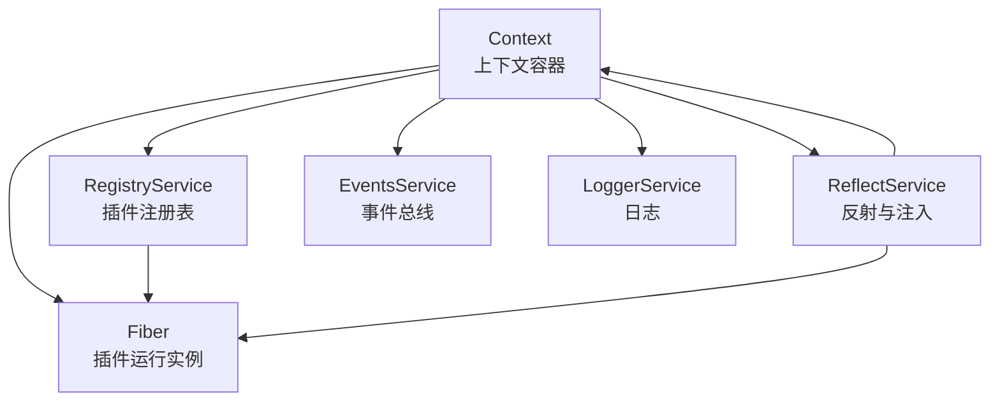
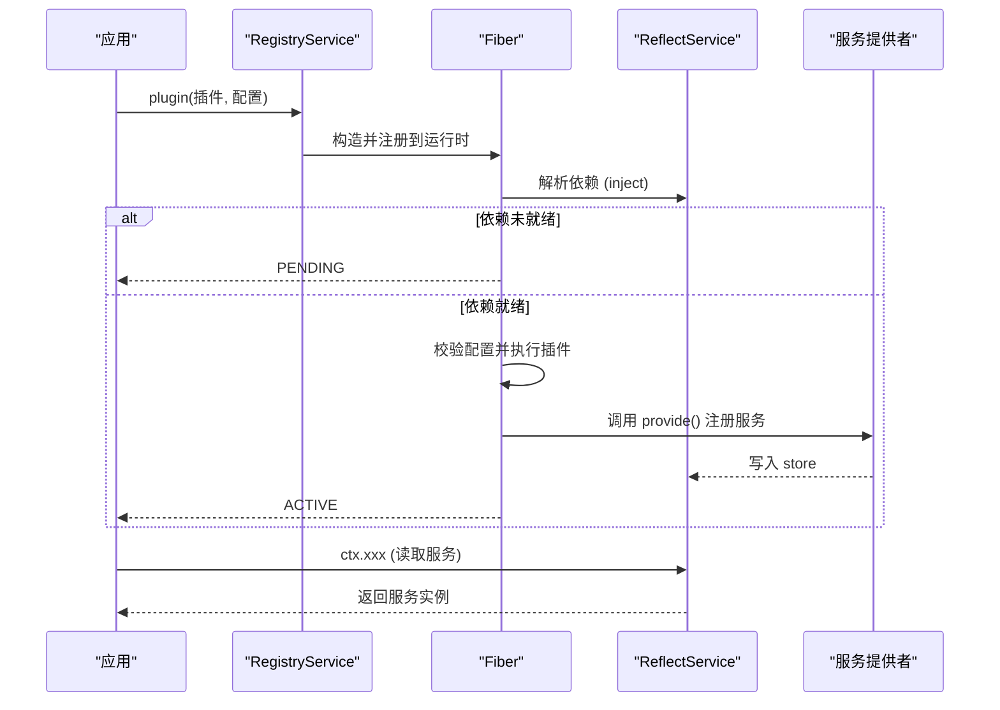
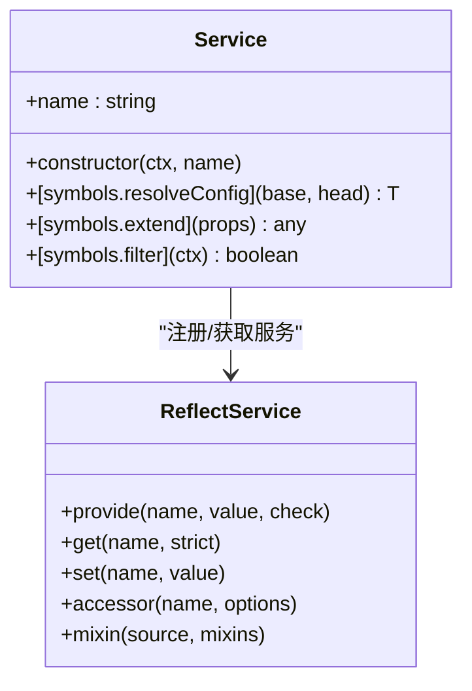
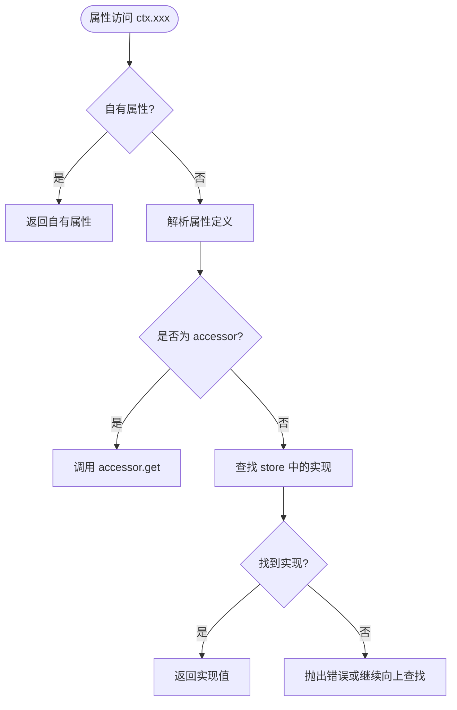
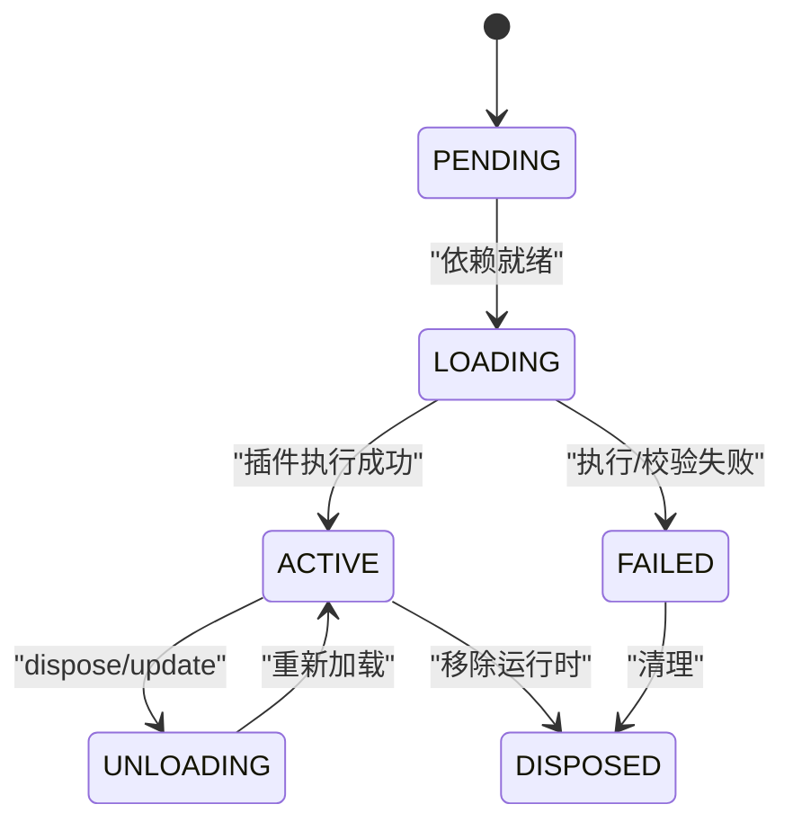
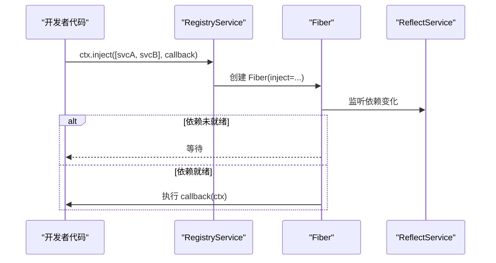
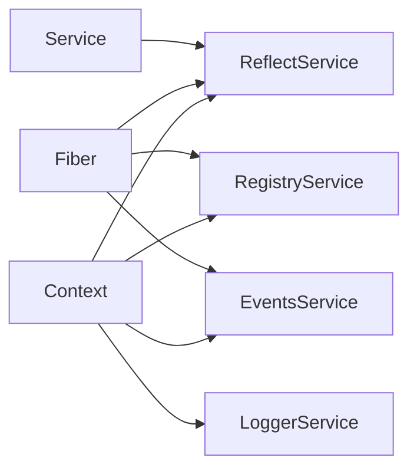

# 服务注册与发现

<cite>
**本文引用的文件**
- [registry.ts](file://vendor/cordis/src/registry.ts)
- [service.ts](file://vendor/cordis/src/service.ts)
- [context.ts](file://vendor/cordis/src/context.ts)
- [fiber.ts](file://vendor/cordis/src/fiber.ts)
- [reflect.ts](file://vendor/cordis/src/reflect.ts)
- [events.ts](file://vendor/cordis/src/events.ts)
- [logger.ts](file://vendor/cordis/src/logger.ts)
</cite>

## 目录
1. [简介](#简介)
2. [项目结构](#项目结构)
3. [核心组件](#核心组件)
4. [架构总览](#架构总览)
5. [详细组件分析](#详细组件分析)
6. [依赖关系分析](#依赖关系分析)
7. [性能考量](#性能考量)
8. [故障排查指南](#故障排查指南)
9. [结论](#结论)
10. [附录：API参考](#附录api参考)

## 简介
本文件深入解析 Cordis 框架中的“服务注册与发现”机制，围绕以下目标展开：
- 服务接口的定义规范与统一契约（通过 Service 基类与反射层）
- 服务容器的设计模式（Context + ReflectService + Fiber）
- 依赖注入的实现原理（@Inject、ctx.inject、插件生命周期）
- 循环依赖与服务版本兼容性的处理策略
- 服务注册的 API（同步/异步）
- 服务发现算法（按名称、类型、元数据查找）
- 服务监控与健康检查（事件、状态、可用性断言）

## 项目结构
Cordis 的核心由以下模块组成：
- Context：上下文容器，提供隔离作用域、拦截配置、扩展能力
- RegistryService：插件注册表，管理插件运行时与 Fiber 生命周期
- Fiber：插件运行实例，负责依赖就绪检测、配置校验、加载/卸载
- ReflectService：反射与依赖注入层，实现 ctx.get/provide/set/mixin/accessor
- Service：服务基类，封装命名服务的注册、可调用包装、配置合并
- Events/Logger：事件总线与日志，用于监控、健康检查与诊断

图表来源
- [context.ts:70-84](file://vendor/cordis/src/context.ts#L70-L84)
- [registry.ts:195-337](file://vendor/cordis/src/registry.ts#L195-L337)
- [fiber.ts:184-333](file://vendor/cordis/src/fiber.ts#L184-L333)
- [reflect.ts:133-223](file://vendor/cordis/src/reflect.ts#L133-L223)

章节来源
- [context.ts:70-84](file://vendor/cordis/src/context.ts#L70-L84)
- [registry.ts:195-337](file://vendor/cordis/src/registry.ts#L195-L337)
- [fiber.ts:184-333](file://vendor/cordis/src/fiber.ts#L184-L333)
- [reflect.ts:133-223](file://vendor/cordis/src/reflect.ts#L133-L223)

## 核心组件
- 服务接口与契约
  - Service 基类提供统一的命名服务注册、可调用包装、配置合并与追踪。子类通过构造函数将自身注册到当前 Context 的 reflect store，并支持可选的可用性断言 check。
- 服务容器与作用域
  - Context 是代理对象，属性读取走 ReflectService 的 get 路径；支持 isolate（隔离作用域）、intercept（拦截配置）、extend（子上下文）。
- 插件与生命周期
  - RegistryService 管理插件运行时与 Fiber；Fiber 维护依赖状态、配置校验、加载/卸载、重启与更新。
- 依赖注入
  - @Inject 装饰器声明依赖；ctx.inject 等待依赖就绪后执行回调；ReflectService 在属性访问时解析服务。

章节来源
- [service.ts:11-116](file://vendor/cordis/src/service.ts#L11-L116)
- [context.ts:42-147](file://vendor/cordis/src/context.ts#L42-L147)
- [registry.ts:195-337](file://vendor/cordis/src/registry.ts#L195-L337)
- [fiber.ts:184-755](file://vendor/cordis/src/fiber.ts#L184-L755)
- [reflect.ts:133-419](file://vendor/cordis/src/reflect.ts#L133-L419)

## 架构总览
下图展示从插件加载到服务发现的关键流程：插件通过 RegistryService.plugin 创建 Fiber；Fiber 根据 inject 声明收集依赖；当依赖就绪，Fiber 进入 ACTIVE 并执行插件逻辑；ReflectService 在 ctx 属性访问时解析服务；变更触发通知，驱动依赖方重新激活。

图表来源
- [registry.ts:316-337](file://vendor/cordis/src/registry.ts#L316-L337)
- [fiber.ts:222-333](file://vendor/cordis/src/fiber.ts#L222-L333)
- [reflect.ts:135-171](file://vendor/cordis/src/reflect.ts#L135-L171)
- [service.ts:42-58](file://vendor/cordis/src/service.ts#L42-L58)

## 详细组件分析

### 服务接口定义规范（Service 基类）
- 命名注册：Service 构造函数中调用 ctx.reflect.provide(name, this, check)，自动绑定到 fiber 生命周期。
- 可调用服务：若实现 [invoke]，则包装为可调用函数，便于以 ctx.name(...) 方式调用。
- 配置合并：通过 [resolveConfig] 合并祖先拦截配置与 base/head 配置，支持自定义 Config.merge。
- 追踪与过滤：内置 tracker 与 filter，便于调试与作用域隔离。

图表来源
- [service.ts:11-116](file://vendor/cordis/src/service.ts#L11-L116)
- [reflect.ts:277-305](file://vendor/cordis/src/reflect.ts#L277-L305)

章节来源
- [service.ts:11-116](file://vendor/cordis/src/service.ts#L11-L116)

### 服务容器与作用域（Context + ReflectService）
- Context 作为代理，所有属性访问经 ReflectService.handler 路由。
- isolate：为指定服务名建立独立作用域，避免父作用域污染。
- intercept：为下游插件提供针对某服务的拦截配置，参与 Service 的配置合并。
- mixin：将服务方法直接暴露到 ctx，简化调用。

图表来源
- [reflect.ts:135-206](file://vendor/cordis/src/reflect.ts#L135-L206)
- [context.ts:99-145](file://vendor/cordis/src/context.ts#L99-L145)

章节来源
- [context.ts:99-145](file://vendor/cordis/src/context.ts#L99-L145)
- [reflect.ts:135-206](file://vendor/cordis/src/reflect.ts#L135-L206)

### 插件与生命周期（RegistryService + Fiber）
- 插件形状：函数、类、或含 apply 的对象；均被归一化为可执行回调。
- 运行时记录：每个唯一回调对应一个 Plugin.Runtime，持有 fibers 列表与配置校验器。
- Fiber 状态机：PENDING → LOADING → ACTIVE → UNLOADING → DISPOSED；失败进入 FAILED。
- 依赖就绪：Fiber 持续检查 inject 映射中的服务是否可用，变化时刷新 epoch 并触发重载/卸载。
- 配置校验：基于 StandardSchemaV1，启动前校验，失败抛出 ValidationError。

图表来源
- [fiber.ts:147-154](file://vendor/cordis/src/fiber.ts#L147-L154)
- [fiber.ts:581-696](file://vendor/cordis/src/fiber.ts#L581-L696)
- [registry.ts:316-337](file://vendor/cordis/src/registry.ts#L316-L337)

章节来源
- [fiber.ts:184-755](file://vendor/cordis/src/fiber.ts#L184-L755)
- [registry.ts:195-337](file://vendor/cordis/src/registry.ts#L195-L337)

### 依赖注入实现原理
- @Inject 装饰器：在类或方法上声明依赖，并在初始化时延迟到依赖就绪再执行。
- ctx.inject：等价于 ctx.plugin({ inject, apply })，在依赖变化时自动卸载并重载。
- 注入解析：Fiber 构造时为 inject 项设置拦截配置；ReflectService 在属性访问时按作用域查找 store。

图表来源
- [registry.ts:300-302](file://vendor/cordis/src/registry.ts#L300-L302)
- [fiber.ts:234-319](file://vendor/cordis/src/fiber.ts#L234-L319)
- [reflect.ts:135-171](file://vendor/cordis/src/reflect.ts#L135-L171)

章节来源
- [registry.ts:300-302](file://vendor/cordis/src/registry.ts#L300-L302)
- [fiber.ts:234-319](file://vendor/cordis/src/fiber.ts#L234-L319)
- [reflect.ts:135-171](file://vendor/cordis/src/reflect.ts#L135-L171)

### 循环依赖与服务版本兼容性
- 循环依赖
  - 通过惰性解析与依赖就绪通知避免死锁：ReflectService 仅在需要时解析服务；Fiber 在依赖变化时重新评估，而非立即求值。
  - 使用 availability predicate（check）推迟服务可见性，直到内部状态满足条件。
- 版本兼容
  - 通过 Service.Config.merge 实现配置的渐进式合并；不同版本的插件可通过拦截配置覆盖默认行为。
  - Fiber.update 支持热更新与配置变更，配合 internal/update 钩子进行兼容性处理。

章节来源
- [reflect.ts:277-305](file://vendor/cordis/src/reflect.ts#L277-L305)
- [fiber.ts:736-753](file://vendor/cordis/src/fiber.ts#L736-L753)
- [service.ts:86-102](file://vendor/cordis/src/service.ts#L86-L102)

### 服务监控与健康检查
- 事件监控
  - internal/plugin：插件生命周期事件（创建、销毁等）。
  - internal/status：Fiber 状态变更事件。
  - internal/service：服务提供/变更事件。
- 健康检查
  - Service.check：可用性断言，Fiber 在依赖检查时调用，不满足则视为不可用。
  - Fiber.state：外部可观测的状态机，结合事件可实现健康探针。

章节来源
- [fiber.ts:119-137](file://vendor/cordis/src/fiber.ts#L119-L137)
- [fiber.ts:581-595](file://vendor/cordis/src/fiber.ts#L581-L595)
- [reflect.ts:277-305](file://vendor/cordis/src/reflect.ts#L277-L305)

## 依赖关系分析
- 低耦合高内聚：Context 仅暴露必要能力；ReflectService 专注注入与代理；Fiber 专注生命周期；Service 抽象服务契约。
- 关键依赖链
  - Context 依赖 ReflectService、RegistryService、EventsService、LoggerService。
  - Fiber 依赖 RegistryService（获取运行时）、ReflectService（依赖解析）、EventsService（状态/插件事件）。
  - Service 依赖 ReflectService 完成注册与可调用包装。

图表来源
- [context.ts:70-84](file://vendor/cordis/src/context.ts#L70-L84)
- [fiber.ts:222-333](file://vendor/cordis/src/fiber.ts#L222-L333)
- [service.ts:42-58](file://vendor/cordis/src/service.ts#L42-L58)

章节来源
- [context.ts:70-84](file://vendor/cordis/src/context.ts#L70-L84)
- [fiber.ts:222-333](file://vendor/cordis/src/fiber.ts#L222-L333)
- [service.ts:42-58](file://vendor/cordis/src/service.ts#L42-L58)

## 性能考量
- 惰性解析：服务仅在首次访问时解析，减少启动开销。
- 批量通知：ReflectService.notify 对多个依赖变更进行聚合通知，降低重复计算。
- 作用域隔离：isolate 避免不必要的跨作用域查找，提升查找效率。
- 配置合并优化：Service.resolveConfig 支持自定义 merge，避免浅拷贝带来的额外开销。

## 故障排查指南
- 常见错误
  - “cannot get property ... without inject”：在尚未提供所需服务时访问了属性。
  - “cannot set property ... without provide”：尝试设置未提供的服务。
  - “service ... has been registered at <...>”：同一作用域重复注册同名服务。
- 定位步骤
  - 查看 Fiber.state 与 internal/status 事件，确认插件是否处于 ACTIVE。
  - 检查 Service.check 断言是否满足，必要时调整依赖顺序或延迟提供。
  - 使用 ctx.registry.values() 与 runtime.fibers 观察插件实例数量与状态。
- 恢复手段
  - 调用 Fiber.update 更新配置并重启。
  - 通过 Fiber.dispose 清理异常状态后重新加载。

章节来源
- [reflect.ts:135-206](file://vendor/cordis/src/reflect.ts#L135-L206)
- [reflect.ts:277-305](file://vendor/cordis/src/reflect.ts#L277-L305)
- [fiber.ts:581-696](file://vendor/cordis/src/fiber.ts#L581-L696)

## 结论
Cordis 的服务注册与发现机制以 Context 为中心，结合 ReflectService 的代理与注入、Fiber 的生命周期管理以及 Service 的统一契约，实现了高内聚、可扩展且可观测的插件化架构。通过依赖就绪驱动的重载机制、作用域隔离与拦截配置，系统既能避免循环依赖问题，又能平滑支持版本演进与热更新。事件与状态机提供了完善的监控与健康检查能力，便于在生产环境中进行诊断与运维。

## 附录：API参考

### 服务注册 API（同步/异步）
- 同步注册
  - ctx.reflect.provide(name, value, check)：在当前 fiber 下注册服务，返回 disposer。
  - Service 基类构造函数：自动调用 provide 完成注册。
- 异步注册
  - Fiber.effect：在 effect 中注册异步资源，返回 disposer；Fiber 卸载时按逆序清理。
  - Fiber.update：更新配置并重启插件，支持异步更新流程。

章节来源
- [reflect.ts:277-305](file://vendor/cordis/src/reflect.ts#L277-L305)
- [fiber.ts:415-561](file://vendor/cordis/src/fiber.ts#L415-L561)
- [fiber.ts:736-753](file://vendor/cordis/src/fiber.ts#L736-L753)

### 服务发现算法（按名称、类型、元数据）
- 按名称查找
  - ctx.reflect.get(name, strict)：按名称解析服务，strict=true 时要求提供 fiber 处于 ACTIVE。
  - ctx.xxx：通过代理自动解析，遵循作用域与拦截配置。
- 按类型查找
  - 无直接 API；可通过 Service 的静态标识与 instanceof 判断类型，结合 ReflectService.store 遍历匹配。
- 按元数据查找
  - 通过 Service.Config.merge 与拦截配置携带元数据；在 resolveConfig 中合并并消费。

章节来源
- [reflect.ts:233-243](file://vendor/cordis/src/reflect.ts#L233-L243)
- [service.ts:86-102](file://vendor/cordis/src/service.ts#L86-L102)

### 服务监控与健康检查
- 事件
  - internal/plugin：插件创建/销毁。
  - internal/status：Fiber 状态变更。
  - internal/service：服务提供/变更。
- 健康检查
  - Service.check：可用性断言。
  - Fiber.state：外部可观测状态。

章节来源
- [fiber.ts:119-137](file://vendor/cordis/src/fiber.ts#L119-L137)
- [fiber.ts:581-595](file://vendor/cordis/src/fiber.ts#L581-L595)
- [reflect.ts:277-305](file://vendor/cordis/src/reflect.ts#L277-L305)