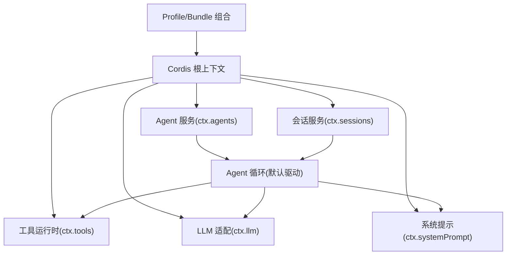
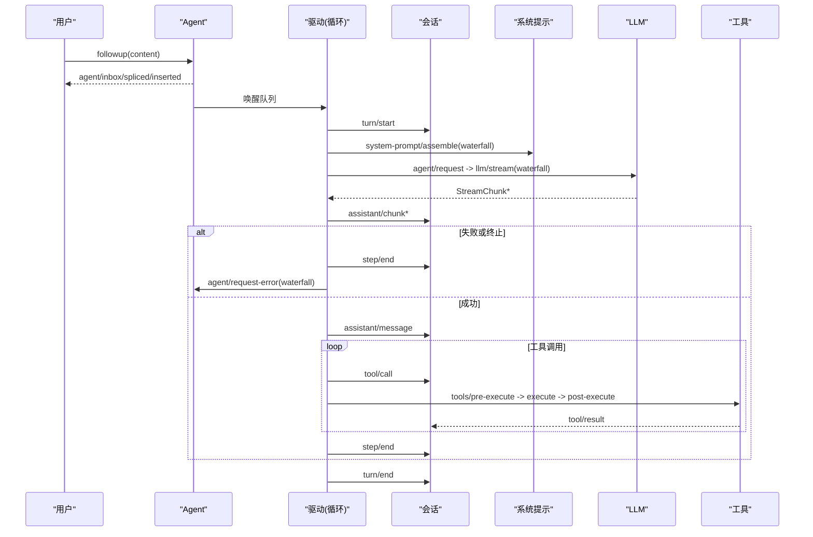
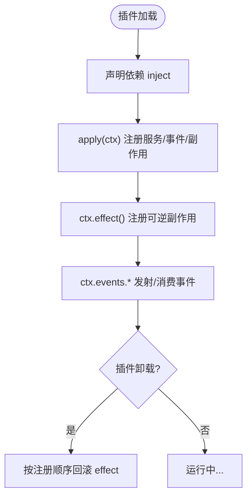
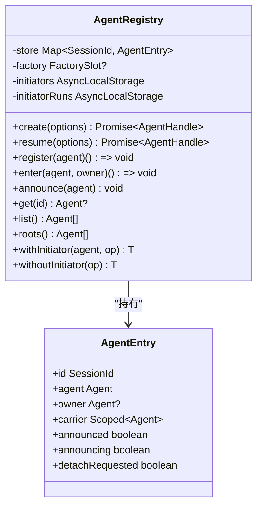
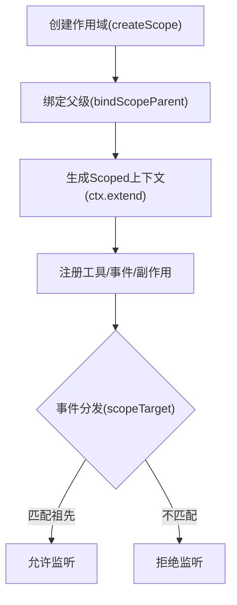
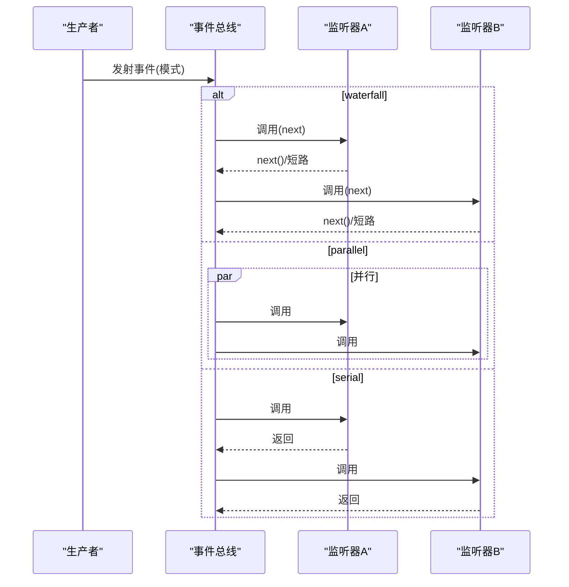
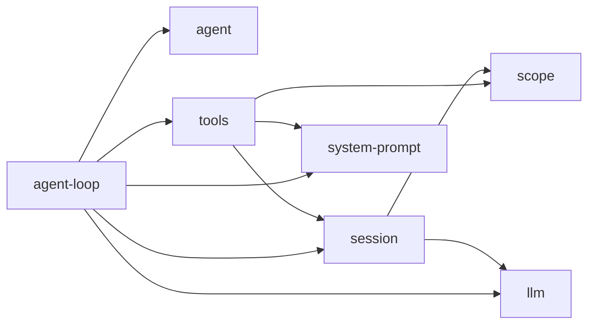

# 核心概念

<cite>
**本文引用的文件**
- [架构总览](file://docs/architecture.md)
- [Cordis 入门](file://docs/cordis-primer.md)
- [Cordis 教程索引](file://docs/cordis-tutorial/index.md)
- [事件生产者与消费者矩阵](file://docs/event-producer-consumer.md)
- [Agent 轮次与步骤生命周期](file://docs/agent-lifecycle.md)
- [作用域注册（Scope）](file://docs/subsystems/scope.md)
- [Agent 服务实现](file://packages/core/agent/src/index.ts)
- [会话服务实现](file://packages/core/session/src/index.ts)
- [工具运行时与执行管线](file://packages/core/tools/src/index.ts)
</cite>

## 目录
1. [简介](#简介)
2. [项目结构](#项目结构)
3. [核心组件](#核心组件)
4. [架构总览](#架构总览)
5. [详细组件分析](#详细组件分析)
6. [依赖关系分析](#依赖关系分析)
7. [性能考量](#性能考量)
8. [故障排查指南](#故障排查指南)
9. [结论](#结论)
10. [附录](#附录)

## 简介
本文件面向初学者与高级用户，系统阐述 DeepSeek Harness 的核心概念与架构原理：以 Cordis 插件框架为基础，围绕 Agent 生命周期、作用域与上下文隔离、事件驱动架构展开；解释插件化如何实现松耦合与高内聚，并通过 Agent 注册表、服务发现、依赖注入等机制扩展能力。文档同时提供架构图与数据流图，帮助读者从概念到实现逐层理解。

## 项目结构
DeepSeek Harness 将“一切皆插件”的理念贯穿始终：模型适配器、工具注册表、会话日志、Agent 循环本身都是可替换的插件，通过共享上下文装配运行。启动时由 Profile 与 Bundle 分层组合，形成可插拔的插件树；每个包贡献服务、类型化事件与可逆效果（effect），卸载时自动回滚。

图表来源
- [架构总览:9-51](file://docs/architecture.md#L9-L51)

章节来源
- [架构总览:9-51](file://docs/architecture.md#L9-L51)

## 核心组件
- 插件框架（Cordis）：以 Context 为中心，Service 声明依赖、Effect 管理副作用、Typed Events 进行通信。加载器解析配置并挂载插件，支持热重载与可逆卸载。
- Agent 服务：维护 Agent 注册表、创建/恢复工厂委托、发起者边界（initiator）与作用域载体，负责发布 agent/* 事件。
- 会话服务：事件溯源的追加式日志，持久化由插件订阅 session/event 并在 flush 时落盘；提供派生消息历史与表面（surface）投影。
- 工具运行时：注册工具定义、构建 pre-execute / execute / post-execute / result 执行管线，支持并发、超时、审批策略与代码模式。
- 作用域（Scope）：为注册与事件分发提供按 Agent 隔离的能力，支持父子链路与路由过滤。

章节来源
- [Cordis 入门:7-44](file://docs/cordis-primer.md#L7-L44)
- [Agent 服务实现:244-707](file://packages/core/agent/src/index.ts#L244-L707)
- [会话服务实现:1-1158](file://packages/core/session/src/index.ts#L1-L1158)
- [工具运行时与执行管线:1-800](file://packages/core/tools/src/index.ts#L1-L800)
- [作用域注册（Scope）:1-60](file://docs/subsystems/scope.md#L1-L60)

## 架构总览
Harness 的架构围绕“插件 + 事件 + 作用域”组织：
- 插件通过 Service 暴露能力，使用 inject 声明依赖，避免硬编码导入；通过 effect 注册可逆副作用。
- 事件是扩展点，按 emit/waterfall/parallel/serial 四种调度模式协作；session/event 作为持久事实，agent/* 用于实时协调，tools/* 等能力缝用于策略与适配。
- 作用域让同一份注册在不同 Agent 上下文中可见性与生命周期隔离，事件分发沿作用域链向上匹配。

图表来源
- [Agent 轮次与步骤生命周期:8-72](file://docs/agent-lifecycle.md#L8-L72)
- [事件生产者与消费者矩阵:53-65](file://docs/event-producer-consumer.md#L53-L65)

章节来源
- [Agent 轮次与步骤生命周期:8-83](file://docs/agent-lifecycle.md#L8-L83)
- [事件生产者与消费者矩阵:53-65](file://docs/event-producer-consumer.md#L53-L65)

## 详细组件分析

### Cordis 插件框架
- 插件即 Service：函数或类，具备可选 inject 与 apply(ctx)，生命周期由 Cordis 挂载到当前上下文。
- 上下文即服务仓库：通过 ctx.<key> 稳定暴露能力（如 tools、llm、sessions），插件间通过键名解耦。
- 依赖注入：通过 inject 声明所需服务，加载顺序由依赖关系表达而非手工编排。
- 类型化事件：通过 TypeScript 声明合并扩展事件名，按 emit/waterfall/parallel/serial 选择调度语义。
- 可逆注册：通过 ctx.effect() 或 ctx.on() 安装提示段、工具 schema、适配器、监听器等，卸载时自动回滚。

图表来源
- [Cordis 入门:7-44](file://docs/cordis-primer.md#L7-L44)

章节来源
- [Cordis 入门:7-44](file://docs/cordis-primer.md#L7-L44)
- [Cordis 教程索引:1-61](file://docs/cordis-tutorial/index.md#L1-L61)

### Agent 生命周期管理
- Agent 注册表（AgentRegistry）：维护 live Agent 集合、创建/恢复工厂委托、发起者边界（AsyncLocalStorage）与作用域载体；提供 create/resume/register/announce/list/roots 等方法。
- 生命周期阶段：创建 → 进入（enter）→ 公告（announce，emit agent/created）→ 运行 → 注销（detach，emit agent/disposed）。
- 发起者边界：withInitiator/withoutInitiator 控制异步链路中的因果归属，关闭期阻止新边界建立并等待已存在边界排空。

图表来源
- [Agent 服务实现:244-707](file://packages/core/agent/src/index.ts#L244-L707)

章节来源
- [Agent 服务实现:244-707](file://packages/core/agent/src/index.ts#L244-L707)

### 作用域与上下文隔离系统
- ScopeKey 与 Scoped<T>：不透明标识与路由载体，事件分发沿作用域链向上匹配（父可收子事件，子不可见父事件）。
- 作用域链：bindScopeParent 建立父子关系，scopeChainOf 获取链；createScope 生成带 fiber 的隔离上下文，dispose 统一回收。
- 工具注册与作用域：ToolLayer 聚合 per-scope 的工具、限制与守卫；ScopedLayers 合并全局与精确作用域视图，支持阴影覆盖。

图表来源
- [作用域注册（Scope）:1-60](file://docs/subsystems/scope.md#L1-L60)
- [工具运行时与执行管线:676-754](file://packages/core/tools/src/index.ts#L676-L754)

章节来源
- [作用域注册（Scope）:1-60](file://docs/subsystems/scope.md#L1-L60)
- [工具运行时与执行管线:676-754](file://packages/core/tools/src/index.ts#L676-L754)

### 事件驱动架构模式
- 事件分类：
  - 会话事件（session/*）：持久事实，追加到日志并可重放。
  - Agent 事件（agent/*）：实时协调，携带 Agent 状态、入站消息、请求构造、错误处理等。
  - 能力事件（tools/*、fs/*、telemetry/* 等）：在能力缝上附加策略与适配器。
- 调度模式：
  - emit：观察者按注册顺序，无返回值。
  - waterfall：中间件式，可短路或改写结果。
  - parallel：并行观察，await 所有监听器。
  - serial：串行观察，有返回值。

图表来源
- [事件生产者与消费者矩阵:8-65](file://docs/event-producer-consumer.md#L8-L65)
- [Cordis 入门:15-35](file://docs/cordis-primer.md#L15-L35)

章节来源
- [事件生产者与消费者矩阵:8-65](file://docs/event-producer-consumer.md#L8-L65)
- [Cordis 入门:15-35](file://docs/cordis-primer.md#L15-L35)

### 插件化设计与扩展点
- 松耦合：通过 ctx 键名访问服务，避免直接导入具体实现；依赖注入使加载顺序由依赖关系决定。
- 高内聚：每个包聚焦单一职责（如 session、tools、agent-loop），通过事件与 seam 暴露扩展点。
- 扩展方式：
  - 添加模型提供者：注册到 ctx.llm。
  - 添加模型可见能力：注册到 ctx.tools，参与提示组装。
  - 拦截请求/工具/回合：监听 agent/* 或 tools/* 事件。
  - 持久化：订阅 session/event，响应 session/flush。

章节来源
- [架构总览:99-129](file://docs/architecture.md#L99-L129)

## 依赖关系分析
- 包间依赖：
  - agent-loop 依赖 agent、session、tools、llm、system-prompt 等能力。
  - tools 依赖 scope、session、system-prompt、code-runtime 等。
  - session 依赖 scope、llm、typert 协议。
- 事件耦合：
  - 大量事件跨包广播（如 session/event、tools/*、agent/*），通过类型化声明与模式约束保证契约。

图表来源
- [事件生产者与消费者矩阵:8-65](file://docs/event-producer-consumer.md#L8-L65)
- [工具运行时与执行管线:1-800](file://packages/core/tools/src/index.ts#L1-L800)
- [会话服务实现:1-1158](file://packages/core/session/src/index.ts#L1-L1158)

章节来源
- [事件生产者与消费者矩阵:8-65](file://docs/event-producer-consumer.md#L8-L65)
- [工具运行时与执行管线:1-800](file://packages/core/tools/src/index.ts#L1-L800)
- [会话服务实现:1-1158](file://packages/core/session/src/index.ts#L1-L1158)

## 性能考量
- 事件溯源与派生缓存：会话服务对消息历史采用增量折叠与缓存，避免重复计算；表面（surface）投影确保仅新增节点被投影。
- 工具并发与屏障：工具运行时支持并行与独占模式，结合 isConcurrencySafe 元数据与最大并行度配置提升吞吐。
- 作用域查找：ScopedLayers 合并全局与精确作用域视图，减少重复注册与查找成本。
- 流式处理：LLM 流式分片通过 waterfall 事件传递，降低内存峰值并提升交互延迟。

[本节为通用指导，不直接分析具体文件]

## 故障排查指南
- Agent 未注册或工厂缺失：检查是否已设置 AgentFactory；若未注册，create/resume 会抛出明确错误。
- 作用域冲突：确认作用域链无环，且事件监听器与被分发对象的作用域层级匹配（父可收子事件）。
- 工具执行失败：
  - pre-execute 拒绝：查看 tools/pre-execute 监听器的 deny 原因。
  - execute 超时/取消：关注 exec.signal 与超时策略。
  - post-execute 阻断：检查是否返回 block 决策。
- 会话持久化异常：确认订阅了 session/event 并在 session/flush 时落盘；验证事件 JSON 可序列化与 surface 元数据合法。

章节来源
- [Agent 服务实现:216-220](file://packages/core/agent/src/index.ts#L216-L220)
- [工具运行时与执行管线:137-208](file://packages/core/tools/src/index.ts#L137-L208)
- [会话服务实现:42-86](file://packages/core/session/src/index.ts#L42-L86)

## 结论
DeepSeek Harness 以 Cordis 插件框架为核心，通过 Agent 生命周期管理、作用域隔离与事件驱动架构，实现了高度可扩展、可观测、可复用的智能体运行时。插件化设计将能力切分为高内聚、低耦合的单元，借助注册表、服务发现与依赖注入，使得模型、工具、会话、提示等均可按需替换与组合。对于初学者，可从 Cordis 入门与教程入手；对于高级用户，建议深入 Agent 注册表、会话事件溯源与工具执行管线的源码实现。

[本节为总结性内容，不直接分析具体文件]

## 附录
- 快速上手：参考 Cordis 教程，逐步构建第一个插件并接入真实 Harness 服务。
- 扩展清单：根据目标选择合适机制（如添加模型提供者、工具、命令、后台任务、文件系统策略等）。

章节来源
- [Cordis 教程索引:13-46](file://docs/cordis-tutorial/index.md#L13-L46)
- [架构总览:104-129](file://docs/architecture.md#L104-L129)