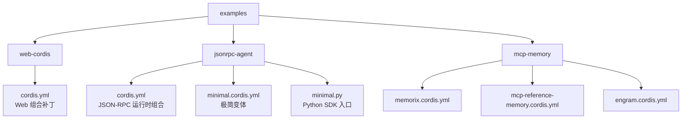
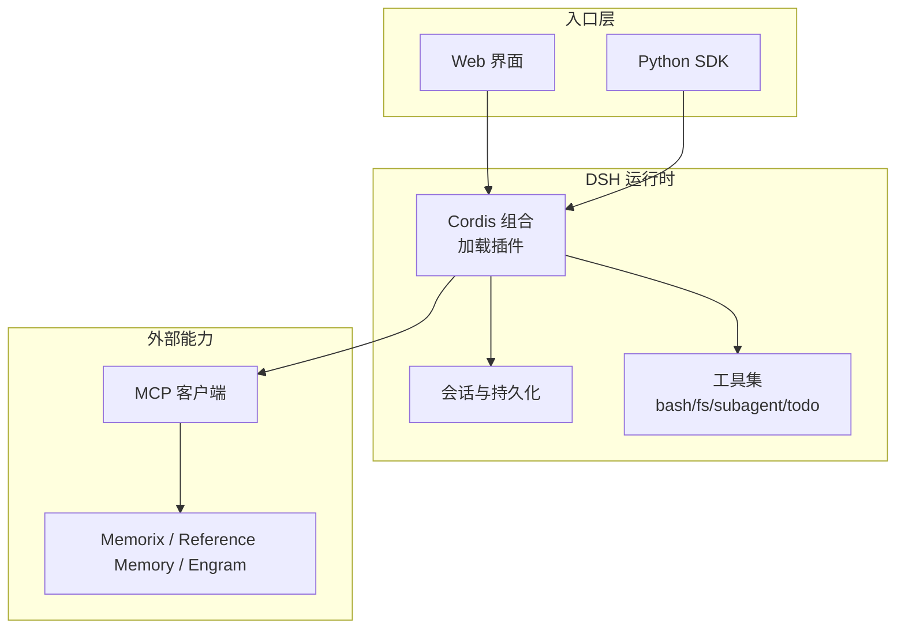
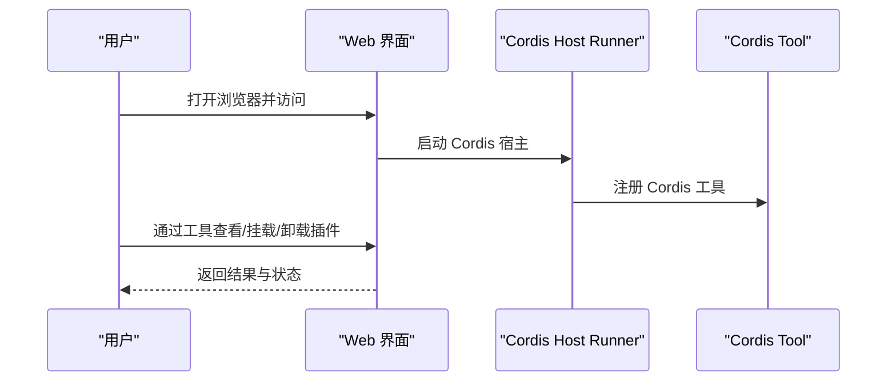
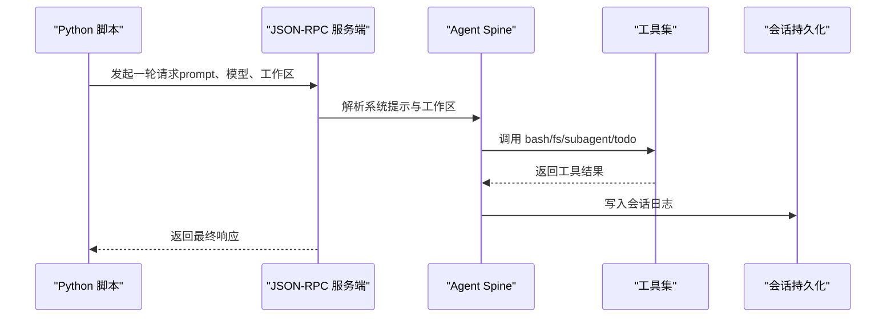
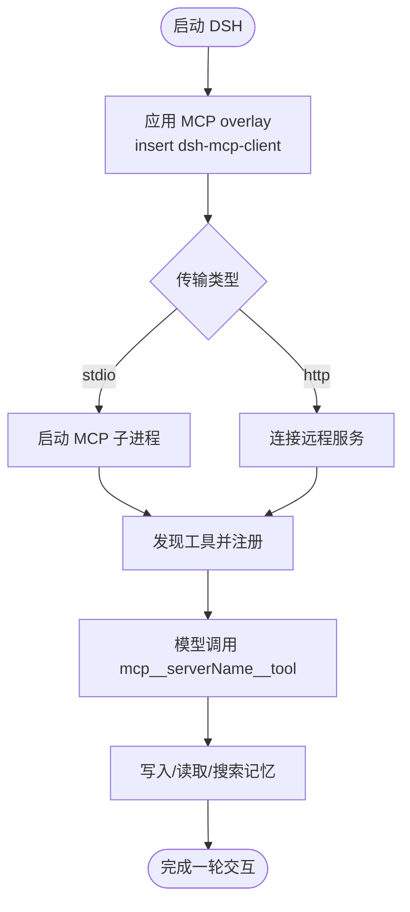
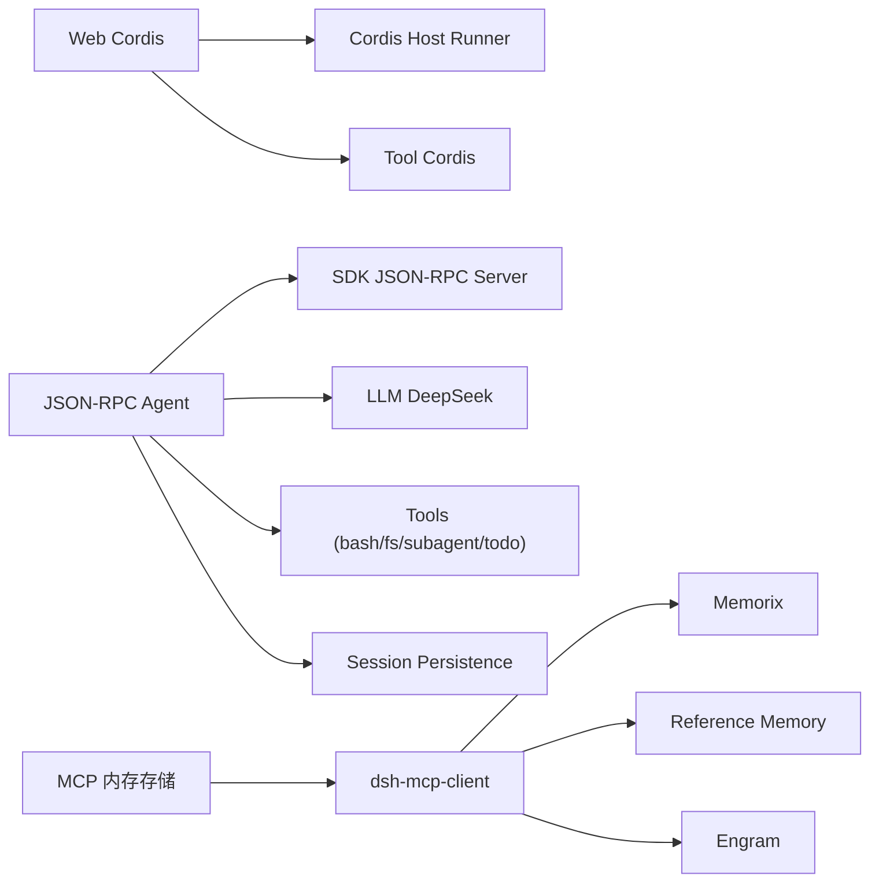

# 基础示例

<cite>
**本文引用的文件**
- [examples/README.md](file://examples/README.md)
- [examples/web-cordis/README.md](file://examples/web-cordis/README.md)
- [examples/web-cordis/cordis.yml](file://examples/web-cordis/cordis.yml)
- [examples/jsonrpc-agent/README.md](file://examples/jsonrpc-agent/README.md)
- [examples/jsonrpc-agent/README.zh.md](file://examples/jsonrpc-agent/README.zh.md)
- [examples/jsonrpc-agent/cordis.yml](file://examples/jsonrpc-agent/cordis.yml)
- [examples/jsonrpc-agent/minimal.cordis.yml](file://examples/jsonrpc-agent/minimal.cordis.yml)
- [examples/jsonrpc-agent/minimal.py](file://examples/jsonrpc-agent/minimal.py)
- [examples/mcp-memory/README.md](file://examples/mcp-memory/README.md)
- [examples/mcp-memory/README.zh.md](file://examples/mcp-memory/README.zh.md)
- [examples/mcp-memory/memorix.cordis.yml](file://examples/mcp-memory/memorix.cordis.yml)
- [examples/mcp-memory/mcp-reference-memory.cordis.yml](file://examples/mcp-memory/mcp-reference-memory.cordis.yml)
- [examples/mcp-memory/engram.cordis.yml](file://examples/mcp-memory/engram.cordis.yml)
- [docs/user/guide/providers.md](file://docs/user/guide/providers.md)
</cite>

## 目录
1. [简介](#简介)
2. [项目结构](#项目结构)
3. [核心组件](#核心组件)
4. [架构总览](#架构总览)
5. [详细组件分析](#详细组件分析)
6. [依赖关系分析](#依赖关系分析)
7. [性能与稳定性建议](#性能与稳定性建议)
8. [故障排查指南](#故障排查指南)
9. [结论](#结论)
10. [附录：快速上手清单](#附录快速上手清单)

## 简介
本“基础示例”文档面向初学者，聚焦 DeepSeek Harness（DSH）的三种典型入门场景：
- Web Cordis 示例：在浏览器中运行一个可自我检查、动态挂载/卸载插件的智能体。
- JSON-RPC Agent 示例：通过 Python SDK 驱动无头编码智能体，适合自动化流水线。
- MCP 内存存储示例：通过通用 MCP 客户端接入第三方记忆服务，实现跨会话的知识留存。

你将学到每个示例的配置方式、运行步骤、核心概念、常见模式与最佳实践，并借助图示理解数据与控制流。

## 项目结构
examples 目录下包含多个独立可运行的示例，每个子目录自带配置、前置条件与行为说明。本次重点覆盖三个示例：web-cordis、jsonrpc-agent、mcp-memory。

**图表来源**
- [examples/web-cordis/cordis.yml:1-20](file://examples/web-cordis/cordis.yml#L1-L20)
- [examples/jsonrpc-agent/cordis.yml:1-90](file://examples/jsonrpc-agent/cordis.yml#L1-L90)
- [examples/jsonrpc-agent/minimal.cordis.yml:1-83](file://examples/jsonrpc-agent/minimal.cordis.yml#L1-L83)
- [examples/jsonrpc-agent/minimal.py:1-44](file://examples/jsonrpc-agent/minimal.py#L1-L44)
- [examples/mcp-memory/memorix.cordis.yml:1-12](file://examples/mcp-memory/memorix.cordis.yml#L1-L12)
- [examples/mcp-memory/mcp-reference-memory.cordis.yml:1-14](file://examples/mcp-memory/mcp-reference-memory.cordis.yml#L1-L14)
- [examples/mcp-memory/engram.cordis.yml:1-12](file://examples/mcp-memory/engram.cordis.yml#L1-L12)

**章节来源**
- [examples/README.md:1-30](file://examples/README.md#L1-L30)

## 核心组件
- Web Cordis：通过 Web 界面暴露 Cordis 工具，允许模型在进程内动态查看和修改插件树，便于调试与扩展。
- JSON-RPC Agent：面向 Python SDK 的无头编码智能体，输出走 JSON-RPC 协议，适合脚本化调用。
- MCP 内存存储：以通用 MCP 客户端桥接第三方记忆服务，将外部工具暴露为 mcp__serverName__tool 形式供模型调用。

**章节来源**
- [examples/web-cordis/README.md:1-22](file://examples/web-cordis/README.md#L1-L22)
- [examples/jsonrpc-agent/README.md:1-41](file://examples/jsonrpc-agent/README.md#L1-L41)
- [examples/mcp-memory/README.md:1-102](file://examples/mcp-memory/README.md#L1-L102)

## 架构总览
下图展示三类示例在 DSH 中的角色与交互：Web 界面或 Python SDK 作为入口；Cordis 组合加载 LLM、工具、持久化等插件；MCP 客户端连接外部记忆服务，暴露工具给模型使用。

**图表来源**
- [examples/web-cordis/cordis.yml:1-20](file://examples/web-cordis/cordis.yml#L1-L20)
- [examples/jsonrpc-agent/cordis.yml:1-90](file://examples/jsonrpc-agent/cordis.yml#L1-L90)
- [examples/mcp-memory/memorix.cordis.yml:1-12](file://examples/mcp-memory/memorix.cordis.yml#L1-L12)
- [examples/mcp-memory/mcp-reference-memory.cordis.yml:1-14](file://examples/mcp-memory/mcp-reference-memory.cordis.yml#L1-L14)
- [examples/mcp-memory/engram.cordis.yml:1-12](file://examples/mcp-memory/engram.cordis.yml#L1-L12)

## 详细组件分析

### Web Cordis 示例
- 目标：在浏览器中启动一个可自我检查、动态挂载/卸载插件的智能体。
- 关键配置：通过 cordis.yml 对 Web 组合进行补丁，启用 cordis-host-runner 与 tool-cordis，并固定端口。
- 运行步骤：
  - 设置环境变量 DEEPSEEK_API_KEY。
  - 执行演示命令启动 Web 界面或 ACP 自动化服务器。
- 核心概念：
  - 临时插件随生命周期存在，卸载或进程退出后消失。
  - 该部署类似“shell 访问”，应视为高权限操作。

**图表来源**
- [examples/web-cordis/cordis.yml:1-20](file://examples/web-cordis/cordis.yml#L1-L20)
- [examples/web-cordis/README.md:1-22](file://examples/web-cordis/README.md#L1-L22)

**章节来源**
- [examples/web-cordis/README.md:1-22](file://examples/web-cordis/README.md#L1-L22)
- [examples/web-cordis/cordis.yml:1-20](file://examples/web-cordis/cordis.yml#L1-L20)

### JSON-RPC Agent 示例
- 目标：通过 Python SDK 驱动无头编码智能体，所有输出走 JSON-RPC 协议，适合自动化。
- 关键配置：
  - cordis.yml：加载 JSON-RPC 服务端、DeepSeek LLM、子进程、Bash、文件系统、会话持久化、子智能体、待办工具、令牌计量、上下文压缩等。
  - minimal.cordis.yml：极简变体，仅保留必要能力，关闭多余注入与压缩。
- 运行步骤：
  - 设置环境变量（如 DEEPSEEK_API_KEY、DEEPSEEK_BASE_URL、DSH_CWD、DSH_MODEL、DSH_SESSION_ROOT 等）。
  - 使用 minimal.py 传入任务 prompt，选择工作区与会话根目录，运行一次对话轮次并打印最终响应。
- 核心概念：
  - stdout 归 SDK 协议所有，不加载终端 UI 与审批界面。
  - maxTokensAsSuccess 控制 token 上限轮次的成功/错误语义。
  - 极简变体提供持久 Bash 与字符串替换编辑器，适合容器或可丢弃环境。

**图表来源**
- [examples/jsonrpc-agent/cordis.yml:1-90](file://examples/jsonrpc-agent/cordis.yml#L1-L90)
- [examples/jsonrpc-agent/minimal.cordis.yml:1-83](file://examples/jsonrpc-agent/minimal.cordis.yml#L1-L83)
- [examples/jsonrpc-agent/minimal.py:1-44](file://examples/jsonrpc-agent/minimal.py#L1-L44)

**章节来源**
- [examples/jsonrpc-agent/README.md:1-41](file://examples/jsonrpc-agent/README.md#L1-L41)
- [examples/jsonrpc-agent/README.zh.md:1-41](file://examples/jsonrpc-agent/README.zh.md#L1-L41)
- [examples/jsonrpc-agent/cordis.yml:1-90](file://examples/jsonrpc-agent/cordis.yml#L1-L90)
- [examples/jsonrpc-agent/minimal.cordis.yml:1-83](file://examples/jsonrpc-agent/minimal.cordis.yml#L1-L83)
- [examples/jsonrpc-agent/minimal.py:1-44](file://examples/jsonrpc-agent/minimal.py#L1-L44)

### MCP 内存存储示例
- 目标：通过通用 MCP 客户端接入第三方记忆服务，使模型能读写知识图谱或本地记忆。
- 可选后端：Memorix、MCP Reference Memory、Engram。
- 关键配置：
  - 各自 .cordis.yml 通过 insert 插入 dsh-mcp-client，指定 serverName、transport、command/env/cwd 等。
  - stdio 模式下由 DSH 启动/停止子进程；HTTP 模式需上游服务已运行。
- 运行步骤：
  - 安装对应上游服务。
  - 使用 dsh web --patch 启用某一份 overlay。
  - 等待 mcp__... 工具出现后发送验证提示词。
- 核心概念：
  - 工具命名规范：mcp__<serverName>__<tool>。
  - 安全：stdio 启动前会移除敏感环境变量与 DSH_* 变量。
  - 持久化：各后端自有存储策略，DSH 不接管数据库初始化或迁移。

**图表来源**
- [examples/mcp-memory/README.md:1-102](file://examples/mcp-memory/README.md#L1-L102)
- [examples/mcp-memory/memorix.cordis.yml:1-12](file://examples/mcp-memory/memorix.cordis.yml#L1-L12)
- [examples/mcp-memory/mcp-reference-memory.cordis.yml:1-14](file://examples/mcp-memory/mcp-reference-memory.cordis.yml#L1-L14)
- [examples/mcp-memory/engram.cordis.yml:1-12](file://examples/mcp-memory/engram.cordis.yml#L1-L12)

**章节来源**
- [examples/mcp-memory/README.md:1-102](file://examples/mcp-memory/README.md#L1-L102)
- [examples/mcp-memory/README.zh.md:1-102](file://examples/mcp-memory/README.zh.md#L1-L102)
- [examples/mcp-memory/memorix.cordis.yml:1-12](file://examples/mcp-memory/memorix.cordis.yml#L1-L12)
- [examples/mcp-memory/mcp-reference-memory.cordis.yml:1-14](file://examples/mcp-memory/mcp-reference-memory.cordis.yml#L1-L14)
- [examples/mcp-memory/engram.cordis.yml:1-12](file://examples/mcp-memory/engram.cordis.yml#L1-L12)

## 依赖关系分析
- Web Cordis 依赖 Web 宿主与 Cordis 工具插件，用于动态管理插件树。
- JSON-RPC Agent 依赖 JSON-RPC 服务端、LLM 适配器、子进程/终端、文件系统、会话持久化、子智能体与工具集。
- MCP 内存存储依赖 dsh-mcp-client 与具体 MCP 服务端（Memorix/Reference Memory/Engram），通过 stdio 或 HTTP 通信。

**图表来源**
- [examples/web-cordis/cordis.yml:1-20](file://examples/web-cordis/cordis.yml#L1-L20)
- [examples/jsonrpc-agent/cordis.yml:1-90](file://examples/jsonrpc-agent/cordis.yml#L1-L90)
- [examples/mcp-memory/memorix.cordis.yml:1-12](file://examples/mcp-memory/memorix.cordis.yml#L1-L12)
- [examples/mcp-memory/mcp-reference-memory.cordis.yml:1-14](file://examples/mcp-memory/mcp-reference-memory.cordis.yml#L1-L14)
- [examples/mcp-memory/engram.cordis.yml:1-12](file://examples/mcp-memory/engram.cordis.yml#L1-L12)

**章节来源**
- [examples/web-cordis/cordis.yml:1-20](file://examples/web-cordis/cordis.yml#L1-L20)
- [examples/jsonrpc-agent/cordis.yml:1-90](file://examples/jsonrpc-agent/cordis.yml#L1-L90)
- [examples/mcp-memory/README.md:1-102](file://examples/mcp-memory/README.md#L1-L102)

## 性能与稳定性建议
- JSON-RPC Agent：
  - 合理设置上下文窗口与最大 token 限制，避免过长上下文导致延迟上升。
  - 根据需求开启/关闭上下文压缩，平衡历史保留与性能。
  - 在容器或隔离环境中运行，降低持久 Bash 的安全风险。
- Web Cordis：
  - 将端口固定为非默认值，减少冲突。
  - 谨慎使用动态插件挂载，避免影响同进程其他会话。
- MCP 内存存储：
  - 首次启动后等待 mcp__... 工具出现再发送验证提示词，避免异步发现未完成导致的调用失败。
  - 对于 stdio 模式，若上游崩溃需重启或热重载；当前通用客户端不会自动重连。
  - 将敏感信息放入 config.env，不要直接写在 YAML 中。

[本节为通用指导，无需特定文件引用]

## 故障排查指南
- 模型与凭据问题：
  - 确认已正确配置提供商与 API Key；缺失凭据会报 MISSING_CREDENTIAL。
  - 未知模型会报 UNKNOWN_MODEL，需在设置中选择或添加模型。
- 图像输入被拒绝：
  - 自定义提供商的视觉模型需声明 input 包含 image；否则会在发送前被拒绝。
- MCP 工具不可用：
  - 确保 overlay 已正确 patch，且上游服务已安装并可执行。
  - 初次发现是异步过程，请等待工具注册完成后再发送提示词。
- JSON-RPC 输出异常：
  - 确认未向 stdout 输出额外内容，以免破坏 JSON-RPC 协议。
  - 检查 maxTokensAsSuccess 与模型 token 限制的关系。

**章节来源**
- [docs/user/guide/providers.md:1-99](file://docs/user/guide/providers.md#L1-L99)
- [examples/mcp-memory/README.md:1-102](file://examples/mcp-memory/README.md#L1-L102)
- [examples/jsonrpc-agent/README.md:1-41](file://examples/jsonrpc-agent/README.md#L1-L41)

## 结论
通过 Web Cordis、JSON-RPC Agent 与 MCP 内存存储三个示例，你可以快速掌握 DSH 的核心用法：
- 用 Web 界面交互式探索与扩展智能体能力。
- 用 Python SDK 驱动无头智能体，集成到自动化流程。
- 用 MCP 客户端接入外部记忆服务，实现跨会话知识留存。
结合本文的步骤、配置与排错建议，你可以在最短时间内构建出可用的智能体应用原型。

[本节为总结性内容，无需特定文件引用]

## 附录：快速上手清单
- 准备环境
  - 安装 Node.js（如需全局安装 MCP 服务端）、Go（Engram）或相应依赖。
  - 设置 DEEPSEEK_API_KEY、DEEPSEEK_BASE_URL、DSH_CWD、DSH_MODEL、DSH_SESSION_ROOT 等环境变量。
- 运行 Web Cordis
  - 执行演示命令启动 Web 界面或 ACP 服务器。
  - 在浏览器中使用 Cordis 工具查看/挂载/卸载插件。
- 运行 JSON-RPC Agent
  - 使用 minimal.py 传入 prompt，选择工作区与会话根目录。
  - 观察 JSON-RPC 输出与最终响应。
- 启用 MCP 内存存储
  - 安装并选择其中一个 MCP 服务端。
  - 使用 dsh web --patch 启用 overlay，等待工具可用后进行读写测试。

[本节为操作清单，无需特定文件引用]