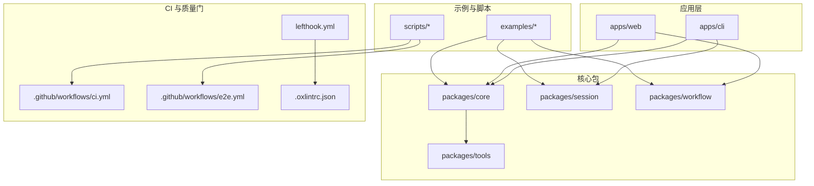
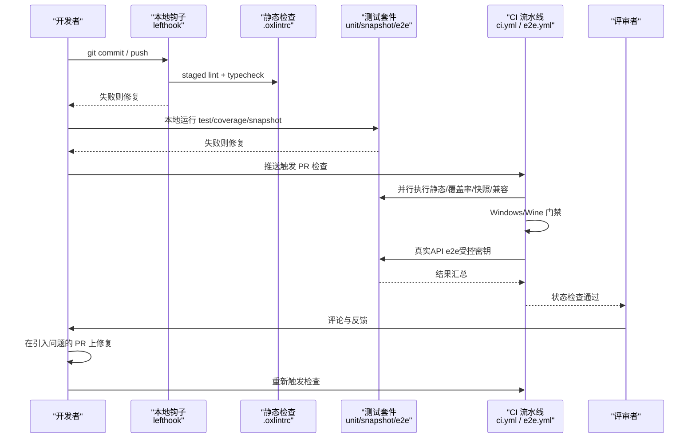
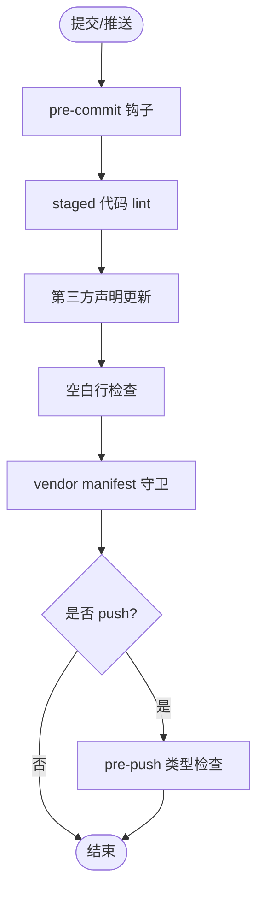
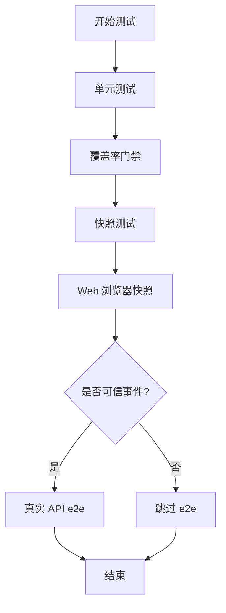
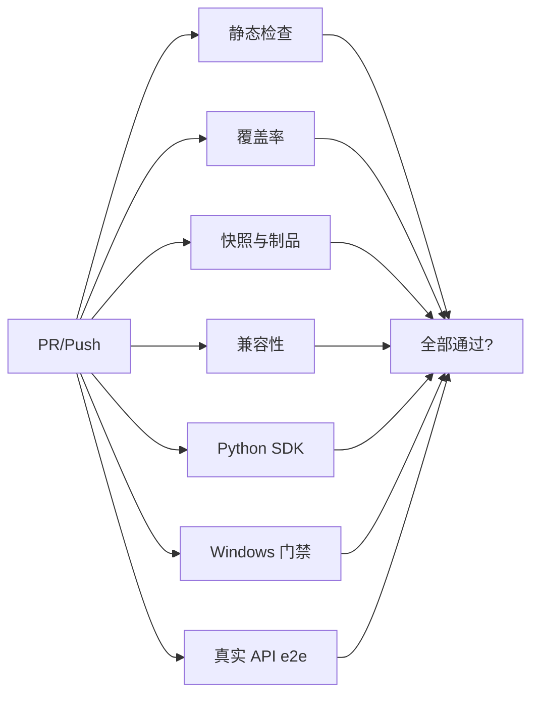
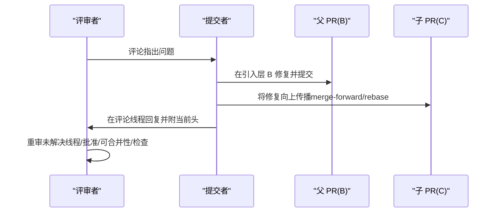
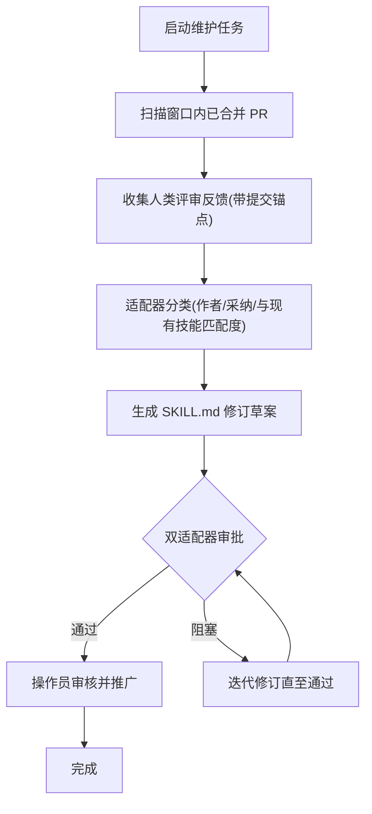
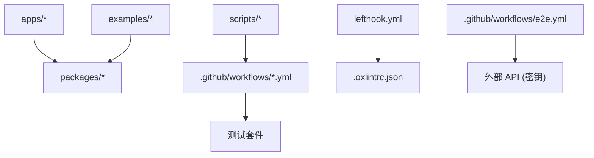

# PR 审查工作流

<cite>
**本文引用的文件**
- [pull_request_template.md](file://.github/pull_request_template.md)
- [maintaining-dsh-code-review.md](file://docs/cookbook/maintaining-dsh-code-review.md)
- [responding-to-pr-review-on-a-stack.md](file://docs/cookbook/responding-to-pr-review-on-a-stack.md)
- [testing.md](file://docs/testing.md)
- [ci.yml](file://.github/workflows/ci.yml)
- [e2e.yml](file://.github/workflows/e2e.yml)
- [lefthook.yml](file://lefthook.yml)
- [.oxlintrc.json](file://.oxlintrc.json)
</cite>

## 目录
1. [简介](#简介)
2. [项目结构](#项目结构)
3. [核心组件](#核心组件)
4. [架构总览](#架构总览)
5. [详细组件分析](#详细组件分析)
6. [依赖关系分析](#依赖关系分析)
7. [性能与效率考量](#性能与效率考量)
8. [故障排查指南](#故障排查指南)
9. [结论](#结论)
10. [附录：PR 审查清单](#附录pr-审查清单)

## 简介
本指南面向在多栈（stacked PRs）环境中进行 Pull Request 审查的开发者与评审者，聚焦以下目标：
- 如何高效开展跨组件、跨包的代码变更影响分析与依赖检查
- 如何在本地与 CI 中完成测试验证（单元、覆盖率、快照、真实 API e2e、浏览器快照等）
- 如何结合自动化审查工具与人工审查，提升质量与效率
- 如何处理常见审查问题，并基于反馈改进代码
- 如何在 stacked PR 链上定位问题来源、修复并向上游传播

## 项目结构
仓库采用多包/多应用组织方式，关键目录与职责概览：
- apps/cli、apps/web：产品端入口与前端界面
- packages/*：核心能力与子系统（如 session、workflow、tools、llm 等）
- examples/*：示例与可运行场景，用于端到端与快照验证
- scripts/*：构建、校验、生成脚本与质量门禁
- .github/workflows/*：CI 流水线（静态检查、覆盖率、快照、Windows 兼容、真实 API e2e 等）
- docs/*：开发、测试、子系统文档与操作手册

图表来源
- [ci.yml:1-120](file://.github/workflows/ci.yml#L1-L120)
- [e2e.yml:1-124](file://.github/workflows/e2e.yml#L1-L124)
- [lefthook.yml:1-56](file://lefthook.yml#L1-L56)
- [.oxlintrc.json:1-322](file://.oxlintrc.json#L1-L322)

章节来源
- [ci.yml:1-120](file://.github/workflows/ci.yml#L1-L120)
- [e2e.yml:1-124](file://.github/workflows/e2e.yml#L1-L124)
- [lefthook.yml:1-56](file://lefthook.yml#L1-L56)
- [.oxlintrc.json:1-322](file://.oxlintrc.json#L1-L322)

## 核心组件
- 本地前置检查（pre-commit/pre-push）：通过 lefthook 执行翻译配对校验、归档 Agent Notes 校验、staged 代码 lint、第三方声明更新、空白行检查、vendor manifest 守卫；push 前执行类型检查。
- 静态与质量门禁：oxlint 严格规则（含 TypeScript 类型感知），覆盖 source/tests/examples/scripts/website 等区域，禁止 any、未使用变量、悬空 Promise 等高风险模式。
- 测试分层策略：单元测试、覆盖率门禁、真实 API e2e、快照测试、Web 浏览器快照；强调“用真实实现而非 mock”、“验证世界而非自报告”、“从源码平面解析”。
- CI 流水线：Linux/Windows 静态、兼容性、快照与制品、Python SDK keyless 套件、Windows Wine 门禁、真实 API e2e（受控密钥）。
- 堆叠 PR 处理：按“引入问题的 PR 先修复再向上传播”，保持每个修复为独立提交，合并或 rebase 需遵循官方 stack 流程。

章节来源
- [lefthook.yml:1-56](file://lefthook.yml#L1-L56)
- [.oxlintrc.json:1-322](file://.oxlintrc.json#L1-L322)
- [testing.md:1-50](file://docs/testing.md#L1-L50)
- [ci.yml:1-800](file://.github/workflows/ci.yml#L1-L800)
- [e2e.yml:1-124](file://.github/workflows/e2e.yml#L1-L124)
- [responding-to-pr-review-on-a-stack.md:1-33](file://docs/cookbook/responding-to-pr-review-on-a-stack.md#L1-L33)

## 架构总览
下图展示一次 PR 从提交到合并的完整审查与验证路径，包括本地钩子、CI 门禁、测试分层与真实 API 验证。

图表来源
- [lefthook.yml:1-56](file://lefthook.yml#L1-L56)
- [.oxlintrc.json:1-322](file://.oxlintrc.json#L1-L322)
- [testing.md:1-50](file://docs/testing.md#L1-L50)
- [ci.yml:1-800](file://.github/workflows/ci.yml#L1-L800)
- [e2e.yml:1-124](file://.github/workflows/e2e.yml#L1-L124)

## 详细组件分析

### 本地前置检查与静态质量
- pre-commit：对 i18n 配对、归档 Agent Notes、staged 代码 lint、第三方声明再生成、空白行、vendor manifest 进行检查，确保提交即合规。
- pre-push：执行类型检查，避免将类型错误推送到远端。
- 规则强度：oxlint 开启类型感知，禁用 any、强制 await、禁止浮空 Promise、严格模板表达式与 switch 穷尽性检查等。

图表来源
- [lefthook.yml:1-56](file://lefthook.yml#L1-L56)
- [.oxlintrc.json:1-322](file://.oxlintrc.json#L1-L322)

章节来源
- [lefthook.yml:1-56](file://lefthook.yml#L1-L56)
- [.oxlintrc.json:1-322](file://.oxlintrc.json#L1-L322)

### 测试分层与验证策略
- 单元测试：围绕包与示例 specs，关注边界、错误路径、事件顺序、并发竞态与契约回归。
- 覆盖率门禁：要求 per-file 100% 覆盖特定目录，未覆盖行常被视为待删除的死代码。
- 真实 API e2e：仅在可信事件中运行，预检缺失密钥会硬失败，避免假绿。
- 快照测试：键无关输出覆盖外部行为与持久化日志；浏览器快照在 Linux PR 门禁中强制 replay。
- 原则：优先真实实现、验证世界、从源码平面解析、仅当必要才 mock。

图表来源
- [testing.md:1-50](file://docs/testing.md#L1-L50)
- [e2e.yml:1-124](file://.github/workflows/e2e.yml#L1-L124)

章节来源
- [testing.md:1-50](file://docs/testing.md#L1-L50)
- [e2e.yml:1-124](file://.github/workflows/e2e.yml#L1-L124)

### CI 流水线与门禁矩阵
- 静态检查：Node 24 环境下的 oxlint 与类型检查。
- 覆盖率：并行 worker 数可控，failover 池下调整并发。
- 消费者与制品：Playwright Chromium 安装、快照与制品门禁。
- 兼容性：多 Node 版本 smoke。
- Python SDK：keyless 套件与 release-shaped Linux x64 运行时。
- Windows：Wine 门禁与原生 Windows 完整门禁。
- 真实 API e2e：受控密钥、预检、限流与重试。

图表来源
- [ci.yml:1-800](file://.github/workflows/ci.yml#L1-L800)
- [e2e.yml:1-124](file://.github/workflows/e2e.yml#L1-L124)

章节来源
- [ci.yml:1-800](file://.github/workflows/ci.yml#L1-L800)
- [e2e.yml:1-124](file://.github/workflows/e2e.yml#L1-L124)

### 堆叠 PR 上的审查与修复传播
- 规则：每个 PR 分支一个 worktree；GitHub Stack 权威；修复应在引入问题的 PR 上完成并向上传播；每次修复为独立提交；合并或 rebase 需走官方流程。
- 步骤：逐条评论归因→定位引入层→修复并验证→向子层传播（merge-forward 或 native rebase）→回复线程并附当前提交→重审未解决线程与检查。

图表来源
- [responding-to-pr-review-on-a-stack.md:1-33](file://docs/cookbook/responding-to-pr-review-on-a-stack.md#L1-L33)

章节来源
- [responding-to-pr-review-on-a-stack.md:1-33](file://docs/cookbook/responding-to-pr-review-on-a-stack.md#L1-L33)

### 自动化审查技能维护（dsh-code-review）
- 机制：定期扫描已合并 PR 的人类评审反馈，对比落地补丁与最终补丁，分类采纳项并生成 SKILL.md 修订草案；双适配器审阅后由操作员决策是否推广。
- 产出：diff、候选 SKILL.md、manifest 记录来源反馈、证据范围、适配器判定与门禁结果。
- 运维：每日/每周窗口运行；无候选为正常；适配器不可用时失败并通知；交接需显式文档化。

图表来源
- [maintaining-dsh-code-review.md:1-65](file://docs/cookbook/maintaining-dsh-code-review.md#L1-L65)

章节来源
- [maintaining-dsh-code-review.md:1-65](file://docs/cookbook/maintaining-dsh-code-review.md#L1-L65)

## 依赖关系分析
- 组件耦合：apps 依赖 core/session/workflow 等包；examples 驱动端到端与快照；scripts 串联构建与门禁。
- 直接依赖：CI 调用 pnpm 命令与脚本；lefthook 调用脚本与 linter；e2e 依赖密钥与环境。
- 间接依赖：快照与浏览器测试依赖 Playwright；Windows 门禁依赖 Wine；覆盖率与并发受环境变量控制。
- 外部集成：真实 API（DeepSeek）通过密钥注入；第三方声明由脚本生成。

图表来源
- [ci.yml:1-800](file://.github/workflows/ci.yml#L1-L800)
- [e2e.yml:1-124](file://.github/workflows/e2e.yml#L1-L124)
- [lefthook.yml:1-56](file://lefthook.yml#L1-L56)
- [.oxlintrc.json:1-322](file://.oxlintrc.json#L1-L322)

章节来源
- [ci.yml:1-800](file://.github/workflows/ci.yml#L1-L800)
- [e2e.yml:1-124](file://.github/workflows/e2e.yml#L1-L124)
- [lefthook.yml:1-56](file://lefthook.yml#L1-L56)
- [.oxlintrc.json:1-322](file://.oxlintrc.json#L1-L322)

## 性能与效率考量
- 并发与缓存：CI 中 pnpm store、Playwright 缓存、Wine apt 缓存显著降低冷启动时间；failover 池下调整并发以平衡资源占用。
- 并行门禁：静态、覆盖率、快照、兼容性并行执行，缩短 PR 反馈周期。
- 本地效率：lefthook 仅对 staged 文件执行轻量检查，减少全仓扫描开销。
- 建议：
  - 在本地先运行最小集（typecheck + 相关 unit/snapshot）再推送
  - 利用缓存与只读 snapshot replay 模式加速迭代
  - 对复杂变更拆分小 PR，便于并行审查与回滚

[本节提供通用指导，不直接分析具体文件]

## 故障排查指南
- 真实 API e2e 假绿：若密钥缺失，e2e 会 self-skip 导致假绿；需在可信事件中配置密钥并通过预检硬失败保障。
- 快照不一致：浏览器快照在 CI 强制 replay 且禁止写入；本地记录/刷新后需逐项审查 diff。
- 覆盖率不达标：未覆盖行可能是死代码；优先确认是否应删除而非盲目补测。
- 类型检查失败：遵循 oxlint 规则修复 any、await、Promise 等问题；必要时在测试中放宽规则但需说明原因。
- Windows 门禁失败：检查 Wine 环境与依赖缓存；必要时在本地复现。
- 堆叠 PR 修复未生效：确认修复位于引入层，并按官方流程向上传播；每次重写推送后需重新审阅线程与检查。

章节来源
- [e2e.yml:1-124](file://.github/workflows/e2e.yml#L1-L124)
- [testing.md:1-50](file://docs/testing.md#L1-L50)
- [.oxlintrc.json:1-322](file://.oxlintrc.json#L1-L322)
- [ci.yml:1-800](file://.github/workflows/ci.yml#L1-L800)
- [responding-to-pr-review-on-a-stack.md:1-33](file://docs/cookbook/responding-to-pr-review-on-a-stack.md#L1-L33)

## 结论
通过本地钩子、严格静态规则、分层测试与完善的 CI 门禁，本项目在多栈环境下实现了高质量、高效率的 PR 审查流程。评审者应重点关注：
- 变更影响面与跨组件依赖
- 测试覆盖与快照一致性
- 真实 API 行为的稳定性
- 堆叠 PR 的修复溯源与传播
结合自动化技能维护与人工判断，持续优化审查标准与实践。

[本节总结性内容，不直接分析具体文件]

## 附录：PR 审查清单
- 变更描述与关联 Issue：填写 PR 模板中的“变更”和“验证”字段，并确保非草稿 PR 引用至少一个同仓库 Issue。
- 影响分析：列出受影响包/模块/接口，评估向后兼容性与风险。
- 依赖检查：确认新增/修改依赖的必要性与版本约束；检查 vendor 与第三方声明是否同步更新。
- 测试验证：
  - 单元测试：覆盖边界、错误路径、事件顺序与并发
  - 覆盖率：达到门禁要求，未覆盖行需解释或删除
  - 快照：更新并逐项审查 diff（JSONL、UI 快照）
  - 真实 API e2e：在可信环境运行，确保密钥有效
- 静态与类型：通过 oxlint 与类型检查，消除 any、浮空 Promise 等高风险问题
- 堆叠 PR：修复位于引入层，按官方流程向上传播；每次重写推送后重新审阅线程与检查
- 安全与权限：避免泄露密钥；遵循最小权限原则
- 文档与可维护性：更新相关文档；保持代码可读性与可测试性

章节来源
- [pull_request_template.md:1-14](file://.github/pull_request_template.md#L1-L14)
- [testing.md:1-50](file://docs/testing.md#L1-L50)
- [.oxlintrc.json:1-322](file://.oxlintrc.json#L1-L322)
- [responding-to-pr-review-on-a-stack.md:1-33](file://docs/cookbook/responding-to-pr-review-on-a-stack.md#L1-L33)