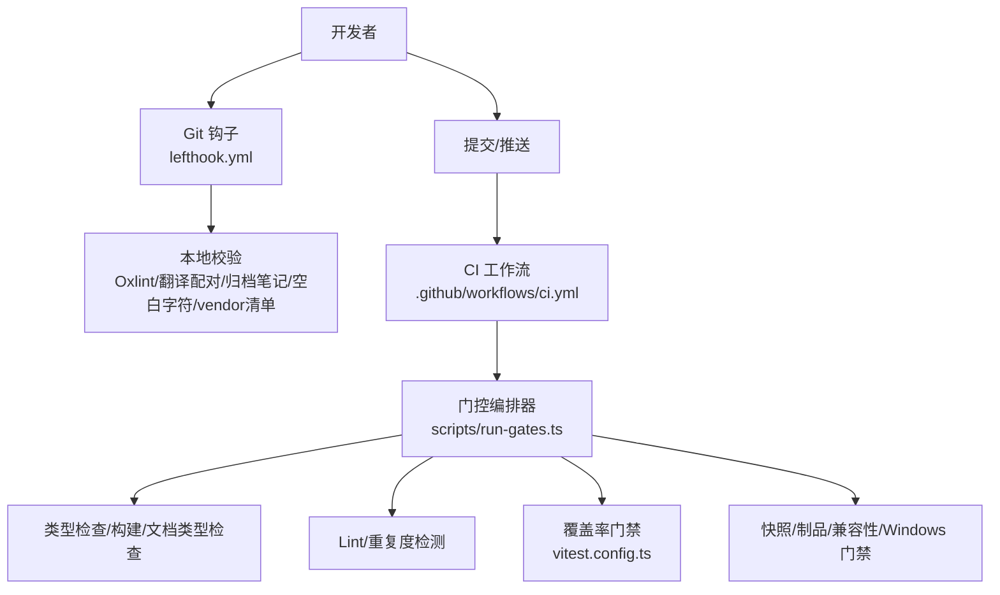
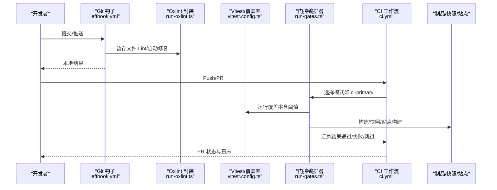
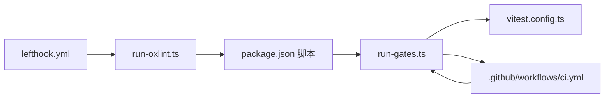

# 代码审查与维护

<cite>
**本文引用的文件**
- [CONTRIBUTING.md](file://CONTRIBUTING.md)
- [.github/pull_request_template.md](file://.github/pull_request_template.md)
- [lefthook.yml](file://lefthook.yml)
- [.oxlintrc.json](file://.oxlintrc.json)
- [package.json](file://package.json)
- [scripts/run-oxlint.ts](file://scripts/run-oxlint.ts)
- [vitest.config.ts](file://vitest.config.ts)
- [.github/workflows/ci.yml](file://.github/workflows/ci.yml)
- [scripts/run-gates.ts](file://scripts/run-gates.ts)
- [docs/testing.md](file://docs/testing.md)
- [docs/cookbook/maintaining-dsh-code-review.md](file://docs/cookbook/maintaining-dsh-code-review.md)
</cite>

## 目录
1. [简介](#简介)
2. [项目结构](#项目结构)
3. [核心组件](#核心组件)
4. [架构总览](#架构总览)
5. [详细组件分析](#详细组件分析)
6. [依赖分析](#依赖分析)
7. [性能考虑](#性能考虑)
8. [故障排查指南](#故障排查指南)
9. [结论](#结论)
10. [附录](#附录)

## 简介
本指南面向 DeepSeek Harness 项目的维护者与贡献者，聚焦代码审查流程、质量标准、自动化检查工具的使用与排错，以及重构、性能优化与安全审计的最佳实践。同时给出常见问题诊断方法、项目维护工作流规范，以及参与社区协作（Issue 处理、PR 审查、版本发布）的流程说明。

## 项目结构
仓库采用多包 monorepo 组织，核心质量门禁由根级脚本与工作流驱动：
- 本地预提交/推送钩子：lefthook.yml
- 静态检查与格式化：.oxlintrc.json + scripts/run-oxlint.ts
- 测试与覆盖率：vitest.config.ts
- CI 流水线：.github/workflows/ci.yml
- 门控编排器：scripts/run-gates.ts
- 顶层脚本入口与命令聚合：package.json
- 测试策略与质量门槛：docs/testing.md
- 代码审查技能维护手册：docs/cookbook/maintaining-dsh-code-review.md
- 贡献与协作约定：CONTRIBUTING.md、.github/pull_request_template.md

**图表来源**
- [lefthook.yml:5-55](file://lefthook.yml#L5-L55)
- [.github/workflows/ci.yml:43-257](file://.github/workflows/ci.yml#L43-L257)
- [scripts/run-gates.ts:192-283](file://scripts/run-gates.ts#L192-L283)
- [vitest.config.ts:117-285](file://vitest.config.ts#L117-L285)

**章节来源**
- [lefthook.yml:5-55](file://lefthook.yml#L5-L55)
- [.github/workflows/ci.yml:43-257](file://.github/workflows/ci.yml#L43-L257)
- [scripts/run-gates.ts:192-283](file://scripts/run-gates.ts#L192-L283)
- [vitest.config.ts:117-285](file://vitest.config.ts#L117-L285)

## 核心组件
- 本地质量门禁（pre-commit/pre-push）：通过 lefthook 在暂存阶段执行翻译配对校验、归档 Agent Note 校验、Oxlint 自动修复、空白字符检查与 vendor 清单守卫；push 前执行 typecheck。
- 统一 Lint 封装：scripts/run-oxlint.ts 负责注入线程参数、捕获输出、失败码传递，并支持 fix 模式二次扫描以处理插件修复重叠问题。
- 测试与覆盖率：vitest 配置定义多项目（线程安全/进程绑定）、严格每文件 100% 覆盖率阈值、平台差异排除与覆盖报告。
- CI 门控编排：scripts/run-gates.ts 将多种任务抽象为 Gate，按依赖图并发调度，提供 ci-primary、coverage、snapshot、consumers、windows 等模式。
- 顶层脚本聚合：package.json 暴露 lint/typecheck/test/snapshot/hygiene/release 等命令，串联各子系统。
- 测试策略：docs/testing.md 明确单元测试、覆盖率门禁、真实 API e2e、快照、浏览器快照的边界与要求。
- 代码审查技能维护：maintaining-dsh-code-review.md 描述 dsh-code-review 技能的周期性维护流程与人工审核要点。

**章节来源**
- [lefthook.yml:5-55](file://lefthook.yml#L5-L55)
- [scripts/run-oxlint.ts:1-89](file://scripts/run-oxlint.ts#L1-L89)
- [vitest.config.ts:117-285](file://vitest.config.ts#L117-L285)
- [scripts/run-gates.ts:192-283](file://scripts/run-gates.ts#L192-L283)
- [package.json:19-142](file://package.json#L19-L142)
- [docs/testing.md:7-49](file://docs/testing.md#L7-L49)
- [docs/cookbook/maintaining-dsh-code-review.md:7-64](file://docs/cookbook/maintaining-dsh-code-review.md#L7-L64)

## 架构总览
下图展示从开发者提交到 CI 门禁再到产物验证的端到端流程。

**图表来源**
- [lefthook.yml:5-55](file://lefthook.yml#L5-L55)
- [scripts/run-oxlint.ts:49-85](file://scripts/run-oxlint.ts#L49-L85)
- [vitest.config.ts:117-285](file://vitest.config.ts#L117-L285)
- [scripts/run-gates.ts:192-283](file://scripts/run-gates.ts#L192-L283)
- [.github/workflows/ci.yml:43-257](file://.github/workflows/ci.yml#L43-L257)

## 详细组件分析

### 本地 Git 钩子与提交前检查
- pre-commit：对 i18n 配对、归档 Agent Notes、TS/JS 暂存文件进行 Oxlint 自动修复、空白字符检查、vendor 清单生成与校验。
- pre-merge-commit：再次校验翻译配对与归档笔记。
- pre-push：执行 typecheck，确保类型正确后再推送到远端。

建议实践
- 提交前务必运行本地钩子；若需绕过请谨慎评估风险。
- 对新增 TS/TSX 文件遵循 .oxlintrc.json 规则集，避免引入 any/未使用变量/悬空 Promise 等。

**章节来源**
- [lefthook.yml:5-55](file://lefthook.yml#L5-L55)

### 统一 Lint 封装（run-oxlint.ts）
- 通过环境变量 DSH_OXLINT_THREADS 控制线程数，禁止直接传 --threads。
- Fix 模式下会执行两次扫描以处理 JS 插件修复重叠导致的二次可修复项。
- 非 Fix 模式直接继承 stdio 输出；Fix 模式捕获输出并在必要时二次执行。

最佳实践
- 在 CI 或本地统一通过 package.json 的 lint/lint:fix 命令调用，不要直接调用 oxlint CLI。
- 遇到修复后仍有警告时，优先确认是否为插件修复顺序导致，再决定是否二次运行。

**章节来源**
- [scripts/run-oxlint.ts:1-89](file://scripts/run-oxlint.ts#L1-L89)
- [package.json:29-32](file://package.json#L29-L32)

### 测试与覆盖率门禁（vitest.config.ts）
- 双项目隔离：thread-safe 与 process-bound，避免进程全局状态干扰。
- 覆盖率阈值：每文件 100%（语句/分支/函数/行），缺失即失败。
- 平台差异：Windows 不支持套件与覆盖率排除；pwsh 可用性影响特定包覆盖豁免。
- 报告：CI 下输出文本与自定义“未覆盖位置”报告，本地额外生成 HTML。

最佳实践
- 新增逻辑必须补充测试，保证每文件 100% 覆盖；若确需豁免，需在 vitest.config.ts 中显式声明原因。
- 对进程相关行为优先写 process-bound 用例，避免线程池带来的不稳定。

**章节来源**
- [vitest.config.ts:117-285](file://vitest.config.ts#L117-L285)
- [docs/testing.md:7-49](file://docs/testing.md#L7-L49)

### CI 门控编排器（run-gates.ts）
- 将各类任务建模为 Gate，支持 needs 依赖、allowFailure、env 注入与并发控制。
- 提供多种模式：ci-primary、ci-static、ci-coverage、ci-snapshot、ci-consumers、windows-blocking/complete/observational、node-compat、check-all、doc-sync。
- 内置依赖图校验与环检测，失败/跳过传播清晰。

关键流程
- ci-primary：包含运行时闭包、约束、许可证、包不变量、Cordis 配置、Issue 管理策略、Typert 契约、类型检查、Lint、重复度、覆盖率、Node 兼容冒烟、快照、文档类型检查、模块图、knip、构建、publint、node-next-types、构建产物不变量、已构建二进制冒烟。
- coverage：分两路执行（受测与重型豁免），共享 DSH_COVERAGE_MAX_WORKERS 预算。
- consumers：构建、Node 兼容、publint、构建产物不变量、Lint+重复度、快照、Web 快照、文档类型检查、node-next-types、已构建二进制冒烟。

**章节来源**
- [scripts/run-gates.ts:192-283](file://scripts/run-gates.ts#L192-L283)
- [scripts/run-gates.ts:422-455](file://scripts/run-gates.ts#L422-L455)
- [scripts/run-gates.ts:497-517](file://scripts/run-gates.ts#L497-L517)
- [scripts/run-gates.ts:571-615](file://scripts/run-gates.ts#L571-L615)

### CI 工作流（ci.yml）
- 多作业并行：静态分析、覆盖率、消费者/制品、Node 兼容、Python SDK/Runtime、Wine Windows 阻断、原生 Windows 完整门禁、串行参考作业（Linux/macOS/Windows 自托管热备）。
- 缓存与加速：pnpm store、Playwright Chromium、Wine apt 缓存。
- 失败回退：通过仓库变量切换至自托管池（Linux/Windows 独立开关）。

建议实践
- 在 PR 上关注所有必需作业；如需调整并发，可通过 DSH_GATE_CONCURRENCY、DSH_COVERAGE_MAX_WORKERS 等环境变量微调。
- 遇到网络/依赖问题时优先检查缓存命中与镜像可用性。

**章节来源**
- [.github/workflows/ci.yml:43-257](file://.github/workflows/ci.yml#L43-L257)
- [.github/workflows/ci.yml:260-327](file://.github/workflows/ci.yml#L260-L327)
- [.github/workflows/ci.yml:338-411](file://.github/workflows/ci.yml#L338-L411)
- [.github/workflows/ci.yml:447-490](file://.github/workflows/ci.yml#L447-L490)

### 代码审查技能维护（dsh-code-review）
- 周期维护：每日/每周窗口抓取已合并 PR 的人类评审反馈，经两类审阅适配器分类后生成候选 SKILL.md 修订。
- 人工决策：维护者需独立审阅候选 diff，核对证据链，决定丢弃/批量/推广。
- 推广流程：从干净 master 检出，校验当前技能一致性，应用保存的 diff，打开草稿 PR 并附来源信息。

最佳实践
- 不盲目采纳“审阅者已批准”的结论；警惕清单膨胀、历史叙述、单一事件外推与重复覆盖。
- 推广时可做小幅度措辞收紧、上下文无关示例移除、规则合并等编辑。

**章节来源**
- [docs/cookbook/maintaining-dsh-code-review.md:7-64](file://docs/cookbook/maintaining-dsh-code-review.md#L7-L64)

### 贡献与协作流程
- 当前不接受外部 PR；鼓励通过 GitHub Discussions 上报问题/缺陷、创建生态插件、撰写指南与回答问题。
- PR 模板要求关联 Issue，并在变更与验证部分填写变更点与验证方式。

建议实践
- 提 Issue 时尽量附带复现步骤与环境信息；讨论区可投票提升优先级。
- 生态贡献优先于直接修改官方仓库，便于社区多样化发展。

**章节来源**
- [CONTRIBUTING.md:5-23](file://CONTRIBUTING.md#L5-L23)
- [.github/pull_request_template.md:1-14](file://.github/pull_request_template.md#L1-L14)

## 依赖分析
- 本地层：lefthook 依赖 scripts/* 与 node_modules 中的工具；Oxlint 通过 run-oxlint.ts 统一入口。
- 测试层：vitest 基于 tsconfig.base.json 路径映射解析源码；覆盖率阈值与排除策略集中配置。
- CI 层：ci.yml 通过 pnpm 脚本触发 run-gates.ts 的不同模式；run-gates.ts 再调度 test/lint/build/snapshot 等任务。
- 产物层：构建产物用于 publint、node-next-types、built-package-invariants、built-bin smoke 等验证。

**图表来源**
- [lefthook.yml:5-55](file://lefthook.yml#L5-L55)
- [scripts/run-oxlint.ts:1-89](file://scripts/run-oxlint.ts#L1-L89)
- [package.json:19-142](file://package.json#L19-L142)
- [scripts/run-gates.ts:192-283](file://scripts/run-gates.ts#L192-L283)
- [vitest.config.ts:117-285](file://vitest.config.ts#L117-L285)
- [.github/workflows/ci.yml:43-257](file://.github/workflows/ci.yml#L43-L257)

**章节来源**
- [lefthook.yml:5-55](file://lefthook.yml#L5-L55)
- [scripts/run-oxlint.ts:1-89](file://scripts/run-oxlint.ts#L1-L89)
- [package.json:19-142](file://package.json#L19-L142)
- [scripts/run-gates.ts:192-283](file://scripts/run-gates.ts#L192-L283)
- [vitest.config.ts:117-285](file://vitest.config.ts#L117-L285)
- [.github/workflows/ci.yml:43-257](file://.github/workflows/ci.yml#L43-L257)

## 性能考虑
- 并发控制：通过 DSH_GATE_CONCURRENCY、DSH_COVERAGE_MAX_WORKERS、DSH_OXLINT_THREADS 等环境变量调节并发，避免资源争用。
- 缓存利用：pnpm store、Playwright Chromium、Wine apt 缓存显著缩短安装与依赖准备时间。
- 任务拆分：run-gates.ts 将重任务拆分为多个 Gate，按依赖关系并行执行，减少整体耗时。
- 覆盖率豁免：对重型/进程绑定用例单独分组，避免 v8 插桩放大开销。

[本节为通用指导，无需具体文件引用]

## 故障排查指南
- Lint 失败
  - 现象：本地或 CI 报语法/风格/类型相关错误。
  - 排查：使用 pnpm run lint:fix 尝试自动修复；若仍失败，查看 .oxlintrc.json 对应规则；必要时缩小范围定位。
  - 参考：[scripts/run-oxlint.ts:49-85](file://scripts/run-oxlint.ts#L49-L85)、[.oxlintrc.json:32-319](file://.oxlintrc.json#L32-L319)

- 覆盖率不达标
  - 现象：某文件未达到 100% 覆盖率导致门禁失败。
  - 排查：查看 vitest 报告中的未覆盖位置；补充边缘/异常路径用例；确需豁免时在 vitest.config.ts 中显式标注原因。
  - 参考：[vitest.config.ts:160-285](file://vitest.config.ts#L160-L285)、[docs/testing.md:7-49](file://docs/testing.md#L7-L49)

- CI 超时或资源不足
  - 现象：CI 作业长时间无进展或被取消。
  - 排查：降低并发（DSH_GATE_CONCURRENCY/DSH_COVERAGE_MAX_WORKERS/DSH_OXLINT_THREADS）；检查缓存命中；必要时切换到自托管回退池。
  - 参考：[.github/workflows/ci.yml:43-257](file://.github/workflows/ci.yml#L43-L257)

- 快照不一致
  - 现象：web 或 headless 快照比对失败。
  - 排查：确认是否预期变更；本地使用 record/refresh 更新并人工审查 diff；CI 强制 replay 模式只读。
  - 参考：[docs/testing.md:12-15](file://docs/testing.md#L12-L15)

- 代码审查技能维护无候选
  - 现象：维护工具运行后无新候选。
  - 排查：这是正常情况；工具会在日志记录“无候选”，不会告警；等待下一窗口重新评估。
  - 参考：[docs/cookbook/maintaining-dsh-code-review.md:50-52](file://docs/cookbook/maintaining-dsh-code-review.md#L50-L52)

**章节来源**
- [scripts/run-oxlint.ts:49-85](file://scripts/run-oxlint.ts#L49-L85)
- [.oxlintrc.json:32-319](file://.oxlintrc.json#L32-L319)
- [vitest.config.ts:160-285](file://vitest.config.ts#L160-L285)
- [docs/testing.md:7-49](file://docs/testing.md#L7-L49)
- [.github/workflows/ci.yml:43-257](file://.github/workflows/ci.yml#L43-L257)
- [docs/cookbook/maintaining-dsh-code-review.md:50-52](file://docs/cookbook/maintaining-dsh-code-review.md#L50-L52)

## 结论
DeepSeek Harness 通过严格的本地钩子、统一的 Lint 封装、严格的覆盖率门禁、完善的 CI 门控编排与跨平台验证，构建了高可靠的质量体系。配合清晰的测试策略与代码审查技能维护流程，既能保障交付质量，又能支撑持续演进。建议在日常开发中遵循本文档的实践，充分利用自动化能力，减少人为疏漏，提高协作效率。

## 附录

### 常用命令速查
- 类型检查：pnpm run typecheck
- 代码检查与修复：pnpm run lint / pnpm run lint:fix
- 单元测试与覆盖率：pnpm run test / pnpm run test:coverage
- 快照测试：pnpm run test:snapshot / :record / :refresh
- Web 浏览器快照：pnpm run test:web
- 全量门禁（本地）：pnpm run check:all
- 卫生检查（依赖/许可证/不变量等）：pnpm run hygiene

**章节来源**
- [package.json:19-142](file://package.json#L19-L142)