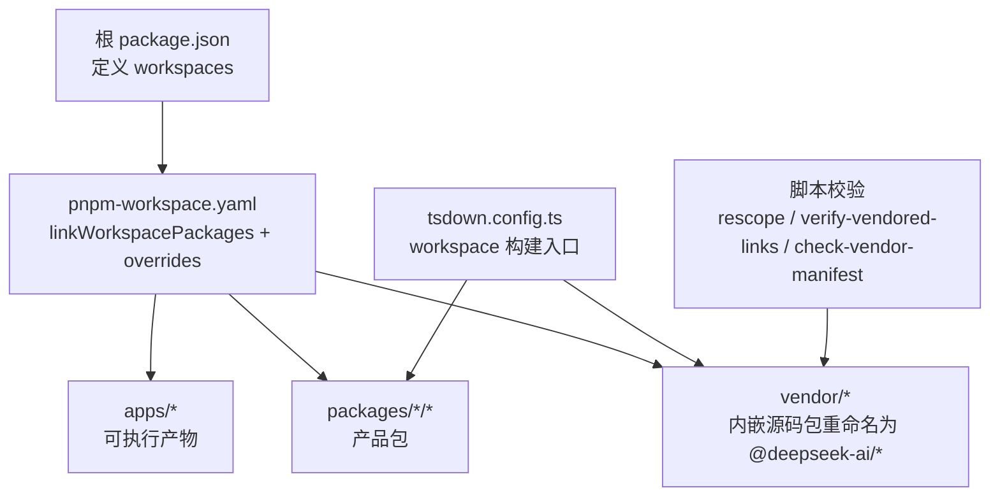
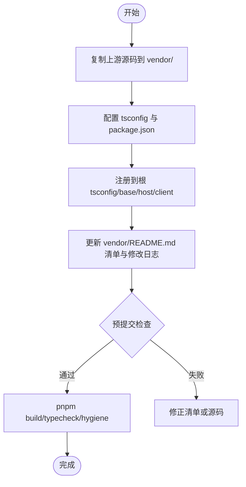
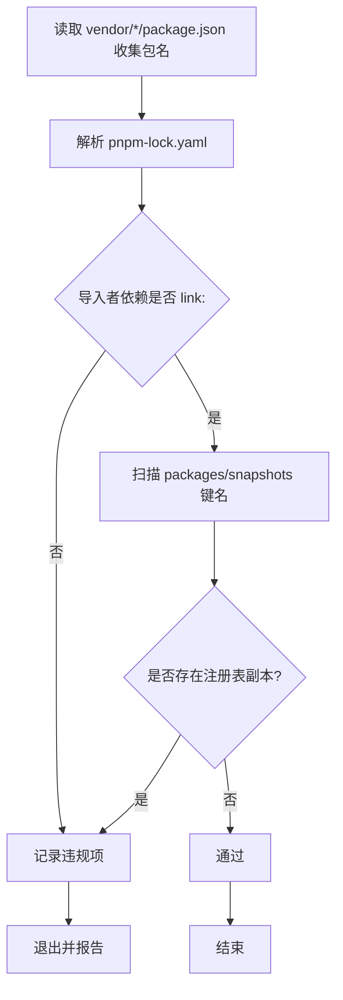
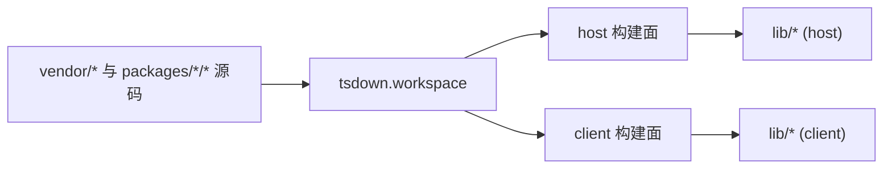
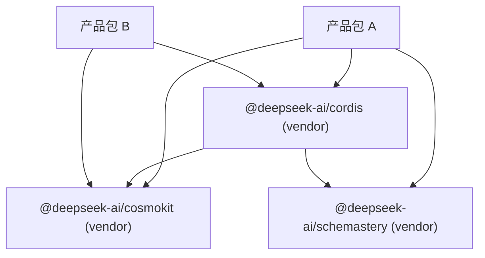

# 内嵌包管理

<cite>
**本文引用的文件**
- [package.json](file://package.json)
- [pnpm-workspace.yaml](file://pnpm-workspace.yaml)
- [vendor/README.md](file://vendor/README.md)
- [docs/cookbook/adding-a-vendored-package.md](file://docs/cookbook/adding-a-vendored-package.md)
- [scripts/rescope-vendor.ts](file://scripts/rescope-vendor.ts)
- [scripts/check-vendor-manifest.sh](file://scripts/check-vendor-manifest.sh)
- [scripts/verify-vendored-links.ts](file://scripts/verify-vendored-links.ts)
- [tsdown.config.ts](file://tsdown.config.ts)
- [scripts/package-invariants.ts](file://scripts/package-invariants.ts)
- [docs/cookbook/adding-a-package.md](file://docs/cookbook/adding-a-package.md)
</cite>

## 目录
1. [简介](#简介)
2. [项目结构](#项目结构)
3. [核心组件](#核心组件)
4. [架构总览](#架构总览)
5. [详细组件分析](#详细组件分析)
6. [依赖关系分析](#依赖关系分析)
7. [性能考量](#性能考量)
8. [故障排查指南](#故障排查指南)
9. [结论](#结论)
10. [附录](#附录)

## 简介
本指南面向需要在应用中“内嵌第三方包”的开发者，结合仓库现有实践，系统说明如何把上游框架与关键依赖以源码形式内嵌到 monorepo 中，实现版本锁定、冲突规避、安全审查、许可证合规与构建优化。文档同时给出内嵌包的配置示例、依赖关系处理流程、更新策略，以及与动态加载包的权衡选择标准。

## 项目结构
仓库采用 pnpm workspace 组织，内嵌包集中在 vendor/ 目录，通过工作区 link 机制将上游 semver 范围解析为本地固定源码；应用与库位于 packages/*/* 与 apps/*，构建由 tsdown 统一编排。



图表来源
- [package.json:11-18](file://package.json#L11-L18)
- [pnpm-workspace.yaml:1-25](file://pnpm-workspace.yaml#L1-L25)
- [tsdown.config.ts:16-29](file://tsdown.config.ts#L16-L29)

章节来源
- [package.json:11-18](file://package.json#L11-L18)
- [pnpm-workspace.yaml:1-25](file://pnpm-workspace.yaml#L1-L25)

## 核心组件
- 内嵌包目录 vendor/：存放上游框架与基础库的源码副本，全部重命名至 @deepseek-ai 作用域，保持私有发布标记，确保可审计、可修补、可锁定。
- 工作区与覆盖：通过 linkWorkspacePackages 与 overrides 将上游 semver 范围解析到本地固定源码，避免从注册表拉取同名包。
- 名称重映射脚本 rescope-vendor：批量将源码、配置与文档中的包名从上游名改写为 @deepseek-ai 作用域名，并维护精确编辑清单与后置条件断言。
- 预提交与 CI 门禁：check-vendor-manifest.sh 强制修改 vendor 源码时同步更新 manifest；verify-vendored-links 保证锁文件中所有内嵌包均解析为 link:。
- 构建编排：tsdown 对 vendor/* 与 packages/*/* 进行统一构建，产出宿主端与客户端两种构建面。
- 包不变式检查：package-invariants 约束包导出、引用与发布清单一致性，防止发布物漂移。

章节来源
- [vendor/README.md:1-61](file://vendor/README.md#L1-L61)
- [pnpm-workspace.yaml:23-55](file://pnpm-workspace.yaml#L23-L55)
- [scripts/rescope-vendor.ts:1-691](file://scripts/rescope-vendor.ts#L1-L691)
- [scripts/check-vendor-manifest.sh:1-18](file://scripts/check-vendor-manifest.sh#L1-L18)
- [scripts/verify-vendored-links.ts:1-73](file://scripts/verify-vendored-links.ts#L1-L73)
- [tsdown.config.ts:16-29](file://tsdown.config.ts#L16-L29)
- [scripts/package-invariants.ts:1-363](file://scripts/package-invariants.ts#L1-L363)

## 架构总览
内嵌包在 monorepo 中的生命周期如下：源码复制 → 名称重映射 → 工作区链接 → 类型与构建 → 门禁校验 → 发布与分发。

```mermaid
sequenceDiagram
Dev as "开发者"
VS as "预提交钩子"
RS as "rescope-vendor"
PNPM as "pnpm install"
TS as "TypeScript/tsdown"
VL as "verify-vendored-links"
CM as "check-vendor-manifest"
Dev->>VS : 提交 vendor/* 源码变更
VS->>CM : 校验是否同步更新 vendor/README.md
CM-->>Dev : 通过/失败
Dev->>RS : 运行名称重映射可选/自动
RS-->>Dev : 改写包名与配置
Dev->>PNPM : 安装工作区
PNPM-->>Dev : 解析 link : 到 vendor/*
Dev->>TS : 构建宿主/客户端
TS-->>Dev : 产出 lib/*
Dev->>VL : 校验锁文件无注册表拷贝
VL-->>Dev : 通过/失败
```

图表来源
- [scripts/check-vendor-manifest.sh:1-18](file://scripts/check-vendor-manifest.sh#L1-L18)
- [scripts/rescope-vendor.ts:1-691](file://scripts/rescope-vendor.ts#L1-L691)
- [pnpm-workspace.yaml:23-55](file://pnpm-workspace.yaml#L23-L55)
- [tsdown.config.ts:16-29](file://tsdown.config.ts#L16-L29)
- [scripts/verify-vendored-links.ts:1-73](file://scripts/verify-vendored-links.ts#L1-L73)

## 详细组件分析

### 内嵌包规范与新增流程
- 复制上游源码到 vendor/<dir>/，保留 README/LICENCE，调整 tsconfig 指向 repo 基线配置，并在 package.json 中标记 private 与重命名后的 scope name。
- 在根配置中注册路径映射与 references，使 host/client 聚合能正确引用内嵌包。
- 更新 vendor/README.md 的清单表格与本地修改日志，确保可追溯。
- 使用预提交钩子与 hygiene 流程验证。



图表来源
- [docs/cookbook/adding-a-vendored-package.md:1-60](file://docs/cookbook/adding-a-vendored-package.md#L1-L60)
- [vendor/README.md:9-61](file://vendor/README.md#L9-L61)
- [scripts/check-vendor-manifest.sh:1-18](file://scripts/check-vendor-manifest.sh#L1-L18)

章节来源
- [docs/cookbook/adding-a-vendored-package.md:1-60](file://docs/cookbook/adding-a-vendored-package.md#L1-L60)
- [vendor/README.md:9-61](file://vendor/README.md#L9-L61)

### 名称重映射与一致性保障
- rescope-vendor 提供通用重写与精确编辑两套机制，覆盖代码、配置、YAML、Markdown 等场景，并通过 POSTCONDITIONS 断言最终状态。
- 支持 --apply/--check 模式，确保幂等性与可回滚性。

```mermaid
classDiagram
class Rescope {
+RENAMES : Rename[]
+EXACT_EDITS : ExactEdit[]
+POSTCONDITIONS : PostCondition[]
+main() void
+rewrite(text, file, all) {text, lines}
+exactEditState(text, find, replace, expect) string
}
class Rename {
+directory : string
+upstream : string
+scoped : string
}
class ExactEdit {
+id : string
+file : string
+find : string
+replace : string
+expect : number
}
class PostCondition {
+file : string
+text : string
+count : number
}
Rescope --> Rename : "使用"
Rescope --> ExactEdit : "使用"
Rescope --> PostCondition : "断言"
```

图表来源
- [scripts/rescope-vendor.ts:38-136](file://scripts/rescope-vendor.ts#L38-L136)
- [scripts/rescope-vendor.ts:491-549](file://scripts/rescope-vendor.ts#L491-L549)
- [scripts/rescope-vendor.ts:580-684](file://scripts/rescope-vendor.ts#L580-L684)

章节来源
- [scripts/rescope-vendor.ts:1-691](file://scripts/rescope-vendor.ts#L1-L691)

### 工作区链接与锁文件校验
- pnpm-workspace.yaml 启用 linkWorkspacePackages，并将特定包通过 overrides 指向 vendor/*，从而让上游 semver 范围解析到本地源码。
- verify-vendored-links 扫描 lockfile，确保所有内嵌包名均解析为 link:，且不在 packages/snapshots 中出现注册表副本。



图表来源
- [pnpm-workspace.yaml:23-55](file://pnpm-workspace.yaml#L23-L55)
- [scripts/verify-vendored-links.ts:14-73](file://scripts/verify-vendored-links.ts#L14-L73)

章节来源
- [pnpm-workspace.yaml:23-55](file://pnpm-workspace.yaml#L23-L55)
- [scripts/verify-vendored-links.ts:1-73](file://scripts/verify-vendored-links.ts#L1-L73)

### 构建与产物编排
- tsdown 以 workspace 模式构建 vendor/* 与 packages/*/*，区分 host/client 构建面，输出到 lib/。
- 通过环境变量控制构建面，避免无关模块进入客户端闭包。



图表来源
- [tsdown.config.ts:16-29](file://tsdown.config.ts#L16-L29)

章节来源
- [tsdown.config.ts:16-29](file://tsdown.config.ts#L16-L29)

### 包不变式与发布契约
- package-invariants 校验每个包的 exports、files、peer/devDependencies 与 TypeScript project references，确保发布物与源码一致。
- 要求非 dsh-invariants 包必须声明 workspace:^ 的 invariants 依赖，并在 tsdown 配置中打包 invariant 产物。

章节来源
- [scripts/package-invariants.ts:80-136](file://scripts/package-invariants.ts#L80-L136)
- [scripts/package-invariants.ts:138-161](file://scripts/package-invariants.ts#L138-L161)
- [scripts/package-invariants.ts:163-239](file://scripts/package-invariants.ts#L163-L239)

### 添加工作区包（对比参考）
- 新包应遵循统一的 package.json 约定、TypeScript 工程结构与 README 模板，便于被工具链发现与校验。
- 与内嵌包不同，工作区包属于产品层，不直接作为平台框架层发布。

章节来源
- [docs/cookbook/adding-a-package.md:7-39](file://docs/cookbook/adding-a-package.md#L7-L39)
- [docs/cookbook/adding-a-package.md:41-119](file://docs/cookbook/adding-a-package.md#L41-L119)

## 依赖关系分析
- 内嵌包通过 pnpm 的 link 机制与工作区解析绑定，避免多份重复实例与运行时竞争。
- 通过 overrides 与 minimumReleaseAgeExclude 精细控制构建行为与更新策略。
- 构建期通过 tsdown 与 TypeScript project references 明确依赖边界，减少意外引入。



图表来源
- [pnpm-workspace.yaml:23-55](file://pnpm-workspace.yaml#L23-L55)
- [vendor/README.md:13-25](file://vendor/README.md#L13-L25)

章节来源
- [pnpm-workspace.yaml:23-55](file://pnpm-workspace.yaml#L23-L55)
- [vendor/README.md:13-25](file://vendor/README.md#L13-L25)

## 性能考量
- 内嵌包在构建期被纳入闭包，可能增大宿主/客户端产物体积；需通过 tsdown 的 client 构建面与外部化策略仅包含必要模块。
- 工作区 link 避免重复下载与编译，提升本地迭代速度。
- 严格限制允许构建的依赖（allowBuilds），减少原生二进制与生命周期脚本带来的构建开销与不确定性。

[本节为通用指导，不直接分析具体文件]

## 故障排查指南
- 预提交失败：若修改了 vendor/*/src 或 bin.js 但未更新 vendor/README.md，check-vendor-manifest.sh 会阻止提交。请补充清单条目后再提交。
- 锁文件校验失败：verify-vendored-links 报错表明存在注册表副本或未解析为 link:。请重新运行 pnpm install 并确保 overrides/linkWorkspacePackages 生效。
- 名称不一致：rescope-vendor --check 失败表示仍有上游名称残留或精确编辑未落地。运行 --apply 后再次检查。
- 构建异常：确认 tsdown 构建面与环境变量设置正确，必要时清理 lib/ 后重试。

章节来源
- [scripts/check-vendor-manifest.sh:1-18](file://scripts/check-vendor-manifest.sh#L1-L18)
- [scripts/verify-vendored-links.ts:39-73](file://scripts/verify-vendored-links.ts#L39-L73)
- [scripts/rescope-vendor.ts:595-684](file://scripts/rescope-vendor.ts#L595-L684)

## 结论
本仓库通过 vendor/ 源码内嵌、工作区 link 与严格的脚本门禁，实现了内嵌包的版本锁定、冲突隔离与安全可控。配合 rescope 与 hygene 流程，可在保证可审计性的前提下高效演进框架层。对于需要热插拔的场景，建议优先评估动态加载方案；对于稳定性与可复现性要求更高的平台能力，内嵌包是更稳妥的选择。

[本节为总结性内容，不直接分析具体文件]

## 附录

### 内嵌包选择与版本锁定
- 选择标准：对运行时稳定性、可审计性、补丁能力有强需求的框架与基础库优先内嵌；对频繁演进且无需深度定制的功能可考虑动态加载。
- 版本锁定：通过 vendor/README.md 清单记录上游版本与 commit，配合 pnpm 锁文件与 link 机制确保可重现构建。

章节来源
- [vendor/README.md:9-61](file://vendor/README.md#L9-L61)
- [pnpm-workspace.yaml:23-55](file://pnpm-workspace.yaml#L23-L55)

### 冲突解决
- 通过 overrides 将上游 semver 范围映射到本地固定源码，避免多版本并存。
- 使用 verify-vendored-links 检测锁文件中的异常解析，及时修复。

章节来源
- [pnpm-workspace.yaml:23-55](file://pnpm-workspace.yaml#L23-L55)
- [scripts/verify-vendored-links.ts:1-73](file://scripts/verify-vendored-links.ts#L1-L73)

### 安全审查与许可证合规
- 内嵌包保留上游 LICENSE 文件，并通过 gen-third-party-notices 生成第三方通知清单。
- 对 allowBuilds 白名单外的依赖默认拒绝构建，降低供应链风险。

章节来源
- [vendor/README.md:1-61](file://vendor/README.md#L1-L61)
- [pnpm-workspace.yaml:35-55](file://pnpm-workspace.yaml#L35-L55)

### 包更新策略
- 更新步骤：记录上游 commit → 复制源码 → 重放本地修改 → 更新清单 → 运行安装/测试/构建。
- 建议在 PR 中同时提交源码与清单变更，并通过 CI 门禁验证。

章节来源
- [vendor/README.md:52-61](file://vendor/README.md#L52-L61)

### 内嵌包 vs 动态加载的权衡
- 内嵌包优势：确定性构建、易审计、可补丁、易于版本治理。
- 动态加载优势：按需加载、减小初始体积、灵活升级。
- 选择标准：平台级能力与关键依赖建议内嵌；插件型、可替换能力可考虑动态加载。

[本节为概念性内容，不直接分析具体文件]

### 实际配置示例（路径指引）
- 新增内嵌包清单与步骤：[docs/cookbook/adding-a-vendored-package.md:1-60](file://docs/cookbook/adding-a-vendored-package.md#L1-L60)
- 工作区与覆盖配置：[pnpm-workspace.yaml:1-55](file://pnpm-workspace.yaml#L1-L55)
- 名称重映射与断言：[scripts/rescope-vendor.ts:1-691](file://scripts/rescope-vendor.ts#L1-L691)
- 预提交与锁文件校验：[scripts/check-vendor-manifest.sh:1-18](file://scripts/check-vendor-manifest.sh#L1-L18), [scripts/verify-vendored-links.ts:1-73](file://scripts/verify-vendored-links.ts#L1-L73)
- 构建编排：[tsdown.config.ts:16-29](file://tsdown.config.ts#L16-L29)
- 包不变式约束：[scripts/package-invariants.ts:80-136](file://scripts/package-invariants.ts#L80-L136)