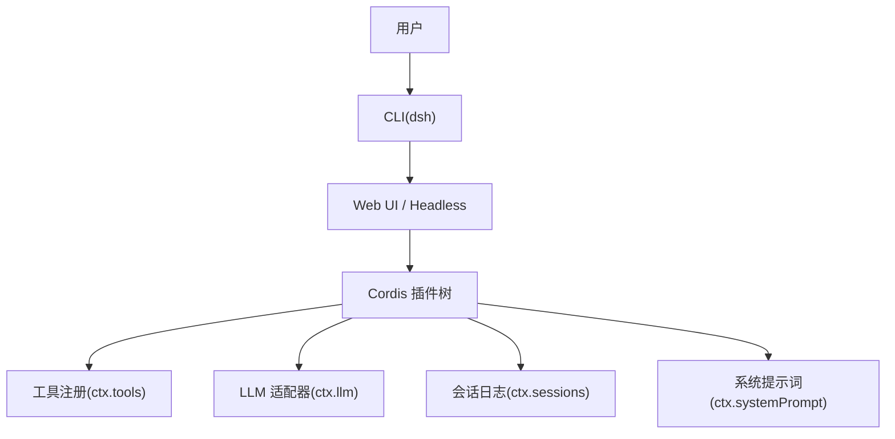
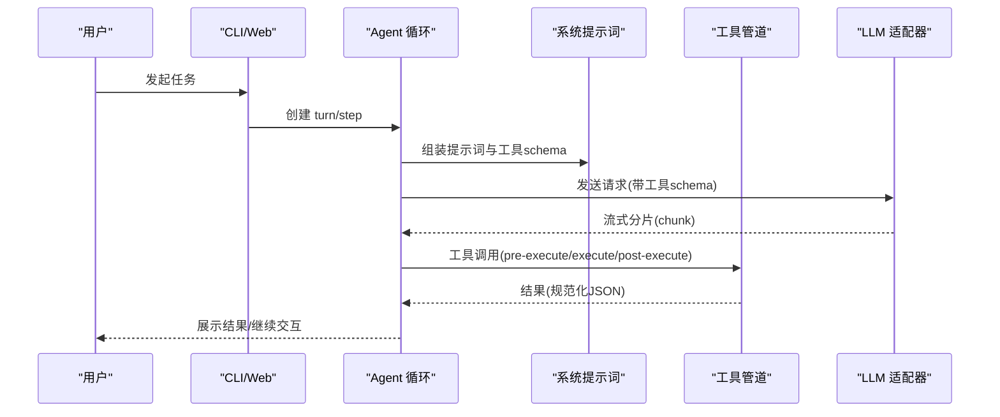
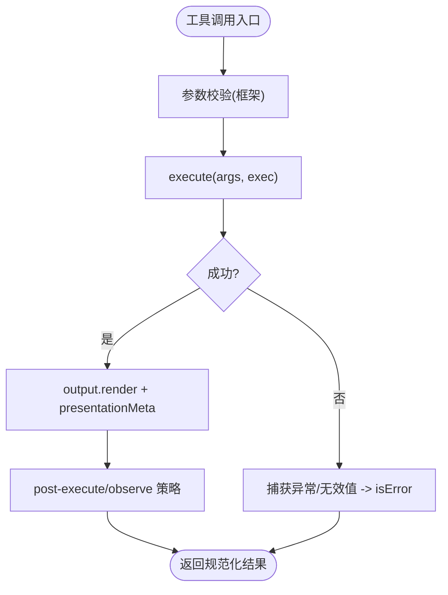
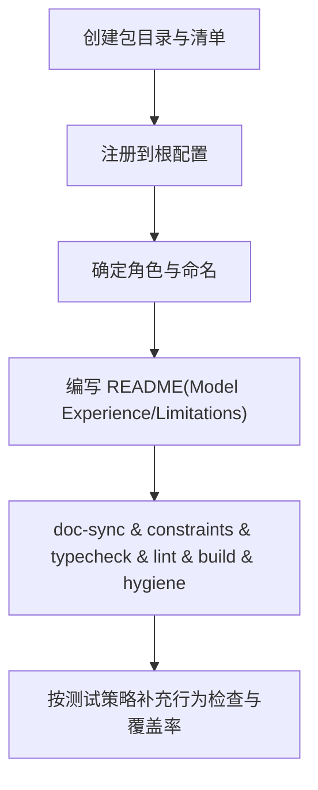
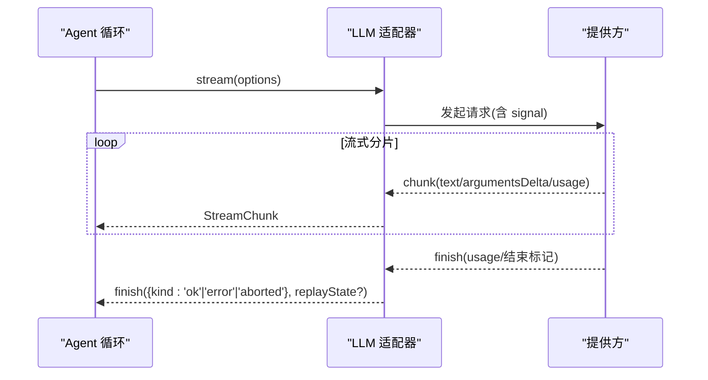
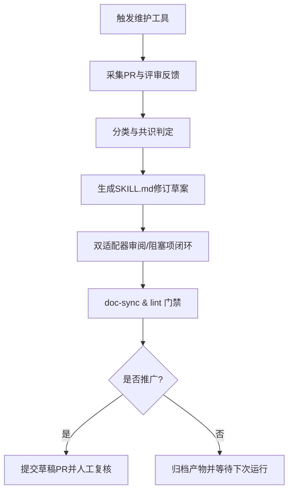
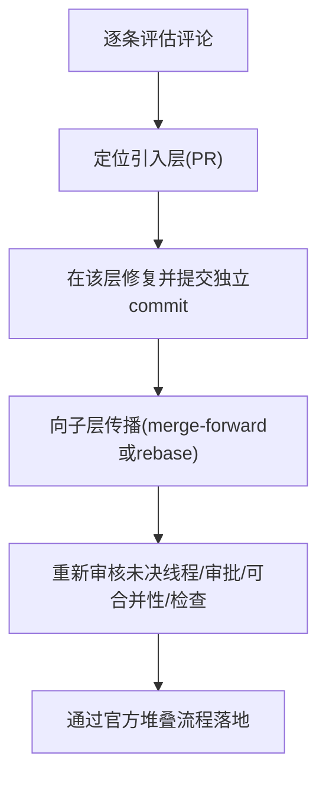
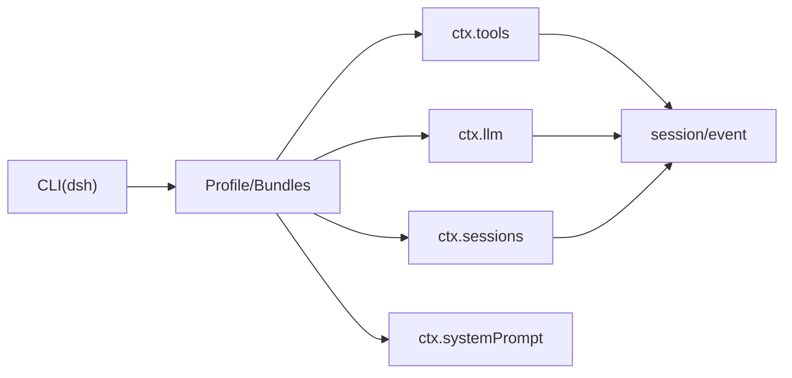

# 实战指南

<cite>
**本文引用的文件**
- [README.md](file://README.md)
- [architecture.md](file://docs/architecture.md)
- [adding-a-tool.md](file://docs/cookbook/adding-a-tool.md)
- [adding-a-tool.zh.md](file://docs/cookbook/adding-a-tool.zh.md)
- [adding-a-package.md](file://docs/cookbook/adding-a-package.md)
- [adding-a-package.zh.md](file://docs/cookbook/adding-a-package.zh.md)
- [adding-an-llm-adapter.md](file://docs/cookbook/adding-an-llm-adapter.md)
- [adding-an-llm-adapter.zh.md](file://docs/cookbook/adding-an-llm-adapter.zh.md)
- [maintaining-dsh-code-review.md](file://docs/cookbook/maintaining-dsh-code-review.md)
- [responding-to-pr-review-on-a-stack.md](file://docs/cookbook/responding-to-pr-review-on-a-stack.md)
- [index.md](file://docs/user/guide/index.md)
- [README.md](file://apps/cli/README.md)
- [README.md](file://examples/README.md)
</cite>

## 目录
1. [简介](#简介)
2. [项目结构](#项目结构)
3. [核心组件](#核心组件)
4. [架构总览](#架构总览)
5. [详细组件分析](#详细组件分析)
6. [依赖关系分析](#依赖关系分析)
7. [性能与可靠性](#性能与可靠性)
8. [故障排查指南](#故障排查指南)
9. [结论](#结论)
10. [附录：渐进式学习路径](#附录：渐进式学习路径)

## 简介
本实战指南面向需要在 DeepSeek Harness（dsh）中完成真实开发任务的工程师，提供从“添加工具、添加包、添加 LLM 适配器”到“维护代码审查”的完整流程。内容基于仓库中的官方实操手册与架构文档，结合 CLI/Web 使用方式与示例工程，给出可操作的步骤、关键约定与常见问题解决方案。通过由浅入深的学习路径，帮助你快速上手并掌握 dsh 的插件化扩展能力。

## 项目结构
- 顶层入口与运行方式
  - 通过 npm 或源码构建后启动 Web UI；默认监听本地端口，便于交互式调试与演示。
- 应用层
  - apps/cli：命令行入口，支持 web、headless 等模式与 profile 组合。
  - apps/web：Web 前端与端到端测试。
- 核心包
  - packages/*：按能力拆分的核心包（如 llm、tools、session、core 等），遵循 Cordis 插件体系。
- 示例与文档
  - examples/*：可运行的示例工程，覆盖 headless-agent、jsonrpc-agent、web-cordis、acp-agent 等场景。
  - docs/*：架构、子系统、用户指南与 cookbook 实操手册。

图表来源
- [architecture.md:15-37](file://docs/architecture.md#L15-L37)
- [README.md:15-35](file://README.md#L15-L35)

章节来源
- [README.md:15-35](file://README.md#L15-L35)
- [architecture.md:15-37](file://docs/architecture.md#L15-L37)

## 核心组件
- 插件与能力缝（Capability Seams）
  - 一切皆插件：模型适配器、工具注册表、会话日志、Agent 循环均可替换。
  - 通过 ctx.* 暴露的能力缝进行扩展：ctx.tools、ctx.llm、ctx.sessions、ctx.systemPrompt 等。
- 事件驱动的执行流
  - turn/step 生命周期、agent/request、llm/stream、tools/* 事件构成主执行流。
  - 所有进入模型的可见输入必须可重放，体现为持久化的 session 事件。

章节来源
- [architecture.md:9-13](file://docs/architecture.md#L9-L13)
- [architecture.md:53-89](file://docs/architecture.md#L53-L89)

## 架构总览
下图展示了 dsh 的典型调用链：用户请求经 CLI/Web 进入 Agent 循环，组装提示词与工具 schema，调用 LLM 流式响应，并在工具执行阶段通过 tools/* 事件进行策略控制与观测。

图表来源
- [architecture.md:63-89](file://docs/architecture.md#L63-L89)
- [architecture.md:98-128](file://docs/architecture.md#L98-L128)

## 详细组件分析

### 添加工具（Tool）
目标：在 dsh 中注册一个面向模型的工具，使其参与提示词装配与执行流水线。

- 最小形态与注册
  - 通过 defineTool 声明 name、description、parameters、output.schema/render、execute。
  - 注册为副作用：插件 fiber 释放时自动注销工具；schema 自动流入系统提示词。
- execute() 契约要点
  - 参数已由框架校验；args 类型安全。
  - 返回规范 JSON 值；异常或无效值视为错误分支。
  - 遵守 exec.signal 取消语义；可使用 exec.agent 注入上下文。
  - 可选 presentationMeta 用于持久化卡片元数据，回放可重现。
- 长时间工作
  - 通过 producer 配置 run_in_background，并使用 ctx.jobs.start 注册后台任务。
  - 前台工作绑定 exec.signal；后台任务有独立生命周期与取消信号。
- 执行策略与观测
  - 使用 tools/pre-execute、tools/execute、tools/post-execute、tools/result 等扩展点实现权限门禁、超时重试、指标收集、结果替换与观察。
- Code Mode 集成
  - 已注册工具可直接 await tools.<name>(args)，返回最终规范化 JSON。
- UI 渲染
  - presentCall/presentResult 返回 card-tagged 渲染意图（generic/terminal/diff/search/web）。
  - 纯函数约束：不得做 I/O、读会话状态或使用时钟/随机数。

图表来源
- [adding-a-tool.md:40-67](file://docs/cookbook/adding-a-tool.md#L40-L67)
- [adding-a-tool.zh.md:40-67](file://docs/cookbook/adding-a-tool.zh.md#L40-L67)

章节来源
- [adding-a-tool.md:7-67](file://docs/cookbook/adding-a-tool.md#L7-L67)
- [adding-a-tool.zh.md:7-67](file://docs/cookbook/adding-a-tool.zh.md#L7-L67)

### 添加包（Package）
目标：为 dsh 新增一个 workspace 包，遵循仓库约束与命名规范。

- 创建包
  - 目录结构：package.json、tsconfig.json、src/index.ts、README.md。
  - package.json 不变式：private、version、type/module、main/types/exports、peer/devDependencies 镜像、files 白名单等。
- 根配置注册
  - tsconfig.base.json/host/client.json 的 references；必要时更新 knip.json。
- 包拓扑与命名
  - 明确 Service Definition/Provider/Consumer 角色边界；按职责选择 Controller/Store/Runtime/Registry 等命名。
- README 规范
  - Model Experience 三段式（What the model sees / Token effect / KV Cache effect）与 Known Limitations。
- 验证
  - doc-sync、constraints、typecheck、lint、build、hygiene；遵循仓库测试策略。

图表来源
- [adding-a-package.md:7-39](file://docs/cookbook/adding-a-package.md#L7-L39)
- [adding-a-package.zh.md:7-39](file://docs/cookbook/adding-a-package.zh.md#L7-L39)

章节来源
- [adding-a-package.md:7-39](file://docs/cookbook/adding-a-package.md#L7-L39)
- [adding-a-package.zh.md:7-39](file://docs/cookbook/adding-a-package.zh.md#L7-L39)

### 添加 LLM 适配器（Adapter）
目标：接入新的模型提供方，遵循流式协议与错误处理约定。

- 基本形态
  - 继承 LlmAdapter，实现 stream(options): AsyncIterable<StreamChunk>。
  - 通过 apply(ctx, config) 将适配器注册到 ctx.llm。
- 协议义务
  - usage 必须在 finish 之前发出；finish 之后不再输出任何内容。
  - 工具调用 arguments 全程为原始 JSON 字符串；以 argumentsDelta 流式片段传递。
  - 块 index 按首次出现顺序分配并复用。
  - 错误两条合法路径：抛出 LlmError（传输/协议失败）或 finish{kind:'error'|'aborted'}（提供方内联失败）。
  - 遵守 options.signal；不支持的选项抛 UNSUPPORTED。
  - 如需原生元数据，以 finish.replayState 最小无损 JSON 投影携带，重建历史时校验。
- 模型元数据与推理强度
  - 实现 resolveModel() 返回 provider/model 身份与可选 context/reasoning；仅当存在配置默认值才声明 defaultEffort。
- 实现结构
  - 分离 wire types、序列化、传输解析、分片转换与适配器类；参考 llm-deepseek 布局。

图表来源
- [adding-an-llm-adapter.md:25-35](file://docs/cookbook/adding-an-llm-adapter.md#L25-L35)
- [adding-an-llm-adapter.zh.md:25-35](file://docs/cookbook/adding-an-llm-adapter.zh.md#L25-L35)

章节来源
- [adding-an-llm-adapter.md:7-39](file://docs/cookbook/adding-an-llm-adapter.md#L7-L39)
- [adding-an-llm-adapter.zh.md:7-39](file://docs/cookbook/adding-an-llm-adapter.zh.md#L7-L39)

### 维护代码审查（Skill 维护）
目标：了解 dsh-code-review skill 的维护流程与操作规范。

- 维护者接收物
  - 每日/每周窗口抓取 PR 合并记录，收集评审反馈与落地证据，分类并生成修订草案。
- 候选产物审阅
  - 审阅 diff、SKILL.md 与 manifest，交叉核对来源评论与落地 commit。
- 决策与推广
  - 丢弃/批量/推广；推广需保持 master 清洁，校验技能漂移后再提交 PR。
- 中断与交接
  - 处理漏跑、提供商宕机、交接等情形；确保机制可审计与可恢复。

图表来源
- [maintaining-dsh-code-review.md:7-17](file://docs/cookbook/maintaining-dsh-code-review.md#L7-L17)
- [maintaining-dsh-code-review.md:19-48](file://docs/cookbook/maintaining-dsh-code-review.md#L19-L48)

章节来源
- [maintaining-dsh-code-review.md:7-48](file://docs/cookbook/maintaining-dsh-code-review.md#L7-L48)

### 跨堆叠 PR 的评审回复
目标：在多 PR 堆叠链中正确定位问题来源、修复与传播。

- 基本原则
  - 每个 PR 分支一个 worktree；GitHub stack 权威；修复落回引入问题的 PR 并向上游传播；每次修复独立提交；谨慎选择 merge-forward 或 rebase。
- 解决流程
  - 逐条评估评论；映射到引入层修复；按序传播至子层；信任但验证代理修复；在评审线程回复；重新审核未决线程与检查；通过官方堆叠流程落地。

图表来源
- [responding-to-pr-review-on-a-stack.md:7-25](file://docs/cookbook/responding-to-pr-review-on-a-stack.md#L7-L25)

章节来源
- [responding-to-pr-review-on-a-stack.md:7-33](file://docs/cookbook/responding-to-pr-review-on-a-stack.md#L7-L33)

## 依赖关系分析
- 运行时入口
  - CLI 负责命令语法与模式分发；web/headless 作为 profile 加载 bundles 与 patch。
- 能力缝依赖
  - 工具注册依赖 ctx.tools；LLM 适配器依赖 ctx.llm；会话与提示词分别依赖 ctx.sessions 与 ctx.systemPrompt。
- 事件耦合
  - agent/*、tools/*、session/event 构成松耦合扩展点，降低模块间直接依赖。

图表来源
- [architecture.md:39-52](file://docs/architecture.md#L39-L52)
- [architecture.md:98-128](file://docs/architecture.md#L98-L128)

章节来源
- [architecture.md:39-52](file://docs/architecture.md#L39-L52)
- [architecture.md:98-128](file://docs/architecture.md#L98-L128)

## 性能与可靠性
- 流式处理
  - LLM 适配器应缓冲 finish/usage 直到提供方结束标记再 flush，避免尾部 usage-only 分片导致的不一致。
- 取消与超时
  - 工具与适配器均需遵守 exec.signal/options.signal；后台任务使用任务自有取消信号，避免外层取消误杀已发布工作。
- 可重放性
  - 所有模型可见输入必须持久化为 session 事件，保证回放与 UI 保真。
- 策略与观测
  - 通过 tools/* 事件实现幂等的超时、重试与指标收集，避免在工具内部硬编码部署策略。

章节来源
- [adding-an-llm-adapter.md:25-35](file://docs/cookbook/adding-an-llm-adapter.md#L25-L35)
- [adding-a-tool.md:51-67](file://docs/cookbook/adding-a-tool.md#L51-L67)
- [architecture.md:92-97](file://docs/architecture.md#L92-L97)

## 故障排查指南
- 工具执行失败
  - 检查 output.schema 与返回值是否符合规范；确认 presentationMeta 纯函数约束；查看 tools/post-execute 是否替换了结果。
- 长时间任务卡住
  - 确认后台任务通过 ctx.jobs.start 注册；区分 exec.signal 与任务自有取消信号；检查 job_kill 与 owner dispose 的生命周期。
- LLM 适配器异常
  - 确认 usage 在 finish 前发出；finish 后无额外输出；错误走抛出或 finish{kind:'error'|'aborted'}；检查 options.signal 传递。
- 提示词不生效
  - 确认工具 schema 已注册并被系统提示词装配；检查 agent/pre-step 是否重写或拒绝消息。
- 会话回放不一致
  - 确保所有模型可见输入都写入 session 事件；避免在 presentCall/presentResult 中读取会话状态或做 I/O。

章节来源
- [adding-a-tool.md:40-67](file://docs/cookbook/adding-a-tool.md#L40-L67)
- [adding-an-llm-adapter.md:25-35](file://docs/cookbook/adding-an-llm-adapter.md#L25-L35)
- [architecture.md:63-89](file://docs/architecture.md#L63-L89)

## 结论
通过插件化架构与能力缝设计，DeepSeek Harness 提供了高度可扩展的 Agent 运行时。借助本指南的步骤与约定，你可以快速添加工具、包与 LLM 适配器，并以事件驱动的方式实现策略控制与观测。配合示例工程与 CLI/Web 使用方式，能够高效完成从简单任务到复杂编排的开发需求。

## 附录：渐进式学习路径
- 入门
  - 使用 Web UI：安装 Node.js，通过 npx 或源码构建启动 Web UI，配置模型与选择工作区，发送任务。
  - 阅读 CLI 说明：了解 profile、bundles、patch 的组合与参数转发。
- 进阶
  - 添加工具：按照最小形态与 execute 契约，完成工具注册与 UI 渲染。
  - 添加包：遵循包清单与 README 规范，完成根配置注册与验证。
  - 添加 LLM 适配器：实现流式协议与错误处理，接入新提供方。
- 高级
  - 维护代码审查：理解 skill 维护流程，产出与推广修订。
  - 跨堆叠 PR 评审：在多 PR 链中正确定位、修复与传播问题。

章节来源
- [index.md:7-23](file://docs/user/guide/index.md#L7-L23)
- [README.md:1-48](file://apps/cli/README.md#L1-L48)
- [README.md:1-30](file://examples/README.md#L1-L30)