# 扩展开�手册

<cite>
**本文引用的文件**
- [cordis-primer.md](file://docs/cordis-primer.md)
- [extensions.md](file://docs/subsystems/extensions.md)
- [tool-catalog.md](file://docs/tool-catalog.md)
- [extension-cookbook.md](file://docs/cookbook/extension-cookbook.md)
- [adding-a-tool.md](file://docs/cookbook/adding-a-tool.md)
- [adding-a-package.md](file://docs/cookbook/adding-a-package.md)
- [service.md](file://docs/cordis-api/service.md)
- [events.md](file://docs/cordis-api/events.md)
- [core.md](file://docs/subsystems/core.md)
- [README.md](file://packages/extensions/README.md)
</cite>

## 目录
1. [简介](#简介)
2. [项目结�](#项目结�)
3. [核心组件](#核心组件)
4. [��总览](#��总览)
5. [详细组件分�](#详细组件分�)
6. [�赖关系分�](#�赖关系分�)
7. [性能��维护性](#性能��维护性)
8. [故障�查指�](#故障�查指�)
9. [结论](#结论)
10. [附录：端到端工作�](#附录端到端工作�)

## 简介
本手册��需�在 DeepSeek Harness（DSH）中�建�扩展��维护的�业级扩展的开�者。内容覆盖�件����务扩展�工具扩展�UI 扩展�动�包�行�事件处��状�管��扩展间通信，以��需求到部署上线的完整工作�。通过官方文档���索引，帮助你快速定����置并�循最佳�践。

## 项目结�
DeepSeek Harness 采用“微内核 + �件�的��：核心�系统�供会��系统�示�工具注册�Agent 循�等基础能力；所有业务特性以 Cordis �件形�挂载到共享上下文 ctx 上。扩展�以围绕以下维度进行：
- �务扩展：在 ctx 上暴露稳定 API（如 ctx.tools�ctx.sessions�ctx.agents）。
- 工具扩展：�模�暴露�调用工具，��系统�示装��执行策略。
- UI 扩展：订阅 session/event �，渲染对�节点或��。
- 动�包：�许 Agent 在�行时定义��行�撤销�件（Host/Client ��包）。
- 事件扩展：通过 typed events 进行跨�件通信�策略拦截。

```mermaid
graph TB
subgraph "核心"
A["会�日志<br/>ctx.sessions"]
B["系统�示装�<br/>ctx.systemPrompt"]
C["工具注册�执行<br/>ctx.tools"]
D["Agent 循���柄<br/>ctx.agents"]
end
subgraph "扩展"
E["�务扩展"]
F["工具扩展"]
G["UI 扩展"]
H["动�包�行<br/>Host/Client ��包"]
I["事件扩展"]
end
E --> C
F --> C
G --> A
H --> C
I --> A
I --> C
D --> A
D --> C
```

图表��
- [core.md:1-200](file://docs/subsystems/core.md#L1-L200)
- [extensions.md:1-365](file://docs/subsystems/extensions.md#L1-L365)

章节��
- [core.md:1-200](file://docs/subsystems/core.md#L1-L200)
- [extensions.md:1-365](file://docs/subsystems/extensions.md#L1-L365)

## 核心组件
- 上下文��务：�件通过 inject 声��赖，将能力以稳定键�挂载到 ctx（如 tools�sessions�agents），其他�件按 key ��，��硬耦�。
- 事件系统：typed events 支� emit�waterfall�parallel�serial 等分�模�，用�观察�包装�扇出�顺�决策。
- 工具管线：工具注册�自动进入系统�示装��执行策略链（pre-execute → execute → post-execute → result），支���任务�超时�审计�呈�。
- 动�包：Host 负责定义�沙箱�生命周期；Client 负责�览器侧评估�交互；两者通过请求-�应�议�作，并�供 inspect 查询。
- UI 扩展：基� session/event �渲染，并通过 agent.followup/steer/inject 驱动输入�上下文注入。

章节��
- [cordis-primer.md:1-45](file://docs/cordis-primer.md#L1-L45)
- [events.md:1-208](file://docs/cordis-api/events.md#L1-L208)
- [service.md:1-103](file://docs/cordis-api/service.md#L1-L103)
- [tool-catalog.md:1-800](file://docs/tool-catalog.md#L1-L800)
- [extensions.md:1-365](file://docs/subsystems/extensions.md#L1-L365)

## ��总览
下图展示�件如何�入核心�系统，并以事件和工具为纽带形��耦�生�。

```mermaid
sequenceDiagram
participant Model as "模�/调用方"
participant Tools as "工具注册�执行"
participant Events as "事件系统"
participant Session as "会�日志"
participant Agent as "Agent 循�"
Model->>Tools : 调用工具(�数校验/策略拦截)
Tools->>Events : tools/pre-execute (策略/��)
Events-->>Tools : 决策(allow/deny/ask)
Tools->>Session : 记录 tool/call
Tools->>Model : 返�结�(规范化 JSON)
Tools->>Events : tools/post-execute / tools/result
Agent->>Session : 读���/组装系统�示
Agent->>Model : 下一轮请求
```

图表��
- [tool-catalog.md:1-800](file://docs/tool-catalog.md#L1-L800)
- [events.md:1-208](file://docs/cordis-api/events.md#L1-L208)
- [core.md:1-200](file://docs/subsystems/core.md#L1-L200)

## 详细组件分�

### �件�上下文（Cordis 基础）
- �件是对象或�务，通过 inject 声�所需�务，apply(ctx) 完�注册。
- 所有注册都是�逆 effect，�载时自动�滚。
- 事件分�模�决定监�器执行顺��返�值语义。

```mermaid
flowchart TD
Start(["�件加载"]) --> Inject["解� inject �赖"]
Inject --> Apply["执行 apply(ctx)"]
Apply --> Register["注册�务/事件/工具/UI"]
Register --> Effect["effect 登记以便�载"]
Effect --> End(["�件就绪"])
```

图表��
- [cordis-primer.md:1-45](file://docs/cordis-primer.md#L1-L45)
- [service.md:1-103](file://docs/cordis-api/service.md#L1-L103)

章节��
- [cordis-primer.md:1-45](file://docs/cordis-primer.md#L1-L45)
- [service.md:1-103](file://docs/cordis-api/service.md#L1-L103)

### �务扩展
- 通过继承 Service 或在 apply 中 provide，将能力挂载到 ctx 的稳定键。
- 使用类��并扩展 ctx ��，使消费方�得类�安全。
- �务之间通过 inject 解耦，���动顺�问题。

章节��
- [service.md:1-103](file://docs/cordis-api/service.md#L1-L103)
- [cordis-primer.md:1-45](file://docs/cordis-primer.md#L1-L45)

### 工具扩展
- 使用 defineTool 注册工具，schema 自动进入系统�示装�。
- 执行路径�策略层�护：tools/pre-execute（�许/拒�/询问）�tools/execute（超时/�试/指标）�tools/post-execute（结�转�/附加上下文）�tools/result（�读观测）。
- 支���任务：run_in_background + ctx.jobs.start，返��柄供 job_* 工具管�。
- 输出规范：output.schema �述程�化返�值；output.render 生�模��读内容；presentationMeta 用� UI �片�久化。

```mermaid
sequenceDiagram
participant M as "模�"
participant T as "工具执行"
participant P as "策略层"
participant J as "��任务"
participant S as "会�日志"
M->>T : 调用工具
T->>P : tools/pre-execute
P-->>T : 决策
alt �许
T->>S : 记录 tool/call
opt ��任务
T->>J : start({kind,label,owner,run})
J-->>T : jobId
end
T-->>M : 规范化结�(JSON)
T->>P : tools/post-execute / tools/result
else 拒�/询问
T-->>M : 结�化拒�/等待用户�答
end
```

图表��
- [adding-a-tool.md:1-95](file://docs/cookbook/adding-a-tool.md#L1-L95)
- [tool-catalog.md:1-800](file://docs/tool-catalog.md#L1-L800)

章节��
- [adding-a-tool.md:1-95](file://docs/cookbook/adding-a-tool.md#L1-L95)
- [tool-catalog.md:1-800](file://docs/tool-catalog.md#L1-L800)

### UI 扩展
- 订阅 session/event �（assistant/chunk�turn/step 边界�tool 活动）进行渲染。
- 通过 agent.followup/steer/inject 驱动输入�上下文注入。
- 对� Web Client 的业务行，注册 ConversationNodeDefinition � keyed Chat renderer。

章节��
- [extension-cookbook.md:1-130](file://docs/cookbook/extension-cookbook.md#L1-L130)

### 动�包（Host/Client ��包）
- Host 端：定义注册表�node:vm 沙箱�请求-�应往返�inspect 查询。
- Client 端：�览器内评估定义��应�行请求��步 inspect 清�。
- 模���工具：cordis_define�cordis_run�cordis_stop�cordis_undefine�cordis_inspect_*。
- 事件：dynamic-package�dynamic-retract�request-run�inspect-query 等。

```mermaid
sequenceDiagram
participant Model as "模�"
participant Tool as "cordis 工具集"
participant Host as "Host Runner"
participant Client as "Client Runner"
Model->>Tool : cordis_define(code.host/client)
Tool->>Host : 验�并记录 Package
Model->>Tool : cordis_run(pluginId, packageId, mode)
Tool->>Host : �动 Host �包
Host-->>Client : request-run如需�览器
Client-->>Host : resolveRequestRun批准/结�
Host-->>Tool : 激活�功/失败
Tool-->>Model : è¿”å›�è¿�行标识或拒ç»�å�Ÿå›
```

图表��
- [extensions.md:1-365](file://docs/subsystems/extensions.md#L1-L365)
- [README.md:1-13](file://packages/extensions/README.md#L1-L13)

章节��
- [extensions.md:1-365](file://docs/subsystems/extensions.md#L1-L365)
- [README.md:1-13](file://packages/extensions/README.md#L1-L13)

### 事件扩展�状�管�
- 事件类��分�模�由�系统页�生�，确�契约一致。
- 常用模�：
  - emit：无返�值，观察�。
  - waterfall：中间件�包装，next() 委派或短路。
  - parallel：并行监�，全部完��决议。
  - serial：顺�监�，首个�空返�值�决议。
- 状�管�建议：
  - 使用会�日志作为�一事��（append-only）。
  - 通过 ctx.effect 管�副作用，���载有�。
  - 对长生命周期资�（PTY��进程�网络）使用�柄�清��调。

章节��
- [events.md:1-208](file://docs/cordis-api/events.md#L1-L208)
- [core.md:1-200](file://docs/subsystems/core.md#L1-L200)

### 扩展间通信
- 通过事件总线（emit/waterfall/parallel/serial）进行解耦通信。
- 通过工具注册�系统�示装�，让模�在��扩展间�调工作。
- 通过 Agent �柄的 followup/steer/inject ��跨轮次/步骤的消�传递。

章节��
- [events.md:1-208](file://docs/cordis-api/events.md#L1-L208)
- [core.md:1-200](file://docs/subsystems/core.md#L1-L200)

## �赖关系分�
- �件�赖通过 inject 显�声�，�����动顺�。
- 工具� UI ��赖核心�系统（tools�sessions�systemPrompt�agents）。
- 动�包�赖 Host/Client ��包�供的�行时能力。

```mermaid
graph LR
Core["核心�系统<br/>session/systemPrompt/tools/agents"] --> Tools["工具扩展"]
Core --> UI["UI 扩展"]
Core --> Events["事件扩展"]
Dynamic["动�包<br/>Host/Client"] --> Tools
Dynamic --> Events
```

图表��
- [core.md:1-200](file://docs/subsystems/core.md#L1-L200)
- [extensions.md:1-365](file://docs/subsystems/extensions.md#L1-L365)

章节��
- [core.md:1-200](file://docs/subsystems/core.md#L1-L200)
- [extensions.md:1-365](file://docs/subsystems/extensions.md#L1-L365)

## 性能��维护性
- 工具执行：
  - 使用 output.schema �述程�化返�值，��在 prose 中�带结�化数�。
  - ��任务通过 ctx.jobs 管�，��阻�主循�。
  - ��设置超时��消信�（exec.signal）。
- 事件�状�：
  - 优先使用 append-only 会�日志，�少状�漂移。
  - 使用 waterfall �策略层，���调性��组�性。
- 动�包：
  - 严格区分 Host/Client �责，��跨域副作用。
  - 使用 inspect 工具进行�读诊断，�修改�行时。
- 代�组织：
  - �循添加包的清�（命��导出�引用�README 模�）。
  - 将能力拆分为 Definition/Provider/Consumer 多包，便�独立演进。

章节��
- [adding-a-tool.md:1-95](file://docs/cookbook/adding-a-tool.md#L1-L95)
- [adding-a-package.md:1-119](file://docs/cookbook/adding-a-package.md#L1-L119)
- [extensions.md:1-365](file://docs/subsystems/extensions.md#L1-L365)

## 故障�查指�
- 工具执行失败：
  - 检查 tools/pre-execute 是�拒�；确认 exec.signal 是�被替�或��中止。
  - 查看 tool/call � tool/result 事件，定�失败阶段。
- 动�包无法�行：
  - 使用 cordis_inspect_list � cordis_inspect_query 核对 Provider/方法签�。
  - 使用 cordis_inspect_self 查看当� Plugin/Package 版本��行�。
  - 若需�览器侧能力，确认 request-run �程已批准。
- UI 渲染异常：
  - 确认 session/event 订阅是�正确过滤 assistant/chunk。
  - 检查 presentCall/presentResult 的纯函数约�（��访问会�状�或时钟）。
- 事件未触�：
  - 确认事件�称�分�模�匹�；检查 listener 注册是�在 effect 内。
  - 使用 prepend �制优先级，必�时拆分监�器�责。

章节��
- [tool-catalog.md:1-800](file://docs/tool-catalog.md#L1-L800)
- [extensions.md:1-365](file://docs/subsystems/extensions.md#L1-L365)
- [extension-cookbook.md:1-130](file://docs/cookbook/extension-cookbook.md#L1-L130)

## 结论
DeepSeek Harness 通过 Cordis �件框��事件驱动的核心�系统，�供了高度�扩展的扩展体系。借助工具��务�UI�动�包�事件机制，你�以�建�业级��维护��演进的解决方案。�循本文的工作��最佳�践，能够显著��集��本并��稳定性。

## 附录：端到端工作�
- 需求分�：�确扩展目标（工具/�务/UI/动�包），识别所需核心能力（tools/sessions/systemPrompt/agents）。
- 设计�规划：选择�适的事件分�模�；设计工具 schema �输出；划分 Host/Client �责（动�包）。
- ��：
  - 工具：defineTool + 策略层 + ��任务（�选）。
  - �务：inject �赖 + ctx 键暴露。
  - UI：订阅 session/event + 渲染 + 输入驱动。
  - 动�包：定义 Package�Host/Client �包�inspect 查询。
- 测试�验�：�循仓库测试策略；使用快照�覆盖��求；验�工具 schema �呈�。
- 集���布：更新根�置（references�workspaces）；�行 doc-sync�constraints�typecheck�lint�build�hygiene；按需�布。

章节��
- [adding-a-package.md:1-119](file://docs/cookbook/adding-a-package.md#L1-L119)
- [extension-cookbook.md:1-130](file://docs/cookbook/extension-cookbook.md#L1-L130)
- [tool-catalog.md:1-800](file://docs/tool-catalog.md#L1-L800)