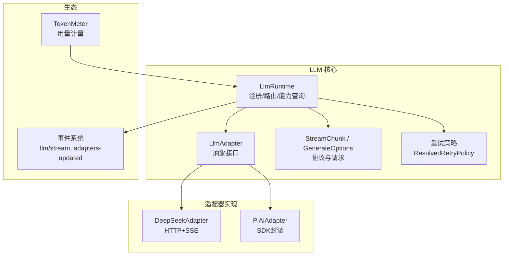
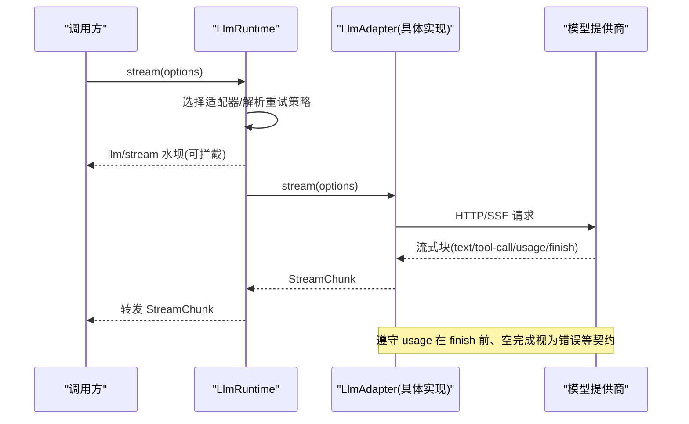
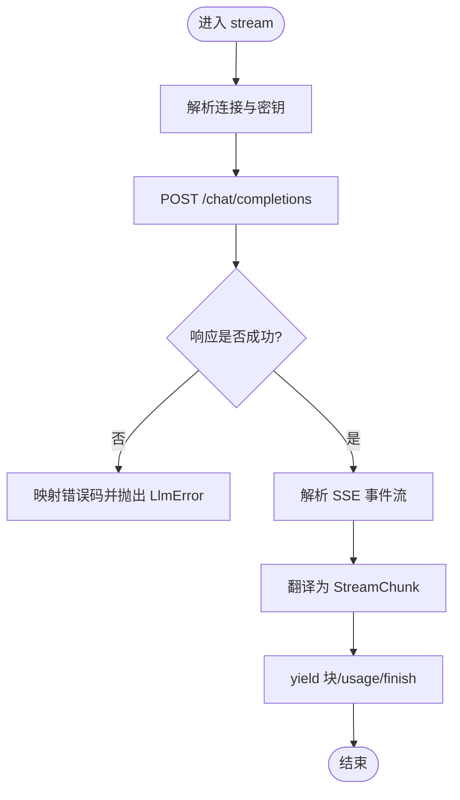
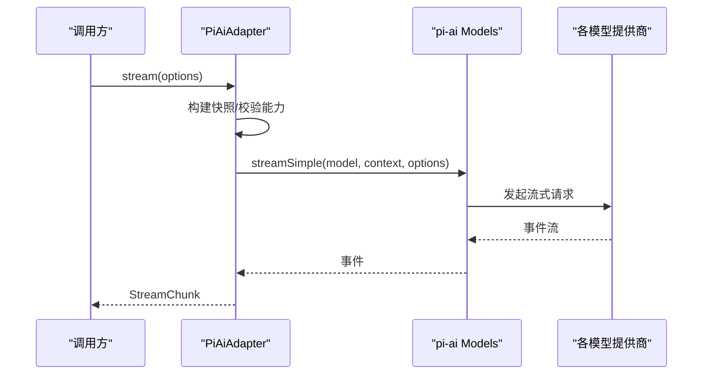
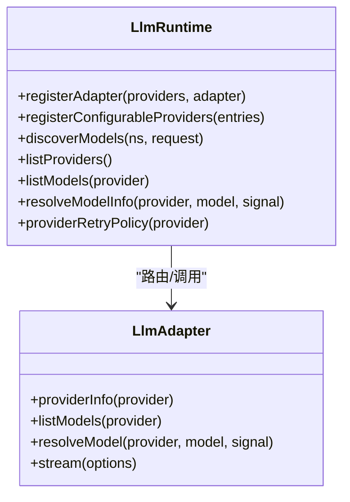
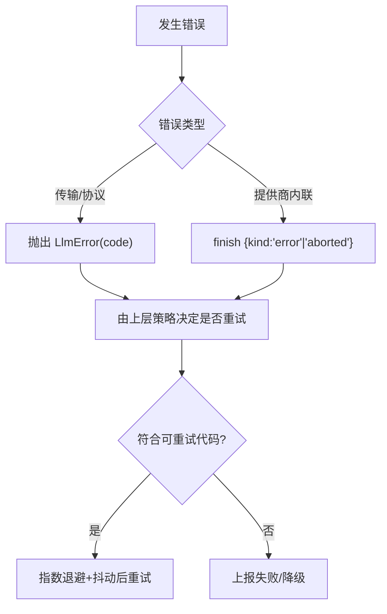
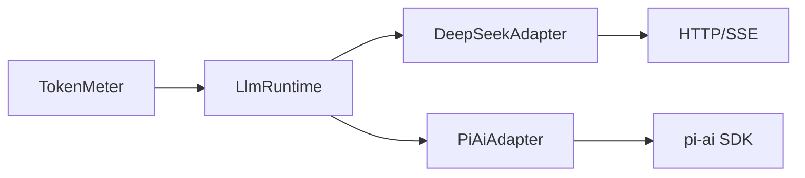

# 添加 LLM 适配器

<cite>
**本文引用的文件**
- [packages/llm/llm/src/types.ts](file://packages/llm/llm/src/types.ts)
- [packages/llm/llm/src/index.ts](file://packages/llm/llm/src/index.ts)
- [packages/llm/llm/src/retry-policy.ts](file://packages/llm/llm/src/retry-policy.ts)
- [packages/llm/llm-deepseek/src/adapter.ts](file://packages/llm/llm-deepseek/src/adapter.ts)
- [packages/llm/llm-deepseek/src/sse.ts](file://packages/llm/llm-deepseek/src/sse.ts)
- [packages/llm/llm-pi-ai/src/adapter.ts](file://packages/llm/llm-pi-ai/src/adapter.ts)
- [docs/cookbook/adding-an-llm-adapter.md](file://docs/cookbook/adding-an-llm-adapter.md)
- [docs/subsystems/llm-streaming.md](file://docs/subsystems/llm-streaming.md)
- [packages/llm/token-meter/src/index.ts](file://packages/llm/token-meter/src/index.ts)
</cite>

## 目录
1. [简介](#简介)
2. [项目结构](#项目结构)
3. [核心组件](#核心组件)
4. [架构总览](#架构总览)
5. [详细组件分析](#详细组件分析)
6. [依赖关系分析](#依赖关系分析)
7. [性能与优化](#性能与优化)
8. [故障排查指南](#故障排查指南)
9. [结论](#结论)
10. [附录：实现清单与示例路径](#附录实现清单与示例路径)

## 简介
本指南面向希望为不同语言模型提供商开发适配器的工程师。内容涵盖：
- 适配器契约与协议约定（流式块、用法统计、错误处理）
- API 集成与认证处理（密钥解析、请求头、会话标识）
- 流式响应与超时控制（SSE、空闲超时、取消）
- 错误重试策略（可配置的重试模式与退避）
- 多种适配器实现示例（DeepSeek/OpenAI 兼容、pi-ai 多供应商封装）
- 适配器配置、性能优化、缓存策略与监控指标
- 与框架事件系统与会话管理的集成方式

## 项目结构
仓库中与 LLM 适配器相关的关键位置：
- 抽象与服务层：`packages/llm/llm` 提供适配器基类、运行时注册、类型定义、重试策略等
- 参考适配器：
  - `packages/llm/llm-deepseek`：直接 HTTP + SSE 的 OpenAI 兼容端点适配器
  - `packages/llm/llm-pi-ai`：基于第三方 SDK 的多供应商适配器
- 文档：`docs/cookbook/adding-an-llm-adapter.md` 与 `docs/subsystems/llm-streaming.md` 定义了协议与最佳实践
- 监控：`packages/llm/token-meter` 提供令牌用量测量与投影

图表来源
- [packages/llm/llm/src/index.ts:284-413](file://packages/llm/llm/src/index.ts#L284-L413)
- [packages/llm/llm/src/types.ts:283-357](file://packages/llm/llm/src/types.ts#L283-L357)
- [packages/llm/llm/src/retry-policy.ts:144-192](file://packages/llm/llm/src/retry-policy.ts#L144-L192)
- [packages/llm/llm-deepseek/src/adapter.ts:158-347](file://packages/llm/llm-deepseek/src/adapter.ts#L158-L347)
- [packages/llm/llm-pi-ai/src/adapter.ts:186-359](file://packages/llm/llm-pi-ai/src/adapter.ts#L186-L359)
- [packages/llm/token-meter/src/index.ts:74-147](file://packages/llm/token-meter/src/index.ts#L74-L147)

章节来源
- [packages/llm/llm/src/index.ts:284-413](file://packages/llm/llm/src/index.ts#L284-L413)
- [packages/llm/llm/src/types.ts:283-357](file://packages/llm/llm/src/types.ts#L283-L357)
- [docs/cookbook/adding-an-llm-adapter.md:1-44](file://docs/cookbook/adding-an-llm-adapter.md#L1-L44)

## 核心组件
- 适配器抽象与运行时
  - `LlmAdapter`：定义 providerInfo、listModels、resolveModel、stream 等契约
  - `LlmRuntime`：适配器注册、可配置提供者目录、模型发现、能力校验、重试策略注入、事件发射
- 协议与数据模型
  - `GenerateOptions`：一次模型调用的完整请求体
  - `StreamChunk`：原始流式协议，包含块开始/结束、文本/推理/工具调用增量、usage、finish
  - `FinishReason`、`TokenUsage`、`LlmFailure`：终止原因、用量统计、失败事实
- 重试策略
  - `ResolvedRetryPolicy`：normal/always 两种模式，支持指数退避与抖动
- 监控
  - `TokenMeter`：会话级令牌用量测量与投影，结合 BlockAssembler 重建输出

章节来源
- [packages/llm/llm/src/index.ts:174-233](file://packages/llm/llm/src/index.ts#L174-L233)
- [packages/llm/llm/src/index.ts:284-413](file://packages/llm/llm/src/index.ts#L284-L413)
- [packages/llm/llm/src/types.ts:283-357](file://packages/llm/llm/src/types.ts#L283-L357)
- [packages/llm/llm/src/retry-policy.ts:144-192](file://packages/llm/llm/src/retry-policy.ts#L144-L192)
- [packages/llm/token-meter/src/index.ts:74-147](file://packages/llm/token-meter/src/index.ts#L74-L147)

## 架构总览
适配器通过 `ctx.llm.registerAdapter(providers, adapter)` 注册到运行时。运行时负责：
- 路由选择：根据 `GenerateOptions.provider` 选择具体适配器实例
- 能力查询：`listModels`、`resolveModel` 暴露模型元数据（上下文窗口、默认 maxTokens、推理级别）
- 事件系统：`llm/stream` 水坝拦截所有流式调用；`llm/adapters-updated` 通知拓扑变更
- 重试策略：从适配器或默认值解析并绑定到本次调用

图表来源
- [packages/llm/llm/src/index.ts:284-413](file://packages/llm/llm/src/index.ts#L284-L413)
- [packages/llm/llm/src/types.ts:283-357](file://packages/llm/llm/src/types.ts#L283-L357)
- [docs/subsystems/llm-streaming.md:204-217](file://docs/subsystems/llm-streaming.md#L204-L217)

## 详细组件分析

### 适配器契约与协议约定
- 必须实现的流式方法：`stream(options): AsyncIterable<StreamChunk>`
- 协议要点（来自 cookbook 与子系统文档）：
  - 先 emit `usage`，再 emit `finish`；finish 之后不得再 emit 任何块
  - 工具调用参数保持原始 JSON 字符串，增量以 `argumentsDelta` 形式传输
  - 块索引按首次出现顺序分配，同一块的增量复用该索引
  - 错误两条合法路径：抛出异常（传输/协议错误），或在流末尾以 `finish {kind:'error'|'aborted', failure}` 返回（提供商内联错误）
  - 必须尊重 `options.signal` 取消
  - 不支持的选项应抛出不支持的错误，而非静默丢弃
  - 如需原生 replayState，需在 finish 中携带最小无损 JSON 状态，并在历史恢复时由当前适配器验证

章节来源
- [docs/cookbook/adding-an-llm-adapter.md:25-36](file://docs/cookbook/adding-an-llm-adapter.md#L25-L36)
- [docs/subsystems/llm-streaming.md:154-217](file://docs/subsystems/llm-streaming.md#L154-L217)
- [packages/llm/llm/src/types.ts:283-357](file://packages/llm/llm/src/types.ts#L283-L357)

### DeepSeek 适配器（OpenAI 兼容直连）
- 职责边界：仅负责传输与协议转换；连接信息与鉴权通过回调在每次操作时解析，避免跨配置泄漏
- 关键流程：
  - 构造 AbortController，合并上游 signal，使用空闲看门狗限制读取空闲时间
  - 序列化请求并发送 fetch POST `/chat/completions`，设置授权头与 attribution 头
  - 非 2xx 响应映射为稳定错误码（AUTH/RATE_LIMIT/CONTEXT_WINDOW_EXCEEDED/INVALID_REQUEST/SERVER）
  - 解析 SSE 流，将事件转换为 `StreamChunk`，最终 yield 翻译后的块
- 超时与取消：
  - 空闲超时映射为 TIMEOUT；调用方取消映射为 ABORTED
- 模型能力：
  - `resolveModel` 返回上下文窗口、默认 maxTokens、推理级别（off/high/max）

图表来源
- [packages/llm/llm-deepseek/src/adapter.ts:214-347](file://packages/llm/llm-deepseek/src/adapter.ts#L214-L347)
- [packages/llm/llm-deepseek/src/sse.ts:20-40](file://packages/llm/llm-deepseek/src/sse.ts#L20-L40)

章节来源
- [packages/llm/llm-deepseek/src/adapter.ts:158-347](file://packages/llm/llm-deepseek/src/adapter.ts#L158-L347)
- [packages/llm/llm-deepseek/src/sse.ts:1-41](file://packages/llm/llm-deepseek/src/sse.ts#L1-L41)

### Pi-AI 适配器（多供应商 SDK 封装）
- 职责边界：基于第三方 SDK 管理多供应商模型集合；每步调用冻结快照，保证配置变更不影响进行中的请求
- 关键流程：
  - 构建不可变快照（profiles + Models），每次流式调用前捕获
  - 校验输入模态（如图片）、推理级别、附件服务可用性
  - 调用 SDK 的 `streamSimple`，将事件转换为 `StreamChunk`
  - 空闲超时映射为 TIMEOUT；取消映射为 ABORTED
- 模型能力：
  - `resolveModel` 返回上下文窗口、默认 maxTokens、推理级别（off/low/medium/high 等）

图表来源
- [packages/llm/llm-pi-ai/src/adapter.ts:186-359](file://packages/llm/llm-pi-ai/src/adapter.ts#L186-L359)

章节来源
- [packages/llm/llm-pi-ai/src/adapter.ts:186-359](file://packages/llm/llm-pi-ai/src/adapter.ts#L186-L359)

### 运行时与事件系统集成
- 适配器注册与替换：
  - `registerAdapter` 全有或全无校验，重复路由会抛错；返回 handle 支持原子替换
  - `registerConfigurableProviders` 声明可配置的提供者目录，供配置界面展示
- 事件：
  - `llm/stream`：水坝拦截所有流式调用，可用于重试、重放、路由等
  - `llm/adapters-updated`：拓扑变化通知，监听者重新读取提供者/模型列表
- 会话与上下文：
  - `GenerateOptions.sessionId` 用于路由与重放区分；适配器可将其映射为隐藏传输元数据
  - 助手消息携带 `replayState`，仅在历史提供方与目标提供方由同一适配器实例拥有时才传递

图表来源
- [packages/llm/llm/src/index.ts:284-413](file://packages/llm/llm/src/index.ts#L284-L413)
- [packages/llm/llm/src/index.ts:174-233](file://packages/llm/llm/src/index.ts#L174-L233)

章节来源
- [packages/llm/llm/src/index.ts:284-413](file://packages/llm/llm/src/index.ts#L284-L413)
- [docs/subsystems/llm-streaming.md:627-630](file://docs/subsystems/llm-streaming.md#L627-L630)

### 认证与请求头
- 认证：
  - 适配器通过回调解析密钥（例如 `resolveApiKey`），确保与端点同属一次配置快照，防止密钥与 URL 错配
  - 对空或非法密钥进行前置校验，抛出统一错误码
- 请求头：
  - 每个提供商 HTTP 请求必须包含应用归属头（`attributionHeaders()`）
  - DeepSeek 适配器附加用户 ID、会话 ID、压缩标记等
  - Pi-AI 适配器合并部署头并去重保留归属头

章节来源
- [packages/llm/llm-deepseek/src/adapter.ts:271-347](file://packages/llm/llm-deepseek/src/adapter.ts#L271-L347)
- [packages/llm/llm-pi-ai/src/adapter.ts:171-179](file://packages/llm/llm-pi-ai/src/adapter.ts#L171-L179)
- [packages/llm/llm/src/index.ts:119-152](file://packages/llm/llm/src/index.ts#L119-L152)

### 流式响应与超时控制
- 空闲超时：
  - 两个适配器均使用空闲看门狗，默认约 5 分钟；当迭代器 next 等待超时时抛出 TIMEOUT
- 取消：
  - 合并上游 `AbortSignal`，调用方取消映射为 ABORTED
- SSE 解析：
  - DeepSeek 适配器严格遵循规范，遇到 EOF 无 `[DONE]` 则报错

章节来源
- [packages/llm/llm-deepseek/src/adapter.ts:214-269](file://packages/llm/llm-deepseek/src/adapter.ts#L214-L269)
- [packages/llm/llm-deepseek/src/sse.ts:20-40](file://packages/llm/llm-deepseek/src/sse.ts#L20-L40)
- [packages/llm/llm-pi-ai/src/adapter.ts:276-359](file://packages/llm/llm-pi-ai/src/adapter.ts#L276-L359)
- [docs/subsystems/llm-streaming.md:204-217](file://docs/subsystems/llm-streaming.md#L204-L217)

### 错误与重试
- 错误分类：
  - 传输/协议错误：抛出 `LlmError`（含稳定 code）
  - 提供商内联错误：以 `finish {kind:'error'|'aborted', failure}` 结束流
- 重试策略：
  - 默认 normal 模式，最大重试次数、可重试代码集、退避参数均可配置
  - always 模式对所有失败持续重试直到成功/取消/释放
  - 空完成被视为可重试错误

图表来源
- [packages/llm/llm/src/retry-policy.ts:144-192](file://packages/llm/llm/src/retry-policy.ts#L144-L192)
- [docs/subsystems/llm-streaming.md:204-217](file://docs/subsystems/llm-streaming.md#L204-L217)

章节来源
- [packages/llm/llm/src/retry-policy.ts:144-192](file://packages/llm/llm/src/retry-policy.ts#L144-L192)
- [docs/subsystems/llm-streaming.md:204-217](file://docs/subsystems/llm-streaming.md#L204-L217)

### 配置与模型能力
- 可配置提供者目录：
  - 插件通过 `registerConfigurableProviders` 声明可激活的提供者及其设置命名空间与路径
- 模型能力：
  - `resolveModel` 返回上下文窗口、默认 maxTokens、推理级别（off/high/max 或 SDK 级别）
  - 列表能力（`listModels`）为建议性，不限制路由

章节来源
- [packages/llm/llm/src/index.ts:423-492](file://packages/llm/llm/src/index.ts#L423-L492)
- [packages/llm/llm-deepseek/src/adapter.ts:171-212](file://packages/llm/llm-deepseek/src/adapter.ts#L171-L212)
- [packages/llm/llm-pi-ai/src/adapter.ts:238-274](file://packages/llm/llm-pi-ai/src/adapter.ts#L238-L274)

### 监控指标与令牌计量
- TokenMeter：
  - 基于会话事件回放，结合 BlockAssembler 重建输出，计算用量
  - 支持表面压力与上下文压力投影，便于 UI 展示与限流
- 指标字段：
  - 输入/输出/缓存读/写/推理 token 数，总量与增量

章节来源
- [packages/llm/token-meter/src/index.ts:74-147](file://packages/llm/token-meter/src/index.ts#L74-L147)
- [packages/llm/token-meter/src/index.ts:272-310](file://packages/llm/token-meter/src/index.ts#L272-L310)

## 依赖关系分析
- 适配器与运行时：
  - 适配器依赖运行时提供的注册机制与事件系统
  - 运行时依赖适配器实现来执行实际网络 I/O 与协议转换
- 适配器之间：
  - DeepSeek 与 Pi-AI 各自独立，互不耦合
- 外部依赖：
  - DeepSeek：eventsource-parser、fetch、超时库
  - Pi-AI：第三方 SDK（pi-ai）
- 监控：
  - TokenMeter 依赖会话事件与 BlockAssembler

图表来源
- [packages/llm/llm/src/index.ts:284-413](file://packages/llm/llm/src/index.ts#L284-L413)
- [packages/llm/llm-deepseek/src/adapter.ts:158-347](file://packages/llm/llm-deepseek/src/adapter.ts#L158-L347)
- [packages/llm/llm-pi-ai/src/adapter.ts:186-359](file://packages/llm/llm-pi-ai/src/adapter.ts#L186-L359)
- [packages/llm/token-meter/src/index.ts:74-147](file://packages/llm/token-meter/src/index.ts#L74-L147)

章节来源
- [packages/llm/llm/src/index.ts:284-413](file://packages/llm/llm/src/index.ts#L284-L413)

## 性能与优化
- 流式处理：
  - 使用空闲看门狗避免长连接阻塞；合理设置超时
  - 增量传输工具调用参数，减少内存占用
- 重试策略：
  - 针对瞬态错误启用指数退避与抖动，避免雪崩
- 模型能力：
  - 利用 `resolveModel` 的上下文窗口与默认 maxTokens，提前裁剪请求长度
- 监控：
  - 使用 TokenMeter 跟踪用量与压力，辅助限流与成本管控
- 缓存策略：
  - 适配器侧不缓存敏感状态；可在上层基于会话/请求指纹做结果缓存（需考虑失效与一致性）

[本节为通用指导，不直接分析具体文件]

## 故障排查指南
- 常见问题定位：
  - 认证失败：检查密钥解析与头部注入，确认未混用不同配置的密钥与端点
  - 流中断：检查 SSE 是否收到 `[DONE]`；若无，可能为截断或网络问题
  - 空完成：适配器应将无内容的 stop 视为错误并可重试
  - 上下文溢出：统一错误码，消费者据此路由
- 日志与诊断：
  - 使用 `LlmError` 的稳定 code 与可选 requestId/status/providerRetryAfterMs 进行追踪
  - 借助 TokenMeter 的投影查看会话压力与用量

章节来源
- [packages/llm/llm-deepseek/src/adapter.ts:321-347](file://packages/llm/llm-deepseek/src/adapter.ts#L321-L347)
- [packages/llm/llm-deepseek/src/sse.ts:20-40](file://packages/llm/llm-deepseek/src/sse.ts#L20-L40)
- [docs/subsystems/llm-streaming.md:204-217](file://docs/subsystems/llm-streaming.md#L204-L217)
- [packages/llm/token-meter/src/index.ts:74-147](file://packages/llm/token-meter/src/index.ts#L74-L147)

## 结论
通过统一的适配器契约与运行时机制，开发者可以以一致的方式接入不同模型提供商。遵循协议约定、正确处理认证与错误、合理使用重试与超时、并结合监控指标，能够构建高可用、可观测且易扩展的 LLM 集成方案。

[本节为总结，不直接分析具体文件]

## 附录：实现清单与示例路径
- 新增适配器步骤清单
  - 继承 `LlmAdapter`，实现 `stream` 以及可选的 `providerInfo`、`listModels`、`resolveModel`
  - 在插件中通过 `ctx.llm.registerAdapter(['your-provider'], new YourAdapter(...))` 注册
  - 若需提供可配置提供者目录，调用 `registerConfigurableProviders`
  - 在每个 HTTP 请求中加入 `attributionHeaders()`
  - 遵守流式协议：usage 在 finish 之前、工具参数保持原始 JSON、错误两条路径
  - 实现空闲超时与取消处理
  - 配置重试策略（normal/always）
  - 使用 TokenMeter 监控用量与压力

- 参考实现路径
  - 直接 HTTP+SSE：`packages/llm/llm-deepseek/src/adapter.ts`、`packages/llm/llm-deepseek/src/sse.ts`
  - SDK 封装：`packages/llm/llm-pi-ai/src/adapter.ts`
  - 协议与契约：`docs/cookbook/adding-an-llm-adapter.md`、`docs/subsystems/llm-streaming.md`
  - 运行时与类型：`packages/llm/llm/src/index.ts`、`packages/llm/llm/src/types.ts`
  - 重试策略：`packages/llm/llm/src/retry-policy.ts`
  - 监控：`packages/llm/token-meter/src/index.ts`

章节来源
- [docs/cookbook/adding-an-llm-adapter.md:1-44](file://docs/cookbook/adding-an-llm-adapter.md#L1-L44)
- [packages/llm/llm/src/index.ts:284-413](file://packages/llm/llm/src/index.ts#L284-L413)
- [packages/llm/llm/src/types.ts:283-357](file://packages/llm/llm/src/types.ts#L283-L357)
- [packages/llm/llm-deepseek/src/adapter.ts:158-347](file://packages/llm/llm-deepseek/src/adapter.ts#L158-L347)
- [packages/llm/llm-deepseek/src/sse.ts:1-41](file://packages/llm/llm-deepseek/src/sse.ts#L1-L41)
- [packages/llm/llm-pi-ai/src/adapter.ts:186-359](file://packages/llm/llm-pi-ai/src/adapter.ts#L186-L359)
- [packages/llm/llm/src/retry-policy.ts:144-192](file://packages/llm/llm/src/retry-policy.ts#L144-L192)
- [packages/llm/token-meter/src/index.ts:74-147](file://packages/llm/token-meter/src/index.ts#L74-L147)