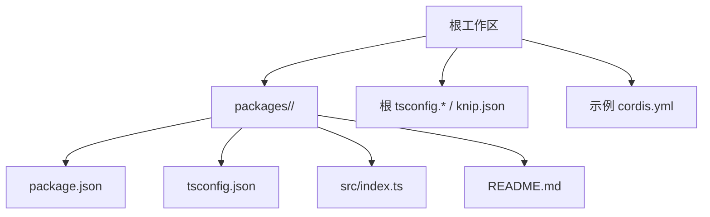
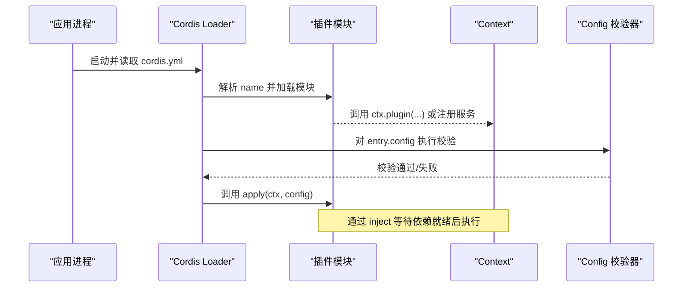
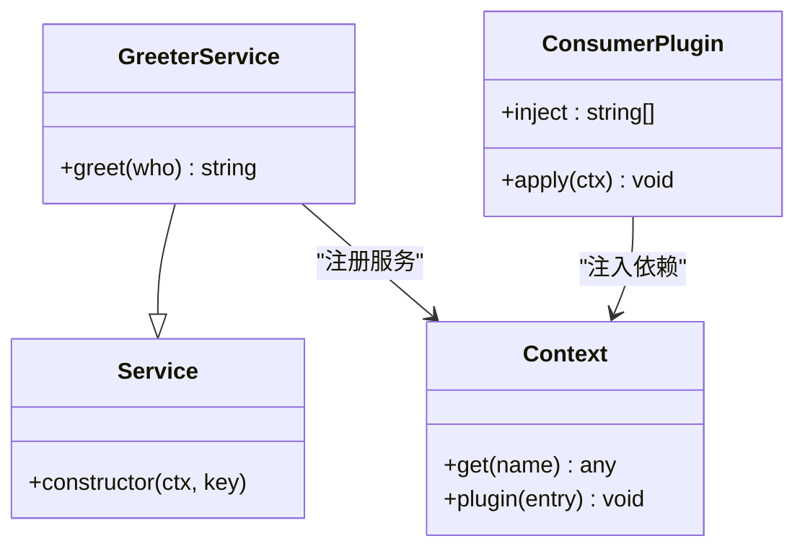
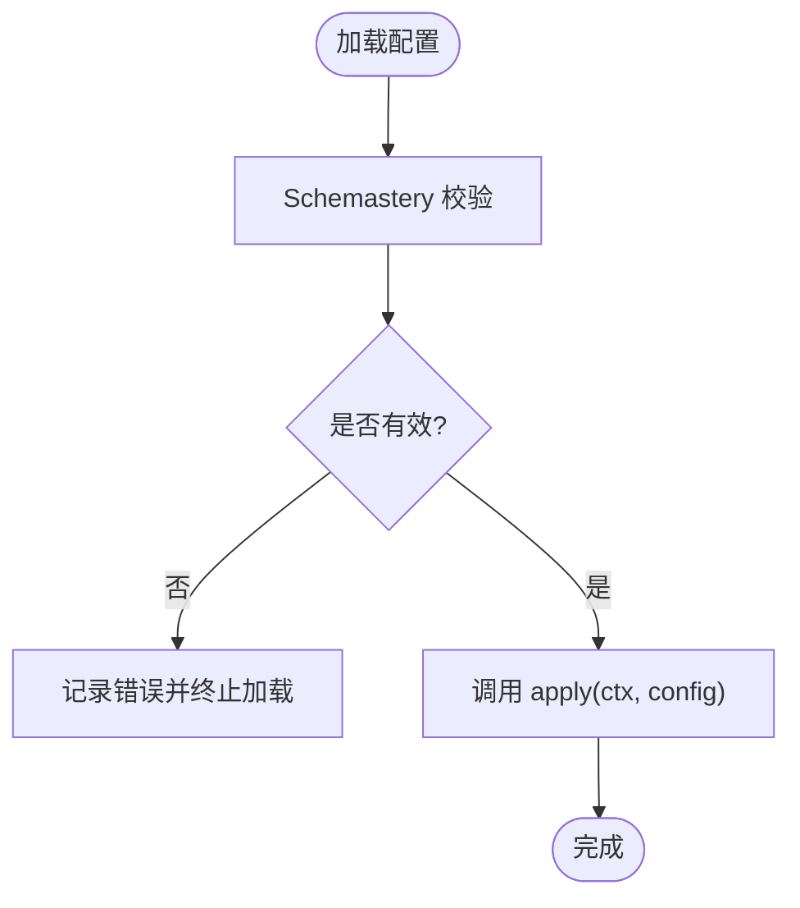
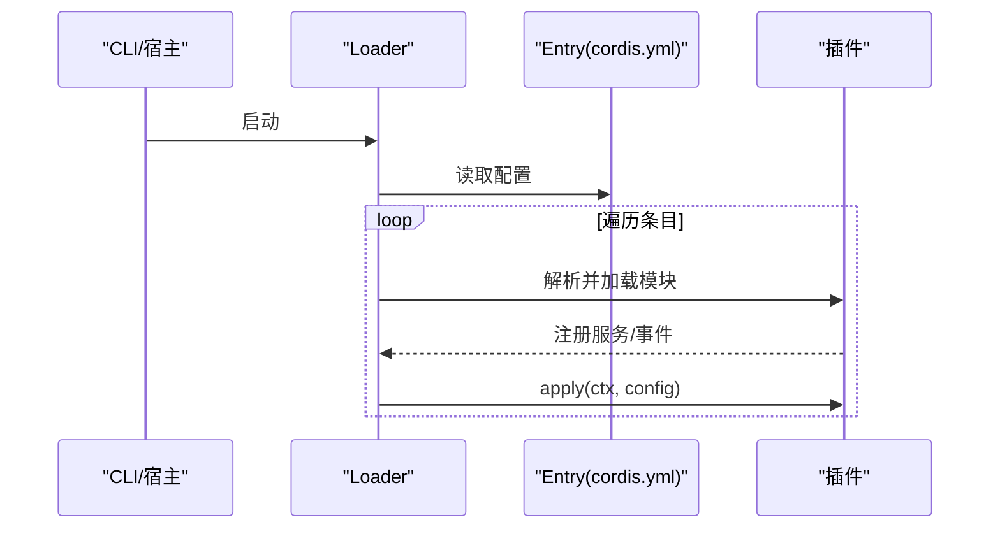
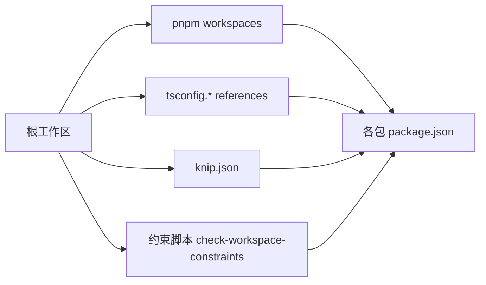

# 添加包指南

<cite>
**本文引用的文件**
- [docs/cookbook/adding-a-package.md](file://docs/cookbook/adding-a-package.md)
- [packages/AGENTS.md](file://packages/AGENTS.md)
- [docs/cordis-tutorial/index.md](file://docs/cordis-tutorial/index.md)
- [docs/cordis-tutorial/01-first-plugin.md](file://docs/cordis-tutorial/01-first-plugin.md)
- [docs/cordis-tutorial/03-services.md](file://docs/cordis-tutorial/03-services.md)
- [docs/cordis-tutorial/05-config.md](file://docs/cordis-tutorial/05-config.md)
- [examples/headless-agent/cordis.yml](file://examples/headless-agent/cordis.yml)
- [examples/jsonrpc-agent/cordis.yml](file://examples/jsonrpc-agent/cordis.yml)
</cite>

## 目录
1. [简介](#简介)
2. [项目结构](#项目结构)
3. [核心组件](#核心组件)
4. [架构总览](#架构总览)
5. [详细组件分析](#详细组件分析)
6. [依赖分析](#依赖分析)
7. [性能考虑](#性能考虑)
8. [故障排查指南](#故障排查指南)
9. [结论](#结论)
10. [附录](#附录)

## 简介
本指南面向希望在 DeepSeek Harness（DSH）中创建、发布并集成插件包的开发者。内容覆盖：
- 包的组织结构与命名规范
- 依赖管理与版本约束
- 配置与元数据定义
- 打包与发布流程
- 文档生成与测试策略
- 包的发现机制、加载过程以及与主应用的集成方式
- 可复用功能模块的示例化实践

## 项目结构
在仓库中，新增一个 DSH 包的标准位置是 packages/<group>/<pkg>/，其中 group 为现有分组或新的纯容器分组；每个包应包含 package.json、tsconfig.json、src/index.ts、README.md 等基础文件。根级配置会自动发现工作区中的包，无需额外注册。

**章节来源**
- [docs/cookbook/adding-a-package.md:7-39](file://docs/cookbook/adding-a-package.md#L7-L39)

## 核心组件
- 包契约与清单
  - package.json 必须满足一系列不变式：私有包、版本与根一致、ESM 类型、入口与类型声明路径、exports 字段、peer/dev 依赖对齐、files 白名单等。这些由工作区约束脚本校验。
  - 相对导入需显式 .ts 后缀，编译器会在输出 JS 中改写为 .js，并在声明中保留 .ts 以便 NodeNext/Node16 消费者解析。
- TypeScript 工程组织
  - 继承 tsconfig.base.json（客户端包继承 tsconfig.base.client.json），rootDir 指向 src，outDir 指向 lib/types，references 指向聚合内的其他包与运行时诊断。
  - 仅 api/remotes 允许拆分到 Host/Client 两个聚合，普通包只能属于一个聚合。
- 插件形态
  - 函数插件、对象插件、Service 子类插件三种形式。服务类插件通过 Service 基类注册到上下文，并通过 inject 声明依赖。
- 配置系统
  - 使用 Schemastery 导出 Config 模式，Cordis 在 apply 前进行强校验；支持 !!js 标签在配置中计算值。
- 发现与加载
  - Loader 读取 cordis.yml，按条目解析模块并挂载插件；依赖通过 inject 追踪，服务缺失时进入 PENDING 状态，不阻塞启动。

**章节来源**
- [docs/cookbook/adding-a-package.md:23-39](file://docs/cookbook/adding-a-package.md#L23-L39)
- [packages/AGENTS.md:20-27](file://packages/AGENTS.md#L20-L27)
- [docs/cordis-tutorial/01-first-plugin.md:53-77](file://docs/cordis-tutorial/01-first-plugin.md#L53-L77)
- [docs/cordis-tutorial/03-services.md:4-10](file://docs/cordis-tutorial/03-services.md#L4-L10)
- [docs/cordis-tutorial/05-config.md:1-10](file://docs/cordis-tutorial/05-config.md#L1-L10)

## 架构总览
下图展示了从应用启动到插件加载、服务注册与配置的端到端流程。

**图表来源**
- [docs/cordis-tutorial/index.md:30-37](file://docs/cordis-tutorial/index.md#L30-L37)
- [docs/cordis-tutorial/01-first-plugin.md:23-51](file://docs/cordis-tutorial/01-first-plugin.md#L23-L51)
- [docs/cordis-tutorial/03-services.md:44-78](file://docs/cordis-tutorial/03-services.md#L44-L78)
- [docs/cordis-tutorial/05-config.md:1-10](file://docs/cordis-tutorial/05-config.md#L1-L10)

## 详细组件分析

### 包创建与组织
- 目录与文件
  - 在 packages/<group>/<pkg>/ 下创建 package.json、tsconfig.json、src/index.ts、README.md。
  - 若为新分组，分组目录仅为容器，不包含 package.json 和源码。
- 命名与职责
  - 按“当前稳定职责”命名，避免实现细节或未来扩展名。
  - 根据角色选择合适后缀（如 Provider、Registry、Runtime、Policy 等）。
- 包清单不变式
  - private、version、type、main、types、exports、peer/dev 依赖、files 白名单等由约束脚本强制检查。
- TypeScript 引用
  - 将包加入 tsconfig.host.json 或 tsconfig.client.json 的 references，确保类型引用正确。

**章节来源**
- [docs/cookbook/adding-a-package.md:7-39](file://docs/cookbook/adding-a-package.md#L7-L39)
- [docs/cookbook/adding-a-package.md:41-71](file://docs/cookbook/adding-a-package.md#L41-L71)
- [packages/AGENTS.md:20-27](file://packages/AGENTS.md#L20-L27)

### 插件与服务
- 插件形态
  - 函数插件：export { name, apply }
  - 对象插件：export const plugin = { name, apply }
  - 服务类插件：继承 Service，构造函数中 super(ctx, 'key') 注册服务
- 依赖注入
  - 通过 inject 声明硬依赖；Cordis 会等待所有依赖就绪再执行 apply
  - 可选依赖使用 ctx.get('name') 探测
- 生命周期
  - 卸载时会撤销注册；热替换时依赖变化会触发重新加载

**图表来源**
- [docs/cordis-tutorial/03-services.md:7-42](file://docs/cordis-tutorial/03-services.md#L7-L42)
- [docs/cordis-tutorial/03-services.md:44-90](file://docs/cordis-tutorial/03-services.md#L44-L90)

**章节来源**
- [docs/cordis-tutorial/01-first-plugin.md:53-77](file://docs/cordis-tutorial/01-first-plugin.md#L53-L77)
- [docs/cordis-tutorial/03-services.md:4-10](file://docs/cordis-tutorial/03-services.md#L4-L10)
- [docs/cordis-tutorial/03-services.md:44-90](file://docs/cordis-tutorial/03-services.md#L44-L90)

### 配置与元数据
- 配置模式
  - 导出 Config 作为 Schemastery 模式，apply 接收已验证的配置对象
  - 支持默认值、数组、字符串等类型校验
- 动态配置
  - 使用 !!js 标签在配置中计算值（仅限 config 与 disabled 字段）
- 错误处理
  - 配置错误会阻止插件启动，并给出精确的错误信息

**图表来源**
- [docs/cordis-tutorial/05-config.md:1-10](file://docs/cordis-tutorial/05-config.md#L1-L10)
- [docs/cordis-tutorial/05-config.md:36-81](file://docs/cordis-tutorial/05-config.md#L36-L81)

**章节来源**
- [docs/cordis-tutorial/05-config.md:1-10](file://docs/cordis-tutorial/05-config.md#L1-L10)
- [docs/cordis-tutorial/05-config.md:36-81](file://docs/cordis-tutorial/05-config.md#L36-L81)

### 包的发现与加载
- 发现机制
  - Loader 读取 cordis.yml 列表项，逐项解析 name（相对路径或 npm 包名）并挂载
  - 插件并发启动，顺序由依赖决定而非文件顺序
- 加载流程
  - 解析模块 -> 校验配置 -> 注册服务/事件 -> 执行 apply
  - 依赖缺失时进入 PENDING，不会崩溃
- 集成示例
  - headless-agent 与 jsonrpc-agent 的 cordis.yml 展示了如何组合多个内置包形成完整代理应用

**图表来源**
- [docs/cordis-tutorial/index.md:30-37](file://docs/cordis-tutorial/index.md#L30-L37)
- [docs/cordis-tutorial/01-first-plugin.md:23-51](file://docs/cordis-tutorial/01-first-plugin.md#L23-L51)
- [examples/headless-agent/cordis.yml:1-166](file://examples/headless-agent/cordis.yml#L1-L166)
- [examples/jsonrpc-agent/cordis.yml:1-90](file://examples/jsonrpc-agent/cordis.yml#L1-L90)

**章节来源**
- [docs/cordis-tutorial/index.md:30-37](file://docs/cordis-tutorial/index.md#L30-L37)
- [docs/cordis-tutorial/01-first-plugin.md:23-51](file://docs/cordis-tutorial/01-first-plugin.md#L23-L51)
- [examples/headless-agent/cordis.yml:1-166](file://examples/headless-agent/cordis.yml#L1-L166)
- [examples/jsonrpc-agent/cordis.yml:1-90](file://examples/jsonrpc-agent/cordis.yml#L1-L90)

### 打包与发布
- 构建产物
  - 输出目录通常为 lib/index.js 与 lib/types/**/*.d.ts
  - files 白名单限制发布内容，禁止包含 src、source map、陈旧声明等
- 约束与校验
  - pnpm run constraints 检查包清单不变式
  - pnpm run build && pnpm run hygiene 执行构建与代码卫生检查
- 文档同步
  - pnpm run doc-sync 更新文档索引与链接
- 发布建议
  - 保持 version 与根一致，确保 peer/dev 依赖范围一致
  - 遵循 files 白名单，仅发布必要产物

**章节来源**
- [docs/cookbook/adding-a-package.md:23-39](file://docs/cookbook/adding-a-package.md#L23-L39)
- [docs/cookbook/adding-a-package.md:109-116](file://docs/cookbook/adding-a-package.md#L109-L116)

### 文档生成与模型体验
- README 要求
  - 首段描述服务 API、事件、扩展点与设计说明
  - 使用固定模板记录“模型体验”（请求上下文、Token 影响、KV Cache 影响）
  - 末尾列出已知限制与延期工作
- 工具与验证
  - 通过脚本验证 README 结构与模型体验段落
  - 将稳定的提示词或长文本以 fenced 块引用，避免漂移

**章节来源**
- [docs/cookbook/adding-a-package.md:73-108](file://docs/cookbook/adding-a-package.md#L73-L108)

### 测试策略
- 行为测试
  - 产品可见的插件需要非单元的真实组合测试，通过 Loader 与应用程序启动来验证
  - 仅模拟外部服务或非确定性输入，断言模型可见、持久或用户可见的输出
- HMR 安全
  - 注册贡献需在 HMR 安全测试中证明可被回收（dispose）
- 覆盖率与快照
  - 遵循仓库测试政策，结合快照与端到端用例保障稳定性

**章节来源**
- [packages/AGENTS.md:5-18](file://packages/AGENTS.md#L5-L18)
- [docs/cookbook/adding-a-package.md:109-116](file://docs/cookbook/adding-a-package.md#L109-L116)

## 依赖分析
- 工作区发现
  - 根 package.json workspaces、scripts/publint-all.ts、tsdown.config.ts、.oxlintrc.json、scripts/check-workspace-constraints.ts 自动发现包
- 类型引用
  - 新包需加入 tsconfig.host.json 或 tsconfig.client.json 的 references，确保类型解析正确
- 依赖对齐
  - @deepseek-ai/cordis 同时出现在 peerDependencies 与 devDependencies，且范围一致
  - dsh 相关 peer 依赖需镜像到 devDependencies

**图表来源**
- [docs/cookbook/adding-a-package.md:29-39](file://docs/cookbook/adding-a-package.md#L29-L39)
- [packages/AGENTS.md:20-27](file://packages/AGENTS.md#L20-L27)

**章节来源**
- [docs/cookbook/adding-a-package.md:29-39](file://docs/cookbook/adding-a-package.md#L29-L39)
- [packages/AGENTS.md:20-27](file://packages/AGENTS.md#L20-L27)

## 性能考虑
- 配置校验前置
  - 在 apply 之前完成配置校验，避免半配置运行带来的不可预期开销
- 依赖懒加载
  - 通过 inject 延迟执行，直到依赖就绪，减少启动时的不必要工作
- 资源释放
  - 确保服务与订阅在卸载时正确释放，避免内存泄漏与僵尸任务

[本节为通用指导，不直接分析具体文件]

## 故障排查指南
- 插件未加载
  - 检查 cordis.yml 中 name 拼写与路径是否正确；无法解析的模块会通过日志报告而非崩溃
- 配置错误
  - 查看 Schemastery 返回的 ValidationError，定位字段与期望类型
- 依赖缺失
  - 确认 provider 已加载；依赖缺失会使消费者处于 PENDING 状态且不执行
- 构建/约束失败
  - 运行 pnpm run constraints 与 pnpm run build，根据错误修复 package.json 与 tsconfig 配置

**章节来源**
- [docs/cordis-tutorial/01-first-plugin.md:79-92](file://docs/cordis-tutorial/01-first-plugin.md#L79-L92)
- [docs/cordis-tutorial/03-services.md:61-78](file://docs/cordis-tutorial/03-services.md#L61-L78)
- [docs/cordis-tutorial/05-config.md:53-68](file://docs/cordis-tutorial/05-config.md#L53-L68)

## 结论
通过遵循本指南，你可以：
- 以标准结构创建可复用的 DSH 插件包
- 使用 Cordis 的服务与配置机制实现可插拔能力
- 借助工作区工具链完成构建、校验、文档与测试
- 通过 cordis.yml 灵活组合包，快速集成到主应用

[本节为总结性内容，不直接分析具体文件]

## 附录
- 快速上手命令
  - pnpm install
  - pnpm run doc-sync
  - pnpm run constraints && pnpm run typecheck && pnpm run lint
  - pnpm run build && pnpm run hygiene
- 参考示例
  - headless-agent 与 jsonrpc-agent 的 cordis.yml 展示了常见能力组合

**章节来源**
- [docs/cookbook/adding-a-package.md:109-116](file://docs/cookbook/adding-a-package.md#L109-L116)
- [examples/headless-agent/cordis.yml:1-166](file://examples/headless-agent/cordis.yml#L1-L166)
- [examples/jsonrpc-agent/cordis.yml:1-90](file://examples/jsonrpc-agent/cordis.yml#L1-L90)