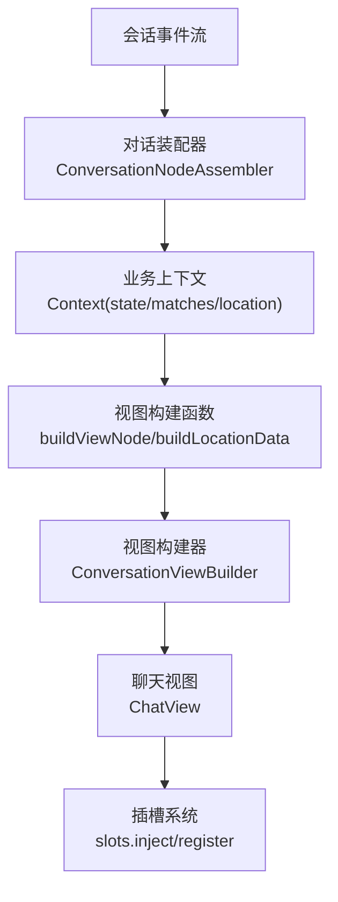
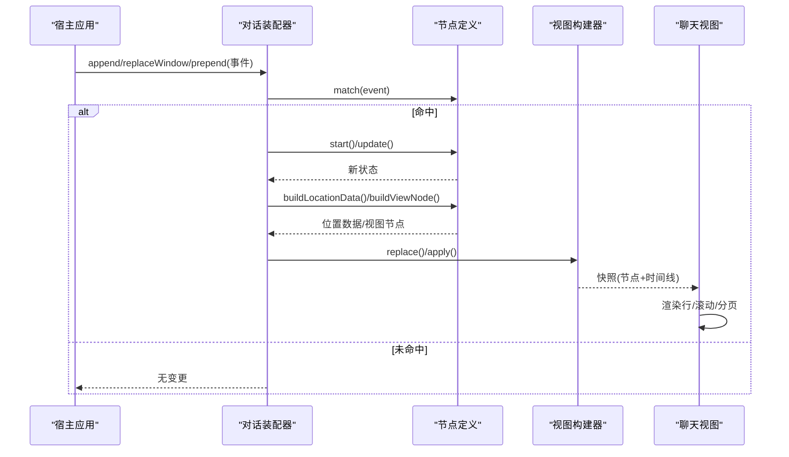
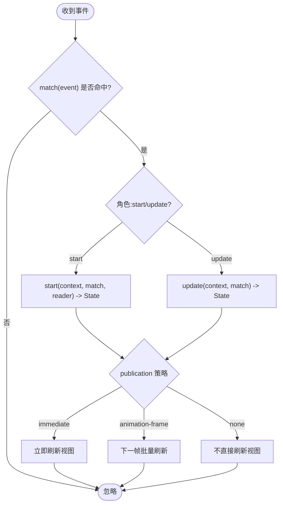
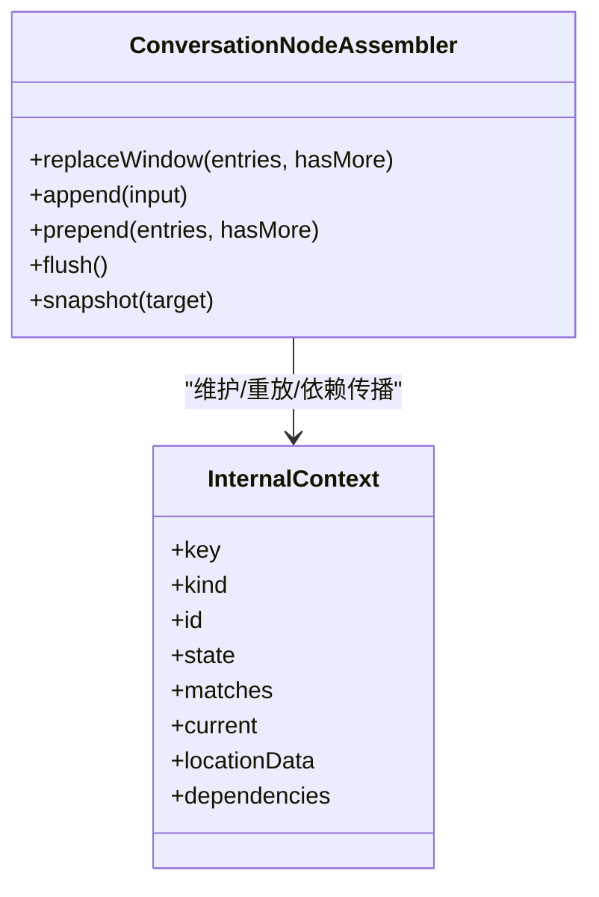
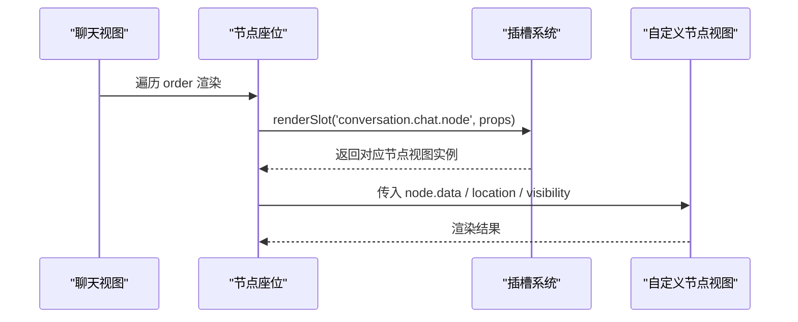
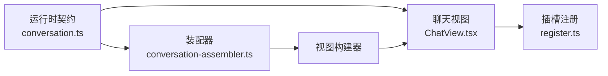

# 添加对话节点

<cite>
**本文引用的文件**
- [adding-a-conversation-node.md](file://docs/cookbook/adding-a-conversation-node.md)
- [conversation.ts](file://packages/client/runtime/src/client/contract/conversation.ts)
- [conversation-assembler.ts](file://packages/client/runtime/src/client/sessions/conversation-assembler.ts)
- [ChatView.tsx](file://packages/client/ui-conversation/src/client/chat/ChatView.tsx)
- [register.ts](file://packages/client/ui-conversation/src/client/conversation-nodes/register.ts)
</cite>

## 目录
1. [简介](#简介)
2. [项目结构](#项目结构)
3. [核心组件](#核心组件)
4. [架构总览](#架构总览)
5. [详细组件分析](#详细组件分析)
6. [依赖关系分析](#依赖关系分析)
7. [性能考虑](#性能考虑)
8. [故障排查指南](#故障排查指南)
9. [结论](#结论)
10. [附录](#附录)

## 简介
本指南面向希望在 Web 界面中添加自定义“对话节点”的前端开发者。你将学习如何设计可回放的事件族、实现定义与类型化数据、管理状态与位置数据、注册视图渲染，并通过插槽机制将自定义节点注入聊天视图。文档同时覆盖样式定制、响应式布局、无障碍访问与性能优化要点，并说明节点与后端事件流（会话事件）的通信与同步策略。

## 项目结构
- 运行时契约与装配器：位于客户端运行时包，负责将会话事件转换为业务上下文，并产出视图节点快照。
- UI 对话层：提供聊天视图、节点座位、插槽注册等能力，用于最终渲染到 Web 界面。
- 示例与教程：cookbook 提供了端到端的“添加对话节点”步骤与最佳实践。

图表来源
- [conversation-assembler.ts:137-316](file://packages/client/runtime/src/client/sessions/conversation-assembler.ts#L137-L316)
- [conversation.ts:170-228](file://packages/client/runtime/src/client/contract/conversation.ts#L170-L228)
- [ChatView.tsx:146-397](file://packages/client/ui-conversation/src/client/chat/ChatView.tsx#L146-L397)

章节来源
- [adding-a-conversation-node.md:9-233](file://docs/cookbook/adding-a-conversation-node.md#L9-L233)
- [conversation.ts:1-275](file://packages/client/runtime/src/client/contract/conversation.ts#L1-L275)
- [conversation-assembler.ts:137-316](file://packages/client/runtime/src/client/sessions/conversation-assembler.ts#L137-L316)
- [ChatView.tsx:1-428](file://packages/client/ui-conversation/src/client/chat/ChatView.tsx#L1-L428)

## 核心组件
- 对话节点定义（Definition）：声明 kind、match、start、update、publication、buildLocationData、buildViewNode 等生命周期钩子，描述从事件到状态再到视图节点的转换规则。
- 会话装配器（Assembler）：维护上下文集合、位置索引、依赖关系，支持 replaceWindow/prepend/append 三种历史与增量路径，按 publication 节奏合并视图更新。
- 聊天视图（ChatView）：基于有序节点键列表渲染行，处理滚动跟随、分页加载、锚点恢复等交互。
- 插槽系统：通过 slots.inject/register 将自定义节点视图挂载到目标槽位（如 conversation.chat.node）。

章节来源
- [conversation.ts:170-228](file://packages/client/runtime/src/client/contract/conversation.ts#L170-L228)
- [conversation-assembler.ts:137-316](file://packages/client/runtime/src/client/sessions/conversation-assembler.ts#L137-L316)
- [ChatView.tsx:146-397](file://packages/client/ui-conversation/src/client/chat/ChatView.tsx#L146-L397)
- [register.ts:19-32](file://packages/client/ui-conversation/src/client/conversation-nodes/register.ts#L19-L32)

## 架构总览
下图展示了从事件到视图的关键调用链：事件进入装配器，匹配 Definition，生成或更新 Context；随后根据 publication 策略产出视图节点快照，由 ChatView 消费并渲染。

图表来源
- [conversation-assembler.ts:168-316](file://packages/client/runtime/src/client/sessions/conversation-assembler.ts#L168-L316)
- [conversation.ts:170-228](file://packages/client/runtime/src/client/contract/conversation.ts#L170-L228)
- [ChatView.tsx:146-397](file://packages/client/ui-conversation/src/client/chat/ChatView.tsx#L146-L397)

## 详细组件分析

### 节点定义与数据模型
- 事件族设计：为同一业务实体选择稳定 id，确保每个 (kind, id) 仅有一个 start 事件；增量事件需可重放且确定性。
- 类型扩展：通过模块合并扩展 SessionEventMap、ChatNodeDataMap、ConversationStepDataMap，使类型安全贯穿前后端契约。
- 状态机：start 创建初始状态，update 在日志顺序下增量合并；publication 控制可见更新的频率（none/animation-frame/immediate）。
- 位置数据：可选地在 Turn/Step 上发布只读业务值，供同位置的其它节点消费，避免扫描事件窗口。

图表来源
- [conversation.ts:170-228](file://packages/client/runtime/src/client/contract/conversation.ts#L170-L228)
- [conversation-assembler.ts:337-447](file://packages/client/runtime/src/client/sessions/conversation-assembler.ts#L337-L447)

章节来源
- [adding-a-conversation-node.md:9-233](file://docs/cookbook/adding-a-conversation-node.md#L9-L233)
- [conversation.ts:1-275](file://packages/client/runtime/src/client/contract/conversation.ts#L1-L275)

### 会话装配器与三种摄入路径
- replaceWindow：打开/重同步/修复间隙时重建窗口，逐一定义匹配一次，再对已启动上下文重放。
- prepend：追加更早历史页，保留已有键节点，仅重放受影响上下文及依赖。
- append：追加实时事件，仅对当前上下文进行 O(1) 查找与更新，保持高效。

图表来源
- [conversation-assembler.ts:137-316](file://packages/client/runtime/src/client/sessions/conversation-assembler.ts#L137-L316)
- [conversation-assembler.ts:510-705](file://packages/client/runtime/src/client/sessions/conversation-assembler.ts#L510-L705)

章节来源
- [conversation-assembler.ts:168-316](file://packages/client/runtime/src/client/sessions/conversation-assembler.ts#L168-L316)
- [conversation-assembler.ts:510-705](file://packages/client/runtime/src/client/sessions/conversation-assembler.ts#L510-L705)

### 聊天视图与插槽集成
- 视图职责：维护有序节点键列表，渲染每行节点座位，处理滚动跟随、分页加载、锚点恢复。
- 插槽机制：通过 slots.inject('conversation.chat.node', ...) 注册自定义节点视图，使用 key 区分不同节点类型。
- 节点座位：每个座位订阅单一节点键，局部更新不会导致整表重渲染。

图表来源
- [ChatView.tsx:146-397](file://packages/client/ui-conversation/src/client/chat/ChatView.tsx#L146-L397)
- [register.ts:19-32](file://packages/client/ui-conversation/src/client/conversation-nodes/register.ts#L19-L32)

章节来源
- [ChatView.tsx:1-428](file://packages/client/ui-conversation/src/client/chat/ChatView.tsx#L1-L428)
- [register.ts:19-32](file://packages/client/ui-conversation/src/client/conversation-nodes/register.ts#L19-L32)

### 可复用节点开发示例（步骤级说明）
- 设计事件族：为业务实体选择稳定 id，定义 start/progress/end 等事件，并在会话事件映射中声明。
- 实现 Definition：
  - match：提取 id 与角色（start/update）。
  - start：基于首个 start 事件初始化状态。
  - update：按日志顺序增量合并状态。
  - publication：高频进度使用 animation-frame，结构性变化使用 immediate。
  - buildLocationData：在 Step/Turn 上发布只读业务值。
  - buildViewNode：返回稳定的 key、target、anchorSeq、location、visibility 与 data。
- 注册视图：通过插槽将自定义节点视图注入 conversation.chat.node 槽位。
- 验证：覆盖替换、前置、追加、重复增量、可见性切换等场景。

章节来源
- [adding-a-conversation-node.md:25-233](file://docs/cookbook/adding-a-conversation-node.md#L25-L233)

## 依赖关系分析
- 运行时契约定义了节点定义、上下文、位置数据、视图构建器等接口，被装配器与 UI 层共同消费。
- 装配器依赖契约中的类型与工具函数，维护上下文、位置索引与依赖图，驱动视图构建器产出快照。
- UI 层通过插槽与视图构建器解耦，ChatView 仅消费有序节点与时间线快照。

图表来源
- [conversation.ts:1-275](file://packages/client/runtime/src/client/contract/conversation.ts#L1-L275)
- [conversation-assembler.ts:137-316](file://packages/client/runtime/src/client/sessions/conversation-assembler.ts#L137-L316)
- [ChatView.tsx:146-397](file://packages/client/ui-conversation/src/client/chat/ChatView.tsx#L146-L397)
- [register.ts:19-32](file://packages/client/ui-conversation/src/client/conversation-nodes/register.ts#L19-L32)

章节来源
- [conversation.ts:1-275](file://packages/client/runtime/src/client/contract/conversation.ts#L1-L275)
- [conversation-assembler.ts:137-316](file://packages/client/runtime/src/client/sessions/conversation-assembler.ts#L137-L316)
- [ChatView.tsx:146-397](file://packages/client/ui-conversation/src/client/chat/ChatView.tsx#L146-L397)
- [register.ts:19-32](file://packages/client/ui-conversation/src/client/conversation-nodes/register.ts#L19-L32)

## 性能考虑
- 事件匹配复杂度：每条入站事件对所有 Definition 执行一次 match，之后以常量时间定位上下文；避免在正常追加路径中扫描完整事件窗或上下文集合。
- 发布节奏：高频可见增量使用 animation-frame 合并，结构性或终态变化使用 immediate，纯内部状态变更可使用 none。
- 视图增量：通过视图构建器的 apply 仅对变更节点进行增量更新，减少重排与重绘。
- 滚动与分页：ChatView 维护锚点与跟随逻辑，避免频繁重计算；ResizeObserver 仅在必要时触发跟随。

章节来源
- [conversation-assembler.ts:168-316](file://packages/client/runtime/src/client/sessions/conversation-assembler.ts#L168-L316)
- [conversation-assembler.ts:337-447](file://packages/client/runtime/src/client/sessions/conversation-assembler.ts#L337-L447)
- [ChatView.tsx:146-397](file://packages/client/ui-conversation/src/client/chat/ChatView.tsx#L146-L397)

## 故障排查指南
- 重复 start：同一 (kind, id) 不允许出现多个 start 事件，若发生将抛出错误。
- 先更新后开始：在 start 之前收到 update 将被拒绝。
- 非递增序列：接收到的事件 seq 必须严格递增，否则报错。
- 不稳定 key：buildViewNode 必须返回稳定的 key，否则会抛出错误。
- 目标不一致：buildViewNode 返回的 target 必须与定义一致。
- 位置数据校验：publish 的位置数据必须在正确的 scope（step/turn），且 turn/step 为有效整数。

章节来源
- [conversation-assembler.ts:387-447](file://packages/client/runtime/src/client/sessions/conversation-assembler.ts#L387-L447)
- [conversation-assembler.ts:707-744](file://packages/client/runtime/src/client/sessions/conversation-assembler.ts#L707-L744)

## 结论
通过设计稳定的事件族、实现类型安全的节点定义、利用装配器的三种摄入路径与发布节奏，以及借助插槽系统将自定义节点无缝接入聊天视图，你可以构建高性能、可维护、可扩展的对话节点。遵循本文的最佳实践，可确保节点具备可重放性、可组合性与良好的用户体验。

## 附录
- 样式定制：结合 CSS Modules 与主题系统，为节点提供一致的视觉风格与暗色模式支持。
- 响应式设计：使用弹性布局与媒体查询，确保在不同屏幕尺寸下的可读性与可用性。
- 无障碍访问：为交互元素提供语义标签与键盘导航，确保屏幕阅读器友好。
- 数据绑定：优先使用不可变状态与声明式更新，避免手动 DOM 操作。
- 与后端通信：通过会话事件流进行通信，保证事件的可记录性与可回放性；前端仅消费事件，不直接修改后端状态。