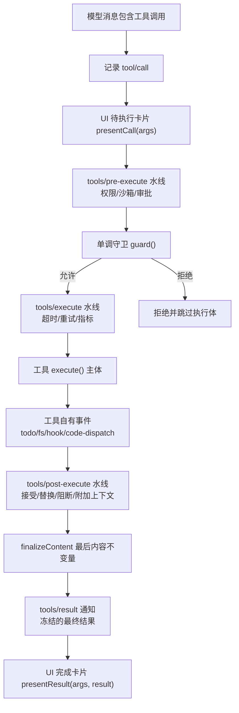
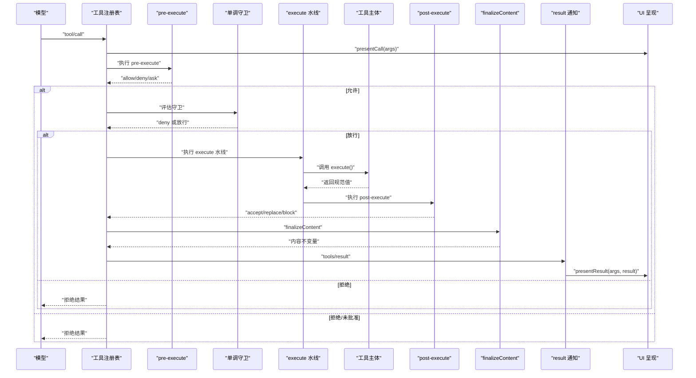
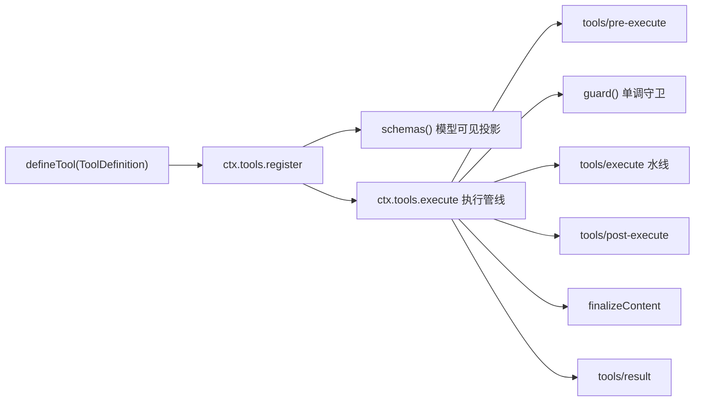

# 添加工具指南

<cite>
**本文引用的文件**
- [docs/cookbook/adding-a-tool.md](file://docs/cookbook/adding-a-tool.md)
- [docs/cookbook/adding-a-tool.zh.md](file://docs/cookbook/adding-a-tool.zh.md)
- [docs/subsystems/tools.md](file://docs/subsystems/tools.md)
- [docs/tool-execution-pipeline.md](file://docs/tool-execution-pipeline.md)
- [docs/testing.md](file://docs/testing.md)
- [packages/shell/tool-bash/src/index.ts](file://packages/shell/tool-bash/src/index.ts)
- [packages/fs/tool-fs/src/index.ts](file://packages/fs/tool-fs/src/index.ts)
</cite>

## 目录
1. [简介](#简介)
2. [项目结构](#项目结构)
3. [核心组件](#核心组件)
4. [架构总览](#架构总览)
5. [详细组件分析](#详细组件分析)
6. [依赖关系分析](#依赖关系分析)
7. [性能考量](#性能考量)
8. [故障排查指南](#故障排查指南)
9. [结论](#结论)
10. [附录](#附录)

## 简介
本指南面向希望在 DeepSeek Harness 中开发自定义工具的开发者，系统讲解工具定义、参数校验、错误处理、权限控制、注册与生命周期、测试与调试、部署最佳实践，以及工具与 Agent 的交互模式。内容基于仓库中的官方文档与生产级工具实现（如 bash、fs），提供从简单到复杂的渐进式示例路径，帮助你在不直接粘贴代码的前提下掌握完整流程。

## 项目结构
DeepSeek Harness 的工具体系由“工具定义 + 执行流水线 + 策略钩子 + UI 呈现”组成：
- 工具定义：通过 defineTool 声明 name、description、parameters、output、execute 等字段，并可选 presentCall/presentResult 用于 UI 卡片。
- 执行流水线：tools/pre-execute → 单调守卫 → tools/execute → tools/post-execute → finalizeContent → tools/result。
- 策略与权限：pre-execute 允许/拒绝/询问；guard 提供最终不可逆的拒绝；post-execute 可替换结果或阻断。
- UI 呈现：presentCall 展示待执行卡片；presentResult 展示完成卡片；presentationMeta 提供可回放的结果元数据。

图表来源
- [docs/tool-execution-pipeline.md:8-58](file://docs/tool-execution-pipeline.md#L8-L58)
- [docs/subsystems/tools.md:170-404](file://docs/subsystems/tools.md#L170-L404)

章节来源
- [docs/cookbook/adding-a-tool.md:7-94](file://docs/cookbook/adding-a-tool.md#L7-L94)
- [docs/subsystems/tools.md:9-96](file://docs/subsystems/tools.md#L9-L96)

## 核心组件
- ToolDefinition：工具的核心契约，包含模型可见的 schema、输出规范、执行函数、可选的内容终态回调和 UI 呈现方法。
- 统一 JSON 值 Schema DSL：一套统一的 ValueSchemaSpec，用于参数与输出的类型约束与推断。
- 执行上下文与身份：ToolExecution/ToolDispatchExecution 保护调用身份与信号；exec.signal 必须被尊重以支持取消。
- 扩展点（水线）：
  - tools/pre-execute：可扩展的允许/拒绝/询问策略。
  - guard：单调守卫，最终拒绝且不可被后续监听器撤销。
  - tools/execute：around-dispatch，适合超时、重试、指标。
  - tools/post-execute：接受、替换、阻断、附加上下文。
  - finalizeContent：工具定义拥有的最后内容不变量。
  - tools/result：观察冻结的最终结果。
- UI 呈现：presentCall/presentResult 返回中性 card 标签视图；presentationMeta 提供可回放的元数据。

章节来源
- [docs/subsystems/tools.md:9-96](file://docs/subsystems/tools.md#L9-L96)
- [docs/subsystems/tools.md:98-151](file://docs/subsystems/tools.md#L98-L151)
- [docs/subsystems/tools.md:170-404](file://docs/subsystems/tools.md#L170-L404)
- [docs/subsystems/tools.md:459-468](file://docs/subsystems/tools.md#L459-L468)

## 架构总览
下图展示了工具从模型请求到 UI 呈现的端到端流程，包括策略、沙箱、文件系统守卫、结果重写、最终观测与渲染。

图表来源
- [docs/tool-execution-pipeline.md:8-58](file://docs/tool-execution-pipeline.md#L8-L58)
- [docs/subsystems/tools.md:170-404](file://docs/subsystems/tools.md#L170-L404)

## 详细组件分析

### 工具定义与最小形态
- 使用 defineTool 声明 name、description、parameters、output、execute。
- parameters 使用 ParameterSchemaSpec，required 标记必填项；output.schema 使用 ValueSchemaSpec 描述返回值。
- execute 接收已校验的参数与 exec 上下文；仅返回规范 JSON 值，不要返回内容块。
- output.render 将规范值转换为模型可见内容；presentationMeta 提供可回放的结果元数据。
- presentCall/presentResult 提供 UI 卡片呈现（generic/terminal/diff/search/web/read）。

章节来源
- [docs/cookbook/adding-a-tool.md:7-49](file://docs/cookbook/adding-a-tool.md#L7-L49)
- [docs/cookbook/adding-a-tool.zh.md:7-49](file://docs/cookbook/adding-a-tool.zh.md#L7-L49)
- [docs/subsystems/tools.md:98-151](file://docs/subsystems/tools.md#L98-L151)
- [docs/subsystems/tools.md:459-468](file://docs/subsystems/tools.md#L459-L468)

### 参数验证与错误处理
- 参数在 execute 前由框架按 ParameterSchemaSpec 校验；超出 DSL 的约束需在 execute 内手动检查。
- 抛出异常或返回无效值会被注册表捕获并转为 isError；基础设施失败应抛异常，领域成功即使状态不理想也应写入规范值。
- 输出值经快照、校验、冻结后交给 render；presentationMeta 仅在顶层调用计算，嵌套 Code 分发会跳过。

章节来源
- [docs/cookbook/adding-a-tool.md:40-49](file://docs/cookbook/adding-a-tool.md#L40-L49)
- [docs/subsystems/tools.md:149-151](file://docs/subsystems/tools.md#L149-L151)
- [docs/subsystems/tools.md:370-375](file://docs/subsystems/tools.md#L370-L375)

### 权限控制与策略
- tools/pre-execute：允许/拒绝/询问；缺少审批支持时 ask 转为拒绝。
- guard：单调守卫，最终拒绝且不可被后续监听器撤销；适合部署级安全策略。
- tools/post-execute：可替换内容或值、阻断结果、附加上下文；保密策略应在此阻断或替换值。
- 建议不要把部署策略内建到工具中，而是通过水线与守卫组合实现。

章节来源
- [docs/cookbook/adding-a-tool.md:57-61](file://docs/cookbook/adding-a-tool.md#L57-L61)
- [docs/subsystems/tools.md:153-172](file://docs/subsystems/tools.md#L153-L172)
- [docs/subsystems/tools.md:376-404](file://docs/subsystems/tools.md#L376-L404)

### 长时间运行任务
- 通过 run_in_background 与 ctx.jobs.start 注册后台任务；成功后返回规范句柄（如 { kind: 'background', jobId }）。
- 前台工作需遵守 exec.signal；后台任务发布 id 后应使用任务自有的取消信号。
- 背景任务的 cancel/done/readOutput 由 producer 提供；job_* 工具负责查询与控制。

章节来源
- [docs/cookbook/adding-a-tool.md:51-56](file://docs/cookbook/adding-a-tool.md#L51-L56)
- [docs/subsystems/tools.md:243-255](file://docs/subsystems/tools.md#L243-L255)

### UI 呈现与回放
- presentCall/presentResult 返回中性 card 标签视图；不同卡类型对应不同 UI 能力。
- presentationMeta 提供可回放的结果元数据，避免在规范值中混入 UI 格式。
- 纯函数要求：present 方法必须在实时流与回放中稳定运行，不依赖 I/O、时钟或随机数。

章节来源
- [docs/cookbook/adding-a-tool.md:67-90](file://docs/cookbook/adding-a-tool.md#L67-L90)
- [docs/subsystems/tools.md:459-468](file://docs/subsystems/tools.md#L459-L468)

### 与 Agent 的交互模式
- exec.agent 可用于异步通知（agent.inject），追加下一次模型请求可见的持久化上下文。
- Code Mode 下每个可见工具可通过 await tools.<name>(args) 调用，重新进入完整管道；成功返回规范值，失败返回结构化错误。
- 工具应避免直接依赖 UI 或传输类型，保持宿主/客户端无关。

章节来源
- [docs/cookbook/adding-a-tool.md:49-65](file://docs/cookbook/adding-a-tool.md#L49-L65)
- [docs/subsystems/tools.md:255-281](file://docs/subsystems/tools.md#L255-L281)

### 参考实现：bash 工具
- 暴露 shell 能力，支持前台命令与后台任务；提供终端卡片与通用卡片两种呈现。
- 参数校验包含命令非空、描述非空、timeoutMs 正数、沙箱升级参数配对校验。
- 工作目录解析遵循会话 cwd 与策略根；结果规范化为 exitCode/signal/timedOut/aborted/stdout/stderr/sandbox。

章节来源
- [packages/shell/tool-bash/src/index.ts:30-93](file://packages/shell/tool-bash/src/index.ts#L30-L93)
- [packages/shell/tool-bash/src/index.ts:100-188](file://packages/shell/tool-bash/src/index.ts#L100-L188)

### 参考实现：文件系统工具套件
- 提供 read/write/edit/read_image 工具；read 支持行窗口与字节限制；write/edit 受沙箱控制器保护。
- 配置项包括 readLimit、readMaxLineLength、readMaxBytes、readStreamMinSize，均为正整数。
- read_image 仅在挂载 attachments 时注册；mutation 工具通过 fs/* 事件门控进行读前写策略。

章节来源
- [packages/fs/tool-fs/src/index.ts:1-80](file://packages/fs/tool-fs/src/index.ts#L1-L80)

## 依赖关系分析
- 工具包依赖 Cordis Context 与 dsh-tools 提供的 defineTool 与类型。
- 具体工具依赖相应服务 seam：shell、fs、jobs、systemPrompt、sandboxPolicy 等。
- 工具注册通过 ctx.tools.register；可见性通过 schemas() 投影到模型请求；执行通过 ctx.tools.execute 进入水线。

图表来源
- [docs/subsystems/tools.md:478-574](file://docs/subsystems/tools.md#L478-L574)
- [docs/subsystems/tools.md:576-719](file://docs/subsystems/tools.md#L576-L719)

章节来源
- [docs/subsystems/tools.md:478-719](file://docs/subsystems/tools.md#L478-L719)

## 性能考量
- 合理设置 timeoutMs，并在 execute 中及时响应 exec.signal 以避免资源浪费。
- 对大输出采用流式或 spillStore 后端，避免阻塞主线程。
- 并发安全：isConcurrencySafe 仅当明确 true 时才允许并行；否则走独占模式。
- 避免在 presentCall/presentResult 中进行 I/O 或读取会话状态，确保回放性能与稳定性。

章节来源
- [docs/subsystems/tools.md:54-74](file://docs/subsystems/tools.md#L54-L74)
- [docs/subsystems/tools.md:243-255](file://docs/subsystems/tools.md#L243-L255)

## 故障排查指南
- 参数错误：检查 parameters 的 required 与类型；execute 内补充 DSL 无法表达的约束。
- 权限拒绝：确认 pre-execute 与 guard 的策略；必要时调整 allow/deny 或审批流程。
- 超时与取消：确保 execute 内部正确传播 exec.signal；后台任务使用任务自有取消信号。
- UI 呈现异常：检查 presentCall/presentResult 的 card 类型与字段；确保 presentationMeta 为纯函数。
- 日志与回放：利用 tools/result 观察冻结结果；通过 session 事件定位问题。

章节来源
- [docs/cookbook/adding-a-tool.md:40-61](file://docs/cookbook/adding-a-tool.md#L40-L61)
- [docs/subsystems/tools.md:370-404](file://docs/subsystems/tools.md#L370-L404)

## 结论
通过 defineTool 与工具执行流水线，DeepSeek Harness 提供了强大的工具扩展能力。开发者应专注于声明清晰的参数与输出 schema、实现健壮的 execute、合理使用策略水线与守卫、设计稳定的 UI 呈现，并通过测试与回放保障质量。参考 bash 与 fs 工具的实现，可以逐步构建从简单到复杂的工具，满足多样化的 Agent 需求。

## 附录

### 快速上手清单
- 定义工具：name、description、parameters、output、execute。
- 注册工具：ctx.tools.register(defineTool(...))。
- 权限策略：tools/pre-execute 与 guard。
- 长任务：run_in_background + ctx.jobs.start。
- UI 呈现：presentCall/presentResult + presentationMeta。
- 测试：遵循仓库测试策略，覆盖单元、e2e、快照与浏览器快照。

章节来源
- [docs/cookbook/adding-a-tool.md:7-94](file://docs/cookbook/adding-a-tool.md#L7-L94)
- [docs/testing.md:7-50](file://docs/testing.md#L7-L50)