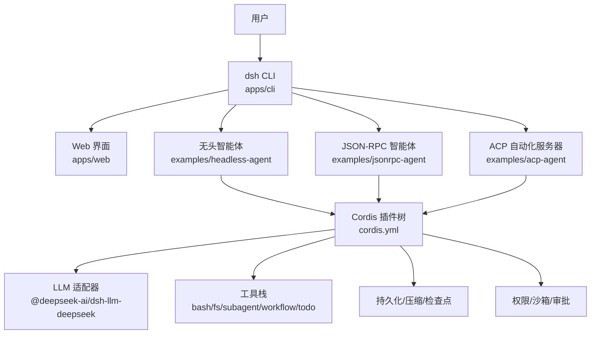
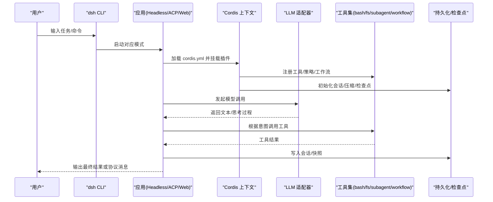
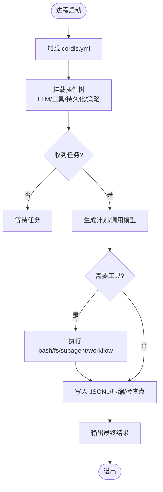
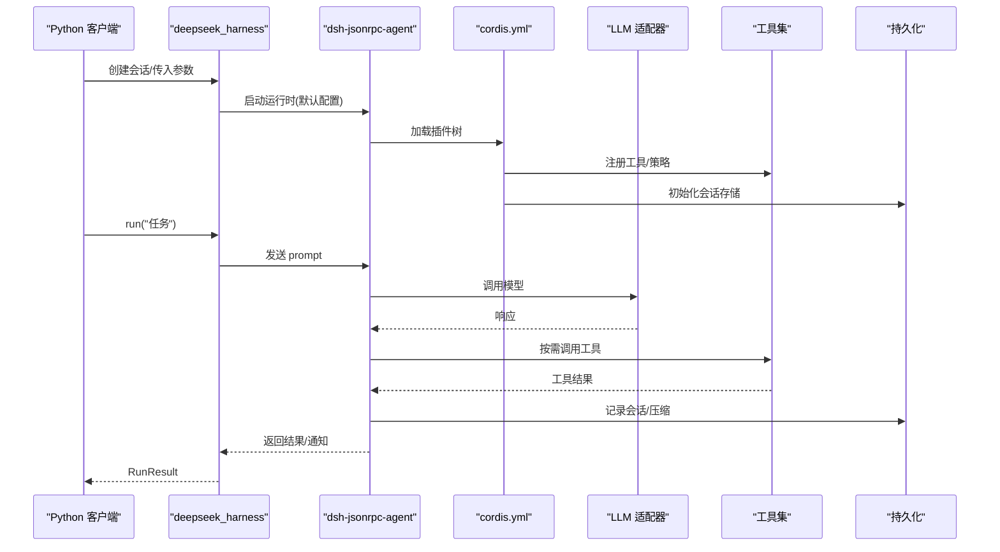
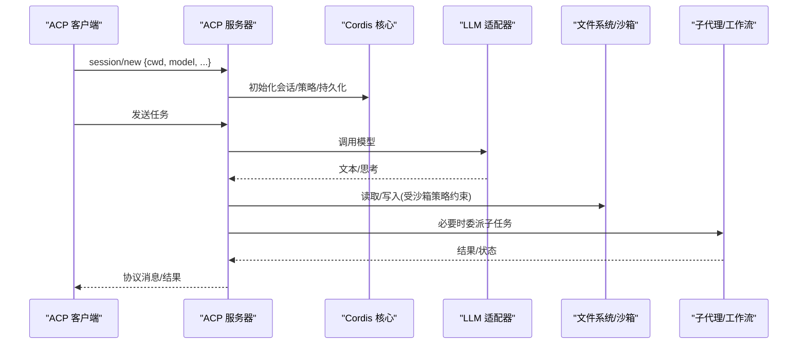
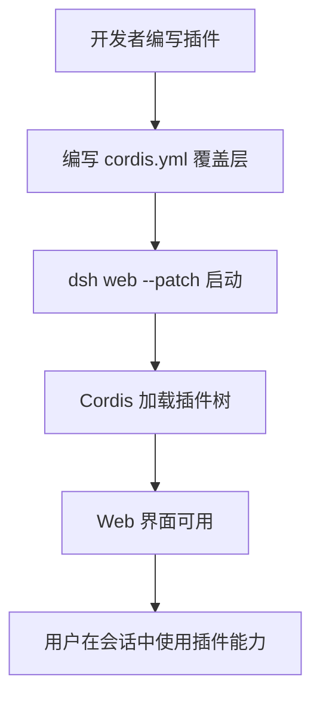
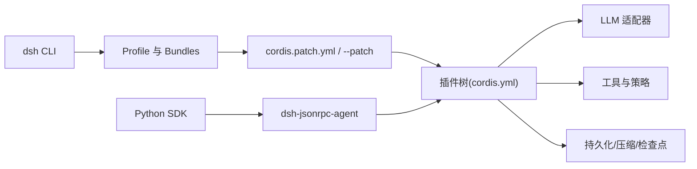

# 示例教程

<cite>
**本文引用的文件**
- [README.md](file://README.md)
- [examples/README.md](file://examples/README.md)
- [apps/cli/README.md](file://apps/cli/README.md)
- [docs/cordis-tutorial/index.md](file://docs/cordis-tutorial/index.md)
- [docs/cordis-tutorial/01-first-plugin.md](file://docs/cordis-tutorial/01-first-plugin.md)
- [docs/user/guide/index.md](file://docs/user/guide/index.md)
- [examples/headless-agent/README.md](file://examples/headless-agent/README.md)
- [examples/headless-agent/cordis.yml](file://examples/headless-agent/cordis.yml)
- [examples/jsonrpc-agent/README.md](file://examples/jsonrpc-agent/README.md)
- [examples/acp-agent/README.md](file://examples/acp-agent/README.md)
- [examples/acp-agent/cordis.yml](file://examples/acp-agent/cordis.yml)
- [python/sdk/README.md](file://python/sdk/README.md)
</cite>

## 目录
1. [简介](#简介)
2. [项目结构](#项目结构)
3. [核心组件](#核心组件)
4. [架构总览](#架构总览)
5. [详细组件分析](#详细组件分析)
6. [依赖关系分析](#依赖关系分析)
7. [性能注意事项](#性能注意事项)
8. [故障排查指南](#故障排查指南)
9. [结论](#结论)
10. [附录：从零到一构建智能体应用（分步教程）](#附录从零到一构建智能体应用分步教程)

## 简介
本教程面向希望快速上手 DeepSeek Harness（简称 dsh）的开发者，提供从基础到高级的完整示例与逐步式教程。你将学会：
- 使用 Web UI、命令行和 Python SDK 三种方式运行智能体
- 通过 Cordis 插件体系组合能力（工具、LLM 适配器、文件系统、沙箱、工作流等）
- 编写并加载自定义插件，实现自动化工作流、数据处理管道与智能助手
- 在真实场景中复用示例配置与测试用例，理解设计思路与最佳实践

## 项目结构
仓库采用多包与多应用组织：
- apps：产品入口（CLI、Web）
- examples：可运行的示例集合（headless-agent、jsonrpc-agent、acp-agent、web-cordis、web-schedule 等）
- docs：教程与子系统文档（Cordis 教程、用户指南、子系统说明）
- packages：核心能力包（会话、工具、工作流、子代理、持久化、权限策略等）
- python：Python SDK 与运行时载体

图表来源
- [apps/cli/README.md:1-48](file://apps/cli/README.md#L1-L48)
- [examples/headless-agent/cordis.yml:1-166](file://examples/headless-agent/cordis.yml#L1-L166)
- [examples/acp-agent/cordis.yml:1-193](file://examples/acp-agent/cordis.yml#L1-L193)

章节来源
- [README.md:1-58](file://README.md#L1-L58)
- [examples/README.md:1-30](file://examples/README.md#L1-L30)
- [apps/cli/README.md:1-48](file://apps/cli/README.md#L1-L48)

## 核心组件
- 启动器与配置文件
  - dsh CLI 负责解析命令、选择 profile、加载插件树；所有能力以插件形式挂载。
  - cordis.yml 是插件树的声明式描述，决定加载哪些插件以及它们的配置。
- 插件框架 Cordis
  - 一切皆插件：工具、LLM 适配器、文件系统、工作流、子代理、审批策略等均为插件。
  - 通过 Context 暴露能力，支持生命周期、事件、服务注入与热重载。
- 示例形态
  - headless-agent：一次性任务执行，输出结构化结果，适合批处理与流水线。
  - jsonrpc-agent：通过 Python SDK 驱动，stdout 纯协议，适合集成到外部系统。
  - acp-agent：Agent Client Protocol 自动化服务器，面向程序化客户端。
  - web-cordis / web-schedule：Web 扩展与定时提醒等增强能力。

章节来源
- [docs/cordis-tutorial/index.md:1-61](file://docs/cordis-tutorial/index.md#L1-L61)
- [examples/headless-agent/README.md:1-33](file://examples/headless-agent/README.md#L1-L33)
- [examples/jsonrpc-agent/README.md:1-41](file://examples/jsonrpc-agent/README.md#L1-L41)
- [examples/acp-agent/README.md:1-25](file://examples/acp-agent/README.md#L1-L25)

## 架构总览
下图展示了典型的一次请求如何从 CLI/Web/SDK 进入，经 Cordis 插件树调度至 LLM、工具与持久化层。

图表来源
- [examples/headless-agent/cordis.yml:1-166](file://examples/headless-agent/cordis.yml#L1-L166)
- [examples/acp-agent/cordis.yml:1-193](file://examples/acp-agent/cordis.yml#L1-L193)
- [apps/cli/README.md:1-48](file://apps/cli/README.md#L1-L48)

## 详细组件分析

### Headless Agent（无头智能体）
- 目标：一次性任务执行，标准输出纯净，便于脚本化与流水线集成。
- 关键能力：DeepSeek 适配器、本地 Bash/FS、子代理、工作流、Ralph 迭代、todo 列表、JSONL 持久化与压缩、检查点策略。
- 运行方式：通过 dsh CLI 指定 headless profile，传入任务字符串即可。

图表来源
- [examples/headless-agent/cordis.yml:1-166](file://examples/headless-agent/cordis.yml#L1-L166)
- [examples/headless-agent/README.md:1-33](file://examples/headless-agent/README.md#L1-L33)

章节来源
- [examples/headless-agent/README.md:1-33](file://examples/headless-agent/README.md#L1-L33)
- [examples/headless-agent/cordis.yml:1-166](file://examples/headless-agent/cordis.yml#L1-L166)

### JSON-RPC Agent（Python SDK 驱动）
- 目标：通过 Python SDK 以 JSON-RPC stdio 驱动无头智能体，stdout 仅承载协议消息。
- 关键能力：bash、read/write/edit、subagent、todo_write、JSONL 持久化、自动上下文压缩、maxTokensAsSuccess。
- 环境变量：DEEPSEEK_API_KEY、DEEPSEEK_BASE_URL、DSH_CWD、DSH_CONTEXT_WINDOW、DSH_MAX_TOKENS_AS_SUCCESS、DSH_MODEL、DSH_SESSION_ROOT、DSH_SYSTEM_PROMPT。

图表来源
- [examples/jsonrpc-agent/README.md:1-41](file://examples/jsonrpc-agent/README.md#L1-L41)
- [python/sdk/README.md:1-52](file://python/sdk/README.md#L1-L52)

章节来源
- [examples/jsonrpc-agent/README.md:1-41](file://examples/jsonrpc-agent/README.md#L1-L41)
- [python/sdk/README.md:1-52](file://python/sdk/README.md#L1-L52)

### ACP Agent（自动化服务器）
- 目标：基于 Agent Client Protocol 的自动化服务器，面向父代理、子代理提供者与程序化客户端。
- 关键能力：会话管理、权限控制、取消、子代理、工作流、Hooks、会话查询、重复工具提醒、沙箱策略。
- 安全边界：每个 session/new 提供绝对 cwd；沙箱与文件系统写操作按 workspace-write 或 danger-full-access 限制；重试触发权限申请。

图表来源
- [examples/acp-agent/README.md:1-25](file://examples/acp-agent/README.md#L1-L25)
- [examples/acp-agent/cordis.yml:1-193](file://examples/acp-agent/cordis.yml#L1-L193)

章节来源
- [examples/acp-agent/README.md:1-25](file://examples/acp-agent/README.md#L1-L25)
- [examples/acp-agent/cordis.yml:1-193](file://examples/acp-agent/cordis.yml#L1-L193)

### Web 与插件开发入门
- Web UI：通过 dsh web 启动，设置模型、选择工作区、直接对话与编辑代码。
- 第一个插件：使用函数/对象/类三种形式导出 apply，并通过 cordis.yml 插入到 Web 覆盖层中。
- 生命周期与清理：通过 ctx.effect 管理资源，插件卸载时自动回收。

图表来源
- [docs/user/guide/index.md:1-31](file://docs/user/guide/index.md#L1-L31)
- [docs/cordis-tutorial/01-first-plugin.md:1-96](file://docs/cordis-tutorial/01-first-plugin.md#L1-L96)

章节来源
- [docs/user/guide/index.md:1-31](file://docs/user/guide/index.md#L1-L31)
- [docs/cordis-tutorial/01-first-plugin.md:1-96](file://docs/cordis-tutorial/01-first-plugin.md#L1-L96)

## 依赖关系分析
- 启动器与 Profile
  - dsh CLI 解析命令与选项，将参数转发给所选 profile；profile 由 bundles 与 patch 组成，形成最终的插件树。
- 插件树与能力
  - 各示例通过 cordis.yml 声明依赖：LLM 适配器、Bash/FS、子代理、工作流、审批策略、持久化与压缩等。
- 外部依赖
  - Python SDK 通过环境变量与内置运行时驱动 dsh-jsonrpc-agent；ACP 示例通过 JSON-RPC stdio 与外部客户端通信。

图表来源
- [apps/cli/README.md:1-48](file://apps/cli/README.md#L1-L48)
- [examples/headless-agent/cordis.yml:1-166](file://examples/headless-agent/cordis.yml#L1-L166)
- [examples/acp-agent/cordis.yml:1-193](file://examples/acp-agent/cordis.yml#L1-L193)
- [python/sdk/README.md:1-52](file://python/sdk/README.md#L1-L52)

章节来源
- [apps/cli/README.md:1-48](file://apps/cli/README.md#L1-L48)
- [python/sdk/README.md:1-52](file://python/sdk/README.md#L1-L52)

## 性能注意事项
- 上下文窗口与压缩
  - 通过 token-meter 与 compaction-basic 控制压缩阈值与保留比例，避免超出上下文窗口。
- 并发与子代理
  - 子代理支持 spawn/fork 两种后端；合理设置 maxDepth 与 backgroundMode，避免过深嵌套与过多并发。
- 持久化与压缩
  - JSONL 持久化可结合 zstd 压缩；在快照模式下可选择关闭压缩以提升回放速度。
- 权限与沙箱
  - 在受限模式下，模型重试可能触发权限申请；应评估重试成本与失败回退策略。

[本节为通用指导，不直接分析具体文件]

## 故障排查指南
- 插件无法加载
  - 检查 cordis.yml 中的模块路径或包名是否正确；解析失败的条目会通过日志报告而非崩溃进程。
- 权限被拒绝
  - 确认 DSH_PERMISSION_MODE 与沙箱策略；workspace-write 下对非工作区的写入会被拒绝。
- 输出污染
  - 在 ACP/JSON-RPC 模式中，确保仅 stdout 承载协议消息，诊断信息走 stderr。
- 会话未恢复
  - 检查持久化根目录与压缩格式；快照模式需使用原始 JSONL 夹具。

章节来源
- [docs/cordis-tutorial/01-first-plugin.md:79-96](file://docs/cordis-tutorial/01-first-plugin.md#L79-L96)
- [examples/acp-agent/cordis.yml:18-31](file://examples/acp-agent/cordis.yml#L18-L31)
- [examples/acp-agent/README.md:14-25](file://examples/acp-agent/README.md#L14-L25)

## 结论
通过本教程，你已了解如何使用 dsh 的多种形态（Web、Headless、JSON-RPC、ACP）快速搭建智能体应用，掌握 Cordis 插件体系的组合方式，并在真实场景中进行扩展与优化。建议从 Web UI 入门，逐步过渡到 Headless 与 SDK 集成，最终在 ACP 模式下实现自动化编排。

[本节为总结性内容，不直接分析具体文件]

## 附录：从零到一构建智能体应用（分步教程）
以下教程引导你从零开始，逐步构建一个可运行的智能体应用。每一步均包含目标、步骤与参考文件路径。

- 第一步：准备环境
  - 克隆仓库、安装依赖、构建产物。
  - 参考：[README.md:15-35](file://README.md#L15-L35)

- 第二步：启动 Web UI 并配置模型与工作区
  - 运行 dsh web，打开 Settings → Models 添加 API Key，选择工作区后开始对话。
  - 参考：[docs/user/guide/index.md:7-23](file://docs/user/guide/index.md#L7-L23)

- 第三步：编写你的第一个插件
  - 在 scratch-plugin 中创建 TypeScript 插件，导出 name 与 apply；通过 cordis.yml 覆盖层插入到 Web。
  - 参考：[docs/user/develop/basic/index.md:15-64](file://docs/user/develop/basic/index.md#L15-L64)

- 第四步：理解 Cordis 插件机制
  - 学习插件的三种形式、生命周期、事件与服务注入；在 tmp/cordis-tutorial 中运行最小示例。
  - 参考：[docs/cordis-tutorial/index.md:13-46](file://docs/cordis-tutorial/index.md#L13-L46)、[docs/cordis-tutorial/01-first-plugin.md:1-96](file://docs/cordis-tutorial/01-first-plugin.md#L1-L96)

- 第五步：运行 Headless Agent
  - 设置 DEEPSEEK_API_KEY，使用 dsh --profile headless 执行一次性任务；查看 .sessions 下的 JSONL 输出。
  - 参考：[examples/headless-agent/README.md:7-18](file://examples/headless-agent/README.md#L7-L18)、[examples/headless-agent/cordis.yml:1-166](file://examples/headless-agent/cordis.yml#L1-L166)

- 第六步：通过 Python SDK 驱动 JSON-RPC Agent
  - 安装 deepseek-harness-sdk，使用 DeepSeekHarness 上下文管理器调用 run；可指定 provider/model/max_tokens 与自定义 cordis.yml。
  - 参考：[python/sdk/README.md:10-43](file://python/sdk/README.md#L10-L43)、[examples/jsonrpc-agent/README.md:16-41](file://examples/jsonrpc-agent/README.md#L16-L41)

- 第七步：部署 ACP 自动化服务器
  - 使用 pnpm run demo:acp 启动 ACP 服务器；通过 JSON-RPC stdio 与父代理或程序化客户端交互；注意 stdout 协议纯度与权限策略。
  - 参考：[examples/acp-agent/README.md:7-25](file://examples/acp-agent/README.md#L7-L25)、[examples/acp-agent/cordis.yml:18-66](file://examples/acp-agent/cordis.yml#L18-L66)

- 第八步：组合与优化
  - 调整 compaction 阈值、token meter、子代理深度与后台模式；在受限模式下启用审批策略与沙箱。
  - 参考：[examples/headless-agent/cordis.yml:63-83](file://examples/headless-agent/cordis.yml#L63-L83)、[examples/acp-agent/cordis.yml:67-80](file://examples/acp-agent/cordis.yml#L67-L80)

- 第九步：测试与回归
  - 使用示例自带的 e2e 测试与快照验证行为；在快照模式下关闭压缩以便回放对比。
  - 参考：[examples/headless-agent/README.md:18-28](file://examples/headless-agent/README.md#L18-L28)、[examples/acp-agent/cordis.yml:47-58](file://examples/acp-agent/cordis.yml#L47-L58)

- 第十步：发布与部署
  - 使用 dsh CLI 的 profile 与 bundles 机制打包插件；通过 --dump-config 与 --dump-default-config 校验组合结果。
  - 参考：[apps/cli/README.md:30-43](file://apps/cli/README.md#L30-L43)

[本节为教程性内容，引用了上述各文件的行号范围作为参考路径]