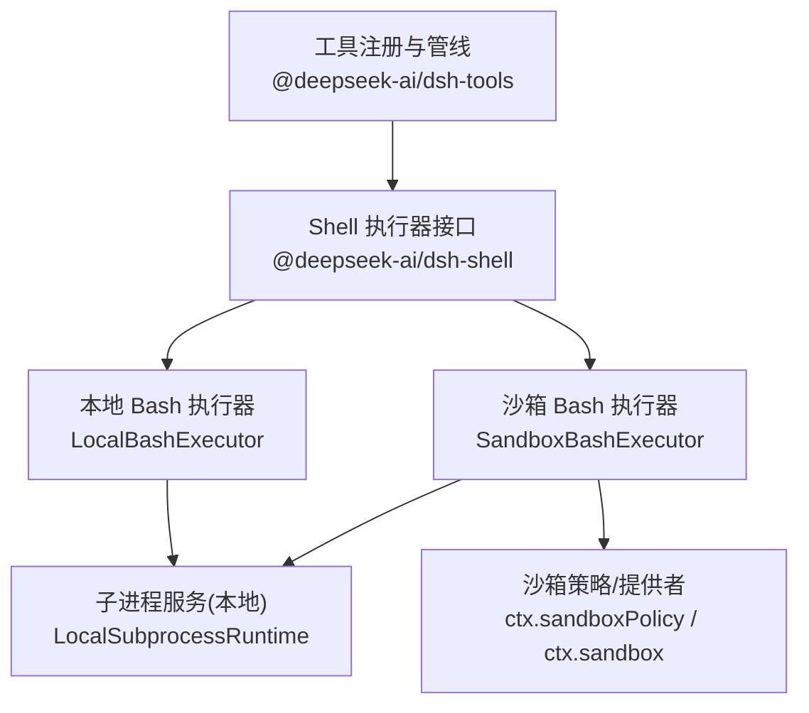
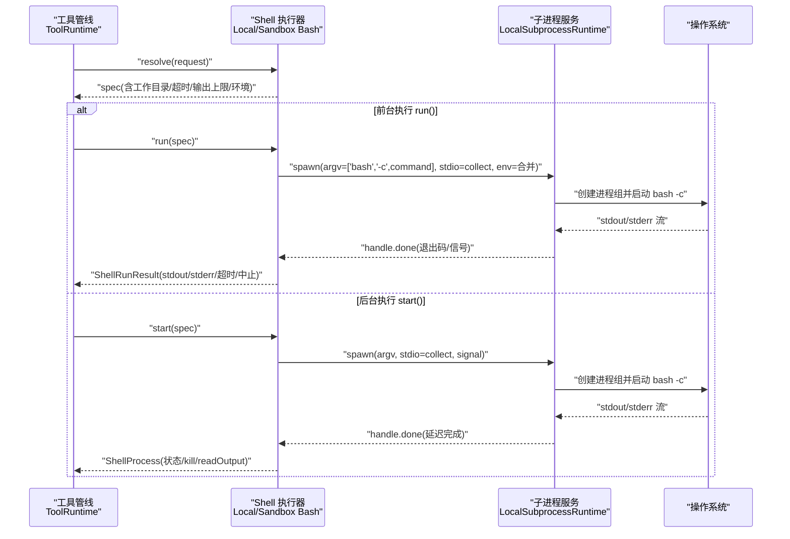
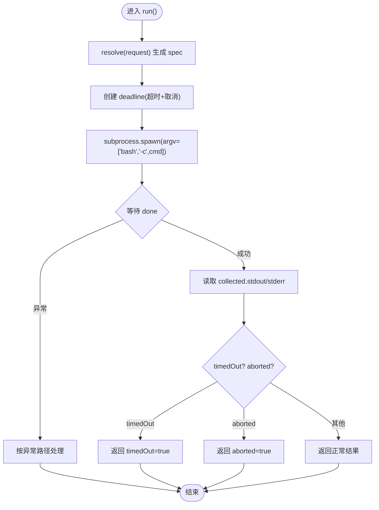
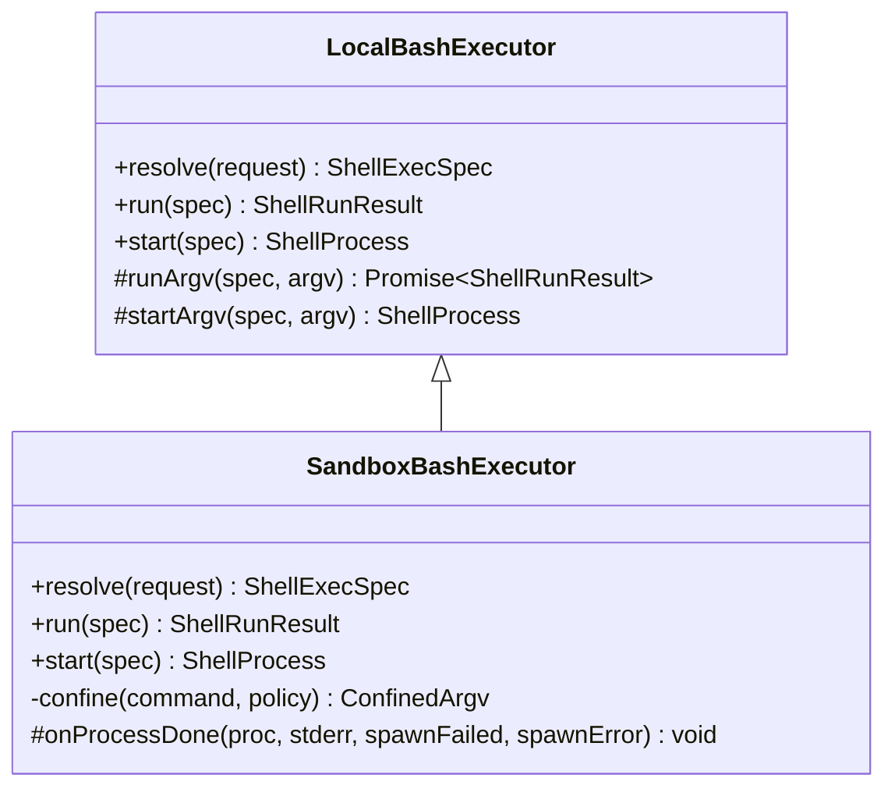
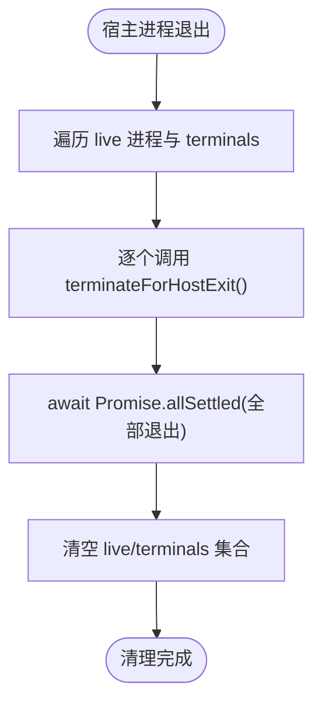
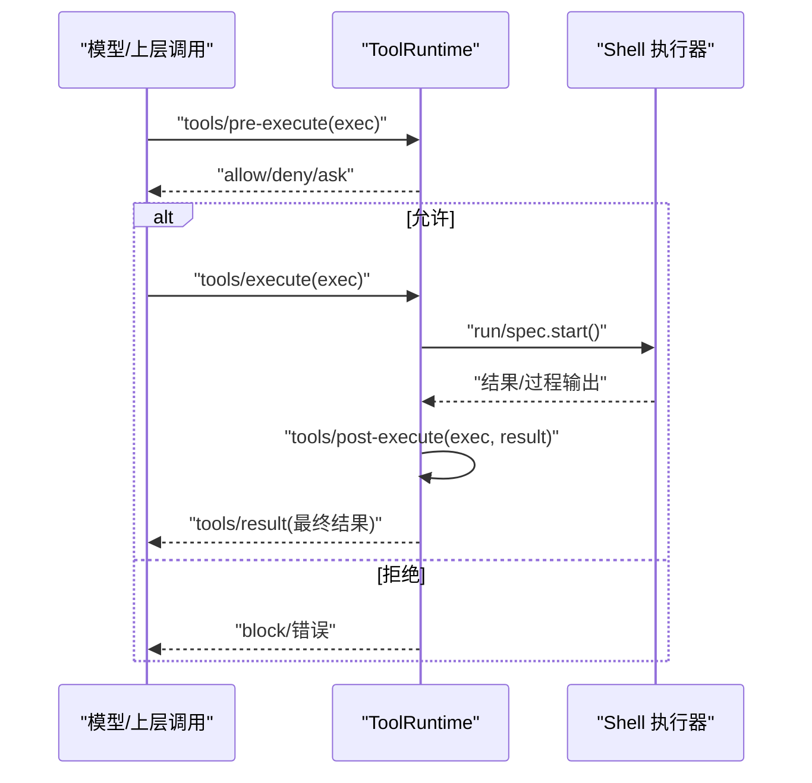
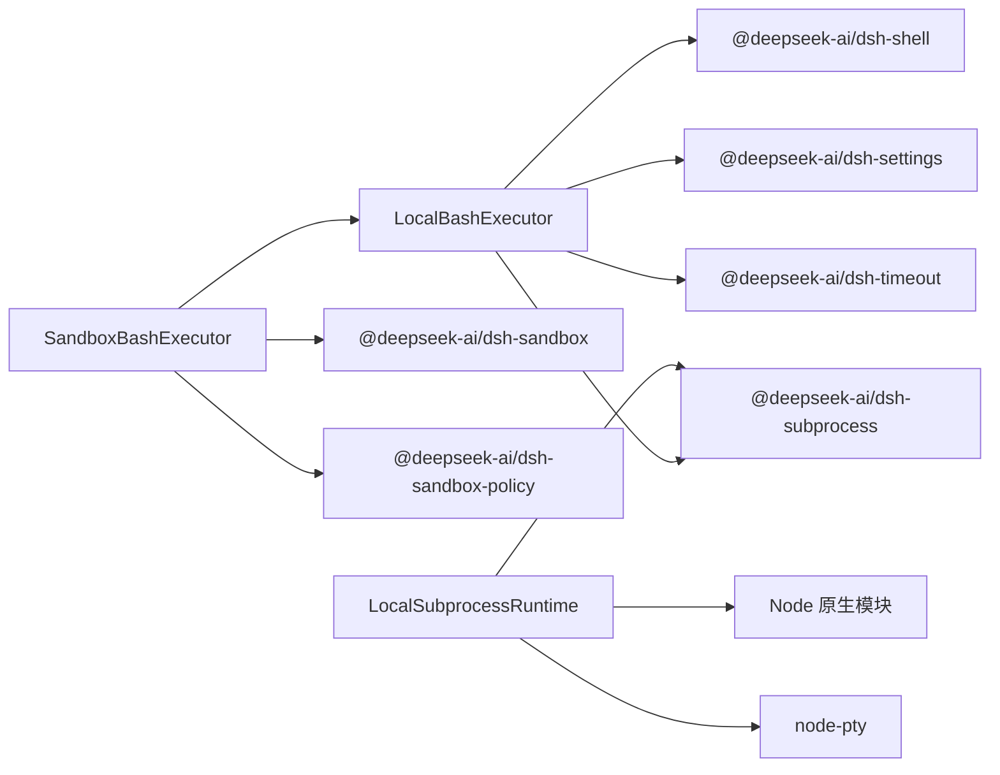

# Bash 工具集成

<cite>
**本文引用的文件**
- [packages/shell/bash-local/src/index.ts](file://packages/shell/bash-local/src/index.ts)
- [packages/shell/bash-sandbox/src/index.ts](file://packages/shell/bash-sandbox/src/index.ts)
- [packages/subprocess/subprocess-local/src/index.ts](file://packages/subprocess/subprocess-local/src/index.ts)
- [packages/core/tools/src/index.ts](file://packages/core/tools/src/index.ts)
- [packages/shell/bash-local/README.md](file://packages/shell/bash-local/README.md)
- [packages/shell/bash-sandbox/README.md](file://packages/shell/bash-sandbox/README.md)
</cite>

## 目录
1. [简介](#简介)
2. [项目结构](#项目结构)
3. [核心组件](#核心组件)
4. [架构总览](#架构总览)
5. [详细组件分析](#详细组件分析)
6. [依赖关系分析](#依赖关系分析)
7. [性能考量](#性能考量)
8. [故障排查指南](#故障排查指南)
9. [结论](#结论)
10. [附录](#附录)

## 简介
本文件面向在 DeepSeek Harness 中集成和使用 Bash 脚本作为工具的开发者与运维人员，系统性说明 Bash 工具的注册机制、参数处理、输出流管理、与子进程系统的集成（前台/后台任务）、跨平台注意事项（尤其是 Windows），以及错误处理、超时控制与资源清理的最佳实践。文档以代码级实现为依据，提供可视化图示与可操作的配置建议，帮助你在不同部署模式下安全、稳定地运行 Bash 工具。

## 项目结构
Bash 工具在 Harness 中以“能力层 + 执行器 + 沙箱”的方式组织：
- Shell 执行器接口由 dsh-shell 定义，具体实现包括本地 Bash 执行器与沙箱化 Bash 执行器。
- 子进程服务由 dsh-subprocess-local 提供，负责进程树生命周期、标准 I/O 收集、信号升级与资源回收。
- 工具注册与执行管线由 dsh-tools 提供，负责工具发现、策略拦截、结果呈现与事件通知。
- 沙箱策略与提供者由 dsh-sandbox* 系列模块提供，决定命令是否受限及如何受限。

**图表来源**
- [packages/core/tools/src/index.ts:787-800](file://packages/core/tools/src/index.ts#L787-L800)
- [packages/shell/bash-local/src/index.ts:102-137](file://packages/shell/bash-local/src/index.ts#L102-L137)
- [packages/shell/bash-sandbox/src/index.ts:44-86](file://packages/shell/bash-sandbox/src/index.ts#L44-L86)
- [packages/subprocess/subprocess-local/src/index.ts:37-59](file://packages/subprocess/subprocess-local/src/index.ts#L37-L59)

**章节来源**
- [packages/core/tools/src/index.ts:787-800](file://packages/core/tools/src/index.ts#L787-L800)
- [packages/shell/bash-local/src/index.ts:102-137](file://packages/shell/bash-local/src/index.ts#L102-L137)
- [packages/shell/bash-sandbox/src/index.ts:44-86](file://packages/shell/bash-sandbox/src/index.ts#L44-L86)
- [packages/subprocess/subprocess-local/src/index.ts:37-59](file://packages/subprocess/subprocess-local/src/index.ts#L37-L59)

## 核心组件
- LocalBashExecutor：基于子进程服务的本地 Bash 执行器，负责命令默认值、超时/取消分类、模型友好的终端环境变量、前台/后台执行与输出合并。
- SandboxBashExecutor：在 LocalBashExecutor 之上叠加沙箱能力，注入 per-call 策略，报告模式、强制程度与拒绝事实。
- LocalSubprocessRuntime：本地子进程运行时，负责进程树管理、I/O 收集（含溢出到临时文件的尾保留）、环境变量清洗、信号升级（SIGTERM→grace→SIGKILL）与宿主退出时的强制终止。
- ToolRuntime：工具注册与执行管线，提供 pre-execute/guard/around/post 等扩展点，统一错误与结果呈现。

**章节来源**
- [packages/shell/bash-local/src/index.ts:102-137](file://packages/shell/bash-local/src/index.ts#L102-L137)
- [packages/shell/bash-sandbox/src/index.ts:44-86](file://packages/shell/bash-sandbox/src/index.ts#L44-L86)
- [packages/subprocess/subprocess-local/src/index.ts:37-59](file://packages/subprocess/subprocess-local/src/index.ts#L37-L59)
- [packages/core/tools/src/index.ts:142-208](file://packages/core/tools/src/index.ts#L142-L208)

## 架构总览
下图展示一次 Bash 工具调用从工具管线到子进程的完整流程，包括前台执行与后台执行的分支。

**图表来源**
- [packages/shell/bash-local/src/index.ts:211-244](file://packages/shell/bash-local/src/index.ts#L211-L244)
- [packages/shell/bash-local/src/index.ts:242-318](file://packages/shell/bash-local/src/index.ts#L242-L318)
- [packages/subprocess/subprocess-local/src/index.ts:146-157](file://packages/subprocess/subprocess-local/src/index.ts#L146-L157)

## 详细组件分析

### LocalBashExecutor：本地 Bash 执行器
- 职责
  - 解析请求为 spec：填充 workdir、timeoutMs、stdoutMaxBytes，透传 stdin/env/dshEnv/sandboxPolicy。
  - 构建 spawnSpec：设置 stdio 收集策略（内存上限+溢出文件）、graceMs、signal、env 合并顺序（终端友好覆盖 < 调用方 env < dshEnv）。
  - 前台执行 run/runArgv：使用 deadline 融合超时与取消；区分 timedOut 与 aborted；返回合并后的 stdout/stderr。
  - 后台执行 start/startArgv：立即返回 ShellProcess；readOutput 增量读取并合并 stderr（带标记）；支持 kill；异常时记录一次性失败提示。
- 关键行为
  - 每调用一次即启动一个独立的非登录 bash -c，无持久 shell 状态。
  - 环境变量固定 NO_COLOR/TERM/PAGER/GIT_PAGER，避免分页器和颜色污染输出。
  - 输出限制：stdout 与 stderr 分别有内存上限，超出后溢出到临时文件，仅保留尾部。
  - 超时与取消：通过 deadline 统一处理；只有 executor 自身超时报 timedOut，上游取消报 aborted。
  - 进程组管理：graceMs 用于 SIGTERM→SIGKILL 升级与管道排空。

**图表来源**
- [packages/shell/bash-local/src/index.ts:146-171](file://packages/shell/bash-local/src/index.ts#L146-L171)
- [packages/shell/bash-local/src/index.ts:211-244](file://packages/shell/bash-local/src/index.ts#L211-L244)

**章节来源**
- [packages/shell/bash-local/src/index.ts:146-198](file://packages/shell/bash-local/src/index.ts#L146-L198)
- [packages/shell/bash-local/src/index.ts:211-318](file://packages/shell/bash-local/src/index.ts#L211-L318)
- [packages/shell/bash-local/README.md:23-34](file://packages/shell/bash-local/README.md#L23-L34)

### SandboxBashExecutor：沙箱化 Bash 执行器
- 职责
  - 继承 LocalBashExecutor，并在 resolve 中注入 per-call 的 sandboxPolicy。
  - 对非 danger-full-access 模式，将 argv 交给 ctx.sandbox.confine 进行包装，再交由本地执行器执行。
  - 对前台执行：捕获 runner 启动失败并抛出结构化不可用错误；对后台执行：在进程结算时标注 runnerFailed。
  - 在 onProcessDone 中根据 exitCode 与 stderr 推断 denial，并写入 result.sandbox 或 process.sandbox。
- 模式与语义
  - read-only：禁止写（除 /dev/null）。
  - workspace-write：仅允许在工作区根与临时目录写。
  - danger-full-access：不经过沙箱，直接本地执行。
  - 拒绝与失败：拒绝视为结果事实；runner 失败优先于拒绝，且会携带诊断信息。

**图表来源**
- [packages/shell/bash-local/src/index.ts:102-137](file://packages/shell/bash-local/src/index.ts#L102-L137)
- [packages/shell/bash-sandbox/src/index.ts:44-86](file://packages/shell/bash-sandbox/src/index.ts#L44-L86)
- [packages/shell/bash-sandbox/src/index.ts:88-167](file://packages/shell/bash-sandbox/src/index.ts#L88-L167)

**章节来源**
- [packages/shell/bash-sandbox/src/index.ts:44-86](file://packages/shell/bash-sandbox/src/index.ts#L44-L86)
- [packages/shell/bash-sandbox/src/index.ts:88-167](file://packages/shell/bash-sandbox/src/index.ts#L88-L167)
- [packages/shell/bash-sandbox/README.md:11-25](file://packages/shell/bash-sandbox/README.md#L11-L25)

### LocalSubprocessRuntime：本地子进程运行时
- 职责
  - 维护 live 进程集合与 terminal 集合，确保宿主退出时强制终止所有受管进程。
  - 解析可执行文件：支持 PATH 查找、Windows 扩展名处理、权限检查。
  - spawn：创建进程树，绑定 done/release 回调，保证整棵树退出后才释放句柄。
  - spawnTerminal：PTY 分配与封装。
- 资源清理
  - 监听 host exit，遍历 live 进程与 terminals 进行 terminateForHostExit。
  - disposeManagedProcesses：先发送 SIGTERM，再等待整棵树退出；若仍有失败则再次强制终止。

**图表来源**
- [packages/subprocess/subprocess-local/src/index.ts:47-102](file://packages/subprocess/subprocess-local/src/index.ts#L47-L102)

**章节来源**
- [packages/subprocess/subprocess-local/src/index.ts:37-102](file://packages/subprocess/subprocess-local/src/index.ts#L37-L102)
- [packages/subprocess/subprocess-local/src/index.ts:104-157](file://packages/subprocess/subprocess-local/src/index.ts#L104-L157)

### 工具注册与执行管线（与 Bash 工具的关系）
- 工具注册：通过 ToolRuntime 暴露 defineTool 等 API，支持 pre-execute/guard/around/post 等钩子。
- Bash 工具插件：dsh-tool-bash 将 Bash 能力暴露为模型可见的工具，结合执行器的 sandboxMode 动态增强 schema（如追加权限提升字段）。
- 执行管线：pre-execute 可做审批/策略拦截；execute 包裹实际执行；post-execute 可替换内容或附加上下文；result 事件用于最终落盘与观测。

**图表来源**
- [packages/core/tools/src/index.ts:142-208](file://packages/core/tools/src/index.ts#L142-L208)

**章节来源**
- [packages/core/tools/src/index.ts:142-208](file://packages/core/tools/src/index.ts#L142-L208)

## 依赖关系分析
- LocalBashExecutor 依赖：
  - @deepseek-ai/dsh-shell（执行器接口）
  - @deepseek-ai/dsh-subprocess（子进程抽象）
  - @deepseek-ai/dsh-settings（动态配置）
  - @deepseek-ai/dsh-timeout（deadline/超时）
- SandboxBashExecutor 额外依赖：
  - @deepseek-ai/dsh-sandbox（沙箱提供者）
  - @deepseek-ai/dsh-sandbox-policy（策略解析）
- LocalSubprocessRuntime 依赖：
  - Node.js 原生 fs/path/child_process 等
  - node-pty（PTY 终端）
  - @deepseek-ai/dsh-subprocess（运行时基类）

**图表来源**
- [packages/shell/bash-local/src/index.ts:12-18](file://packages/shell/bash-local/src/index.ts#L12-L18)
- [packages/shell/bash-sandbox/src/index.ts:11-26](file://packages/shell/bash-sandbox/src/index.ts#L11-L26)
- [packages/subprocess/subprocess-local/src/index.ts:11-28](file://packages/subprocess/subprocess-local/src/index.ts#L11-L28)

**章节来源**
- [packages/shell/bash-local/src/index.ts:12-18](file://packages/shell/bash-local/src/index.ts#L12-L18)
- [packages/shell/bash-sandbox/src/index.ts:11-26](file://packages/shell/bash-sandbox/src/index.ts#L11-L26)
- [packages/subprocess/subprocess-local/src/index.ts:11-28](file://packages/subprocess/subprocess-local/src/index.ts#L11-L28)

## 性能考量
- 输出限制与溢出
  - 每个流都有内存上限，超过阈值后溢出到临时文件，仅保留尾部，避免内存膨胀。
  - 后台任务的 stderr 与 stdout 均通过 offset 增量读取，减少重复拷贝。
- 超时与取消
  - 前台执行使用 deadline 统一融合超时与取消，避免多定时器竞争。
  - graceMs 控制 SIGTERM→SIGKILL 升级时间，兼顾优雅退出与强制终止。
- 进程组管理
  - 子进程服务维护 live 集合，确保宿主退出时能强制终止所有受管进程，防止僵尸进程。
- 环境变量合并
  - 终端友好覆盖在最底层，调用方 env 与 dshEnv 依次覆盖，减少不必要的环境污染。

[本节为通用指导，无需特定文件引用]

## 故障排查指南
- 常见错误与定位
  - 命令未找到或不可执行：子进程服务在 resolveExecutable 中检查 PATH 与权限，失败时给出明确错误。
  - 相对路径问题：子进程服务禁止相对路径，需使用绝对路径或裸 PATH 名称。
  - 沙箱不可用：当 runner 无法启动或匹配不到签名时，前台抛出不可用错误；后台在结算时标注 runnerFailed。
  - 输出被截断：当输出超过 maxOutputBytes/maxSpillBytes 时会溢出并仅保留尾部，注意 spillPath 提示。
- 调试建议
  - 开启更详细的 stderr 收集，关注是否有拒绝/失败诊断。
  - 调整 timeoutMs/graceMs/maxOutputBytes 观察行为变化。
  - 在工具层 pre-execute 钩子中打印 exec 信息，确认策略与参数。

**章节来源**
- [packages/subprocess/subprocess-local/src/index.ts:104-144](file://packages/subprocess/subprocess-local/src/index.ts#L104-L144)
- [packages/shell/bash-sandbox/src/index.ts:88-167](file://packages/shell/bash-sandbox/src/index.ts#L88-L167)
- [packages/shell/bash-local/src/index.ts:211-318](file://packages/shell/bash-local/src/index.ts#L211-L318)

## 结论
DeepSeek Harness 的 Bash 工具通过“执行器 + 子进程服务 + 沙箱策略”的分层设计，提供了可控、可观测、可扩展的脚本执行能力。LocalBashExecutor 提供稳定的前台/后台执行与输出管理；SandboxBashExecutor 在不改变工具层的前提下引入细粒度文件访问控制；LocalSubprocessRuntime 保障进程生命周期与环境隔离。配合工具管线的事件与策略钩子，可在复杂场景中实现安全的自动化与编排。

[本节为总结性内容，无需特定文件引用]

## 附录

### 配置参考（节选）
- 本地 Bash 执行器配置项
  - cwd：默认工作目录
  - timeoutMs：前台默认超时
  - maxTimeoutMs：单次调用超时上限
  - maxOutputBytes：单流内存上限
  - maxSpillBytes：单流溢出上限
  - graceMs：SIGTERM→SIGKILL 宽限期
- 沙箱策略配置项
  - mode：read-only | workspace-write | danger-full-access
  - workspaceRoot：工作区根（fallback）

**章节来源**
- [packages/shell/bash-local/README.md:9-21](file://packages/shell/bash-local/README.md#L9-L21)
- [packages/shell/bash-sandbox/README.md:27-37](file://packages/shell/bash-sandbox/README.md#L27-L37)

### 跨平台兼容性（Windows 注意事项）
- Bash 二进制硬编码为 POSIX 语义，当前实现不支持 Windows。
- 子进程服务在 Windows 上支持 PATHEXT 扩展名解析与环境变量大小写不敏感查找，但 Bash 本身仍要求 POSIX 环境。
- 建议在 Windows 上使用容器或 WSL 等方案提供 Bash 环境，或通过替代执行器适配。

**章节来源**
- [packages/shell/bash-local/README.md:40-47](file://packages/shell/bash-local/README.md#L40-L47)
- [packages/subprocess/subprocess-local/src/index.ts:137-144](file://packages/subprocess/subprocess-local/src/index.ts#L137-L144)
- [packages/subprocess/subprocess-local/src/index.ts:187-193](file://packages/subprocess/subprocess-local/src/index.ts#L187-L193)

### 最佳实践清单
- 始终设置合理的 timeoutMs 与 maxOutputBytes，避免长时间阻塞与内存占用。
- 使用 dshEnv 传递可信环境变量，避免泄露敏感信息。
- 在工具层 pre-execute 中实施审批与策略校验，必要时启用沙箱模式。
- 后台任务务必实现 kill 与 readOutput 消费逻辑，避免泄漏与死锁。
- 在宿主退出时依赖子进程服务的自动清理，不要自行残留子进程。

[本节为通用指导，无需特定文件引用]