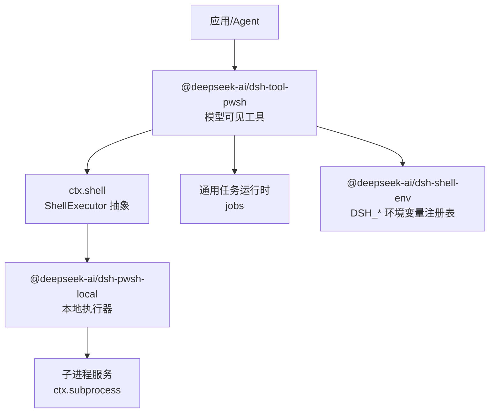
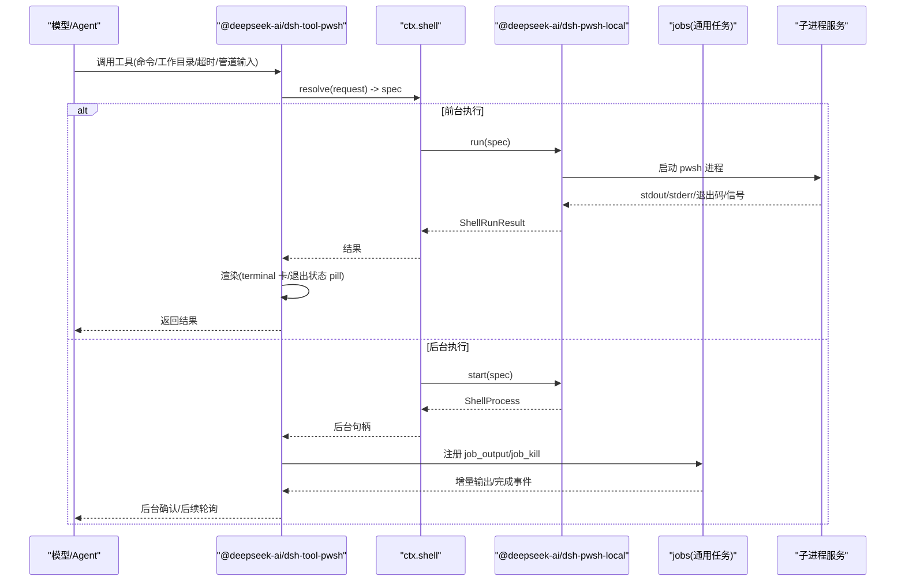
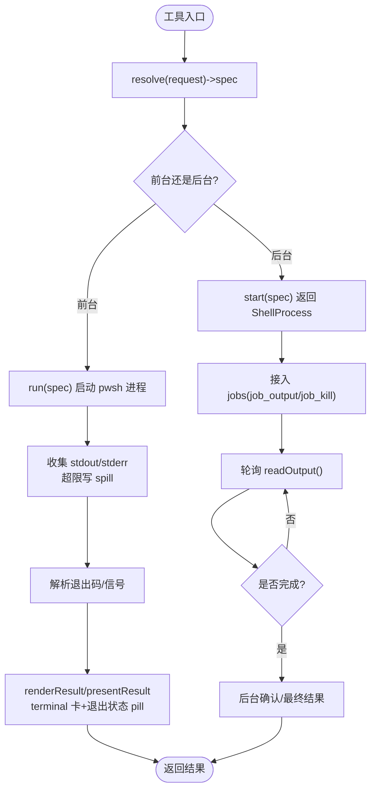
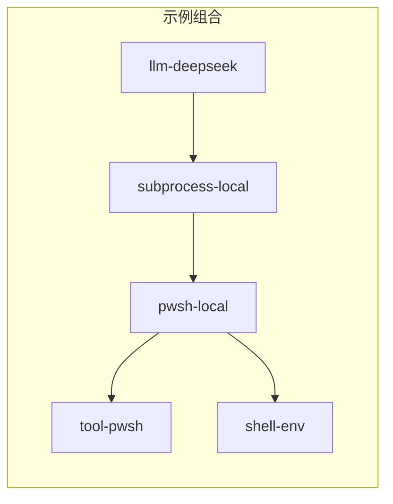

# PowerShell 工具集成

<cite>
**本文引用的文件**
- [2026-08-01-pwsh-tool-and-executor.md](file://.agents/notes/implemented/feature/2026-08-01-pwsh-tool-and-executor.md)
- [2026-08-02-pwsh-tool-bash-parity.md](file://.agents/notes/implemented/feature/2026-08-02-pwsh-tool-bash-parity.md)
- [pwsh-terminal.e2e.ts](file://apps/web/tests/pwsh-terminal.e2e.ts)
- [pwsh-terminal.overlay.yml](file://apps/web/tests/pwsh-terminal.overlay.yml)
- [pwsh.cordis.yml](file://examples/acp-agent/tests/pwsh.cordis.yml)
- [shell.md](file://docs/subsystems/shell.md)
</cite>

## 目录
1. [简介](#简介)
2. [项目结构](#项目结构)
3. [核心组件](#核心组件)
4. [架构总览](#架构总览)
5. [详细组件分析](#详细组件分析)
6. [依赖关系分析](#依赖关系分析)
7. [性能与超时（graceMs）](#性能与超时gracems)
8. [沙箱与安全限制](#沙箱与安全限制)
9. [调试与排障指南](#调试与排障指南)
10. [结论](#结论)
11. [附录：配置与使用清单](#附录配置与使用清单)

## 简介
本文件面向在 DeepSeek Harness 中集成和使用 PowerShell 脚本作为工具的开发者，聚焦 @deepseek-ai/dsh-tool-pwsh 插件的配置、调用方式、输出捕获、错误处理、后台任务管理、管道交互以及沙箱环境下的安全策略。文档同时解释 PowerShell 工具与 Bash 工具的对齐决策、渲染行为、退出状态约定，以及在 Windows 平台上的特殊语义（如强制终止返回退出码 1 且无信号标记）。

## 项目结构
PowerShell 工具能力由“执行器 + 工具 + 环境注册表”三部分构成：
- 执行器：@deepseek-ai/dsh-pwsh-local，实现 ctx.shell 的 PowerShell 方言执行（前台 run、后台 start、resolve 默认值与上限）。
- 工具：@deepseek-ai/dsh-tool-pwsh，模型可见的工具层，负责参数解析、执行调度、结果渲染、后台任务适配、沙箱拒绝呈现与权限升级表面。
- 环境：@deepseek-ai/dsh-shell-env，集中管理 DSH_* 变量，供所有 shell 工具注入。

图示来源
- [shell.md:219-221](file://docs/subsystems/shell.md#L219-L221)
- [2026-08-01-pwsh-tool-and-executor.md:13-16](file://.agents/notes/implemented/feature/2026-08-01-pwsh-tool-and-executor.md#L13-L16)
- [2026-08-02-pwsh-tool-bash-parity.md:13-19](file://.agents/notes/implemented/feature/2026-08-02-pwsh-tool-bash-parity.md#L13-L19)

章节来源
- [shell.md:1-304](file://docs/subsystems/shell.md#L1-L304)
- [2026-08-01-pwsh-tool-and-executor.md:1-36](file://.agents/notes/implemented/feature/2026-08-01-pwsh-tool-and-executor.md#L1-L36)
- [2026-08-02-pwsh-tool-bash-parity.md:1-37](file://.agents/notes/implemented/feature/2026-08-02-pwsh-tool-bash-parity.md#L1-L37)

## 核心组件
- dsh-tool-pwsh：模型可见的 PowerShell 工具，镜像 bash 工具的前台/后台执行、渲染、退出状态约定、沙箱拒绝呈现与权限升级表面。
- dsh-pwsh-local：本地执行器，实现 resolve/run/start，命令以单个 argv 元素传入 pwsh -NoLogo -NoProfile -NonInteractive -Command，避免额外 shell 引用层；可解析 pwsh 路径（显式配置优先，其次探测 PowerShell 7/PATH/Windows PowerShell 5.1）。
- dsh-shell-env：集中管理 DSH_* 变量，两个 shell 工具共享同一份注入逻辑。
- jobs 通用任务运行时：将后台句柄接入 job_output/job_kill 等控制面。

章节来源
- [2026-08-01-pwsh-tool-and-executor.md:13-16](file://.agents/notes/implemented/feature/2026-08-01-pwsh-tool-and-executor.md#L13-L16)
- [2026-08-02-pwsh-tool-bash-parity.md:13-19](file://.agents/notes/implemented/feature/2026-08-02-pwsh-tool-bash-parity.md#L13-L19)
- [shell.md:219-221](file://docs/subsystems/shell.md#L219-L221)

## 架构总览
下图展示从模型调用到进程执行的完整链路，包括前台运行、后台任务与结果渲染。

图示来源
- [shell.md:105-221](file://docs/subsystems/shell.md#L105-L221)
- [2026-08-02-pwsh-tool-bash-parity.md:13-19](file://.agents/notes/implemented/feature/2026-08-02-pwsh-tool-bash-parity.md#L13-L19)

## 详细组件分析

### 工具与执行器职责边界
- 工具层（dsh-tool-pwsh）：负责模型可见的参数契约、执行调度、结果渲染、后台任务适配、沙箱拒绝呈现与权限升级表面。
- 执行器层（dsh-pwsh-local）：负责命令默认值与上限、超时/中止分类、终端环境、后台读取合并；具体进程组、收集器、spill 文件、凭据清理与资源释放由子进程服务负责。
- 环境注册表（dsh-shell-env）：提供 DSH_* 变量的统一注入，确保两个 shell 工具一致。

章节来源
- [shell.md:219-221](file://docs/subsystems/shell.md#L219-L221)
- [2026-08-02-pwsh-tool-bash-parity.md:13-19](file://.agents/notes/implemented/feature/2026-08-02-pwsh-tool-bash-parity.md#L13-L19)

### 前台执行流程与输出捕获
- 请求进入工具后，先通过 ctx.shell.resolve 生成完全解析的 spec（包含 workdir、timeoutMs、stdoutMaxBytes、stdin、env、dshEnv、sandboxPolicy）。
- 执行器以单 argv 元素调用 pwsh -NoLogo -NoProfile -NonInteractive -Command，使 PowerShell 自身解析命令字符串，避免二次引用层。
- 输出捕获采用有界收集器，超出预算时写入 spill 文件并返回尾部文本；stderr 以标记段呈现。
- 退出状态约定：非零退出会追加标记，clean 退出不追加；presentResult 使用统一的 parseExitStatus 拆分输出正文与退出状态 pill。

图示来源
- [shell.md:105-221](file://docs/subsystems/shell.md#L105-L221)
- [2026-08-02-pwsh-tool-bash-parity.md:13-19](file://.agents/notes/implemented/feature/2026-08-02-pwsh-tool-bash-parity.md#L13-L19)

### 后台任务管理与管道交互
- 后台任务通过 start() 立即返回 ShellProcess，随后由 jobs 统一管理生命周期，支持 job_output 增量读取与 job_kill 终止。
- 管道操作：由于命令以单个 argv 元素传递给 pwsh -Command，管道语法由 PowerShell 自身解析，适合构建复杂管道链。
- 注意：Windows 上强制终止通常表现为退出码 1 且无信号标记，测试中已规范化处理。

章节来源
- [shell.md:167-221](file://docs/subsystems/shell.md#L167-L221)
- [2026-08-02-pwsh-tool-bash-parity.md:13-19](file://.agents/notes/implemented/feature/2026-08-02-pwsh-tool-bash-parity.md#L13-L19)

### 交互式命令执行
- 当前工具设计为 -NonInteractive 模式，不适合交互式会话。若需交互，应通过终端子系统或 PTY 方案（不在当前工具范围内），或使用外部交互包装并在工具内调用。

[本节为概念性说明，不直接分析具体文件]

### 参数传递、输出捕获与错误处理最佳实践
- 参数传递：尽量将复杂脚本内容放入独立 .ps1 文件并通过 -Command 调用，减少命令行转义问题。
- 输出捕获：合理设置 stdoutMaxBytes，避免过大输出导致内存压力；必要时利用 spill 路径定位完整输出。
- 错误处理：关注 timedOut、aborted、signal、exitCode 四个正交字段；非零退出会在渲染中体现为退出状态 pill。

章节来源
- [shell.md:105-221](file://docs/subsystems/shell.md#L105-L221)

### 渲染与 UI 对齐
- 完成的 PowerShell 前台调用在 Web UI 中以 terminal 卡片呈现，输出正文不含标记，退出状态 pill 来自解析后的 exitCode/signal。
- 后台确认与非单一文本块结果保持通用 console 围栏卡片。

章节来源
- [pwsh-terminal.e2e.ts:67-101](file://apps/web/tests/pwsh-terminal.e2e.ts#L67-L101)

## 依赖关系分析
- 组合装配示例展示了如何禁用默认的 bash 工具并挂载 tool-pwsh，同时启用 pwsh-local 执行器与 shell-env 环境注册表。
- Web 端到端测试通过 overlay 替换 bash 栈为 PowerShell 栈，验证 UI 渲染一致性。

图示来源
- [pwsh.cordis.yml:1-36](file://examples/acp-agent/tests/pwsh.cordis.yml#L1-L36)

章节来源
- [pwsh.cordis.yml:1-36](file://examples/acp-agent/tests/pwsh.cordis.yml#L1-L36)
- [pwsh-terminal.overlay.yml:1-21](file://apps/web/tests/pwsh-terminal.overlay.yml#L1-L21)

## 性能与超时（graceMs）
- 超时与中止：工具通过 ctx.shell.resolve 将配置中的超时与调用方提供的 AbortSignal 融合为一个截止时间，确保超时与中止互斥地记录“首个原因”。
- 关于 graceMs：仓库中与 PowerShell 工具相关的公开文档未定义名为 graceMs 的参数；如需自定义缓冲或宽限时间，请通过标准参数 workdir、timeoutMs、stdoutMaxBytes、stdin、env、dshEnv、sandboxPolicy 进行控制。
- 建议：对长耗时任务使用后台执行，配合 job_output 增量读取；对大输出任务设置合理的 stdoutMaxBytes 并利用 spill 路径。

章节来源
- [shell.md:105-221](file://docs/subsystems/shell.md#L105-L221)
- [2026-08-02-pwsh-tool-bash-parity.md:13-19](file://.agents/notes/implemented/feature/2026-08-02-pwsh-tool-bash-parity.md#L13-L19)

## 沙箱与安全限制
- 沙箱信息：执行结果可能包含 sandbox.mode、denied、enforcement、runnerFailed 等事实，用于区分命令失败与策略拒绝。
- 拒绝呈现与权限升级：工具层提供沙箱拒绝的可视化呈现，并暴露同次调用的 sandbox_permissions 升级表面，需经 ctx.approval 批准后方可扩大范围。
- Windows 特定：受限语言模式与命名管道契约在工具描述中明确；强制终止在 Windows 上通常返回退出码 1 且无信号标记。

章节来源
- [shell.md:141-165](file://docs/subsystems/shell.md#L141-L165)
- [2026-08-02-pwsh-tool-bash-parity.md:13-19](file://.agents/notes/implemented/feature/2026-08-02-pwsh-tool-bash-parity.md#L13-L19)

## 调试与排障指南
- 快速自检：在主机上通过解析到的 pwsh 路径执行最小命令，确认可用性与编码输出。
- 输出定位：当 stdout/stderr 被截断时，依据返回的 spill 路径定位完整输出。
- 退出状态：检查 ShellRunResult 的 timedOut、aborted、signal、exitCode，结合渲染中的退出状态 pill 定位问题。
- 后台任务：使用 job_output 轮询增量输出，job_kill 终止异常任务；完成后检查 status 与 stderr。
- UI 回归：Web 端到端测试验证了 PowerShell 调用在 UI 上与 Bash 一致的 terminal 卡片布局与退出状态 pill。

章节来源
- [pwsh-terminal.e2e.ts:41-44](file://apps/web/tests/pwsh-terminal.e2e.ts#L41-L44)
- [pwsh-terminal.e2e.ts:67-101](file://apps/web/tests/pwsh-terminal.e2e.ts#L67-L101)
- [shell.md:105-221](file://docs/subsystems/shell.md#L105-L221)

## 结论
@deepseek-ai/dsh-tool-pwsh 提供了与 Bash 工具行为对齐的 PowerShell 工具能力，覆盖前台/后台执行、输出捕获、退出状态约定、沙箱拒绝呈现与权限升级表面。通过 dsh-pwsh-local 执行器与 dsh-shell-env 环境注册表，实现了跨平台的稳定执行与一致的 DSH_* 注入。对于需要交互的场景，建议使用终端子系统；对于长耗时与大输出任务，推荐后台执行与 spill 路径定位。

[本节为总结性内容，不直接分析具体文件]

## 附录：配置与使用清单
- 组合装配要点
  - 禁用默认 bash 工具，插入 pwsh-local 执行器与 tool-pwsh 工具。
  - 挂载 shell-env 环境注册表，确保 DSH_* 变量生效。
- 典型参数
  - workdir：工作目录覆盖
  - timeoutMs：超时毫秒数（会被执行器默认值与上限约束）
  - stdoutMaxBytes：前台 stdout 捕获预算（字节）
  - stdin：向命令写入数据后关闭 stdin
  - env：普通环境变量（受凭据清洗影响）
  - dshEnv：Harness 拥有的 DSH_* 变量快照
  - sandboxPolicy：每调用沙箱策略（由工具层解析）
- 后台任务
  - 使用 start() 获取 ShellProcess，接入 jobs 的 job_output/job_kill。
  - 通过 readOutput() 增量读取输出，关注 lossy 与 spill 路径。
- 渲染与 UI
  - 前台完成结果以 terminal 卡片呈现，输出正文不含标记，退出状态 pill 来自解析后的 exitCode/signal。
  - 后台确认与非单一文本块结果保持通用 console 围栏卡片。

章节来源
- [pwsh.cordis.yml:1-36](file://examples/acp-agent/tests/pwsh.cordis.yml#L1-L36)
- [pwsh-terminal.overlay.yml:1-21](file://apps/web/tests/pwsh-terminal.overlay.yml#L1-L21)
- [shell.md:105-221](file://docs/subsystems/shell.md#L105-L221)
- [pwsh-terminal.e2e.ts:67-101](file://apps/web/tests/pwsh-terminal.e2e.ts#L67-L101)