# Shell 工具集�

<cite>
**本文引用的文件**
- [packages/shell/README.md](file://packages/shell/README.md)
- [docs/subsystems/shell.md](file://docs/subsystems/shell.md)
- [docs/subsystems/shell.zh.md](file://docs/subsystems/shell.zh.md)
- [packages/shell/tool-bash/README.md](file://packages/shell/tool-bash/README.md)
- [packages/shell/pwsh-local/README.md](file://packages/shell/pwsh-local/README.md)
- [packages/shell/bash-sandbox/README.md](file://packages/shell/bash-sandbox/README.md)
- [docs/subsystems/sandbox.md](file://docs/subsystems/sandbox.md)
- [docs/subsystems/subprocess.md](file://docs/subsystems/subprocess.md)
- [docs/subsystems/tools.md](file://docs/subsystems/tools.md)
- [apps/cli/tests/windows-shell.spec.ts](file://apps/cli/tests/windows-shell.spec.ts)
</cite>

## 目录
1. [简介](#简介)
2. [项目结�](#项目结�)
3. [核心组件](#核心组件)
4. [��总览](#��总览)
5. [详细组件分�](#详细组件分�)
6. [�赖关系分�](#�赖关系分�)
7. [性能�资�管�](#性能�资�管�)
8. [调试�测试最佳�践](#调试�测试最佳�践)
9. [跨平�兼容性](#跨平�兼容性)
10. [故障�查指�](#故障�查指�)
11. [结论](#结论)

## 简介
本文件��希望开�和使用自定义 Shell 工具的工程师，覆盖 Bash � PowerShell 的集�方��工具注册机制��数传递�输出处��交互�命令�管��作�错误状��退出�约定�沙箱安全�制�资�管�，以�调试测试�跨平�兼容性�性能优化建议。文档基�仓库中 shell 能力���进程抽象�工具管线�沙箱策略等�系统��进行说�。

## 项目结�
Shell 能力�由“执行器契约 + 具体�� + 共享�境 + 模�侧工具�组�：
- 契约��务定义：`ctx.shell`（ShellExecutor）�`ctx.shellEnv`（DSH_* �境��注册表）
- 执行器�供者：本地 Bash�沙箱化 Bash�本地 PowerShell
- 模�侧工具：Bash 工具�PowerShell 工具
- 支撑�系统：�进程抽象�工具管线�沙箱策略

```mermaid
graph TB
subgraph "Shell 能力�"
A["dsh-shell<br/>执行器契约"] --> B["dsh-bash-local<br/>本地 Bash 执行器"]
A --> C["dsh-bash-sandbox<br/>沙箱化 Bash 执行器"]
A --> D["dsh-pwsh-local<br/>本地 PowerShell 执行器"]
E["dsh-tool-bash<br/>模�侧 Bash 工具"] --> A
F["dsh-tool-pwsh<br/>模�侧 PowerShell 工具"] --> D
G["dsh-shell-env<br/>�管 DSH_* �境"] --> E
end
subgraph "支撑�系统"
H["dsh-subprocess<br/>�进程抽象"]
I["dsh-tools<br/>工具管线"]
J["dsh-sandbox / dsh-sandbox-policy<br/>沙箱策略"]
end
B --> H
C --> J
C --> H
D --> H
E --> I
F --> I
```

图示��
- [packages/shell/README.md:1-20](file://packages/shell/README.md#L1-L20)
- [docs/subsystems/shell.md:1-12](file://docs/subsystems/shell.md#L1-L12)
- [docs/subsystems/subprocess.md:1-16](file://docs/subsystems/subprocess.md#L1-L16)
- [docs/subsystems/sandbox.md:1-12](file://docs/subsystems/sandbox.md#L1-L12)
- [docs/subsystems/tools.md:1-12](file://docs/subsystems/tools.md#L1-L12)

章节��
- [packages/shell/README.md:1-20](file://packages/shell/README.md#L1-L20)

## 核心组件
- Shell 执行器契约（ShellExecutor）
  - resolve(request) → spec：将�选请求补�为必填规格
  - run(spec) → ShellRunResult：��执行，返�独立正交的结�字段（exitCode/signal/timedOut/aborted/timeoutMs/stdout/stderr/sandbox）
  - start(spec) → ShellProcess：��进程�柄，readOutput() ��读�，kill() 幂等终止
- �管�境（ShellEnvRegistry）
  - collect(execution) → DshEnvironment：�次调用�建 DSH_* 快照，注入到执行上下文
- 模�侧工具（bash/pwsh）
  - 暴露�数：command�workdir�timeoutMs�run_in_background�sandbox_permissions（�件��）�justification（�件必需）
  - 结�呈�：stdout/stderr 尾部�截断�示�超时/信�/退出�标记�沙箱拒�信�
- �进程抽象（SubprocessRuntime）
  - spawn/spec/handle：显� stdio�有界收集�spill 文件�树级终止�done 仅�带退出事�
- 沙箱策略（SandboxProvider/SandboxPolicyService）
  - confine(argv, policy) → ConfinedArgv：按模��制文件效�；danger-full-access ��过沙箱
  - 模�：read-only�workspace-write�danger-full-access；执行完整度 full/partial

章节��
- [docs/subsystems/shell.md:13-221](file://docs/subsystems/shell.md#L13-L221)
- [docs/subsystems/shell.zh.md:13-221](file://docs/subsystems/shell.zh.md#L13-L221)
- [docs/subsystems/subprocess.md:13-240](file://docs/subsystems/subprocess.md#L13-L240)
- [docs/subsystems/sandbox.md:9-156](file://docs/subsystems/sandbox.md#L9-L156)
- [packages/shell/tool-bash/README.md:15-55](file://packages/shell/tool-bash/README.md#L15-L55)

## ��总览
下图展示一次模�侧 bash 调用的端到端�程：工具层�建请求 → 执行器解� → �进程�动 → 输出收集/溢出 → 结�渲染�任务适�（��）。

```mermaid
sequenceDiagram
participant M as "模�/�件"
participant T as "工具层(dsh-tool-bash)"
participant S as "执行器(ctx.shell)"
participant P as "�进程�务(ctx.subprocess)"
participant X as "外部进程(bash/pwsh)"
participant J as "任务�行时(ctx.jobs)"
M->>T : 调用 bash(command, workdir, timeoutMs, ...)
T->>S : resolve(ShellExecRequest)
S-->>T : ShellExecSpec(已补�/�顶)
alt ��执行
T->>S : run(spec)
S->>P : spawn(argv, stdio, cwd, graceMs, signal, env)
P->>X : �动�进程
X-->>P : stdout/stderr �
P-->>S : CollectedOutput(�溢出至�盘)
S-->>T : ShellRunResult(exitCode/signal/timedOut/aborted/...)
T-->>M : 渲染结�(�退出�/超时/截断/沙箱标记)
else ��执行
T->>S : start(spec)
S->>P : spawn(...)
P->>X : �动�进程
S-->>T : ShellProcess(�柄)
T->>J : 注册 job(owner=agent, hooks=cancel/done/output)
T-->>M : 返� jobId
loop ��读�
T->>S : readOutput()
S-->>T : delta(lossy/spillPath)
T-->>J : ����输出
end
end
```

图示��
- [docs/subsystems/shell.md:105-221](file://docs/subsystems/shell.md#L105-L221)
- [docs/subsystems/subprocess.md:89-240](file://docs/subsystems/subprocess.md#L89-L240)
- [packages/shell/tool-bash/README.md:27-37](file://packages/shell/tool-bash/README.md#L27-L37)

## 详细组件分�

### Bash 执行器�工具（dsh-bash-local + dsh-tool-bash）
- �数�默认值
  - command：通过 bash -c 执行；无状���，使用 workdir 切�目录而� cd
  - workdir：优先�自会� cwd，��退到执行器�置或进程 cwd
  - timeoutMs：由执行器�置默认值�上��顶
  - run_in_background：立�返� jobId，无执行器超时
  - sandbox_permissions/justification：当挂载了沙箱执行器时��/必需
- �境�输入
  - �管 DSH_* 通过 ctx.shellEnv.collect 注入，�进程�务会移除继承的 DSH_* ���并
  - stdin/env/stdoutMaxBytes 仅供�信任进程内�件使用，模�侧工具�暴露
- 输出�错误
  - ��结�包� stdout/stderr 尾部�截断�示�超时/信�/退出�标记�沙箱拒�信�
  - �零退出��作为正常结�返�，isError 仅用�基础设施失败（如 spawn 失败�中止）
- ��任务
  - 将 ShellProcess 适�为通用 job，job �行时负责 id�所有��轮询�完�通知�清�

```mermaid
flowchart TD
Start(["开始"]) --> Build["�建 ShellExecRequest"]
Build --> Resolve{"resolve() 补�/�顶"}
Resolve --> Mode{"�� or ��?"}
Mode --> |��| Run["run(spec)"]
Mode --> |��| StartProc["start(spec) 返� ShellProcess"]
Run --> Collect["收集 stdout/stderr(�溢出)"]
Collect --> Result["生� ShellRunResult"]
StartProc --> JobReg["注册到 ctx.jobs"]
JobReg --> Poll["�� readOutput() ��"]
Result --> Render["渲染结�(�退出�/超时/截断/沙箱)"]
Poll --> Done["进程关闭 done"]
```

图示��
- [docs/subsystems/shell.md:13-221](file://docs/subsystems/shell.md#L13-L221)
- [packages/shell/tool-bash/README.md:15-55](file://packages/shell/tool-bash/README.md#L15-L55)

章节��
- [packages/shell/tool-bash/README.md:15-55](file://packages/shell/tool-bash/README.md#L15-L55)
- [docs/subsystems/shell.md:13-221](file://docs/subsystems/shell.md#L13-L221)

### PowerShell 执行器（dsh-pwsh-local）
- �调用�动一次性 pwsh -NoLogo -NoProfile -NonInteractive -Command <command>
- UTF-8 输出固定，���制�代�页导致乱�
- �执行路径解�：优先�置项，其次 PATH�Windows 安装�置�PowerShell 5.1 �退
- 行为镜� Bash 执行器语义：工作目录�超时/�消分类�模��好终端�境�����输出
- Windows 特有：强制终止以 exit 1 报告，无信�；UTF-8 �缀语��制（param/#requires/using 需脚本文件或包裹）

章节��
- [packages/shell/pwsh-local/README.md:1-58](file://packages/shell/pwsh-local/README.md#L1-L58)

### 沙箱化 Bash（dsh-bash-sandbox）
- 替� argv 为�� runner 包装�的命令，交由底层沙箱�端（bwrap/Landlock/Seatbelt/ACL）执行
- 模��文件效�
  - read-only：�止写入（�许 /dev/null）
  - workspace-write：�许在工作区根��端临时目录写入
  - danger-full-access：绕过沙箱，��过 ctx.sandbox
- 拒��失败
  - 拒�：stderr 匹��端签�，标记 result.sandbox.denied=true，并附带 mode/enforcement
  - Runner 失败：spawn 阶段或规则命中，��抛 SANDBOX_UNAVAILABLE，��记录 runnerFailed
- 策略解�
  - �次调用解� SandboxExecutionPolicy（mode/workspaceRoot/sessionId），支�一次性严格放宽�审批

章节��
- [packages/shell/bash-sandbox/README.md:1-89](file://packages/shell/bash-sandbox/README.md#L1-L89)
- [docs/subsystems/sandbox.md:9-156](file://docs/subsystems/sandbox.md#L9-L156)

### �进程抽象（dsh-subprocess）
- 完全显�的 spawn spec：argv�cwd�stdio�graceMs�signal�env，无��默认
- 输出收集：CollectedOutput 带 truncated/spillPath；offset-based ��读�，互�消费
- 终止�等待：terminate() 统一 SIGTERM→grace→SIGKILL �级；waitForExit() 观察整棵进程树
- 退出事�：done 仅�带 exitCode/signal，�因分类由上层决定

章节��
- [docs/subsystems/subprocess.md:13-240](file://docs/subsystems/subprocess.md#L13-L240)

### 工具管线（dsh-tools）
- ToolDefinition：schema + output + execute + finalizeContent + presentCall/presentResult
- 执行�水线：pre-execute → guards → execute → post-execute → finalizeContent → result
- 调度：parallel/exclusive；并�安全声� isConcurrencySafe
- 事件：tools/change�tools/code-dispatch-log�tools/execute�tools/post-execute�tools/pre-execute�tools/result

章节��
- [docs/subsystems/tools.md:9-152](file://docs/subsystems/tools.md#L9-L152)
- [docs/subsystems/tools.md:478-721](file://docs/subsystems/tools.md#L478-L721)

## �赖关系分�
- 工具层�赖执行器契约；执行器�赖�进程抽象；沙箱执行器�外�赖沙箱策略��端
- 模�侧工具将���柄适�到通用任务�行时，解耦会��生命周期
- 平�相关��（pwsh-local）� POSIX（bash-local）共享�一契约，便�跨平�一致性

```mermaid
graph LR
ToolBash["dsh-tool-bash"] --> Exec["dsh-shell(契约)"]
ToolPwsh["dsh-tool-pwsh"] --> Exec
Exec --> Subproc["dsh-subprocess"]
Exec --> Sandbox["dsh-sandbox / policy"]
Exec --> Jobs["dsh-jobs(��任务)"]
```

图示��
- [packages/shell/README.md:1-20](file://packages/shell/README.md#L1-L20)
- [docs/subsystems/shell.md:1-12](file://docs/subsystems/shell.md#L1-L12)
- [docs/subsystems/subprocess.md:1-16](file://docs/subsystems/subprocess.md#L1-L16)
- [docs/subsystems/sandbox.md:1-12](file://docs/subsystems/sandbox.md#L1-L12)

## 性能�资�管�
- 输出边界�溢出
  - �� stdout ��预算�由�信任调用方�高；stderr ���始终使用执行器默认上�
  - 溢出时 text �留尾部，完整��盘 spillPath，readOutput ���
- 超时��消
  - å‰�å�° run è��å�ˆé…�置超时ä¸�调用方 AbortSignal，timedOut ä¸� aborted 互斥且å�ªæŠ¥å‘Šé¦–个å�Ÿå›
  - �� start 无执行器超时，需通过 job_kill 或组�销��终止
- 资�释放
  - �进程�务 dispose 时终止所有�管进程并等待退出；executor �载�影���进程
  - 沙箱 runner 失败在��通过事�通�上报，��直�抛错
- 编��平�开销
  - PowerShell 固定 UTF-8 输出，���编��本；���必�的 shell 层解�

章节��
- [docs/subsystems/shell.md:105-221](file://docs/subsystems/shell.md#L105-L221)
- [docs/subsystems/subprocess.md:89-240](file://docs/subsystems/subprocess.md#L89-L240)
- [packages/shell/pwsh-local/README.md:26-37](file://packages/shell/pwsh-local/README.md#L26-L37)

## 调试�测试最佳�践
- 验�平�装�
  - 使用�有测试验���平�下 shell 栈的选择��用逻辑，确� bundle 层正确门�
- 沙箱���
  - 通过沙箱拒�标记� runner 失败信�进行定�；确认策略模��工作区根是�一致
- 输出�截断
  - 关注 lossy 标志� spillPath，必�时� spill 文件��完整输出
- ��任务
  - 使用 job_output/job_list/job_kill 检查��输出�状��终止；注���无执行器超时
- �境��
  - 确认 DSH_* 由 registry 注入，�会被父进程污染；必�时用 list() �举贡献者

章节��
- [apps/cli/tests/windows-shell.spec.ts:35-101](file://apps/cli/tests/windows-shell.spec.ts#L35-L101)
- [packages/shell/tool-bash/README.md:29-37](file://packages/shell/tool-bash/README.md#L29-L37)
- [docs/subsystems/shell.md:219-221](file://docs/subsystems/shell.md#L219-L221)

## 跨平�兼容性
- 平�选择
  - �一 bundle 在��平��用��的 shell 栈：POSIX 走 bash，Windows 走 pwsh
- 行为对�
  - pwsh-local 刻�镜� bash-local 的语义（工作目录�超时/�消分类�终端�境�����输出）
- 差异点
  - Windows 强制终止报告 exit 1 且无信�；PowerShell 5.1 输入编��能� UTF-8；�些首行语��制需�脚本文件或包裹

章节��
- [apps/cli/tests/windows-shell.spec.ts:43-79](file://apps/cli/tests/windows-shell.spec.ts#L43-L79)
- [packages/shell/pwsh-local/README.md:26-37](file://packages/shell/pwsh-local/README.md#L26-L37)

## 故障�查指�
- 常�错误��
  - �数校验失败：command/description/timeoutMs/sandbox_permissions/justification 格�或组�错误
  - 背景执行��用：未加载 jobs 或 tool 被�用
  - 沙箱��用：无�用�端或 runner 拒�，��抛 SANDBOX_UNAVAILABLE，��记录 runnerFailed
  - 基础设施失败：spawn 失败�中止等，isError 为 true
- 诊断�点
  - 检查 result 中的 timedOut/aborted/signal/exitCode � stderr 尾部
  - 若 lossy=true，� spillPath ��完整输出
  - 沙箱场景查看 mode/denied/enforcement/runnerFailed
  - ��任务通过 job_output 查看��输出�完�详情

章节��
- [packages/shell/tool-bash/README.md:121-139](file://packages/shell/tool-bash/README.md#L121-L139)
- [packages/shell/bash-sandbox/README.md:39-89](file://packages/shell/bash-sandbox/README.md#L39-L89)
- [docs/subsystems/shell.md:105-221](file://docs/subsystems/shell.md#L105-L221)

## 结论
该 Shell 工具集�为 Bash � PowerShell �供了一致的执行契约�安全的�管�境��壮的输出�错误模���扩展的沙箱策略���任务集�。通过显��进程抽象�工具管线，开�者�以��地�建�调试和部署跨平�的 Shell 工具，并在安全�性能之间�得平衡。