# Shell 沙箱安全

<cite>
**本文引用的文件**
- [packages/sandbox/sandbox/src/index.ts](file://packages/sandbox/sandbox/src/index.ts)
- [packages/sandbox/sandbox-local/README.md](file://packages/sandbox/sandbox-local/README.md)
- [native/landlock-run/packages/entry/src/index.ts](file://native/landlock-run/packages/entry/src/index.ts)
- [native/landlock-run/README.md](file://native/landlock-run/README.md)
- [packages/shell/bash-sandbox/src/index.ts](file://packages/shell/bash-sandbox/src/index.ts)
- [docs/subsystems/shell.md](file://docs/subsystems/shell.md)
- [docs/subsystems/sandbox.md](file://docs/subsystems/sandbox.md)
- [docs/subsystems/subprocess.md](file://docs/subsystems/subprocess.md)
</cite>

## 目录
1. [简介](#简介)
2. [项目结�](#项目结�)
3. [核心组件](#核心组件)
4. [��总览](#��总览)
5. [详细组件分�](#详细组件分�)
6. [�赖关系分�](#�赖关系分�)
7. [性能�资��制](#性能�资��制)
8. [故障�查指�](#故障�查指�)
9. [结论](#结论)
10. [附录：测试�验�](#附录：测试�验�)

## 简介
本文件系统性�述 DeepSeek Harness 中 Shell 工具的执行沙箱安全机制，�点覆盖 Linux 平�上的 Landlock 内核模�使用�文件系统访问�制�进程隔离策略，以�跨平�的统一抽象。文档����技术背景的读者，�供�高层��到代�级��的�进�说�，并给出常���的防护建议�最佳�践�审计方法，最��供��作的测试�验�指引。

## 项目结�
围绕 Shell 沙箱的关键目录��责如下：
- 沙箱抽象��务契约：定义模��策略�执行结��错误语义，�蔽平�差异。
- 本地��选择器：按平�选择 bwrap/Landlock（Linux）�Seatbelt（macOS）�ACL ��令牌（Windows），并缓存能力�测结�。
- Landlock �动器：自�制�执行的�执行二进制，�� JS 入��装 CLI 契约�功能�测。
- Bash 沙箱执行器：在本地 bash 执行基础上�加沙箱包装，负责策略注入�失败分类�结�标注。
- Shell ��进程�务：�供命令解���境��管��输出收集�超时�终止等通用能力。

```mermaid
graph TB
subgraph "Shell 执行层"
BSE["Bash 沙箱执行器<br/>packages/shell/bash-sandbox"]
SHELL["Shell 抽象�类�<br/>docs/subsystems/shell.md"]
SUBP["�进程�务<br/>docs/subsystems/subprocess.md"]
end
subgraph "沙箱抽象�本地��"
SB_IF["沙箱���策略<br/>packages/sandbox/sandbox/src/index.ts"]
SB_LOCAL["本地�供者选择器<br/>packages/sandbox/sandbox-local/README.md"]
end
subgraph "Linux Landlock"
LK_ENTRY["JS 入���针<br/>native/landlock-run/packages/entry/src/index.ts"]
LK_BIN["Landlock �动器<br/>native/landlock-run/README.md"]
end
BSE --> SB_IF
BSE --> SHELL
SHELL --> SUBP
SB_IF --> SB_LOCAL
SB_LOCAL --> LK_ENTRY
LK_ENTRY --> LK_BIN
```

**图示��**
- [packages/sandbox/sandbox/src/index.ts:158-176](file://packages/sandbox/sandbox/src/index.ts#L158-L176)
- [packages/sandbox/sandbox-local/README.md:1-18](file://packages/sandbox/sandbox-local/README.md#L1-L18)
- [native/landlock-run/packages/entry/src/index.ts:21-41](file://native/landlock-run/packages/entry/src/index.ts#L21-L41)
- [native/landlock-run/README.md:1-10](file://native/landlock-run/README.md#L1-L10)
- [packages/shell/bash-sandbox/src/index.ts:44-86](file://packages/shell/bash-sandbox/src/index.ts#L44-L86)
- [docs/subsystems/shell.md:14-16](file://docs/subsystems/shell.md#L14-L16)
- [docs/subsystems/subprocess.md:89-129](file://docs/subsystems/subprocess.md#L89-L129)

**章节��**
- [docs/subsystems/sandbox.md:9-40](file://docs/subsystems/sandbox.md#L9-L40)
- [docs/subsystems/shell.md:14-16](file://docs/subsystems/shell.md#L14-L16)
- [docs/subsystems/subprocess.md:89-129](file://docs/subsystems/subprocess.md#L89-L129)

## 核心组件
- 沙箱抽象�策略
  - 模�：�读�工作区写入��险全访问；仅�两�进入��路径。
  - 策略：�调用一次解�，�带工作区根�会�标识，供�端�会�级隔离。
  - 强制完整性：full/partial/unusable，��高估边界。
- 本地�供者选择器
  - Linux：优先 bwrap，其次 Landlock；macOS：Seatbelt；Windows：ACL ��令牌。
  - 功能�测�缓存；��用时严格失败关闭。
- Landlock �动器
  - 自�制� exec 被包装命令；规则集继承至�进程；内核�支�则退出而��行命令。
  - JS 入��供 launcherPath�grantArgs�probe � CLI 契约常�。
- Bash 沙箱执行器
  - 将 shell 命令通过 ctx.sandbox 包装为�� argv；区分“沙箱拒��和“�动器失败�。
  - 报告 mode�denied�enforcement�runnerFailed 等事�。
- Shell ��进程�务
  - �确的工作目录�stdio 模��超时�终止�输出收集�溢出转储。
  - 清� DSH_* �境，�并�信��，��凭�泄露。

**章节��**
- [packages/sandbox/sandbox/src/index.ts:23-72](file://packages/sandbox/sandbox/src/index.ts#L23-L72)
- [packages/sandbox/sandbox/src/index.ts:90-144](file://packages/sandbox/sandbox/src/index.ts#L90-L144)
- [packages/sandbox/sandbox-local/README.md:1-18](file://packages/sandbox/sandbox-local/README.md#L1-L18)
- [native/landlock-run/packages/entry/src/index.ts:21-41](file://native/landlock-run/packages/entry/src/index.ts#L21-L41)
- [native/landlock-run/README.md:1-10](file://native/landlock-run/README.md#L1-L10)
- [packages/shell/bash-sandbox/src/index.ts:44-114](file://packages/shell/bash-sandbox/src/index.ts#L44-L114)
- [docs/subsystems/shell.md:14-16](file://docs/subsystems/shell.md#L14-L16)
- [docs/subsystems/subprocess.md:89-129](file://docs/subsystems/subprocess.md#L89-L129)

## ��总览
下图展示一次�� Shell 执行的端到端�程：工具层请求 → 策略解� → 沙箱�供者包装 → 本地执行器�动 → �进程�行 → 结�标注�返�。

```mermaid
sequenceDiagram
participant Tool as "工具层"
participant Shell as "Bash 沙箱执行器"
participant Svc as "沙箱抽象(ctx.sandbox)"
participant Prov as "本地�供者(选择器)"
participant Lk as "Landlock �动器"
participant Proc as "�进程(bash -c)"
Tool->>Shell : resolve(request)
Shell->>Svc : confine(['bash','-c',cmd], policy)
Svc->>Prov : 选择并缓存 runner
Prov-->>Svc : ConfinedArgv(argv, enforcement, denialSignatures, rules)
Svc-->>Shell : ConfinedArgv
Shell->>Proc : spawn(argv)
Proc-->>Shell : 输出/退出�/信�
Shell->>Shell : 分类 runner 失败 vs 沙箱拒�
Shell-->>Tool : ShellRunResult + sandbox 事�
```

**图示��**
- [packages/shell/bash-sandbox/src/index.ts:84-114](file://packages/shell/bash-sandbox/src/index.ts#L84-L114)
- [packages/sandbox/sandbox/src/index.ts:158-176](file://packages/sandbox/sandbox/src/index.ts#L158-L176)
- [packages/sandbox/sandbox-local/README.md:1-18](file://packages/sandbox/sandbox-local/README.md#L1-L18)
- [native/landlock-run/packages/entry/src/index.ts:101-127](file://native/landlock-run/packages/entry/src/index.ts#L101-L127)

## 详细组件分�

### 沙箱抽象�策略（SandboxProvider）
- 模��范围
  - read-only：仅�许必�写入点（如 /dev/null）。
  - workspace-write：�许在工作区根��端临时区域写入。
  - danger-full-access：�进入��路径，直��样执行。
- 策略�根
  - �次调用解�策略，�带工作区根�会� ID，用��端会�级隔离。
- 强制完整性
  - full/partial �述�际�达到的约�程度，��误判安全性。
- 失败关闭
  - 无�用�端时抛出特定错误，�止�默�级为未��执行。

```mermaid
classDiagram
class SandboxProvider {
+confine(argv, policy) ConfinedArgv
}
class ConfinedArgv {
+argv : string[]
+enforcement : "full"|"partial"
+denialSignatures : string[]
+runnerFailureRules : RunnerFailureRule[]
}
class SandboxExecutionPolicy {
+mode : "read-only"|"workspace-write"|"danger-full-access"
+workspaceRoot : string
+sessionId? : SessionId
}
SandboxProvider --> ConfinedArgv : "返�"
SandboxProvider --> SandboxExecutionPolicy : "消费"
```

**图示��**
- [packages/sandbox/sandbox/src/index.ts:23-72](file://packages/sandbox/sandbox/src/index.ts#L23-L72)
- [packages/sandbox/sandbox/src/index.ts:90-144](file://packages/sandbox/sandbox/src/index.ts#L90-L144)

**章节��**
- [packages/sandbox/sandbox/src/index.ts:23-72](file://packages/sandbox/sandbox/src/index.ts#L23-L72)
- [packages/sandbox/sandbox/src/index.ts:90-144](file://packages/sandbox/sandbox/src/index.ts#L90-L144)

### 本地�供者选择器（dsh-sandbox-local）
- 平�适�
  - Linux：bwrap → Landlock；macOS：Seatbelt；Windows：ACL ��令牌。
- 功能�测�缓存
  - 对候选 runner 进行功能�测，结�缓存��供者生命周期内。
- 失败关闭�诊断
  - 无法�用��执行时严格失败；�带 runner 失败规则�拒�特�，便�上层区分“未�行�和“被拒��。

**章节��**
- [packages/sandbox/sandbox-local/README.md:1-18](file://packages/sandbox/sandbox-local/README.md#L1-L18)

### Landlock �动器� JS 入�
- �动器行为
  - 自�制� exec 被包装命令；规则集继承至所有�进程；内核�支�则退出而��行命令。
- JS 入� API
  - launcherPath：定�平�二进制。
  - grantArgs：生� --ro/--rw �数列表。
  - probe：以短超时�行 --probe，判断 full/partial/unusable。
  - 常�：LAUNCHER_BIN�LAUNCHER_FAILURE_EXIT=125。
- CLI 契约
  - 由 JS 入�维护，��消费者自行拼写标志或解�输出。

```mermaid
flowchart TD
A["调用 probe()"] --> B["spawnSync(launcher, ['--probe'])"]
B --> C{"status == 0 ?"}
C --> |�| U["返� unusable"]
C --> |是| D{"输出包� partial ?"}
D --> |是| P["返� partial"]
D --> |�| F["返� full"]
```

**图示��**
- [native/landlock-run/packages/entry/src/index.ts:101-127](file://native/landlock-run/packages/entry/src/index.ts#L101-L127)

**章节��**
- [native/landlock-run/README.md:1-10](file://native/landlock-run/README.md#L1-L10)
- [native/landlock-run/packages/entry/src/index.ts:21-41](file://native/landlock-run/packages/entry/src/index.ts#L21-L41)
- [native/landlock-run/packages/entry/src/index.ts:101-127](file://native/landlock-run/packages/entry/src/index.ts#L101-L127)

### Bash 沙箱执行器（dsh-bash-sandbox）
- 策略注入
  - 在 resolve 阶段注入 per-call 的沙箱策略；若为�险全访问则绕过��路径。
- ��执行
  - 通过 ctx.sandbox.confine 将 bash -c 命令包装为�� argv；交由本地执行器�动。
- 失败分类
  - 先判定 runner 失败（命令未�行），�判定沙箱拒�（命令�行但被阻止）。
  - 结�附带 mode�denied�enforcement�runnerFailed 等事�。
- ��进程
  - start �样注入策略，并在进程结�时�填 sandbox 事�。

```mermaid
sequenceDiagram
participant T as "工具层"
participant E as "Bash 沙箱执行器"
participant S as "ctx.sandbox"
participant L as "本地执行器"
participant P as "�进程"
T->>E : run(spec)
alt �险全访问
E->>L : run(spec)
L-->>E : 结�
E-->>T : 结� + {mode : full-access}
else ��执行
E->>S : confine(['bash','-c',cmd], policy)
S-->>E : ConfinedArgv
E->>L : run(Argv)
L-->>E : 结�(exitCode/stderr)
E->>E : 分类 runner 失败 vs 拒�
E-->>T : 结� + sandbox{mode, denied, enforcement, runnerFailed?}
end
```

**图示��**
- [packages/shell/bash-sandbox/src/index.ts:84-114](file://packages/shell/bash-sandbox/src/index.ts#L84-L114)
- [packages/shell/bash-sandbox/src/index.ts:116-167](file://packages/shell/bash-sandbox/src/index.ts#L116-L167)

**章节��**
- [packages/shell/bash-sandbox/src/index.ts:44-114](file://packages/shell/bash-sandbox/src/index.ts#L44-L114)
- [packages/shell/bash-sandbox/src/index.ts:116-167](file://packages/shell/bash-sandbox/src/index.ts#L116-L167)

### Shell ��进程�务
- 执行规格
  - �确指定 argv�cwd�stdio�graceMs�AbortSignal�env，����默认。
- 输出收集
  - 支�内存上��溢出转储文件，�����性。
- 终止��收
  - 统一的 terminate �级�列（SIGTERM→grace→SIGKILL），跨平�树级终止。
- �境��
  - 清� DSH_* 并�并�信快照，防止凭�泄露�状�污染。

**章节��**
- [docs/subsystems/shell.md:14-16](file://docs/subsystems/shell.md#L14-L16)
- [docs/subsystems/subprocess.md:89-129](file://docs/subsystems/subprocess.md#L89-L129)
- [docs/subsystems/subprocess.md:132-174](file://docs/subsystems/subprocess.md#L132-L174)
- [docs/subsystems/subprocess.md:221-239](file://docs/subsystems/subprocess.md#L221-L239)

## �赖关系分�
- 耦��内�
  - Bash 沙箱执行器�赖沙箱抽象�本地�供者选择器，内�了策略注入�结�标注。
  - 本地�供者选择器� Landlock �动器解耦，通过 CLI 契约交互，��漂移�险。
- 外部�赖
  - Linux 平��赖内核 Landlock 能力；macOS �赖 Seatbelt；Windows �赖 ACL ��令牌。
- 循��赖
  - �层���赖，无循�引用。

```mermaid
graph LR
BashSB["Bash 沙箱执行器"] --> SBIF["沙箱抽象"]
SBIF --> SBLOC["本地�供者选择器"]
SBLOC --> LKJS["Landlock JS 入�"]
LKJS --> LKBIN["Landlock �动器"]
BashSB --> ShellDoc["Shell 抽象"]
ShellDoc --> SubpDoc["�进程�务"]
```

**图示��**
- [packages/shell/bash-sandbox/src/index.ts:44-86](file://packages/shell/bash-sandbox/src/index.ts#L44-L86)
- [packages/sandbox/sandbox/src/index.ts:158-176](file://packages/sandbox/sandbox/src/index.ts#L158-L176)
- [packages/sandbox/sandbox-local/README.md:1-18](file://packages/sandbox/sandbox-local/README.md#L1-L18)
- [native/landlock-run/packages/entry/src/index.ts:21-41](file://native/landlock-run/packages/entry/src/index.ts#L21-L41)

**章节��**
- [packages/sandbox/sandbox/src/index.ts:158-176](file://packages/sandbox/sandbox/src/index.ts#L158-L176)
- [packages/sandbox/sandbox-local/README.md:1-18](file://packages/sandbox/sandbox-local/README.md#L1-L18)
- [native/landlock-run/packages/entry/src/index.ts:21-41](file://native/landlock-run/packages/entry/src/index.ts#L21-L41)

## 性能�资��制
- �动开销
  - Landlock �动器以短超时进行功能�测，结�缓存，����开销。
- 输出� I/O
  - �进程输出采用有界缓冲�溢出转储，��内存膨胀；stderr �用�诊断但�影�主输出预算。
- 终止��收
  - 统一的 tree-scoped 终止策略，确�辅助进程�会泄�；graceMs �制优雅退出窗�。
- 网络�进程��性
  - 当�沙箱模��焦文件系统效�；网络�进程��性�在该�汇表内，需结�其他�系统或容器化方案。

[本节为通用指导，无需具体文件引用]

## 故障�查指�
- 常è§�错误ä¸�å½’å›
  - SANDBOX_UNAVAILABLE：无�用�端或 runner ��用；检查平�能力��赖安装���。
  - runnerFailed：�动器在命令执行�失败；根� runnerFailureRules 匹� stderr �退出�定�。
  - denied：命令�行但被沙箱拒�；根� denialSignatures 识别具体拒��因。
- 诊断�点
  - 关注 enforcement 字段：partial 表示部分约�生效，�应视为完全边界。
  - 检查工作区根�会�隔离是�按预期设置。
  - 查看�进程输出�溢出文件，确认是�被截断。
- 处�建议
  - 对��险全访问模�，仅在�确��且必�时使用。
  - 调整策略或申请一次性放宽，并通过审批�程记录。

**章节��**
- [packages/sandbox/sandbox/src/index.ts:118-144](file://packages/sandbox/sandbox/src/index.ts#L118-L144)
- [packages/shell/bash-sandbox/src/index.ts:107-114](file://packages/shell/bash-sandbox/src/index.ts#L107-L114)
- [packages/shell/bash-sandbox/src/index.ts:150-167](file://packages/shell/bash-sandbox/src/index.ts#L150-L167)

## 结论
DeepSeek Harness 通过分层抽象�平�适�，��了 Shell 工具的细粒度沙箱隔离。Linux 上基� Landlock 的自�制�动器�供了强约�的文件系统访问�制；跨平�选择器确�在�具备完整能力时�能�供最大�用�护并严格失败关闭。Bash 沙箱执行器将策略注入�失败分类�结�标注整�，使上层工具�得一致的安全语义。���进程�务的资��制��境清�，整体形�了�审计��测试��扩展的沙箱体系。

[本节为总结，无需具体文件引用]

## 附录：测试�验�
- 能力�测
  - 使用 JS 入�的 probe 函数验� Landlock �用性，并记录 full/partial/unusable 结�。
- �元测试�集�测试
  - 针对 bash-sandbox 的 landlock/bwrap/seatbelt 用例，覆盖 runner 失败�拒��正常路径。
  - 校验策略解��工作区根�会�隔离�输出截断行为。
- 渗�测试建议
  - �造命令注入�路径�������场景，验�是�被沙箱拒�或被标记为 runner 失败。
  - �试越�访问工作区外路径��感系统目录�临时目录，确认仅�许白��生效。
- ��扫��审计
  - 定期扫��赖�二进制包，确� Landlock �动器版本� CLI 契约一致。
  - 审计策略�置�审批日志，确��险全访问模�的使用�追溯。
- �归�快照
  - 利用�有 e2e 快照��归用例，确�新�更�破�既有安全语义。

[本节为通用指导，无需具体文件引用]