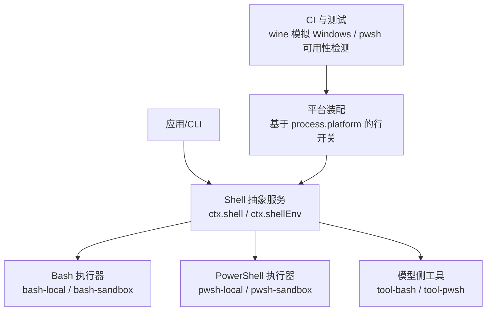
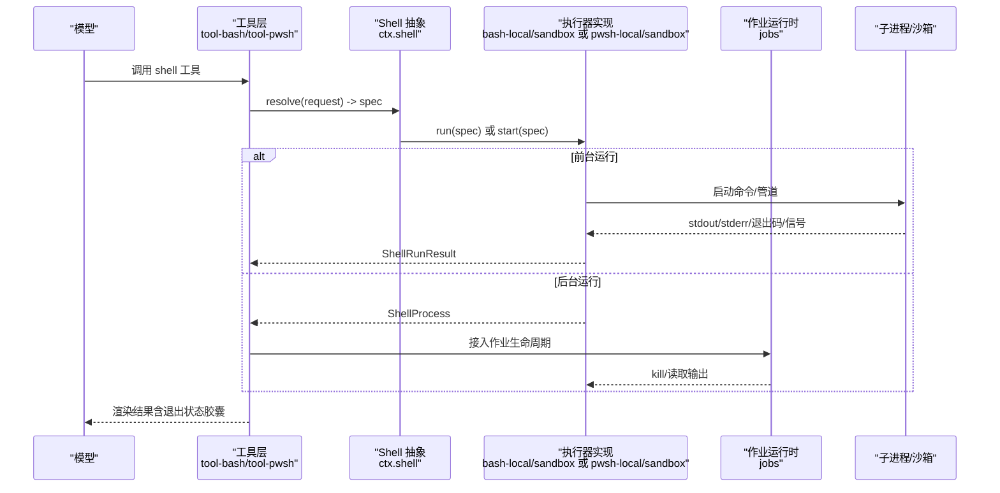
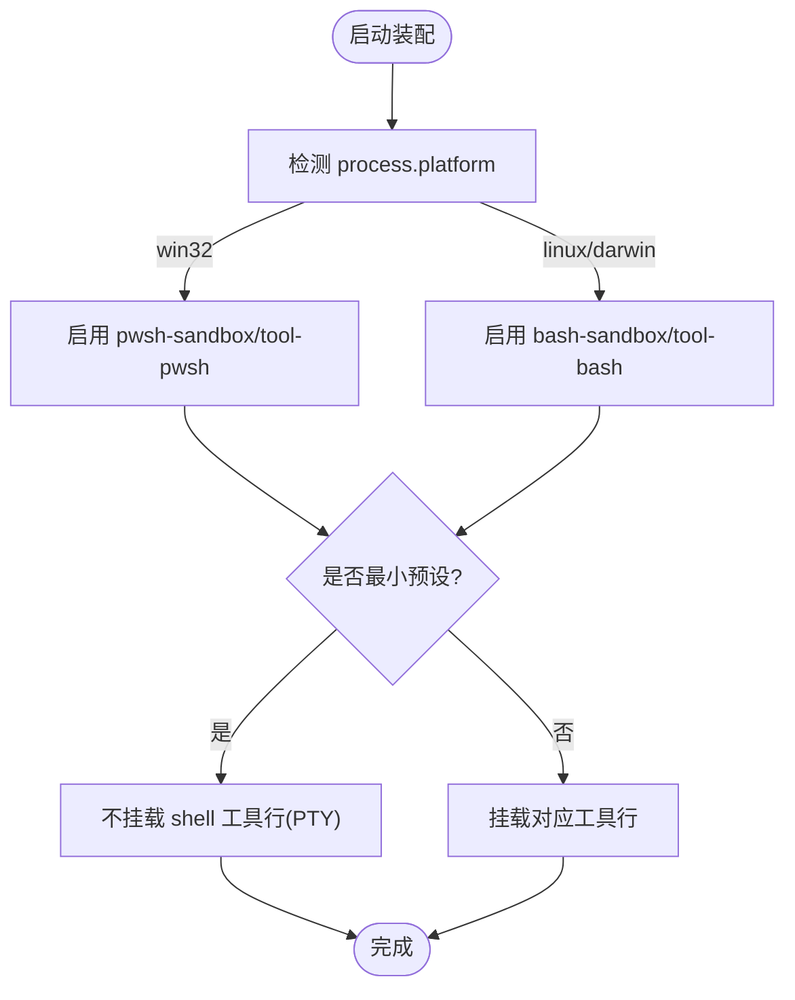
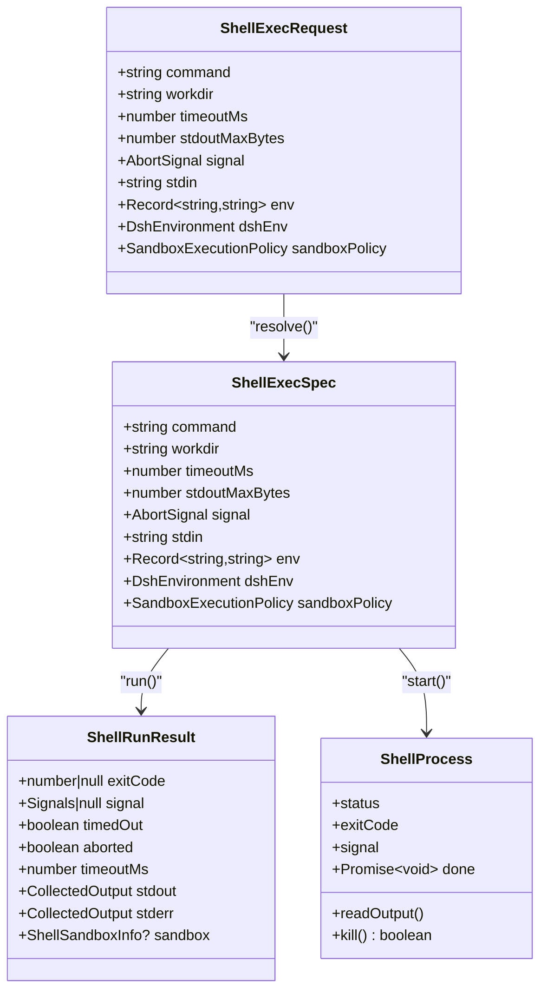
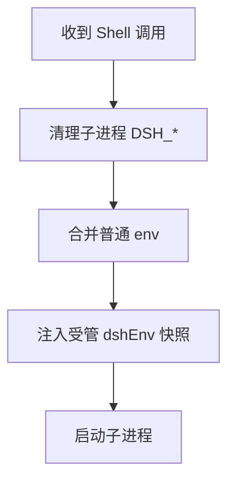
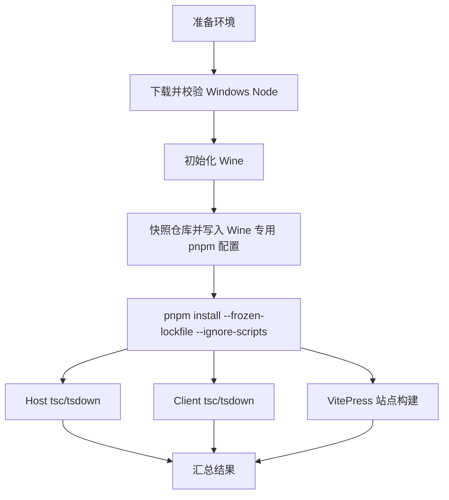
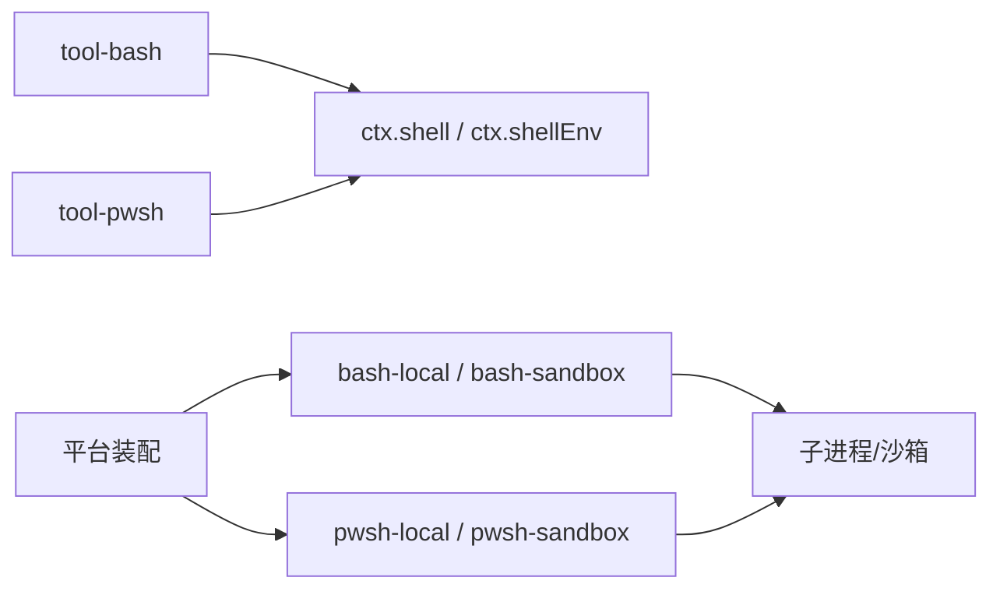

# 跨平台兼容性

<cite>
**本文引用的文件**
- [packages/shell/README.md](file://packages/shell/README.md)
- [docs/subsystems/shell.md](file://docs/subsystems/shell.md)
- [apps/cli/tests/windows-shell.spec.ts](file://apps/cli/tests/windows-shell.spec.ts)
- [scripts/wine-windows-gates.sh](file://scripts/wine-windows-gates.sh)
- [packages/shell/shell-env/README.md](file://packages/shell/shell-env/README.md)
- [docs/testing.md](file://docs/testing.md)
</cite>

## 目录
1. [简介](#简介)
2. [项目结构](#项目结构)
3. [核心组件](#核心组件)
4. [架构总览](#架构总览)
5. [详细组件分析](#详细组件分析)
6. [依赖关系分析](#依赖关系分析)
7. [性能考量](#性能考量)
8. [故障排查指南](#故障排查指南)
9. [结论](#结论)
10. [附录](#附录)

## 简介
本文件面向在 Windows、macOS、Linux 上开发与部署 Shell 工具时的跨平台兼容性问题与解决方案。仓库通过“执行器抽象 + 平台特定实现”的方式，统一暴露 Bash 与 PowerShell 的执行能力，并在不同平台上自动选择最合适的栈：POSIX 使用 Bash，Windows 使用 PowerShell；同时提供沙箱、环境变量管理、输出收集与后台进程等通用能力。文档将结合仓库中的子系统说明、测试与 CI 脚本，给出可操作的实践建议。

## 项目结构
Shell 能力以“服务契约 + 多实现 + 模型侧工具”的分层组织：
- 抽象契约：定义统一的执行接口、请求/规格、结果类型与环境注入通道。
- 执行器实现：本地 Bash 执行器、沙箱化 Bash 执行器、本地 PowerShell 执行器、沙箱化 PowerShell 执行器。
- 环境注册：集中管理受信任的 DSH_* 环境变量，按每次调用重建快照并注入子进程。
- 模型侧工具：向模型暴露 bash/pwsh 工具，负责渲染结果、集成后台任务。
- 平台装配：通过配置行（rows）在构建/启动时根据平台启用或禁用具体栈，确保同一份代码在不同系统上只挂载一套 Shell 栈。

图表来源
- [packages/shell/README.md:1-20](file://packages/shell/README.md#L1-L20)
- [docs/subsystems/shell.md:1-30](file://docs/subsystems/shell.md#L1-L30)
- [apps/cli/tests/windows-shell.spec.ts:43-79](file://apps/cli/tests/windows-shell.spec.ts#L43-L79)

章节来源
- [packages/shell/README.md:1-20](file://packages/shell/README.md#L1-L20)
- [docs/subsystems/shell.md:1-30](file://docs/subsystems/shell.md#L1-L30)
- [apps/cli/tests/windows-shell.spec.ts:43-79](file://apps/cli/tests/windows-shell.spec.ts#L43-L79)

## 核心组件
- Shell 抽象服务（ctx.shell）
  - 职责：resolve/run/start、sandboxMode 能力事实；统一前台运行结果与后台进程句柄语义。
  - 关键点：前台运行不抛异常表示成功，非零退出码/超时/中止均返回结构化结果；后台进程 done 永不拒绝。
- Shell 环境注册（ctx.shellEnv）
  - 职责：维护 DSH_* 命名空间，为每次 shell 调用重建可信环境快照；内置键如 DSH_HOME、DSH_SHELL、DSH_SESSION_ID。
  - 关键点：合并顺序保证受管变量不被覆盖；子进程继承前会清理 DSH_* 再注入新快照。
- 平台装配与工具选择
  - 行为：同一份 patch/rows 中，bash-sandbox/tool-bash 在 win32 禁用，pwsh-sandbox/tool-pwsh 在 POSIX 禁用；最小预设不挂载任何 shell 工具行（走 PTY）。
- 测试与 CI
  - 行为：pwsh 不可用主机跳过 pwsh 相关覆盖率；CI 使用 Wine 在 Linux 下以真实 win-x64 Node 验证 Windows 构建与站点生成。

章节来源
- [docs/subsystems/shell.md:105-221](file://docs/subsystems/shell.md#L105-L221)
- [packages/shell/shell-env/README.md:18-43](file://packages/shell/shell-env/README.md#L18-L43)
- [apps/cli/tests/windows-shell.spec.ts:43-100](file://apps/cli/tests/windows-shell.spec.ts#L43-L100)
- [docs/testing.md:9-13](file://docs/testing.md#L9-L13)

## 架构总览
下图展示一次模型驱动的 Shell 调用从工具到执行器的完整路径，以及平台如何决定使用 Bash 还是 PowerShell。

图表来源
- [docs/subsystems/shell.md:13-16](file://docs/subsystems/shell.md#L13-L16)
- [docs/subsystems/shell.md:105-221](file://docs/subsystems/shell.md#L105-L221)
- [packages/shell/README.md:1-20](file://packages/shell/README.md#L1-L20)

## 详细组件分析

### 平台选择与装配（Windows vs POSIX）
- 规则
  - 共享 patch 集内，bash-sandbox/tool-bash 在 win32 禁用，pwsh-sandbox/tool-pwsh 在 POSIX 禁用。
  - 基础 profile 同样遵循该门控；最小预设不挂载任何 shell 工具行（走 PTY）。
  - 冷启动模块解析需能到达 pwsh 相关包名，以便在 Windows 上正确装载。
- 影响
  - 同一份产物在不同系统自动挂载对应栈，避免重复或冲突。
  - 权限与沙箱面保持不变，仅执行器后端变化。

图表来源
- [apps/cli/tests/windows-shell.spec.ts:43-100](file://apps/cli/tests/windows-shell.spec.ts#L43-L100)

章节来源
- [apps/cli/tests/windows-shell.spec.ts:43-100](file://apps/cli/tests/windows-shell.spec.ts#L43-L100)

### 前台运行结果与后台进程
- 前台运行
  - 结果包含 exitCode、signal、timedOut、aborted、timeoutMs、stdout/stderr 等正交字段；即使退出码为 0，也可能因超时/中止而标记失败。
- 后台进程
  - start 立即返回句柄；done 在进程关闭时解决且从不拒绝；readOutput 增量读取，支持溢出回退文件；kill 幂等。
- 沙箱信息
  - 若由沙箱执行器处理，结果附带 mode、denied、enforcement、runnerFailed 等事实，用于区分策略拒绝与执行器失败。

图表来源
- [docs/subsystems/shell.md:13-99](file://docs/subsystems/shell.md#L13-L99)
- [docs/subsystems/shell.md:105-221](file://docs/subsystems/shell.md#L105-L221)

章节来源
- [docs/subsystems/shell.md:13-99](file://docs/subsystems/shell.md#L13-L99)
- [docs/subsystems/shell.md:105-221](file://docs/subsystems/shell.md#L105-L221)

### 受管环境变量（DSH_*）
- 作用域与合并顺序
  - 每次 shell 调用重建 DSH_* 快照；子进程继承前先清理 DSH_*，再注入当前快照，防止污染。
  - 普通 env 先合并，受管 dshEnv 后合并，确保受管键不会被覆盖。
- 内置键
  - DSH_HOME、DSH_SHELL、DSH_SESSION_ID；当存在持久化 JSONL 时还会注入 DSH_SESSION_JSONL。
- 扩展
  - 插件可注册贡献者，声明键与描述，并提供 per-execution 解析函数；list() 可枚举声明但不执行解析。

图表来源
- [packages/shell/shell-env/README.md:18-43](file://packages/shell/shell-env/README.md#L18-L43)
- [docs/subsystems/shell.md:9-12](file://docs/subsystems/shell.md#L9-L12)

章节来源
- [packages/shell/shell-env/README.md:18-43](file://packages/shell/shell-env/README.md#L18-L43)
- [docs/subsystems/shell.md:9-12](file://docs/subsystems/shell.md#L9-L12)

### Windows 下的 CI 与构建验证（Wine）
- 目标
  - 在 Linux CI 中使用 Wine 运行真实 win-x64 Node，校验构建与生产站点生成。
- 关键步骤
  - 预检工具链（wine、curl、unzip、sha256sum/shasum、pnpm）。
  - 下载并校验 Windows Node 压缩包，初始化 Wine 环境。
  - 快照工作树并追加 Wine 专用 pnpm 配置（hoisted 链接器、supportedArchitectures）。
  - 并行执行 Host/Client 编译与 VitePress 站点构建，捕获日志并报告。
- 注意事项
  - 由于 Wine 无法创建 Windows 符号链接，需在构建前手动建立必要的软链接。
  - 安装阶段遇到 pnpm 并发重命名竞态时会重试并清理 node_modules。

图表来源
- [scripts/wine-windows-gates.sh:1-283](file://scripts/wine-windows-gates.sh#L1-L283)

章节来源
- [scripts/wine-windows-gates.sh:1-283](file://scripts/wine-windows-gates.sh#L1-L283)

## 依赖关系分析
- 耦合点
  - 工具层依赖 Shell 抽象服务；执行器实现依赖子进程与沙箱能力；环境注册被所有 shell 工具消费。
- 外部依赖
  - Windows 场景依赖 pwsh；POSIX 场景依赖 bash；CI 依赖 Wine 与 Node 分发源。
- 循环依赖
  - 通过 Cordis 插件机制与分层解耦，未见直接循环导入；平台门控在装配层生效。

图表来源
- [packages/shell/README.md:1-20](file://packages/shell/README.md#L1-L20)
- [docs/subsystems/shell.md:1-30](file://docs/subsystems/shell.md#L1-L30)

章节来源
- [packages/shell/README.md:1-20](file://packages/shell/README.md#L1-L20)
- [docs/subsystems/shell.md:1-30](file://docs/subsystems/shell.md#L1-L30)

## 性能考量
- 前台输出上限
  - 通过 stdoutMaxBytes 控制前台输出预算，避免内存膨胀；超出部分转储至安全文件。
- 后台增量读取
  - readOutput 返回增量 delta，避免重复读取；lossy 标志指示数据丢失及回退文件位置。
- 超时与中止
  - 统一由单一截止时间驱动超时与中止，避免竞态导致的重复终止；结果中标记首个原因。
- 沙箱开销
  - 沙箱模式可能引入额外隔离成本；在可用后端不可用时抛出明确错误，便于快速降级或提示。

[本节为通用指导，无需列出具体文件]

## 故障排查指南
- 常见症状与定位
  - 在 Windows 上无法执行 PowerShell：确认已启用 pwsh 且 CI/本地具备 pwsh；否则 pwsh 相关套件自跳过。
  - 在 POSIX 上无法执行 Bash：检查 PATH 与 bash 版本；确认未误禁 tool-bash。
  - 环境变量未生效：确认 DSH_* 未被父进程污染；检查 dshEnv 合并顺序与贡献者是否注册。
  - 构建失败（Wine）：检查 wine 工具链、Node 缓存、pnpm 安装日志；必要时清理 node_modules 重试。
- 建议操作
  - 使用最小复现组合（仅加载必要 rows），逐步缩小问题范围。
  - 开启详细日志并保留临时目录（如设置 DSH_WINE_GATE_KEEP=1）进行离线分析。
  - 对关键路径增加断言：例如验证最终平台、进程族、输出截断与回退文件路径。

章节来源
- [docs/testing.md:9-13](file://docs/testing.md#L9-L13)
- [scripts/wine-windows-gates.sh:1-283](file://scripts/wine-windows-gates.sh#L1-L283)

## 结论
本项目通过抽象执行器、平台装配与受管环境，实现了 Bash/PowerShell 的统一跨平台体验。开发时应遵循“平台门控 + 沙箱策略 + 环境变量隔离”的原则；测试应覆盖单元、覆盖率、e2e 与快照，并使用 Wine 在 Linux 上验证 Windows 构建。部署时确保目标平台具备相应 Shell 与依赖，并通过 CI 门禁保障一致性。

[本节为总结性内容，无需列出具体文件]

## 附录
- 最佳实践清单
  - 始终通过 ctx.shell.resolve 构造执行规格，不要绕过默认值与上限。
  - 使用 ctx.shellEnv 注入受管变量，避免直接修改 process.env。
  - 在 Windows 优先使用 PowerShell 工具；POSIX 优先使用 Bash；最小预设走 PTY。
  - 对前台输出设置合理预算，关注 lossy 标志与回退文件。
  - 后台任务通过 jobs 管理生命周期，利用 kill 与 done 做优雅关停。
  - 在 CI 中保持 pwsh 可用性或使用 Wine 验证 Windows 构建。
- 参考路径
  - 子系统说明：[docs/subsystems/shell.md](file://docs/subsystems/shell.md)
  - Shell 能力概览：[packages/shell/README.md](file://packages/shell/README.md)
  - 环境注册：[packages/shell/shell-env/README.md](file://packages/shell/shell-env/README.md)
  - 平台装配测试：[apps/cli/tests/windows-shell.spec.ts](file://apps/cli/tests/windows-shell.spec.ts)
  - Wine 构建门禁：[scripts/wine-windows-gates.sh](file://scripts/wine-windows-gates.sh)
  - 测试策略：[docs/testing.md](file://docs/testing.md)

[本节为参考索引，无需列出具体文件]