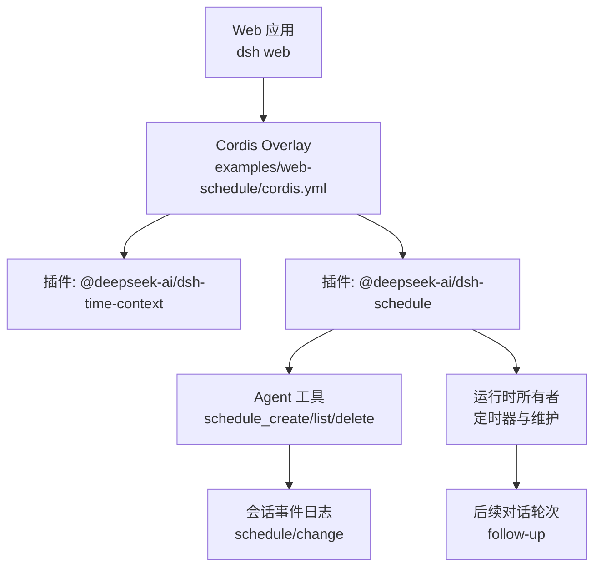
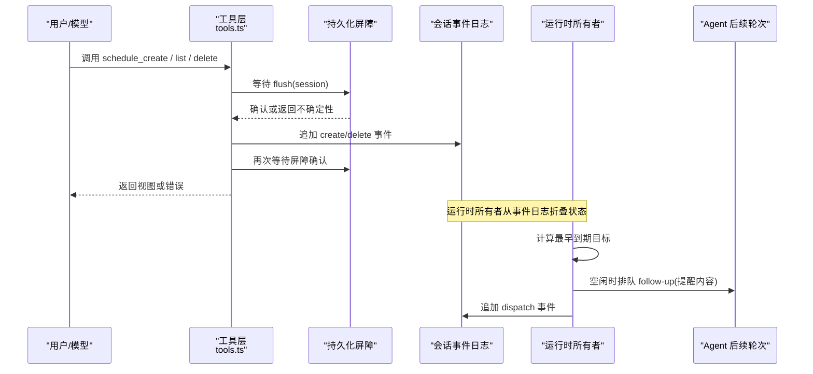
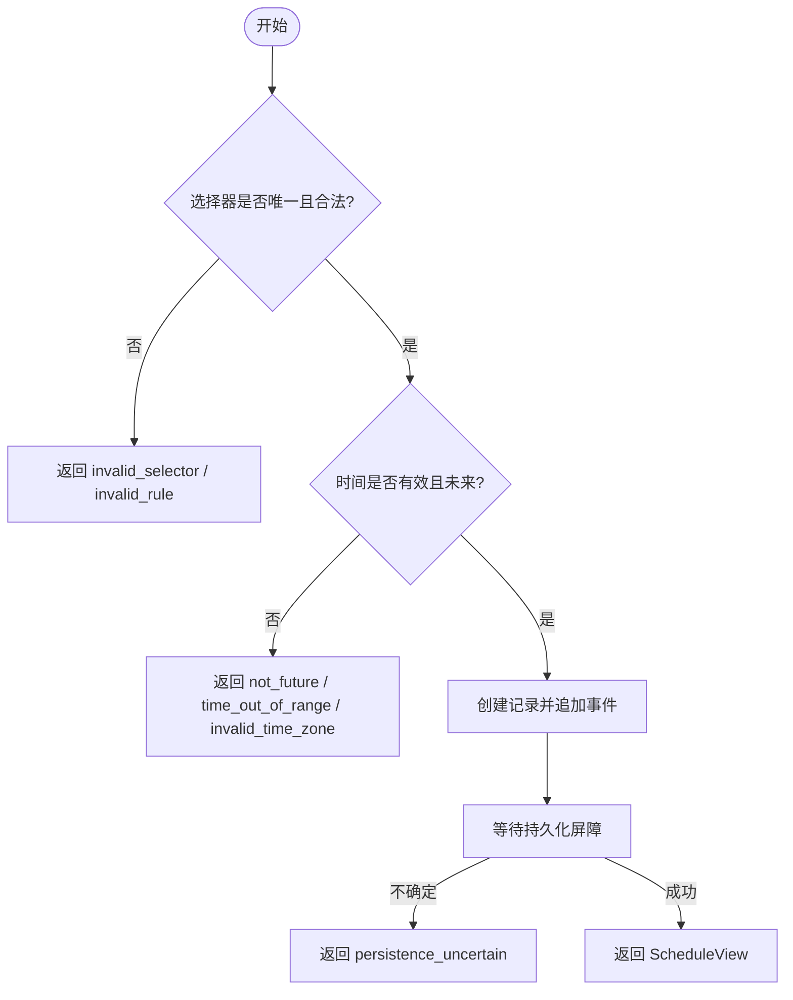
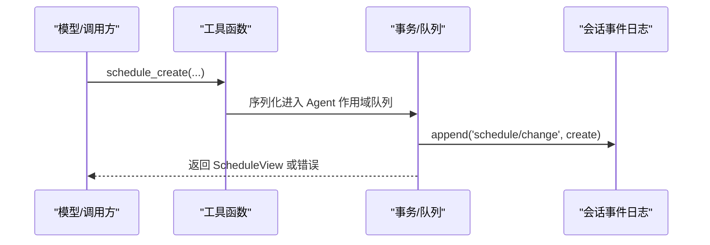
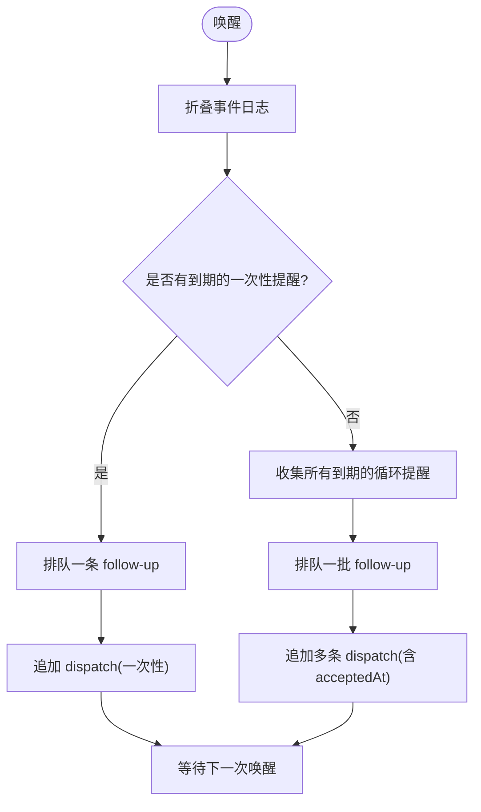
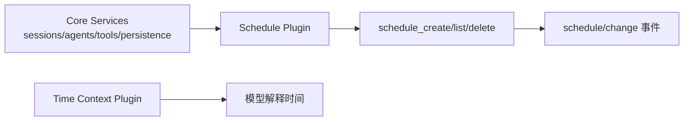

# Web 调度器集成

<cite>
**本文引用的文件**
- [packages/schedule/schedule/README.md](file://packages/schedule/schedule/README.md)
- [packages/schedule/schedule/src/types.ts](file://packages/schedule/schedule/src/types.ts)
- [packages/schedule/schedule/src/tools.ts](file://packages/schedule/schedule/src/tools.ts)
- [docs/subsystems/schedule.md](file://docs/subsystems/schedule.md)
- [examples/web-schedule/cordis.yml](file://examples/web-schedule/cordis.yml)
- [examples/web-schedule/README.md](file://examples/web-schedule/README.md)
</cite>

## 目录
1. [简介](#简介)
2. [项目结构](#项目结构)
3. [核心组件](#核心组件)
4. [架构总览](#架构总览)
5. [详细组件分析](#详细组件分析)
6. [依赖关系分析](#依赖关系分析)
7. [性能考虑](#性能考虑)
8. [故障排除指南](#故障排除指南)
9. [结论](#结论)
10. [附录](#附录)

## 简介
本文件面向希望在 Web 应用中通过 Cordis 配置集成任务调度的开发者，系统说明如何在 Web 环境中启用并管理“会话级”的定时提醒与周期性任务。该能力由 `@deepseek-ai/dsh-schedule` 提供，以“会话事件日志”作为持久化载体，在会话存活期间按规则触发后续对话轮次，实现“定时任务、事件驱动任务（基于会话事件）和依赖任务（通过工具调用顺序）”的统一编排体验。

- 调度范围：仅在当前会话存活时运行；会话冷启动后恢复等待，不会发送外部通知。
- 触发方式：支持延迟触发、绝对时间触发、固定间隔循环触发。
- 交付形态：通过 Agent 的普通 follow-up 进入同一对话，不引入独立 UI 或外部通道。
- 配置方式：通过 Cordis overlay 注入 time-context 与 schedule 插件，即可在 Web 中启用。

## 项目结构
- 调度能力位于 `packages/schedule/schedule`，包含类型定义、工具注册、事务与持久化协调等。
- Web 侧示例位于 `examples/web-schedule`，展示如何通过 Cordis overlay 启用调度。
- 子系统文档位于 `docs/subsystems/schedule.md`，描述数据模型、变更事件、投递边界与错误码。

图表来源
- [examples/web-schedule/cordis.yml:1-10](file://examples/web-schedule/cordis.yml#L1-L10)
- [packages/schedule/schedule/README.md:7-13](file://packages/schedule/schedule/README.md#L7-L13)
- [packages/schedule/schedule/src/tools.ts:299-468](file://packages/schedule/schedule/src/tools.ts#L299-L468)

章节来源
- [examples/web-schedule/README.md:1-20](file://examples/web-schedule/README.md#L1-L20)
- [packages/schedule/schedule/README.md:1-14](file://packages/schedule/schedule/README.md#L1-L14)

## 核心组件
- 类型与数据模型：定义提醒记录、输入选择器、视图与错误类型。
- 工具层：暴露三个 Agent 工具用于创建、列出、删除提醒。
- 事务与持久化：所有读写先等待会话持久化屏障，确保一致性。
- 运行时所有者：维护定时器，计算到期任务，排队 follow-up 并追加派发事件。

章节来源
- [packages/schedule/schedule/src/types.ts:1-222](file://packages/schedule/schedule/src/types.ts#L1-L222)
- [packages/schedule/schedule/src/tools.ts:1-468](file://packages/schedule/schedule/src/tools.ts#L1-L468)
- [docs/subsystems/schedule.md:1-187](file://docs/subsystems/schedule.md#L1-L187)

## 架构总览
调度器以“会话事件日志”为唯一权威状态源。工具调用写入 `schedule/change` 事件；运行时所有者监听并折叠事件，根据当前时间与规则计算到期任务，将结果以用户角色消息形式插入后续对话轮次。

图表来源
- [packages/schedule/schedule/src/tools.ts:237-468](file://packages/schedule/schedule/src/tools.ts#L237-L468)
- [docs/subsystems/schedule.md:100-187](file://docs/subsystems/schedule.md#L100-L187)

## 详细组件分析

### 配置与集成（Cordis Overlay）
- 通过 overlay 插入 `time-context` 与 `schedule` 两个插件，使 Web 进程具备时间上下文感知与调度能力。
- 加载时机：插件会监听之后的 `agent/created` 事件，仅对之后创建的根 Agent 生效。
- 使用方式：在启动 Web 时传入 patch 参数加载 overlay。

章节来源
- [examples/web-schedule/cordis.yml:1-10](file://examples/web-schedule/cordis.yml#L1-L10)
- [examples/web-schedule/README.md:1-20](file://examples/web-schedule/README.md#L1-L20)
- [packages/schedule/schedule/README.md:7-13](file://packages/schedule/schedule/README.md#L7-L13)

### 任务定义格式与触发机制
- 三种规则：
  - 延迟触发：`after_seconds`，正安全整数秒。
  - 绝对时间触发：`at`，RFC 3339 带偏移字符串，或本地日历对象 `{date, time, time_zone}`。
  - 固定间隔循环：`every_seconds`，至少 300 秒，按创建时间锚点对齐。
- 输入校验：拒绝无效时区、非未来时间、重叠区间、频率过高、非法字段等。
- 输出视图：每条活跃提醒包含 id、prompt、scheduledAt、state（scheduled/overdue）、deliveryMode（session-local）。

图表来源
- [packages/schedule/schedule/src/tools.ts:252-394](file://packages/schedule/schedule/src/tools.ts#L252-L394)
- [packages/schedule/schedule/src/types.ts:52-119](file://packages/schedule/schedule/src/types.ts#L52-L119)
- [docs/subsystems/schedule.md:67-99](file://docs/subsystems/schedule.md#L67-L99)

章节来源
- [packages/schedule/schedule/src/types.ts:1-222](file://packages/schedule/schedule/src/types.ts#L1-L222)
- [packages/schedule/schedule/src/tools.ts:252-394](file://packages/schedule/schedule/src/tools.ts#L252-L394)
- [docs/subsystems/schedule.md:67-99](file://docs/subsystems/schedule.md#L67-L99)

### 工具 API 与执行流程
- 工具列表：
  - `schedule_create(prompt, { after_seconds | at | every_seconds })`
  - `schedule_list()`
  - `schedule_delete(id)`
- 执行要点：
  - 每个操作先等待会话持久化屏障，避免读取未提交状态。
  - 创建/删除成功后再次等待屏障确认。
  - 工具返回值遵循严格 schema，错误以稳定 code 返回。

图表来源
- [packages/schedule/schedule/src/tools.ts:299-468](file://packages/schedule/schedule/src/tools.ts#L299-L468)

章节来源
- [packages/schedule/schedule/src/tools.ts:299-468](file://packages/schedule/schedule/src/tools.ts#L299-L468)

### 运行时所有者与投递生命周期
- 定时器策略：拆分长等待，每次唤醒重读墙钟，处理回滚与跳变。
- 到期处理：单条一次性提醒优先；若无一次性提醒，则将所有到期的循环提醒合并为一个批次。
- 投递形态：以用户角色消息插入后续对话轮次，不中断当前轮次，不 steering。
- 派发记录：追加 `dispatch` 事件，表示已排队，不代表模型成功或用户已读。

图表来源
- [docs/subsystems/schedule.md:180-187](file://docs/subsystems/schedule.md#L180-L187)
- [packages/schedule/schedule/README.md:37-46](file://packages/schedule/schedule/README.md#L37-L46)

章节来源
- [docs/subsystems/schedule.md:180-187](file://docs/subsystems/schedule.md#L180-L187)
- [packages/schedule/schedule/README.md:37-46](file://packages/schedule/schedule/README.md#L37-L46)

### 依赖任务与事件驱动模式
- 依赖任务：通过工具调用顺序实现。例如先 `schedule_create` 获取 id，再 `schedule_delete` 取消；或在业务逻辑中依据前一步结果决定下一步。
- 事件驱动：调度器本身消费会话事件日志中的 `schedule/change` 事件进行状态折叠与决策；上层业务也可基于会话其他事件编排工作流。

章节来源
- [packages/schedule/schedule/src/tools.ts:299-468](file://packages/schedule/schedule/src/tools.ts#L299-L468)
- [docs/subsystems/schedule.md:100-153](file://docs/subsystems/schedule.md#L100-L153)

### 错误处理策略
- 输入错误：`invalid_prompt`、`invalid_selector`、`invalid_rule`、`invalid_time_zone`、`not_future`、`time_out_of_range`、`frequency_too_high`。
- 数据完整性：`corrupt_schedule_log`。
- 持久化不确定性：`persistence_uncertain`，建议重试并以 `schedule_list` 为准。
- 兜底错误：`internal_error`。

章节来源
- [packages/schedule/schedule/src/types.ts:124-198](file://packages/schedule/schedule/src/types.ts#L124-L198)
- [packages/schedule/schedule/src/tools.ts:176-228](file://packages/schedule/schedule/src/tools.ts#L176-L228)

## 依赖关系分析
- 插件加载顺序：需先有 sessions、agents、tools、sessionPersistence 以及持久化监听器。
- 时间上下文：可选但推荐，帮助模型理解自然语言时间；调度器不读取浏览器/会话默认时区。
- 工具注册：在 agent 作用域内注册，仅对之后创建的根 Agent 生效。

图表来源
- [packages/schedule/schedule/README.md:7-13](file://packages/schedule/schedule/README.md#L7-L13)
- [examples/web-schedule/cordis.yml:1-10](file://examples/web-schedule/cordis.yml#L1-L10)

章节来源
- [packages/schedule/schedule/README.md:7-13](file://packages/schedule/schedule/README.md#L7-L13)
- [examples/web-schedule/cordis.yml:1-10](file://examples/web-schedule/cordis.yml#L1-L10)

## 性能考虑
- 最小循环间隔：至少 300 秒，避免高频定时器开销。
- 批处理：多个到期的循环提醒合并为一次 follow-up，减少模型轮次。
- 只保留最新错过项：过期循环提醒仅呈现最新一次，不回放积压。
- 空闲期维护：仅在 Agent 完全空闲时执行维护任务，不抢占当前对话。
- 持久化屏障：所有关键路径等待 flush，保证一致性与可恢复性。

章节来源
- [docs/subsystems/schedule.md:92-99](file://docs/subsystems/schedule.md#L92-L99)
- [packages/schedule/schedule/README.md:37-46](file://packages/schedule/schedule/README.md#L37-L46)

## 故障排除指南
- 无法创建/删除：检查是否满足唯一选择器、时间在未来、时区有效、频率不低于 300 秒。
- 持久化不确定：遇到 `persistence_uncertain` 时，先调用 `schedule_list` 确认实际状态，再决定是否重试。
- 提醒未出现：确认会话处于活跃状态；冷会话恢复后会重新计算并投递过期提醒。
- 重复提醒：在同步排队后、持久化前崩溃可能重复；系统不承诺恰好一次。
- 时区问题：`at` 必须显式指定偏移或 IANA 时区；不要依赖浏览器默认时区。

章节来源
- [packages/schedule/schedule/src/tools.ts:252-468](file://packages/schedule/schedule/src/tools.ts#L252-L468)
- [docs/subsystems/schedule.md:67-99](file://docs/subsystems/schedule.md#L67-L99)
- [docs/subsystems/schedule.md:180-187](file://docs/subsystems/schedule.md#L180-L187)

## 结论
通过 Cordis overlay 将 `@deepseek-ai/dsh-schedule` 与 `@deepseek-ai/dsh-time-context` 注入 Web 应用，即可获得会话级、可持久化的定时与周期任务能力。它以会话事件日志为核心，结合工具与运行时所有者，实现了可靠、可控、低侵入的任务调度与交付。对于 Web 场景，建议在模型层配合时间上下文，明确传递时区信息，并通过工具顺序构建依赖任务与工作流。

## 附录

### 完整配置文件示例（Cordis Overlay）
- 启用 time-context 与 schedule 插件，使 Web 进程具备调度能力。
- 启动命令参考示例 README。

章节来源
- [examples/web-schedule/cordis.yml:1-10](file://examples/web-schedule/cordis.yml#L1-L10)
- [examples/web-schedule/README.md:1-20](file://examples/web-schedule/README.md#L1-L20)

### 任务定义与触发速查
- 延迟触发：`after_seconds`（正安全整数秒）
- 绝对时间触发：`at`（RFC 3339 带偏移字符串 或 `{date,time,time_zone}`）
- 固定间隔循环：`every_seconds`（≥300 秒，创建时间对齐）

章节来源
- [packages/schedule/schedule/src/types.ts:52-119](file://packages/schedule/schedule/src/types.ts#L52-L119)
- [docs/subsystems/schedule.md:67-99](file://docs/subsystems/schedule.md#L67-L99)

### Web 界面管理与监控建议
- 使用 `schedule_list` 获取活跃提醒及其状态（scheduled/overdue），用于渲染列表与倒计时。
- 使用 `schedule_delete` 取消不再需要的提醒。
- 注意：提醒以普通对话消息形式出现，无独立卡片或外部通知；需在 UI 中引导用户查看对话历史。

章节来源
- [packages/schedule/schedule/src/tools.ts:299-468](file://packages/schedule/schedule/src/tools.ts#L299-L468)
- [docs/subsystems/schedule.md:154-187](file://docs/subsystems/schedule.md#L154-L187)