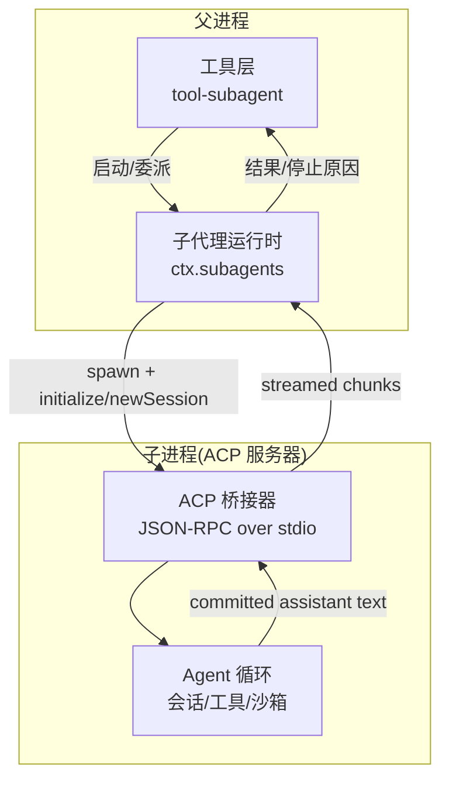
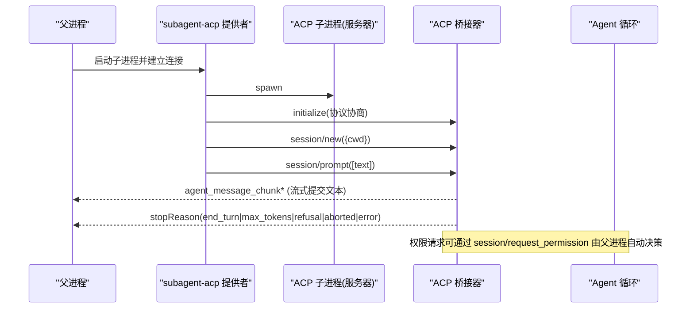
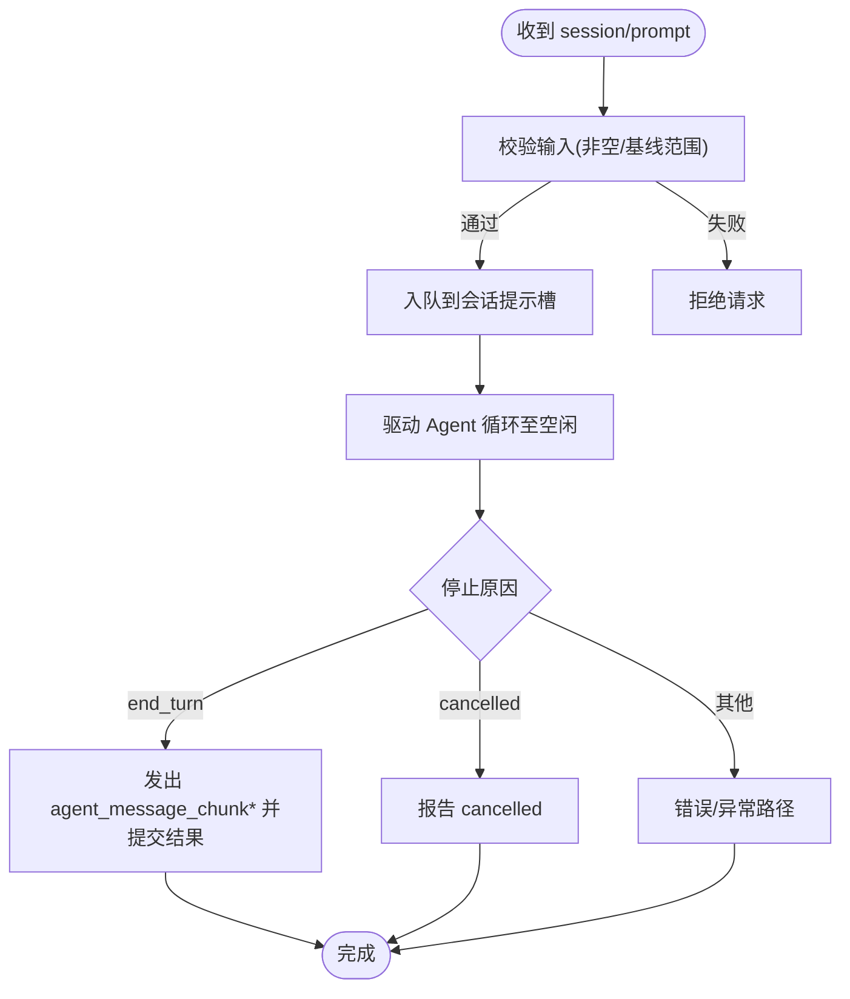
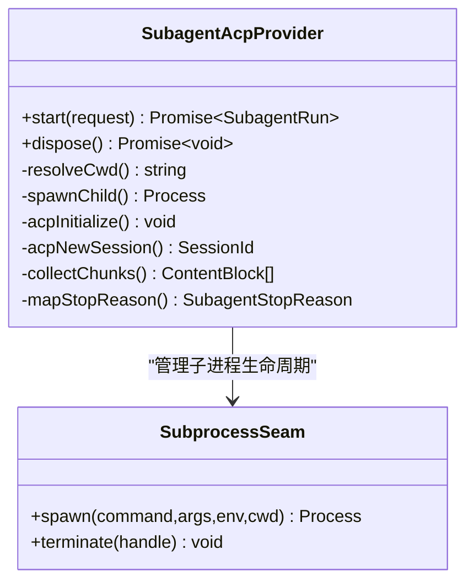
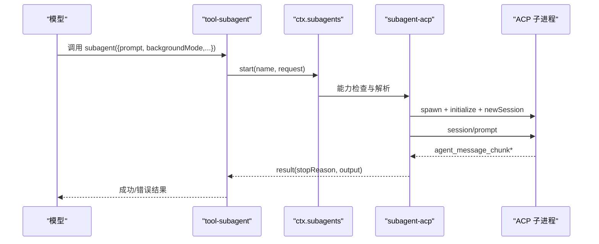
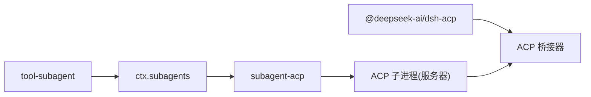

# ACP 子代理

<cite>
**本文引用的文件**
- [examples/acp-agent/README.md](file://examples/acp-agent/README.md)
- [examples/acp-agent/cordis.yml](file://examples/acp-agent/cordis.yml)
- [packages/acp/README.md](file://packages/acp/README.md)
- [packages/acp/acp/README.md](file://packages/acp/acp/README.md)
- [packages/subagent/README.md](file://packages/subagent/README.md)
- [docs/subsystems/subagent.md](file://docs/subsystems/subagent.md)
- [packages/subagent/subagent-acp/README.md](file://packages/subagent/subagent-acp/README.md)
- [packages/subagent/tool-subagent/README.md](file://packages/subagent/tool-subagent/README.md)
- [examples/acp-agent/tests/fixtures/subagent/subagent-acp/cordis.yml](file://examples/acp-agent/tests/fixtures/subagent/subagent-acp/cordis.yml)
- [examples/acp-agent/tests/acp.e2e.ts](file://examples/acp-agent/tests/acp.e2e.ts)
</cite>

## 目录
1. [简介](#简介)
2. [项目结构](#项目结构)
3. [核心组件](#核心组件)
4. [架构总览](#架构总览)
5. [详细组件分析](#详细组件分析)
6. [依赖关系分析](#依赖关系分析)
7. [性能考量](#性能考量)
8. [故障排查指南](#故障排查指南)
9. [结论](#结论)
10. [附录：配置与示例](#附录配置与示例)

## 简介
ACP（Agent Client Protocol）子代理通过 JSON-RPC over stdio 将 Harness 暴露为自动化服务端，供父代理、子代理提供者或其他程序化客户端使用。它专注于跨进程通信协议、会话生命周期、权限请求处理与结果收集，不包含 UI 或人类交互能力。子代理以独立进程运行，拥有独立的运行时、会话、模型配置与工具集，父进程通过 ACP 协议与其通信。

## 项目结构
本仓库中与 ACP 子代理相关的代码与文档分布在以下位置：
- ACP 协议与服务端契约：packages/acp
- 子代理能力族与提供者注册：packages/subagent
- ACP 子代理提供者实现：packages/subagent/subagent-acp
- 面向模型的委托工具：packages/subagent/tool-subagent
- 示例与端到端测试：examples/acp-agent
- 子系统参考文档：docs/subsystems/subagent.md

图表来源
- [packages/subagent/tool-subagent/README.md:7-15](file://packages/subagent/tool-subagent/README.md#L7-L15)
- [packages/subagent/subagent-acp/README.md:7-17](file://packages/subagent/subagent-acp/README.md#L7-L17)
- [packages/acp/acp/README.md:20-44](file://packages/acp/acp/README.md#L20-L44)

章节来源
- [packages/acp/README.md:1-12](file://packages/acp/README.md#L1-L12)
- [packages/subagent/README.md:1-24](file://packages/subagent/README.md#L1-L24)

## 核心组件
- ACP 自动化服务端：提供 initialize、session/new、session/prompt、session/cancel、session/update、session/request_permission 等方法，stdout 仅承载 JSON-RPC 帧。
- 子代理提供者（ACP）：在父进程中 spawn 子进程，执行 initialize → newSession，随后发送 prompt 并收集 committed assistant text，最终映射为子代理结果与停止原因。
- 子代理运行时与工具：负责 provider 注册、能力检查、上下文继承策略、前台/后台/可延续模式选择、并发与结果收集。
- 示例与测试：演示如何启动 ACP 子代理、传递工作目录、验证 stdout 纯净性与真实提示调用。

章节来源
- [packages/acp/acp/README.md:20-44](file://packages/acp/acp/README.md#L20-L44)
- [packages/subagent/subagent-acp/README.md:7-17](file://packages/subagent/subagent-acp/README.md#L7-L17)
- [packages/subagent/tool-subagent/README.md:7-15](file://packages/subagent/tool-subagent/README.md#L7-L15)
- [examples/acp-agent/tests/acp.e2e.ts:14-22](file://examples/acp-agent/tests/acp.e2e.ts#L14-L22)

## 架构总览
ACP 子代理的通信机制基于 JSON-RPC over stdio，父子进程之间通过标准输入输出进行帧级通信。父进程通过 tool-subagent 发起委派，subagent-acp 提供者创建子进程并建立 ACP 连接；子进程作为 ACP 服务器驱动 Agent 循环，返回已提交的助手文本块。权限请求通过 session/request_permission 由父进程按策略自动回答。

图表来源
- [packages/subagent/subagent-acp/README.md:7-17](file://packages/subagent/subagent-acp/README.md#L7-L17)
- [packages/acp/acp/README.md:20-44](file://packages/acp/acp/README.md#L20-L44)

章节来源
- [examples/acp-agent/README.md:14-25](file://examples/acp-agent/README.md#L14-L25)
- [packages/acp/acp/README.md:20-44](file://packages/acp/acp/README.md#L20-L44)

## 详细组件分析

### ACP 协议与服务端
- 方法契约：initialize、authenticate（无认证）、session/new（接受绝对 cwd，拒绝非空 additionalDirectories/mcpServers）、session/prompt（拼接文本块、等待空闲、end_turn/cancelled）、session/cancel、session/update（仅提交消息块）、session/request_permission（一次性允许/拒绝）。
- 生命周期：单连接可拥有多会话；断开时先拒绝新会话/提示，再结算进行中提示，最后并行释放 owned Agents。
- 模型体验：prompt 文本直接拼接为用户消息；资源链接以文本引用形式呈现；权限决策不进入模型请求；提交答案优先保证自动化结果一致性。

图表来源
- [packages/acp/acp/README.md:20-44](file://packages/acp/acp/README.md#L20-L44)

章节来源
- [packages/acp/acp/README.md:20-44](file://packages/acp/acp/README.md#L20-L44)

### ACP 子代理提供者（subagent-acp）
- 启动流程：resolve cwd → spawn → ACP initialize → newSession → 发送 prompt → 收集 agent_message_chunk → 映射停止原因。
- 工作目录：优先使用配置的 cwd 覆盖，否则使用父会话的 cwd；必须为可进入的绝对路径。
- 权限策略：通过 permission 配置自动回答子进程的权限请求（allow/reject），无需人工介入。
- 进程边界：通过 subprocess 通道管理环境变量清理、stderr 继承、EOF 优雅退出与 SIGTERM→SIGKILL 升级。

图表来源
- [packages/subagent/subagent-acp/README.md:7-17](file://packages/subagent/subagent-acp/README.md#L7-L17)
- [packages/subagent/subagent-acp/README.md:58-61](file://packages/subagent/subagent-acp/README.md#L58-L61)

章节来源
- [packages/subagent/subagent-acp/README.md:7-17](file://packages/subagent/subagent-acp/README.md#L7-L17)
- [packages/subagent/subagent-acp/README.md:58-61](file://packages/subagent/subagent-acp/README.md#L58-L61)

### 子代理运行时与工具（tool-subagent）
- 提供者选择：每个插件实例绑定一个 provider 与 toolName；切换 provider 不改变执行契约。
- 生命周期模式：foreground（等待结果）、background one-shot（任务服务管理状态）、continuable（可延续对话，需 prepareContinuable 能力）。
- 并发与顺序：支持并发委派，结果按模型顺序提交；子代理工作在独立会话中，不修改父会话。
- 深度与过滤：maxDepth 可为数值或 'provider-managed'；toolFilter/persona/outputSchema 需要对应 capability。

图表来源
- [packages/subagent/tool-subagent/README.md:7-15](file://packages/subagent/tool-subagent/README.md#L7-L15)
- [docs/subsystems/subagent.md:406-459](file://docs/subsystems/subagent.md#L406-L459)

章节来源
- [packages/subagent/tool-subagent/README.md:7-15](file://packages/subagent/tool-subagent/README.md#L7-L15)
- [docs/subsystems/subagent.md:406-459](file://docs/subsystems/subagent.md#L406-L459)

### 示例与端到端验证
- 示例说明：stdout 仅承载 JSON-RPC；每 session/new 传入绝对 cwd；沙箱与权限模式通过 DSH_PERMISSION_MODE 控制。
- E2E 测试：验证 stdout 纯净性、session/new 成功、真实提示调用与文件系统效果（写入 proof.txt）。

章节来源
- [examples/acp-agent/README.md:14-25](file://examples/acp-agent/README.md#L14-L25)
- [examples/acp-agent/tests/acp.e2e.ts:42-97](file://examples/acp-agent/tests/acp.e2e.ts#L42-L97)
- [examples/acp-agent/tests/acp.e2e.ts:100-126](file://examples/acp-agent/tests/acp.e2e.ts#L100-L126)

## 依赖关系分析
- ACP 包提供协议与服务端契约；subagent-acp 作为 out-of-process 提供者实现；tool-subagent 暴露模型可见的委派工具；示例与测试验证端到端行为。
- 子代理运行时负责 provider 注册、能力检查、会话枚举与可延续子代理管理。

图表来源
- [packages/acp/README.md:1-12](file://packages/acp/README.md#L1-L12)
- [packages/subagent/README.md:1-24](file://packages/subagent/README.md#L1-L24)
- [packages/subagent/subagent-acp/README.md:7-17](file://packages/subagent/subagent-acp/README.md#L7-L17)

章节来源
- [packages/subagent/README.md:1-24](file://packages/subagent/README.md#L1-L24)
- [packages/acp/README.md:1-12](file://packages/acp/README.md#L1-L12)

## 性能考量
- 每次子代理运行均 spawn 新进程，未实现进程池；适合短任务或隔离场景，长驻优化为未来方向。
- 子代理拥有独立上下文与历史，token 成本独立于父进程；KV Cache 仅在子进程内复用相同前缀。
- 建议：
  - 合理设置 maxTokens 与 compaction 阈值，避免过长历史导致延迟上升。
  - 使用 backgroundMode=continuable 进行长时间任务，减少父进程阻塞。
  - 通过 toolFilter 限制工具集，降低子进程复杂度与安全风险。
  - 利用 DSH_PERMISSION_MODE 控制沙箱粒度，减少不必要的权限提升。

[本节为通用指导，不直接分析具体文件]

## 故障排查指南
- stdout 污染：确保子进程仅输出 JSON-RPC 帧；任何日志应走 stderr。E2E 测试会断言 stdout 行均为有效 JSON。
- 权限拒绝：若子进程请求更宽沙箱访问，父进程通过 session/request_permission 自动 allow_once/reject_once；无法获取答案则失败关闭。
- 工作目录错误：确保 cwd 为可进入的绝对路径；子进程与 ACP session 使用该目录作为工作空间。
- 停止原因映射：end_turn→completed，max_tokens→max-tokens，refusal→refusal，cancelled→aborted，其他→error。
- 调试技巧：
  - 启用 DSH_SNAPSHOT=record 记录会话日志以便回放。
  - 使用 DSH_PERMISSION_MODE=danger-full-access 在测试环境放宽权限。
  - 通过示例 cordis.yml 中的 hooks 与日志输出定位问题（注意不要污染 stdout）。

章节来源
- [examples/acp-agent/tests/acp.e2e.ts:42-66](file://examples/acp-agent/tests/acp.e2e.ts#L42-L66)
- [examples/acp-agent/cordis.yml:18-31](file://examples/acp-agent/cordis.yml#L18-L31)
- [packages/subagent/subagent-acp/README.md:48-57](file://packages/subagent/subagent-acp/README.md#L48-L57)

## 结论
ACP 子代理通过标准化协议实现了父/子代理间的可靠通信与权限控制，具备清晰的会话生命周期、安全沙箱与可扩展的工具体系。结合 tool-subagent 的多模式委派与 subagent-acp 的进程隔离，可在自动化场景中灵活部署子代理，并通过配置与环境变量精细控制行为与安全策略。

[本节为总结，不直接分析具体文件]

## 附录：配置与示例

### 启动 ACP 子代理
- 使用示例命令启动自动化服务器；需要 DEEPSEEK_API_KEY（可从 .env 或环境变量注入）。
- 示例组合包含 DeepSeek 适配器、沙箱、bash、审批策略、ACP 应用、压缩、子代理、工作流、hooks 等。

章节来源
- [examples/acp-agent/README.md:7-12](file://examples/acp-agent/README.md#L7-L12)
- [examples/acp-agent/cordis.yml:1-6](file://examples/acp-agent/cordis.yml#L1-L6)

### 通信协议与数据格式
- 协议方法：initialize、session/new、session/prompt、session/cancel、session/update、session/request_permission。
- 数据格式：stdout 仅承载 JSON-RPC 帧；prompt 文本块拼接为用户消息；资源链接以文本引用呈现。

章节来源
- [packages/acp/acp/README.md:20-44](file://packages/acp/acp/README.md#L20-L44)
- [examples/acp-agent/README.md:14-18](file://examples/acp-agent/README.md#L14-L18)

### 权限控制与环境变量
- DSH_PERMISSION_MODE：选择 workspace-write 或 danger-full-access；影响 bash 与文件系统工具的沙箱策略。
- 权限请求：session/request_permission 提供一次性 allow/reject；父进程可自动决策。
- 环境变量：DEEPSEEK_API_KEY、DSH_SNAPSHOT、DSH_SNAPSHOT_SESSIONS_ROOT 等用于模型与持久化配置。

章节来源
- [examples/acp-agent/README.md:20-25](file://examples/acp-agent/README.md#L20-L25)
- [examples/acp-agent/cordis.yml:18-31](file://examples/acp-agent/cordis.yml#L18-L31)
- [examples/acp-agent/cordis.yml:47-64](file://examples/acp-agent/cordis.yml#L47-L64)

### 上下文传递与会话继承
- 工作目录：子代理 cwd 来自配置的覆盖或父会话 cwd；必须为可进入的绝对路径。
- 会话继承：ACP 子代理不继承父会话上下文；fork 模式才携带已完成的前缀历史。
- 测试验证：示例 fixture 通过 MOCK_ECHO_CWD 验证 cwd 继承行为。

章节来源
- [packages/subagent/subagent-acp/README.md:7-17](file://packages/subagent/subagent-acp/README.md#L7-L17)
- [examples/acp-agent/tests/fixtures/subagent/subagent-acp/cordis.yml:1-7](file://examples/acp-agent/tests/fixtures/subagent/subagent-acp/cordis.yml#L1-L7)

### 完整配置示例（路径引用）
- ACP 自动化服务器与后端快照组合：参见 cordis.yml 中的 llm-deepseek、sandbox、approval、acp-agent、compaction、subagent 等条目。
- ACP 子代理提供者配置：参见 subagent-acp README 中的 providerName、command、args、permission、env 等键。
- 测试用最小化组合：参见 fixtures 中的 mock-llm、subagent、subagent-acp、tool-subagent、agent-spine、persistence 等条目。

章节来源
- [examples/acp-agent/cordis.yml:7-193](file://examples/acp-agent/cordis.yml#L7-L193)
- [packages/subagent/subagent-acp/README.md:23-46](file://packages/subagent/subagent-acp/README.md#L23-L46)
- [examples/acp-agent/tests/fixtures/subagent/subagent-acp/cordis.yml:7-56](file://examples/acp-agent/tests/fixtures/subagent/subagent-acp/cordis.yml#L7-L56)

### 错误处理策略
- 停止原因映射：end_turn→completed，max_tokens→max-tokens，refusal→refusal，cancelled→aborted，其他→error。
- 取消与处置：dispose 幂等；先移除信号监听，再请求 ACP 取消，最后执行 EOF 优雅退出与终止升级。
- 父进程错误：启动前取消返回特定错误；其他启动失败透传。

章节来源
- [packages/subagent/subagent-acp/README.md:48-61](file://packages/subagent/subagent-acp/README.md#L48-L61)
- [packages/subagent/tool-subagent/README.md:7-15](file://packages/subagent/tool-subagent/README.md#L7-L15)

### 安全与权限最佳实践
- 默认采用 workspace-write 沙箱，必要时通过 DSH_PERMISSION_MODE 显式切换到危险模式。
- 使用 toolFilter 限制子代理工具集，避免不必要的能力暴露。
- 通过 session/request_permission 集中管理一次性权限，避免持久化策略泄露。
- 保持 stdout 纯净，所有诊断输出走 stderr，防止协议污染。

章节来源
- [examples/acp-agent/cordis.yml:18-31](file://examples/acp-agent/cordis.yml#L18-L31)
- [packages/subagent/tool-subagent/README.md:15-28](file://packages/subagent/tool-subagent/README.md#L15-L28)
- [examples/acp-agent/README.md:14-25](file://examples/acp-agent/README.md#L14-L25)